# API参考文档

<cite>
**本文档引用的文件**
- [main.py](file://openfoam_ai/main.py)
- [manager_agent.py](file://openfoam_ai/agents/manager_agent.py)
- [prompt_engine.py](file://openfoam_ai/agents/prompt_engine.py)
- [case_manager.py](file://openfoam_ai/core/case_manager.py)
- [openfoam_runner.py](file://openfoam_ai/core/openfoam_runner.py)
- [validators.py](file://openfoam_ai/core/validators.py)
- [file_generator.py](file://openfoam_ai/core/file_generator.py)
- [physics_validation_agent.py](file://openfoam_ai/agents/physics_validation_agent.py)
- [cli_interface.py](file://openfoam_ai/ui/cli_interface.py)
- [memory_manager.py](file://openfoam_ai/memory/memory_manager.py)
- [session_manager.py](file://openfoam_ai/memory/session_manager.py)
- [system_constitution.yaml](file://openfoam_ai/config/system_constitution.yaml)
- [utils.py](file://openfoam_ai/core/utils.py)
</cite>

## 目录
1. [简介](#简介)
2. [项目结构](#项目结构)
3. [核心组件](#核心组件)
4. [架构概览](#架构概览)
5. [详细组件分析](#详细组件分析)
6. [依赖关系分析](#依赖关系分析)
7. [性能考虑](#性能考虑)
8. [故障排除指南](#故障排除指南)
9. [结论](#结论)

## 简介

OpenFOAM AI项目是一个基于大语言模型的自动化CFD仿真智能体系统。该项目提供了完整的CFD仿真工作流程，从自然语言描述到最终的仿真结果验证，实现了智能化的算例生成、执行和验证。

本项目的核心价值在于：
- **智能化配置生成**：通过LLM将自然语言转换为结构化的CFD配置
- **自动化算例管理**：完整的算例生命周期管理
- **物理约束验证**：基于项目宪法的硬约束验证系统
- **记忆性建模**：支持相似性检索和增量修改
- **多轮对话交互**：提供友好的CLI交互界面

## 项目结构

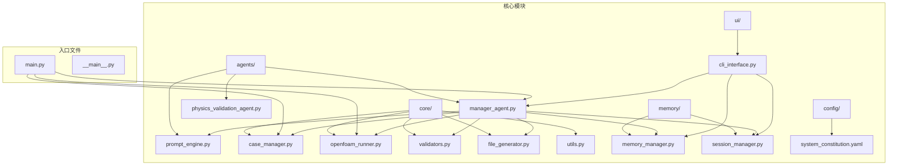

**图表来源**
- [main.py:1-251](file://openfoam_ai/main.py#L1-L251)
- [manager_agent.py:1-458](file://openfoam_ai/agents/manager_agent.py#L1-L458)
- [prompt_engine.py:1-616](file://openfoam_ai/agents/prompt_engine.py#L1-L616)

**章节来源**
- [main.py:1-251](file://openfoam_ai/main.py#L1-L251)
- [system_constitution.yaml:1-103](file://openfoam_ai/config/system_constitution.yaml#L1-L103)

## 核心组件

### ManagerAgent - 管理代理

ManagerAgent是系统的核心协调器，负责：
- 用户输入处理和意图识别
- 任务计划生成和执行
- 多Agent协调和状态管理
- 与用户交互和确认机制

**主要接口规范**：

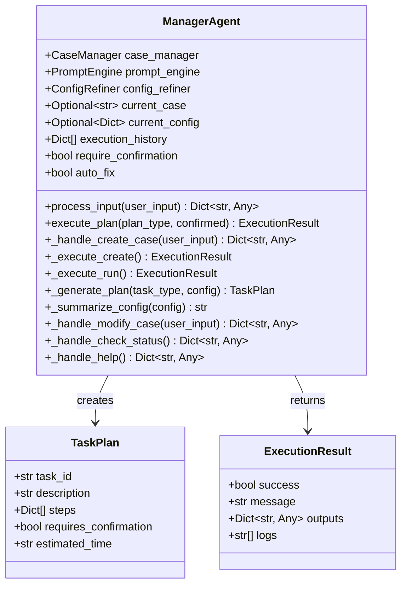

**图表来源**
- [manager_agent.py:38-458](file://openfoam_ai/agents/manager_agent.py#L38-L458)

**章节来源**
- [manager_agent.py:38-458](file://openfoam_ai/agents/manager_agent.py#L38-L458)

### PromptEngine - 提示词引擎

PromptEngine负责与LLM交互，将自然语言转换为结构化配置：
- 系统提示词模板管理
- JSON配置生成
- 多轮对话上下文处理
- Mock模式支持

**主要接口规范**：

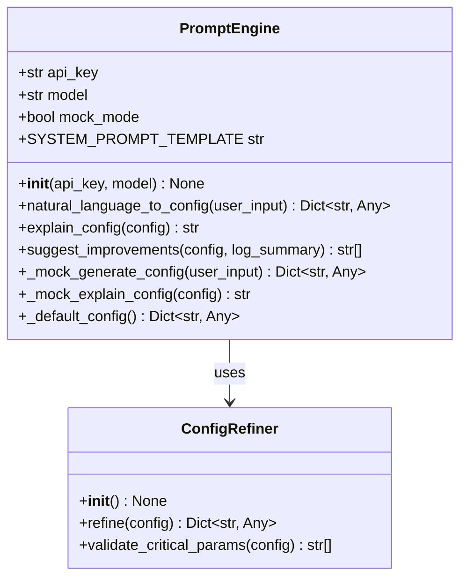

**图表来源**
- [prompt_engine.py:20-616](file://openfoam_ai/agents/prompt_engine.py#L20-L616)

**章节来源**
- [prompt_engine.py:20-616](file://openfoam_ai/agents/prompt_engine.py#L20-L616)

### CaseManager - 算例管理器

CaseManager负责OpenFOAM算例的完整生命周期管理：
- 算例目录结构创建
- 算例信息管理
- 算例状态跟踪
- 算例清理和维护

**主要接口规范**：

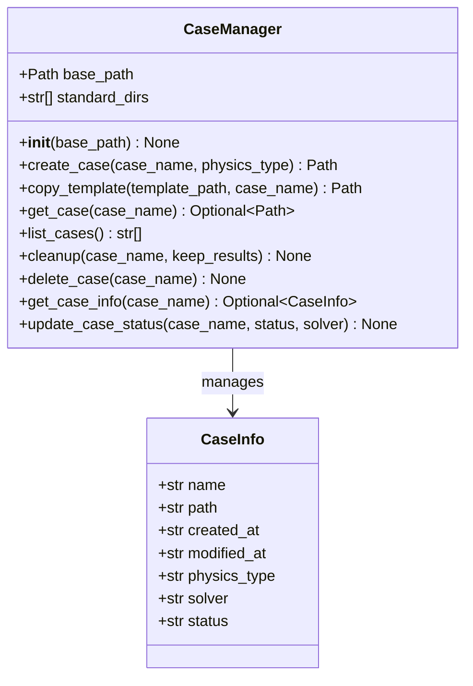

**图表来源**
- [case_manager.py:27-639](file://openfoam_ai/core/case_manager.py#L27-L639)

**章节来源**
- [case_manager.py:27-639](file://openfoam_ai/core/case_manager.py#L27-L639)

### OpenFOAMRunner - OpenFOAM执行器

OpenFOAMRunner封装了OpenFOAM命令的执行和监控：
- 预处理命令执行（blockMesh, checkMesh）
- 求解器运行和实时监控
- 日志解析和指标提取
- 异常检测和处理

**主要接口规范**：

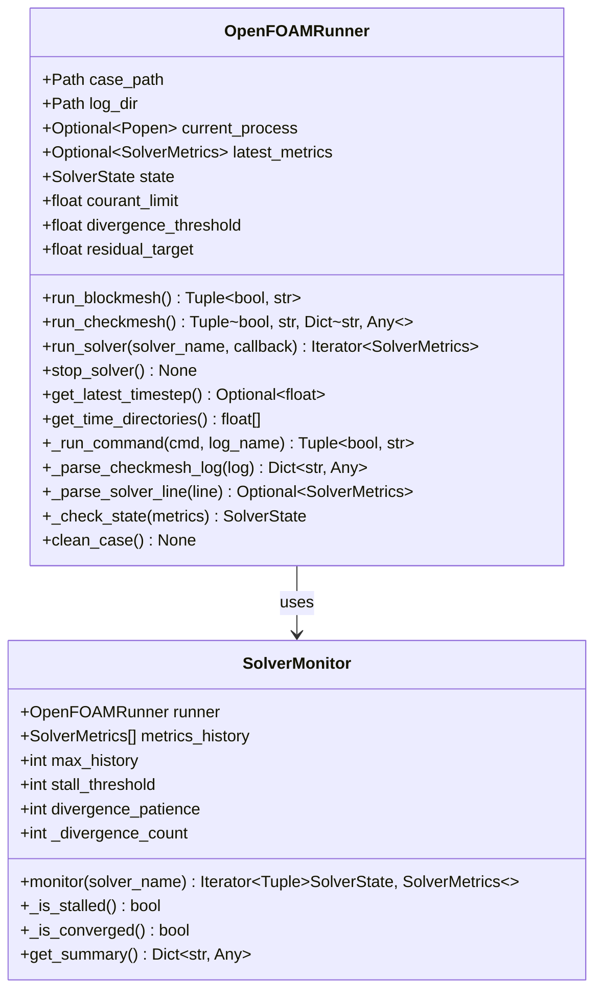

**图表来源**
- [openfoam_runner.py:44-548](file://openfoam_ai/core/openfoam_runner.py#L44-L548)

**章节来源**
- [openfoam_runner.py:44-548](file://openfoam_ai/core/openfoam_runner.py#L44-L548)

### PhysicsValidator - 物理验证器

PhysicsValidator实现后处理阶段的物理验证：
- 质量守恒验证
- 能量守恒验证
- 收敛性检查
- 边界条件兼容性检查

**主要接口规范**：

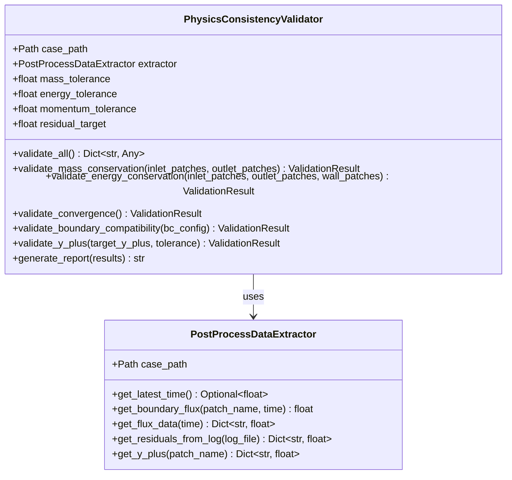

**图表来源**
- [physics_validation_agent.py:174-517](file://openfoam_ai/agents/physics_validation_agent.py#L174-L517)

**章节来源**
- [physics_validation_agent.py:174-517](file://openfoam_ai/agents/physics_validation_agent.py#L174-L517)

## 架构概览

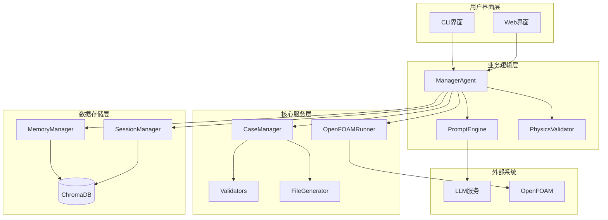

**图表来源**
- [manager_agent.py:1-458](file://openfoam_ai/agents/manager_agent.py#L1-L458)
- [cli_interface.py:17-401](file://openfoam_ai/ui/cli_interface.py#L17-L401)

## 详细组件分析

### ManagerAgent 详细分析

#### 核心方法接口

**process_input 方法**
- **功能**：处理用户输入并识别意图
- **参数**：`user_input: str` - 用户的自然语言输入
- **返回**：`Dict[str, Any]` - 响应字典，包含类型、消息和相关数据
- **处理流程**：
  1. 意图识别（create/modify/run/status/help/unknown）
  2. 调用相应的处理方法
  3. 返回标准化响应格式

**execute_plan 方法**
- **功能**：执行已确认的计划
- **参数**：
  - `plan_type: str` - 计划类型（create/run）
  - `confirmed: bool` - 是否已确认
- **返回**：`ExecutionResult` - 执行结果对象
- **错误处理**：支持确认机制和错误回滚

#### 执行流程序列图

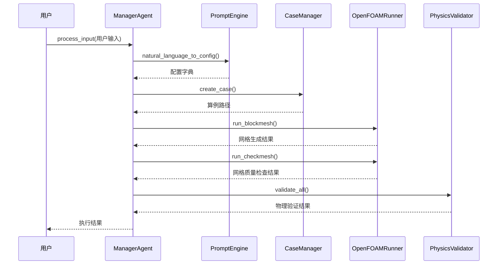

**图表来源**
- [manager_agent.py:75-338](file://openfoam_ai/agents/manager_agent.py#L75-L338)
- [prompt_engine.py:92-126](file://openfoam_ai/agents/prompt_engine.py#L92-L126)

**章节来源**
- [manager_agent.py:75-338](file://openfoam_ai/agents/manager_agent.py#L75-L338)

### PromptEngine 详细分析

#### 配置生成流程

**natural_language_to_config 方法**
- **功能**：将自然语言转换为OpenFOAM配置
- **参数**：`user_input: str` - 用户描述
- **返回**：`Dict[str, Any]` - 结构化配置
- **处理逻辑**：
  1. Mock模式检测
  2. LLM API调用（如果可用）
  3. JSON格式验证和解析
  4. 错误处理和降级

#### 配置验证流程

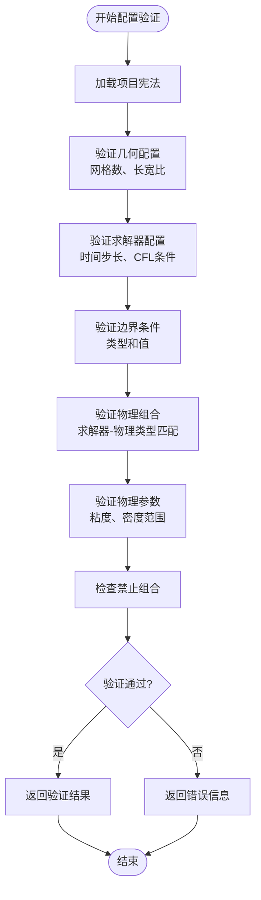

**图表来源**
- [validators.py:189-275](file://openfoam_ai/core/validators.py#L189-L275)

**章节来源**
- [prompt_engine.py:92-126](file://openfoam_ai/agents/prompt_engine.py#L92-L126)
- [validators.py:189-275](file://openfoam_ai/core/validators.py#L189-L275)

### OpenFOAMRunner 详细分析

#### 求解器监控机制

**run_solver 方法**
- **功能**：运行求解器并实时监控
- **参数**：
  - `solver_name: str` - 求解器名称
  - `callback: Optional[Callable]` - 回调函数
- **返回**：`Iterator[SolverMetrics]` - 指标迭代器
- **监控内容**：
  - 时间步推进
  - 库朗数监控
  - 残差收敛检查
  - 发散检测

#### 状态管理

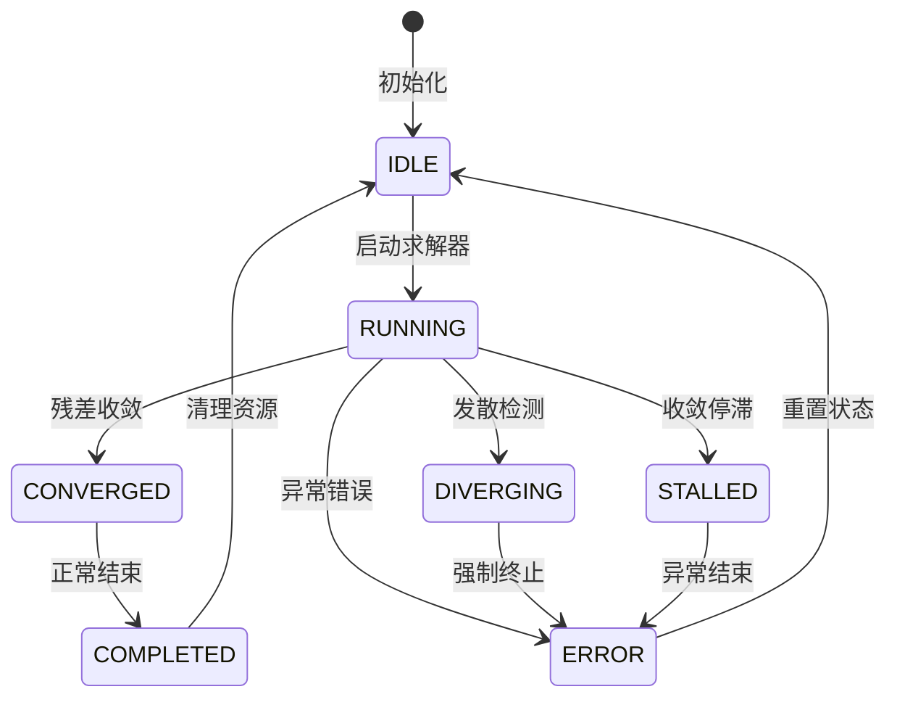

**图表来源**
- [openfoam_runner.py:16-25](file://openfoam_ai/core/openfoam_runner.py#L16-L25)
- [openfoam_runner.py:389-409](file://openfoam_ai/core/openfoam_runner.py#L389-L409)

**章节来源**
- [openfoam_runner.py:99-198](file://openfoam_ai/core/openfoam_runner.py#L99-L198)

### MemoryManager 和 SessionManager

#### 记忆管理流程

**create_incremental_update 方法**
- **功能**：创建增量更新（Diff update）
- **参数**：
  - `case_name: str` - 算例名称
  - `modification_prompt: str` - 修改描述
  - `new_config: Dict[str, Any]` - 新配置
- **返回**：`(DiffResult, str)` - 差异结果和新记忆ID
- **核心功能**：
  1. 获取最新配置
  2. 计算配置差异
  3. 存储新配置
  4. 返回差异分析

#### 会话状态管理

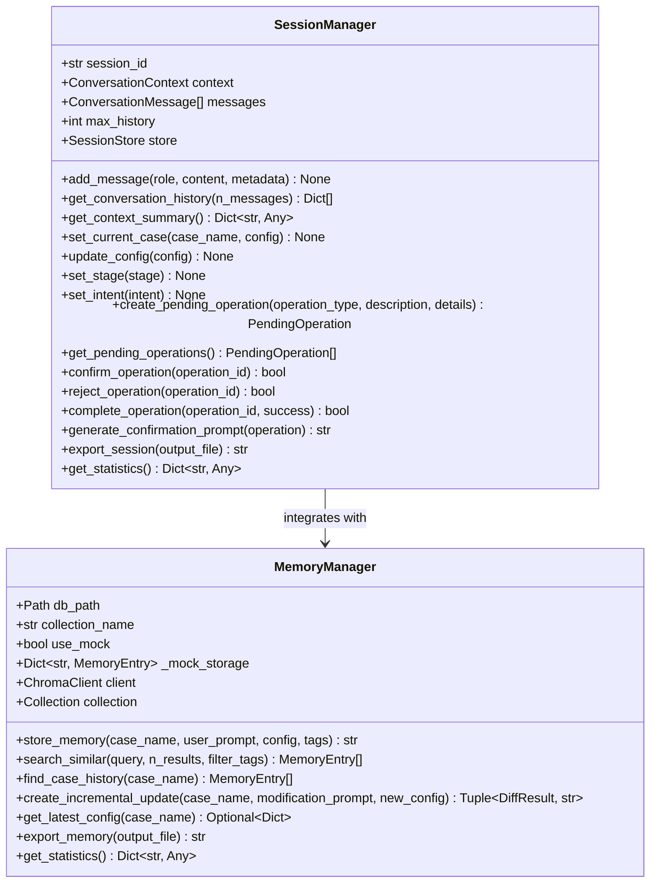

**图表来源**
- [session_manager.py:171-565](file://openfoam_ai/memory/session_manager.py#L171-L565)
- [memory_manager.py:198-804](file://openfoam_ai/memory/memory_manager.py#L198-L804)

**章节来源**
- [session_manager.py:171-565](file://openfoam_ai/memory/session_manager.py#L171-L565)
- [memory_manager.py:198-804](file://openfoam_ai/memory/memory_manager.py#L198-L804)

## 依赖关系分析

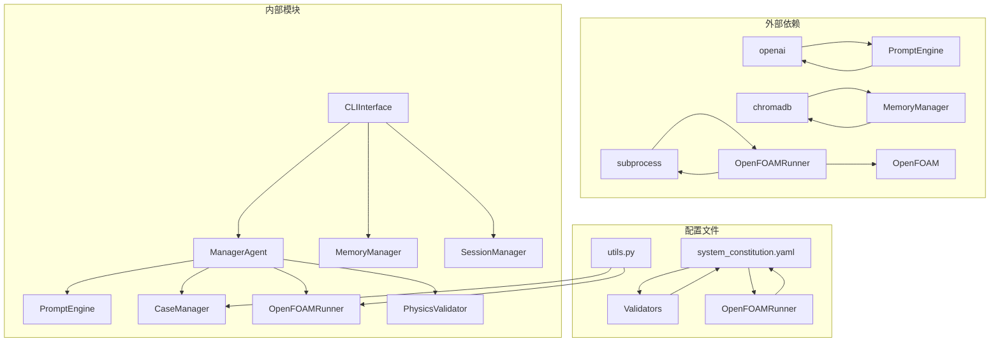

**图表来源**
- [prompt_engine.py:11-17](file://openfoam_ai/agents/prompt_engine.py#L11-L17)
- [memory_manager.py:22-29](file://openfoam_ai/memory/memory_manager.py#L22-L29)
- [openfoam_runner.py:6-13](file://openfoam_ai/core/openfoam_runner.py#L6-L13)

**章节来源**
- [prompt_engine.py:11-17](file://openfoam_ai/agents/prompt_engine.py#L11-L17)
- [memory_manager.py:22-29](file://openfoam_ai/memory/memory_manager.py#L22-L29)
- [openfoam_runner.py:6-13](file://openfoam_ai/core/openfoam_runner.py#L6-L13)

## 性能考虑

### 并发处理
- **异步I/O**：OpenFOAMRunner使用异步日志读取避免阻塞
- **内存管理**：MemoryManager支持大容量数据的分页存储
- **缓存策略**：SessionManager缓存最近对话历史

### 资源优化
- **网格优化**：ConfigRefiner自动调整网格分辨率
- **时间步优化**：动态调整时间步长以平衡精度和性能
- **内存回收**：定期清理临时文件和日志

### 扩展性设计
- **插件架构**：支持新的Agent和验证器扩展
- **配置驱动**：通过system_constitution.yaml灵活调整约束
- **API抽象**：统一的接口设计便于替换底层实现

## 故障排除指南

### 常见问题诊断

**OpenFOAM环境问题**
- **症状**：命令未找到或权限错误
- **解决方案**：检查OpenFOAM安装和PATH环境变量
- **预防措施**：启动时自动检测OpenFOAM环境

**LLM集成问题**
- **症状**：API调用失败或响应异常
- **解决方案**：检查API密钥和网络连接，启用Mock模式
- **预防措施**：实现优雅降级和错误重试机制

**内存管理问题**
- **症状**：内存使用过高或存储空间不足
- **解决方案**：定期清理历史记录和导出数据
- **预防措施**：实现自动清理和容量监控

### 错误处理策略

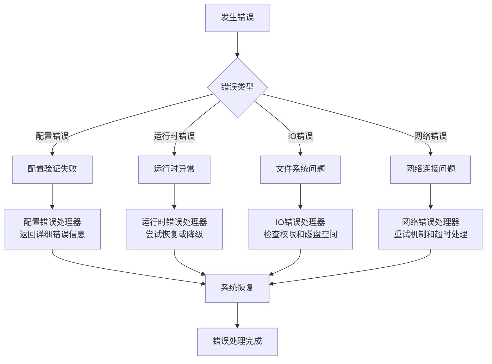

**章节来源**
- [openfoam_runner.py:127-142](file://openfoam_ai/core/openfoam_runner.py#L127-L142)
- [prompt_engine.py:122-126](file://openfoam_ai/agents/prompt_engine.py#L122-L126)

## 结论

OpenFOAM AI项目提供了一个完整的智能化CFD仿真解决方案，通过以下关键特性实现了高效可靠的自动化：

**技术优势**
- **智能化配置生成**：基于LLM的自然语言到配置转换
- **严格的物理约束**：基于项目宪法的硬约束验证系统
- **完整的生命周期管理**：从创建到验证的全流程自动化
- **记忆性建模**：支持相似性检索和增量修改

**架构特点**
- **模块化设计**：清晰的职责分离和接口定义
- **可扩展性**：支持新功能和新算法的集成
- **可靠性**：完善的错误处理和恢复机制
- **用户体验**：友好的CLI交互界面

**应用场景**
- **学术研究**：快速生成和验证CFD仿真案例
- **工程应用**：自动化参数研究和优化
- **教育培训**：直观的CFD仿真学习平台
- **工业应用**：标准化的仿真工作流程

该项目为CFD领域的智能化发展提供了重要的技术基础和实践参考。