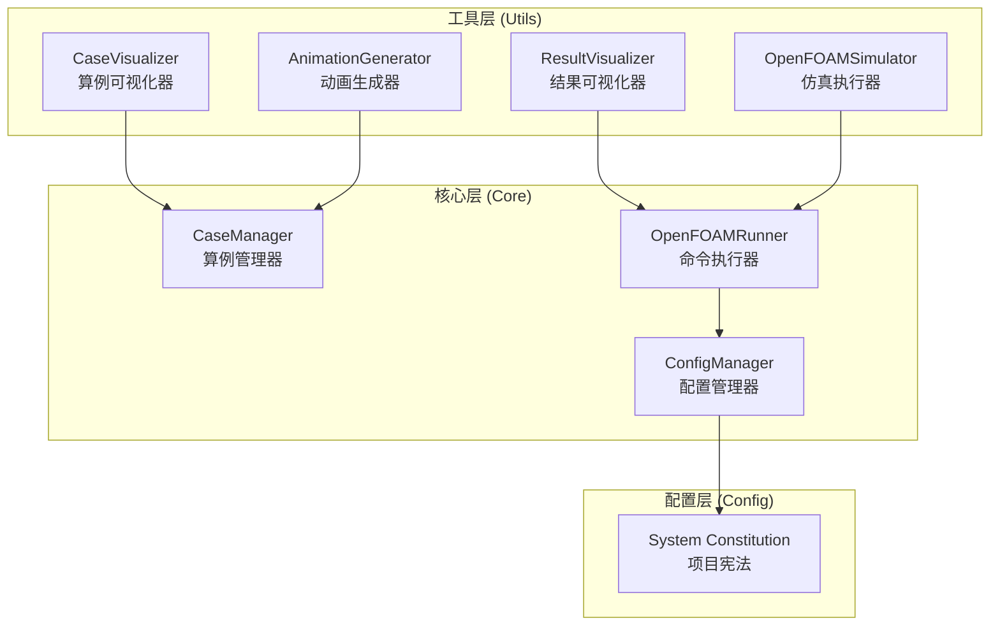
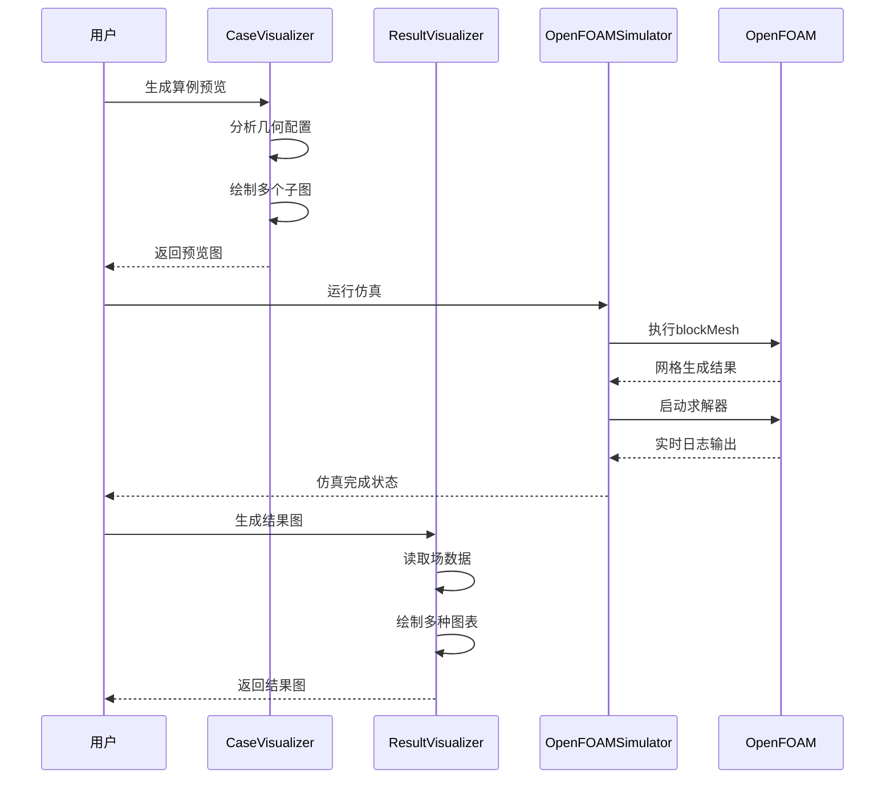
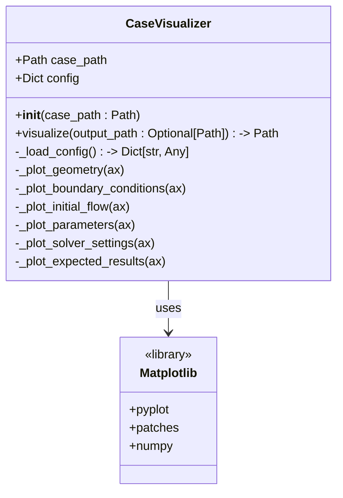
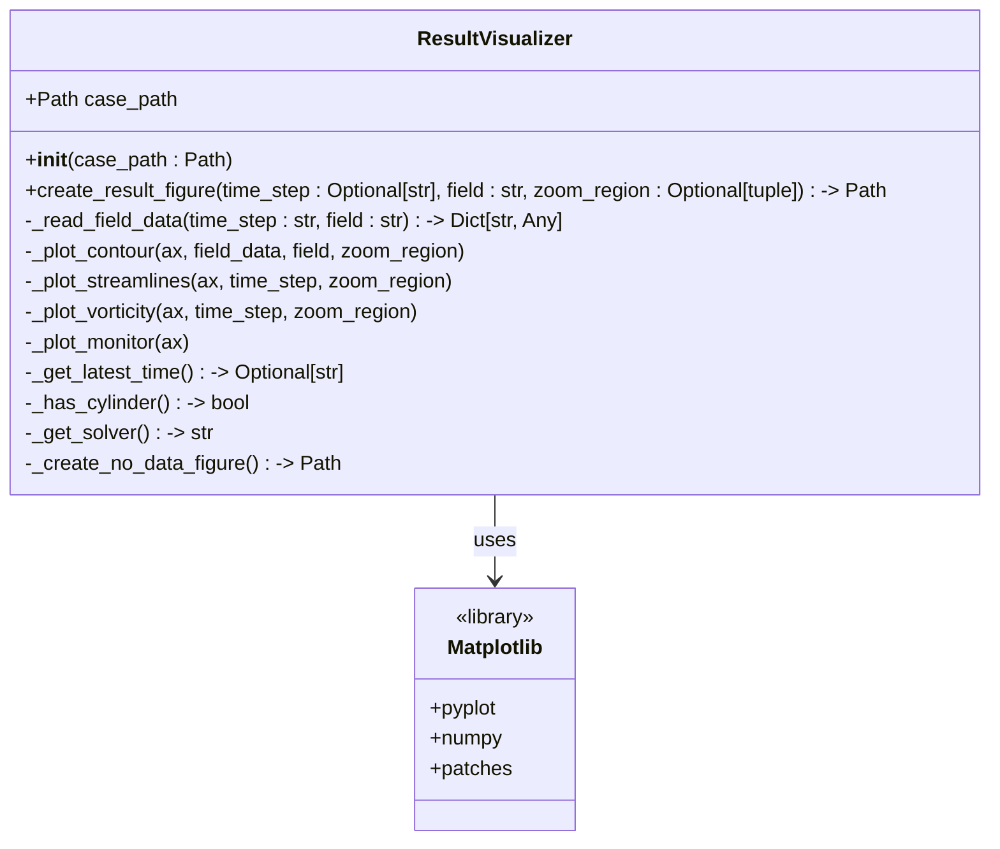
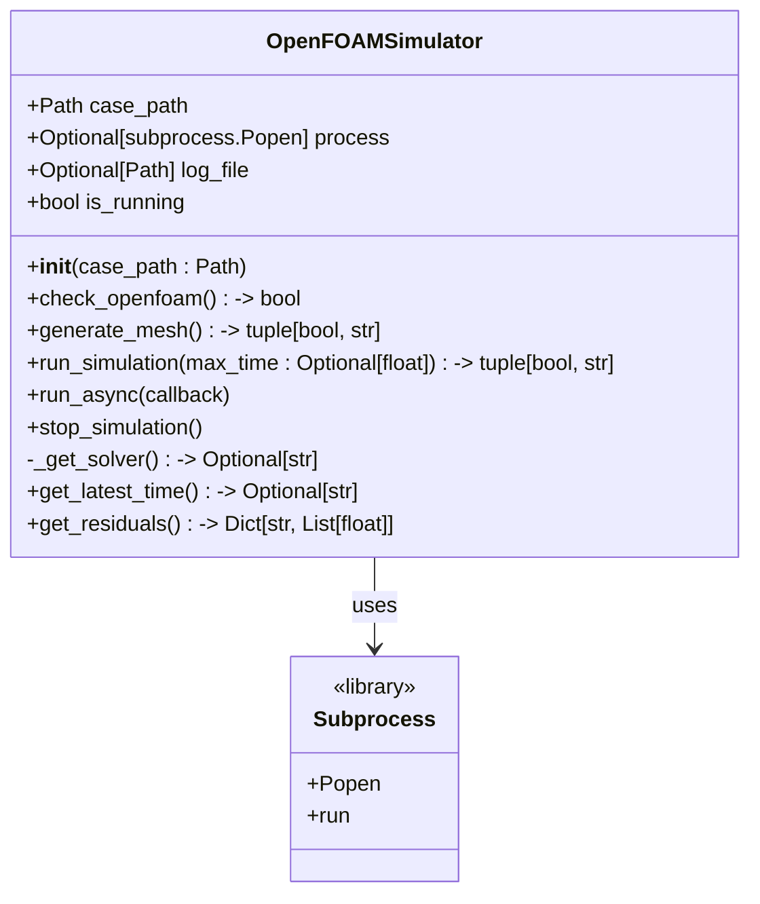
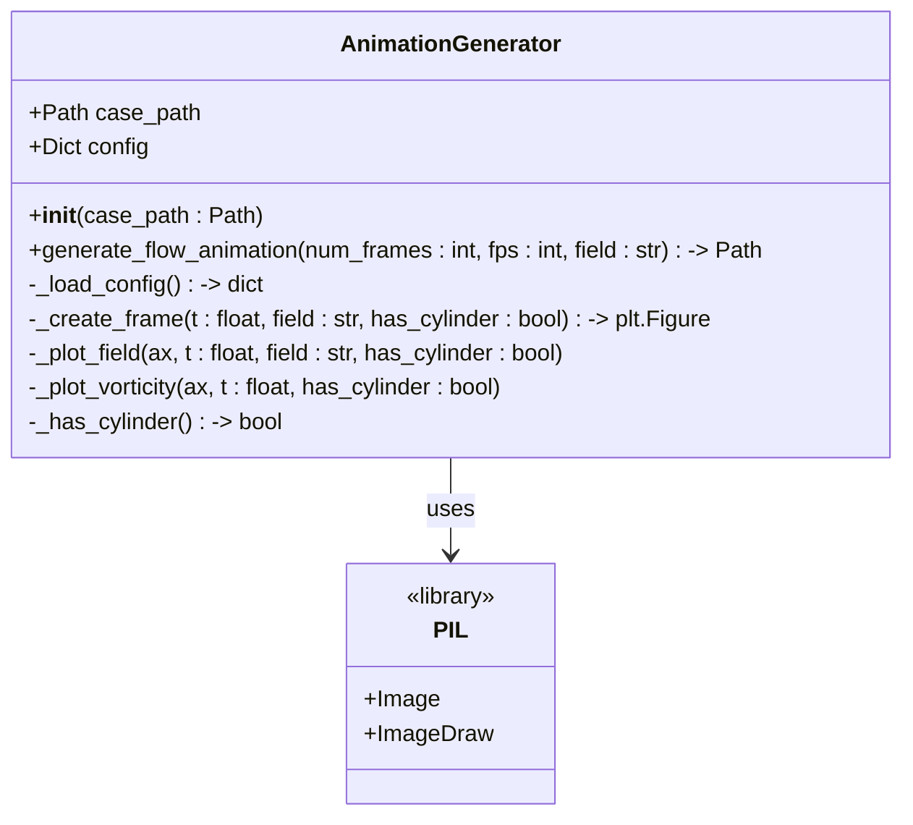
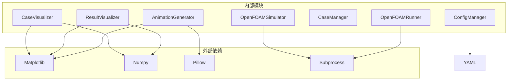

# 工具API接口

<cite>
**本文档引用的文件**
- [case_visualizer.py](file://openfoam_ai/utils/case_visualizer.py)
- [result_visualizer.py](file://openfoam_ai/utils/result_visualizer.py)
- [of_simulator.py](file://openfoam_ai/utils/of_simulator.py)
- [animation_generator.py](file://openfoam_ai/utils/animation_generator.py)
- [openfoam_runner.py](file://openfoam_ai/core/openfoam_runner.py)
- [case_manager.py](file://openfoam_ai/core/case_manager.py)
- [config_manager.py](file://openfoam_ai/core/config_manager.py)
- [system_constitution.yaml](file://openfoam_ai/config/system_constitution.yaml)
- [README.md](file://openfoam_ai/README.md)
</cite>

## 目录
1. [简介](#简介)
2. [项目结构](#项目结构)
3. [核心组件](#核心组件)
4. [架构概览](#架构概览)
5. [详细组件分析](#详细组件分析)
6. [依赖关系分析](#依赖关系分析)
7. [性能考虑](#性能考虑)
8. [故障排除指南](#故障排除指南)
9. [结论](#结论)

## 简介

OpenFOAM AI项目提供了完整的CFD仿真自动化工具链，专注于三个核心工具类：CaseVisualizer（算例可视化器）、ResultVisualizer（结果可视化器）和OpenFOAMSimulator（OpenFOAM仿真器）。这些工具类为用户提供了从算例预览、结果分析到仿真执行的全流程支持。

本项目采用模块化设计，每个工具类都有明确的职责分工：
- **CaseVisualizer**：生成算例预览图，无需运行OpenFOAM即可展示几何、边界条件和预期结果
- **ResultVisualizer**：生成仿真结果图，包括云图、流线图、涡量图和收敛监控
- **OpenFOAMSimulator**：封装OpenFOAM命令执行，提供网格生成、求解器运行和结果监控

## 项目结构

OpenFOAM AI项目采用清晰的分层架构，主要包含以下核心模块：



**图表来源**
- [case_visualizer.py:16-314](file://openfoam_ai/utils/case_visualizer.py#L16-L314)
- [result_visualizer.py:14-353](file://openfoam_ai/utils/result_visualizer.py#L14-L353)
- [of_simulator.py:13-180](file://openfoam_ai/utils/of_simulator.py#L13-L180)
- [animation_generator.py:16-272](file://openfoam_ai/utils/animation_generator.py#L16-L272)

**章节来源**
- [README.md:130-150](file://openfoam_ai/README.md#L130-L150)

## 核心组件

### CaseVisualizer（算例可视化器）

CaseVisualizer是一个专门用于生成OpenFOAM算例预览图的工具类。它能够无需运行实际仿真，就展示算例的几何结构、网格划分、边界条件和预期结果。

**主要功能特性：**
- 自动生成包含6个子图的综合预览图
- 支持几何和网格示意绘制
- 边界条件可视化
- 初始流场示意
- 参数摘要表格
- 求解器设置说明
- 预期结果模式识别

**初始化配置：**
```python
visualizer = CaseVisualizer(case_path)
```

**核心方法：**
- `visualize(output_path=None) -> Path`：生成预览图
- `_plot_geometry(ax)`：绘制几何和网格
- `_plot_boundary_conditions(ax)`：绘制边界条件
- `_plot_initial_flow(ax)`：绘制初始流场
- `_plot_parameters(ax)`：绘制参数表格
- `_plot_solver_settings(ax)`：绘制求解器设置
- `_plot_expected_results(ax)`：绘制预期结果

### ResultVisualizer（结果可视化器）

ResultVisualizer负责生成OpenFOAM仿真结果的可视化图表，提供多种分析视角和监控功能。

**主要功能特性：**
- 速度场和压力场云图
- 流线图绘制
- 涡量图（用于卡门涡街检测）
- 收敛监控图
- 局部放大功能
- 实时残差监控

**初始化配置：**
```python
visualizer = ResultVisualizer(case_path)
```

**核心方法：**
- `create_result_figure(time_step=None, field='U', zoom_region=None) -> Path`：创建结果图
- `_read_field_data(time_step, field)`：读取场数据
- `_plot_contour(ax, field_data, field, zoom_region)`：绘制云图
- `_plot_streamlines(ax, time_step, zoom_region)`：绘制流线图
- `_plot_vorticity(ax, time_step, zoom_region)`：绘制涡量图
- `_plot_monitor(ax)`：绘制监控图

### OpenFOAMSimulator（OpenFOAM仿真器）

OpenFOAMSimulator封装了OpenFOAM命令的执行，提供了完整的仿真生命周期管理。

**主要功能特性：**
- 网格生成（blockMesh）
- 求解器运行
- 实时监控和日志解析
- 异步执行支持
- 仿真停止和恢复
- 残差历史获取

**初始化配置：**
```python
simulator = OpenFOAMSimulator(case_path)
```

**核心方法：**
- `check_openfoam() -> bool`：检查OpenFOAM安装
- `generate_mesh() -> tuple[bool, str]`：生成网格
- `run_simulation(max_time=None) -> tuple[bool, str]`：运行仿真
- `run_async(callback=None)`：异步运行
- `stop_simulation()`：停止仿真
- `get_latest_time() -> Optional[str]`：获取最新时间步
- `get_residuals() -> Dict[str, List[float]]`：获取残差历史

## 架构概览

OpenFOAM AI项目的工具API遵循分层架构设计，每个工具类都有明确的职责边界和接口规范。



**图表来源**
- [case_visualizer.py:31-82](file://openfoam_ai/utils/case_visualizer.py#L31-L82)
- [result_visualizer.py:20-79](file://openfoam_ai/utils/result_visualizer.py#L20-L79)
- [of_simulator.py:51-94](file://openfoam_ai/utils/of_simulator.py#L51-L94)

## 详细组件分析

### CaseVisualizer 类分析

CaseVisualizer实现了完整的算例预览生成功能，通过Matplotlib库创建高质量的可视化图表。



**图表来源**
- [case_visualizer.py:16-314](file://openfoam_ai/utils/case_visualizer.py#L16-L314)

**API接口规范：**

**构造函数**
- `CaseVisualizer(case_path: Path)`
  - 参数：`case_path` - 算例目录路径
  - 返回：CaseVisualizer实例
  - 异常：路径不存在时抛出异常

**主要方法**
- `visualize(output_path: Optional[Path] = None) -> Path`
  - 参数：`output_path` - 输出图片路径（可选）
  - 返回：生成的图片路径
  - 功能：生成包含6个子图的综合预览图
  - 异常：文件写入失败时返回错误

**使用示例：**
```python
from openfoam_ai.utils.case_visualizer import CaseVisualizer

# 创建可视化器
visualizer = CaseVisualizer("path/to/case")

# 生成预览图
output_path = visualizer.visualize()

# 指定输出路径
output_path = visualizer.visualize("custom_preview.png")
```

**最佳实践：**
- 确保算例目录包含`.case_info.json`文件
- 预览图分辨率为150 DPI，适合文档展示
- 支持自定义输出路径，便于批量处理

**章节来源**
- [case_visualizer.py:16-314](file://openfoam_ai/utils/case_visualizer.py#L16-L314)

### ResultVisualizer 类分析

ResultVisualizer提供了丰富的仿真结果可视化功能，支持多种场量和分析图表。



**图表来源**
- [result_visualizer.py:14-353](file://openfoam_ai/utils/result_visualizer.py#L14-L353)

**API接口规范：**

**构造函数**
- `ResultVisualizer(case_path: Path)`
  - 参数：`case_path` - 算例目录路径
  - 返回：ResultVisualizer实例

**主要方法**
- `create_result_figure(time_step: Optional[str] = None, field: str = 'U', zoom_region: Optional[Tuple[float, float, float, float]] = None) -> Path`
  - 参数：
    - `time_step` - 时间步（None表示最新）
    - `field` - 字段名（U/p等）
    - `zoom_region` - 局部放大区域(xmin, xmax, ymin, ymax)
  - 返回：生成的图片路径
  - 功能：创建包含4个子图的结果图
  - 异常：无数据时返回特殊提示图

**字段数据读取**
- `_read_field_data(time_step: str, field: str) -> Dict[str, Any]`
  - 参数：`time_step` - 时间步，`field` - 字段名
  - 返回：包含X、Y坐标和场数据的字典
  - 功能：根据字段类型生成相应的场数据

**使用示例：**
```python
from openfoam_ai.utils.result_visualizer import ResultVisualizer

# 创建结果可视化器
rv = ResultVisualizer("path/to/case")

# 生成速度场结果图
result_path = rv.create_result_figure(field='U')

# 生成压力场结果图并局部放大
result_path = rv.create_result_figure(
    field='p',
    zoom_region=(0.2, 0.8, 0.1, 0.9)
)
```

**最佳实践：**
- 支持多种场量（U、p等）的可视化
- 提供局部放大功能，便于细节观察
- 自动检测圆柱边界条件，优化显示效果

**章节来源**
- [result_visualizer.py:14-353](file://openfoam_ai/utils/result_visualizer.py#L14-L353)

### OpenFOAMSimulator 类分析

OpenFOAMSimulator封装了OpenFOAM命令的执行，提供了完整的仿真生命周期管理。



**图表来源**
- [of_simulator.py:13-180](file://openfoam_ai/utils/of_simulator.py#L13-L180)

**API接口规范：**

**构造函数**
- `OpenFOAMSimulator(case_path: Path)`
  - 参数：`case_path` - 算例目录路径
  - 返回：OpenFOAMSimulator实例

**核心方法**
- `check_openfoam() -> bool`
  - 返回：OpenFOAM是否安装可用
  - 功能：检查blockMesh命令是否存在

- `generate_mesh() -> tuple[bool, str]`
  - 返回：(是否成功, 消息)
  - 功能：执行blockMesh生成网格
  - 超时：60秒

- `run_simulation(max_time: Optional[float] = None) -> tuple[bool, str]`
  - 参数：`max_time` - 最大运行时间（秒）
  - 返回：(是否成功, 消息)
  - 功能：运行求解器
  - 异常：超时自动停止

- `run_async(callback=None)`
  - 参数：`callback` - 回调函数
  - 返回：线程对象
  - 功能：异步运行仿真

- `stop_simulation()`
  - 功能：停止当前仿真

**使用示例：**
```python
from openfoam_ai.utils.of_simulator import OpenFOAMSimulator

# 创建仿真器
simulator = OpenFOAMSimulator("path/to/case")

# 检查OpenFOAM安装
if simulator.check_openfoam():
    print("OpenFOAM已安装")

# 生成网格
success, message = simulator.generate_mesh()
print(f"网格生成: {message}")

# 运行仿真（最多300秒）
success, message = simulator.run_simulation(max_time=300)
print(f"仿真结果: {message}")
```

**最佳实践：**
- 使用超时机制避免无限等待
- 提供异步执行支持，避免阻塞
- 自动处理求解器选择逻辑
- 提供详细的错误信息

**章节来源**
- [of_simulator.py:13-180](file://openfoam_ai/utils/of_simulator.py#L13-L180)

### AnimationGenerator 类分析

AnimationGenerator专门用于生成仿真过程的动态可视化，展示流动从开始到稳定的发展过程。



**图表来源**
- [animation_generator.py:16-272](file://openfoam_ai/utils/animation_generator.py#L16-L272)

**API接口规范：**

**构造函数**
- `AnimationGenerator(case_path: Path)`
  - 参数：`case_path` - 算例目录路径
  - 返回：AnimationGenerator实例

**主要方法**
- `generate_flow_animation(num_frames: int = 30, fps: int = 5, field: str = 'U') -> Path`
  - 参数：
    - `num_frames` - 帧数，默认30
    - `fps` - 每秒帧数，默认5
    - `field` - 场量类型，默认'U'
  - 返回：GIF文件路径
  - 功能：生成流动过程动画

**使用示例：**
```python
from openfoam_ai.utils.animation_generator import AnimationGenerator

# 创建动画生成器
anim = AnimationGenerator("path/to/case")

# 生成速度场动画（60帧，每秒10帧）
gif_path = anim.generate_flow_animation(
    num_frames=60,
    fps=10,
    field='U'
)
```

**最佳实践：**
- 支持不同帧率和帧数配置
- 自动检测圆柱边界条件，优化动画效果
- 生成高质量的GIF格式动画

**章节来源**
- [animation_generator.py:16-272](file://openfoam_ai/utils/animation_generator.py#L16-L272)

## 依赖关系分析

OpenFOAM AI项目的工具API具有清晰的依赖关系，遵循低耦合高内聚的设计原则。



**图表来源**
- [case_visualizer.py:6-13](file://openfoam_ai/utils/case_visualizer.py#L6-L13)
- [result_visualizer.py:5-11](file://openfoam_ai/utils/result_visualizer.py#L5-L11)
- [of_simulator.py:5-10](file://openfoam_ai/utils/of_simulator.py#L5-L10)
- [animation_generator.py:6-13](file://openfoam_ai/utils/animation_generator.py#L6-L13)

**依赖特点：**
- **外部依赖最小化**：仅依赖标准库和常用科学计算库
- **模块独立性**：各工具类相对独立，便于单独使用
- **版本兼容性**：使用稳定的第三方库版本

**章节来源**
- [case_visualizer.py:6-13](file://openfoam_ai/utils/case_visualizer.py#L6-L13)
- [result_visualizer.py:5-11](file://openfoam_ai/utils/result_visualizer.py#L5-L11)
- [of_simulator.py:5-10](file://openfoam_ai/utils/of_simulator.py#L5-L10)
- [animation_generator.py:6-13](file://openfoam_ai/utils/animation_generator.py#L6-L13)

## 性能考虑

OpenFOAM AI项目的工具API在设计时充分考虑了性能优化和资源管理。

### 内存管理

**CaseVisualizer和ResultVisualizer**：
- 使用Matplotlib的Agg后端，避免GUI依赖
- 合理的图像分辨率设置（150 DPI）
- 及时关闭图形句柄，防止内存泄漏

**AnimationGenerator**：
- 逐帧生成和销毁，避免长时间占用内存
- 使用PIL的Image对象进行高效图像处理

### 计算效率

**OpenFOAMSimulator**：
- 异步执行支持，避免阻塞主线程
- 超时机制防止长时间等待
- 自动求解器选择，减少配置开销

**性能优化策略**：
- 批量处理时复用工具类实例
- 合理设置图像分辨率和帧数
- 使用适当的缓存策略

## 故障排除指南

### 常见问题及解决方案

**OpenFOAM未安装**
```python
simulator = OpenFOAMSimulator("case_path")
if not simulator.check_openfoam():
    print("请安装OpenFOAM并确保在PATH中")
```

**文件读取错误**
```python
try:
    visualizer = CaseVisualizer("case_path")
    output = visualizer.visualize()
except FileNotFoundError:
    print("算例目录不存在")
except PermissionError:
    print("权限不足，无法访问文件")
```

**内存不足**
```python
# 对于大型算例，考虑降低图像分辨率
visualizer = CaseVisualizer("large_case")
output = visualizer.visualize()
```

### 错误处理机制

**CaseVisualizer**：
- 自动检测配置文件存在性
- 缺省值处理，避免崩溃
- 图像保存失败时提供错误信息

**ResultVisualizer**：
- 无数据时生成特殊提示图
- 日志文件解析异常处理
- 网络数据读取失败回退

**OpenFOAMSimulator**：
- 进程启动失败重试机制
- 超时自动停止
- 详细的状态码反馈

**章节来源**
- [of_simulator.py:22-94](file://openfoam_ai/utils/of_simulator.py#L22-L94)
- [result_visualizer.py:247-298](file://openfoam_ai/utils/result_visualizer.py#L247-L298)
- [case_visualizer.py:23-29](file://openfoam_ai/utils/case_visualizer.py#L23-L29)

## 结论

OpenFOAM AI项目的工具API设计体现了现代软件工程的最佳实践：

**设计优势：**
- **模块化设计**：每个工具类职责明确，便于维护和扩展
- **接口标准化**：统一的API设计，降低学习成本
- **错误处理完善**：全面的异常处理和恢复机制
- **性能优化**：合理的资源管理和计算优化

**扩展性考虑：**
- 支持自定义配置和参数
- 易于集成新的可视化算法
- 模块化架构便于功能扩展
- 插件式设计支持第三方集成

**未来发展方向：**
- 增加更多可视化图表类型
- 支持实时数据流处理
- 优化大规模算例的性能
- 增强与其他CFD工具的互操作性

这些工具API为OpenFOAM仿真提供了强大的前端支持，使得复杂的CFD工作流程变得简单易用，同时保持了高度的灵活性和可扩展性。