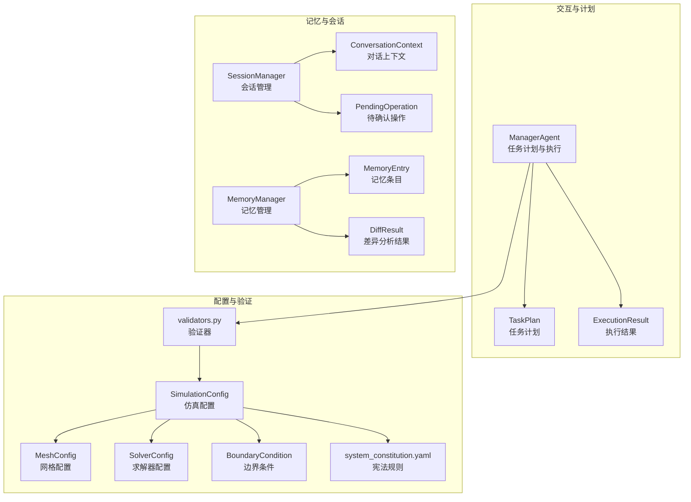
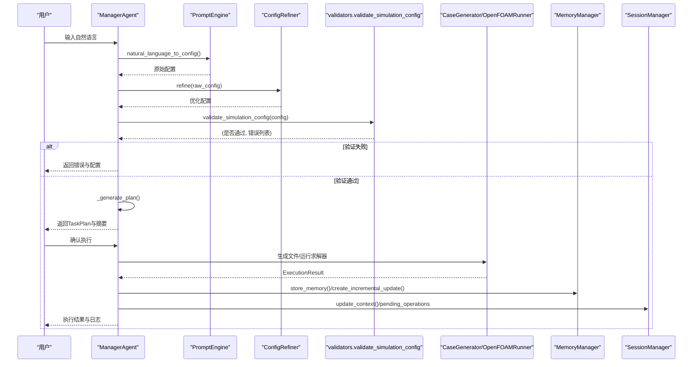
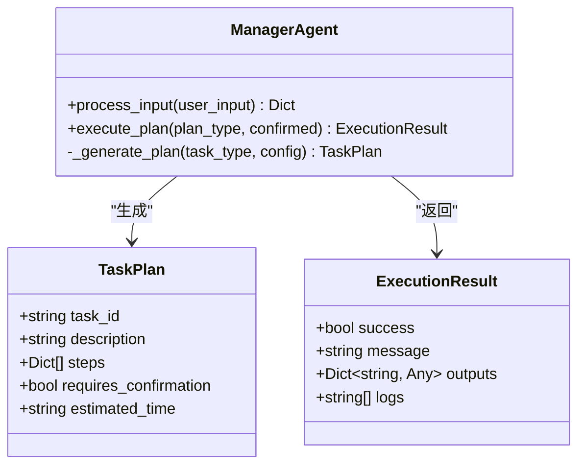
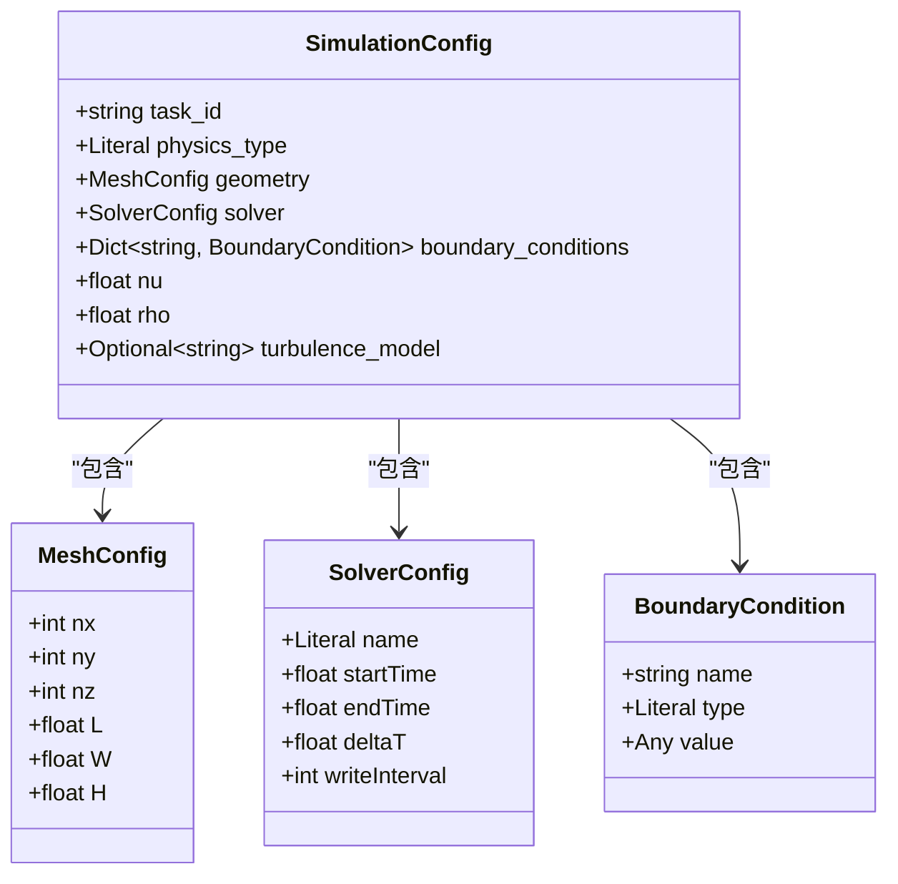
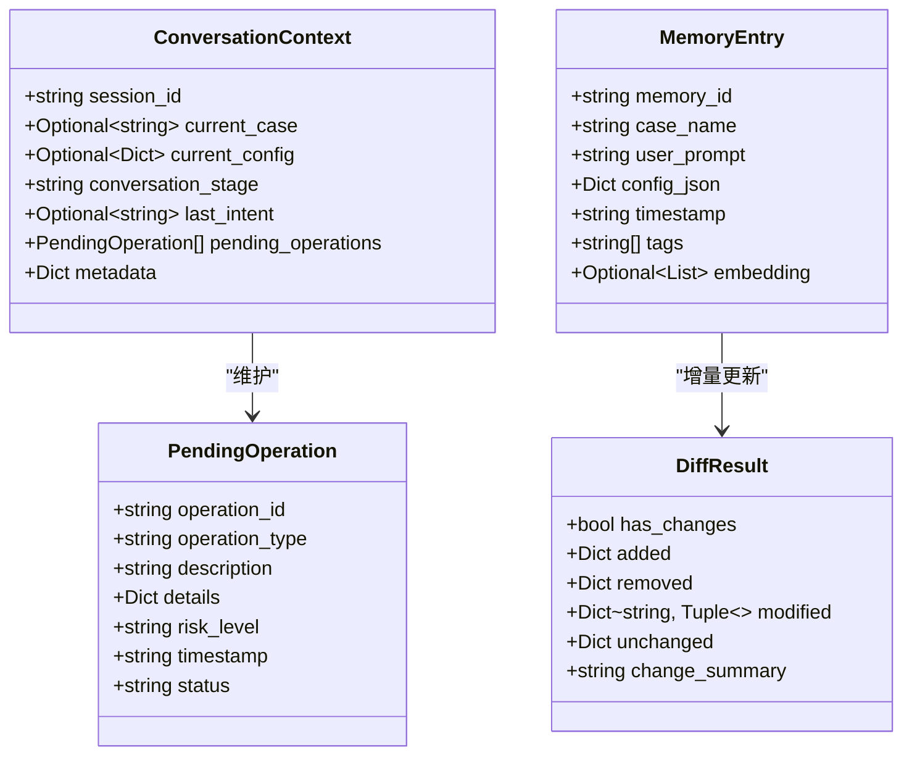
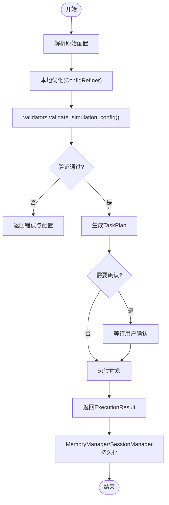
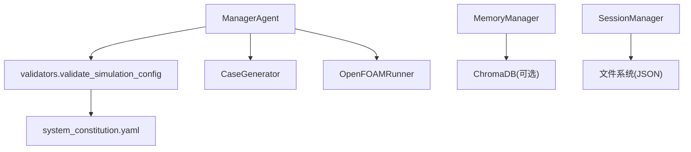

# 数据结构定义

<cite>
**本文引用的文件**
- [openfoam_ai/agents/manager_agent.py](file://openfoam_ai/agents/manager_agent.py)
- [openfoam_ai/core/validators.py](file://openfoam_ai/core/validators.py)
- [openfoam_ai/memory/session_manager.py](file://openfoam_ai/memory/session_manager.py)
- [openfoam_ai/memory/memory_manager.py](file://openfoam_ai/memory/memory_manager.py)
- [openfoam_ai/config/system_constitution.yaml](file://openfoam_ai/config/system_constitution.yaml)
- [AI执行手册.md](file://AI执行手册.md)
- [openfoam_ai/core/utils.py](file://openfoam_ai/core/utils.py)
</cite>

## 目录
1. [引言](#引言)
2. [项目结构](#项目结构)
3. [核心数据组件](#核心数据组件)
4. [架构总览](#架构总览)
5. [详细组件分析](#详细组件分析)
6. [依赖关系分析](#依赖关系分析)
7. [性能考虑](#性能考虑)
8. [故障排查指南](#故障排查指南)
9. [结论](#结论)
10. [附录](#附录)

## 引言
本文件面向OpenFOAM AI项目，系统化梳理核心数据结构的字段定义、数据类型、约束条件、用途与使用场景，并给出验证规则、默认值、序列化/反序列化示例、生命周期与内存优化策略以及版本兼容与迁移建议。重点覆盖以下数据类：
- TaskPlan：任务计划
- ExecutionResult：执行结果
- SimulationConfig：仿真配置（含MeshConfig、SolverConfig、BoundaryCondition等）
- 会话与记忆相关数据结构：ConversationContext、PendingOperation、MemoryEntry、DiffResult等

## 项目结构
OpenFOAM AI采用模块化设计，围绕“意图理解—配置验证—计划生成—执行—结果反馈—记忆与会话”的闭环组织数据结构与流程。核心模块包括：
- agents：智能体与交互（ManagerAgent、PromptEngine等）
- core：核心业务（validators、openfoam_runner、case_manager等）
- memory：记忆与会话（MemoryManager、SessionManager）
- config：系统宪法（system_constitution.yaml）

**图表来源**
- [openfoam_ai/agents/manager_agent.py:19-36](file://openfoam_ai/agents/manager_agent.py#L19-L36)
- [openfoam_ai/core/validators.py:178-275](file://openfoam_ai/core/validators.py#L178-L275)
- [openfoam_ai/memory/session_manager.py:70-105](file://openfoam_ai/memory/session_manager.py#L70-L105)
- [openfoam_ai/memory/memory_manager.py:32-62](file://openfoam_ai/memory/memory_manager.py#L32-L62)
- [openfoam_ai/config/system_constitution.yaml:1-103](file://openfoam_ai/config/system_constitution.yaml#L1-L103)

**章节来源**
- [openfoam_ai/agents/manager_agent.py:1-458](file://openfoam_ai/agents/manager_agent.py#L1-L458)
- [openfoam_ai/core/validators.py:1-441](file://openfoam_ai/core/validators.py#L1-L441)
- [openfoam_ai/memory/session_manager.py:1-565](file://openfoam_ai/memory/session_manager.py#L1-L565)
- [openfoam_ai/memory/memory_manager.py:1-804](file://openfoam_ai/memory/memory_manager.py#L1-L804)
- [openfoam_ai/config/system_constitution.yaml:1-103](file://openfoam_ai/config/system_constitution.yaml#L1-L103)

## 核心数据组件
本节聚焦TaskPlan、ExecutionResult、SimulationConfig三大核心数据类，以及与之密切相关的MeshConfig、SolverConfig、BoundaryCondition、ConversationContext、PendingOperation、MemoryEntry、DiffResult等。

- TaskPlan
  - 字段与类型
    - task_id: 字符串
    - description: 字符串
    - steps: 列表（元素为字典）
    - requires_confirmation: 布尔
    - estimated_time: 字符串
  - 约束与默认
    - 由ManagerAgent在生成计划时填充；requires_confirmation通常为True，便于用户确认
  - 使用场景
    - 表达“创建/运行”等任务的步骤分解与确认需求
  - 序列化
    - 通过dataclasses.asdict转换为字典，便于JSON传输与展示

- ExecutionResult
  - 字段与类型
    - success: 布尔
    - message: 字符串
    - outputs: 字典
    - logs: 列表（字符串）
  - 约束与默认
    - 由ManagerAgent在执行计划后返回；若未确认，success为False
  - 使用场景
    - 统一承载执行状态、结果摘要与日志
  - 序列化
    - 直接作为字典返回，便于前端渲染与后续处理

- SimulationConfig（核心配置）
  - 字段与类型
    - task_id: 字符串
    - physics_type: 枚举（incompressible/compressible/heatTransfer/multiphase）
    - geometry: MeshConfig
    - solver: SolverConfig
    - boundary_conditions: 字典（键为边界名，值为BoundaryCondition）
    - nu: 浮点（运动粘度，默认值来自宪法）
    - rho: 浮点（密度，默认值来自宪法）
    - turbulence_model: 可选字符串
  - 约束与默认
    - 通过validators.py中的SimulationConfig验证器进行字段范围、组合合法性、求解器与物理类型匹配、湍流模型合法性等校验
    - 默认值来源于system_constitution.yaml中的Physical_Constraints
  - 使用场景
    - LLM生成配置后，经本地优化与验证，作为后续网格生成、求解器运行的权威输入
  - 序列化
    - 作为Pydantic BaseModel实例进行序列化/反序列化；也可转为字典用于持久化

- MeshConfig（网格配置）
  - 字段与类型
    - nx/ny/nz: 整数（范围受宪法约束）
    - L/W/H: 浮点（>0）
  - 约束与默认
    - 单向网格数下限、长宽比上限、2D/3D最小网格数等由宪法与验证器共同约束
  - 使用场景
    - 控制网格分辨率与几何尺度，确保数值稳定与精度

- SolverConfig（求解器配置）
  - 字段与类型
    - name: 枚举（icoFoam/simpleFoam/pimpleFoam/buoyantBoussinesqPimpleFoam等）
    - startTime/endTime/deltaT: 数值（时间范围与步长约束）
    - writeInterval: 整数
  - 约束与默认
    - endTime > startTime；deltaT不超过endTime的一定比例；CFL条件由宪法与验证器共同评估
  - 使用场景
    - 控制瞬态/稳态求解过程的时间步长与输出频率

- BoundaryCondition（边界条件）
  - 字段与类型
    - name/type/value: 名称、类型（枚举）、值（可选）
  - 约束与默认
    - fixedValue类型必须提供value；验证器可检查边界兼容性
  - 使用场景
    - 描述算例的边界工况（入口、出口、壁面等）

- ConversationContext（对话上下文）
  - 字段与类型
    - session_id/current_case/current_config/conversation_stage/last_intent/pending_operations/metadata
  - 约束与默认
    - conversation_stage默认“initial”，pending_operations默认空列表
  - 使用场景
    - 记录多轮对话的状态、当前算例与配置、待确认操作等

- PendingOperation（待确认操作）
  - 字段与类型
    - operation_id/operation_type/description/details/risk_level/timestamp/status
  - 约束与默认
    - status默认“pending”，risk_level来自SessionManager的风险映射
  - 使用场景
    - 对高风险操作（如删除算例、修改求解器）进行用户确认

- MemoryEntry（记忆条目）
  - 字段与类型
    - memory_id/case_name/user_prompt/config_json/timestamp/tags/embedding
  - 约束与默认
    - embedding可选；timestamp自动生成
  - 使用场景
    - 存储历史配置、用户提示与标签，支持相似检索与增量更新

- DiffResult（差异分析结果）
  - 字段与类型
    - has_changes/added/removed/modified/unchanged/change_summary
  - 约束与默认
    - 通过ConfigurationDiffer.compute_diff生成；apply_diff可回放差异
  - 使用场景
    - 记录配置增量变更，支持版本回溯与对比

**章节来源**
- [openfoam_ai/agents/manager_agent.py:19-36](file://openfoam_ai/agents/manager_agent.py#L19-L36)
- [openfoam_ai/core/validators.py:178-275](file://openfoam_ai/core/validators.py#L178-L275)
- [openfoam_ai/memory/session_manager.py:70-105](file://openfoam_ai/memory/session_manager.py#L70-L105)
- [openfoam_ai/memory/memory_manager.py:32-62](file://openfoam_ai/memory/memory_manager.py#L32-L62)
- [openfoam_ai/config/system_constitution.yaml:38-52](file://openfoam_ai/config/system_constitution.yaml#L38-L52)

## 架构总览
下图展示数据结构在系统中的流转与依赖关系：

**图表来源**
- [openfoam_ai/agents/manager_agent.py:142-174](file://openfoam_ai/agents/manager_agent.py#L142-L174)
- [openfoam_ai/core/validators.py:389-411](file://openfoam_ai/core/validators.py#L389-L411)
- [openfoam_ai/memory/memory_manager.py:291-345](file://openfoam_ai/memory/memory_manager.py#L291-L345)
- [openfoam_ai/memory/session_manager.py:281-333](file://openfoam_ai/memory/session_manager.py#L281-L333)

## 详细组件分析

### TaskPlan 与 ExecutionResult
- 设计要点
  - TaskPlan用于表达任务步骤与确认需求；ExecutionResult统一承载执行结果与日志
  - 两者均通过dataclasses.asdict进行序列化，便于前后端交互
- 使用流程
  - ManagerAgent在验证通过后生成TaskPlan；执行时根据用户确认与否返回ExecutionResult
- 关键约束
  - requires_confirmation影响是否需要用户二次确认
  - ExecutionResult的success字段决定流程走向

**图表来源**
- [openfoam_ai/agents/manager_agent.py:19-36](file://openfoam_ai/agents/manager_agent.py#L19-L36)
- [openfoam_ai/agents/manager_agent.py:176-205](file://openfoam_ai/agents/manager_agent.py#L176-L205)

**章节来源**
- [openfoam_ai/agents/manager_agent.py:19-36](file://openfoam_ai/agents/manager_agent.py#L19-L36)
- [openfoam_ai/agents/manager_agent.py:176-205](file://openfoam_ai/agents/manager_agent.py#L176-L205)

### SimulationConfig 与子配置
- 设计要点
  - SimulationConfig作为顶层配置容器，聚合MeshConfig、SolverConfig、BoundaryCondition等
  - 通过Pydantic BaseModel进行强约束校验，结合system_constitution.yaml中的宪法规则
- 验证规则
  - 物理类型与求解器匹配、湍流模型合法性、时间范围与CFL条件、网格长宽比与最小网格数、禁止组合等
- 默认值
  - nu、rho等来自宪法中的Physical_Constraints
- 序列化/反序列化
  - 作为BaseModel实例进行序列化；也可转为字典用于持久化与传输

**图表来源**
- [openfoam_ai/core/validators.py:178-275](file://openfoam_ai/core/validators.py#L178-L275)
- [openfoam_ai/config/system_constitution.yaml:13-52](file://openfoam_ai/config/system_constitution.yaml#L13-L52)

**章节来源**
- [openfoam_ai/core/validators.py:178-275](file://openfoam_ai/core/validators.py#L178-L275)
- [openfoam_ai/config/system_constitution.yaml:13-52](file://openfoam_ai/config/system_constitution.yaml#L13-L52)

### 会话与记忆数据结构
- 设计要点
  - ConversationContext记录会话状态、当前算例与配置、待确认操作等
  - PendingOperation用于高风险操作的确认与跟踪
  - MemoryEntry用于存储历史配置与元数据；DiffResult用于增量更新的差异分析
- 生命周期
  - SessionManager负责消息与上下文的持久化与恢复；MemoryManager负责向量存储与相似检索
- 序列化/反序列化
  - dataclasses.asdict用于导出；from_dict用于导入

**图表来源**
- [openfoam_ai/memory/session_manager.py:70-105](file://openfoam_ai/memory/session_manager.py#L70-L105)
- [openfoam_ai/memory/session_manager.py:54-66](file://openfoam_ai/memory/session_manager.py#L54-L66)
- [openfoam_ai/memory/memory_manager.py:32-62](file://openfoam_ai/memory/memory_manager.py#L32-L62)

**章节来源**
- [openfoam_ai/memory/session_manager.py:70-105](file://openfoam_ai/memory/session_manager.py#L70-L105)
- [openfoam_ai/memory/session_manager.py:304-333](file://openfoam_ai/memory/session_manager.py#L304-L333)
- [openfoam_ai/memory/memory_manager.py:32-62](file://openfoam_ai/memory/memory_manager.py#L32-L62)
- [openfoam_ai/memory/memory_manager.py:64-136](file://openfoam_ai/memory/memory_manager.py#L64-L136)

### 数据验证与转换流程
- 验证入口
  - validate_simulation_config(config_dict) -> (是否通过, 错误列表)
- 转换与回填
  - Pydantic BaseModel自动进行类型转换与默认值回填
  - dataclasses.asdict用于将TaskPlan/ConversationContext/MemoryEntry等转换为字典

**图表来源**
- [openfoam_ai/core/validators.py:389-411](file://openfoam_ai/core/validators.py#L389-L411)
- [openfoam_ai/agents/manager_agent.py:142-174](file://openfoam_ai/agents/manager_agent.py#L142-L174)
- [openfoam_ai/memory/memory_manager.py:291-345](file://openfoam_ai/memory/memory_manager.py#L291-L345)
- [openfoam_ai/memory/session_manager.py:281-333](file://openfoam_ai/memory/session_manager.py#L281-L333)

**章节来源**
- [openfoam_ai/core/validators.py:389-411](file://openfoam_ai/core/validators.py#L389-L411)
- [openfoam_ai/agents/manager_agent.py:142-174](file://openfoam_ai/agents/manager_agent.py#L142-L174)

## 依赖关系分析
- 组件耦合
  - ManagerAgent依赖validators进行配置校验，依赖CaseGenerator与OpenFOAMRunner执行任务
  - MemoryManager与SessionManager分别负责记忆与会话的持久化
- 外部依赖
  - system_constitution.yaml提供宪法规则，validators与CriticAgent据此进行硬约束与软约束检查
  - ChromaDB（可选）用于向量检索，MemoryManager提供模拟模式降级

**图表来源**
- [openfoam_ai/agents/manager_agent.py:142-174](file://openfoam_ai/agents/manager_agent.py#L142-L174)
- [openfoam_ai/core/validators.py:13-15](file://openfoam_ai/core/validators.py#L13-L15)
- [openfoam_ai/memory/memory_manager.py:233-241](file://openfoam_ai/memory/memory_manager.py#L233-L241)
- [openfoam_ai/memory/session_manager.py:114-131](file://openfoam_ai/memory/session_manager.py#L114-L131)

**章节来源**
- [openfoam_ai/agents/manager_agent.py:142-174](file://openfoam_ai/agents/manager_agent.py#L142-L174)
- [openfoam_ai/core/validators.py:13-15](file://openfoam_ai/core/validators.py#L13-L15)
- [openfoam_ai/memory/memory_manager.py:233-241](file://openfoam_ai/memory/memory_manager.py#L233-L241)
- [openfoam_ai/memory/session_manager.py:114-131](file://openfoam_ai/memory/session_manager.py#L114-L131)

## 性能考虑
- 验证性能
  - validators使用Pydantic的编译型验证，字段级约束快速且可扩展
  - 根级校验(root_validator)用于跨字段一致性检查，避免昂贵的外部调用
- 内存优化
  - dataclasses.asdict用于轻量序列化，避免不必要的深拷贝
  - MemoryManager在ChromaDB不可用时自动切换到模拟模式，降低部署复杂度
  - SessionManager限制对话历史长度，避免无限增长
- I/O优化
  - openfoam_ai/core/utils.py提供安全的JSON读写封装，统一日志记录

**章节来源**
- [openfoam_ai/core/utils.py:16-53](file://openfoam_ai/core/utils.py#L16-L53)
- [openfoam_ai/memory/session_manager.py:247-250](file://openfoam_ai/memory/session_manager.py#L247-L250)
- [openfoam_ai/memory/memory_manager.py:233-241](file://openfoam_ai/memory/memory_manager.py#L233-L241)

## 故障排查指南
- 配置验证失败
  - 现象：返回错误列表，包含具体字段与原因
  - 处理：根据错误提示修正字段范围、组合或边界条件
  - 参考：validators.validate_simulation_config与各字段validator/root_validator
- 执行被拒绝
  - 现象：ExecutionResult.success=False，message提示需要确认
  - 处理：调用execute_plan时传入confirmed=True，或在SessionManager中确认PendingOperation
- 发散/收敛停滞
  - 现象：SolverMonitor检测到发散或停滞
  - 处理：根据宪法规则自动/手动调整deltaT、松弛因子或网格
- 记忆检索异常
  - 现象：ChromaDB初始化失败或查询异常
  - 处理：MemoryManager自动回退到模拟模式；检查磁盘空间与权限

**章节来源**
- [openfoam_ai/core/validators.py:389-411](file://openfoam_ai/core/validators.py#L389-L411)
- [openfoam_ai/agents/manager_agent.py:187-193](file://openfoam_ai/agents/manager_agent.py#L187-L193)
- [openfoam_ai/memory/session_manager.py:340-391](file://openfoam_ai/memory/session_manager.py#L340-L391)
- [openfoam_ai/memory/memory_manager.py:233-241](file://openfoam_ai/memory/memory_manager.py#L233-L241)

## 结论
本文系统梳理了OpenFOAM AI项目的核心数据结构，明确了字段定义、约束条件、使用场景与相互关系，并提供了验证规则、默认值、序列化/反序列化示例、生命周期与内存优化策略以及版本兼容与迁移建议。通过SimulationConfig、TaskPlan、ExecutionResult、ConversationContext、PendingOperation、MemoryEntry、DiffResult等数据结构的协同，系统实现了从自然语言到仿真配置、从验证到执行、从记忆到会话的闭环。

## 附录
- 序列化/反序列化示例路径
  - TaskPlan/ExecutionResult/ConversationContext/MemoryEntry等均可通过dataclasses.asdict转换为字典
  - JSON读写封装参见openfoam_ai/core/utils.py中的save_json/load_json
- 版本兼容与迁移
  - 使用Pydantic BaseModel进行字段扩展与默认值回填，保持向前兼容
  - MemoryManager提供增量更新与版本回溯能力，支持配置演进
  - system_constitution.yaml作为宪法规则源，建议以“新增字段而非破坏性变更”的方式演进

**章节来源**
- [openfoam_ai/core/utils.py:16-53](file://openfoam_ai/core/utils.py#L16-L53)
- [openfoam_ai/memory/memory_manager.py:474-520](file://openfoam_ai/memory/memory_manager.py#L474-L520)
- [openfoam_ai/config/system_constitution.yaml:1-103](file://openfoam_ai/config/system_constitution.yaml#L1-L103)