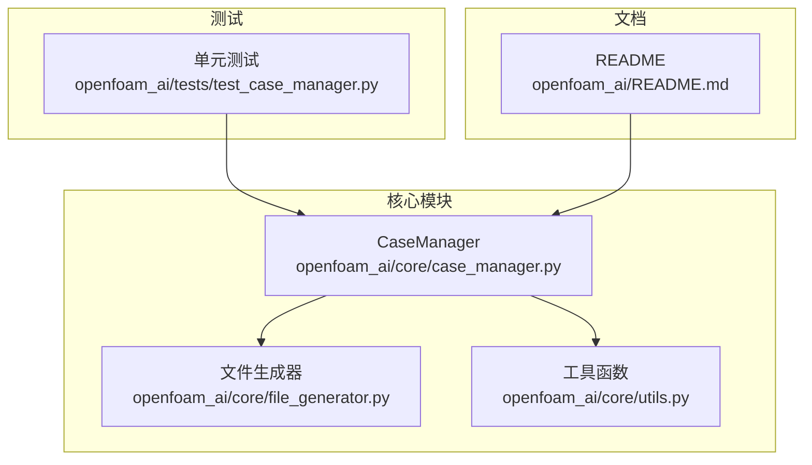
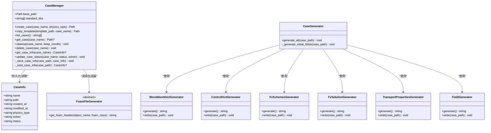
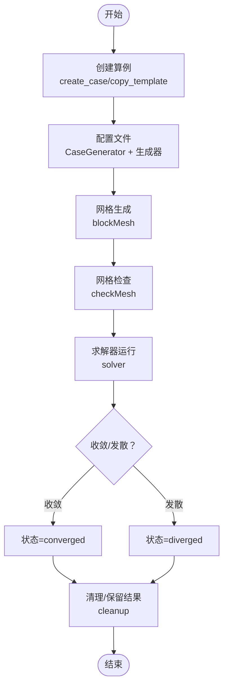
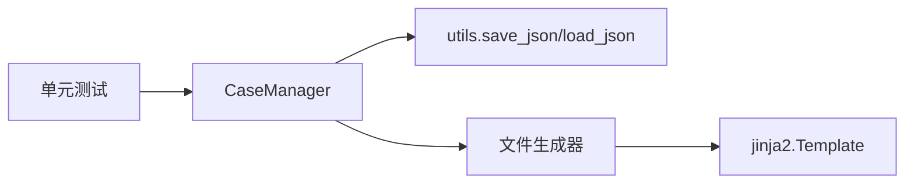

# CaseManager API

<cite>
**本文档引用的文件**
- [case_manager.py](file://openfoam_ai/core/case_manager.py)
- [file_generator.py](file://openfoam_ai/core/file_generator.py)
- [utils.py](file://openfoam_ai/core/utils.py)
- [test_case_manager.py](file://openfoam_ai/tests/test_case_manager.py)
- [README.md](file://openfoam_ai/README.md)
</cite>

## 目录
1. [简介](#简介)
2. [项目结构](#项目结构)
3. [核心组件](#核心组件)
4. [架构总览](#架构总览)
5. [详细组件分析](#详细组件分析)
6. [依赖关系分析](#依赖关系分析)
7. [性能考虑](#性能考虑)
8. [故障排除指南](#故障排除指南)
9. [结论](#结论)
10. [附录](#附录)

## 简介
本文件为 CaseManager 类的详细 API 参考文档，覆盖其核心方法接口规范、OpenFOAM 算例目录结构管理、文件生成器集成、算例生命周期管理、CaseInfo 数据类字段定义与状态枚举值、算例创建流程、目录结构规范、文件权限管理与状态跟踪机制，并提供最佳实践与错误处理指南，包括并发访问控制与数据一致性保障建议。

## 项目结构
- 核心模块位于 openfoam_ai/core，包含 CaseManager、文件生成器、通用工具等。
- 测试位于 openfoam_ai/tests，涵盖 CaseManager 的单元测试。
- README 提供系统架构与 API 参考概览。

**图表来源**
- [case_manager.py:1-639](file://openfoam_ai/core/case_manager.py#L1-L639)
- [file_generator.py:1-635](file://openfoam_ai/core/file_generator.py#L1-L635)
- [utils.py:1-111](file://openfoam_ai/core/utils.py#L1-L111)
- [test_case_manager.py:1-180](file://openfoam_ai/tests/test_case_manager.py#L1-L180)
- [README.md:161-174](file://openfoam_ai/README.md#L161-L174)

**章节来源**
- [README.md:130-150](file://openfoam_ai/README.md#L130-L150)

## 核心组件
- CaseManager：负责 OpenFOAM 算例目录结构的创建、复制、清理、删除与状态管理。
- CaseInfo：算例元数据数据类，包含名称、路径、创建/修改时间、物理类型、求解器、状态等字段。
- 文件生成器：BlockMeshDict、ControlDict、FvSchemes、FvSolution、Field、TransportProperties 等生成器，配合 CaseGenerator 一键生成完整算例文件。
- 工具函数：JSON 读写、目录确保、大小格式化、执行时间装饰器等。

**章节来源**
- [case_manager.py:15-261](file://openfoam_ai/core/case_manager.py#L15-L261)
- [file_generator.py:11-603](file://openfoam_ai/core/file_generator.py#L11-L603)
- [utils.py:16-111](file://openfoam_ai/core/utils.py#L16-L111)

## 架构总览
CaseManager 作为算例生命周期管理的核心，围绕标准 OpenFOAM 目录结构（0、constant、system、logs）进行操作；通过 JSON 文件 .case_info.json 持久化算例元数据；与文件生成器协作生成算例所需字典与初始场文件；提供状态跟踪与清理能力，支持后续求解器执行与后处理。

**图表来源**
- [case_manager.py:15-261](file://openfoam_ai/core/case_manager.py#L15-L261)
- [file_generator.py:11-603](file://openfoam_ai/core/file_generator.py#L11-L603)

## 详细组件分析

### CaseManager 类 API 规范

- 初始化
  - 方法：__init__(base_path: str = "./cases")
  - 参数：
    - base_path：算例根目录路径，默认 "./cases"
  - 行为：创建 base_path 目录；初始化标准 OpenFOAM 目录结构 ["0", "constant", "system", "logs"]

- create_case(case_name: str, physics_type: str = "incompressible") -> Path
  - 功能：创建标准 OpenFOAM 算例目录结构
  - 参数：
    - case_name：算例名称
    - physics_type：物理类型（如 "incompressible"、"heatTransfer" 等）
  - 返回：创建的算例路径
  - 行为：
    - 若目标路径已存在则先删除
    - 创建标准目录
    - 生成 CaseInfo 并保存为 .case_info.json
    - status 初始为 "init"
  - 异常：无显式异常抛出，内部使用 shutil.rmtree 与 Path 操作

- copy_template(template_path: str, case_name: str) -> Path
  - 功能：从模板复制算例
  - 参数：
    - template_path：模板算例路径
    - case_name：新算例名称
  - 返回：新算例路径
  - 行为：
    - 校验模板存在性
    - 删除目标路径（若存在）
    - 复制目录树
    - 更新 .case_info.json 中的 name 与 modified_at
  - 异常：模板不存在时抛出 FileNotFoundError

- list_cases() -> List[str]
  - 功能：列出所有有效算例
  - 行为：遍历 base_path 下的子目录，筛选同时包含 "system"、"constant" 的目录，返回名称列表

- get_case(case_name: str) -> Path | None
  - 功能：获取算例路径
  - 返回：存在则返回 Path，否则 None

- cleanup(case_name: str, keep_results: bool = False) -> None
  - 功能：清理算例文件
  - 参数：
    - keep_results：是否保留计算结果（时间步目录与并行目录）
  - 行为：
    - 删除以数字命名的时间步目录（尝试转换为浮点数）
    - 删除 processor* 并行目录
    - 清理 logs 目录，保留最近 3 个日志
    - 更新 .case_info.json：modified_at 设为当前时间，status 设为 "init"

- delete_case(case_name: str) -> None
  - 功能：删除算例
  - 行为：删除整个算例目录；不存在时不报错

- get_case_info(case_name: str) -> CaseInfo | None
  - 功能：获取算例信息
  - 返回：CaseInfo 对象或 None

- update_case_status(case_name: str, status: str, solver: str = "") -> None
  - 功能：更新算例状态与求解器
  - 参数：
    - status：新状态
    - solver：可选，求解器名称
  - 行为：加载 .case_info.json，更新 status 与 modified_at，可选更新 solver，再保存

- 内部方法
  - _save_case_info(case_path: Path, case_info: CaseInfo) -> None
    - 保存 CaseInfo 为 JSON 文件（.case_info.json）
  - _load_case_info(case_path: Path) -> CaseInfo | None
    - 从 JSON 文件加载 CaseInfo

- 便捷函数
  - create_cavity_case(case_manager: CaseManager, case_name: str = "cavity") -> Path
    - 在 create_case 基础上生成标准方腔驱动流所需的 blockMeshDict、controlDict、fvSchemes、fvSolution、初始场 U/p、transportProperties

**章节来源**
- [case_manager.py:38-261](file://openfoam_ai/core/case_manager.py#L38-L261)
- [test_case_manager.py:18-160](file://openfoam_ai/tests/test_case_manager.py#L18-L160)

### CaseInfo 数据类字段定义
- name：算例名称
- path：算例绝对路径
- created_at：创建时间（字符串）
- modified_at：最后修改时间（字符串）
- physics_type：物理类型（如 "incompressible"、"heatTransfer"）
- solver：求解器名称（如 "icoFoam"、"simpleFoam"）
- status：算例状态（字符串）

状态枚举值（由调用方维护，CaseManager 内部使用字符串）：
- init：初始化
- meshed：网格生成完成
- solving：求解中
- converged：收敛
- diverged：发散

注意：CaseManager.update_case_status 与 create_case 中 status 的初始值分别为 "init"。

**章节来源**
- [case_manager.py:15-86](file://openfoam_ai/core/case_manager.py#L15-L86)

### 文件生成器集成
- FoamFileGenerator：提供 OpenFOAM 文件头模板
- BlockMeshDictGenerator：生成 blockMeshDict，支持几何尺寸与网格分辨率配置
- ControlDictGenerator：生成 controlDict，支持求解器、起止时间、时间步长、写间隔等
- FvSchemesGenerator：根据物理类型生成 fvSchemes（不可压/传热/默认）
- FvSolutionGenerator：生成 fvSolution，包含求解器设置与算法参数（PISO/SIMPLE/PIMPLE）
- FieldGenerator：生成 U/p/T 等初始场文件，支持维度、内部值与边界条件
- TransportPropertiesGenerator：生成 transportProperties，设置运动粘度等
- CaseGenerator：整合上述生成器，一键生成完整算例文件（system、constant、0 目录）

这些生成器与 CaseManager 协作，通过 write 方法将文件写入对应目录，确保 OpenFOAM 算例的完整性与可执行性。

**章节来源**
- [file_generator.py:11-603](file://openfoam_ai/core/file_generator.py#L11-L603)

### 算例生命周期管理
- 创建：create_case 或 create_cavity_case
- 复制：copy_template
- 配置：结合 CaseGenerator 与文件生成器
- 清理：cleanup（可选择保留结果）
- 删除：delete_case
- 状态跟踪：update_case_status 与 .case_info.json

**图表来源**
- [case_manager.py:51-241](file://openfoam_ai/core/case_manager.py#L51-L241)
- [file_generator.py:506-532](file://openfoam_ai/core/file_generator.py#L506-L532)

## 依赖关系分析
- CaseManager 依赖：
  - 标准库：os、shutil、json、time、pathlib.Path、typing.List/Dict/Any/Optional、dataclasses.dataclass
  - 工具函数：utils.save_json/load_json（用于 .case_info.json 的持久化）
- 文件生成器：
  - jinja2.Template（FoamFileGenerator.get_foam_header 使用三引号字符串拼接，但未直接使用 jinja2）
  - pathlib.Path 与 typing 注解
- 测试：
  - 使用 tempfile、pytest 风格断言验证 CaseManager 的行为

**图表来源**
- [case_manager.py:6-12](file://openfoam_ai/core/case_manager.py#L6-L12)
- [file_generator.py](file://openfoam_ai/core/file_generator.py#L8)
- [utils.py:16-61](file://openfoam_ai/core/utils.py#L16-L61)
- [test_case_manager.py](file://openfoam_ai/tests/test_case_manager.py#L15)

**章节来源**
- [case_manager.py:6-12](file://openfoam_ai/core/case_manager.py#L6-L12)
- [file_generator.py](file://openfoam_ai/core/file_generator.py#L8)
- [utils.py:16-61](file://openfoam_ai/core/utils.py#L16-L61)
- [test_case_manager.py](file://openfoam_ai/tests/test_case_manager.py#L15)

## 性能考虑
- 目录与文件操作：
  - 使用 Path 操作替代 os.path，提升可读性与跨平台兼容性
  - 批量删除时间步目录与并行目录时，按需遍历，避免不必要的 IO
- JSON 持久化：
  - 通过 utils.save_json/load_json 提供统一的序列化/反序列化，减少重复代码
- 日志清理：
  - 仅保留最近 3 个日志，降低磁盘占用
- 建议优化：
  - 大型算例清理时，可考虑异步删除或分批处理
  - 对频繁读写的 .case_info.json，建议在内存中缓存并定期落盘

[本节为通用性能讨论，无需特定文件来源]

## 故障排除指南

常见问题与处理建议：
- 算例不存在
  - 现象：get_case 返回 None，cleanup/delete_case 输出警告
  - 处理：确认算例名称与 base_path 配置正确
- 模板不存在
  - 现象：copy_template 抛出 FileNotFoundError
  - 处理：检查模板路径是否存在且可访问
- JSON 解析错误
  - 现象：load_json 抛出 JSONDecodeError 或返回 None
  - 处理：检查 .case_info.json 格式与编码，必要时重建
- 权限问题
  - 现象：创建/删除目录失败
  - 处理：确保运行用户对 base_path 具有读写权限
- 状态不一致
  - 现象：状态与实际不符
  - 处理：通过 update_case_status 显式更新，或重新加载 .case_info.json 校验

并发访问控制与数据一致性建议：
- 互斥锁：在多线程/多进程场景下，对关键操作（创建、删除、状态更新）加锁
- 原子操作：使用临时文件写入后重命名的方式，避免部分写入导致的数据损坏
- 事务性：对涉及多个文件的操作（如生成完整算例）采用“全部成功或全部回滚”的策略
- 版本化：为 .case_info.json 引入版本号，便于升级与兼容

**章节来源**
- [case_manager.py:88-208](file://openfoam_ai/core/case_manager.py#L88-L208)
- [utils.py:38-61](file://openfoam_ai/core/utils.py#L38-L61)

## 结论
CaseManager 提供了 OpenFOAM 算例生命周期管理的核心能力，结合文件生成器与工具函数，能够高效地创建、配置、清理与删除算例，并通过 .case_info.json 实现状态跟踪。遵循本文档的最佳实践与错误处理建议，可在复杂场景中保持数据一致性与系统稳定性。

[本节为总结，无需特定文件来源]

## 附录

### API 方法一览表
- create_case(case_name: str, physics_type: str = "incompressible") -> Path
- copy_template(template_path: str, case_name: str) -> Path
- list_cases() -> List[str]
- get_case(case_name: str) -> Path | None
- cleanup(case_name: str, keep_results: bool = False) -> None
- delete_case(case_name: str) -> None
- get_case_info(case_name: str) -> CaseInfo | None
- update_case_status(case_name: str, status: str, solver: str = "") -> None

### 目录结构规范
- 顶层：base_path（默认 "./cases"）
- 算例目录：包含以下标准子目录
  - 0：初始场文件（U、p、T 等）
  - constant：常量属性（transportProperties 等）
  - system：求解器配置（blockMeshDict、controlDict、fvSchemes、fvSolution 等）
  - logs：日志文件

### 最佳实践
- 使用 create_cavity_case 快速创建标准算例模板
- 在执行求解前，先运行 blockMesh 与 checkMesh
- 使用 cleanup 保留结果时，谨慎保留大规模时间步目录
- 通过 update_case_status 明确标注算例状态，便于后续流程控制
- 对关键操作增加幂等性校验与回滚策略

**章节来源**
- [case_manager.py:48-86](file://openfoam_ai/core/case_manager.py#L48-L86)
- [README.md:52-102](file://openfoam_ai/README.md#L52-L102)