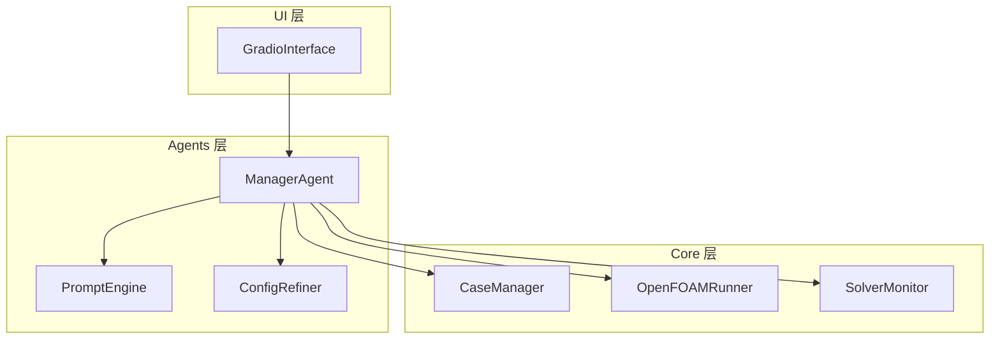
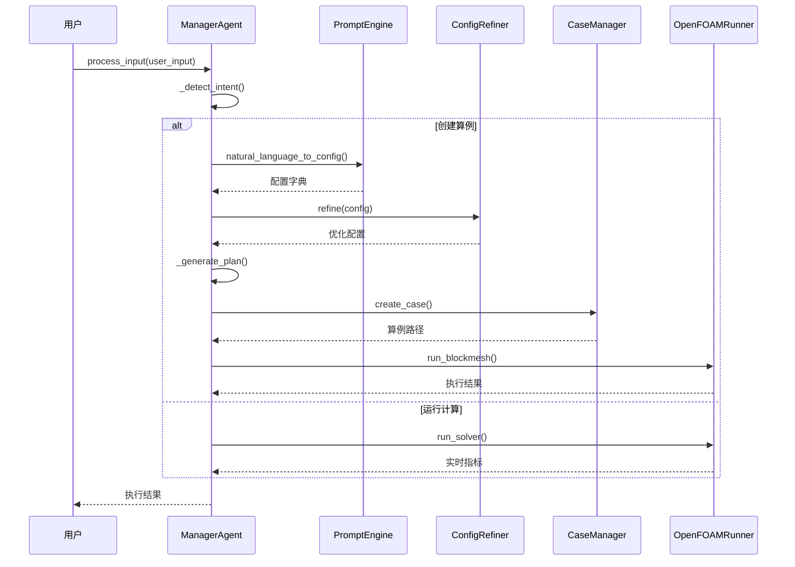
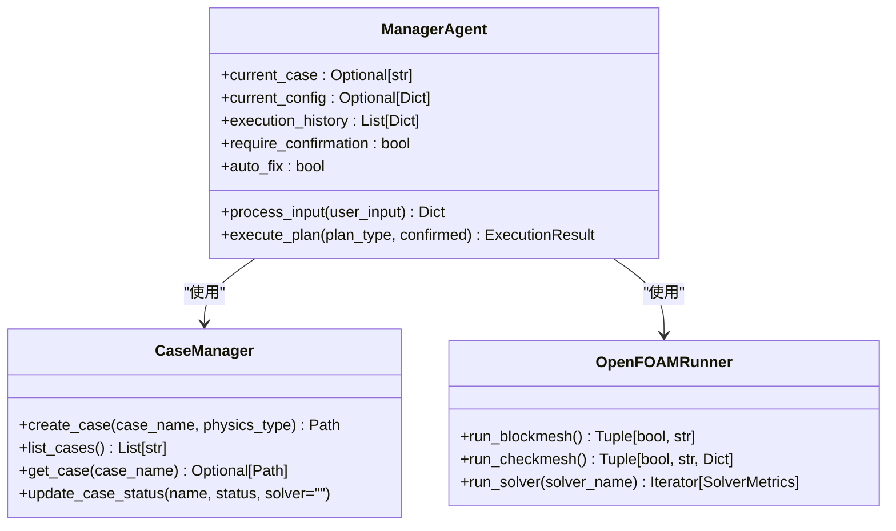
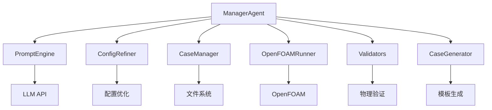

# ManagerAgent API

<cite>
**本文档引用的文件**
- [manager_agent.py](file://openfoam_ai/agents/manager_agent.py)
- [prompt_engine.py](file://openfoam_ai/agents/prompt_engine.py)
- [prompt_engine_v2.py](file://openfoam_ai/agents/prompt_engine_v2.py)
- [case_manager.py](file://openfoam_ai/core/case_manager.py)
- [openfoam_runner.py](file://openfoam_ai/core/openfoam_runner.py)
- [__init__.py](file://openfoam_ai/agents/__init__.py)
- [gradio_interface.py](file://openfoam_ai/ui/gradio_interface.py)
- [test_basic.py](file://openfoam_ai/tests/test_basic.py)
</cite>

## 目录
1. [简介](#简介)
2. [项目结构](#项目结构)
3. [核心组件](#核心组件)
4. [架构概览](#架构概览)
5. [详细组件分析](#详细组件分析)
6. [依赖关系分析](#依赖关系分析)
7. [性能考虑](#性能考虑)
8. [故障排除指南](#故障排除指南)
9. [结论](#结论)
10. [附录](#附录)

## 简介
ManagerAgent 是 OpenFOAM AI 系统中的核心协调代理，负责处理用户输入、理解用户意图、生成执行计划、协调各子代理完成任务以及管理会话状态。该代理实现了从自然语言到 OpenFOAM 仿真的完整自动化流程。

## 项目结构
ManagerAgent 位于 agents 包中，与其他核心组件协同工作：



**图表来源**
- [manager_agent.py:1-458](file://openfoam_ai/agents/manager_agent.py#L1-L458)
- [prompt_engine.py:1-200](file://openfoam_ai/agents/prompt_engine.py#L1-L200)
- [case_manager.py:1-200](file://openfoam_ai/core/case_manager.py#L1-L200)
- [openfoam_runner.py:1-200](file://openfoam_ai/core/openfoam_runner.py#L1-L200)

**章节来源**
- [manager_agent.py:1-458](file://openfoam_ai/agents/manager_agent.py#L1-L458)
- [__init__.py:1-184](file://openfoam_ai/agents/__init__.py#L1-L184)

## 核心组件

### ManagerAgent 类
ManagerAgent 是系统的核心协调器，负责：

- **用户输入处理**：理解用户意图并路由到相应处理函数
- **任务计划生成**：根据配置生成详细的执行步骤
- **状态管理**：维护当前算例、配置和执行历史
- **确认机制**：控制高风险操作的用户确认流程

### 数据类

#### TaskPlan 数据类
任务计划的数据结构，包含：
- `task_id`: 任务唯一标识符
- `description`: 任务描述
- `steps`: 执行步骤列表
- `requires_confirmation`: 是否需要用户确认
- `estimated_time`: 预估执行时间

#### ExecutionResult 数据类
执行结果的数据结构，包含：
- `success`: 执行是否成功
- `message`: 结果消息
- `outputs`: 输出数据字典
- `logs`: 日志记录列表

**章节来源**
- [manager_agent.py:19-36](file://openfoam_ai/agents/manager_agent.py#L19-L36)

## 架构概览



**图表来源**
- [manager_agent.py:75-435](file://openfoam_ai/agents/manager_agent.py#L75-L435)
- [prompt_engine.py:92-126](file://openfoam_ai/agents/prompt_engine.py#L92-L126)
- [case_manager.py:51-86](file://openfoam_ai/core/case_manager.py#L51-L86)
- [openfoam_runner.py:77-97](file://openfoam_ai/core/openfoam_runner.py#L77-L97)

## 详细组件分析

### 初始化参数和配置

ManagerAgent 的构造函数接受三个可选参数：

| 参数 | 类型 | 默认值 | 描述 |
|------|------|--------|------|
| `case_manager` | CaseManager | None | 算例管理器实例 |
| `prompt_engine` | PromptEngine | None | 提示词引擎实例 |
| `config_refiner` | ConfigRefiner | None | 配置优化器实例 |

内部配置选项：
- `require_confirmation`: 是否需要用户确认（默认 True）
- `auto_fix`: 是否自动修复（默认 True）

**章节来源**
- [manager_agent.py:50-74](file://openfoam_ai/agents/manager_agent.py#L50-L74)

### process_input() 方法

**方法签名**: `process_input(user_input: str) -> Dict[str, Any]`

**参数**:
- `user_input` (str): 用户的自然语言输入

**返回值**:
字典类型，包含以下键：
- `type`: 响应类型 (plan/error/help/status/unknown)
- `message`: 响应消息
- 其他根据类型特定的字段

**意图识别**:
- **创建**: "建立/创建/新建" 关键词
- **修改**: "修改/改变/调整" 关键词  
- **运行**: "运行/计算/开始" 关键词
- **状态**: "状态/进度/情况" 关键词
- **帮助**: "帮助/help/怎么用" 关键词

**异常处理**:
- 未知意图时返回错误响应
- 意图识别失败时提供帮助信息

**章节来源**
- [manager_agent.py:75-104](file://openfoam_ai/agents/manager_agent.py#L75-L104)
- [manager_agent.py:106-140](file://openfoam_ai/agents/manager_agent.py#L106-L140)

### execute_plan() 方法

**方法签名**: `execute_plan(plan_type: str, confirmed: bool = True) -> ExecutionResult`

**参数**:
- `plan_type` (str): 计划类型 ("create" 或 "run")
- `confirmed` (bool): 是否已获得用户确认

**返回值**:
- `ExecutionResult` 实例，包含执行结果详情

**执行逻辑**:
1. 检查确认要求
2. 根据计划类型调用相应执行函数
3. 处理未知计划类型

**异常处理**:
- 未确认时返回失败结果
- 未知计划类型时返回错误消息

**章节来源**
- [manager_agent.py:176-205](file://openfoam_ai/agents/manager_agent.py#L176-L205)

### _handle_create_case() 方法

**方法签名**: `_handle_create_case(user_input: str) -> Dict[str, Any]`

**执行流程**:
1. 使用 PromptEngine 将自然语言转换为配置
2. 使用 ConfigRefiner 优化配置
3. 验证配置的有效性
4. 生成执行计划
5. 保存配置到会话状态
6. 返回计划信息

**配置验证**:
- 使用 `validate_simulation_config()` 函数
- 返回验证结果和错误列表

**返回值**:
包含计划详情、配置摘要和确认要求的字典

**章节来源**
- [manager_agent.py:142-174](file://openfoam_ai/agents/manager_agent.py#L142-L174)

### _execute_create() 方法

**方法签名**: `_execute_create() -> ExecutionResult`

**执行步骤**:
1. 创建算例目录结构
2. 生成所有配置文件
3. 运行 blockMesh
4. 运行 checkMesh 并收集网格质量指标

**返回值**:
- 成功时返回包含算例路径和网格指标的结果
- 失败时返回错误信息和日志

**异常处理**:
- 捕获所有异常并返回详细的错误信息
- 记录执行过程中的所有日志

**章节来源**
- [manager_agent.py:207-266](file://openfoam_ai/agents/manager_agent.py#L207-L266)

### _execute_run() 方法

**方法签名**: `_execute_run() -> ExecutionResult`

**执行流程**:
1. 检查是否存在活动算例
2. 获取算例路径
3. 创建 OpenFOAMRunner 和 SolverMonitor
4. 启动求解器监控循环

**监控特性**:
- 实时显示求解进度（每100步）
- 检测发散趋势并支持自动修复
- 收集最终求解指标
- 更新算例状态

**返回值**:
- 成功时返回包含最终指标的摘要
- 失败时返回详细的错误信息

**章节来源**
- [manager_agent.py:268-338](file://openfoam_ai/agents/manager_agent.py#L268-L338)

### 状态管理机制

ManagerAgent 维护以下会话状态：



**图表来源**
- [manager_agent.py:62-73](file://openfoam_ai/agents/manager_agent.py#L62-L73)
- [case_manager.py:51-86](file://openfoam_ai/core/case_manager.py#L51-L86)
- [openfoam_runner.py:77-97](file://openfoam_ai/core/openfoam_runner.py#L77-L97)

**章节来源**
- [manager_agent.py:66-73](file://openfoam_ai/agents/manager_agent.py#L66-L73)

## 依赖关系分析



**图表来源**
- [manager_agent.py:12-16](file://openfoam_ai/agents/manager_agent.py#L12-L16)
- [prompt_engine.py:12-17](file://openfoam_ai/agents/prompt_engine.py#L12-L17)

**章节来源**
- [manager_agent.py:12-16](file://openfoam_ai/agents/manager_agent.py#L12-L16)

## 性能考虑

### 执行效率优化
- **异步监控**: SolverMonitor 提供实时指标更新
- **增量日志**: 每100步才记录一次日志，减少I/O开销
- **内存管理**: 及时清理临时文件和日志

### 资源管理
- **进程监控**: 自动检测求解器状态变化
- **自动修复**: 发散检测和自动修复机制
- **状态持久化**: 通过 CaseManager 维护算例状态

## 故障排除指南

### 常见问题及解决方案

**配置验证失败**:
- 检查网格分辨率范围 (10-1000)
- 确认时间步长满足库朗数限制
- 验证边界条件的物理合理性

**求解器执行错误**:
- 检查 OpenFOAM 安装和 PATH 设置
- 验证算例目录权限
- 确认磁盘空间充足

**网络连接问题** (Mock模式):
- 确保 API 密钥正确配置
- 检查网络连接状态
- 验证 LLM 服务可用性

**章节来源**
- [prompt_engine.py:122-125](file://openfoam_ai/agents/prompt_engine.py#L122-L125)
- [openfoam_runner.py:127-142](file://openfoam_ai/core/openfoam_runner.py#L127-L142)

## 结论
ManagerAgent 提供了一个完整的从自然语言到 OpenFOAM 仿真的自动化解决方案。其设计体现了良好的模块化架构，通过明确的接口定义和完善的错误处理机制，确保了系统的稳定性和可用性。该组件为后续的功能扩展和集成奠定了坚实的基础。

## 附录

### API 调用最佳实践

**意图识别流程**:
```python
# 基本使用模式
agent = ManagerAgent()

# 处理用户输入
response = agent.process_input("建立一个方腔驱动流")
if response["type"] == "plan":
    # 用户确认后执行
    result = agent.execute_plan("create", confirmed=True)
```

**配置优化建议**:
- 使用 ConfigRefiner 自动优化网格分辨率
- 确保时间步长满足稳定性要求
- 验证物理参数的合理性

**状态管理建议**:
- 定期检查算例状态
- 及时清理临时文件
- 监控求解器收敛情况

**章节来源**
- [manager_agent.py:438-458](file://openfoam_ai/agents/manager_agent.py#L438-L458)
- [prompt_engine_v2.py:447-484](file://openfoam_ai/agents/prompt_engine_v2.py#L447-L484)