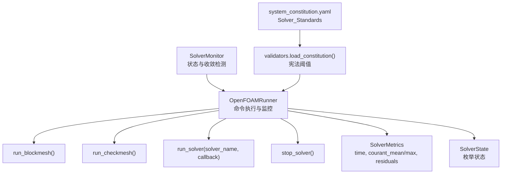
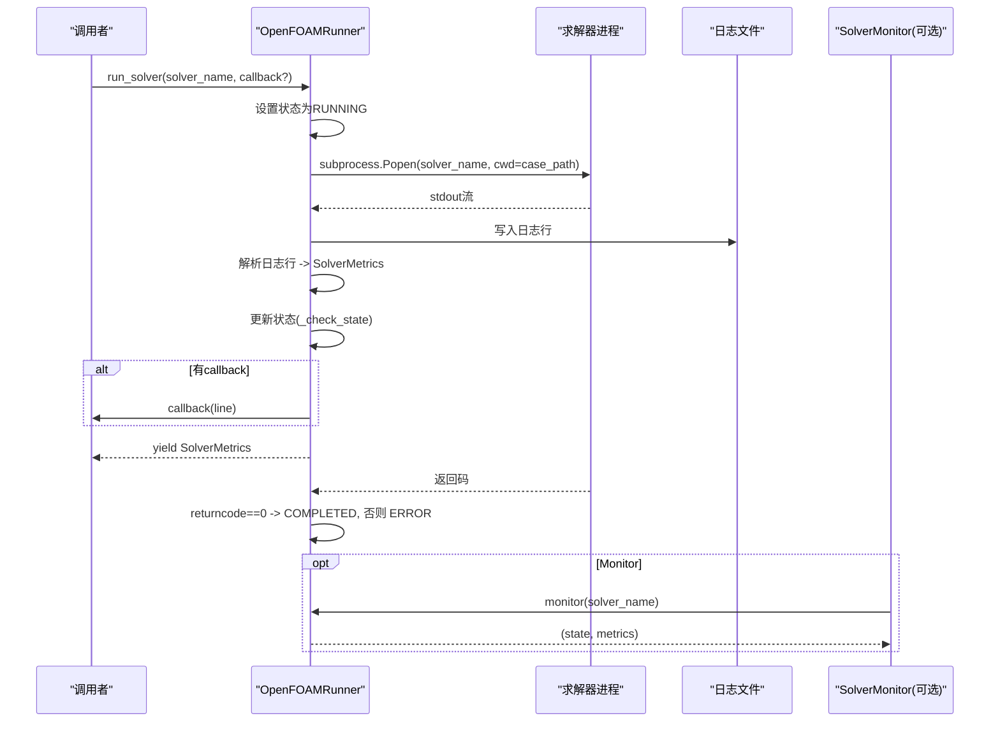
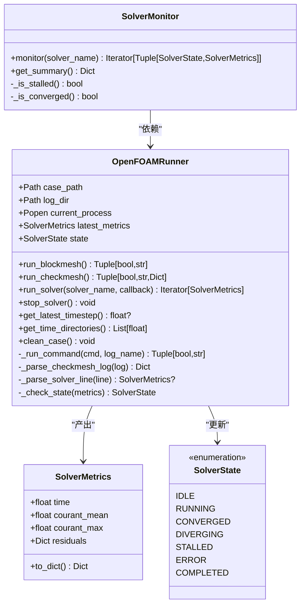
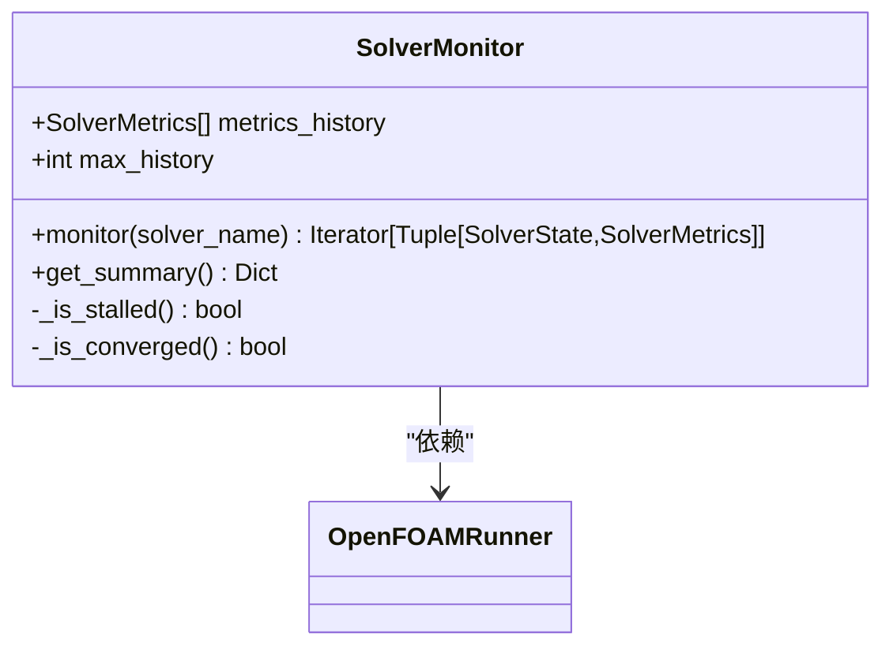
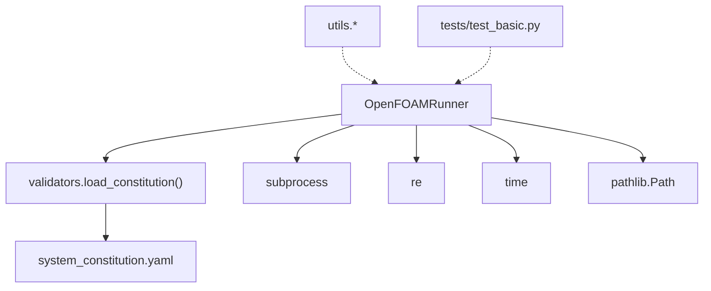
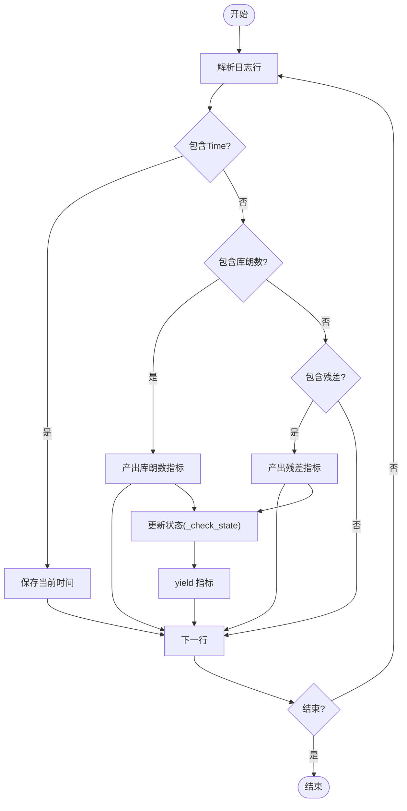

# OpenFOAMRunner API

<cite>
**本文引用的文件**
- [openfoam_ai/core/openfoam_runner.py](file://openfoam_ai/core/openfoam_runner.py)
- [openfoam_ai/core/validators.py](file://openfoam_ai/core/validators.py)
- [openfoam_ai/config/system_constitution.yaml](file://openfoam_ai/config/system_constitution.yaml)
- [openfoam_ai/core/utils.py](file://openfoam_ai/core/utils.py)
- [openfoam_ai/tests/test_basic.py](file://openfoam_ai/tests/test_basic.py)
</cite>

## 目录
1. [简介](#简介)
2. [项目结构](#项目结构)
3. [核心组件](#核心组件)
4. [架构总览](#架构总览)
5. [详细组件分析](#详细组件分析)
6. [依赖分析](#依赖分析)
7. [性能考虑](#性能考虑)
8. [故障排除指南](#故障排除指南)
9. [结论](#结论)
10. [附录](#附录)

## 简介
本文件为 OpenFOAMRunner 类的详细 API 参考文档，覆盖以下内容：
- run_blockmesh()、run_checkmesh()、run_solver() 等核心方法的接口规范与行为说明
- OpenFOAM 命令封装策略、实时监控机制、日志解析与错误处理接口
- SolverMonitor 类的监控接口、状态检测与性能指标收集方法
- 求解器执行流程、命令行参数配置、环境变量设置与进程管理接口
- 仿真执行最佳实践与故障排除指南，包括超时处理、内存监控与结果验证机制

## 项目结构
OpenFOAMRunner 位于核心模块 openfoam_ai/core/openfoam_runner.py，围绕以下职责组织：
- 命令执行：封装 blockMesh、checkMesh 等预处理命令
- 求解器执行：启动求解器进程，实时解析日志，产出 SolverMetrics
- 监控与状态：基于阈值与历史指标判断收敛、发散、停滞与错误
- 结果与清理：生成日志文件、清理中间结果、暴露最新时间步与目录

图表来源
- [openfoam_ai/core/openfoam_runner.py:44-548](file://openfoam_ai/core/openfoam_runner.py#L44-L548)
- [openfoam_ai/core/validators.py:13-16](file://openfoam_ai/core/validators.py#L13-L16)
- [openfoam_ai/config/system_constitution.yaml:23-31](file://openfoam_ai/config/system_constitution.yaml#L23-L31)

章节来源
- [openfoam_ai/core/openfoam_runner.py:44-548](file://openfoam_ai/core/openfoam_runner.py#L44-L548)

## 核心组件
- OpenFOAMRunner：封装 OpenFOAM 命令执行、日志捕获与解析、状态判定与进程管理
- SolverMonitor：对求解过程进行持续监控，检测停滞与收敛，并提供摘要
- SolverMetrics：求解器指标数据结构，包含时间、库朗数与各变量残差
- SolverState：求解器状态枚举，涵盖 idle、running、converged、diverging、stalled、error、completed

章节来源
- [openfoam_ai/core/openfoam_runner.py:16-42](file://openfoam_ai/core/openfoam_runner.py#L16-L42)
- [openfoam_ai/core/openfoam_runner.py:44-548](file://openfoam_ai/core/openfoam_runner.py#L44-L548)

## 架构总览
OpenFOAMRunner 的执行链路如下：
- 初始化：读取宪法配置，设置阈值；准备 logs 目录
- 预处理：执行 blockMesh、checkMesh，解析质量指标
- 求解器：启动进程，逐行读取标准输出，解析日志，产出指标并更新状态
- 监控：可选地由 SolverMonitor 持续监测收敛与停滞
- 清理：提供清理中间结果的能力

图表来源
- [openfoam_ai/core/openfoam_runner.py:99-198](file://openfoam_ai/core/openfoam_runner.py#L99-L198)
- [openfoam_ai/core/openfoam_runner.py:446-470](file://openfoam_ai/core/openfoam_runner.py#L446-L470)

## 详细组件分析

### OpenFOAMRunner 类
- 职责
  - 执行 blockMesh、checkMesh 等预处理命令
  - 启动求解器进程，实时解析日志，产出 SolverMetrics
  - 基于阈值与历史指标判断状态（收敛/发散/停滞/错误）
  - 提供停止求解器、清理算例、查询最新时间步等辅助能力

- 关键属性
  - case_path：算例路径
  - log_dir：日志目录（logs）
  - current_process：当前求解器进程
  - latest_metrics：最新指标
  - state：当前状态（SolverState）

- 关键方法与接口
  - run_blockmesh() -> Tuple[bool, str]
    - 执行 blockMesh，返回是否成功与日志内容
  - run_checkmesh() -> Tuple[bool, str, Dict[str, Any]]
    - 执行 checkMesh，返回是否成功、日志内容与质量指标
  - run_solver(solver_name: str, callback: Optional[Callable[[str], None]]) -> Iterator[SolverMetrics]
    - 启动求解器，逐行解析日志，产出指标并更新状态
    - 支持回调函数接收原始日志行
  - stop_solver() -> None
    - 停止当前求解器进程
  - get_latest_timestep() -> Optional[float]
    - 获取最新时间步
  - get_time_directories() -> List[float]
    - 获取所有时间步目录（升序）
  - clean_case() -> None
    - 清理算例（保留网格与配置）

- 日志解析与指标
  - 解析库朗数：Courant Number mean/max
  - 解析残差：Solving for ... Initial residual = ...
  - 解析时间：Time = ...

- 状态检测
  - 库朗数阈值：courant_limit_general
  - 残差阈值：divergence_threshold
  - 收敛目标：min_convergence_residual（来自宪法）

- 错误处理
  - 命令执行：捕获 FileNotFoundError、CalledProcessError 等
  - 求解器启动：捕获 FileNotFoundError、PermissionError、其他异常
  - 日志写入：异常时不中断求解器
  - 进程等待：超时后强制终止

- 进程管理
  - 启动：subprocess.Popen，stdout 捕获，stderr 合并
  - 停止：terminate，超时后 kill
  - 结束：检查 returncode，设置状态

- 环境与配置
  - 阈值来源：validators.load_constitution() 读取 system_constitution.yaml 中 Solver_Standards
  - PATH 与 OpenFOAM 安装：需确保求解器命令可执行

章节来源
- [openfoam_ai/core/openfoam_runner.py:55-76](file://openfoam_ai/core/openfoam_runner.py#L55-L76)
- [openfoam_ai/core/openfoam_runner.py:77-97](file://openfoam_ai/core/openfoam_runner.py#L77-L97)
- [openfoam_ai/core/openfoam_runner.py:99-198](file://openfoam_ai/core/openfoam_runner.py#L99-L198)
- [openfoam_ai/core/openfoam_runner.py:209-244](file://openfoam_ai/core/openfoam_runner.py#L209-L244)
- [openfoam_ai/core/openfoam_runner.py:410-427](file://openfoam_ai/core/openfoam_runner.py#L410-L427)
- [openfoam_ai/core/openfoam_runner.py:303-345](file://openfoam_ai/core/openfoam_runner.py#L303-L345)
- [openfoam_ai/core/openfoam_runner.py:347-387](file://openfoam_ai/core/openfoam_runner.py#L347-L387)
- [openfoam_ai/core/openfoam_runner.py:389-408](file://openfoam_ai/core/openfoam_runner.py#L389-L408)
- [openfoam_ai/core/validators.py:13-16](file://openfoam_ai/core/validators.py#L13-L16)
- [openfoam_ai/config/system_constitution.yaml:23-31](file://openfoam_ai/config/system_constitution.yaml#L23-L31)

#### 类图（代码级）

图表来源
- [openfoam_ai/core/openfoam_runner.py:44-548](file://openfoam_ai/core/openfoam_runner.py#L44-L548)

### SolverMonitor 类
- 职责
  - 对 OpenFOAMRunner.run_solver() 的指标流进行持续监控
  - 检测停滞（长时间无显著下降）、收敛（残差低于目标）
  - 提供监控摘要（最终时间、库朗数、残差、步数、最终状态）

- 关键方法
  - monitor(solver_name) -> Iterator[Tuple[SolverState, SolverMetrics]]
    - 基于历史指标与阈值，实时更新状态并产出 (state, metrics)
  - get_summary() -> Dict[str, Any]
    - 返回最终指标摘要

- 状态检测策略
  - 停滞检测：检查最近 N 步残差波动幅度，若无明显下降则判定停滞
  - 收敛检测：检查最新指标中所有残差是否低于收敛阈值

章节来源
- [openfoam_ai/core/openfoam_runner.py:429-517](file://openfoam_ai/core/openfoam_runner.py#L429-L517)

#### 类图（代码级）

图表来源
- [openfoam_ai/core/openfoam_runner.py:429-517](file://openfoam_ai/core/openfoam_runner.py#L429-L517)

### 数据模型与阈值
- SolverMetrics
  - 字段：time、courant_mean、courant_max、residuals
  - 方法：to_dict()

- SolverState
  - 枚举值：idle、running、converged、diverging、stalled、error、completed

- 阈值来源（system_constitution.yaml）
  - Solver_Standards：
    - min_convergence_residual
    - courant_limit_general
    - divergence_threshold

- 阈值加载
  - validators.load_constitution() 读取宪法配置，OpenFOAMRunner 在初始化时应用

章节来源
- [openfoam_ai/core/openfoam_runner.py:27-41](file://openfoam_ai/core/openfoam_runner.py#L27-L41)
- [openfoam_ai/core/openfoam_runner.py:55-76](file://openfoam_ai/core/openfoam_runner.py#L55-L76)
- [openfoam_ai/core/validators.py:13-16](file://openfoam_ai/core/validators.py#L13-L16)
- [openfoam_ai/config/system_constitution.yaml:23-31](file://openfoam_ai/config/system_constitution.yaml#L23-L31)

## 依赖分析
- OpenFOAMRunner 依赖
  - validators.load_constitution()：从宪法配置读取阈值
  - system_constitution.yaml：Solver_Standards 配置
  - subprocess：进程管理
  - re：日志解析正则
  - time：计时与等待
  - pathlib.Path：路径操作
  - typing：类型注解

- 间接依赖
  - utils.save_json/load_json/ensure_directory/format_size/log_execution_time：通用工具（非核心流程）
  - tests/test_basic.py：模块导入与基础功能验证（非核心流程）

图表来源
- [openfoam_ai/core/openfoam_runner.py:6-13](file://openfoam_ai/core/openfoam_runner.py#L6-L13)
- [openfoam_ai/core/validators.py:13-16](file://openfoam_ai/core/validators.py#L13-L16)
- [openfoam_ai/config/system_constitution.yaml:23-31](file://openfoam_ai/config/system_constitution.yaml#L23-L31)
- [openfoam_ai/core/utils.py:16-111](file://openfoam_ai/core/utils.py#L16-L111)
- [openfoam_ai/tests/test_basic.py:38-42](file://openfoam_ai/tests/test_basic.py#L38-L42)

章节来源
- [openfoam_ai/core/openfoam_runner.py:6-13](file://openfoam_ai/core/openfoam_runner.py#L6-L13)
- [openfoam_ai/core/validators.py:13-16](file://openfoam_ai/core/validators.py#L13-L16)
- [openfoam_ai/core/utils.py:16-111](file://openfoam_ai/core/utils.py#L16-L111)
- [openfoam_ai/tests/test_basic.py:38-42](file://openfoam_ai/tests/test_basic.py#L38-L42)

## 性能考虑
- 实时解析与流式输出
  - 使用 subprocess.PIPE 逐行读取 stdout，避免阻塞
  - 使用 flush() 保证日志及时落盘
- 指标解析效率
  - 正则表达式按需匹配，避免重复编译
- 状态判定
  - 基于阈值的 O(1) 判定，复杂度低
- I/O 与日志
  - 单线程写日志，避免并发竞争
- 资源释放
  - 进程结束后及时释放资源，避免僵尸进程

[本节为一般性指导，无需具体文件分析]

## 故障排除指南
- 常见错误与处理
  - 求解器命令未找到：检查 PATH 与 OpenFOAM 安装
  - 权限不足：确认用户对求解器有执行权限
  - 日志解码错误：忽略 UnicodeDecodeError 并继续处理
  - 日志写入异常：不影响求解器运行，继续处理
  - 进程等待超时：强制终止并记录警告
  - 返回码非零：标记为 ERROR

- 超时与停止
  - run_solver() 内部等待进程结束时使用超时，超时后强制终止
  - stop_solver() 提供主动停止接口

- 内存监控与资源限制
  - 代码未直接实现内存监控，建议结合外部工具或系统监控
  - 可通过 SolverMonitor 的历史指标观察收敛趋势，间接评估稳定性

- 结果验证
  - run_checkmesh() 返回质量指标，可用于网格质量验证
  - SolverMonitor.get_summary() 提供最终状态与指标摘要

- 环境变量与 PATH
  - 需确保求解器命令可在 PATH 中找到
  - 若使用分布式/容器环境，需正确配置 OpenFOAM 环境

章节来源
- [openfoam_ai/core/openfoam_runner.py:127-142](file://openfoam_ai/core/openfoam_runner.py#L127-L142)
- [openfoam_ai/core/openfoam_runner.py:175-178](file://openfoam_ai/core/openfoam_runner.py#L175-L178)
- [openfoam_ai/core/openfoam_runner.py:181-187](file://openfoam_ai/core/openfoam_runner.py#L181-L187)
- [openfoam_ai/core/openfoam_runner.py:199-207](file://openfoam_ai/core/openfoam_runner.py#L199-L207)
- [openfoam_ai/core/openfoam_runner.py:87-97](file://openfoam_ai/core/openfoam_runner.py#L87-L97)
- [openfoam_ai/core/openfoam_runner.py:503-516](file://openfoam_ai/core/openfoam_runner.py#L503-L516)

## 结论
OpenFOAMRunner 提供了完整的 OpenFOAM 命令封装、实时监控与错误处理能力，结合 SolverMonitor 可实现稳健的求解过程管理。通过宪法配置的阈值控制与日志解析，能够有效识别发散、停滞与收敛状态，为仿真执行提供可靠保障。建议在生产环境中配合外部资源监控与日志归档策略，进一步提升稳定性与可观测性。

[本节为总结性内容，无需具体文件分析]

## 附录

### API 接口规范

- OpenFOAMRunner.run_blockmesh()
  - 输入：无
  - 输出：(是否成功: bool, 日志内容: str)
  - 行为：执行 blockMesh，写入 logs/blockMesh.log，返回结果

- OpenFOAMRunner.run_checkmesh()
  - 输入：无
  - 输出：(是否成功: bool, 日志内容: str, 质量指标: Dict[str, Any])
  - 行为：执行 checkMesh，解析质量指标（失败检查数、非正交性、偏斜度、长宽比）

- OpenFOAMRunner.run_solver(solver_name: str, callback: Optional[Callable[[str], None]])
  - 输入：
    - solver_name: 求解器命令名
    - callback: 可选回调，接收原始日志行
  - 输出：迭代器，逐行产出 SolverMetrics
  - 行为：启动求解器进程，实时解析日志，产出指标并更新状态；异常时设置 ERROR 状态

- OpenFOAMRunner.stop_solver()
  - 输入：无
  - 输出：无
  - 行为：终止当前求解器进程，超时后强制杀死

- OpenFOAMRunner.get_latest_timestep() / get_time_directories()
  - 输入：无
  - 输出：最新时间步或时间步列表
  - 行为：扫描算例目录中的数值目录，提取时间步

- OpenFOAMRunner.clean_case()
  - 输入：无
  - 输出：无
  - 行为：删除时间步目录与 processor* 目录（保留网格与配置）

- SolverMonitor.monitor(solver_name: str)
  - 输入：求解器名称
  - 输出：迭代器，逐行产出 (状态: SolverState, 指标: SolverMetrics)
  - 行为：基于历史指标检测停滞与收敛，更新状态

- SolverMonitor.get_summary()
  - 输入：无
  - 输出：最终摘要字典（包含 final_time、final_courant_max、final_residuals、total_steps、final_state）

章节来源
- [openfoam_ai/core/openfoam_runner.py:77-97](file://openfoam_ai/core/openfoam_runner.py#L77-L97)
- [openfoam_ai/core/openfoam_runner.py:99-198](file://openfoam_ai/core/openfoam_runner.py#L99-L198)
- [openfoam_ai/core/openfoam_runner.py:199-207](file://openfoam_ai/core/openfoam_runner.py#L199-L207)
- [openfoam_ai/core/openfoam_runner.py:209-244](file://openfoam_ai/core/openfoam_runner.py#L209-L244)
- [openfoam_ai/core/openfoam_runner.py:410-427](file://openfoam_ai/core/openfoam_runner.py#L410-L427)
- [openfoam_ai/core/openfoam_runner.py:446-470](file://openfoam_ai/core/openfoam_runner.py#L446-L470)
- [openfoam_ai/core/openfoam_runner.py:503-516](file://openfoam_ai/core/openfoam_runner.py#L503-L516)

### 日志解析与错误处理流程

图表来源
- [openfoam_ai/core/openfoam_runner.py:347-387](file://openfoam_ai/core/openfoam_runner.py#L347-L387)
- [openfoam_ai/core/openfoam_runner.py:389-408](file://openfoam_ai/core/openfoam_runner.py#L389-L408)

### 环境变量与配置
- 环境变量（示例）
  - OPENFOAM_PATH、OPENFOAM_VERSION、OPENFOAM_INSTALL_DIR、OPENFOAM_USER_DIR
  - PARALLEL_CORES、DEBUG_MODE
- 配置文件
  - system_constitution.yaml：Solver_Standards（收敛阈值、库朗数限制、发散阈值等）

章节来源
- [openfoam_ai/core/validators.py:74-84](file://openfoam_ai/core/validators.py#L74-L84)
- [openfoam_ai/config/system_constitution.yaml:23-31](file://openfoam_ai/config/system_constitution.yaml#L23-L31)

### 最佳实践
- 预处理优先：先执行 blockMesh，再执行 checkMesh，最后运行求解器
- 参数配置：依据宪法阈值设置时间步长、收敛目标与库朗数上限
- 实时监控：使用 run_solver 的回调与 SolverMonitor 的监控接口
- 超时与停止：合理设置超时，必要时调用 stop_solver 主动停止
- 结果验证：利用 checkMesh 质量指标与 SolverMonitor 摘要进行验证
- 日志归档：关注 logs 目录下的日志文件，便于回溯与分析

[本节为一般性指导，无需具体文件分析]