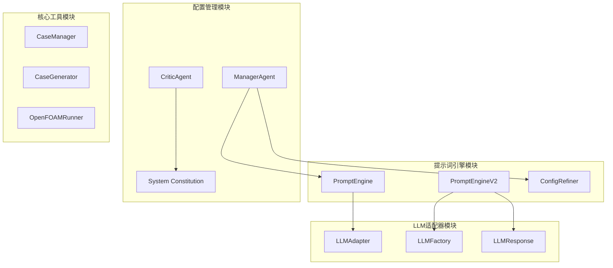
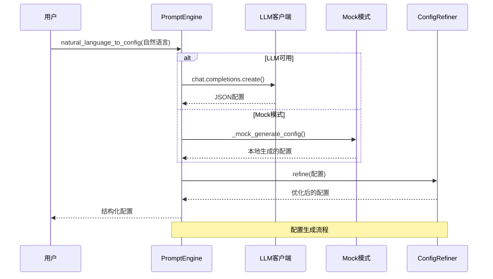
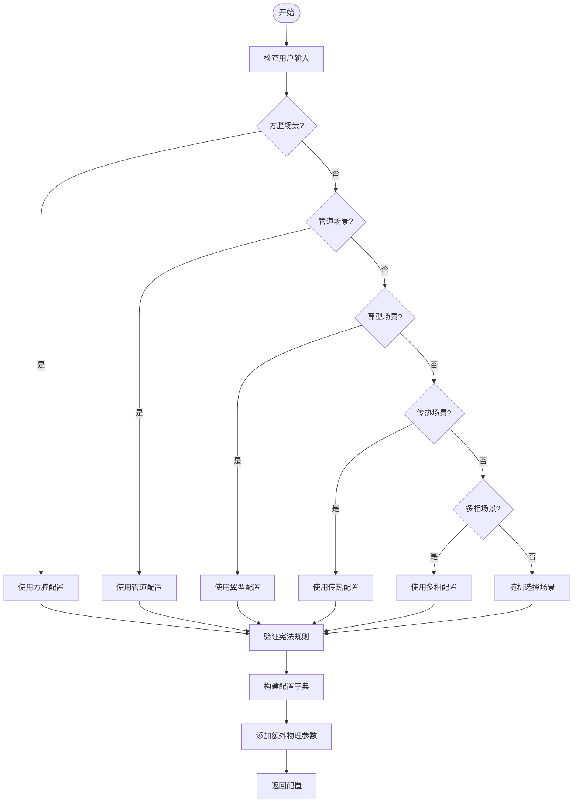
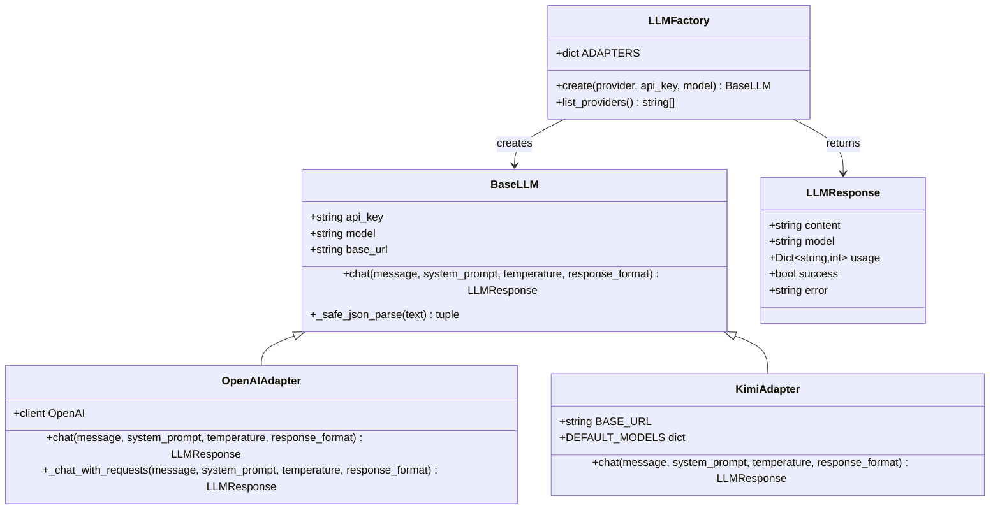
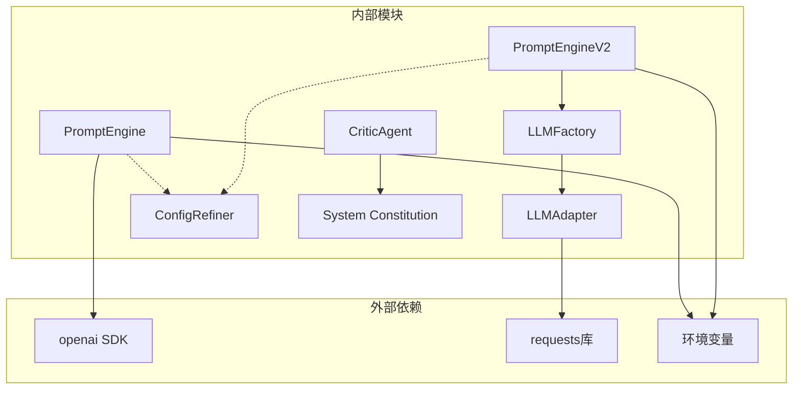
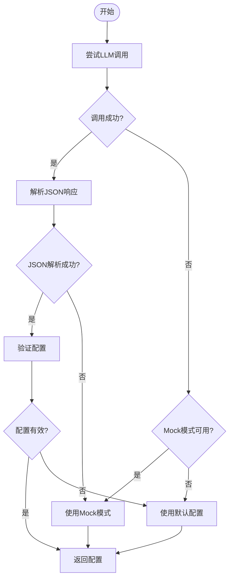

# PromptEngine API

<cite>
**本文档引用的文件**
- [prompt_engine.py](file://openfoam_ai/agents/prompt_engine.py)
- [prompt_engine_v2.py](file://openfoam_ai/agents/prompt_engine_v2.py)
- [llm_adapter.py](file://openfoam_ai/core/llm_adapter.py)
- [system_constitution.yaml](file://openfoam_ai/config/system_constitution.yaml)
- [manager_agent.py](file://openfoam_ai/agents/manager_agent.py)
- [critic_agent.py](file://openfoam_ai/agents/critic_agent.py)
</cite>

## 目录
1. [简介](#简介)
2. [项目结构](#项目结构)
3. [核心组件](#核心组件)
4. [架构概览](#架构概览)
5. [详细组件分析](#详细组件分析)
6. [依赖关系分析](#依赖关系分析)
7. [性能考虑](#性能考虑)
8. [故障排除指南](#故障排除指南)
9. [结论](#结论)

## 简介

PromptEngine 是 OpenFOAM AI 项目中的核心提示词引擎，负责将用户的自然语言描述转换为结构化的 OpenFOAM CFD 仿真配置。该引擎提供了完整的 LLM 集成接口、配置生成算法、提示词工程接口和 Mock 模式实现。

本项目支持多种 LLM 提供商，包括 OpenAI、KIMI、DeepSeek、豆包、GLM、MiniMax 和阿里云百炼等，为用户提供灵活的 AI 驱动仿真配置生成功能。

## 项目结构

OpenFOAM AI 项目采用模块化架构设计，主要包含以下核心模块：

**图表来源**
- [prompt_engine.py:1-616](file://openfoam_ai/agents/prompt_engine.py#L1-L616)
- [prompt_engine_v2.py:1-541](file://openfoam_ai/agents/prompt_engine_v2.py#L1-L541)
- [llm_adapter.py:1-688](file://openfoam_ai/core/llm_adapter.py#L1-L688)

**章节来源**
- [prompt_engine.py:1-616](file://openfoam_ai/agents/prompt_engine.py#L1-L616)
- [prompt_engine_v2.py:1-541](file://openfoam_ai/agents/prompt_engine_v2.py#L1-L541)
- [llm_adapter.py:1-688](file://openfoam_ai/core/llm_adapter.py#L1-L688)

## 核心组件

### PromptEngine 类

PromptEngine 是主要的提示词引擎类，提供以下核心功能：

- **自然语言到配置转换**：将用户输入的自然语言描述转换为结构化的 CFD 仿真配置
- **多轮对话上下文管理**：维护系统提示词和用户交互的历史记录
- **Mock 模式支持**：在没有 LLM API 的情况下提供本地配置生成能力
- **配置解释和改进建议**：提供配置解释和基于运行日志的改进建议

### PromptEngineV2 类

PromptEngineV2 是升级版本，支持多种 LLM 提供商：

- **多提供商适配**：支持 OpenAI、KIMI、DeepSeek、豆包、GLM、MiniMax、阿里云百炼等
- **统一接口设计**：提供一致的 API 接口，便于切换不同的 LLM 提供商
- **增强的错误处理**：更好的异常处理和回退机制

### ConfigRefiner 类

配置优化器负责对 LLM 生成的配置进行本地优化和修正：

- **网格分辨率优化**：确保网格数在合理范围内（10-1000）
- **时间步长优化**：防止计算步数过多导致的性能问题
- **关键参数验证**：检查物理类型与求解器的匹配性

**章节来源**
- [prompt_engine.py:20-474](file://openfoam_ai/agents/prompt_engine.py#L20-L474)
- [prompt_engine_v2.py:24-508](file://openfoam_ai/agents/prompt_engine_v2.py#L24-L508)
- [prompt_engine.py:476-571](file://openfoam_ai/agents/prompt_engine.py#L476-L571)

## 架构概览

**图表来源**
- [prompt_engine.py:92-126](file://openfoam_ai/agents/prompt_engine.py#L92-L126)
- [prompt_engine.py:217-374](file://openfoam_ai/agents/prompt_engine.py#L217-L374)
- [prompt_engine.py:485-532](file://openfoam_ai/agents/prompt_engine.py#L485-L532)

## 详细组件分析

### PromptEngine 类详细分析

#### 核心方法接口规范

**natural_language_to_config() 方法**
- **功能**：将自然语言转换为配置
- **参数**：user_input (str) - 用户输入的自然语言描述
- **返回值**：Dict[str, Any] - 结构化配置字典
- **异常处理**：捕获 LLM 调用异常，返回默认配置

**explain_config() 方法**
- **功能**：解释配置的含义
- **参数**：config (Dict[str, Any]) - 配置字典
- **返回值**：str - 自然语言解释
- **应用场景**：教育和培训用途

**suggest_improvements() 方法**
- **功能**：根据运行日志建议改进
- **参数**：config (Dict[str, Any]) - 当前配置, log_summary (str) - 日志摘要
- **返回值**：List[str] - 改进建议列表

#### Mock 模式实现

Mock 模式提供了基于关键词匹配的配置生成能力：

**图表来源**
- [prompt_engine.py:217-374](file://openfoam_ai/agents/prompt_engine.py#L217-L374)

**章节来源**
- [prompt_engine.py:92-167](file://openfoam_ai/agents/prompt_engine.py#L92-L167)
- [prompt_engine.py:217-457](file://openfoam_ai/agents/prompt_engine.py#L217-L457)

### PromptEngineV2 类详细分析

#### LLM 提供商适配器

PromptEngineV2 通过 LLMFactory 提供统一的适配器接口：

**图表来源**
- [llm_adapter.py:39-671](file://openfoam_ai/core/llm_adapter.py#L39-L671)

#### 支持的 LLM 提供商

| 提供商 | 模型名称 | API 端点 | 特殊功能 |
|--------|----------|----------|----------|
| OpenAI | gpt-4, gpt-3.5 | api.openai.com | 官方SDK支持 |
| KIMI | kimi-latest, kimi-k2 | api.moonshot.cn | 高质量中文理解 |
| DeepSeek | deepseek-chat | api.deepseek.com | 强大的推理能力 |
| 豆包 | doubao-pro, doubao-lite | dashscope.aliyuncs.com | 阿里云生态 |
| GLM | glm-4, glm-4-plus | open.bigmodel.cn | 清华智谱AI |
| MiniMax | abab6.5, abab6 | api.minimax.chat | 高性能推理 |
| 阿里云百炼 | qwen-max, qwen-plus | dashscope.aliyuncs.com | 多模态支持 |

**章节来源**
- [prompt_engine_v2.py:24-111](file://openfoam_ai/agents/prompt_engine_v2.py#L24-L111)
- [llm_adapter.py:577-671](file://openfoam_ai/core/llm_adapter.py#L577-L671)

### ConfigRefiner 类详细分析

#### 配置优化算法

ConfigRefiner 提供了多层次的配置优化功能：

**网格分辨率优化**
- 确保 nx, ny, nz 在 [10, 1000] 范围内
- 2D 问题自动设置 nz = 1
- 基于几何尺寸自动调整分辨率

**时间步长优化**
- 防止计算步数超过 10000 步
- 自动调整 deltaT 以满足步数限制

**关键参数验证**
- 物理类型与求解器匹配检查
- 网格数量合理性检查
- 计算步数合理性检查

**章节来源**
- [prompt_engine.py:485-571](file://openfoam_ai/agents/prompt_engine.py#L485-L571)
- [prompt_engine_v2.py:447-508](file://openfoam_ai/agents/prompt_engine_v2.py#L447-L508)

## 依赖关系分析

**图表来源**
- [prompt_engine.py:11-17](file://openfoam_ai/agents/prompt_engine.py#L11-L17)
- [llm_adapter.py:22-26](file://openfoam_ai/core/llm_adapter.py#L22-L26)

### 环境变量配置

| 环境变量 | 用途 | 示例值 |
|----------|------|--------|
| OPENAI_API_KEY | OpenAI API 密钥 | sk-... |
| KIMI_API_KEY | KIMI API 密钥 | moonshot... |
| DEEPSEEK_API_KEY | DeepSeek API 密钥 | ds-... |
| DOUBAO_API_KEY | 豆包 API 密钥 | sky-... |
| GLM_API_KEY | GLM API 密钥 | chatglm... |
| MINIMAX_API_KEY | MiniMax API 密钥 | R123... |
| ALIYUN_API_KEY | 阿里云 API 密钥 | LTAI... |

**章节来源**
- [llm_adapter.py:650-670](file://openfoam_ai/core/llm_adapter.py#L650-L670)

## 性能考虑

### LLM 调用优化

1. **温度参数调优**：PromptEngine 使用 temperature=0.3 确保输出稳定性和一致性
2. **JSON 输出格式**：使用 response_format={"type": "json_object"} 提高解析效率
3. **Mock 模式降级**：在 LLM 不可用时自动切换到本地配置生成

### 内存和计算优化

1. **配置大小限制**：ConfigRefiner 将网格分辨率限制在 [10, 1000] 范围内
2. **计算步数限制**：防止超过 10000 步的长时间计算
3. **资源使用监控**：LLMResponse 包含 token 使用量信息

## 故障排除指南

### 常见问题和解决方案

**LLM API 连接失败**
- 检查 API 密钥是否正确设置
- 验证网络连接和防火墙设置
- 确认 LLM 提供商的服务状态

**配置生成异常**
- 检查输入的自然语言描述是否清晰明确
- 验证 Mock 模式的关键词匹配
- 查看系统日志获取详细错误信息

**配置验证失败**
- 检查物理类型与求解器的匹配性
- 验证网格分辨率是否在合理范围内
- 确认边界条件设置的合理性

### 错误处理机制

**图表来源**
- [prompt_engine.py:105-125](file://openfoam_ai/agents/prompt_engine.py#L105-L125)
- [prompt_engine.py:458-473](file://openfoam_ai/agents/prompt_engine.py#L458-L473)

**章节来源**
- [prompt_engine.py:122-125](file://openfoam_ai/agents/prompt_engine.py#L122-L125)
- [prompt_engine.py:458-473](file://openfoam_ai/agents/prompt_engine.py#L458-L473)

## 结论

PromptEngine 系列为 OpenFOAM AI 项目提供了强大的 AI 驱动仿真配置生成功能。通过支持多种 LLM 提供商、完善的 Mock 模式实现和严格的配置验证机制，该系统能够为用户提供灵活、可靠的 CFD 仿真配置服务。

主要优势包括：
- **多提供商支持**：灵活切换不同的 LLM 提供商
- **本地降级机制**：确保在各种环境下都能正常工作
- **严格的配置验证**：基于宪法规则的硬约束检查
- **完整的错误处理**：提供稳健的异常处理和回退机制

未来的发展方向包括扩展更多 LLM 提供商支持、增强配置优化算法、提供更丰富的配置解释功能等。