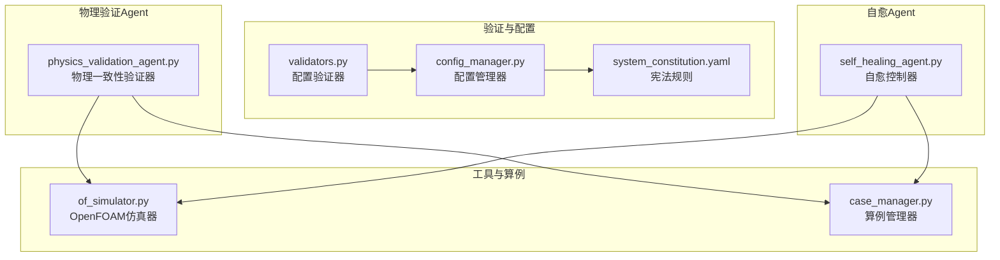
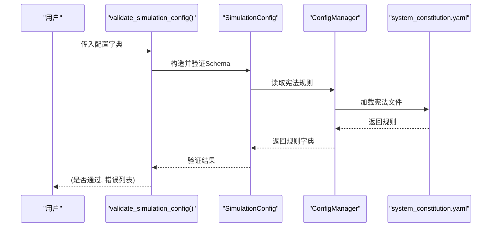
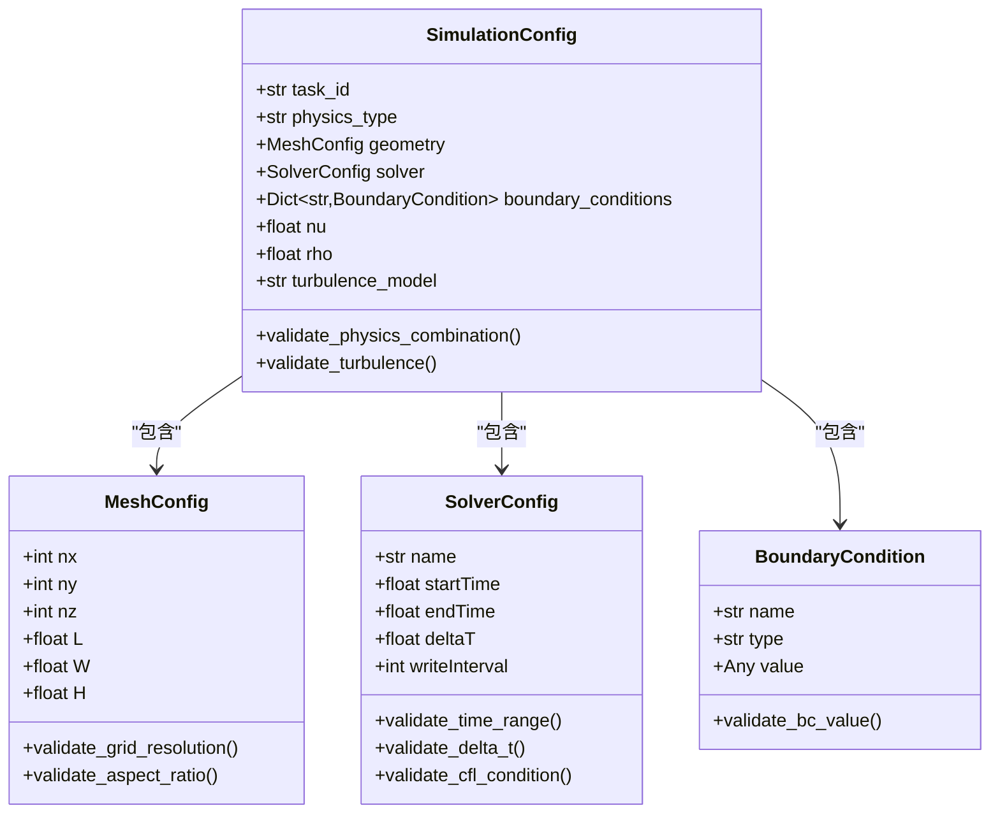
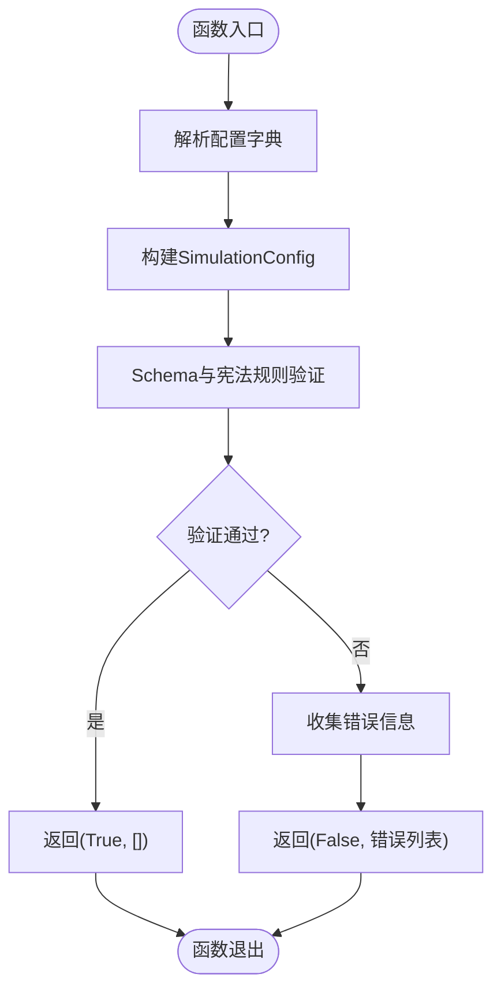
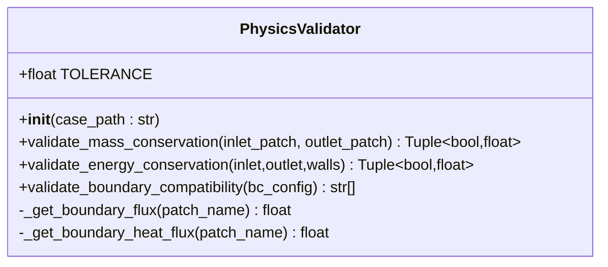
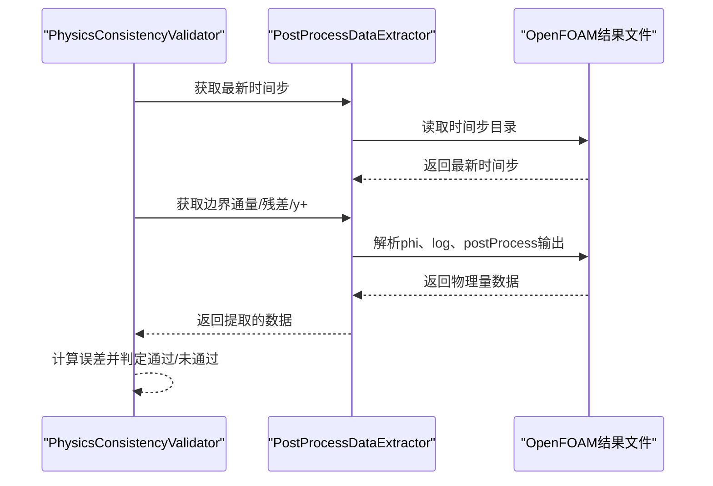
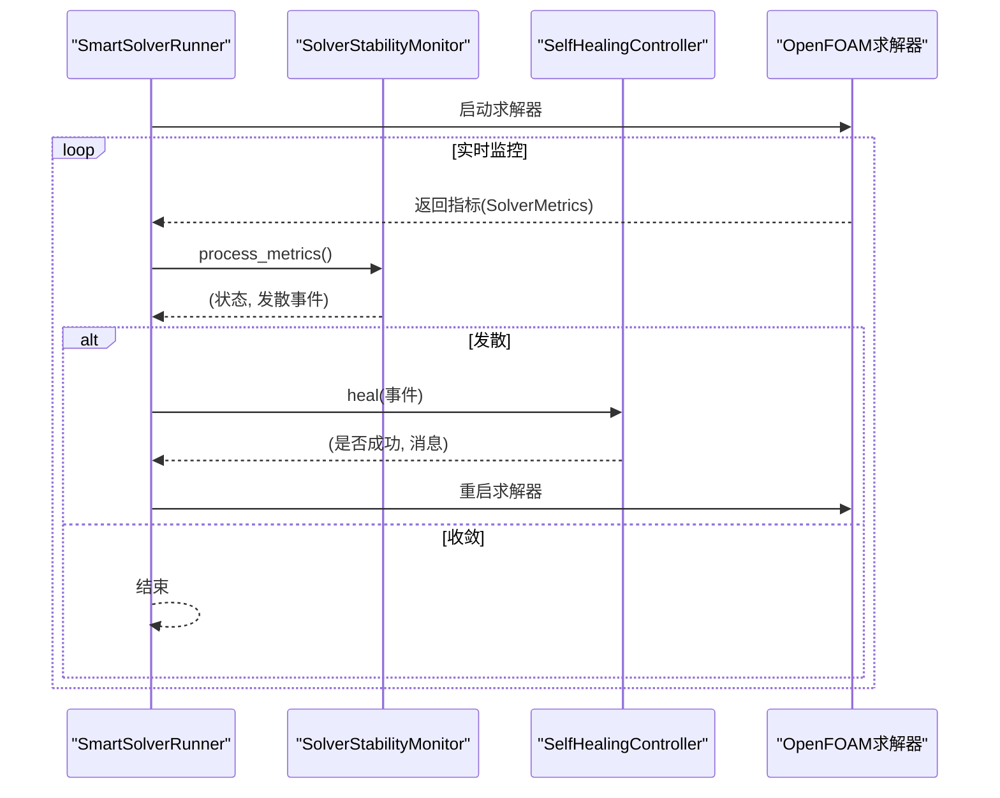
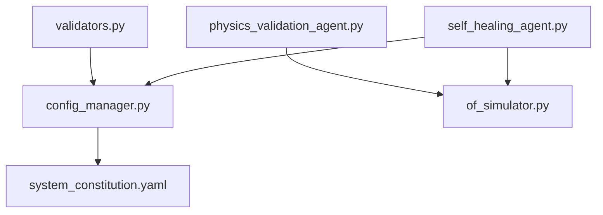

# Validators API

<cite>
**本文档引用的文件**
- [validators.py](file://openfoam_ai/core/validators.py)
- [physics_validation_agent.py](file://openfoam_ai/agents/physics_validation_agent.py)
- [self_healing_agent.py](file://openfoam_ai/agents/self_healing_agent.py)
- [config_manager.py](file://openfoam_ai/core/config_manager.py)
- [system_constitution.yaml](file://openfoam_ai/config/system_constitution.yaml)
- [of_simulator.py](file://openfoam_ai/utils/of_simulator.py)
- [case_manager.py](file://openfoam_ai/core/case_manager.py)
</cite>

## 目录
1. [简介](#简介)
2. [项目结构](#项目结构)
3. [核心组件](#核心组件)
4. [架构总览](#架构总览)
5. [详细组件分析](#详细组件分析)
6. [依赖关系分析](#依赖关系分析)
7. [性能考虑](#性能考虑)
8. [故障排除指南](#故障排除指南)
9. [结论](#结论)
10. [附录](#附录)

## 简介
本文件为PhysicsValidator类和validate_simulation_config()函数的详细API参考文档，涵盖：
- 配置验证接口规范与参数类型
- 物理约束检查方法与策略
- 质量标准验证函数的返回值结构与错误码定义
- PhysicsValidator类的验证策略、约束检查机制与自愈建议接口
- CFD仿真配置的完整性检查、物理合理性验证、边界条件检查与收敛性预测
- 完整的最佳实践与常见问题解决方案

## 项目结构
与验证相关的模块分布如下：
- 核心验证：openfoam_ai/core/validators.py
- 物理一致性验证Agent：openfoam_ai/agents/physics_validation_agent.py
- 自愈Agent：openfoam_ai/agents/self_healing_agent.py
- 配置管理：openfoam_ai/core/config_manager.py
- 宪法规则：openfoam_ai/config/system_constitution.yaml
- OpenFOAM仿真工具：openfoam_ai/utils/of_simulator.py
- 算例管理：openfoam_ai/core/case_manager.py

**图表来源**
- [validators.py:1-441](file://openfoam_ai/core/validators.py#L1-L441)
- [config_manager.py:1-227](file://openfoam_ai/core/config_manager.py#L1-L227)
- [system_constitution.yaml:1-103](file://openfoam_ai/config/system_constitution.yaml#L1-L103)
- [physics_validation_agent.py:1-517](file://openfoam_ai/agents/physics_validation_agent.py#L1-L517)
- [self_healing_agent.py:1-642](file://openfoam_ai/agents/self_healing_agent.py#L1-L642)
- [of_simulator.py:1-180](file://openfoam_ai/utils/of_simulator.py#L1-L180)
- [case_manager.py:1-639](file://openfoam_ai/core/case_manager.py#L1-L639)

**章节来源**
- [validators.py:1-441](file://openfoam_ai/core/validators.py#L1-L441)
- [physics_validation_agent.py:1-517](file://openfoam_ai/agents/physics_validation_agent.py#L1-L517)
- [self_healing_agent.py:1-642](file://openfoam_ai/agents/self_healing_agent.py#L1-L642)
- [config_manager.py:1-227](file://openfoam_ai/core/config_manager.py#L1-L227)
- [system_constitution.yaml:1-103](file://openfoam_ai/config/system_constitution.yaml#L1-L103)
- [of_simulator.py:1-180](file://openfoam_ai/utils/of_simulator.py#L1-L180)
- [case_manager.py:1-639](file://openfoam_ai/core/case_manager.py#L1-L639)

## 核心组件
本节聚焦两个关键API：
- validate_simulation_config(config_dict: Dict[str, Any]) -> Tuple[bool, List[str]]
- PhysicsValidator类及其验证方法

### validate_simulation_config()函数
- 功能：对仿真配置字典进行完整验证，返回验证结果与错误信息列表
- 参数：
  - config_dict: Dict[str, Any] —— 仿真配置字典
- 返回值：
  - Tuple[bool, List[str]] —— (是否通过, 错误信息列表)
- 错误处理：
  - 当配置不符合Schema或宪法规则时，抛出异常并收集错误信息
  - 成功时返回通过状态与空列表

**章节来源**
- [validators.py:389-411](file://openfoam_ai/core/validators.py#L389-L411)

### PhysicsValidator类
- 功能：后处理阶段的物理一致性验证，包括质量守恒、能量守恒、边界兼容性等
- 关键方法：
  - validate_mass_conservation(inlet_patch: str = "inlet", outlet_patch: str = "outlet") -> Tuple[bool, float]
  - validate_energy_conservation(inlet: str = "inlet", outlet: str = "outlet", walls: Optional[List[str]] = None) -> Tuple[bool, float]
  - validate_boundary_compatibility(bc_config: Dict[str, Any]) -> List[str]
- 容差设置：TOLERANCE = 0.001（0.1%）

**章节来源**
- [validators.py:277-387](file://openfoam_ai/core/validators.py#L277-L387)

## 架构总览
验证体系由“配置验证”和“物理验证/自愈”两大部分组成：
- 配置验证：基于Pydantic Schema与宪法规则，确保输入配置的合法性与合理性
- 物理验证：在仿真完成后，基于OpenFOAM结果进行质量守恒、能量守恒、收敛性等检查
- 自愈：在仿真过程中监控稳定性，自动调整参数或重启，提升成功率

**图表来源**
- [validators.py:389-411](file://openfoam_ai/core/validators.py#L389-L411)
- [validators.py:179-275](file://openfoam_ai/core/validators.py#L179-L275)
- [config_manager.py:94-119](file://openfoam_ai/core/config_manager.py#L94-L119)
- [system_constitution.yaml:1-103](file://openfoam_ai/config/system_constitution.yaml#L1-L103)

## 详细组件分析

### 配置验证器（Pydantic）
- MeshConfig：网格配置验证
  - 网格分辨率范围：nx, ny ∈ [10, 1000]；nz ∈ [1, 500]
  - 几何尺寸：L, W, H > 0
  - 长宽比与总网格数检查：依据宪法规则
- SolverConfig：求解器配置验证
  - 时间范围与时间步长合理性
  - CFL条件估计与提示
- BoundaryCondition：边界条件验证
  - 固定值边界需提供具体值
- SimulationConfig：完整仿真配置
  - 物理场组合检查（禁止组合、求解器与物理类型匹配）
  - 物理参数范围检查（运动粘度、密度）
  - 湍流模型合法性检查

**图表来源**
- [validators.py:18-87](file://openfoam_ai/core/validators.py#L18-L87)
- [validators.py:90-155](file://openfoam_ai/core/validators.py#L90-L155)
- [validators.py:158-177](file://openfoam_ai/core/validators.py#L158-L177)
- [validators.py:179-275](file://openfoam_ai/core/validators.py#L179-L275)

**章节来源**
- [validators.py:18-275](file://openfoam_ai/core/validators.py#L18-L275)

### validate_simulation_config()函数流程

**图表来源**
- [validators.py:389-411](file://openfoam_ai/core/validators.py#L389-L411)

**章节来源**
- [validators.py:389-411](file://openfoam_ai/core/validators.py#L389-L411)

### PhysicsValidator类
- validate_mass_conservation：计算进出口流量差，按容差判断是否通过
- validate_energy_conservation：计算热流入/出与壁面热流之和，按容差判断
- validate_boundary_compatibility：检查边界类型与命名是否合理，给出兼容性警告
- 容差：TOLERANCE = 0.001（0.1%）

**图表来源**
- [validators.py:277-387](file://openfoam_ai/core/validators.py#L277-L387)

**章节来源**
- [validators.py:277-387](file://openfoam_ai/core/validators.py#L277-L387)

### 物理一致性验证Agent（PostProcessDataExtractor + PhysicsConsistencyValidator）
- PostProcessDataExtractor：从OpenFOAM结果中提取边界通量、残差、y+等数据
- PhysicsConsistencyValidator：执行质量守恒、能量守恒、收敛性、边界兼容性、y+检查，并生成报告

**图表来源**
- [physics_validation_agent.py:38-172](file://openfoam_ai/agents/physics_validation_agent.py#L38-L172)
- [physics_validation_agent.py:174-478](file://openfoam_ai/agents/physics_validation_agent.py#L174-L478)

**章节来源**
- [physics_validation_agent.py:38-478](file://openfoam_ai/agents/physics_validation_agent.py#L38-L478)

### 自愈Agent（SolverStabilityMonitor + SelfHealingController）
- SolverStabilityMonitor：监控库朗数、残差变化趋势，识别发散类型并建议动作
- SelfHealingController：根据发散类型自动调整控制字典、松弛因子、非正交修正器等
- SmartSolverRunner：集成监控与自愈，支持多次重启与恢复

**图表来源**
- [self_healing_agent.py:58-477](file://openfoam_ai/agents/self_healing_agent.py#L58-L477)

**章节来源**
- [self_healing_agent.py:58-477](file://openfoam_ai/agents/self_healing_agent.py#L58-L477)

## 依赖关系分析
- validators.py依赖config_manager.py加载宪法规则
- physics_validation_agent.py依赖of_simulator.py解析OpenFOAM结果
- self_healing_agent.py依赖openfoam_runner（在本地模块中导入）
- system_constitution.yaml提供验证规则与容差阈值

**图表来源**
- [validators.py:11-15](file://openfoam_ai/core/validators.py#L11-L15)
- [config_manager.py:85-92](file://openfoam_ai/core/config_manager.py#L85-L92)
- [system_constitution.yaml:1-103](file://openfoam_ai/config/system_constitution.yaml#L1-L103)
- [physics_validation_agent.py:16-16](file://openfoam_ai/agents/physics_validation_agent.py#L16-L16)
- [of_simulator.py:13-21](file://openfoam_ai/utils/of_simulator.py#L13-L21)
- [self_healing_agent.py:17-24](file://openfoam_ai/agents/self_healing_agent.py#L17-L24)

**章节来源**
- [validators.py:11-15](file://openfoam_ai/core/validators.py#L11-L15)
- [config_manager.py:85-92](file://openfoam_ai/core/config_manager.py#L85-L92)
- [system_constitution.yaml:1-103](file://openfoam_ai/config/system_constitution.yaml#L1-L103)
- [physics_validation_agent.py:16-16](file://openfoam_ai/agents/physics_validation_agent.py#L16-L16)
- [of_simulator.py:13-21](file://openfoam_ai/utils/of_simulator.py#L13-L21)
- [self_healing_agent.py:17-24](file://openfoam_ai/agents/self_healing_agent.py#L17-L24)

## 性能考虑
- 配置验证采用Pydantic Schema与根级校验器，复杂度与字段数量线性相关
- 物理验证依赖OpenFOAM结果文件解析，I/O开销取决于时间步数量与变量种类
- 自愈过程涉及文件读写与正则替换，建议在必要时才触发，避免频繁修改控制字典

[本节为通用指导，无需特定文件来源]

## 故障排除指南
- 配置验证失败
  - 检查几何尺寸与网格分辨率是否满足宪法规则
  - 确认求解器与物理类型匹配，避免禁止组合
  - 校验时间步长与边界条件值
- 物理验证失败
  - 质量/能量守恒误差过大：检查边界命名与通量计算
  - 收敛性不足：查看残差日志，调整松弛因子或网格
- 自愈失败
  - 检查OpenFOAM安装与权限
  - 确认控制字典与求解参数可被正确修改

**章节来源**
- [validators.py:389-411](file://openfoam_ai/core/validators.py#L389-L411)
- [physics_validation_agent.py:174-478](file://openfoam_ai/agents/physics_validation_agent.py#L174-L478)
- [self_healing_agent.py:58-477](file://openfoam_ai/agents/self_healing_agent.py#L58-L477)

## 结论
本文档系统梳理了PhysicsValidator类与validate_simulation_config()函数的API规范与实现要点，结合宪法规则与实际工程经验，提供了配置验证、物理一致性检查与自愈策略的完整参考。建议在实际使用中：
- 严格遵循宪法规则与容差阈值
- 在仿真前后分别进行配置与物理验证
- 针对不稳定工况启用自愈机制
- 持续优化网格与求解参数，确保收敛性与物理合理性

[本节为总结性内容，无需特定文件来源]

## 附录

### API定义与参数说明
- validate_simulation_config(config_dict: Dict[str, Any]) -> Tuple[bool, List[str]]
  - 参数：配置字典
  - 返回：(是否通过, 错误信息列表)
- PhysicsValidator.__init__(case_path: str)
- PhysicsValidator.validate_mass_conservation(inlet_patch: str = "inlet", outlet_patch: str = "outlet") -> Tuple[bool, float]
- PhysicsValidator.validate_energy_conservation(inlet: str = "inlet", outlet: str = "outlet", walls: Optional[List[str]] = None) -> Tuple[bool, float]
- PhysicsValidator.validate_boundary_compatibility(bc_config: Dict[str, Any]) -> List[str]

**章节来源**
- [validators.py:389-411](file://openfoam_ai/core/validators.py#L389-L411)
- [validators.py:277-387](file://openfoam_ai/core/validators.py#L277-L387)

### 配置验证规则摘要
- 网格标准：最小网格数、长宽比、每方向最小网格数
- 求解器标准：CFL限制、松弛因子范围、默认写入间隔
- 物理约束：运动粘度与密度范围
- 禁止组合：求解器与物理类型的不兼容组合

**章节来源**
- [system_constitution.yaml:13-64](file://openfoam_ai/config/system_constitution.yaml#L13-L64)

### 物理验证容差
- 质量/能量守恒容差：0.1%
- 残差收敛目标：1e-6

**章节来源**
- [system_constitution.yaml:33-36](file://openfoam_ai/config/system_constitution.yaml#L33-L36)