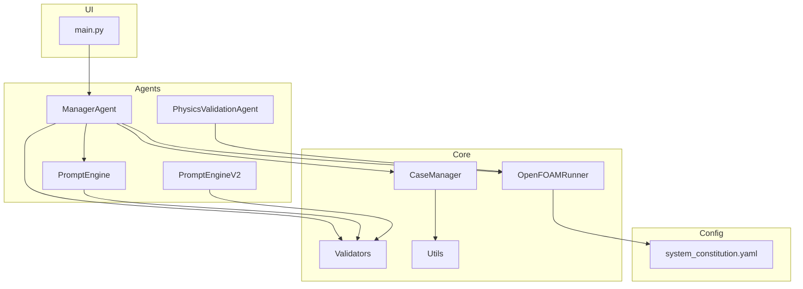
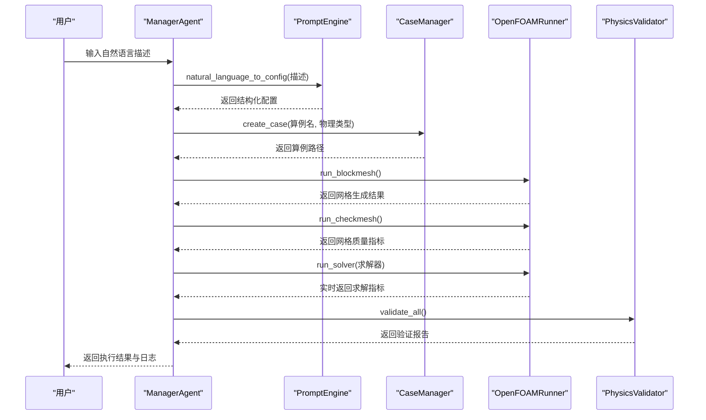
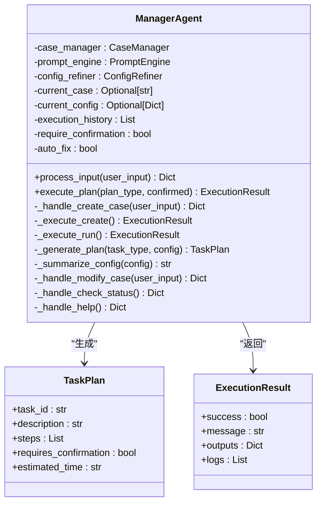
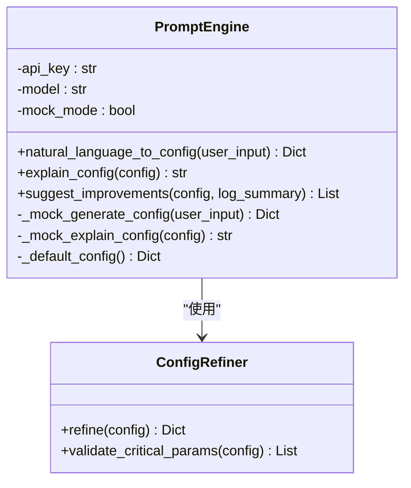
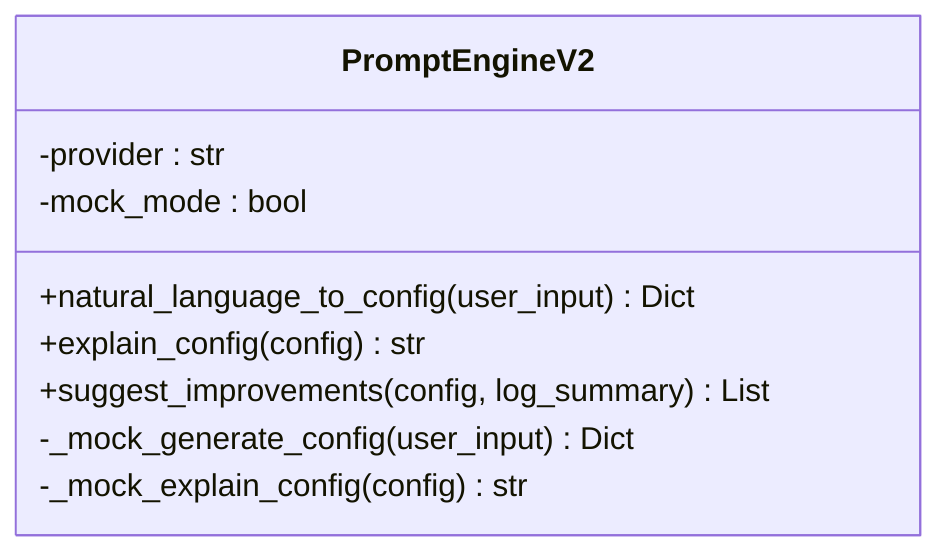
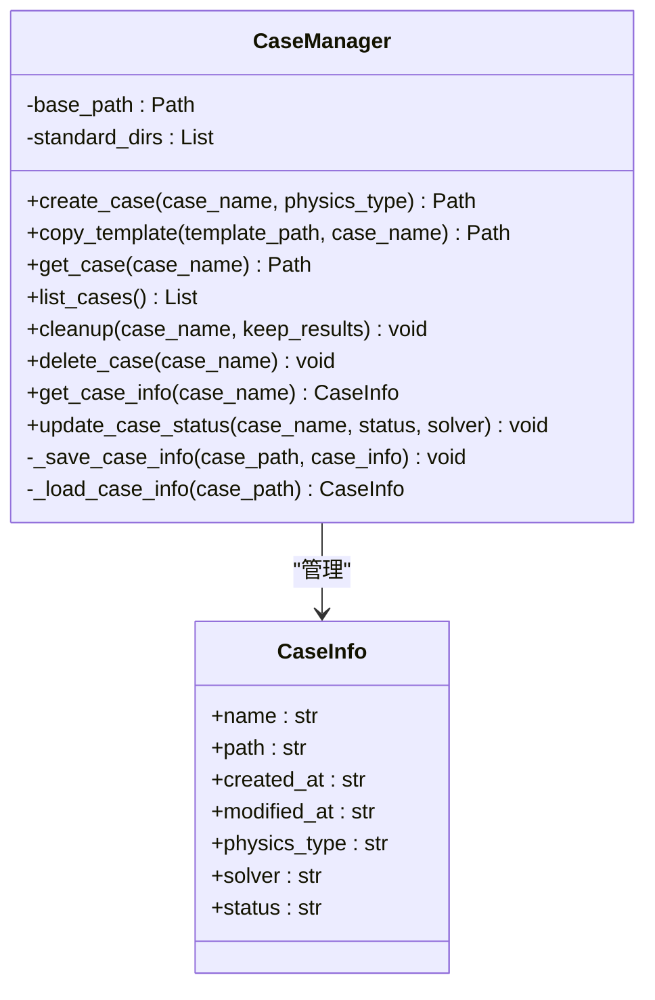
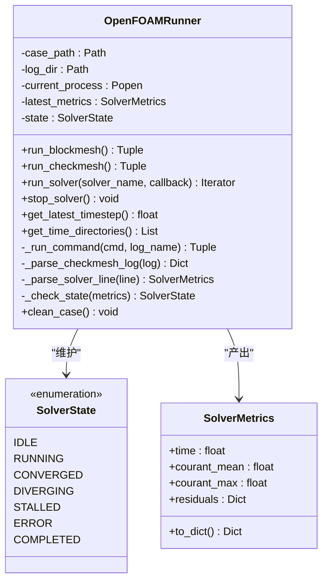
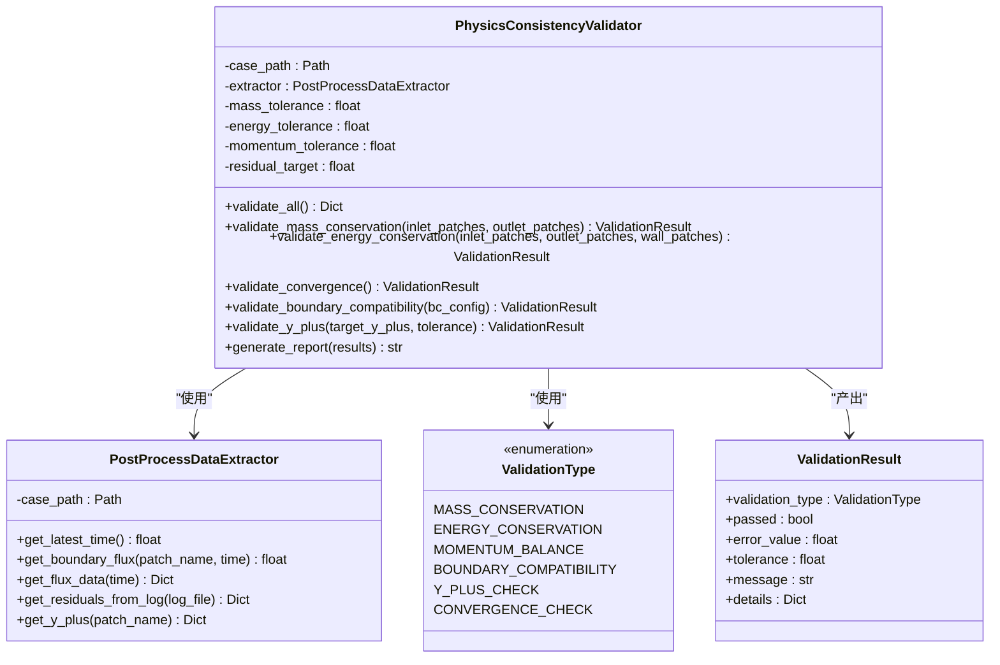
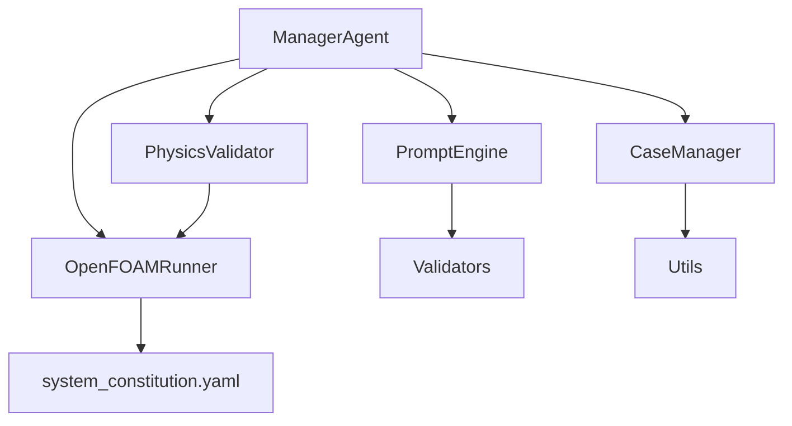

# 核心API接口

<cite>
**本文档引用的文件**
- [manager_agent.py](file://openfoam_ai/agents/manager_agent.py)
- [prompt_engine.py](file://openfoam_ai/agents/prompt_engine.py)
- [prompt_engine_v2.py](file://openfoam_ai/agents/prompt_engine_v2.py)
- [case_manager.py](file://openfoam_ai/core/case_manager.py)
- [openfoam_runner.py](file://openfoam_ai/core/openfoam_runner.py)
- [physics_validation_agent.py](file://openfoam_ai/agents/physics_validation_agent.py)
- [validators.py](file://openfoam_ai/core/validators.py)
- [utils.py](file://openfoam_ai/core/utils.py)
- [system_constitution.yaml](file://openfoam_ai/config/system_constitution.yaml)
- [main.py](file://openfoam_ai/main.py)
- [test_case_manager.py](file://openfoam_ai/tests/test_case_manager.py)
</cite>

## 目录
1. [简介](#简介)
2. [项目结构](#项目结构)
3. [核心组件](#核心组件)
4. [架构总览](#架构总览)
5. [详细组件分析](#详细组件分析)
6. [依赖关系分析](#依赖关系分析)
7. [性能考虑](#性能考虑)
8. [故障排除指南](#故障排除指南)
9. [结论](#结论)
10. [附录](#附录)

## 简介
本文件为OpenFOAM AI项目的核心API接口参考文档，聚焦以下核心类的公共接口规范：
- ManagerAgent：交互与记忆总控Agent，负责任务调度、用户交互和状态管理
- PromptEngine：LLM提示词引擎，将自然语言转换为结构化OpenFOAM配置
- CaseManager：OpenFOAM算例目录管理器，负责创建、管理和清理算例
- OpenFOAMRunner：OpenFOAM命令执行器，封装OpenFOAM命令执行、日志捕获和结果解析
- PhysicsValidator：物理一致性校验Agent，实现后处理阶段的物理验证

文档详细说明每个类的方法签名、参数类型、返回值定义、异常处理机制、初始化参数、配置选项与使用示例，并提供完整的API调用序列、最佳实践指南、各API之间的依赖关系与调用顺序、错误码与状态码说明以及故障排除指南。

## 项目结构
项目采用分层架构，核心模块位于openfoam_ai目录下：
- agents：智能体模块，包含各类Agent（ManagerAgent、PromptEngine、PhysicsValidator等）
- core：核心功能模块，包含算例管理、运行器、验证器、工具函数等
- config：配置文件，包含系统宪法（约束规则）
- tests：单元测试
- examples：示例代码
- ui：用户界面（CLI/Gradio）

图表来源
- [manager_agent.py:38-458](file://openfoam_ai/agents/manager_agent.py#L38-L458)
- [prompt_engine.py:20-616](file://openfoam_ai/agents/prompt_engine.py#L20-L616)
- [prompt_engine_v2.py:24-541](file://openfoam_ai/agents/prompt_engine_v2.py#L24-L541)
- [case_manager.py:27-639](file://openfoam_ai/core/case_manager.py#L27-L639)
- [openfoam_runner.py:44-548](file://openfoam_ai/core/openfoam_runner.py#L44-L548)
- [physics_validation_agent.py:174-517](file://openfoam_ai/agents/physics_validation_agent.py#L174-L517)
- [system_constitution.yaml:1-103](file://openfoam_ai/config/system_constitution.yaml#L1-L103)
- [main.py:19-251](file://openfoam_ai/main.py#L19-L251)

章节来源
- [main.py:1-251](file://openfoam_ai/main.py#L1-L251)

## 核心组件
本节概述核心API类的职责与公共接口要点：
- ManagerAgent：接收用户输入，理解意图，生成执行计划，协调各子Agent完成任务，管理会话状态，与用户确认关键操作
- PromptEngine：管理System Prompt，将自然语言转换为JSON配置，处理多轮对话上下文，支持Mock模式
- CaseManager：创建标准OpenFOAM算例目录结构，复制模板算例，清理算例文件，管理算例元数据
- OpenFOAMRunner：执行blockMesh、checkMesh等预处理命令，运行求解器并实时监控，捕获和解析日志，检测发散和异常
- PhysicsValidator：执行质量守恒、能量守恒、收敛性等物理一致性验证，生成验证报告

章节来源
- [manager_agent.py:38-458](file://openfoam_ai/agents/manager_agent.py#L38-L458)
- [prompt_engine.py:20-616](file://openfoam_ai/agents/prompt_engine.py#L20-L616)
- [case_manager.py:27-639](file://openfoam_ai/core/case_manager.py#L27-L639)
- [openfoam_runner.py:44-548](file://openfoam_ai/core/openfoam_runner.py#L44-L548)
- [physics_validation_agent.py:174-517](file://openfoam_ai/agents/physics_validation_agent.py#L174-L517)

## 架构总览
OpenFOAM AI的系统架构围绕ManagerAgent作为总控中心，协调PromptEngine生成配置、CaseManager创建算例、OpenFOAMRunner执行仿真、PhysicsValidator进行后处理验证。系统宪法（system_constitution.yaml）提供硬约束规则，Validators模块基于Pydantic进行硬约束验证。

图表来源
- [manager_agent.py:75-338](file://openfoam_ai/agents/manager_agent.py#L75-L338)
- [prompt_engine.py:92-126](file://openfoam_ai/agents/prompt_engine.py#L92-L126)
- [case_manager.py:51-86](file://openfoam_ai/core/case_manager.py#L51-L86)
- [openfoam_runner.py:77-198](file://openfoam_ai/core/openfoam_runner.py#L77-L198)
- [physics_validation_agent.py:197-224](file://openfoam_ai/agents/physics_validation_agent.py#L197-L224)

## 详细组件分析

### ManagerAgent 类
- 职责：接收用户输入，理解意图，生成执行计划，协调各子Agent完成任务，管理会话状态，与用户确认关键操作
- 初始化参数：
  - case_manager: CaseManager实例（可选，默认创建）
  - prompt_engine: PromptEngine实例（可选，默认创建）
  - config_refiner: ConfigRefiner实例（可选，默认创建）
- 关键方法：
  - process_input(user_input: str) -> Dict[str, Any]：处理用户输入，返回响应字典
  - execute_plan(plan_type: str, confirmed: bool = True) -> ExecutionResult：执行计划
  - _handle_create_case(user_input: str) -> Dict[str, Any]：处理创建算例请求
  - _execute_create() -> ExecutionResult：执行创建算例
  - _execute_run() -> ExecutionResult：执行仿真计算
  - _generate_plan(task_type: str, config: Dict[str, Any]) -> TaskPlan：生成任务计划
  - _summarize_config(config: Dict[str, Any]) -> str：生成配置摘要
  - _handle_modify_case(user_input: str) -> Dict[str, Any]：处理修改算例请求（待实现）
  - _handle_check_status() -> Dict[str, Any]：处理查看状态请求
  - _handle_help() -> Dict[str, Any]：处理帮助请求
- 数据结构：
  - TaskPlan：任务计划数据类
  - ExecutionResult：执行结果数据类
- 异常处理：在执行过程中捕获异常并返回ExecutionResult，包含success、message、outputs、logs
- 配置选项：require_confirmation（是否需要确认）、auto_fix（是否自动修复）
- 使用示例：见main.py交互模式与演示模式

图表来源
- [manager_agent.py:19-74](file://openfoam_ai/agents/manager_agent.py#L19-L74)
- [manager_agent.py:176-205](file://openfoam_ai/agents/manager_agent.py#L176-L205)
- [manager_agent.py:207-266](file://openfoam_ai/agents/manager_agent.py#L207-L266)
- [manager_agent.py:268-338](file://openfoam_ai/agents/manager_agent.py#L268-L338)

章节来源
- [manager_agent.py:38-458](file://openfoam_ai/agents/manager_agent.py#L38-L458)
- [main.py:37-99](file://openfoam_ai/main.py#L37-L99)

### PromptEngine 类
- 职责：管理System Prompt，将自然语言转换为JSON配置，处理多轮对话上下文
- 初始化参数：
  - api_key: OpenAI API密钥（可选，从环境变量读取）
  - model: 使用的模型（默认"gpt-4"）
- 关键方法：
  - natural_language_to_config(user_input: str) -> Dict[str, Any]：将自然语言转换为配置
  - explain_config(config: Dict[str, Any]) -> str：解释配置的含义
  - suggest_improvements(config: Dict[str, Any], log_summary: str) -> List[str]：根据运行日志建议改进
  - _mock_generate_config(user_input: str) -> Dict[str, Any]：Mock模式生成配置
  - _mock_explain_config(config: Dict[str, Any]) -> str：Mock模式解释配置
  - _default_config() -> Dict[str, Any]：返回默认配置
- 配置优化器ConfigRefiner：
  - refine(config: Dict[str, Any]) -> Dict[str, Any]：优化配置
  - validate_critical_params(config: Dict[str, Any]) -> List[str]：验证关键参数
- 异常处理：在LLM调用失败时回退到Mock模式并返回默认配置
- 使用示例：见main.py演示模式与测试

图表来源
- [prompt_engine.py:20-91](file://openfoam_ai/agents/prompt_engine.py#L20-L91)
- [prompt_engine.py:476-571](file://openfoam_ai/agents/prompt_engine.py#L476-L571)

章节来源
- [prompt_engine.py:20-616](file://openfoam_ai/agents/prompt_engine.py#L20-L616)

### PromptEngineV2 类
- 职责：支持多种大语言模型（OpenAI、KIMI、DeepSeek、豆包、GLM、MiniMax、阿里云百炼）
- 初始化参数：
  - provider: 模型提供商（默认"openai"）
  - api_key: API密钥（可选，从环境变量读取）
  - model: 模型名称（可选）
  - mock_mode: 是否强制使用Mock模式（用于测试）
- 关键方法：
  - natural_language_to_config(user_input: str) -> Dict[str, Any]：将自然语言转换为配置
  - explain_config(config: Dict[str, Any]) -> str：解释配置的含义
  - suggest_improvements(config: Dict[str, Any], log_summary: str) -> list：根据运行日志建议改进
  - _mock_generate_config(user_input: str) -> Dict[str, Any]：Mock模式生成配置
  - _mock_explain_config(config: Dict[str, Any]) -> str：Mock模式解释配置
- 异常处理：初始化失败或LLM调用失败时回退到Mock模式
- 使用示例：见prompt_engine_v2.py测试代码

图表来源
- [prompt_engine_v2.py:24-111](file://openfoam_ai/agents/prompt_engine_v2.py#L24-L111)

章节来源
- [prompt_engine_v2.py:24-541](file://openfoam_ai/agents/prompt_engine_v2.py#L24-L541)

### CaseManager 类
- 职责：创建标准OpenFOAM算例目录结构，复制模板算例，清理算例文件，管理算例元数据
- 初始化参数：
  - base_path: 算例根目录路径（默认"./cases"）
- 关键方法：
  - create_case(case_name: str, physics_type: str = "incompressible") -> Path：创建算例目录
  - copy_template(template_path: str, case_name: str) -> Path：从模板复制算例
  - get_case(case_name: str) -> Optional[Path]：获取算例路径
  - list_cases() -> List[str]：列出所有算例
  - cleanup(case_name: str, keep_results: bool = False) -> None：清理算例文件
  - delete_case(case_name: str) -> None：删除算例
  - get_case_info(case_name: str) -> Optional[CaseInfo]：获取算例信息
  - update_case_status(case_name: str, status: str, solver: str = "") -> None：更新算例状态
- 数据结构：
  - CaseInfo：算例信息数据类（name, path, created_at, modified_at, physics_type, solver, status）
- 异常处理：文件操作异常记录日志，不存在时返回None或抛出异常
- 使用示例：见main.py演示模式与单元测试

图表来源
- [case_manager.py:15-25](file://openfoam_ai/core/case_manager.py#L15-L25)
- [case_manager.py:38-86](file://openfoam_ai/core/case_manager.py#L38-L86)

章节来源
- [case_manager.py:27-639](file://openfoam_ai/core/case_manager.py#L27-L639)
- [test_case_manager.py:18-180](file://openfoam_ai/tests/test_case_manager.py#L18-L180)

### OpenFOAMRunner 类
- 职责：执行blockMesh、checkMesh等预处理命令，运行求解器并实时监控，捕获和解析日志，检测发散和异常
- 初始化参数：
  - case_path: 算例路径
- 关键方法：
  - run_blockmesh() -> Tuple[bool, str]：执行blockMesh
  - run_checkmesh() -> Tuple[bool, str, Dict[str, Any]]：执行checkMesh
  - run_solver(solver_name: str, callback: Optional[Callable] = None) -> Iterator[SolverMetrics]：运行求解器并实时返回指标
  - stop_solver() -> None：停止当前求解器
  - get_latest_timestep() -> Optional[float]：获取最新的时间步
  - get_time_directories() -> List[float]：获取所有时间步目录
  - _run_command(cmd: str, log_name: str) -> Tuple[bool, str]：执行单条命令
  - _parse_checkmesh_log(log: str) -> Dict[str, Any]：解析checkMesh日志
  - _parse_solver_line(line: str) -> Optional[SolverMetrics]：解析求解器日志行
  - _check_state(metrics: SolverMetrics) -> SolverState：检查求解器状态
  - clean_case() -> None：清理算例（保留网格和配置）
- 数据结构：
  - SolverState：枚举（IDLE、RUNNING、CONVERGED、DIVERGING、STALLED、ERROR、COMPLETED）
  - SolverMetrics：数据类（time、courant_mean、courant_max、residuals）
- 异常处理：命令执行异常、权限错误、进程等待超时等均被捕获并记录
- 使用示例：见main.py演示模式与单元测试

图表来源
- [openfoam_runner.py:16-42](file://openfoam_ai/core/openfoam_runner.py#L16-L42)
- [openfoam_runner.py:55-76](file://openfoam_ai/core/openfoam_runner.py#L55-L76)
- [openfoam_runner.py:77-198](file://openfoam_ai/core/openfoam_runner.py#L77-L198)

章节来源
- [openfoam_runner.py:44-548](file://openfoam_ai/core/openfoam_runner.py#L44-L548)

### PhysicsValidator 类
- 职责：执行质量守恒、能量守恒、收敛性等物理一致性验证，生成验证报告
- 初始化参数：
  - case_path: 算例路径
- 关键方法：
  - validate_all() -> Dict[str, Any]：执行所有验证
  - validate_mass_conservation(inlet_patches: Optional[List[str]] = None, outlet_patches: Optional[List[str]] = None) -> ValidationResult：验证质量守恒
  - validate_energy_conservation(inlet_patches: Optional[List[str]] = None, outlet_patches: Optional[List[str]] = None, wall_patches: Optional[List[str]] = None) -> ValidationResult：验证能量守恒
  - validate_convergence() -> ValidationResult：验证收敛性
  - validate_boundary_compatibility(bc_config: Dict[str, Any]) -> ValidationResult：验证边界条件兼容性
  - validate_y_plus(target_y_plus: float = 30.0, tolerance: float = 0.3) -> ValidationResult：验证y+值
  - generate_report(results: Dict[str, Any]) -> str：生成验证报告
- 数据结构：
  - ValidationType：枚举（MASS_CONSERVATION、ENERGY_CONSERVATION、MOMENTUM_BALANCE、BOUNDARY_COMPATIBILITY、Y_PLUS_CHECK、CONVERGENCE_CHECK）
  - ValidationResult：验证结果数据类
- 异常处理：数据提取失败时返回相应错误信息
- 使用示例：见physics_validation_agent.py测试代码

图表来源
- [physics_validation_agent.py:17-25](file://openfoam_ai/agents/physics_validation_agent.py#L17-L25)
- [physics_validation_agent.py:174-189](file://openfoam_ai/agents/physics_validation_agent.py#L174-L189)
- [physics_validation_agent.py:226-276](file://openfoam_ai/agents/physics_validation_agent.py#L226-L276)

章节来源
- [physics_validation_agent.py:174-517](file://openfoam_ai/agents/physics_validation_agent.py#L174-L517)

## 依赖关系分析
- ManagerAgent依赖PromptEngine、CaseManager、OpenFOAMRunner、PhysicsValidator与Validators模块
- PromptEngine依赖LLM适配器（llm_adapter）或Mock模式
- CaseManager依赖utils模块进行JSON文件的读写
- OpenFOAMRunner依赖system_constitution.yaml中的宪法配置
- PhysicsValidator依赖OpenFOAMRunner提取后处理数据

图表来源
- [manager_agent.py:12-16](file://openfoam_ai/agents/manager_agent.py#L12-L16)
- [prompt_engine.py:11-17](file://openfoam_ai/agents/prompt_engine.py#L11-L17)
- [case_manager.py:244-257](file://openfoam_ai/core/case_manager.py#L244-L257)
- [openfoam_runner.py](file://openfoam_ai/core/openfoam_runner.py#L13)
- [physics_validation_agent.py:1-15](file://openfoam_ai/agents/physics_validation_agent.py#L1-L15)

章节来源
- [manager_agent.py:12-16](file://openfoam_ai/agents/manager_agent.py#L12-L16)
- [prompt_engine.py:11-17](file://openfoam_ai/agents/prompt_engine.py#L11-L17)
- [case_manager.py:244-257](file://openfoam_ai/core/case_manager.py#L244-L257)
- [openfoam_runner.py](file://openfoam_ai/core/openfoam_runner.py#L13)
- [physics_validation_agent.py:1-15](file://openfoam_ai/agents/physics_validation_agent.py#L1-L15)

## 性能考虑
- 网格分辨率与计算步数：ConfigRefiner与Validators模块对网格分辨率与时间步长进行限制，避免过大的计算量
- 求解器稳定性：OpenFOAMRunner根据宪法配置的Courant数与残差阈值进行状态判断，防止发散
- 日志与监控：OpenFOAMRunner实时解析日志并输出关键指标，便于及时发现收敛问题
- Mock模式：PromptEngine支持Mock模式，在无API Key或LLM不可用时仍可生成合理配置

## 故障排除指南
- OpenFOAM命令未找到：检查OpenFOAM是否正确安装并添加到PATH
- 权限不足：确保用户具有执行求解器的权限
- 网格质量检查失败：根据checkMesh输出的指标（非正交性、偏斜度、长宽比）调整网格
- 发散或停滞：降低时间步长、调整松弛因子或细化网格
- LLM调用失败：检查API Key配置或切换到Mock模式
- 算例清理：使用CaseManager的cleanup方法清理算例文件，保留必要的日志与结果

章节来源
- [openfoam_runner.py:118-142](file://openfoam_ai/core/openfoam_runner.py#L118-L142)
- [openfoam_runner.py:276-291](file://openfoam_ai/core/openfoam_runner.py#L276-L291)
- [prompt_engine.py:122-125](file://openfoam_ai/agents/prompt_engine.py#L122-L125)
- [case_manager.py:148-194](file://openfoam_ai/core/case_manager.py#L148-L194)

## 结论
OpenFOAM AI项目通过ManagerAgent统一调度，结合PromptEngine的自然语言理解能力、CaseManager的标准算例管理、OpenFOAMRunner的命令执行与监控，以及PhysicsValidator的物理一致性验证，构建了一个完整的自动化CFD仿真工作流。系统宪法与Validators模块提供了硬约束保障，确保生成的配置符合物理规律与工程实践。通过本文档的接口规范与最佳实践，开发者可以高效集成与扩展系统功能。

## 附录
- API调用序列最佳实践：
  1) 用户输入自然语言描述
  2) ManagerAgent调用PromptEngine生成配置
  3) ManagerAgent调用CaseManager创建算例
  4) ManagerAgent调用OpenFOAMRunner执行blockMesh与checkMesh
  5) ManagerAgent调用OpenFOAMRunner运行求解器并监控
  6) ManagerAgent调用PhysicsValidator进行后处理验证
  7) 返回执行结果与日志给用户
- 错误码与状态码：
  - SolverState：IDLE、RUNNING、CONVERGED、DIVERGING、STALLED、ERROR、COMPLETED
  - 配置验证：通过/失败，返回错误信息列表
  - 文件操作：成功/失败，返回布尔值或None