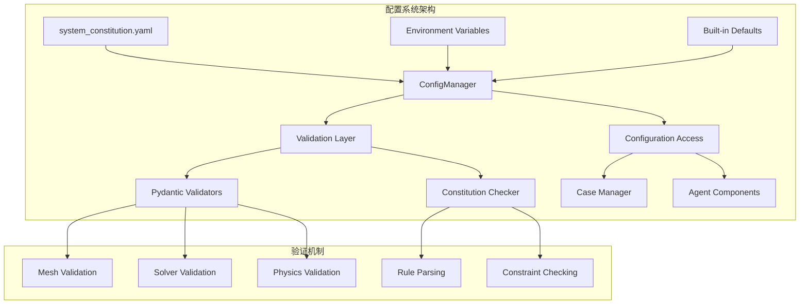
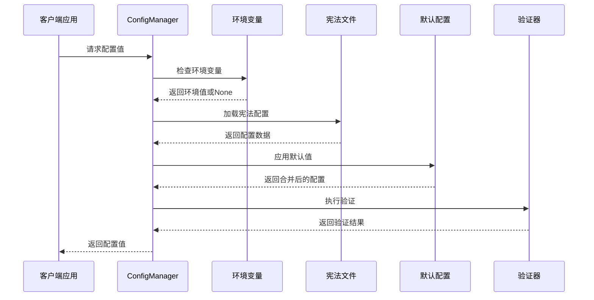
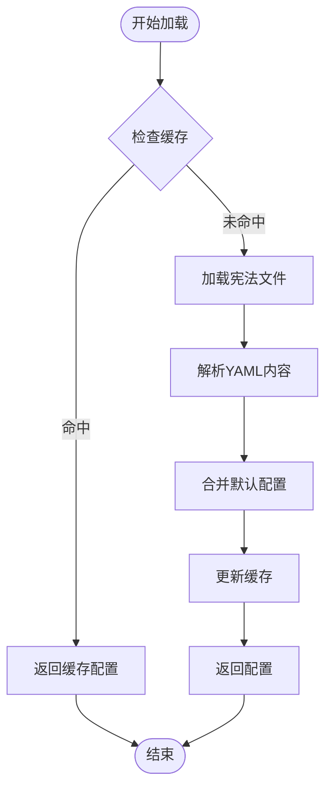
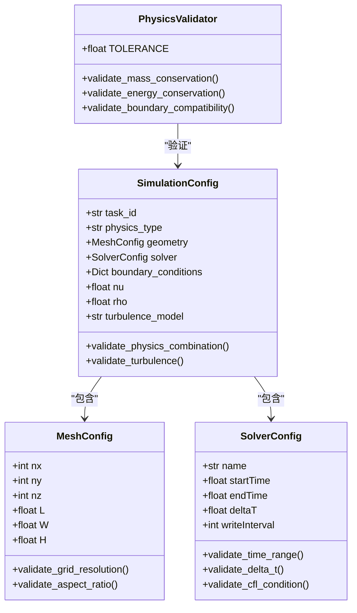
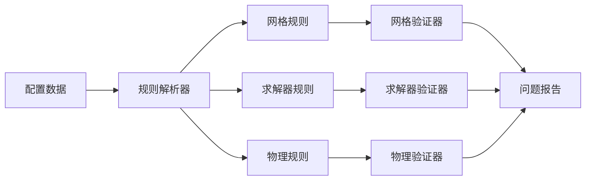
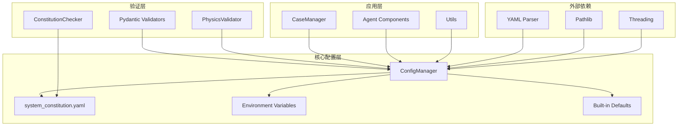

# 配置API接口

<cite>
**本文档引用的文件**
- [system_constitution.yaml](file://openfoam_ai/config/system_constitution.yaml)
- [config_manager.py](file://openfoam_ai/core/config_manager.py)
- [validators.py](file://openfoam_ai/core/validators.py)
- [critic_agent.py](file://openfoam_ai/agents/critic_agent.py)
- [case_manager.py](file://openfoam_ai/core/case_manager.py)
- [utils.py](file://openfoam_ai/core/utils.py)
- [main.py](file://openfoam_ai/main.py)
</cite>

## 目录
1. [简介](#简介)
2. [项目结构](#项目结构)
3. [核心组件](#核心组件)
4. [架构概览](#架构概览)
5. [详细组件分析](#详细组件分析)
6. [依赖关系分析](#依赖关系分析)
7. [性能考虑](#性能考虑)
8. [故障排除指南](#故障排除指南)
9. [结论](#结论)

## 简介

OpenFOAM AI项目的配置API是一个基于system_constitution.yaml宪法文件的完整配置管理系统。该系统通过统一的配置管理器提供配置加载、验证和动态更新功能，确保所有仿真配置符合预定义的物理约束和工程标准。

系统的核心特性包括：
- 基于YAML的宪法文件定义
- 多层次配置优先级机制
- 实时配置验证和错误处理
- 环境变量集成支持
- 热重载和动态更新能力

## 项目结构

OpenFOAM AI项目的配置系统采用模块化设计，主要包含以下核心组件：

**图表来源**
- [system_constitution.yaml:1-103](file://openfoam_ai/config/system_constitution.yaml#L1-L103)
- [config_manager.py:16-227](file://openfoam_ai/core/config_manager.py#L16-L227)

**章节来源**
- [system_constitution.yaml:1-103](file://openfoam_ai/config/system_constitution.yaml#L1-L103)
- [config_manager.py:16-227](file://openfoam_ai/core/config_manager.py#L16-L227)

## 核心组件

### 配置管理器(ConfigManager)

ConfigManager是整个配置系统的核心，提供统一的配置访问接口和管理功能。

**主要功能特性：**
- 单例模式实现，确保全局唯一性
- 线程安全的配置访问
- 内置默认配置支持
- 环境变量集成
- 热重载机制

**配置优先级顺序：**
1. 环境变量（最高优先级）
2. 宪法文件配置
3. 内置默认值（最低优先级）

**章节来源**
- [config_manager.py:16-227](file://openfoam_ai/core/config_manager.py#L16-L227)

### 宪法配置文件(system_constitution.yaml)

宪法文件定义了系统的硬性约束规则，包含多个配置类别：

**核心配置类别：**
- Core_Directives：核心指令约束
- Mesh_Standards：网格标准规范
- Solver_Standards：求解器标准
- Validation_Requirements：验证要求
- Physical_Constraints：物理约束
- Prohibited_Combinations：禁止组合
- Quality_Checks：质量检查
- Error_Handling：错误处理
- Documentation_Requirements：文档要求

**章节来源**
- [system_constitution.yaml:1-103](file://openfoam_ai/config/system_constitution.yaml#L1-L103)

### 验证器系统(Validators)

系统包含多层次的验证机制：

**Pydantic验证器：**
- MeshConfig：网格配置验证
- SolverConfig：求解器配置验证
- BoundaryCondition：边界条件验证
- SimulationConfig：完整仿真配置验证

**物理验证器：**
- PhysicsValidator：物理一致性验证
- 质量守恒验证
- 能量守恒验证
- 边界兼容性检查

**章节来源**
- [validators.py:18-441](file://openfoam_ai/core/validators.py#L18-L441)

## 架构概览

配置系统采用分层架构设计，确保配置的正确性和一致性：

**图表来源**
- [config_manager.py:94-181](file://openfoam_ai/core/config_manager.py#L94-L181)
- [validators.py:389-411](file://openfoam_ai/core/validators.py#L389-L411)

## 详细组件分析

### 配置加载机制

配置系统采用延迟加载和缓存策略，确保高效性和一致性：

**图表来源**
- [config_manager.py:94-135](file://openfoam_ai/core/config_manager.py#L94-L135)

**配置加载流程特点：**
- 支持强制重新加载
- 线程安全的缓存机制
- 自动类型转换和验证
- 错误处理和降级策略

**章节来源**
- [config_manager.py:94-135](file://openfoam_ai/core/config_manager.py#L94-L135)

### 配置验证器API

验证器系统提供完整的配置验证功能：

**图表来源**
- [validators.py:18-275](file://openfoam_ai/core/validators.py#L18-L275)
- [validators.py:277-387](file://openfoam_ai/core/validators.py#L277-L387)

**验证器API接口：**

**基础验证接口：**
- `validate_simulation_config(config_dict)` - 主验证入口
- `validate_mesh_config(mesh_dict)` - 网格验证
- `validate_solver_config(solver_dict)` - 求解器验证

**物理验证接口：**
- `validate_mass_conservation(inlet_patch, outlet_patch)` - 质量守恒验证
- `validate_energy_conservation(inlet, outlet, walls)` - 能量守恒验证
- `validate_boundary_compatibility(bc_config)` - 边界兼容性检查

**章节来源**
- [validators.py:18-441](file://openfoam_ai/core/validators.py#L18-L441)

### 宪法检查器(CorpusChecker)

宪法检查器提供基于system_constitution.yaml的硬规则校验：

**图表来源**
- [critic_agent.py:47-131](file://openfoam_ai/agents/critic_agent.py#L47-L131)

**章节来源**
- [critic_agent.py:47-239](file://openfoam_ai/agents/critic_agent.py#L47-L239)

### 配置继承和覆盖规则

系统实现了灵活的配置继承和覆盖机制：

**继承层次结构：**
1. **宪法文件** - 基础约束规则
2. **环境变量** - 运行时配置覆盖
3. **用户配置** - 应用程序特定设置
4. **默认值** - 系统内置缺省值

**覆盖优先级：**
- 环境变量 > 用户配置 > 宪法文件 > 内置默认值

**章节来源**
- [config_manager.py:136-197](file://openfoam_ai/core/config_manager.py#L136-L197)

## 依赖关系分析

配置系统各组件之间的依赖关系如下：

**图表来源**
- [config_manager.py:1-227](file://openfoam_ai/core/config_manager.py#L1-L227)
- [validators.py:1-441](file://openfoam_ai/core/validators.py#L1-L441)
- [critic_agent.py:1-239](file://openfoam_ai/agents/critic_agent.py#L1-L239)

**依赖关系特点：**
- ConfigManager作为中央协调者
- 验证器系统相互独立但共享配置
- 应用层组件通过ConfigManager访问配置
- 最小化循环依赖

**章节来源**
- [config_manager.py:1-227](file://openfoam_ai/core/config_manager.py#L1-L227)
- [validators.py:1-441](file://openfoam_ai/core/validators.py#L1-L441)

## 性能考虑

配置系统的性能优化策略：

**缓存机制：**
- 配置文件缓存，避免重复解析
- 线程安全的R锁保护
- 懒加载策略减少启动时间

**内存优化：**
- 按需加载配置项
- 及时释放不再使用的配置
- 合理的缓存大小控制

**并发处理：**
- 支持多线程安全访问
- 非阻塞的配置查询
- 并发重载机制

## 故障排除指南

### 常见配置问题

**宪法文件加载失败：**
- 检查文件路径和权限
- 验证YAML语法正确性
- 确认文件编码格式

**配置访问异常：**
- 验证配置键名拼写
- 检查点分隔路径格式
- 确认配置项存在性

**验证器错误：**
- 检查输入数据格式
- 验证数值范围约束
- 确认物理参数合理性

### 调试和诊断

**配置导出：**
使用`dump_config()`方法获取完整的配置状态

**日志记录：**
系统提供详细的日志信息用于问题诊断

**章节来源**
- [config_manager.py:212-218](file://openfoam_ai/core/config_manager.py#L212-L218)
- [utils.py:16-62](file://openfoam_ai/core/utils.py#L16-L62)

## 结论

OpenFOAM AI项目的配置API提供了一个完整、健壮且高效的配置管理系统。通过宪法文件定义硬性约束、多层验证机制确保配置正确性、灵活的继承覆盖规则满足不同场景需求，以及完善的错误处理和性能优化策略，该系统为CFD仿真工作流提供了可靠的配置基础。

系统的主要优势包括：
- 强大的约束验证能力
- 灵活的配置管理机制
- 完善的错误处理和恢复
- 良好的扩展性和维护性
- 高效的性能表现