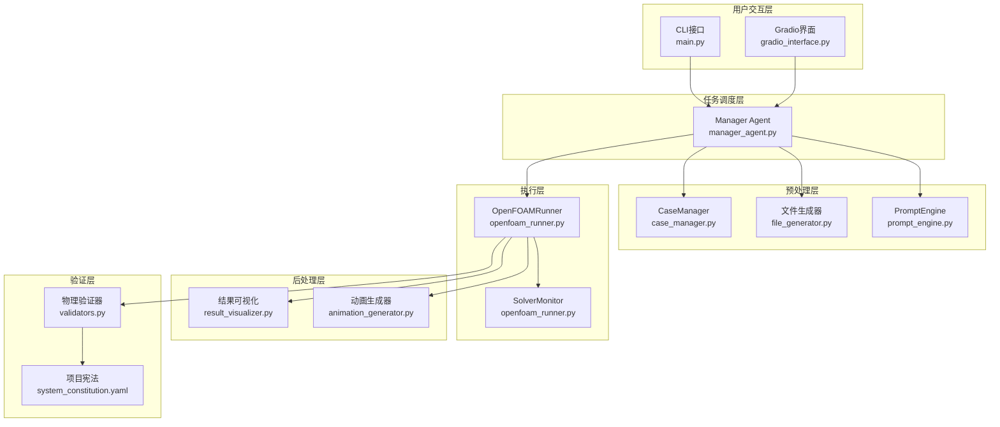
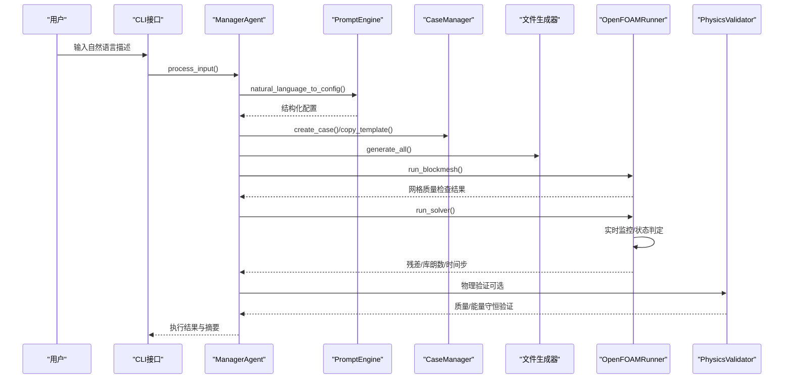
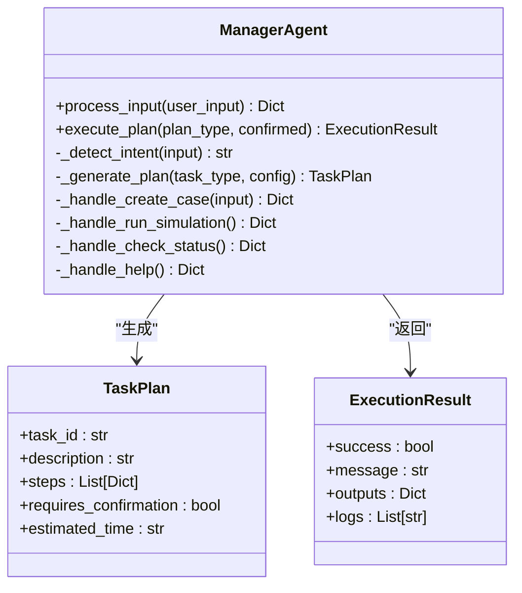
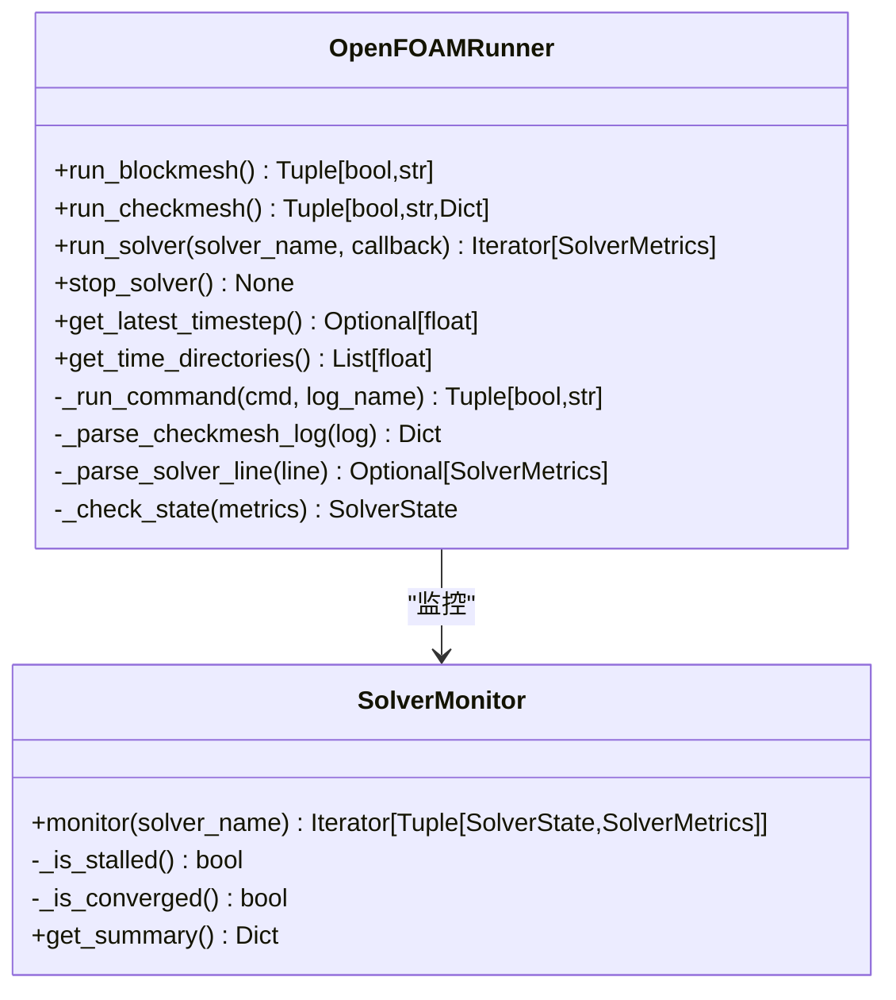
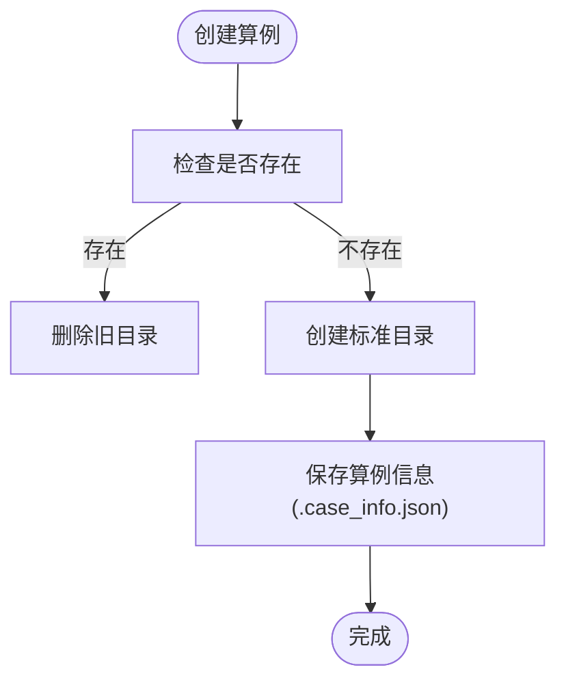
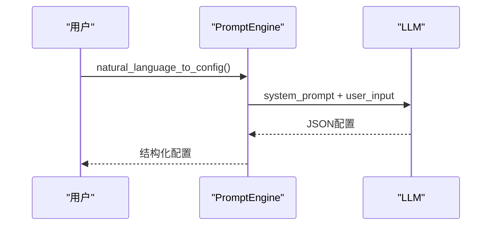
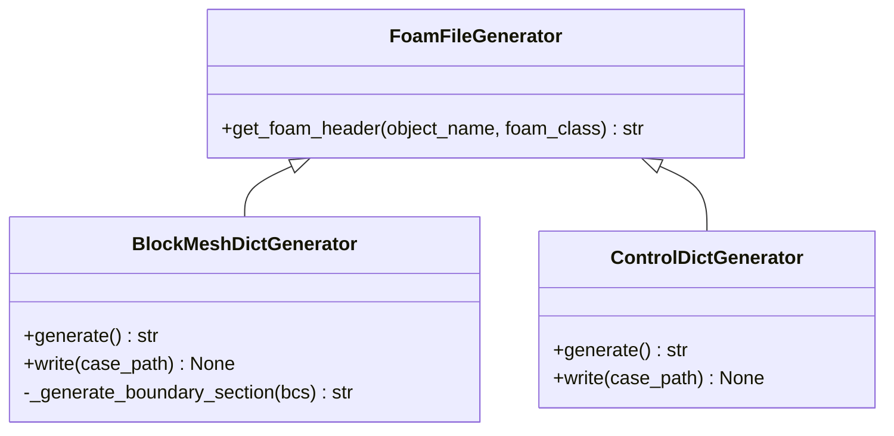
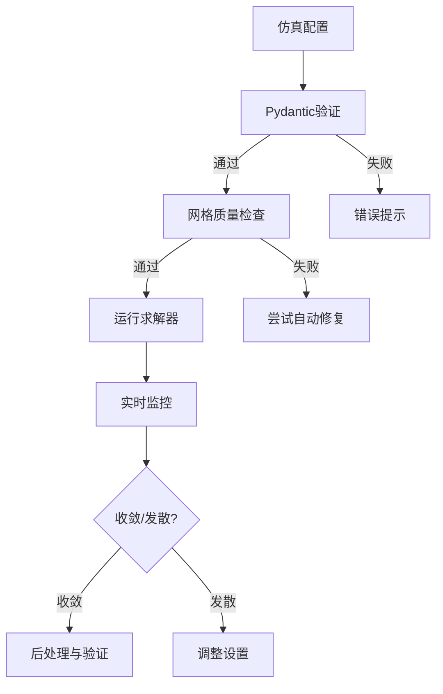
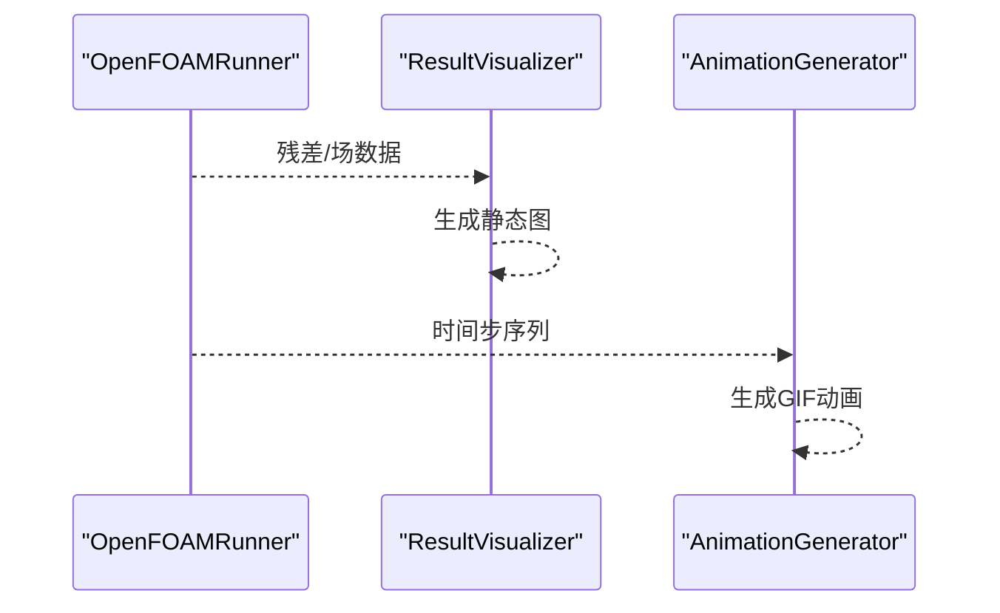
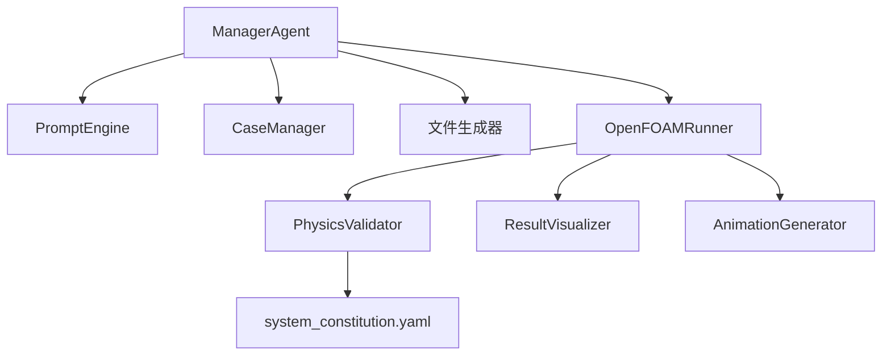

# OpenFOAM仿真模拟器

<cite>
**本文档引用的文件**
- [README.md](file://openfoam_ai/README.md)
- [main.py](file://openfoam_ai/main.py)
- [openfoam_ai/core/openfoam_runner.py](file://openfoam_ai/core/openfoam_runner.py)
- [openfoam_ai/utils/of_simulator.py](file://openfoam_ai/utils/of_simulator.py)
- [openfoam_ai/core/case_manager.py](file://openfoam_ai/core/case_manager.py)
- [openfoam_ai/core/validators.py](file://openfoam_ai/core/validators.py)
- [openfoam_ai/agents/manager_agent.py](file://openfoam_ai/agents/manager_agent.py)
- [openfoam_ai/config/system_constitution.yaml](file://openfoam_ai/config/system_constitution.yaml)
- [openfoam_ai/utils/animation_generator.py](file://openfoam_ai/utils/animation_generator.py)
- [openfoam_ai/utils/result_visualizer.py](file://openfoam_ai/utils/result_visualizer.py)
- [openfoam_ai/core/file_generator.py](file://openfoam_ai/core/file_generator.py)
- [openfoam_ai/agents/prompt_engine.py](file://openfoam_ai/agents/prompt_engine.py)
- [demo_cases/demo_case/.case_info.json](file://demo_cases/demo_case/.case_info.json)
- [demo_cases/cavity_flow_100/.case_info.json](file://demo_cases/cavity_flow_100/.case_info.json)
- [gui_cases/cylinder_2d_karman_vortex_street/.case_info.json](file://gui_cases/cylinder_2d_karman_vortex_street/.case_info.json)
</cite>

## 目录
1. [简介](#简介)
2. [项目结构](#项目结构)
3. [核心组件](#核心组件)
4. [架构总览](#架构总览)
5. [详细组件分析](#详细组件分析)
6. [依赖关系分析](#依赖关系分析)
7. [性能考虑](#性能考虑)
8. [故障排除指南](#故障排除指南)
9. [结论](#结论)
10. [附录](#附录)

## 简介
本项目是一个基于大语言模型的自动化CFD仿真智能体系统，旨在通过自然语言描述自动完成OpenFOAM仿真全流程：几何建模与网格生成、求解器配置与边界条件设置、计算执行与实时监控、结果后处理与可视化。系统内置多重防幻觉机制（Pydantic硬约束、项目宪法、Critic Agent审查、物理验证），确保生成的仿真配置在物理上合理且可执行。

系统支持典型流动现象的模拟与教学验证，包括卡门涡街、边界层分离、方腔驱动流等，并提供动画制作与结果可视化功能，帮助用户理解复杂流动现象。

## 项目结构
项目采用模块化设计，核心分为以下层次：
- 用户交互层：CLI界面与Gradio UI
- 任务调度层：Manager Agent统一调度
- 预处理层：几何与网格生成、字典文件生成
- 执行层：OpenFOAM命令执行与求解器监控
- 后处理层：结果可视化与动画生成
- 验证层：物理一致性与质量检查

**图表来源**
- [main.py:1-251](file://openfoam_ai/main.py#L1-L251)
- [openfoam_ai/agents/manager_agent.py:1-458](file://openfoam_ai/agents/manager_agent.py#L1-L458)
- [openfoam_ai/core/case_manager.py:1-639](file://openfoam_ai/core/case_manager.py#L1-L639)
- [openfoam_ai/core/file_generator.py:1-200](file://openfoam_ai/core/file_generator.py#L1-L200)
- [openfoam_ai/core/openfoam_runner.py:1-548](file://openfoam_ai/core/openfoam_runner.py#L1-L548)
- [openfoam_ai/core/validators.py:1-441](file://openfoam_ai/core/validators.py#L1-L441)
- [openfoam_ai/utils/result_visualizer.py:1-353](file://openfoam_ai/utils/result_visualizer.py#L1-L353)
- [openfoam_ai/utils/animation_generator.py:1-272](file://openfoam_ai/utils/animation_generator.py#L1-L272)
- [openfoam_ai/config/system_constitution.yaml:1-103](file://openfoam_ai/config/system_constitution.yaml#L1-L103)

**章节来源**
- [README.md:130-150](file://openfoam_ai/README.md#L130-L150)
- [openfoam_ai/README.md:104-128](file://openfoam_ai/README.md#L104-L128)

## 核心组件
- Manager Agent：负责意图识别、计划生成、执行协调与状态管理，串联LLM配置生成、文件生成、OpenFOAM执行与结果可视化。
- CaseManager：管理OpenFOAM算例目录结构，支持创建、复制、清理、删除与状态更新。
- OpenFOAMRunner：封装OpenFOAM命令执行（blockMesh、checkMesh、求解器），提供实时监控、日志解析与状态判定。
- PhysicsValidator：验证物理配置合理性，包括质量守恒、能量守恒与边界兼容性。
- PromptEngine：将自然语言转换为结构化仿真配置，支持Mock模式与真实LLM模式。
- 文件生成器：将配置转换为OpenFOAM字典文件（blockMeshDict、controlDict、fvSchemes、fvSolution等）。
- 结果可视化与动画生成：生成静态结果图与动态动画，突出卡门涡街等典型流动现象。

**章节来源**
- [openfoam_ai/README.md:161-206](file://openfoam_ai/README.md#L161-L206)
- [openfoam_ai/core/openfoam_runner.py:44-198](file://openfoam_ai/core/openfoam_runner.py#L44-L198)
- [openfoam_ai/core/validators.py:277-387](file://openfoam_ai/core/validators.py#L277-L387)
- [openfoam_ai/agents/manager_agent.py:38-339](file://openfoam_ai/agents/manager_agent.py#L38-L339)
- [openfoam_ai/core/file_generator.py:11-200](file://openfoam_ai/core/file_generator.py#L11-L200)

## 架构总览
系统采用“LLM配置生成 + Pydantic验证 + OpenFOAM执行 + 物理验证”的闭环架构。项目宪法作为硬约束规则贯穿始终，确保配置在网格质量、求解稳定性、物理合理性等方面满足工程规范。

**图表来源**
- [openfoam_ai/agents/manager_agent.py:75-339](file://openfoam_ai/agents/manager_agent.py#L75-L339)
- [openfoam_ai/core/openfoam_runner.py:99-198](file://openfoam_ai/core/openfoam_runner.py#L99-L198)
- [openfoam_ai/core/validators.py:277-387](file://openfoam_ai/core/validators.py#L277-L387)

## 详细组件分析

### Manager Agent 分析
- 意图识别：根据关键词识别创建、修改、运行、状态查询、帮助等意图。
- 计划生成：为创建流程生成包含步骤、确认需求与预计耗时的任务计划。
- 执行协调：协调PromptEngine、CaseManager、文件生成器与OpenFOAMRunner，按计划执行。
- 状态管理：维护当前算例、配置与执行历史，支持查看状态与帮助。

**图表来源**
- [openfoam_ai/agents/manager_agent.py:19-339](file://openfoam_ai/agents/manager_agent.py#L19-L339)

**章节来源**
- [openfoam_ai/agents/manager_agent.py:75-436](file://openfoam_ai/agents/manager_agent.py#L75-L436)

### OpenFOAMRunner 分析
- 命令执行：封装blockMesh、checkMesh与求解器运行，捕获标准输出并写入日志。
- 实时监控：解析日志中的时间步、库朗数与残差，生成SolverMetrics。
- 状态判定：基于库朗数与残差阈值判断求解状态（运行中、收敛、发散、停滞、完成）。
- 自愈机制：预留发散与停滞检测点，便于后续实现自动修复策略。

**图表来源**
- [openfoam_ai/core/openfoam_runner.py:44-517](file://openfoam_ai/core/openfoam_runner.py#L44-L517)

**章节来源**
- [openfoam_ai/core/openfoam_runner.py:77-427](file://openfoam_ai/core/openfoam_runner.py#L77-L427)

### CaseManager 分析
- 算例管理：创建标准OpenFOAM目录结构（0、constant、system、logs），保存算例信息。
- 模板复制：从模板复制算例并更新信息。
- 清理与删除：支持清理中间结果、删除算例。
- 状态更新：维护算例状态（init/meshed/solving/converged/diverged）。

**图表来源**
- [openfoam_ai/core/case_manager.py:51-86](file://openfoam_ai/core/case_manager.py#L51-L86)

**章节来源**
- [openfoam_ai/core/case_manager.py:51-261](file://openfoam_ai/core/case_manager.py#L51-L261)

### PromptEngine 分析
- LLM接口：支持OpenAI与Mock模式，将自然语言转换为结构化配置。
- 系统提示词：定义可用物理类型、求解器、输出格式与约束条件。
- 配置解释与改进建议：提供通俗解释与基于日志的改进建议。

**图表来源**
- [openfoam_ai/agents/prompt_engine.py:92-126](file://openfoam_ai/agents/prompt_engine.py#L92-L126)

**章节来源**
- [openfoam_ai/agents/prompt_engine.py:75-200](file://openfoam_ai/agents/prompt_engine.py#L75-L200)

### 文件生成器分析
- blockMeshDict：根据几何与网格分辨率生成网格定义。
- controlDict：根据求解器配置生成控制字典。
- fvSchemes/fvSolution：生成离散方案与求解器设置（扩展中）。

**图表来源**
- [openfoam_ai/core/file_generator.py:11-200](file://openfoam_ai/core/file_generator.py#L11-L200)

**章节来源**
- [openfoam_ai/core/file_generator.py:35-196](file://openfoam_ai/core/file_generator.py#L35-L196)

### 物理验证与项目宪法
- 物理验证：质量守恒、能量守恒、边界兼容性检查。
- 项目宪法：定义网格标准、求解器标准、物理约束、禁止组合与质量检查清单。

**图表来源**
- [openfoam_ai/core/validators.py:277-387](file://openfoam_ai/core/validators.py#L277-L387)
- [openfoam_ai/config/system_constitution.yaml:13-82](file://openfoam_ai/config/system_constitution.yaml#L13-L82)

**章节来源**
- [openfoam_ai/core/validators.py:18-275](file://openfoam_ai/core/validators.py#L18-L275)
- [openfoam_ai/config/system_constitution.yaml:1-103](file://openfoam_ai/config/system_constitution.yaml#L1-L103)

### 结果可视化与动画生成
- 结果可视化：生成速度场、压力场、涡量图与残差监控图。
- 动画生成：生成卡门涡街等典型流动的动态过程动画，支持速度场与涡量场切换。

**图表来源**
- [openfoam_ai/utils/result_visualizer.py:20-79](file://openfoam_ai/utils/result_visualizer.py#L20-L79)
- [openfoam_ai/utils/animation_generator.py:31-79](file://openfoam_ai/utils/animation_generator.py#L31-L79)

**章节来源**
- [openfoam_ai/utils/result_visualizer.py:14-353](file://openfoam_ai/utils/result_visualizer.py#L14-L353)
- [openfoam_ai/utils/animation_generator.py:16-272](file://openfoam_ai/utils/animation_generator.py#L16-L272)

## 依赖关系分析
- 模块耦合：Manager Agent作为中枢，依赖PromptEngine、CaseManager、文件生成器与OpenFOAMRunner；OpenFOAMRunner依赖validators与system_constitution；后处理模块依赖算例路径与日志。
- 外部依赖：OpenFOAM命令（blockMesh、checkMesh、求解器）、Matplotlib/PIL用于可视化与动画、Jinja2用于模板渲染。
- 防护机制：Pydantic模型与项目宪法双重约束，避免不合理的配置进入执行阶段。

**图表来源**
- [openfoam_ai/agents/manager_agent.py:12-64](file://openfoam_ai/agents/manager_agent.py#L12-L64)
- [openfoam_ai/core/openfoam_runner.py:13-76](file://openfoam_ai/core/openfoam_runner.py#L13-L76)

**章节来源**
- [openfoam_ai/agents/manager_agent.py:50-74](file://openfoam_ai/agents/manager_agent.py#L50-L74)
- [openfoam_ai/core/openfoam_runner.py:55-76](file://openfoam_ai/core/openfoam_runner.py#L55-L76)

## 性能考虑
- 计算效率优化
  - 合理的时间步长与写入间隔：根据system_constitution.yaml中的标准设置deltaT与writeInterval，避免过小时间步导致计算时间过长。
  - 网格分辨率：满足最小网格数要求（2D≥400，3D≥8000），避免过粗网格导致结果不准确。
  - 求解器选择：根据物理类型与稳定性需求选择合适求解器（如icoFoam适合瞬态不可压层流）。
- 精度控制
  - 残差收敛阈值：默认1e-6，确保解的精度。
  - 库朗数限制：通用限制为1.0，避免不稳定。
  - 质量检查：checkMesh非正交性、偏斜度、长宽比等指标需满足要求。
- 结果验证
  - 质量守恒与能量守恒：通过PhysicsValidator进行验证，误差不超过0.1%。
  - 时间步独立性：瞬态计算需验证时间步长独立性。

[本节为通用指导，无需具体文件分析]

## 故障排除指南
- OpenFOAM环境未检测到：检查OpenFOAM是否正确安装并加入PATH。
- ModuleNotFoundError: 未安装openai：安装openai或使用Mock模式（设置api_key=None）。
- FileNotFoundError: blockMesh未找到：确认OpenFOAM安装与环境变量。
- Pydantic验证错误：检查配置参数是否符合system_constitution.yaml中的规则。
- Unicode编码错误：Windows控制台默认编码为GBK，设置环境变量PYTHONIOENCODING=utf-8。
- 调试建议：启用详细日志（LOG_LEVEL=DEBUG）、使用Mock模式测试配置生成、运行单元测试、检查算例目录结构。

**章节来源**
- [openfoam_ai/README.md:208-237](file://openfoam_ai/README.md#L208-L237)

## 结论
本项目通过LLM与工程约束相结合的方式，实现了从自然语言到OpenFOAM仿真的自动化流程。系统具备完善的验证与监控机制，能够有效避免不合理的配置进入执行阶段，并提供丰富的后处理与可视化能力，适用于教学演示与科研验证。通过典型流动现象（如卡门涡街、边界层分离）的模拟与动画展示，有助于加深对复杂流动机理的理解。

[本节为总结，无需具体文件分析]

## 附录

### 使用示例与最佳实践
- 快速创建方腔驱动流算例：使用CLI参数--case或交互模式输入“建立一个二维方腔驱动流，顶部速度1m/s，雷诺数100”。
- 查看状态：输入“查看状态”，系统将返回当前活动算例的状态与求解器信息。
- 运行计算：输入“开始计算”，系统将启动求解器并实时监控收敛状态。
- 配置参数建议：
  - 网格分辨率：2D至少20×20，3D至少20×20×20。
  - 时间步长：不超过结束时间的10%，确保库朗数小于1。
  - 求解器：瞬态不可压层流使用icoFoam，稳态使用simpleFoam。
- 结果分析：使用paraFoam查看结果，或调用结果可视化与动画生成模块生成静态图与GIF动画。

**章节来源**
- [openfoam_ai/README.md:52-102](file://openfoam_ai/README.md#L52-L102)
- [openfoam_ai/main.py:175-200](file://openfoam_ai/main.py#L175-L200)

### 典型算例参考
- 方腔驱动流：几何尺寸1.0×1.0×0.1，网格约2500单元，使用icoFoam求解器。
- 圆柱绕流（卡门涡街）：几何尺寸20×10×0.1，网格150×75，边界条件包含入口、出口与圆柱壁面，使用icoFoam求解器。

**章节来源**
- [demo_cases/demo_case/.case_info.json:1-9](file://demo_cases/demo_case/.case_info.json#L1-L9)
- [demo_cases/cavity_flow_100/.case_info.json:1-9](file://demo_cases/cavity_flow_100/.case_info.json#L1-L9)
- [gui_cases/cylinder_2d_karman_vortex_street/.case_info.json:1-52](file://gui_cases/cylinder_2d_karman_vortex_street/.case_info.json#L1-L52)