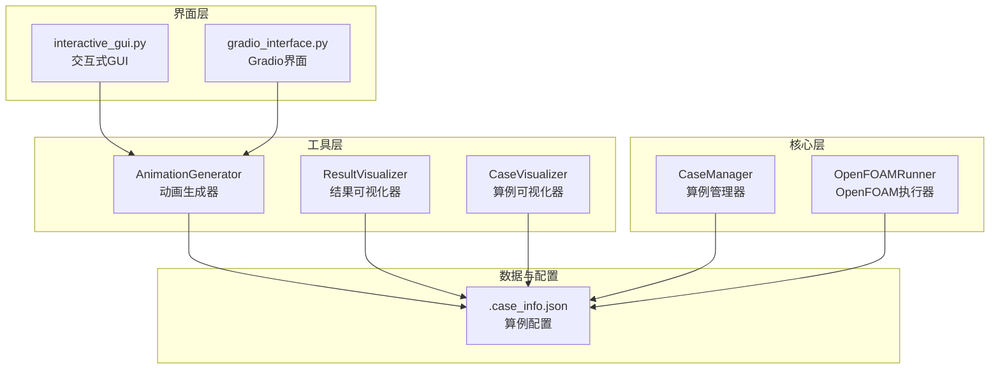
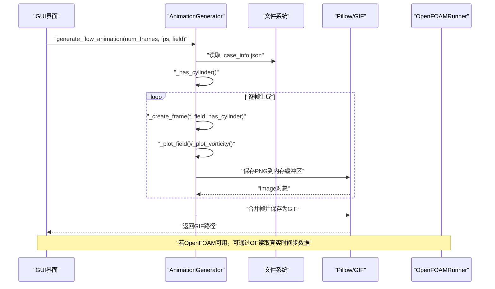
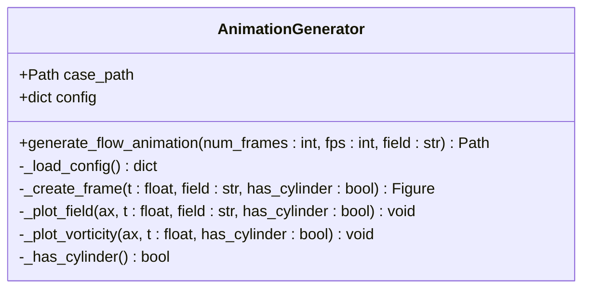
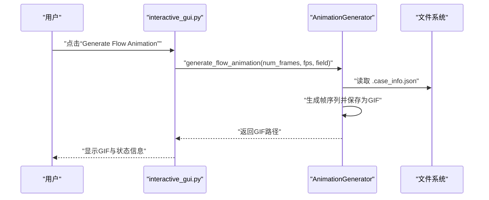
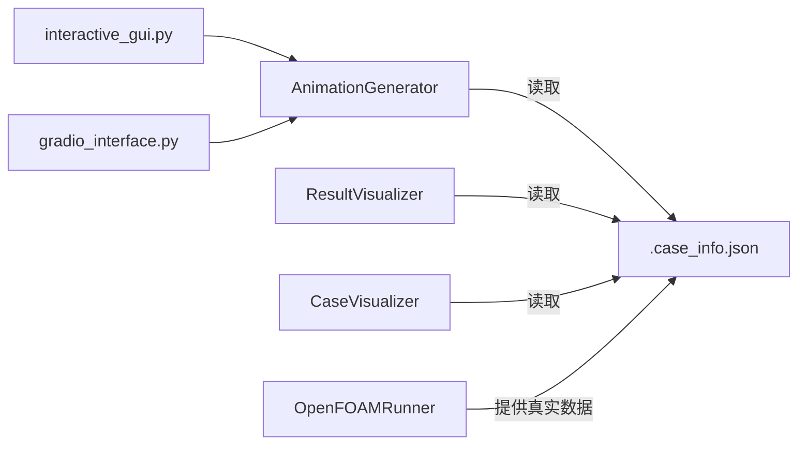

# 动画生成器

<cite>
**本文引用的文件**
- [animation_generator.py](file://openfoam_ai/utils/animation_generator.py)
- [result_visualizer.py](file://openfoam_ai/utils/result_visualizer.py)
- [case_visualizer.py](file://openfoam_ai/utils/case_visualizer.py)
- [openfoam_runner.py](file://openfoam_ai/core/openfoam_runner.py)
- [case_manager.py](file://openfoam_ai/core/case_manager.py)
- [interactive_gui.py](file://interactive_gui.py)
- [gradio_interface.py](file://openfoam_ai/ui/gradio_interface.py)
- [cavity_demo/.case_info.json](file://demo_cases/cavity_demo/.case_info.json)
- [cavity_flow_100/.case_info.json](file://demo_cases/cavity_flow_100/.case_info.json)
</cite>

## 目录
1. [简介](#简介)
2. [项目结构](#项目结构)
3. [核心组件](#核心组件)
4. [架构总览](#架构总览)
5. [详细组件分析](#详细组件分析)
6. [依赖关系分析](#依赖关系分析)
7. [性能考量](#性能考量)
8. [故障排查指南](#故障排查指南)
9. [结论](#结论)
10. [附录](#附录)

## 简介
本文件面向AnimationGenerator动画生成器，系统性阐述其在CFD结果动画生成中的作用与实现原理，涵盖时间序列数据处理、帧率控制、输出格式选择、数据插值与图像序列生成、视频编码（GIF）等技术细节，并结合OpenFOAM算例配置与GUI交互流程，给出使用示例、质量优化建议与批量处理思路，帮助用户高效地将仿真结果转化为直观的动态可视化。

## 项目结构
动画生成器位于openfoam_ai/utils子模块中，围绕“算例配置→帧生成→GIF合成”的主流程组织代码；同时与结果可视化、算例管理、OpenFOAM执行器等模块协同工作，形成从配置到可视化的完整链路。

图表来源
- [animation_generator.py:16-272](file://openfoam_ai/utils/animation_generator.py#L16-L272)
- [result_visualizer.py:14-353](file://openfoam_ai/utils/result_visualizer.py#L14-L353)
- [case_visualizer.py:16-314](file://openfoam_ai/utils/case_visualizer.py#L16-L314)
- [openfoam_runner.py:44-548](file://openfoam_ai/core/openfoam_runner.py#L44-L548)
- [case_manager.py:27-639](file://openfoam_ai/core/case_manager.py#L27-L639)
- [interactive_gui.py:34-508](file://interactive_gui.py#L34-L508)
- [gradio_interface.py:31-484](file://openfoam_ai/ui/gradio_interface.py#L31-L484)

章节来源
- [animation_generator.py:16-272](file://openfoam_ai/utils/animation_generator.py#L16-L272)
- [interactive_gui.py:34-508](file://interactive_gui.py#L34-L508)

## 核心组件
- AnimationGenerator：负责根据算例配置生成流场演进动画，支持速度场与压力场两种场量，内置圆柱绕流场景识别与卡门涡街模拟。
- ResultVisualizer：生成静态结果图，包含云图、流线、涡量与收敛监控，用于对比与验证动画效果。
- CaseVisualizer：生成算例预览图，辅助理解几何与边界条件，间接指导动画参数选择。
- OpenFOAMRunner：提供OpenFOAM命令执行、日志解析与收敛状态监测，支撑真实仿真数据的读取与验证。
- CaseManager：管理算例目录结构与配置，确保动画生成所需的“.case_info.json”存在且完整。
- GUI界面：通过Gradio与交互式GUI提供动画生成的可视化入口，支持帧数与帧率调节。

章节来源
- [animation_generator.py:16-272](file://openfoam_ai/utils/animation_generator.py#L16-L272)
- [result_visualizer.py:14-353](file://openfoam_ai/utils/result_visualizer.py#L14-L353)
- [case_visualizer.py:16-314](file://openfoam_ai/utils/case_visualizer.py#L16-L314)
- [openfoam_runner.py:44-548](file://openfoam_ai/core/openfoam_runner.py#L44-L548)
- [case_manager.py:27-639](file://openfoam_ai/core/case_manager.py#L27-L639)
- [interactive_gui.py:34-508](file://interactive_gui.py#L34-L508)
- [gradio_interface.py:31-484](file://openfoam_ai/ui/gradio_interface.py#L31-L484)

## 架构总览
动画生成器的运行时架构如下：GUI触发→调用AnimationGenerator→读取算例配置→按时间序列生成帧→保存为GIF。若OpenFOAM可用，也可通过OpenFOAMRunner读取真实时间步数据进行可视化。

图表来源
- [animation_generator.py:31-79](file://openfoam_ai/utils/animation_generator.py#L31-L79)
- [animation_generator.py:81-100](file://openfoam_ai/utils/animation_generator.py#L81-L100)
- [animation_generator.py:102-240](file://openfoam_ai/utils/animation_generator.py#L102-L240)
- [openfoam_runner.py:99-198](file://openfoam_ai/core/openfoam_runner.py#L99-L198)

## 详细组件分析

### AnimationGenerator 动画生成器
- 职责：根据算例配置生成流场演进动画，支持速度场与压力场，自动识别圆柱绕流场景并模拟卡门涡街。
- 关键流程：
  - 加载配置：读取“.case_info.json”，提取几何尺寸、网格分辨率、边界条件等。
  - 帧生成：按时间步递增生成多帧，每帧包含速度场/压力场云图与涡量场对比。
  - GIF合成：将帧序列保存为GIF，支持自定义帧率与循环次数。
- 数据插值与图像生成：
  - 使用NumPy构建规则网格，按时间参数计算速度场与涡量分布。
  - Matplotlib绘制云图与涡量场，Pillow将图像序列转存为GIF。
- 输出格式：默认GIF，帧率由用户参数控制，文件命名包含场量标识。

图表来源
- [animation_generator.py:16-272](file://openfoam_ai/utils/animation_generator.py#L16-L272)

章节来源
- [animation_generator.py:16-272](file://openfoam_ai/utils/animation_generator.py#L16-L272)

### ResultVisualizer 结果可视化器
- 职责：生成静态结果图，包含速度场/压力场云图、流线、涡量与收敛监控，便于与动画对比验证。
- 与动画的关系：用于生成单帧静态图作为参考，或在OpenFOAM可用时读取真实时间步数据进行可视化。

章节来源
- [result_visualizer.py:14-353](file://openfoam_ai/utils/result_visualizer.py#L14-L353)

### CaseVisualizer 算例可视化器
- 职责：生成算例预览图，展示几何、网格、边界条件与预期结果（如卡门涡街），辅助理解动画背景。
- 与动画的关系：预览图中的几何与边界条件信息有助于选择合适的动画参数（如帧数、场量）。

章节来源
- [case_visualizer.py:16-314](file://openfoam_ai/utils/case_visualizer.py#L16-L314)

### OpenFOAMRunner 执行器
- 职责：执行OpenFOAM命令、解析日志、监控收敛状态，提供真实仿真数据的读取与验证能力。
- 与动画的关系：当OpenFOAM可用时，可从时间步目录读取真实场数据，替代动画生成器中的理论模拟。

章节来源
- [openfoam_runner.py:44-548](file://openfoam_ai/core/openfoam_runner.py#L44-L548)

### GUI 交互与动画生成
- Gradio界面：提供聊天式交互与可视化面板，支持动画参数调节与一键生成。
- 交互式GUI：提供更丰富的控制项（帧数、帧率、字段选择、视图缩放与平移），并集成动画生成按钮。

图表来源
- [interactive_gui.py:491-495](file://interactive_gui.py#L491-L495)
- [animation_generator.py:31-79](file://openfoam_ai/utils/animation_generator.py#L31-L79)

章节来源
- [interactive_gui.py:34-508](file://interactive_gui.py#L34-L508)
- [gradio_interface.py:31-484](file://openfoam_ai/ui/gradio_interface.py#L31-L484)

## 依赖关系分析
- AnimationGenerator依赖：
  - Matplotlib/Pillow：用于绘图与GIF生成。
  - NumPy：用于数值计算与网格生成。
  - 算例配置：依赖“.case_info.json”中的几何与边界条件信息。
- 与ResultVisualizer/CaseVisualizer的协作：
  - 三者共享相同的几何与边界条件判断逻辑，确保动画与静态图的一致性。
- 与OpenFOAMRunner的协作：
  - 当OpenFOAM可用时，可从时间步目录读取真实数据，替代动画生成器中的理论模拟。

图表来源
- [animation_generator.py:23-29](file://openfoam_ai/utils/animation_generator.py#L23-L29)
- [result_visualizer.py:317-336](file://openfoam_ai/utils/result_visualizer.py#L317-L336)
- [case_visualizer.py:23-29](file://openfoam_ai/utils/case_visualizer.py#L23-L29)
- [openfoam_runner.py:62-76](file://openfoam_ai/core/openfoam_runner.py#L62-L76)
- [interactive_gui.py:28-28](file://interactive_gui.py#L28-L28)
- [gradio_interface.py:26-26](file://openfoam_ai/ui/gradio_interface.py#L26-L26)

章节来源
- [animation_generator.py:23-29](file://openfoam_ai/utils/animation_generator.py#L23-L29)
- [result_visualizer.py:317-336](file://openfoam_ai/utils/result_visualizer.py#L317-L336)
- [case_visualizer.py:23-29](file://openfoam_ai/utils/case_visualizer.py#L23-L29)
- [openfoam_runner.py:62-76](file://openfoam_ai/core/openfoam_runner.py#L62-L76)
- [interactive_gui.py:28-28](file://interactive_gui.py#L28-L28)
- [gradio_interface.py:26-26](file://openfoam_ai/ui/gradio_interface.py#L26-L26)

## 性能考量
- 帧数与帧率权衡：帧数越多、帧率越高，GIF体积越大，渲染时间越长。建议根据演示时长与文件大小目标调整参数。
- 网格分辨率：动画中的网格点数影响计算与渲染开销。可在“.case_info.json”中调整几何尺寸与网格分辨率，平衡精度与性能。
- 图像质量与压缩：Matplotlib保存时可调整DPI与bbox_inches，Pillow保存时可调整循环次数与帧间隔，以控制GIF体积。
- 批量处理：可编写脚本遍历多个算例目录，统一生成动画，注意并发与磁盘空间管理。

## 故障排查指南
- 未找到算例：确认“.case_info.json”是否存在且路径正确。
- OpenFOAM不可用：GUI会提示“Simulation Mode”，可使用动画生成器的理论模拟；安装OpenFOAM后可切换至真实数据模式。
- GIF过大：降低帧数、降低DPI、减少颜色层级或改用更高压缩的外部工具（需额外依赖）。
- 圆柱识别问题：检查“.case_info.json”中的边界条件关键字是否包含“cylinder”。

章节来源
- [interactive_gui.py:114-124](file://interactive_gui.py#L114-L124)
- [animation_generator.py:23-29](file://openfoam_ai/utils/animation_generator.py#L23-L29)

## 结论
AnimationGenerator为CFD结果展示提供了简洁高效的动画生成方案，既能满足教学与演示需求，又能在OpenFOAM可用时与真实数据无缝衔接。通过合理配置帧数、帧率与场量，结合GUI交互与批量处理策略，用户可以快速产出高质量的动态可视化成果，提升仿真结果的传播与理解效率。

## 附录

### 使用示例与最佳实践
- 基本使用
  - 在GUI中选择“Generate Flow Animation”，设置帧数与帧率，点击生成。
  - 或直接调用便捷函数：传入算例路径、帧数、帧率与场量，返回GIF路径。
- 参数配置
  - 帧数：根据演示时长与流畅度需求选择（如20帧对应5秒，帧率4fps）。
  - 帧率：根据GIF播放速度与文件大小目标调整（如5fps适合慢动作展示）。
  - 场量：选择速度场（U）或压力场（p），速度场更适合观察流动结构。
- 输出格式
  - 默认GIF，适合网页与演示；如需MP4，可借助外部工具（需额外依赖）进行转换。
- 质量优化
  - 降低DPI与颜色层级可显著减小文件体积。
  - 合理设置网格分辨率，避免过度采样导致的冗余信息。
- 批量处理
  - 编写脚本遍历demo_cases下的多个算例，统一生成动画，注意并发与磁盘空间。

章节来源
- [animation_generator.py:31-79](file://openfoam_ai/utils/animation_generator.py#L31-L79)
- [interactive_gui.py:417-421](file://interactive_gui.py#L417-L421)
- [cavity_demo/.case_info.json:1-9](file://demo_cases/cavity_demo/.case_info.json#L1-L9)
- [cavity_flow_100/.case_info.json:1-9](file://demo_cases/cavity_flow_100/.case_info.json#L1-L9)