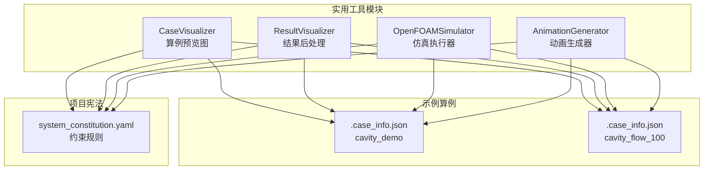
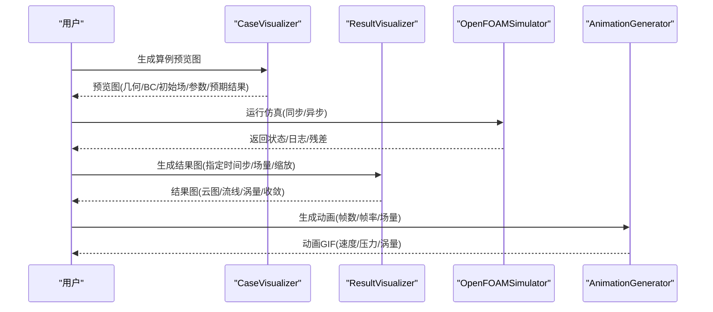
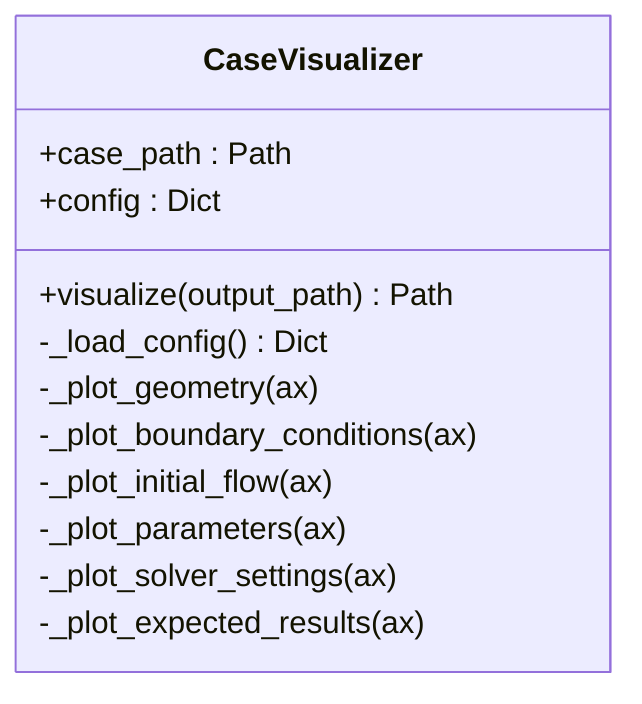
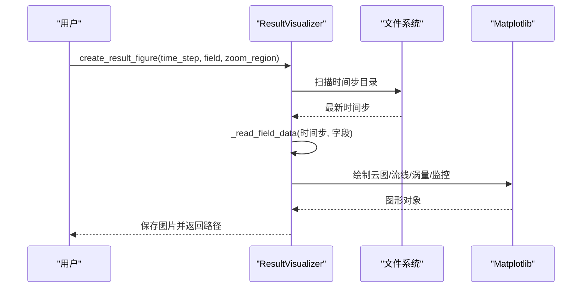
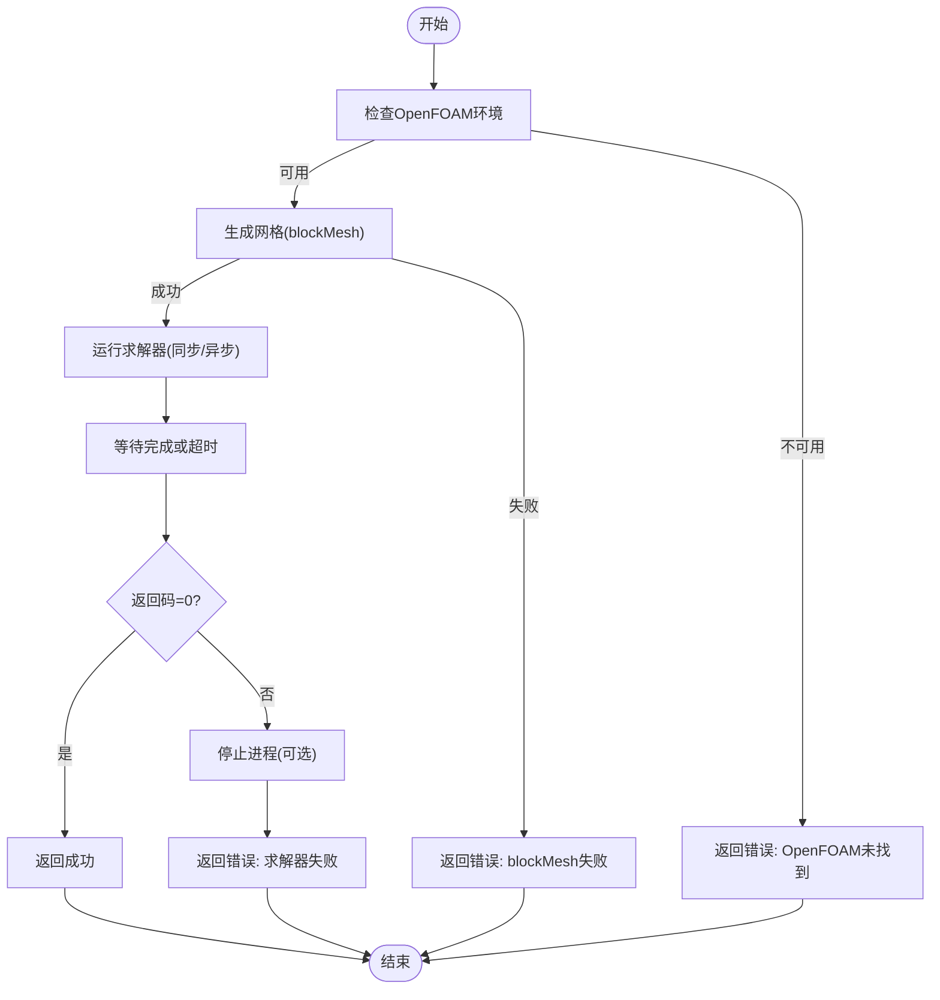
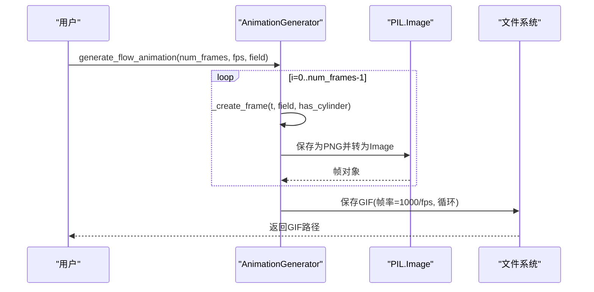
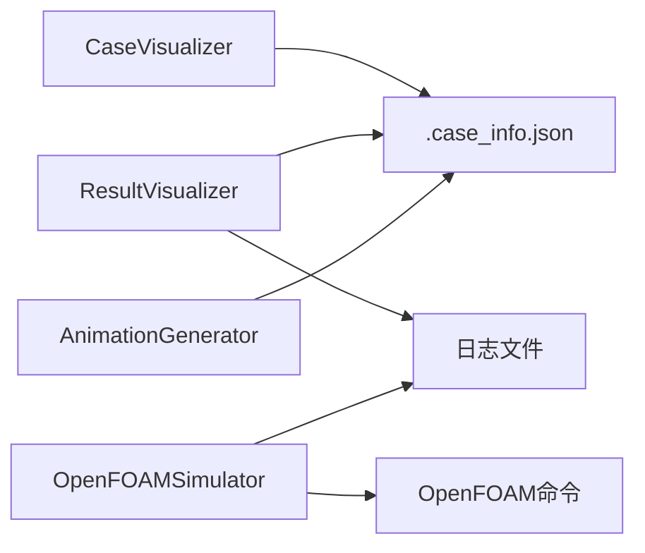

# 实用工具模块

<cite>
**本文引用的文件列表**
- [openfoam_ai/utils/case_visualizer.py](file://openfoam_ai/utils/case_visualizer.py)
- [openfoam_ai/utils/result_visualizer.py](file://openfoam_ai/utils/result_visualizer.py)
- [openfoam_ai/utils/of_simulator.py](file://openfoam_ai/utils/of_simulator.py)
- [openfoam_ai/utils/animation_generator.py](file://openfoam_ai/utils/animation_generator.py)
- [openfoam_ai/README.md](file://openfoam_ai/README.md)
- [demo_cases/cavity_demo/.case_info.json](file://demo_cases/cavity_demo/.case_info.json)
- [demo_cases/cavity_flow_100/.case_info.json](file://demo_cases/cavity_flow_100/.case_info.json)
- [openfoam_ai/config/system_constitution.yaml](file://openfoam_ai/config/system_constitution.yaml)
</cite>

## 目录
1. [简介](#简介)
2. [项目结构](#项目结构)
3. [核心组件](#核心组件)
4. [架构总览](#架构总览)
5. [详细组件分析](#详细组件分析)
6. [依赖关系分析](#依赖关系分析)
7. [性能考虑](#性能考虑)
8. [故障排查指南](#故障排查指南)
9. [结论](#结论)
10. [附录](#附录)

## 简介
本文件面向OpenFOAM AI的实用工具模块，系统性梳理并解释以下四个核心工具：
- CaseVisualizer：算例可视化与预览图生成，支持几何与网格示意、边界条件、初始流场、参数摘要、求解器设置、预期结果等多面板布局。
- ResultVisualizer：结果后处理工具，支持速度/压力云图、流线图、涡量图、收敛监控等，便于快速评估仿真质量。
- OFSimulator：仿真模拟器，封装OpenFOAM命令执行，提供网格生成、求解器运行、异步控制、残差解析等功能。
- AnimationGenerator：动画生成器，基于时间序列生成流动演化GIF，支持速度场与涡量场双视图，帧率可控。

这些工具贯穿“预处理—执行—后处理”的完整工作流，帮助用户高效地进行数据分析与结果展示。

## 项目结构
实用工具模块位于openfoam_ai/utils目录下，配合demo_cases中的示例算例与.config/system_constitution.yaml中的项目宪法规则，形成从配置到可视化的闭环。

图表来源
- [openfoam_ai/utils/case_visualizer.py:1-314](file://openfoam_ai/utils/case_visualizer.py#L1-L314)
- [openfoam_ai/utils/result_visualizer.py:1-353](file://openfoam_ai/utils/result_visualizer.py#L1-L353)
- [openfoam_ai/utils/of_simulator.py:1-180](file://openfoam_ai/utils/of_simulator.py#L1-L180)
- [openfoam_ai/utils/animation_generator.py:1-272](file://openfoam_ai/utils/animation_generator.py#L1-L272)
- [demo_cases/cavity_demo/.case_info.json:1-9](file://demo_cases/cavity_demo/.case_info.json#L1-L9)
- [demo_cases/cavity_flow_100/.case_info.json:1-9](file://demo_cases/cavity_flow_100/.case_info.json#L1-L9)
- [openfoam_ai/config/system_constitution.yaml:1-103](file://openfoam_ai/config/system_constitution.yaml#L1-L103)

章节来源
- [openfoam_ai/README.md:104-150](file://openfoam_ai/README.md#L104-L150)

## 核心组件
- CaseVisualizer：读取算例配置(.case_info.json)，生成包含几何/网格、边界条件、初始流场、参数与求解器设置、预期结果的综合预览图，便于快速审阅算例设计。
- ResultVisualizer：根据时间步与场量生成结果图，支持局部放大、涡量检测与收敛监控，适合快速诊断与汇报。
- OFSimulator：封装blockMesh与求解器调用，提供同步/异步运行、超时控制、日志解析与残差提取，支撑自动化工作流。
- AnimationGenerator：按时间序列生成GIF动画，左右分屏显示场量与涡量，支持帧数与帧率控制，直观展示流动演化。

章节来源
- [openfoam_ai/utils/case_visualizer.py:16-82](file://openfoam_ai/utils/case_visualizer.py#L16-L82)
- [openfoam_ai/utils/result_visualizer.py:14-79](file://openfoam_ai/utils/result_visualizer.py#L14-L79)
- [openfoam_ai/utils/of_simulator.py:13-180](file://openfoam_ai/utils/of_simulator.py#L13-L180)
- [openfoam_ai/utils/animation_generator.py:16-79](file://openfoam_ai/utils/animation_generator.py#L16-L79)

## 架构总览
工具模块围绕“配置驱动”和“文件系统驱动”的设计原则工作：大多数功能通过读取算例根目录下的.json配置与时间步目录中的数据文件实现，避免直接依赖OpenFOAM运行时环境。

图表来源
- [openfoam_ai/utils/case_visualizer.py:31-82](file://openfoam_ai/utils/case_visualizer.py#L31-L82)
- [openfoam_ai/utils/result_visualizer.py:20-79](file://openfoam_ai/utils/result_visualizer.py#L20-L79)
- [openfoam_ai/utils/of_simulator.py:51-94](file://openfoam_ai/utils/of_simulator.py#L51-L94)
- [openfoam_ai/utils/animation_generator.py:31-79](file://openfoam_ai/utils/animation_generator.py#L31-L79)

## 详细组件分析

### CaseVisualizer（算例可视化与预览图）
- 功能要点
  - 读取算例配置(.case_info.json)，提取几何、网格、边界条件、求解器等信息。
  - 绘制多子图：几何与网格、边界条件示意、初始流场、参数摘要、求解器设置、预期结果。
  - 支持圆柱绕流场景的预期卡门涡街示意。
- 关键流程
  - 初始化：加载配置。
  - 可视化：创建16×10英寸画布，按2×3布局绘制各子图。
  - 保存：默认保存为preview.png，支持自定义输出路径。
- 使用示例
  - 通过generate_preview(case_path)生成预览图；也可直接实例化CaseVisualizer并调用visualize()。
- 参数与配置
  - 输入：算例路径（Path）。
  - 输出：图片路径（Path）。
  - 配置来源：.case_info.json（geometry、boundary_conditions、solver、physics_type、nu等）。
- 性能与优化
  - 使用非交互式Agg后端，避免GUI开销。
  - 网格线密度按分辨率自适应，避免过密导致渲染缓慢。
- 错误处理
  - 若缺少配置文件，使用空字典回退；若输入路径不存在，返回错误提示。

图表来源
- [openfoam_ai/utils/case_visualizer.py:16-314](file://openfoam_ai/utils/case_visualizer.py#L16-L314)

章节来源
- [openfoam_ai/utils/case_visualizer.py:16-314](file://openfoam_ai/utils/case_visualizer.py#L16-L314)
- [demo_cases/cavity_demo/.case_info.json:1-9](file://demo_cases/cavity_demo/.case_info.json#L1-L9)
- [demo_cases/cavity_flow_100/.case_info.json:1-9](file://demo_cases/cavity_flow_100/.case_info.json#L1-L9)

### ResultVisualizer（结果后处理与3D可视化）
- 功能要点
  - 读取场数据（当前为模拟数据，实际应从OpenFOAM文件读取）。
  - 绘制：速度/压力云图、流线图、涡量图、收敛监控。
  - 支持局部放大区域(zoom_region)与最新时间步自动选择。
- 关键流程
  - create_result_figure：确定时间步，读取场数据，创建2×2子图布局。
  - _read_field_data：根据字段与几何特征生成模拟数据（含圆柱绕流）。
  - _plot_contour/_plot_streamlines/_plot_vorticity/_plot_monitor：分别绘制对应视图。
  - _get_latest_time：扫描算例目录获取最新时间步。
  - _has_cylinder/_get_solver：从配置文件读取几何与求解器信息。
- 使用示例
  - ResultVisualizer(case_path).create_result_figure(time_step=None, field='U', zoom_region=None)。
- 参数与配置
  - 输入：case_path、time_step（None表示最新）、field（'U'/'p'等）、zoom_region（可选）。
  - 输出：图片路径（result_{field}_{time_step}.png）。
  - 配置来源：.case_info.json（geometry、boundary_conditions、solver）。
- 性能与优化
  - 模拟数据网格尺寸可调（nx/ny），在演示与生产环境中可按需调整。
  - 收敛监控从日志文件解析，若无日志则生成模拟收敛曲线。
- 错误处理
  - 无数据时返回“请先运行仿真”的提示图。

图表来源
- [openfoam_ai/utils/result_visualizer.py:20-79](file://openfoam_ai/utils/result_visualizer.py#L20-L79)
- [openfoam_ai/utils/result_visualizer.py:81-149](file://openfoam_ai/utils/result_visualizer.py#L81-L149)
- [openfoam_ai/utils/result_visualizer.py:151-297](file://openfoam_ai/utils/result_visualizer.py#L151-L297)
- [openfoam_ai/utils/result_visualizer.py:299-336](file://openfoam_ai/utils/result_visualizer.py#L299-L336)

章节来源
- [openfoam_ai/utils/result_visualizer.py:14-353](file://openfoam_ai/utils/result_visualizer.py#L14-L353)

### OFSimulator（仿真模拟器与理论验证）
- 功能要点
  - 检查OpenFOAM环境（blockMesh可用性）。
  - 生成网格（blockMesh）。
  - 运行求解器（同步/异步），支持超时控制与日志解析。
  - 获取最新时间步与残差历史。
- 关键流程
  - check_openfoam：通过shutil.which检测blockMesh。
  - generate_mesh：调用blockMesh并捕获返回码与stderr。
  - run_simulation：启动求解器进程，写入日志文件，等待完成或超时。
  - run_async：在独立线程中运行仿真，回调通知完成。
  - stop_simulation：终止进程，必要时强制kill。
  - _get_solver：优先从controlDict读取，其次从.case_info.json读取。
  - get_latest_time/get_residuals：解析时间步与残差。
- 使用示例
  - OpenFOAMSimulator(case_path).run_simulation(max_time=None)。
- 参数与配置
  - 输入：case_path、max_time（可选）。
  - 输出：(success, message)元组。
  - 配置来源：system/controlDict、.case_info.json。
- 性能与优化
  - 使用独立线程异步运行，避免阻塞UI。
  - 超时控制减少长时间挂起风险。
- 错误处理
  - 环境缺失、超时、进程异常均返回明确错误信息。

图表来源
- [openfoam_ai/utils/of_simulator.py:22-94](file://openfoam_ai/utils/of_simulator.py#L22-L94)
- [openfoam_ai/utils/of_simulator.py:95-114](file://openfoam_ai/utils/of_simulator.py#L95-L114)
- [openfoam_ai/utils/of_simulator.py:115-180](file://openfoam_ai/utils/of_simulator.py#L115-L180)

章节来源
- [openfoam_ai/utils/of_simulator.py:13-180](file://openfoam_ai/utils/of_simulator.py#L13-L180)

### AnimationGenerator（动画生成与帧率控制）
- 功能要点
  - 生成流动演化GIF，左右分屏显示场量与涡量。
  - 支持速度场与压力场切换，帧数与帧率可控。
  - 自动检测圆柱绕流场景，生成卡门涡街动画。
- 关键流程
  - generate_flow_animation：循环生成num_frames帧，保存为GIF。
  - _create_frame：创建单帧，包含左右两个子图。
  - _plot_field/_plot_vorticity：绘制对应视图，支持圆柱遮挡与NaN填充。
  - _has_cylinder：从配置判断是否为圆柱绕流。
- 使用示例
  - AnimationGenerator(case_path).generate_flow_animation(num_frames=30, fps=5, field='U')。
- 参数与配置
  - 输入：case_path、num_frames、fps、field。
  - 输出：GIF文件路径（animation_{field}.gif）。
  - 配置来源：.case_info.json（geometry、boundary_conditions）。
- 性能与优化
  - 使用Agg后端与PIL Image缓存中间帧，降低内存占用。
  - 帧率通过duration=1000/fps控制，便于调节播放速度。
- 错误处理
  - 缺少配置时使用默认几何参数，保证动画可生成。

图表来源
- [openfoam_ai/utils/animation_generator.py:31-79](file://openfoam_ai/utils/animation_generator.py#L31-L79)
- [openfoam_ai/utils/animation_generator.py:81-100](file://openfoam_ai/utils/animation_generator.py#L81-L100)
- [openfoam_ai/utils/animation_generator.py:102-235](file://openfoam_ai/utils/animation_generator.py#L102-L235)
- [openfoam_ai/utils/animation_generator.py:237-241](file://openfoam_ai/utils/animation_generator.py#L237-L241)

章节来源
- [openfoam_ai/utils/animation_generator.py:16-272](file://openfoam_ai/utils/animation_generator.py#L16-L272)

## 依赖关系分析
- 内部耦合
  - 四个工具均依赖算例配置(.case_info.json)与时间步目录结构，形成松耦合的文件系统驱动模式。
  - ResultVisualizer与AnimationGenerator共享几何与边界条件信息，提升一致性。
- 外部依赖
  - Matplotlib（Agg后端）、NumPy、PIL（Pillow）用于绘图与GIF生成。
  - subprocess用于调用OpenFOAM命令。
- 潜在循环依赖
  - 无直接循环依赖，模块间通过配置文件与文件系统间接交互。

图表来源
- [openfoam_ai/utils/case_visualizer.py:23-29](file://openfoam_ai/utils/case_visualizer.py#L23-L29)
- [openfoam_ai/utils/result_visualizer.py:250-257](file://openfoam_ai/utils/result_visualizer.py#L250-L257)
- [openfoam_ai/utils/of_simulator.py:22-24](file://openfoam_ai/utils/of_simulator.py#L22-L24)

章节来源
- [openfoam_ai/utils/case_visualizer.py:16-314](file://openfoam_ai/utils/case_visualizer.py#L16-L314)
- [openfoam_ai/utils/result_visualizer.py:14-353](file://openfoam_ai/utils/result_visualizer.py#L14-L353)
- [openfoam_ai/utils/of_simulator.py:13-180](file://openfoam_ai/utils/of_simulator.py#L13-L180)
- [openfoam_ai/utils/animation_generator.py:16-272](file://openfoam_ai/utils/animation_generator.py#L16-L272)

## 性能考虑
- 渲染性能
  - 使用Agg后端避免GUI开销；合理设置dpi与画布尺寸，平衡清晰度与文件大小。
  - 对于ResultVisualizer与AnimationGenerator，可按需降低网格分辨率(nx/ny)以提升渲染速度。
- I/O与内存
  - AnimationGenerator使用PIL Image缓存中间帧，建议控制num_frames与fps，避免内存峰值过高。
  - OFSimulator的日志解析按行读取，注意大文件日志的读取效率。
- 并发与异步
  - OFSimulator的异步运行避免阻塞主线程，适合GUI或批处理场景。
- 可扩展性
  - ResultVisualizer与AnimationGenerator的_field_data生成逻辑可替换为真实OpenFOAM数据读取，以适配不同后处理需求。

## 故障排查指南
- 环境问题
  - OpenFOAM未安装或PATH未设置：OFSimulator会返回“OpenFOAM not found”，请确保blockMesh可用。
- 配置缺失
  - .case_info.json缺失：CaseVisualizer/ResultVisualizer/AnimationGenerator会使用默认参数回退，但可能影响几何与边界条件的准确性。
- 日志解析失败
  - ResultVisualizer无法读取收敛曲线时，会生成模拟收敛曲线作为替代。
- 进程异常
  - OFSimulator超时或进程异常：检查max_time设置与求解器配置；必要时调用stop_simulation终止进程。
- 动画生成失败
  - PIL/Pillow未安装：安装pillow以支持GIF生成；检查磁盘空间与权限。

章节来源
- [openfoam_ai/utils/of_simulator.py:22-49](file://openfoam_ai/utils/of_simulator.py#L22-L49)
- [openfoam_ai/utils/result_visualizer.py:250-286](file://openfoam_ai/utils/result_visualizer.py#L250-L286)
- [openfoam_ai/utils/animation_generator.py:45-79](file://openfoam_ai/utils/animation_generator.py#L45-L79)

## 结论
实用工具模块通过“配置驱动+文件系统驱动”的设计，实现了从算例预览、结果后处理到动画生成的全链路可视化能力。结合项目宪法(system_constitution.yaml)中的约束规则，工具在保证工程合理性的同时，提供了高效的分析与展示手段。建议在实际工程中：
- 明确算例配置(.case_info.json)的完整性与准确性；
- 使用ResultVisualizer进行快速收敛与场量诊断；
- 通过AnimationGenerator直观展示流动演化；
- 利用OFSimulator进行自动化执行与监控。

## 附录
- 使用示例路径
  - 生成算例预览图：[openfoam_ai/utils/case_visualizer.py:287-299](file://openfoam_ai/utils/case_visualizer.py#L287-L299)
  - 生成结果图：[openfoam_ai/utils/result_visualizer.py:20-79](file://openfoam_ai/utils/result_visualizer.py#L20-L79)
  - 运行仿真：[openfoam_ai/utils/of_simulator.py:51-94](file://openfoam_ai/utils/of_simulator.py#L51-L94)
  - 生成动画：[openfoam_ai/utils/animation_generator.py:243-258](file://openfoam_ai/utils/animation_generator.py#L243-L258)
- 配置参考
  - 算例配置示例：[demo_cases/cavity_demo/.case_info.json:1-9](file://demo_cases/cavity_demo/.case_info.json#L1-L9)、[demo_cases/cavity_flow_100/.case_info.json:1-9](file://demo_cases/cavity_flow_100/.case_info.json#L1-L9)
  - 项目宪法规则：[openfoam_ai/config/system_constitution.yaml:1-103](file://openfoam_ai/config/system_constitution.yaml#L1-L103)