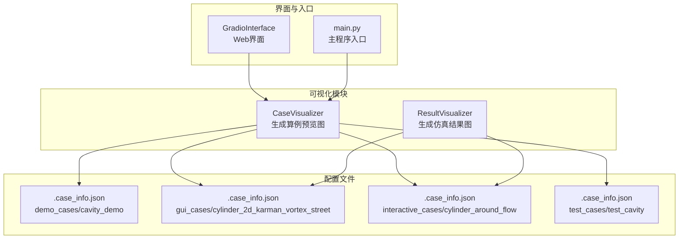
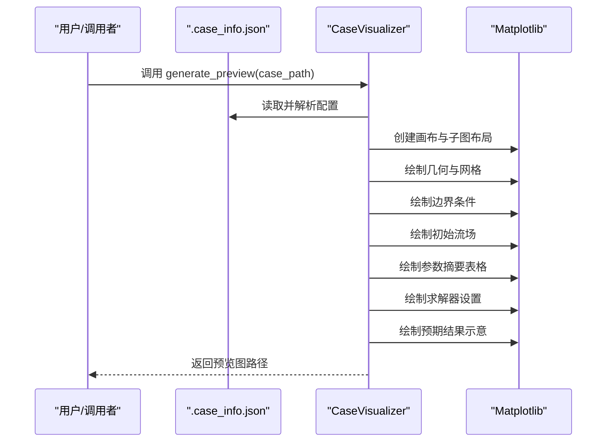
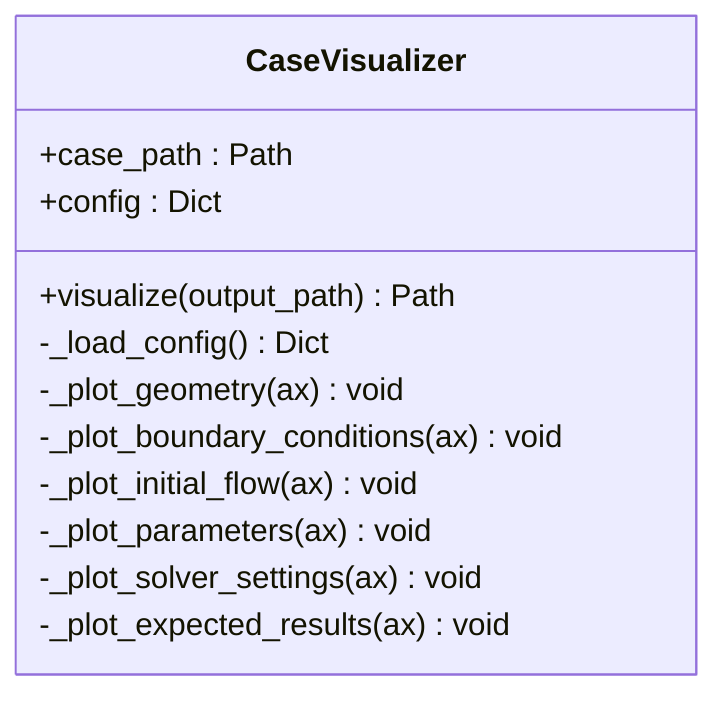
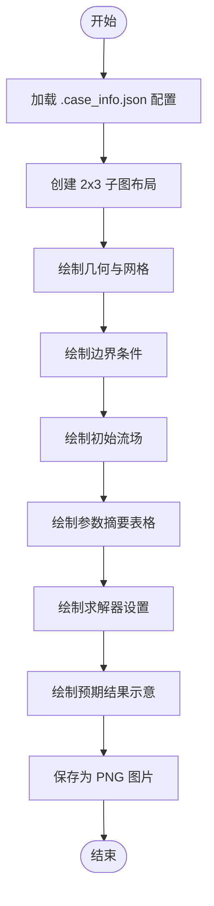
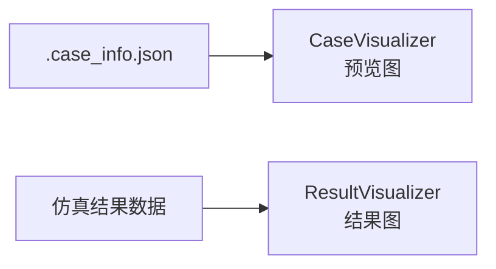
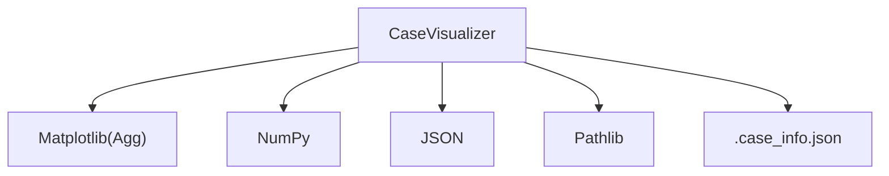

# 算例可视化器

<cite>
**本文引用的文件**
- [openfoam_ai/utils/case_visualizer.py](file://openfoam_ai/utils/case_visualizer.py)
- [openfoam_ai/utils/result_visualizer.py](file://openfoam_ai/utils/result_visualizer.py)
- [demo_cases/cavity_demo/.case_info.json](file://demo_cases/cavity_demo/.case_info.json)
- [gui_cases/cylinder_2d_karman_vortex_street/.case_info.json](file://gui_cases/cylinder_2d_karman_vortex_street/.case_info.json)
- [interactive_cases/cylinder_around_flow/.case_info.json](file://interactive_cases/cylinder_around_flow/.case_info.json)
- [test_cases/test_cavity/.case_info.json](file://test_cases/test_cavity/.case_info.json)
- [openfoam_ai/ui/gradio_interface.py](file://openfoam_ai/ui/gradio_interface.py)
- [openfoam_ai/main.py](file://openfoam_ai/main.py)
</cite>

## 目录
1. [简介](#简介)
2. [项目结构](#项目结构)
3. [核心组件](#核心组件)
4. [架构总览](#架构总览)
5. [详细组件分析](#详细组件分析)
6. [依赖关系分析](#依赖关系分析)
7. [性能考虑](#性能考虑)
8. [故障排查指南](#故障排查指南)
9. [结论](#结论)
10. [附录](#附录)

## 简介
本文件为 CaseVisualizer 算例可视化器的技术文档，聚焦“算例预览图”生成能力，涵盖几何与网格可视化、边界条件展示、初始流场示意、参数摘要、求解器设置与预期结果预测。文档详细说明了 Matplotlib 绘图技术、几何图形绘制、速度矢量场生成、表格数据展示等实现原理，并阐述如何从 .case_info.json 配置文件中提取信息以生成直观的可视化图表。同时提供使用示例（调用 generate_preview 函数与 CaseVisualizer 类），解释其在 CFD 工作流中的作用，帮助用户快速理解算例配置与预期结果。最后给出参数配置、自定义选项与性能优化建议。

## 项目结构
本项目围绕“算例配置 + 可视化 + 仿真运行”的主线组织，其中与 CaseVisualizer 相关的关键文件如下：
- 可视化器实现：openfoam_ai/utils/case_visualizer.py
- 结果可视化器（对比参考）：openfoam_ai/utils/result_visualizer.py
- 算例配置样例：demo_cases/gui_cases/interactive_cases/test_cases 下的 .case_info.json
- Web 界面集成：openfoam_ai/ui/gradio_interface.py
- 主程序入口：openfoam_ai/main.py

**图表来源**
- [openfoam_ai/utils/case_visualizer.py:1-314](file://openfoam_ai/utils/case_visualizer.py#L1-L314)
- [openfoam_ai/utils/result_visualizer.py:1-353](file://openfoam_ai/utils/result_visualizer.py#L1-L353)
- [demo_cases/cavity_demo/.case_info.json:1-9](file://demo_cases/cavity_demo/.case_info.json#L1-L9)
- [gui_cases/cylinder_2d_karman_vortex_street/.case_info.json:1-52](file://gui_cases/cylinder_2d_karman_vortex_street/.case_info.json#L1-L52)
- [interactive_cases/cylinder_around_flow/.case_info.json:1-45](file://interactive_cases/cylinder_around_flow/.case_info.json#L1-L45)
- [test_cases/test_cavity/.case_info.json:1-9](file://test_cases/test_cavity/.case_info.json#L1-L9)
- [openfoam_ai/ui/gradio_interface.py:1-484](file://openfoam_ai/ui/gradio_interface.py#L1-L484)
- [openfoam_ai/main.py:1-251](file://openfoam_ai/main.py#L1-L251)

**章节来源**
- [openfoam_ai/utils/case_visualizer.py:1-314](file://openfoam_ai/utils/case_visualizer.py#L1-L314)
- [openfoam_ai/utils/result_visualizer.py:1-353](file://openfoam_ai/utils/result_visualizer.py#L1-L353)
- [openfoam_ai/ui/gradio_interface.py:1-484](file://openfoam_ai/ui/gradio_interface.py#L1-L484)
- [openfoam_ai/main.py:1-251](file://openfoam_ai/main.py#L1-L251)

## 核心组件
- CaseVisualizer：负责从 .case_info.json 加载配置，生成包含几何与网格、边界条件、初始流场、参数摘要、求解器设置、预期结果的六宫格预览图。
- generate_preview：便捷函数，封装 CaseVisualizer 的实例化与可视化调用。
- 配置文件 .case_info.json：提供物理类型、求解器、几何尺寸与网格分辨率、边界条件、运动粘度等信息，作为绘图的数据源。

关键职责与接口：
- 加载配置：读取 .case_info.json 并缓存为字典。
- 可视化布局：创建 2×3 布局的子图，分别绘制几何与网格、边界条件、初始流场、参数摘要、求解器设置、预期结果。
- 数据提取：从配置中解析几何尺寸、网格密度、入口速度、边界条件类型与值、求解器参数等。
- 图形绘制：使用 Matplotlib 的 patches、quiver、table、contour 等绘制几何、矢量场、表格与云图等。

**章节来源**
- [openfoam_ai/utils/case_visualizer.py:16-82](file://openfoam_ai/utils/case_visualizer.py#L16-L82)
- [openfoam_ai/utils/case_visualizer.py:287-299](file://openfoam_ai/utils/case_visualizer.py#L287-L299)

## 架构总览
CaseVisualizer 的工作流由“配置加载 → 图像构建 → 子图绘制 → 保存输出”构成。下图展示了从 .case_info.json 到最终预览图的映射关系：

**图表来源**
- [openfoam_ai/utils/case_visualizer.py:31-82](file://openfoam_ai/utils/case_visualizer.py#L31-L82)
- [openfoam_ai/utils/case_visualizer.py:84-285](file://openfoam_ai/utils/case_visualizer.py#L84-L285)

**章节来源**
- [openfoam_ai/utils/case_visualizer.py:31-82](file://openfoam_ai/utils/case_visualizer.py#L31-L82)

## 详细组件分析

### CaseVisualizer 类
- 职责：封装可视化逻辑，统一从 .case_info.json 读取配置并生成预览图。
- 关键方法：
  - visualize：创建画布与子图，依次调用各绘制方法。
  - _plot_geometry：绘制计算域、网格线、障碍物（如圆柱）。
  - _plot_boundary_conditions：以文本框形式展示边界条件名称、类型与值。
  - _plot_initial_flow：基于入口速度生成规则化的速度矢量场，圆柱场景添加涡旋扰动。
  - _plot_parameters：生成参数表格，包含求解器、物理类型、结束时间、时间步长、网格尺寸、粘度等。
  - _plot_solver_settings：以等宽字体文本展示求解器名称、时间设置与预计步数。
  - _plot_expected_results：根据是否存在圆柱边界条件预测卡门涡街或稳态流动。

**图表来源**
- [openfoam_ai/utils/case_visualizer.py:16-285](file://openfoam_ai/utils/case_visualizer.py#L16-L285)

**章节来源**
- [openfoam_ai/utils/case_visualizer.py:16-285](file://openfoam_ai/utils/case_visualizer.py#L16-L285)

### 预览图生成流程（算法）

**图表来源**
- [openfoam_ai/utils/case_visualizer.py:31-82](file://openfoam_ai/utils/case_visualizer.py#L31-L82)

**章节来源**
- [openfoam_ai/utils/case_visualizer.py:31-82](file://openfoam_ai/utils/case_visualizer.py#L31-L82)

### Matplotlib 绘图技术要点
- 非交互后端：使用 Agg 后端，适合批量生成图片。
- 几何绘制：使用矩形与圆形 patch 表示计算域与障碍物；网格线通过垂直/水平线段近似。
- 矢量场：使用 quiver 绘制速度矢量，入口速度来自边界条件配置。
- 表格：使用 table 绘制参数表，设置表头样式与字体大小。
- 文本标注：在几何图中标注圆柱、流动方向与预期结果标题。

**章节来源**
- [openfoam_ai/utils/case_visualizer.py:6-13](file://openfoam_ai/utils/case_visualizer.py#L6-L13)
- [openfoam_ai/utils/case_visualizer.py:84-125](file://openfoam_ai/utils/case_visualizer.py#L84-L125)
- [openfoam_ai/utils/case_visualizer.py:126-148](file://openfoam_ai/utils/case_visualizer.py#L126-L148)
- [openfoam_ai/utils/case_visualizer.py:149-186](file://openfoam_ai/utils/case_visualizer.py#L149-L186)
- [openfoam_ai/utils/case_visualizer.py:187-216](file://openfoam_ai/utils/case_visualizer.py#L187-L216)
- [openfoam_ai/utils/case_visualizer.py:217-237](file://openfoam_ai/utils/case_visualizer.py#L217-L237)
- [openfoam_ai/utils/case_visualizer.py:239-285](file://openfoam_ai/utils/case_visualizer.py#L239-L285)

### 从 .case_info.json 提取信息
- 物理类型：决定预期结果类型（如稳态或涡街）。
- 几何与网格：维度与网格分辨率用于绘制计算域与网格线。
- 边界条件：入口速度用于初始流场矢量幅值；圆柱边界用于判断涡街预期。
- 求解器：名称、结束时间、时间步长用于参数摘要与求解器设置。
- 运动粘度：用于参数摘要。

示例配置文件路径：
- [demo_cases/cavity_demo/.case_info.json:1-9](file://demo_cases/cavity_demo/.case_info.json#L1-L9)
- [gui_cases/cylinder_2d_karman_vortex_street/.case_info.json:1-52](file://gui_cases/cylinder_2d_karman_vortex_street/.case_info.json#L1-L52)
- [interactive_cases/cylinder_around_flow/.case_info.json:1-45](file://interactive_cases/cylinder_around_flow/.case_info.json#L1-L45)
- [test_cases/test_cavity/.case_info.json:1-9](file://test_cases/test_cavity/.case_info.json#L1-L9)

**章节来源**
- [openfoam_ai/utils/case_visualizer.py:23-29](file://openfoam_ai/utils/case_visualizer.py#L23-L29)
- [openfoam_ai/utils/case_visualizer.py:91-122](file://openfoam_ai/utils/case_visualizer.py#L91-L122)
- [openfoam_ai/utils/case_visualizer.py:160-183](file://openfoam_ai/utils/case_visualizer.py#L160-L183)
- [openfoam_ai/utils/case_visualizer.py:191-210](file://openfoam_ai/utils/case_visualizer.py#L191-L210)
- [openfoam_ai/utils/case_visualizer.py:217-237](file://openfoam_ai/utils/case_visualizer.py#L217-L237)
- [openfoam_ai/utils/case_visualizer.py:239-284](file://openfoam_ai/utils/case_visualizer.py#L239-L284)

### 与结果可视化器的对比
- CaseVisualizer：预览阶段，无需运行仿真，基于配置生成示意图。
- ResultVisualizer：结果阶段，读取仿真数据生成云图、流线、涡量与收敛监控图。

**图表来源**
- [openfoam_ai/utils/case_visualizer.py:1-314](file://openfoam_ai/utils/case_visualizer.py#L1-L314)
- [openfoam_ai/utils/result_visualizer.py:1-353](file://openfoam_ai/utils/result_visualizer.py#L1-L353)

**章节来源**
- [openfoam_ai/utils/result_visualizer.py:14-79](file://openfoam_ai/utils/result_visualizer.py#L14-L79)

## 依赖关系分析
- 内部依赖：CaseVisualizer 依赖 Matplotlib（Agg 后端）、NumPy、JSON、Pathlib。
- 外部依赖：.case_info.json 配置文件。
- 集成点：Web 界面与主程序可通过调用 generate_preview 或直接实例化 CaseVisualizer 生成预览图。

**图表来源**
- [openfoam_ai/utils/case_visualizer.py:6-13](file://openfoam_ai/utils/case_visualizer.py#L6-L13)

**章节来源**
- [openfoam_ai/utils/case_visualizer.py:6-13](file://openfoam_ai/utils/case_visualizer.py#L6-L13)

## 性能考虑
- 后端选择：使用 Agg 非交互后端，避免 GUI 渲染开销，适合批量生成图片。
- 网格密度：几何与网格绘制采用稀疏网格线（按网格步长比例抽样），降低渲染复杂度。
- 矢量场采样：初始流场矢量在较小网格上绘制，避免过密导致渲染缓慢。
- 表格与文本：表格与文本绘制成本较低，但注意字体大小与边距设置，避免过度缩放。
- 输出质量：默认 DPI 适中，可在需要时调整以平衡文件大小与清晰度。

[本节为通用性能建议，不直接分析具体文件]

## 故障排查指南
- 配置文件缺失：若 .case_info.json 不存在，将返回空配置，导致绘图元素缺失或默认值显示。请确认算例目录包含该文件。
- 配置字段缺失：若缺少几何、边界条件、求解器等字段，相关子图可能显示默认值或空白。请补齐必要字段。
- Matplotlib 后端问题：若未正确设置 Agg 后端，可能在某些环境中引发 GUI 相关错误。请确保在导入 pyplot 前设置后端。
- 输出路径权限：若输出目录无写权限，保存图片会失败。请检查目标路径权限。
- Web 界面集成：若通过 Gradio 界面调用，需确保 Gradio 可用且网络可达。

**章节来源**
- [openfoam_ai/utils/case_visualizer.py:23-29](file://openfoam_ai/utils/case_visualizer.py#L23-L29)
- [openfoam_ai/utils/case_visualizer.py:38-40](file://openfoam_ai/utils/case_visualizer.py#L38-L40)
- [openfoam_ai/ui/gradio_interface.py:18-25](file://openfoam_ai/ui/gradio_interface.py#L18-L25)

## 结论
CaseVisualizer 通过解析 .case_info.json 配置，快速生成直观的算例预览图，覆盖几何与网格、边界条件、初始流场、参数摘要、求解器设置与预期结果等关键信息。其基于 Matplotlib 的高效绘图与简洁的 API 设计，使用户能在不运行仿真的情况下，迅速把握算例配置与预期行为。结合 Web 界面与主程序入口，该可视化器可无缝融入 CFD 工作流，提升配置审查与结果预测效率。

[本节为总结性内容，不直接分析具体文件]

## 附录

### 使用示例
- 调用 generate_preview：
  - 输入：算例目录路径（Path）
  - 输出：生成的预览图路径（Path）
  - 示例路径：[openfoam_ai/utils/case_visualizer.py:287-299](file://openfoam_ai/utils/case_visualizer.py#L287-L299)
- 直接使用 CaseVisualizer：
  - 实例化：CaseVisualizer(case_path)
  - 可视化：visualize(output_path=None)
  - 示例路径：[openfoam_ai/utils/case_visualizer.py:16-82](file://openfoam_ai/utils/case_visualizer.py#L16-L82)

**章节来源**
- [openfoam_ai/utils/case_visualizer.py:287-299](file://openfoam_ai/utils/case_visualizer.py#L287-L299)
- [openfoam_ai/utils/case_visualizer.py:16-82](file://openfoam_ai/utils/case_visualizer.py#L16-L82)

### 配置字段说明（摘自 .case_info.json）
- physics_type：物理类型（如 incompressible）
- solver：求解器对象，包含 name、endTime、deltaT
- geometry.dimensions：L/W/H
- geometry.mesh_resolution：nx/ny/nz
- boundary_conditions：边界条件字典，键为边界名，值为类型与值
- nu：运动粘度

示例文件：
- [demo_cases/cavity_demo/.case_info.json:1-9](file://demo_cases/cavity_demo/.case_info.json#L1-L9)
- [gui_cases/cylinder_2d_karman_vortex_street/.case_info.json:1-52](file://gui_cases/cylinder_2d_karman_vortex_street/.case_info.json#L1-L52)
- [interactive_cases/cylinder_around_flow/.case_info.json:1-45](file://interactive_cases/cylinder_around_flow/.case_info.json#L1-L45)
- [test_cases/test_cavity/.case_info.json:1-9](file://test_cases/test_cavity/.case_info.json#L1-L9)

**章节来源**
- [gui_cases/cylinder_2d_karman_vortex_street/.case_info.json:1-52](file://gui_cases/cylinder_2d_karman_vortex_street/.case_info.json#L1-L52)
- [interactive_cases/cylinder_around_flow/.case_info.json:1-45](file://interactive_cases/cylinder_around_flow/.case_info.json#L1-L45)

### 在 CFD 工作流中的作用
- 预览阶段：在生成 OpenFOAM 文件与运行仿真之前，快速核对几何、网格、边界条件与求解器设置。
- 预期结果预测：根据是否存在圆柱边界条件，预测卡门涡街或稳态流动，辅助用户理解仿真目标。
- 集成点：Web 界面与主程序可直接调用生成预览图，便于用户在交互过程中随时查看配置与预期结果。

**章节来源**
- [openfoam_ai/ui/gradio_interface.py:1-484](file://openfoam_ai/ui/gradio_interface.py#L1-L484)
- [openfoam_ai/main.py:1-251](file://openfoam_ai/main.py#L1-L251)