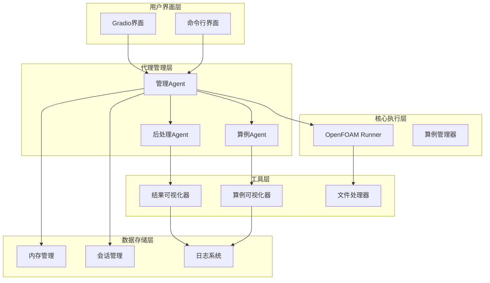
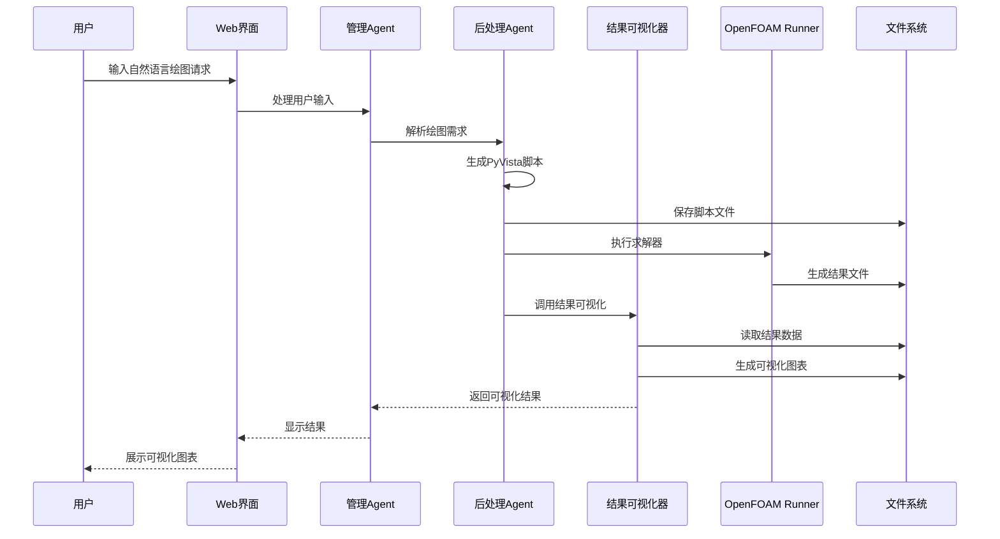
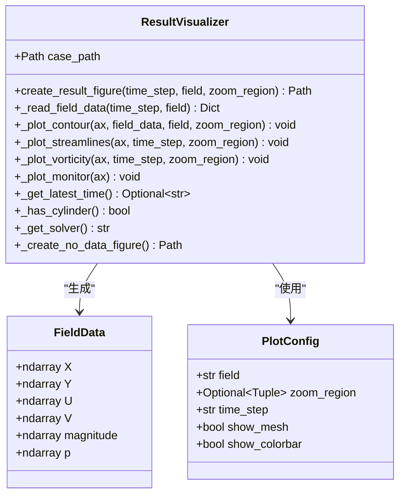
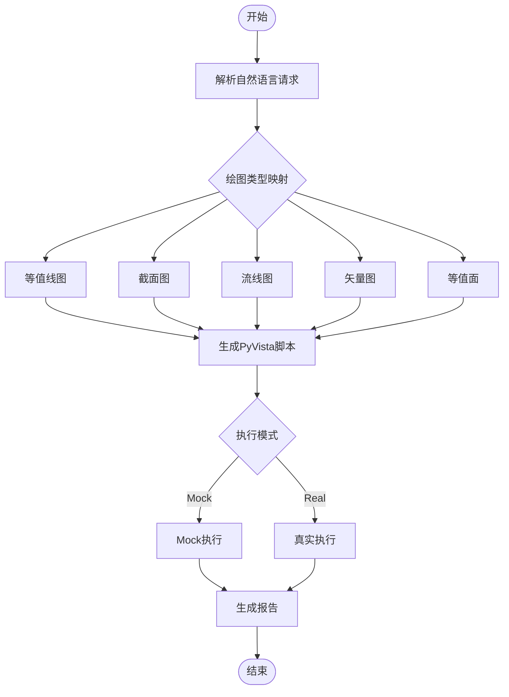
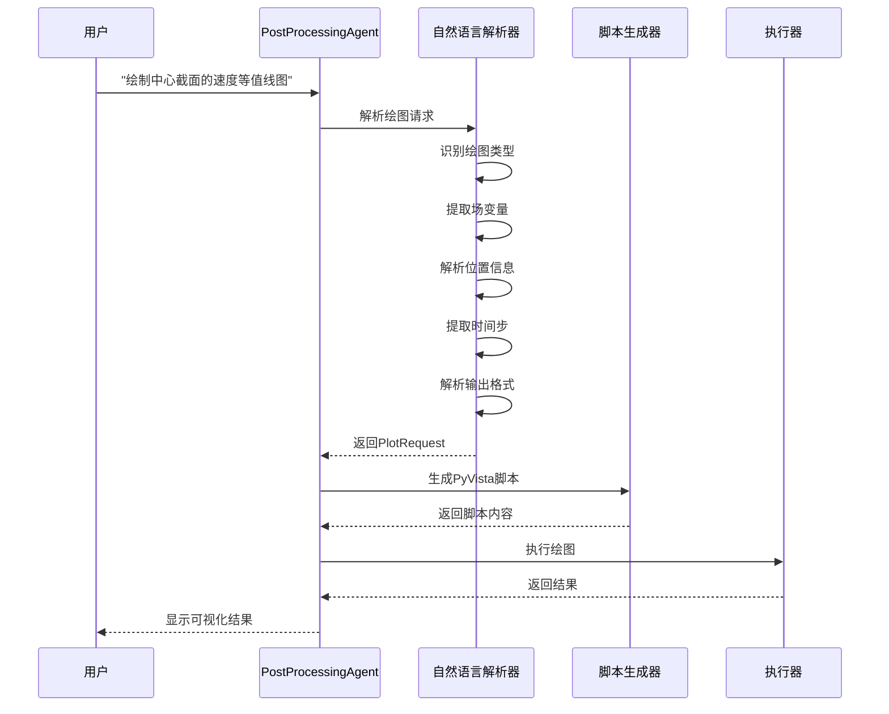
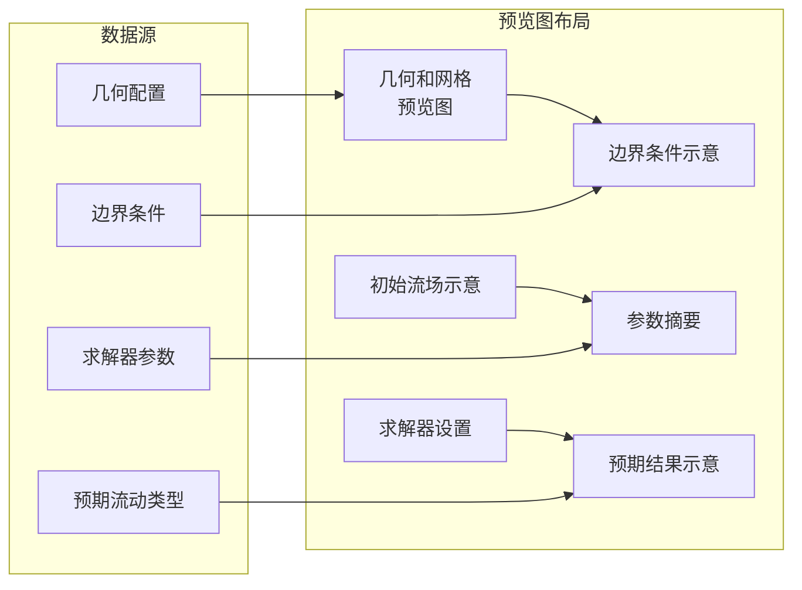
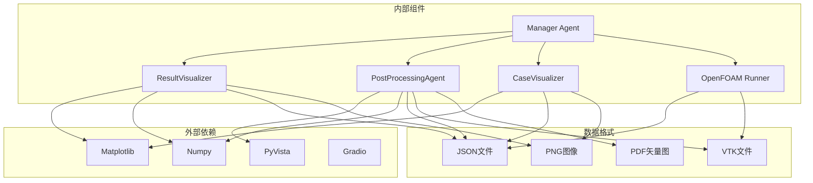
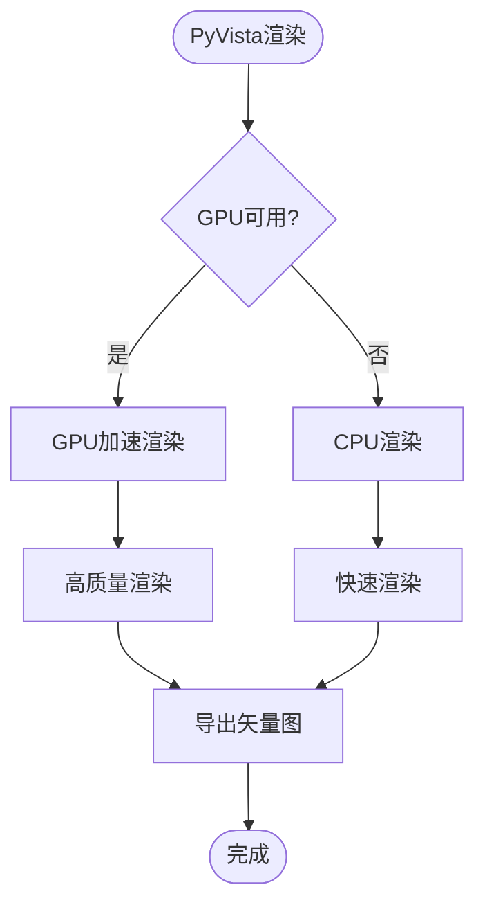

# 结果可视化器

<cite>
**本文档引用的文件**
- [result_visualizer.py](file://openfoam_ai/utils/result_visualizer.py)
- [postprocessing_agent.py](file://openfoam_ai/agents/postprocessing_agent.py)
- [case_visualizer.py](file://openfoam_ai/utils/case_visualizer.py)
- [openfoam_runner.py](file://openfoam_ai/core/openfoam_runner.py)
- [gradio_interface.py](file://openfoam_ai/ui/gradio_interface.py)
- [main.py](file://openfoam_ai/main.py)
- [.case_info.json](file://gui_cases/cylinder_2d_karman_vortex_street/.case_info.json)
</cite>

## 目录
1. [简介](#简介)
2. [项目结构](#项目结构)
3. [核心组件](#核心组件)
4. [架构概览](#架构概览)
5. [详细组件分析](#详细组件分析)
6. [依赖关系分析](#依赖关系分析)
7. [性能考虑](#性能考虑)
8. [故障排除指南](#故障排除指南)
9. [结论](#结论)
10. [附录](#附录)

## 简介

结果可视化器是OpenFOAM AI Agent系统中的关键组件，专门负责CFD仿真结果的后处理和可视化功能。该系统集成了多种可视化技术，包括传统的Matplotlib图表、高级的PyVista三维可视化，以及工程化的结果验证机制。

系统的主要目标是：
- 提供直观的仿真结果可视化界面
- 支持多种CFD结果数据格式的处理
- 实现从二维等值线图到三维网格渲染的全方位可视化
- 确保所有可视化结果基于实际计算数据
- 提供工程分析所需的完整数据处理流程

## 项目结构

OpenFOAM AI Agent采用模块化架构设计，结果可视化器位于系统的工具层，与核心执行器、代理层和用户界面层协同工作。



**图表来源**
- [gradio_interface.py:31-67](file://openfoam_ai/ui/gradio_interface.py#L31-L67)
- [main.py:19-22](file://openfoam_ai/main.py#L19-L22)
- [postprocessing_agent.py:108-118](file://openfoam_ai/agents/postprocessing_agent.py#L108-L118)

**章节来源**
- [main.py:1-251](file://openfoam_ai/main.py#L1-L251)
- [gradio_interface.py:1-484](file://openfoam_ai/ui/gradio_interface.py#L1-L484)

## 核心组件

结果可视化器系统由三个主要组件构成，每个组件都有特定的功能和职责：

### 1. 结果可视化器 (ResultVisualizer)
负责生成标准的CFD结果图表，包括速度场云图、压力分布图、流线图和涡量图等。

### 2. 后处理Agent (PostProcessingAgent)
基于PyVista实现高级三维可视化，支持自然语言绘图需求解析和自动化脚本生成。

### 3. 算例可视化器 (CaseVisualizer)
生成算例预览图，无需运行仿真即可展示几何配置、边界条件和预期结果。

**章节来源**
- [result_visualizer.py:14-15](file://openfoam_ai/utils/result_visualizer.py#L14-L15)
- [postprocessing_agent.py:108-109](file://openfoam_ai/agents/postprocessing_agent.py#L108-L109)
- [case_visualizer.py:16-17](file://openfoam_ai/utils/case_visualizer.py#L16-L17)

## 架构概览

系统采用分层架构设计，确保各组件之间的松耦合和高内聚。



**图表来源**
- [gradio_interface.py:99-122](file://openfoam_ai/ui/gradio_interface.py#L99-L122)
- [postprocessing_agent.py:172-240](file://openfoam_ai/agents/postprocessing_agent.py#L172-L240)
- [openfoam_runner.py:99-198](file://openfoam_ai/core/openfoam_runner.py#L99-L198)

## 详细组件分析

### 结果可视化器 (ResultVisualizer)

ResultVisualizer是系统中最基础的可视化组件，专注于生成标准的CFD结果图表。

#### 核心功能架构



**图表来源**
- [result_visualizer.py:14-15](file://openfoam_ai/utils/result_visualizer.py#L14-L15)
- [result_visualizer.py:81-150](file://openfoam_ai/utils/result_visualizer.py#L81-L150)

#### 数据处理流程

ResultVisualizer采用渐进式的数据处理策略：

1. **时间步检测**: 自动识别最新的可用时间步
2. **字段数据读取**: 从OpenFOAM结果文件中提取指定场变量
3. **几何信息解析**: 从.case_info.json文件中获取几何配置
4. **数据格式转换**: 将OpenFOAM数据转换为Matplotlib友好的格式
5. **可视化生成**: 创建多种类型的图表组合

#### 图表类型支持

系统支持以下五种主要图表类型：

| 图表类型 | 用途 | 数据源 | 特殊功能 |
|---------|------|--------|----------|
| 速度场云图 | 显示速度场分布 | U场 | 支持局部放大、圆柱遮挡 |
| 流线图 | 显示流线轨迹 | U场 | 矢量场可视化 |
| 涡量图 | 检测涡流结构 | U场导数 | 卡门涡街识别 |
| 残差监控图 | 显示收敛性 | 求解器日志 | 自动收敛判断 |
| 压力分布图 | 显示压力场 | p场 | 等值线可视化 |

**章节来源**
- [result_visualizer.py:20-79](file://openfoam_ai/utils/result_visualizer.py#L20-L79)
- [result_visualizer.py:151-246](file://openfoam_ai/utils/result_visualizer.py#L151-L246)

### 后处理Agent (PostProcessingAgent)

PostProcessingAgent是系统的核心智能组件，实现了基于PyVista的高级三维可视化功能。

#### PyVista集成架构



**图表来源**
- [postprocessing_agent.py:172-240](file://openfoam_ai/agents/postprocessing_agent.py#L172-L240)
- [postprocessing_agent.py:241-344](file://openfoam_ai/agents/postprocessing_agent.py#L241-L344)

#### 绘图类型支持

PostProcessingAgent支持八种主要的绘图类型：

| 绘图类型 | PyVista对应方法 | 用途 | 输出格式 |
|---------|----------------|------|----------|
| 等值线图 | mesh.contour() | 二维等值线 | PNG, PDF, SVG |
| 流线图 | mesh.streamlines() | 流场轨迹 | PNG, PDF, SVG |
| 矢量图 | mesh.arrows | 速度矢量场 | PNG, PDF, SVG |
| 等值面 | mesh.contour(isosurfaces) | 三维等值面 | PNG, PDF, SVG |
| 截面图 | mesh.slice() | 截面可视化 | PNG, PDF, SVG |
| 线图 | plotter.add_mesh() | 曲线图 | PNG, PDF, SVG |
| 散点图 | plotter.add_mesh() | 散点数据 | PNG, PDF, SVG |
| 时序图 | 多时间步序列 | 时间演化 | PNG, PDF, SVG |

#### 自然语言处理机制

系统实现了强大的自然语言到绘图指令的转换能力：



**图表来源**
- [postprocessing_agent.py:172-240](file://openfoam_ai/agents/postprocessing_agent.py#L172-L240)
- [postprocessing_agent.py:241-344](file://openfoam_ai/agents/postprocessing_agent.py#L241-L344)

**章节来源**
- [postprocessing_agent.py:108-588](file://openfoam_ai/agents/postprocessing_agent.py#L108-L588)

### 算例可视化器 (CaseVisualizer)

CaseVisualizer专注于生成算例预览图，无需运行仿真即可展示完整的算例配置。

#### 预览图布局设计



**图表来源**
- [case_visualizer.py:31-82](file://openfoam_ai/utils/case_visualizer.py#L31-L82)

#### 预览内容组成

CaseVisualizer生成的预览图包含六个主要部分：

1. **几何和网格预览**: 显示计算域边界、网格线和障碍物
2. **边界条件示意**: 列出所有边界条件及其数值
3. **初始流场示意**: 展示入口速度和其他初始条件
4. **参数摘要**: 表格形式显示关键求解器参数
5. **求解器设置**: 显示时间步长、结束时间和预期步数
6. **预期结果示意**: 基于边界条件预测的流动模式

**章节来源**
- [case_visualizer.py:16-314](file://openfoam_ai/utils/case_visualizer.py#L16-L314)

## 依赖关系分析

系统采用模块化设计，各组件之间的依赖关系清晰明确。



**图表来源**
- [result_visualizer.py:5-11](file://openfoam_ai/utils/result_visualizer.py#L5-L11)
- [postprocessing_agent.py:23-33](file://openfoam_ai/agents/postprocessing_agent.py#L23-L33)
- [case_visualizer.py:6-13](file://openfoam_ai/utils/case_visualizer.py#L6-L13)

### 关键依赖特性

1. **可选依赖**: PyVista是可选依赖，系统在缺少时自动降级到Mock模式
2. **数据格式多样性**: 支持JSON配置文件、VTK结果文件和图像输出
3. **平台兼容性**: 使用Agg后端确保在无GUI环境中正常运行
4. **版本兼容性**: 通过异常处理确保不同版本库的兼容性

**章节来源**
- [postprocessing_agent.py:23-27](file://openfoam_ai/agents/postprocessing_agent.py#L23-L27)
- [result_visualizer.py:5-6](file://openfoam_ai/utils/result_visualizer.py#L5-L6)

## 性能考虑

系统在设计时充分考虑了性能优化和资源管理。

### 渲染性能优化

1. **内存管理**: 使用NumPy数组进行高效的数据处理
2. **图像压缩**: 默认使用PNG格式平衡质量和文件大小
3. **批量处理**: 支持同时生成多个图表的组合图
4. **缓存机制**: 重用计算结果避免重复处理

### PyVista性能特性



**图表来源**
- [postprocessing_agent.py:445-491](file://openfoam_ai/agents/postprocessing_agent.py#L445-L491)

### 数据处理优化

1. **延迟加载**: 只在需要时才读取和处理数据
2. **增量更新**: 支持部分更新而非完全重建
3. **并行处理**: 利用NumPy向量化操作提高效率
4. **资源清理**: 自动清理临时文件和内存占用

## 故障排除指南

### 常见问题及解决方案

#### PyVista相关问题

| 问题症状 | 可能原因 | 解决方案 |
|---------|---------|---------|
| PyVista不可用 | 未安装PyVista | `pip install pyvista` |
| 渲染失败 | OpenGL上下文问题 | 使用Agg后端或升级显卡驱动 |
| 内存不足 | 大型网格渲染 | 降低分辨率或使用切片视图 |
| 性能缓慢 | CPU负载过高 | 启用GPU加速或减少渲染细节 |

#### 数据读取问题

| 问题症状 | 可能原因 | 解决方案 |
|---------|---------|---------|
| 无数据可用 | 仿真未运行 | 先运行OpenFOAM求解器 |
| 字段缺失 | 文件损坏 | 检查OpenFOAM结果文件完整性 |
| 格式不匹配 | 版本不兼容 | 更新OpenFOAM或使用兼容模式 |
| 权限错误 | 文件访问权限 | 检查文件权限设置 |

#### 可视化显示问题

| 问题症状 | 可能原因 | 解决方案 |
|---------|---------|---------|
| 图像模糊 | DPI设置过低 | 提高DPI或使用矢量格式 |
| 颜色异常 | 颜色映射配置错误 | 检查colormap设置 |
| 标签重叠 | 图表过于拥挤 | 调整布局或使用子图 |
| 坐标轴异常 | 数据范围异常 | 检查数据预处理步骤 |

**章节来源**
- [postprocessing_agent.py:366-380](file://openfoam_ai/agents/postprocessing_agent.py#L366-L380)
- [result_visualizer.py:338-353](file://openfoam_ai/utils/result_visualizer.py#L338-L353)

### 调试技巧

1. **日志分析**: 检查OpenFOAM日志文件中的收敛信息
2. **中间结果**: 保存中间处理结果便于调试
3. **简化测试**: 使用小规模网格进行快速验证
4. **版本对比**: 比较不同版本的输出结果

## 结论

结果可视化器系统为OpenFOAM仿真提供了完整的后处理和可视化解决方案。通过集成多种可视化技术和智能的自然语言处理能力，系统能够满足从初学者到专业工程师的各种需求。

### 主要优势

1. **多功能性**: 支持从二维图表到三维可视化的全方位功能
2. **智能化**: 基于自然语言的绘图需求解析
3. **工程化**: 遵循严格的工程约束和数据验证机制
4. **易用性**: 提供直观的Web界面和丰富的API接口

### 发展方向

1. **增强AI集成**: 更智能的绘图建议和自动优化
2. **扩展格式支持**: 支持更多CFD软件的结果格式
3. **云端部署**: 支持分布式计算和云端可视化
4. **实时协作**: 多用户协作和共享可视化结果

该系统为CFD仿真结果的分析和展示提供了强有力的技术支撑，有助于工程师从仿真数据中提取更有价值的信息。

## 附录

### 使用示例

#### 基础结果可视化

```python
# 创建结果可视化器
rv = ResultVisualizer("path/to/case")

# 生成速度场云图
image_path = rv.create_result_figure(
    time_step="0.1",
    field="U",
    zoom_region=(0.5, 1.5, 0.2, 0.8)
)
```

#### 高级PyVista可视化

```python
# 创建后处理Agent
pp = PostProcessingAgent("path/to/case")

# 解析自然语言请求
request = pp.parse_natural_language(
    "绘制中心截面的压力等值线图，使用PDF格式"
)

# 执行绘图
result = pp.execute_plot(request, output_dir="results")
```

#### 算例预览生成

```python
# 生成算例预览
cv = CaseVisualizer("path/to/case")
preview_path = cv.visualize()
```

### 配置选项

| 参数 | 类型 | 默认值 | 描述 |
|------|------|--------|------|
| time_step | str | None | 时间步（None表示最新） |
| field | str | "U" | 场变量名称 |
| zoom_region | tuple | None | 局部放大区域 |
| output_format | OutputFormat | PNG | 输出文件格式 |
| contour_levels | int | 20 | 等值线数量 |
| show_mesh | bool | False | 是否显示网格 |
| show_colorbar | bool | True | 是否显示色标 |
| dpi | int | 300 | 图像分辨率 |