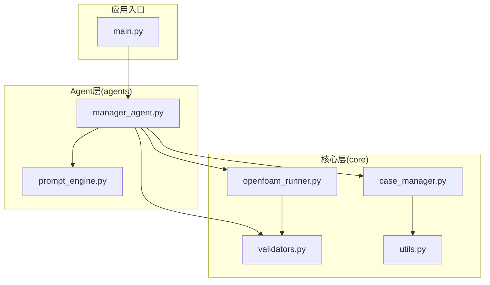
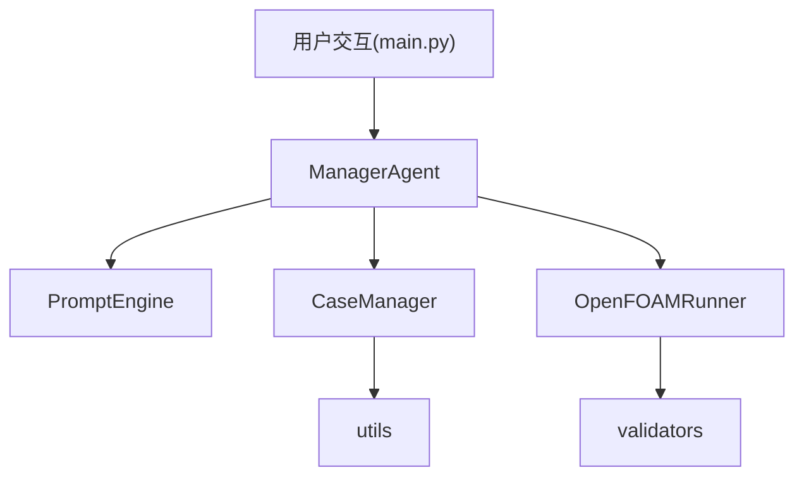
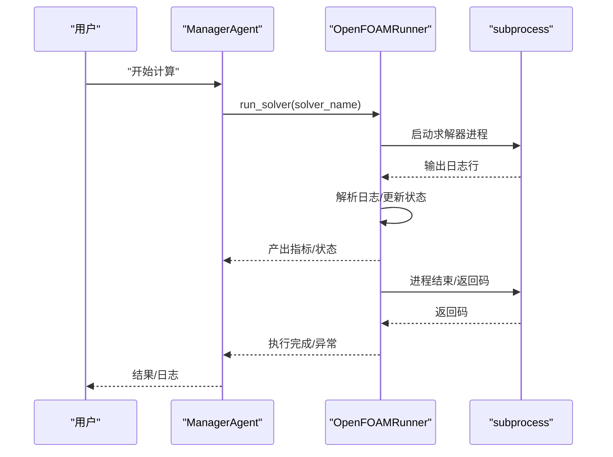
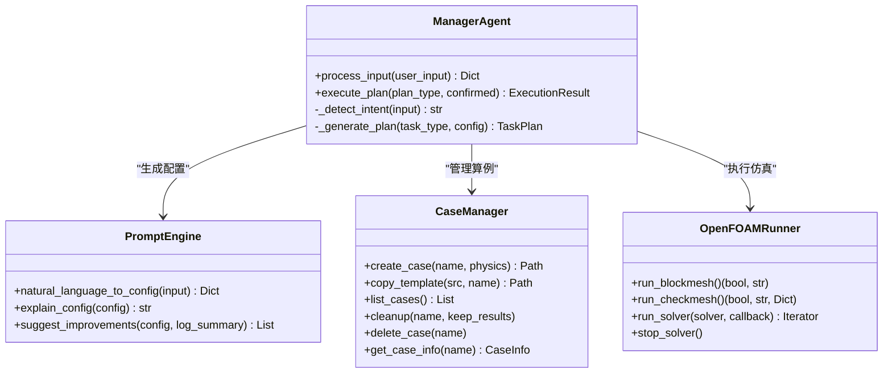
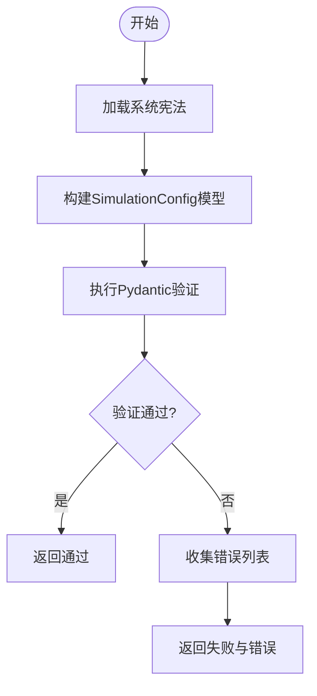
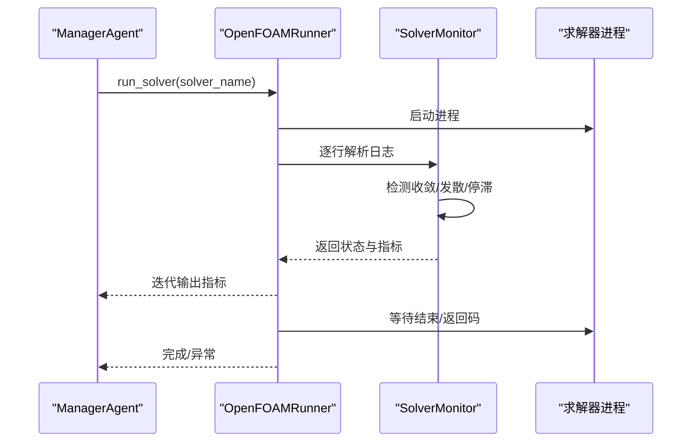
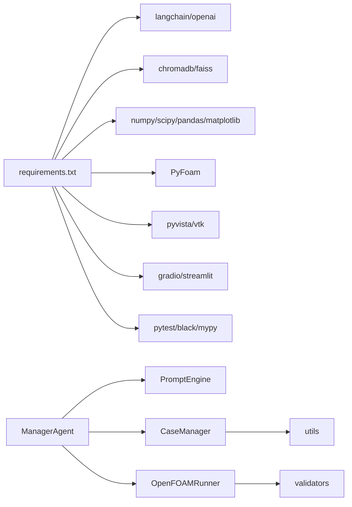

# 代码规范与约定

<cite>
**本文档引用的文件**
- [openfoam_ai/__init__.py](file://openfoam_ai/__init__.py)
- [openfoam_ai/main.py](file://openfoam_ai/main.py)
- [openfoam_ai/README.md](file://openfoam_ai/README.md)
- [openfoam_ai/requirements.txt](file://openfoam_ai/requirements.txt)
- [openfoam_ai/core/__init__.py](file://openfoam_ai/core/__init__.py)
- [openfoam_ai/core/case_manager.py](file://openfoam_ai/core/case_manager.py)
- [openfoam_ai/core/openfoam_runner.py](file://openfoam_ai/core/openfoam_runner.py)
- [openfoam_ai/core/validators.py](file://openfoam_ai/core/validators.py)
- [openfoam_ai/core/utils.py](file://openfoam_ai/core/utils.py)
- [openfoam_ai/agents/manager_agent.py](file://openfoam_ai/agents/manager_agent.py)
- [openfoam_ai/agents/prompt_engine.py](file://openfoam_ai/agents/prompt_engine.py)
- [openfoam_ai/tests/test_basic.py](file://openfoam_ai/tests/test_basic.py)
- [openfoam_ai/tests/test_case_manager.py](file://openfoam_ai/tests/test_case_manager.py)
</cite>

## 目录
1. [引言](#引言)
2. [项目结构](#项目结构)
3. [核心组件](#核心组件)
4. [架构总览](#架构总览)
5. [详细组件分析](#详细组件分析)
6. [依赖分析](#依赖分析)
7. [性能考虑](#性能考虑)
8. [故障排查指南](#故障排查指南)
9. [结论](#结论)
10. [附录](#附录)

## 引言
本文件为 OpenFOAM AI 项目的代码规范与编程约定，面向参与开发的工程师与维护者，旨在统一命名、注释、导入、格式化、异常处理、日志记录与设计模式应用等关键实践，确保代码一致性、可读性与可维护性。规范以现有代码库为依据，结合项目实际功能与模块划分，提供可落地的指导。

## 项目结构
项目采用分层与功能域混合的组织方式：
- 核心层（core）：算例管理、文件生成、验证器、求解器运行、通用工具
- Agent 层（agents）：提示词引擎、管理Agent、各类专用Agent
- UI 层（ui）：CLI 与 Web 界面接口
- 配置与测试：系统宪法（配置）、单元测试与演示脚本
- Docker 与依赖：容器化部署与第三方依赖声明

图表来源
- [openfoam_ai/main.py:1-251](file://openfoam_ai/main.py#L1-L251)
- [openfoam_ai/core/case_manager.py:1-639](file://openfoam_ai/core/case_manager.py#L1-L639)
- [openfoam_ai/core/openfoam_runner.py:1-548](file://openfoam_ai/core/openfoam_runner.py#L1-L548)
- [openfoam_ai/core/validators.py:1-441](file://openfoam_ai/core/validators.py#L1-L441)
- [openfoam_ai/core/utils.py:1-111](file://openfoam_ai/core/utils.py#L1-L111)
- [openfoam_ai/agents/manager_agent.py:1-458](file://openfoam_ai/agents/manager_agent.py#L1-L458)
- [openfoam_ai/agents/prompt_engine.py:1-616](file://openfoam_ai/agents/prompt_engine.py#L1-L616)

章节来源
- [openfoam_ai/README.md:130-150](file://openfoam_ai/README.md#L130-L150)
- [openfoam_ai/main.py:1-251](file://openfoam_ai/main.py#L1-L251)

## 核心组件
- 管理Agent（ManagerAgent）：负责意图识别、计划生成、执行协调与状态管理
- 提示词引擎（PromptEngine）：将自然语言转为结构化配置，支持Mock模式
- 算例管理器（CaseManager）：创建/复制/清理/删除算例，维护算例信息
- OpenFOAM运行器（OpenFOAMRunner）：封装命令执行、日志解析、状态监控
- 验证器（validators）：基于 Pydantic 的硬约束与物理一致性校验
- 通用工具（utils）：JSON读写、目录确保、格式化大小、执行时间装饰器

章节来源
- [openfoam_ai/agents/manager_agent.py:38-458](file://openfoam_ai/agents/manager_agent.py#L38-L458)
- [openfoam_ai/agents/prompt_engine.py:20-616](file://openfoam_ai/agents/prompt_engine.py#L20-L616)
- [openfoam_ai/core/case_manager.py:27-261](file://openfoam_ai/core/case_manager.py#L27-L261)
- [openfoam_ai/core/openfoam_runner.py:44-548](file://openfoam_ai/core/openfoam_runner.py#L44-L548)
- [openfoam_ai/core/validators.py:179-441](file://openfoam_ai/core/validators.py#L179-L441)
- [openfoam_ai/core/utils.py:16-111](file://openfoam_ai/core/utils.py#L16-L111)

## 架构总览
系统采用“用户交互 → 管理Agent → 子Agent/核心模块”的分层架构，ManagerAgent作为中枢协调各模块，结合宪法约束与物理验证保障仿真配置的合理性与安全性。

图表来源
- [openfoam_ai/main.py:19-22](file://openfoam_ai/main.py#L19-L22)
- [openfoam_ai/agents/manager_agent.py:12-16](file://openfoam_ai/agents/manager_agent.py#L12-L16)
- [openfoam_ai/core/case_manager.py:10-12](file://openfoam_ai/core/case_manager.py#L10-L12)
- [openfoam_ai/core/openfoam_runner.py](file://openfoam_ai/core/openfoam_runner.py#L13)
- [openfoam_ai/core/validators.py](file://openfoam_ai/core/validators.py#L11)

## 详细组件分析

### 类命名、函数命名与变量命名规范
- 类名：采用帕斯卡命名法（CamelCase），如 CaseManager、OpenFOAMRunner、SolverMetrics
- 函数/方法名：采用下划线命名法（snake_case），如 create_case、run_solver、validate_simulation_config
- 变量名：采用下划线命名法（snake_case），如 case_path、log_dir、solver_name
- 常量：采用全大写下划线命名法（UPPER_CASE），如 MAX_COURANT_EXPLICIT
- 模块/包：采用下划线命名法（snake_case），如 case_manager、openfoam_runner

章节来源
- [openfoam_ai/core/case_manager.py:27-86](file://openfoam_ai/core/case_manager.py#L27-L86)
- [openfoam_ai/core/openfoam_runner.py:44-76](file://openfoam_ai/core/openfoam_runner.py#L44-L76)
- [openfoam_ai/core/validators.py:18-120](file://openfoam_ai/core/validators.py#L18-L120)
- [openfoam_ai/agents/manager_agent.py:38-74](file://openfoam_ai/agents/manager_agent.py#L38-L74)

### 注释与文档规范
- 模块级注释：使用三引号字符串描述模块职责与导出项
- 类/函数/方法注释：使用三引号字符串，包含用途、参数说明、返回值与异常说明
- docstring 格式：先概述，再参数说明，最后返回值与异常
- 注释风格：英文为主，必要处加中文补充；避免冗余注释，重点解释“为什么”而非“是什么”

章节来源
- [openfoam_ai/core/case_manager.py:1-27](file://openfoam_ai/core/case_manager.py#L1-L27)
- [openfoam_ai/core/openfoam_runner.py:1-14](file://openfoam_ai/core/openfoam_runner.py#L1-L14)
- [openfoam_ai/core/validators.py:1-12](file://openfoam_ai/core/validators.py#L1-L12)
- [openfoam_ai/agents/manager_agent.py:1-17](file://openfoam_ai/agents/manager_agent.py#L1-L17)

### 模块导入与依赖管理
- 导入顺序：标准库 → 第三方库 → 项目内部模块
- 绝对导入优先，相对导入仅限于同包内
- 避免循环导入；跨模块依赖通过明确接口传递
- 依赖声明集中于 requirements.txt，版本使用语义化版本范围

章节来源
- [openfoam_ai/requirements.txt:1-40](file://openfoam_ai/requirements.txt#L1-L40)
- [openfoam_ai/core/case_manager.py:6-12](file://openfoam_ai/core/case_manager.py#L6-L12)
- [openfoam_ai/core/openfoam_runner.py:6-13](file://openfoam_ai/core/openfoam_runner.py#L6-L13)
- [openfoam_ai/core/validators.py:6-11](file://openfoam_ai/core/validators.py#L6-L11)

### 代码格式化与工具配置
- 格式化工具：Black（代码风格统一）
- 导入排序：isort（导入顺序规范化）
- 类型检查：mypy（静态类型检查）
- 测试：pytest（单元测试）
- 依赖管理：pip + requirements.txt

章节来源
- [openfoam_ai/requirements.txt:38-40](file://openfoam_ai/requirements.txt#L38-L40)

### 异常处理与错误信息
- 统一捕获与记录：使用 try/except 捕获异常，记录详细错误信息
- 错误信息格式：包含模块名、错误类型与简要描述，便于定位
- 命令执行异常：OpenFOAMRunner 对 subprocess 的异常进行分类处理
- 配置验证异常：validators 抛出 Pydantic 验证错误，由上层统一处理

图表来源
- [openfoam_ai/agents/manager_agent.py:268-338](file://openfoam_ai/agents/manager_agent.py#L268-L338)
- [openfoam_ai/core/openfoam_runner.py:99-198](file://openfoam_ai/core/openfoam_runner.py#L99-L198)

章节来源
- [openfoam_ai/core/openfoam_runner.py:127-142](file://openfoam_ai/core/openfoam_runner.py#L127-L142)
- [openfoam_ai/core/openfoam_runner.py:276-284](file://openfoam_ai/core/openfoam_runner.py#L276-L284)
- [openfoam_ai/core/validators.py:406-410](file://openfoam_ai/core/validators.py#L406-L410)

### 日志记录规范
- 日志级别：INFO（常规流程）、DEBUG（细节）、WARNING（潜在问题）、ERROR（失败）
- 日志格式：包含时间戳、模块名、级别与消息
- 工具：Python logging 模块，统一配置于 utils 中
- 输出位置：控制台与算例 logs 目录下的日志文件

章节来源
- [openfoam_ai/core/utils.py:11-13](file://openfoam_ai/core/utils.py#L11-L13)
- [openfoam_ai/core/openfoam_runner.py:287-291](file://openfoam_ai/core/openfoam_runner.py#L287-L291)

### 设计模式应用与最佳实践

#### Agent 模式
- 角色分离：ManagerAgent 负责任务调度与状态管理，PromptEngine 负责配置生成，CaseManager 负责文件与目录管理，OpenFOAMRunner 负责命令执行与监控
- 交互流程：自然语言输入 → 意图识别 → 配置生成 → 验证 → 计划生成 → 执行 → 结果汇总

图表来源
- [openfoam_ai/agents/manager_agent.py:38-436](file://openfoam_ai/agents/manager_agent.py#L38-L436)
- [openfoam_ai/agents/prompt_engine.py:20-571](file://openfoam_ai/agents/prompt_engine.py#L20-L571)
- [openfoam_ai/core/case_manager.py:27-261](file://openfoam_ai/core/case_manager.py#L27-L261)
- [openfoam_ai/core/openfoam_runner.py:44-548](file://openfoam_ai/core/openfoam_runner.py#L44-L548)

#### 工厂模式（配置生成）
- PromptEngine 在 Mock 模式下根据关键词选择场景，返回符合宪法约束的配置，体现“工厂”根据输入返回合适对象的思路

章节来源
- [openfoam_ai/agents/prompt_engine.py:217-373](file://openfoam_ai/agents/prompt_engine.py#L217-L373)

#### 验证器模式（Pydantic）
- validators 使用 Pydantic 模型对配置进行硬约束验证，确保物理合理性与宪法合规

章节来源
- [openfoam_ai/core/validators.py:179-275](file://openfoam_ai/core/validators.py#L179-L275)

### 关键流程与算法

#### 配置验证流程

图表来源
- [openfoam_ai/core/validators.py:389-411](file://openfoam_ai/core/validators.py#L389-L411)

#### 求解器运行与监控

图表来源
- [openfoam_ai/core/openfoam_runner.py:99-198](file://openfoam_ai/core/openfoam_runner.py#L99-L198)
- [openfoam_ai/core/openfoam_runner.py:446-469](file://openfoam_ai/core/openfoam_runner.py#L446-L469)

## 依赖分析
- 外部依赖集中在 requirements.txt，涵盖 LLM 框架、向量数据库、科学计算、OpenFOAM 接口、后处理、Web UI、工具链等
- 内部模块间依赖清晰：ManagerAgent 依赖 PromptEngine、CaseManager、OpenFOAMRunner、validators；OpenFOAMRunner 依赖 validators；CaseManager 依赖 utils

图表来源
- [openfoam_ai/requirements.txt:4-39](file://openfoam_ai/requirements.txt#L4-L39)
- [openfoam_ai/agents/manager_agent.py:12-16](file://openfoam_ai/agents/manager_agent.py#L12-L16)
- [openfoam_ai/core/openfoam_runner.py](file://openfoam_ai/core/openfoam_runner.py#L13)
- [openfoam_ai/core/case_manager.py:10-12](file://openfoam_ai/core/case_manager.py#L10-L12)

章节来源
- [openfoam_ai/requirements.txt:1-40](file://openfoam_ai/requirements.txt#L1-L40)

## 性能考虑
- I/O 优化：批量写入日志、限制日志数量（保留最近若干条）、延迟写入缓冲
- 进程管理：超时控制、优雅终止、避免僵尸进程
- 验证前置：在生成配置阶段尽早发现不合理参数，减少后续失败成本
- 并发与异步：当前以同步为主，后续可考虑异步日志与监控回调

## 故障排查指南
- 环境问题：OpenFOAM 未安装或 PATH 未配置，需确保 blockMesh 等命令可用
- 依赖缺失：缺少 openai、PyFoam 等包，按 requirements 安装
- 配置错误：Pydantic 验证失败，检查宪法约束与物理参数范围
- 编码问题：Windows 控制台编码问题，设置 PYTHONIOENCODING=utf-8
- 调试建议：启用 DEBUG 日志、使用 Mock 模式、运行单元测试

章节来源
- [openfoam_ai/README.md:208-237](file://openfoam_ai/README.md#L208-L237)
- [openfoam_ai/main.py:230-238](file://openfoam_ai/main.py#L230-L238)

## 结论
本规范以现有代码库为基础，明确了命名、注释、导入、格式化、异常处理、日志与设计模式应用等关键实践。建议在团队内推广并纳入 CI/CD 流程，持续提升代码质量与协作效率。

## 附录

### 命名与注释示例路径
- 类命名示例：[openfoam_ai/core/case_manager.py:27-86](file://openfoam_ai/core/case_manager.py#L27-L86)
- 函数命名示例：[openfoam_ai/core/openfoam_runner.py:77-98](file://openfoam_ai/core/openfoam_runner.py#L77-L98)
- 注释规范示例：[openfoam_ai/core/validators.py:1-12](file://openfoam_ai/core/validators.py#L1-L12)

### 导入与依赖示例路径
- 导入顺序与模块依赖：[openfoam_ai/agents/manager_agent.py:12-16](file://openfoam_ai/agents/manager_agent.py#L12-L16)
- 依赖声明：[openfoam_ai/requirements.txt:1-40](file://openfoam_ai/requirements.txt#L1-L40)

### 格式化与工具配置示例路径
- 工具依赖：[openfoam_ai/requirements.txt:38-40](file://openfoam_ai/requirements.txt#L38-L40)

### 异常处理与日志示例路径
- 异常处理流程：[openfoam_ai/core/openfoam_runner.py:127-142](file://openfoam_ai/core/openfoam_runner.py#L127-L142)
- 日志配置：[openfoam_ai/core/utils.py:11-13](file://openfoam_ai/core/utils.py#L11-L13)

### 设计模式示例路径
- Agent 模式交互：[openfoam_ai/agents/manager_agent.py:75-104](file://openfoam_ai/agents/manager_agent.py#L75-L104)
- 工厂模式（PromptEngine）：[openfoam_ai/agents/prompt_engine.py:217-373](file://openfoam_ai/agents/prompt_engine.py#L217-L373)
- 验证器模式（Pydantic）：[openfoam_ai/core/validators.py:179-275](file://openfoam_ai/core/validators.py#L179-L275)

### 测试与验证示例路径
- 基础测试：[openfoam_ai/tests/test_basic.py:12-58](file://openfoam_ai/tests/test_basic.py#L12-L58)
- 算例管理测试：[openfoam_ai/tests/test_case_manager.py:18-160](file://openfoam_ai/tests/test_case_manager.py#L18-L160)