# 开发指南

<cite>
**本文档引用的文件**
- [README.md](file://openfoam_ai/README.md)
- [main.py](file://openfoam_ai/main.py)
- [requirements.txt](file://openfoam_ai/requirements.txt)
- [architecture_review.md](file://plans/architecture_review.md)
- [self_healing_agent.py](file://openfoam_ai/agents/self_healing_agent.py)
- [physics_validation_agent.py](file://openfoam_ai/agents/physics_validation_agent.py)
- [mesh_quality_agent.py](file://openfoam_ai/agents/mesh_quality_agent.py)
- [manager_agent.py](file://openfoam_ai/agents/manager_agent.py)
- [prompt_engine.py](file://openfoam_ai/agents/prompt_engine.py)
- [case_manager.py](file://openfoam_ai/core/case_manager.py)
- [openfoam_runner.py](file://openfoam_ai/core/openfoam_runner.py)
- [validators.py](file://openfoam_ai/core/validators.py)
- [system_constitution.yaml](file://openfoam_ai/config/system_constitution.yaml)
- [memory_manager.py](file://openfoam_ai/memory/memory_manager.py)
</cite>

## 目录
1. [简介](#简介)
2. [项目结构](#项目结构)
3. [核心组件](#核心组件)
4. [架构总览](#架构总览)
5. [详细组件分析](#详细组件分析)
6. [依赖关系分析](#依赖关系分析)
7. [性能考虑](#性能考虑)
8. [故障排除指南](#故障排除指南)
9. [结论](#结论)
10. [附录](#附录)

## 简介
OpenFOAM AI 是一个基于大语言模型（LLM）的自动化 CFD 仿真智能体系统，目标是让用户通过自然语言描述即可完成从几何建模、网格生成、求解器配置、计算执行到结果后处理的全流程。项目采用宪法驱动设计与多智能体对抗框架，结合多重验证机制防止配置幻觉，确保仿真结果的物理合理性。

## 项目结构
项目采用模块化分层设计，主要目录与职责如下：
- agents/: 智能体模块，负责任务调度、网格质量、物理验证、自愈、提示词工程等
- core/: 核心功能模块，包括算例管理、文件生成、OpenFOAM 命令执行、验证器等
- config/: 配置文件，包含项目宪法（system_constitution.yaml）
- memory/: 记忆管理模块，基于 ChromaDB 的向量数据库，支持相似性检索与增量修改
- tests/: 单元测试与阶段测试
- ui/: 用户界面（CLI/Gradio）
- utils/: 后处理工具与可视化
- docker/: Docker 配置与编排
- demo_cases/、interactive_cases/、gui_cases/ 等：示例与演示案例

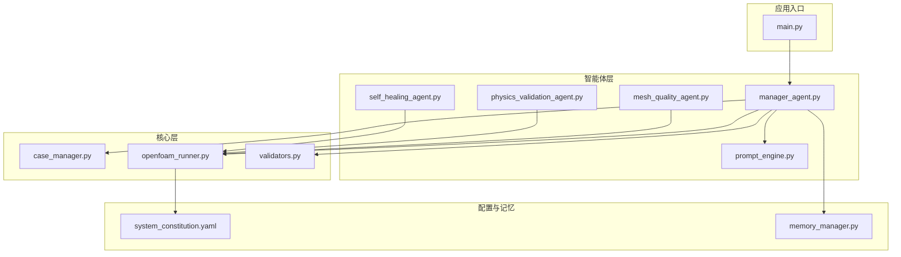

**图表来源**
- [main.py:1-251](file://openfoam_ai/main.py#L1-L251)
- [manager_agent.py:1-458](file://openfoam_ai/agents/manager_agent.py#L1-L458)
- [prompt_engine.py:1-616](file://openfoam_ai/agents/prompt_engine.py#L1-L616)
- [mesh_quality_agent.py:1-547](file://openfoam_ai/agents/mesh_quality_agent.py#L1-L547)
- [physics_validation_agent.py:1-517](file://openfoam_ai/agents/physics_validation_agent.py#L1-L517)
- [self_healing_agent.py:1-642](file://openfoam_ai/agents/self_healing_agent.py#L1-L642)
- [case_manager.py:1-639](file://openfoam_ai/core/case_manager.py#L1-L639)
- [openfoam_runner.py:1-548](file://openfoam_ai/core/openfoam_runner.py#L1-L548)
- [validators.py:1-441](file://openfoam_ai/core/validators.py#L1-L441)
- [system_constitution.yaml:1-103](file://openfoam_ai/config/system_constitution.yaml#L1-L103)
- [memory_manager.py:1-804](file://openfoam_ai/memory/memory_manager.py#L1-L804)

**章节来源**
- [README.md:130-150](file://openfoam_ai/README.md#L130-L150)
- [architecture_review.md:25-48](file://plans/architecture_review.md#L25-L48)

## 核心组件
- ManagerAgent：任务调度与用户交互中枢，协调各子智能体工作，管理会话状态与执行计划
- PromptEngine：将自然语言转换为结构化配置，支持 Mock 模式与真实 LLM 模式
- MeshQualityAgent：基于 checkMesh 的网格质量评估与自动修复建议
- PhysicsValidationAgent：后处理阶段的物理一致性验证（质量守恒、能量守恒、收敛性等）
- SelfHealingAgent：求解稳定性监控与自愈，自动调整参数并从上次时间步重启
- CaseManager：标准化 OpenFOAM 算例目录结构的创建、复制、清理与状态管理
- OpenFOAMRunner：封装 OpenFOAM 命令执行、日志捕获、指标解析与状态检测
- Validators：基于 Pydantic 的硬约束验证，集成宪法规则与物理限制
- MemoryManager：基于 ChromaDB 的向量数据库，支持相似性检索与增量修改

**章节来源**
- [manager_agent.py:38-458](file://openfoam_ai/agents/manager_agent.py#L38-L458)
- [prompt_engine.py:20-616](file://openfoam_ai/agents/prompt_engine.py#L20-L616)
- [mesh_quality_agent.py:61-547](file://openfoam_ai/agents/mesh_quality_agent.py#L61-L547)
- [physics_validation_agent.py:174-517](file://openfoam_ai/agents/physics_validation_agent.py#L174-L517)
- [self_healing_agent.py:58-642](file://openfoam_ai/agents/self_healing_agent.py#L58-L642)
- [case_manager.py:27-639](file://openfoam_ai/core/case_manager.py#L27-L639)
- [openfoam_runner.py:44-548](file://openfoam_ai/core/openfoam_runner.py#L44-L548)
- [validators.py:18-441](file://openfoam_ai/core/validators.py#L18-L441)
- [memory_manager.py:198-804](file://openfoam_ai/memory/memory_manager.py#L198-L804)

## 架构总览
系统采用“用户交互层 → 管理Agent → 子Agent/核心模块”的分层架构，并通过宪法与验证器形成防御式设计。核心流程包括：自然语言理解 → 配置生成与优化 → 算例创建与网格质量检查 → 求解器执行与监控 → 物理验证与报告生成。

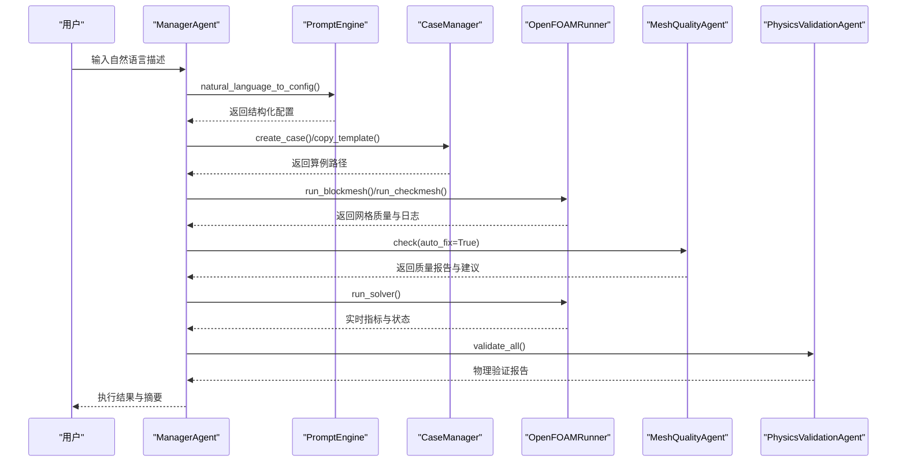

**图表来源**
- [manager_agent.py:142-338](file://openfoam_ai/agents/manager_agent.py#L142-L338)
- [prompt_engine.py:92-126](file://openfoam_ai/agents/prompt_engine.py#L92-L126)
- [case_manager.py:51-86](file://openfoam_ai/core/case_manager.py#L51-L86)
- [openfoam_runner.py:77-198](file://openfoam_ai/core/openfoam_runner.py#L77-L198)
- [mesh_quality_agent.py:111-177](file://openfoam_ai/agents/mesh_quality_agent.py#L111-L177)
- [physics_validation_agent.py:197-224](file://openfoam_ai/agents/physics_validation_agent.py#L197-L224)

## 详细组件分析

### ManagerAgent 分析
- 职责：意图识别、计划生成、执行协调、状态管理、用户确认
- 关键流程：process_input() → _handle_create_case() → execute_plan() → _execute_create()/_execute_run()
- 设计要点：依赖注入（可注入 CaseManager、PromptEngine、ConfigRefiner）、可测试性、状态持久化

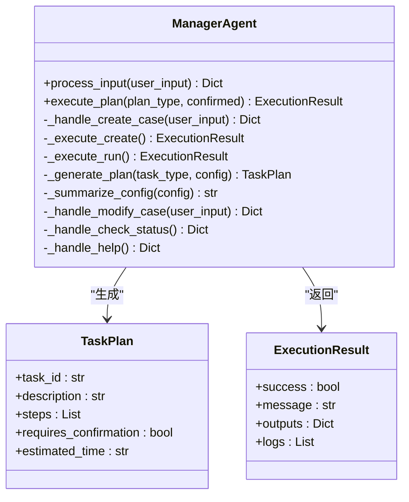

**图表来源**
- [manager_agent.py:19-458](file://openfoam_ai/agents/manager_agent.py#L19-L458)

**章节来源**
- [manager_agent.py:75-435](file://openfoam_ai/agents/manager_agent.py#L75-L435)

### PromptEngine 分析
- 职责：系统提示词管理、自然语言到配置转换、解释配置、建议改进
- 模式：Mock 模式（无 API Key）与真实 LLM 模式（OpenAI）
- 优化：ConfigRefiner 对网格分辨率、时间步长、求解器匹配进行本地优化与校验

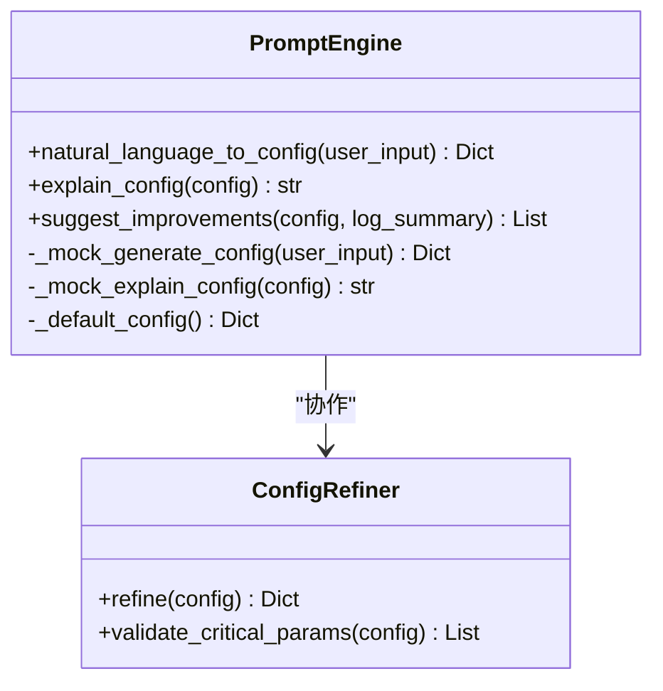

**图表来源**
- [prompt_engine.py:20-616](file://openfoam_ai/agents/prompt_engine.py#L20-L616)

**章节来源**
- [prompt_engine.py:75-571](file://openfoam_ai/agents/prompt_engine.py#L75-L571)

### MeshQualityAgent 分析
- 职责：执行 checkMesh、深度解析日志、评估质量等级、生成修复建议、自动修复（非正交性）
- 质量阈值：来源于宪法（system_constitution.yaml），支持交互式提示与自动修复策略
- 自动修复：在 fvSolution 中添加/调整 nNonOrthogonalCorrectors

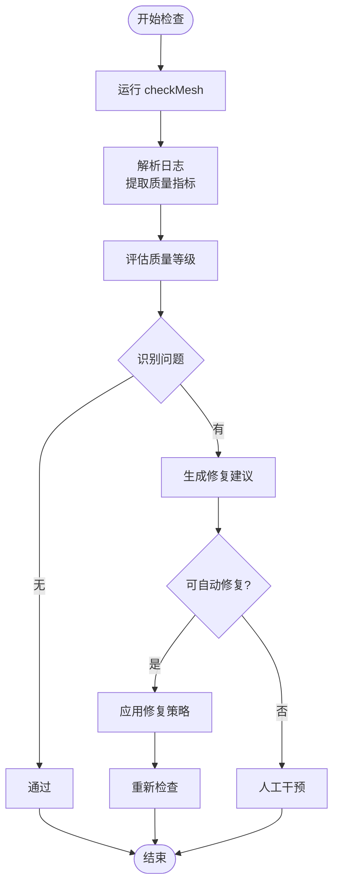

**图表来源**
- [mesh_quality_agent.py:111-177](file://openfoam_ai/agents/mesh_quality_agent.py#L111-L177)
- [openfoam_runner.py:87-97](file://openfoam_ai/core/openfoam_runner.py#L87-L97)

**章节来源**
- [mesh_quality_agent.py:84-453](file://openfoam_ai/agents/mesh_quality_agent.py#L84-L453)
- [system_constitution.yaml:13-31](file://openfoam_ai/config/system_constitution.yaml#L13-L31)

### PhysicsValidationAgent 分析
- 职责：后处理阶段的物理验证，包括质量守恒、能量守恒、收敛性、边界兼容性、y+ 检查
- 数据提取：从 OpenFOAM 日志与结果中提取流量、残差、y+ 等数据
- 报告生成：生成结构化验证报告，标注关键问题

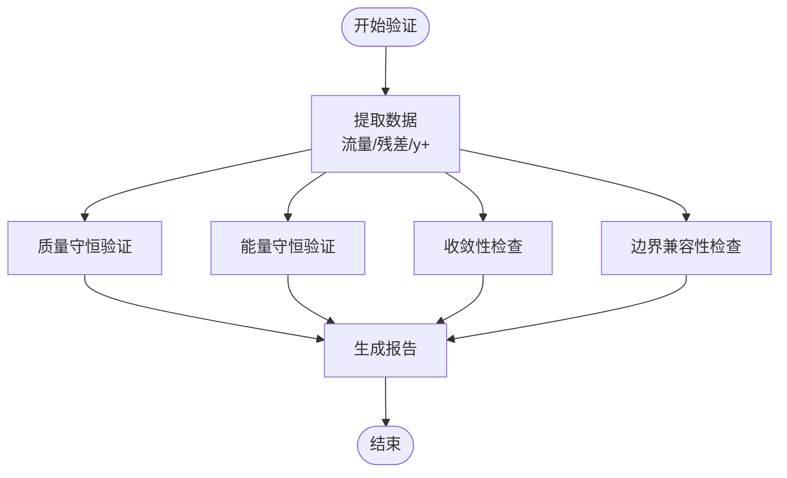

**图表来源**
- [physics_validation_agent.py:197-478](file://openfoam_ai/agents/physics_validation_agent.py#L197-L478)

**章节来源**
- [physics_validation_agent.py:174-478](file://openfoam_ai/agents/physics_validation_agent.py#L174-L478)

### SelfHealingAgent 分析
- 职责：求解稳定性监控、发散检测、自动修复、从上次时间步重启
- 监控器：实时解析求解器日志，检测库朗数、残差爆炸/停滞、收敛状态
- 自愈控制器：根据发散类型选择修复策略（减小时间步、减小松弛因子、增加非正交修正器）
- 智能求解器运行器：集成监控与自愈，支持多次重启与恢复

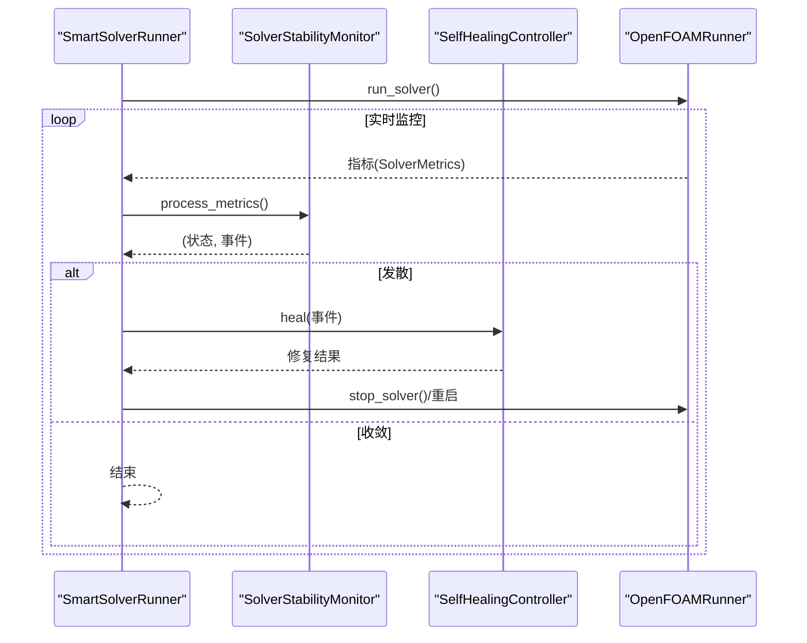

**图表来源**
- [self_healing_agent.py:479-614](file://openfoam_ai/agents/self_healing_agent.py#L479-L614)
- [openfoam_runner.py:99-198](file://openfoam_ai/core/openfoam_runner.py#L99-L198)

**章节来源**
- [self_healing_agent.py:58-614](file://openfoam_ai/agents/self_healing_agent.py#L58-L614)

### CaseManager 分析
- 职责：创建/复制/清理/删除算例；维护 .case_info.json；标准化目录结构（0/, constant/, system/, logs/）
- 便捷函数：create_cavity_case() 一键创建标准方腔驱动流算例

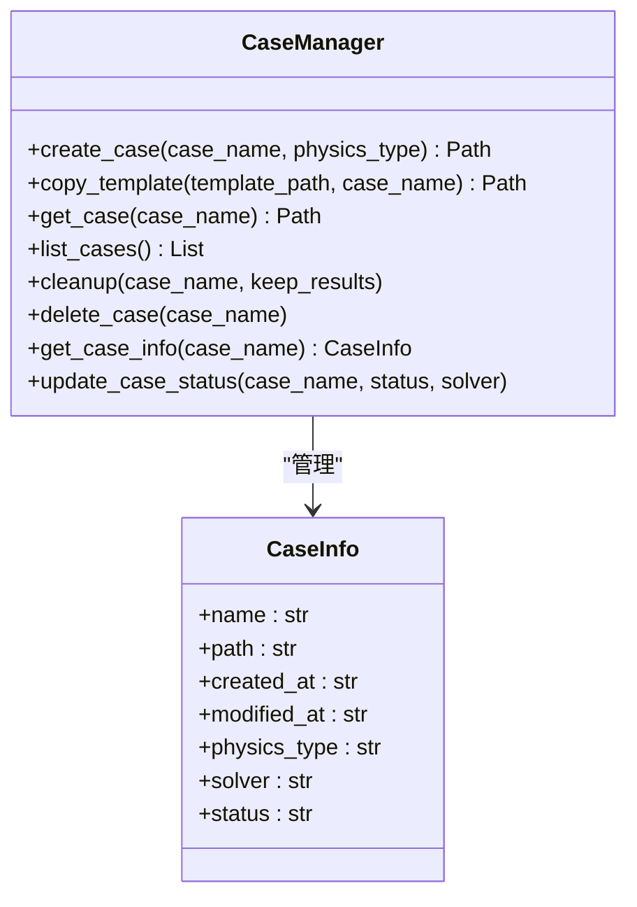

**图表来源**
- [case_manager.py:15-261](file://openfoam_ai/core/case_manager.py#L15-L261)

**章节来源**
- [case_manager.py:51-241](file://openfoam_ai/core/case_manager.py#L51-L241)

### OpenFOAMRunner 分析
- 职责：封装 blockMesh/checkMesh/求解器命令；实时日志解析；状态检测（收敛/发散/停滞/完成/错误）
- 监控器：SolverMonitor 持续监控残差与停滞，生成摘要

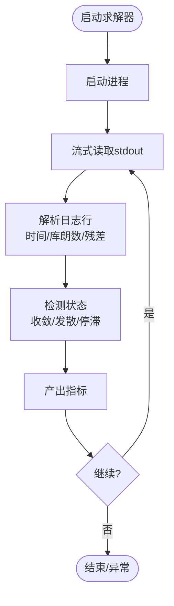

**图表来源**
- [openfoam_runner.py:99-198](file://openfoam_ai/core/openfoam_runner.py#L99-L198)
- [openfoam_runner.py:429-516](file://openfoam_ai/core/openfoam_runner.py#L429-L516)

**章节来源**
- [openfoam_runner.py:55-516](file://openfoam_ai/core/openfoam_runner.py#L55-L516)

### Validators 分析
- 职责：基于 Pydantic 的硬约束验证，集成宪法规则（Mesh_Standards、Solver_Standards、Prohibited_Combinations 等）
- 验证模型：MeshConfig、SolverConfig、BoundaryCondition、SimulationConfig
- 物理验证器：后处理阶段的质量守恒、能量守恒、边界兼容性检查

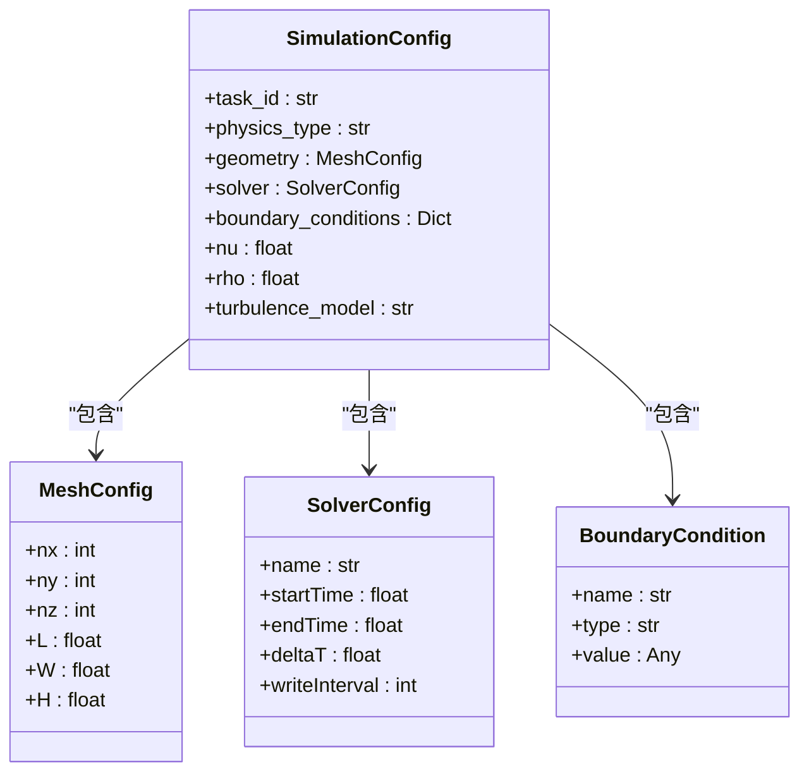

**图表来源**
- [validators.py:18-274](file://openfoam_ai/core/validators.py#L18-L274)

**章节来源**
- [validators.py:13-441](file://openfoam_ai/core/validators.py#L13-L441)
- [system_constitution.yaml:13-64](file://openfoam_ai/config/system_constitution.yaml#L13-L64)

### MemoryManager 分析
- 职责：向量数据库存储与检索、增量修改（Diff）、会话历史管理
- 模式：ChromaDB 模式与模拟模式（无依赖时自动回退）
- 功能：相似性检索、标签过滤、导出/导入、回滚到指定版本

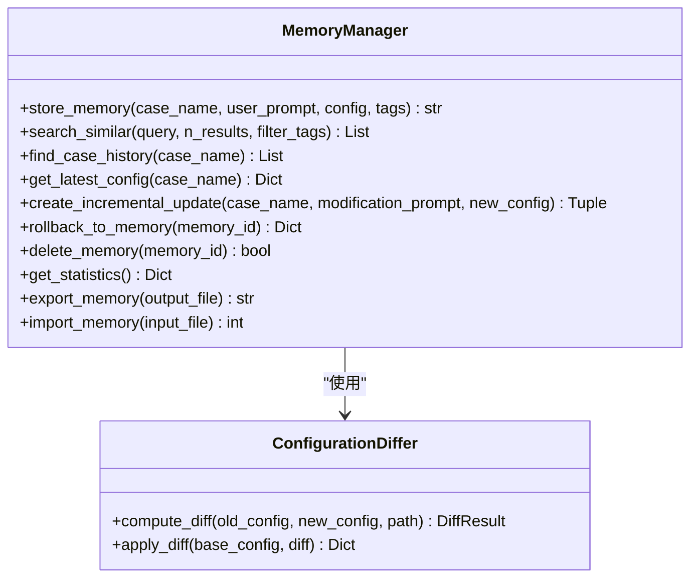

**图表来源**
- [memory_manager.py:198-687](file://openfoam_ai/memory/memory_manager.py#L198-L687)

**章节来源**
- [memory_manager.py:198-804](file://openfoam_ai/memory/memory_manager.py#L198-L804)

## 依赖关系分析
- 外部依赖：langchain、openai、PyFoam、pyvista、chromadb、faiss、numpy、matplotlib、pytest、black、mypy 等
- 关键耦合点：ManagerAgent 直接实例化多个子组件，建议通过依赖注入提升可测试性
- 配置分散：宪法规则、验证规则、默认值分布在多个文件中，建议统一配置管理类

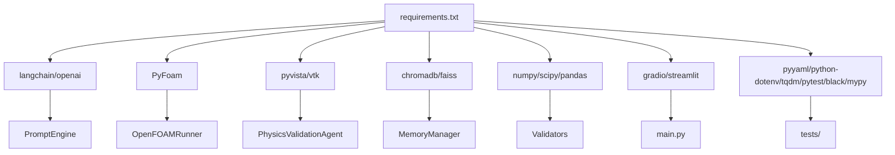

**图表来源**
- [requirements.txt:1-40](file://openfoam_ai/requirements.txt#L1-L40)
- [main.py:11-22](file://openfoam_ai/main.py#L11-L22)

**章节来源**
- [requirements.txt:1-40](file://openfoam_ai/requirements.txt#L1-L40)
- [architecture_review.md:173-205](file://plans/architecture_review.md#L173-L205)

## 性能考虑
- I/O 与日志：求解器日志流式读取，避免一次性加载大文件；建议使用缓冲与异步写入
- 内存管理：避免在监控器中保存过长的历史指标；合理设置最大历史长度
- 并发处理：当前同步阻塞操作较多，建议将耗时操作（如 LLM 调用、向量计算）改为异步或后台线程
- 网格与求解：根据宪法阈值自动调整时间步长与松弛因子，减少无效重算
- 向量检索：在 ChromaDB 可用时启用，模拟模式下使用余弦相似度近似，注意维度与归一化

[本节为通用指导，无需特定文件引用]

## 故障排除指南
- 环境问题
  - OpenFOAM 未安装或 PATH 未设置：运行 blockMesh -help 检测，必要时使用 Docker
  - Python 编码问题：Windows 控制台默认编码为 GBK，设置环境变量 PYTHONIOENCODING=utf-8
- 依赖问题
  - 缺少 openai：安装 openai 或使用 Mock 模式（设置 api_key=None）
  - PyFoam 版本与 OpenFOAM 不兼容：检查版本匹配
- 配置问题
  - Pydantic 验证失败：检查配置参数是否符合宪法规则（system_constitution.yaml）
  - 网格质量不通过：使用 MeshQualityAgent 的自动修复建议或人工调整
- 运行问题
  - 求解器异常：检查 SolverMonitor 输出的日志与状态，必要时启用 SelfHealingAgent
  - 收敛性差：调整松弛因子、网格密度或时间步长

**章节来源**
- [README.md:208-237](file://openfoam_ai/README.md#L208-L237)
- [openfoam_runner.py:118-142](file://openfoam_ai/core/openfoam_runner.py#L118-L142)
- [validators.py:389-411](file://openfoam_ai/core/validators.py#L389-L411)

## 结论
OpenFOAM AI 项目架构清晰、模块职责明确，通过宪法驱动与多智能体对抗框架实现了较强的防御性与可扩展性。建议优先解决技术债务（依赖注入、配置集中化、大型函数拆分），并逐步构建插件生态与异步执行能力，以提升系统的可维护性与用户体验。

[本节为总结性内容，无需特定文件引用]

## 附录

### 开发环境搭建与 IDE 配置
- Python 3.10+，建议使用虚拟环境隔离依赖
- 安装依赖：pip install -r requirements.txt
- Docker（可选）：docker-compose -f docker/docker-compose.yml up -d
- IDE 建议：VSCode/PyCharm，启用类型提示与断点调试；配置 pytest 运行单元测试
- LLM 配置：设置 OPENAI_API_KEY 环境变量；Mock 模式下无需 API Key

**章节来源**
- [README.md:19-37](file://openfoam_ai/README.md#L19-L37)
- [requirements.txt:1-40](file://openfoam_ai/requirements.txt#L1-L40)

### 代码规范与注释标准
- 类型提示：广泛使用，保持一致的类型注解风格
- 文档字符串：模块、类、方法均提供中文文档字符串
- 命名规范：类名使用 PascalCase，函数/变量使用 snake_case
- 错误处理：捕获并记录异常，避免静默失败；对外暴露明确的错误信息
- 日志：使用结构化日志，区分 INFO/WARNING/ERROR 级别

**章节来源**
- [architecture_review.md:136-145](file://plans/architecture_review.md#L136-L145)

### 扩展开发与插件开发指南
- 插件接口建议：定义抽象基类（如 IPhysicsModel、ISolver），通过 entry_points 或配置文件注册
- 插件发现机制：支持动态加载与热重载，避免硬编码耦合
- 配置模板：为社区贡献者提供标准插件模板，降低接入成本
- 测试策略：为插件提供 Mock 实现，完善集成测试与覆盖率报告

**章节来源**
- [architecture_review.md:89-98](file://plans/architecture_review.md#L89-L98)
- [architecture_review.md:206-224](file://plans/architecture_review.md#L206-L224)

### 第三方库集成策略
- LLM 框架：langchain + openai，支持多模型适配（计划中）
- 向量数据库：chromadb 为主，faiss 为备选；无依赖时回退模拟模式
- 科学计算：numpy/scipy/pandas/matplotlib
- 可视化：pyvista/vtk
- Web UI：gradio/streamlit
- 工具库：pyyaml/python-dotenv/tqdm/pytest/black/mypy

**章节来源**
- [requirements.txt:4-39](file://openfoam_ai/requirements.txt#L4-L39)
- [memory_manager.py:22-29](file://openfoam_ai/memory/memory_manager.py#L22-L29)

### 新功能集成流程
- 需求评审：对照宪法与现有模块职责，避免重复与冲突
- 设计文档：定义接口、数据结构与交互协议
- 实现与测试：遵循类型提示与文档字符串，提供单元测试与集成测试
- 代码审查：关注可测试性、可维护性与性能
- 质量保证：运行 pytest，生成覆盖率报告，检查日志与错误处理

**章节来源**
- [architecture_review.md:147-171](file://plans/architecture_review.md#L147-L171)

### 代码审查标准与质量保证
- 可测试性：优先使用依赖注入，避免全局状态；为关键模块提供 Mock
- 可读性：拆分大型函数，减少魔法数字；统一命名与注释风格
- 安全性：严格输入验证与异常处理；避免硬编码阈值
- 性能：避免不必要的 I/O 与内存分配；使用异步与缓存

**章节来源**
- [architecture_review.md:100-146](file://plans/architecture_review.md#L100-L146)

### 性能优化技巧与内存管理最佳实践
- 日志流式处理：避免一次性读取大文件，使用迭代器逐行处理
- 指标历史：限制最大历史长度，定期清理过期数据
- 向量检索：在可用时启用 ChromaDB，模拟模式下注意维度与归一化
- 并发模式：将 LLM 调用与向量计算放入后台线程或异步队列
- 内存泄漏防护：及时关闭文件句柄与进程句柄，避免循环引用

**章节来源**
- [openfoam_runner.py:146-177](file://openfoam_ai/core/openfoam_runner.py#L146-L177)
- [memory_manager.py:256-284](file://openfoam_ai/memory/memory_manager.py#L256-L284)

### SelfHealingAgent、PhysicsValidationAgent、MeshQualityAgent 开发指南
- SelfHealingAgent
  - 监控策略：库朗数阈值、残差爆炸/停滞检测、收敛判定
  - 修复策略：减小时间步、减小松弛因子、增加非正交修正器
  - 重启机制：从 latestTime 重启，限制最大尝试次数
- PhysicsValidationAgent
  - 数据提取：从日志与结果中提取流量、残差、y+
  - 验证指标：质量守恒、能量守恒、收敛性、边界兼容性
  - 报告生成：结构化报告，标注关键问题与建议
- MeshQualityAgent
  - 质量评估：非正交性、偏斜度、长宽比、失败检查数
  - 修复建议：基于宪法阈值生成建议，支持自动修复（非正交性）
  - 交互提示：根据质量等级生成交互式提示，支持自动修复确认

**章节来源**
- [self_healing_agent.py:58-614](file://openfoam_ai/agents/self_healing_agent.py#L58-L614)
- [physics_validation_agent.py:174-478](file://openfoam_ai/agents/physics_validation_agent.py#L174-L478)
- [mesh_quality_agent.py:61-453](file://openfoam_ai/agents/mesh_quality_agent.py#L61-L453)

### 贡献者开发流程与技术指导
- Fork 仓库，创建特性分支，提交更改并推送
- 编写单元测试与集成测试，确保覆盖率与稳定性
- 使用 black/mypy 进行代码风格与类型检查
- 提交 Pull Request，等待审查与合并

**章节来源**
- [README.md:262-270](file://openfoam_ai/README.md#L262-L270)