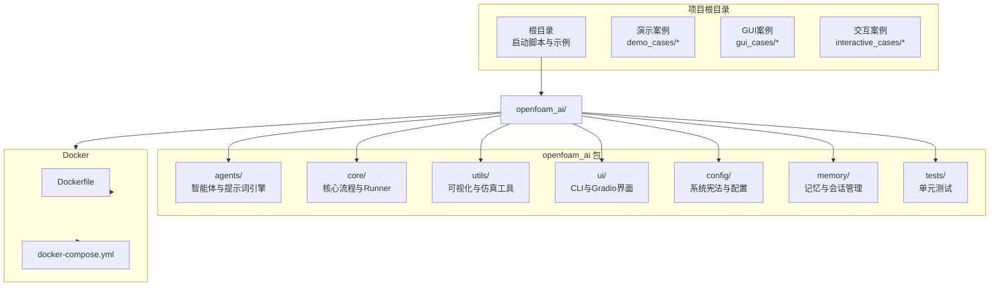
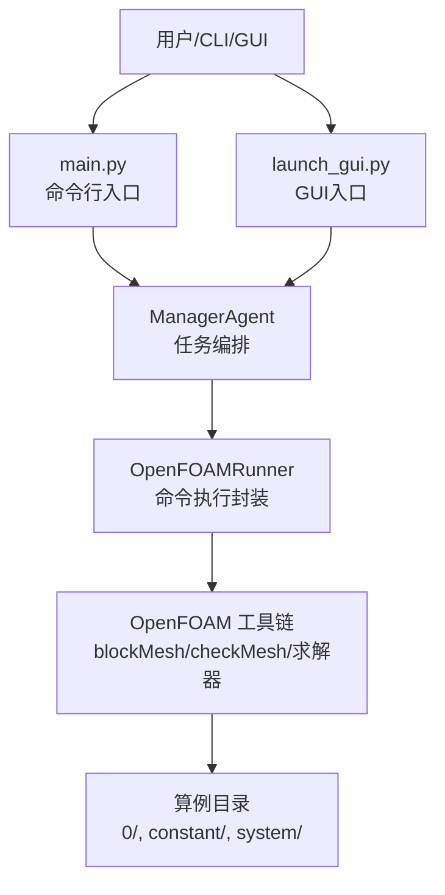
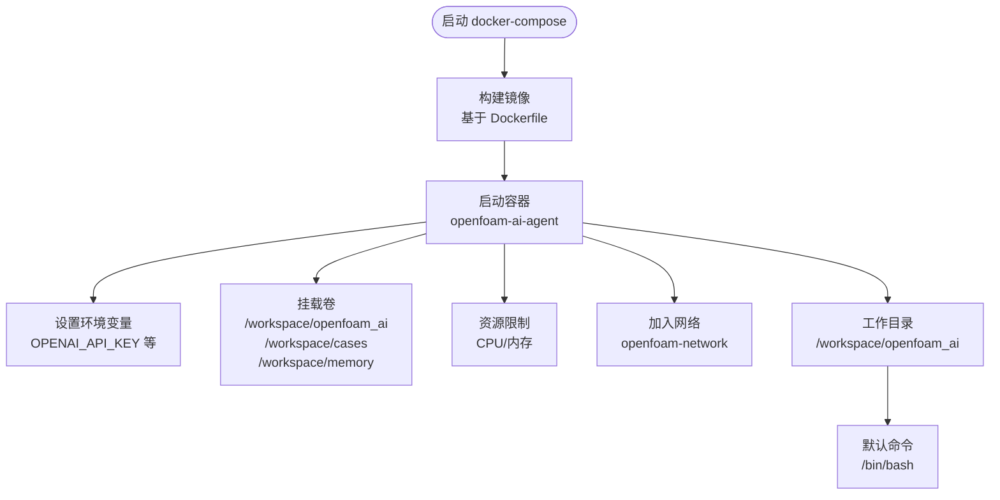
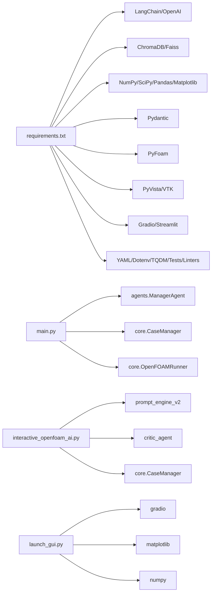
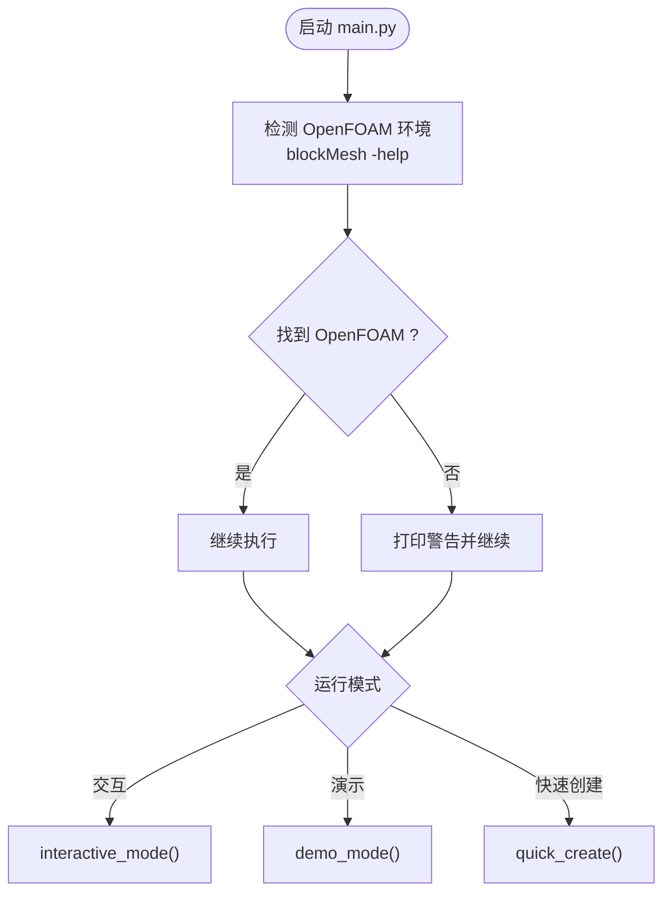
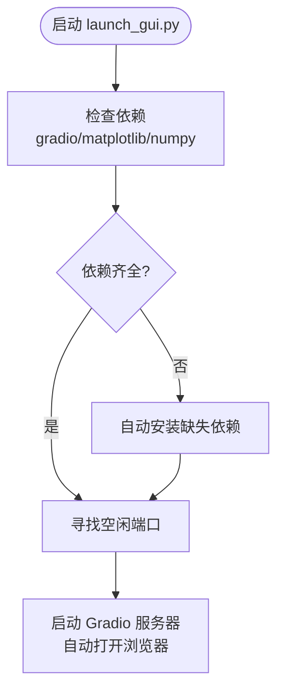

# 开发环境搭建

<cite>
**本文引用的文件**
- [requirements.txt](file://openfoam_ai/requirements.txt)
- [Dockerfile](file://openfoam_ai/docker/Dockerfile)
- [docker-compose.yml](file://openfoam_ai/docker/docker-compose.yml)
- [README.md](file://openfoam_ai/README.md)
- [system_constitution.yaml](file://openfoam_ai/config/system_constitution.yaml)
- [main.py](file://openfoam_ai/main.py)
- [interactive_openfoam_ai.py](file://interactive_openfoam_ai.py)
- [launch_gui.py](file://launch_gui.py)
- [start.bat](file://start.bat)
- [start_gui.bat](file://start_gui.bat)
- [clean.py](file://clean.py)
- [quick_start.py](file://quick_start.py)
- [GUI使用指南.md](file://GUI使用指南.md)
</cite>

## 目录
1. [简介](#简介)
2. [项目结构](#项目结构)
3. [核心组件](#核心组件)
4. [架构总览](#架构总览)
5. [详细组件分析](#详细组件分析)
6. [依赖关系分析](#依赖关系分析)
7. [性能考虑](#性能考虑)
8. [故障排除指南](#故障排除指南)
9. [结论](#结论)
10. [附录](#附录)

## 简介
本指南面向希望在本地或容器环境中搭建 OpenFOAM AI 项目的开发者，覆盖 Python 3.10+ 的安装与兼容性、核心依赖库安装、Docker 容器化部署、虚拟环境创建与依赖安装、环境变量配置、OpenFOAM 求解器本地安装与环境配置，以及针对 Windows、Linux、macOS 的差异化安装指导。同时提供常见安装问题的排查方法与解决方案。

## 项目结构
项目采用“核心模块 + 工具与UI + 配置 + Docker”分层组织，核心逻辑集中在 openfoam_ai 包内，Docker 相关配置位于 docker 子目录，示例与演示位于根目录脚本中。

图表来源
- [README.md:130-150](file://openfoam_ai/README.md#L130-L150)
- [Dockerfile:1-52](file://openfoam_ai/docker/Dockerfile#L1-L52)
- [docker-compose.yml:1-46](file://openfoam_ai/docker/docker-compose.yml#L1-L46)

章节来源
- [README.md:130-150](file://openfoam_ai/README.md#L130-L150)

## 核心组件
- Python 与依赖
  - Python 3.10+ 是最低要求，依赖清单由 requirements.txt 统一管理，涵盖 LLM 框架、向量数据库、科学计算、数据验证、OpenFOAM 接口、后处理、Web UI 与开发工具。
- OpenFOAM 集成
  - 通过 PyFoam 与命令行工具（blockMesh、checkMesh、icoFoam 等）集成，核心执行封装在 Runner 中。
- LLM 适配
  - 支持多 Provider 的 API Key 环境变量，若未配置则进入 Mock 模式；GUI 与交互模式均具备相应入口。
- Docker 容器
  - 基于 OpenFOAM Foundation 版本镜像，内置 Python 3.10、pip、venv 与构建工具，并预装项目依赖。

章节来源
- [requirements.txt:1-40](file://openfoam_ai/requirements.txt#L1-L40)
- [README.md:19-37](file://openfoam_ai/README.md#L19-L37)
- [Dockerfile:4-26](file://openfoam_ai/docker/Dockerfile#L4-L26)
- [main.py:230-238](file://openfoam_ai/main.py#L230-L238)

## 架构总览
下图展示从用户交互到 OpenFOAM 求解器执行的整体流程，以及容器化部署时的卷挂载与资源限制。

图表来源
- [main.py:19-22](file://openfoam_ai/main.py#L19-L22)
- [launch_gui.py:78-89](file://launch_gui.py#L78-L89)

章节来源
- [README.md:104-128](file://openfoam_ai/README.md#L104-L128)
- [main.py:19-247](file://openfoam_ai/main.py#L19-L247)
- [launch_gui.py:56-94](file://launch_gui.py#L56-L94)

## 详细组件分析

### Python 与依赖安装（Python 3.10+）
- 版本要求
  - 项目明确要求 Python 3.10+，容器镜像中使用 Python 3.10 并设为默认。
- 依赖安装
  - 使用 requirements.txt 一次性安装全部依赖，包含 LangChain、OpenAI、PyFoam、PyVista、Gradio、Faiss、NumPy、Matplotlib 等。
- 环境变量
  - Docker Compose 中设置了 OPENAI_API_KEY 等环境变量，可在宿主机侧通过 .env 文件注入。

章节来源
- [requirements.txt:2](file://openfoam_ai/requirements.txt#L2)
- [Dockerfile:21-23](file://openfoam_ai/docker/Dockerfile#L21-L23)
- [docker-compose.yml:12-14](file://openfoam_ai/docker/docker-compose.yml#L12-L14)

### Docker 容器化部署
- 镜像基础
  - 基于 OpenFOAM Foundation 的官方镜像，确保 OpenFOAM 工具链可用。
- 系统依赖与 Python
  - 安装 python3.10、pip、venv、build-essential、git、wget、curl、vim 等。
- 依赖安装与工作目录
  - 复制 requirements.txt 并安装；复制项目代码；设置 PYTHONPATH、PATH、OpenFOAM 用户二进制目录等环境变量。
- Compose 配置
  - 容器名称、环境变量、卷映射（项目代码、算例目录、内存目录）、工作目录、资源限制、网络桥接等。

图表来源
- [Dockerfile:4-52](file://openfoam_ai/docker/Dockerfile#L4-L52)
- [docker-compose.yml:3-46](file://openfoam_ai/docker/docker-compose.yml#L3-L46)

章节来源
- [Dockerfile:1-52](file://openfoam_ai/docker/Dockerfile#L1-L52)
- [docker-compose.yml:1-46](file://openfoam_ai/docker/docker-compose.yml#L1-L46)

### 虚拟环境与依赖安装（本地开发）
- Windows
  - 使用 start.bat 激活 .venv\Scripts\activate.bat 后运行交互脚本。
  - GUI 启动通过 start_gui.bat 激活虚拟环境并调用 launch_gui.py。
- Linux/macOS
  - 建议使用 python3.10-venv 创建虚拟环境，pip 安装 requirements.txt。
  - 若需 GUI，确保 matplotlib、numpy 可用，或通过 launch_gui.py 自动安装缺失依赖。

章节来源
- [start.bat:7-14](file://start.bat#L7-L14)
- [start_gui.bat:6-18](file://start_gui.bat#L6-L18)
- [launch_gui.py:17-45](file://launch_gui.py#L17-L45)

### 环境变量配置
- LLM Provider 与 API Key
  - 支持多种 Provider 的 API Key 环境变量，quick_start.py 会自动检测并优先使用 DEFAULT_LLM_PROVIDER 指定的 Provider。
  - 若未配置，程序会回退到 Mock 模式。
- Docker 环境变量
  - docker-compose.yml 中显式设置了 OPENAI_API_KEY，可通过宿主机环境变量或 .env 注入。

章节来源
- [quick_start.py:17-42](file://quick_start.py#L17-L42)
- [quick_start.py:98-101](file://quick_start.py#L98-L101)
- [docker-compose.yml:12-14](file://openfoam_ai/docker/docker-compose.yml#L12-L14)

### OpenFOAM 求解器本地安装与环境配置
- 版本要求
  - README 明确要求 OpenFOAM（Foundation v11 或 ESI v2312）。
- 环境检测
  - main.py 在启动时尝试调用 blockMesh -help 进行环境检测，未检测到时给出警告。
- 容器内运行
  - Dockerfile 基于 OpenFOAM 官方镜像，容器内已具备 blockMesh、checkMesh、求解器等工具。

章节来源
- [README.md:21-23](file://openfoam_ai/README.md#L21-L23)
- [main.py:230-238](file://openfoam_ai/main.py#L230-L238)
- [Dockerfile:4](file://openfoam_ai/docker/Dockerfile#L4)

### 不同操作系统（Windows、Linux、macOS）安装指导
- Windows
  - 使用 start.bat 与 start_gui.bat 快速启动交互与 GUI。
  - 若出现 Unicode 编码问题，可设置环境变量 PYTHONIOENCODING=utf-8。
- Linux/macOS
  - 建议使用 Python 3.10+ 虚拟环境，pip 安装 requirements.txt。
  - GUI 启动依赖 matplotlib、numpy，若缺失将提示安装。

章节来源
- [start.bat:1-16](file://start.bat#L1-L16)
- [start_gui.bat:1-21](file://start_gui.bat#L1-L21)
- [README.md:228-230](file://openfoam_ai/README.md#L228-L230)
- [launch_gui.py:17-45](file://launch_gui.py#L17-L45)

## 依赖关系分析
- Python 与第三方库
  - LLM：langchain、langchain-openai、openai
  - 向量数据库：chromadb、faiss-cpu
  - 科学计算：numpy、scipy、pandas、matplotlib
  - 数据验证：pydantic
  - OpenFOAM 接口：PyFoam
  - 后处理：pyvista、vtk
  - Web UI：gradio、streamlit
  - 工具：pyyaml、python-dotenv、tqdm、pytest、black、mypy
- 内部模块耦合
  - main.py 依赖 agents.ManagerAgent 与 core.CaseManager、OpenFOAMRunner。
  - interactive_openfoam_ai.py 依赖 prompt_engine_v2、critic_agent、case_manager。
  - launch_gui.py 依赖 gradio、matplotlib、numpy，并动态导入 GUI 界面。

图表来源
- [requirements.txt:4-39](file://openfoam_ai/requirements.txt#L4-L39)
- [main.py:19-22](file://openfoam_ai/main.py#L19-L22)
- [interactive_openfoam_ai.py:33-36](file://interactive_openfoam_ai.py#L33-L36)
- [launch_gui.py:22-43](file://launch_gui.py#L22-L43)

章节来源
- [requirements.txt:1-40](file://openfoam_ai/requirements.txt#L1-L40)
- [main.py:19-247](file://openfoam_ai/main.py#L19-L247)
- [interactive_openfoam_ai.py:40-50](file://interactive_openfoam_ai.py#L40-L50)
- [launch_gui.py:56-94](file://launch_gui.py#L56-L94)

## 性能考虑
- 资源限制
  - docker-compose.yml 对 CPU 与内存设置了上限与预留，避免资源争用。
- 网络与卷
  - 通过卷映射将项目代码与算例、内存目录持久化，便于调试与复现。
- Python 与 OpenFOAM
  - 在容器内运行可减少本地环境差异带来的性能波动；复杂算例建议在容器中进行，避免本地依赖不一致。

章节来源
- [docker-compose.yml:29-41](file://openfoam_ai/docker/docker-compose.yml#L29-L41)

## 故障排除指南
- 常见错误与解决
  - SyntaxError: source code string cannot contain null bytes
    - 原因：文件包含空字节或 UTF-16 BOM。
    - 解决：运行 clean.py 清理或手动转换为 UTF-8。
  - ModuleNotFoundError: No module named 'openai'
    - 原因：未安装 openai 包。
    - 解决：pip 安装 openai，或使用 Mock 模式（设置 api_key=None）。
  - FileNotFoundError: [Errno 2] No such file or directory: 'blockMesh'
    - 原因：OpenFOAM 环境未正确加载或 PATH 未设置。
    - 解决：确保 OpenFOAM 已安装并在终端可直接运行 blockMesh，或在容器内运行。
  - PydanticValidationError
    - 原因：配置不符合 system_constitution.yaml 中的规则。
    - 解决：检查配置参数是否符合宪法约束。
  - UnicodeEncodeError: 'gbk' codec can't encode character ...
    - 原因：Windows 控制台默认编码为 GBK。
    - 解决：忽略该错误或设置环境变量 PYTHONIOENCODING=utf-8。
- 调试建议
  - 启用详细日志：设置 LOG_LEVEL=DEBUG。
  - 使用 Mock 模式测试配置生成：PromptEngine(api_key=None)。
  - 运行单元测试：pytest openfoam_ai/tests/。
  - 检查算例目录结构：确保 0/、constant/、system/ 目录存在。

章节来源
- [README.md:210-237](file://openfoam_ai/README.md#L210-L237)
- [clean.py:4-31](file://clean.py#L4-L31)
- [system_constitution.yaml:1-103](file://openfoam_ai/config/system_constitution.yaml#L1-L103)

## 结论
通过本指南，您可以在 Windows、Linux、macOS 上完成 OpenFOAM AI 的开发环境搭建，选择本地虚拟环境或 Docker 容器两种方式。Docker 方案可显著降低环境差异带来的问题，并提供统一的资源与卷管理。结合 requirements.txt 与 system_constitution.yaml，可确保依赖与配置的合规性与可重复性。

## 附录

### A. 依赖安装清单（按类别）
- LLM 框架与 API
  - langchain>=0.1.0、langchain-openai>=0.0.5、openai>=1.0.0
- 向量数据库
  - chromadb>=0.4.0、faiss-cpu>=1.7.4
- 科学计算
  - numpy>=1.24.0、scipy>=1.10.0、pandas>=2.0.0、matplotlib>=3.7.0
- 数据验证
  - pydantic>=2.0.0
- OpenFOAM 接口
  - PyFoam>=2023.1
- 后处理
  - pyvista>=0.43.0、vtk>=9.3.0
- Web UI
  - gradio>=4.0.0、streamlit>=1.28.0
- 其他工具
  - pyyaml>=6.0.1、python-dotenv>=1.0.0、tqdm>=4.66.0、pytest>=7.4.0、black>=23.0.0、mypy>=1.5.0

章节来源
- [requirements.txt:4-39](file://openfoam_ai/requirements.txt#L4-L39)

### B. Docker Compose 关键配置说明
- 服务与镜像
  - 基于 Dockerfile 构建 openfoam-ai:latest，容器名为 openfoam-ai-agent。
- 环境变量
  - OPENAI_API_KEY：用于 LLM 访问；PYTHONUNBUFFERED=1 便于日志输出。
- 卷映射
  - 项目代码、算例目录、内存目录分别映射到 /workspace/openfoam_ai、/workspace/cases、/workspace/memory。
- 工作目录与默认命令
  - 工作目录 /workspace/openfoam_ai；默认命令 /bin/bash。
- 资源限制
  - CPU 与内存上限与预留，避免资源争用。
- 网络
  - 加入 openfoam-network 桥接网络。

章节来源
- [docker-compose.yml:3-46](file://openfoam_ai/docker/docker-compose.yml#L3-L46)

### C. OpenFOAM 环境检测与运行流程

图表来源
- [main.py:230-247](file://openfoam_ai/main.py#L230-L247)

### D. GUI 启动与依赖检查流程

图表来源
- [launch_gui.py:17-45](file://launch_gui.py#L17-L45)
- [launch_gui.py:56-94](file://launch_gui.py#L56-L94)