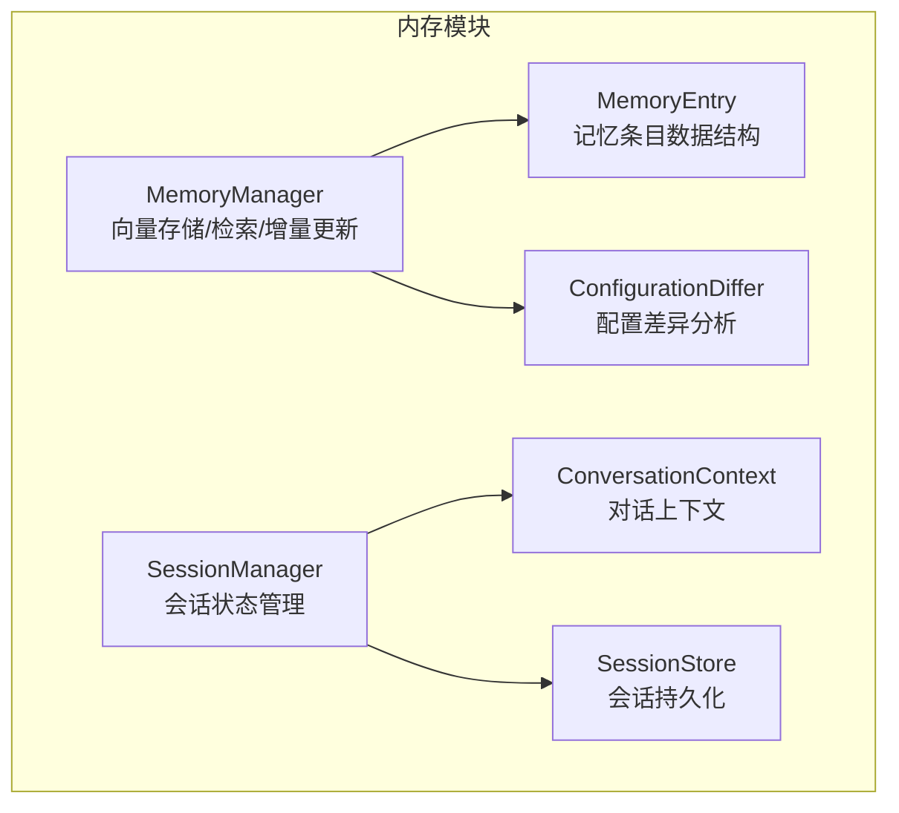
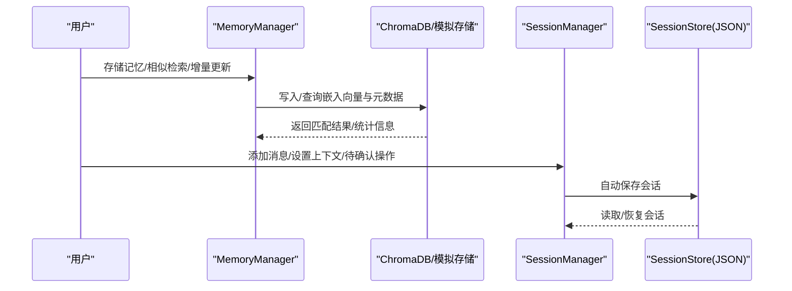
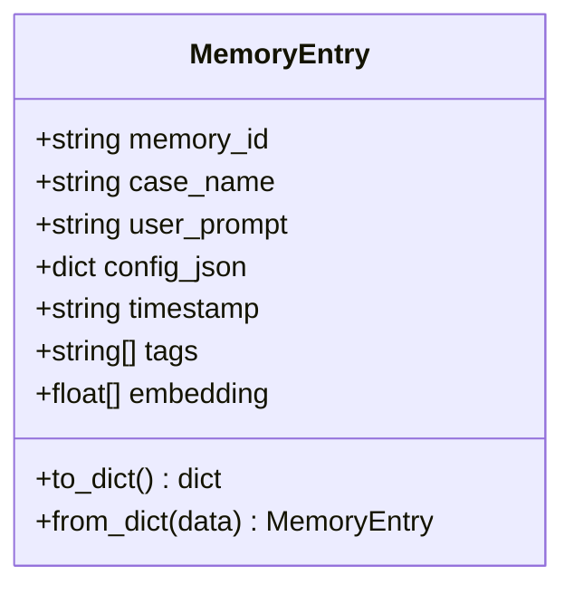
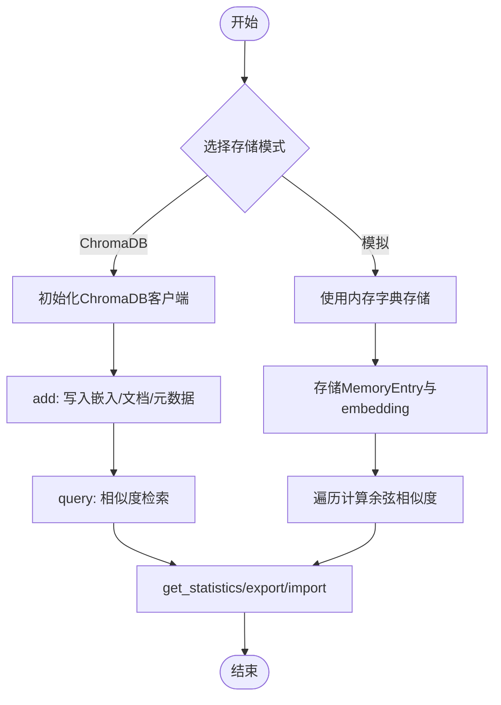
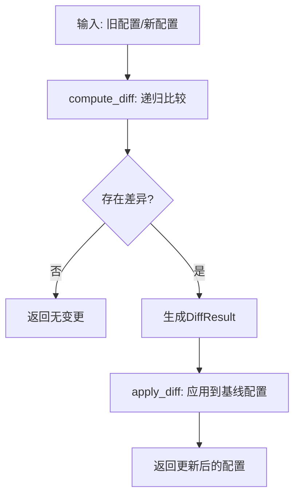
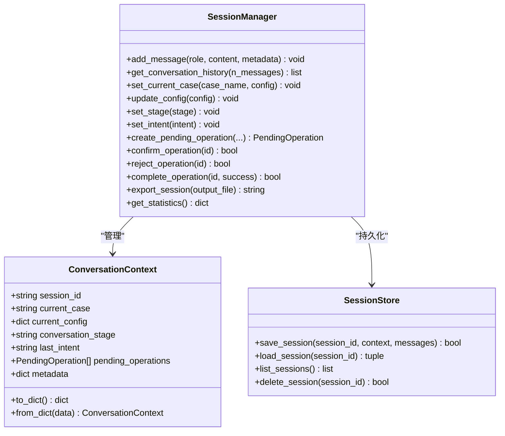
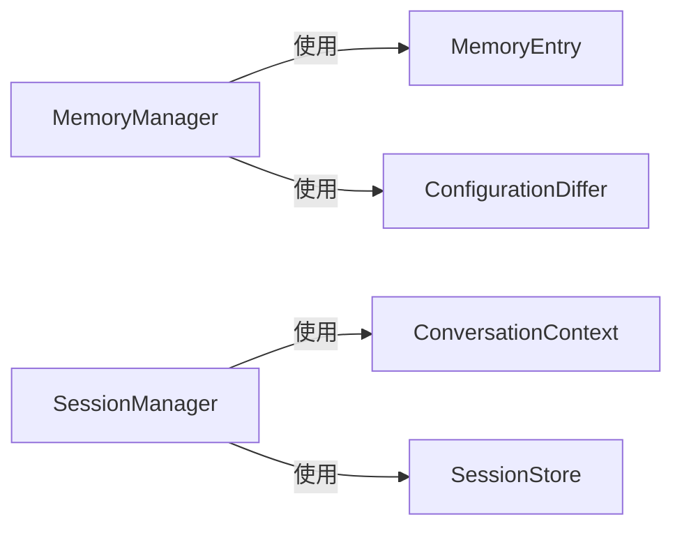

# 内存管理优化

<cite>
**本文引用的文件**
- [memory_manager.py](file://openfoam_ai/memory/memory_manager.py)
- [session_manager.py](file://openfoam_ai/memory/session_manager.py)
- [__init__.py](file://openfoam_ai/memory/__init__.py)
- [main_phase3.py](file://openfoam_ai/main_phase3.py)
- [demo_features.py](file://openfoam_ai/demo_features.py)
- [test_phase3.py](file://openfoam_ai/tests/test_phase3.py)
</cite>

## 目录
1. [引言](#引言)
2. [项目结构](#项目结构)
3. [核心组件](#核心组件)
4. [架构总览](#架构总览)
5. [详细组件分析](#详细组件分析)
6. [依赖分析](#依赖分析)
7. [性能考量](#性能考量)
8. [故障排查指南](#故障排查指南)
9. [结论](#结论)
10. [附录](#附录)

## 引言
本指南聚焦于OpenFOAM AI项目中的内存管理优化，围绕向量数据库存储（ChromaDB与模拟模式）、嵌入向量内存占用控制与垃圾回收、MemoryEntry数据结构的内存优化设计、SessionManager的会话状态管理优化、内存使用监控与工具、大规模算例存储策略以及不同硬件配置下的优化建议展开。目标是在保证功能完备的前提下，显著降低内存占用、提升检索与存储效率，并确保在资源受限环境下的稳定性。

## 项目结构
本次文档关注的内存相关模块位于openfoam_ai/memory目录，包含记忆管理与会话管理两大子模块：
- memory_manager.py：实现MemoryManager与MemoryEntry、DiffResult、ConfigurationDiffer等，负责向量数据库存储、相似性检索、增量更新与导出导入。
- session_manager.py：实现SessionManager、ConversationContext、SessionStore等，负责多轮对话上下文、待确认操作与持久化。

图表来源
- [memory_manager.py:198-803](file://openfoam_ai/memory/memory_manager.py#L198-L803)
- [session_manager.py:171-565](file://openfoam_ai/memory/session_manager.py#L171-L565)

章节来源
- [memory_manager.py:1-120](file://openfoam_ai/memory/memory_manager.py#L1-L120)
- [session_manager.py:1-100](file://openfoam_ai/memory/session_manager.py#L1-L100)

## 核心组件
- MemoryEntry：记忆条目数据结构，包含memory_id、case_name、user_prompt、config_json、timestamp、tags、embedding等字段，提供to_dict/from_dict序列化接口。
- MemoryManager：统一管理向量数据库（ChromaDB或模拟模式），支持存储、相似性检索、增量更新、历史查询、统计与导入导出。
- ConfigurationDiffer：实现配置差异分析与应用，支持嵌套字典的增删改路径追踪与回放。
- SessionManager：维护多轮对话上下文、当前算例、意图、待确认操作队列，并提供自动/手动保存与导出。
- SessionStore：负责会话数据的JSON文件持久化，避免频繁写盘带来的IO压力。

章节来源
- [memory_manager.py:32-51](file://openfoam_ai/memory/memory_manager.py#L32-L51)
- [memory_manager.py:198-803](file://openfoam_ai/memory/memory_manager.py#L198-L803)
- [session_manager.py:171-565](file://openfoam_ai/memory/session_manager.py#L171-L565)

## 架构总览
下图展示MemoryManager与SessionManager在系统中的交互关系及数据流向：

图表来源
- [memory_manager.py:243-284](file://openfoam_ai/memory/memory_manager.py#L243-L284)
- [session_manager.py:108-169](file://openfoam_ai/memory/session_manager.py#L108-L169)

## 详细组件分析

### MemoryEntry数据结构的内存优化设计
- 字段压缩与序列化优化
  - 使用dataclass减少字典键开销，提供to_dict/from_dict以兼容JSON序列化。
  - config_json采用原生字典结构，避免额外包装；tags与embedding为可选字段，仅在需要时填充。
  - embedding为浮点向量，维度固定且在生成时归一化，便于后续相似度计算与存储。
- 内存池与对象复用
  - 当前实现未显式使用内存池；可在高频调用场景中考虑复用MemoryEntry实例或使用弱引用缓存，降低GC压力。
- 垃圾回收与清理
  - 提供delete_memory接口删除指定记忆；模拟模式下同时清理嵌入向量，避免悬挂引用。
  - 建议在批量导入/导出后及时触发垃圾回收，释放临时对象。

图表来源
- [memory_manager.py:32-51](file://openfoam_ai/memory/memory_manager.py#L32-L51)

章节来源
- [memory_manager.py:32-51](file://openfoam_ai/memory/memory_manager.py#L32-L51)
- [memory_manager.py:562-583](file://openfoam_ai/memory/memory_manager.py#L562-L583)

### 向量数据库存储的内存优化策略（ChromaDB vs 模拟模式）
- ChromaDB模式
  - 使用duckdb+parquet持久化，支持嵌入向量的高效相似度检索；metadata中存储case_name、timestamp、config_json、tags，便于过滤与回溯。
  - 优点：检索性能高、支持标签过滤、可扩展性强。
  - 内存占用：向量维度固定（示例为128维），每条记录约128×4B=512B浮点；实际受数据量与索引影响。
- 模拟模式
  - 使用内存字典存储MemoryEntry与对应embedding，适合小规模测试与演示。
  - 优点：零外部依赖、易调试。
  - 内存占用：与ChromaDB类似，但无磁盘I/O开销；适合单机低并发场景。
- 嵌入向量的内存占用控制
  - 当前实现固定维度128，可通过降低维度或量化（如半精度）进一步节省内存。
  - 建议：根据业务需求调整维度；对长文本先做摘要或关键词提取再向量化。
- 垃圾回收机制
  - ChromaDB侧由底层引擎管理；模拟模式下通过删除字典项与及时释放引用实现回收。
  - 建议：定期清理无用记忆、限制最大历史条目数，避免无限增长。

图表来源
- [memory_manager.py:243-284](file://openfoam_ai/memory/memory_manager.py#L243-L284)
- [memory_manager.py:347-420](file://openfoam_ai/memory/memory_manager.py#L347-L420)
- [memory_manager.py:584-687](file://openfoam_ai/memory/memory_manager.py#L584-L687)

章节来源
- [memory_manager.py:22-30](file://openfoam_ai/memory/memory_manager.py#L22-L30)
- [memory_manager.py:243-284](file://openfoam_ai/memory/memory_manager.py#L243-L284)
- [memory_manager.py:347-420](file://openfoam_ai/memory/memory_manager.py#L347-L420)
- [memory_manager.py:584-687](file://openfoam_ai/memory/memory_manager.py#L584-L687)

### ConfigurationDiffer的增量更新与内存优化
- 差异分析
  - 递归比较两份配置，输出added、removed、modified、unchanged与change_summary，路径以点号分隔，便于定位。
- 应用差异
  - 通过_set_nested_value/_delete_nested_value安全地应用差异，避免深拷贝成本过高。
- 内存优化建议
  - 对超大配置采用分块处理或延迟应用；仅保留必要字段参与差异计算。
  - 在create_incremental_update中优先比较关键参数，跳过无关层级。

图表来源
- [memory_manager.py:64-137](file://openfoam_ai/memory/memory_manager.py#L64-L137)
- [memory_manager.py:138-196](file://openfoam_ai/memory/memory_manager.py#L138-L196)
- [memory_manager.py:474-521](file://openfoam_ai/memory/memory_manager.py#L474-L521)

章节来源
- [memory_manager.py:64-137](file://openfoam_ai/memory/memory_manager.py#L64-L137)
- [memory_manager.py:138-196](file://openfoam_ai/memory/memory_manager.py#L138-L196)
- [memory_manager.py:474-521](file://openfoam_ai/memory/memory_manager.py#L474-L521)

### SessionManager的会话状态管理优化
- 会话数据的内存映射
  - ConversationContext与ConversationMessage均为dataclass，序列化为字典，便于快速读写。
  - SessionStore以JSON文件形式持久化，避免频繁写盘；自动保存策略在消息超过阈值时触发。
- 增量更新机制
  - 通过max_history限制消息长度，采用切片保留最近N条，防止历史无限增长。
  - 上下文变更（current_case、stage、intent）均触发自动保存。
- 内存泄漏预防措施
  - 明确的保存/加载流程，异常捕获与日志输出；提供clear_pending_operations清理待确认队列。
  - 建议：在长时间运行任务中定期清理临时会话文件，避免磁盘空间膨胀。

图表来源
- [session_manager.py:70-106](file://openfoam_ai/memory/session_manager.py#L70-L106)
- [session_manager.py:108-169](file://openfoam_ai/memory/session_manager.py#L108-L169)
- [session_manager.py:171-565](file://openfoam_ai/memory/session_manager.py#L171-L565)

章节来源
- [session_manager.py:171-565](file://openfoam_ai/memory/session_manager.py#L171-L565)

### 大规模算例存储的内存优化策略
- 分页存储与懒加载
  - MemoryManager提供find_case_history按时间排序返回历史版本，支持分页读取（每次只加载所需片段）。
  - SessionManager通过max_history限制内存中保留的消息数量，实现天然的懒加载。
- 缓存淘汰算法
  - 建议引入LRU缓存（如functools.lru_cache）缓存常用配置与嵌入向量，结合权重（如最近使用频率、重要性评分）进行淘汰。
- 压缩与去重
  - 对重复的配置片段进行去重存储，仅保留差异部分；对embedding进行量化存储（如FP16）。
- 并发与锁
  - 在多线程/多进程环境下，为存储与检索操作加锁或使用无锁数据结构，避免竞态条件。

章节来源
- [memory_manager.py:421-473](file://openfoam_ai/memory/memory_manager.py#L421-L473)
- [session_manager.py:206-253](file://openfoam_ai/memory/session_manager.py#L206-L253)

### 内存使用监控与工具
- 统计接口
  - MemoryManager.get_statistics：返回总记忆数、唯一算例数、存储模式与数据库路径。
  - SessionManager.get_statistics：返回消息总数、用户/助手消息数、待确认操作数、当前算例与阶段。
- 导出与导入
  - MemoryManager.export_memory/import_memory：支持全量备份与迁移，便于离线分析与容量规划。
- 建议的监控指标
  - 内存占用：RSS/虚拟内存、堆外内存（若使用向量化库）。
  - 搜索延迟：检索耗时分布、命中率。
  - 存储指标：向量维度、索引大小、磁盘使用率。
- 工具与实践
  - 使用psutil或pympler进行实时监控与泄漏检测。
  - 在CI中加入内存压力测试（大量并发检索/存储），观察GC行为与内存峰值。

章节来源
- [memory_manager.py:584-608](file://openfoam_ai/memory/memory_manager.py#L584-L608)
- [session_manager.py:478-488](file://openfoam_ai/memory/session_manager.py#L478-L488)
- [memory_manager.py:610-687](file://openfoam_ai/memory/memory_manager.py#L610-L687)

### 不同硬件配置的优化建议与最佳实践
- 低内存（<8GB）
  - 使用模拟模式或轻量级向量维度（如64维）。
  - 严格限制max_history与最大历史条目数，启用LRU缓存。
  - 关闭非必要日志与调试信息，减少临时对象创建。
- 中等内存（8-32GB）
  - 使用ChromaDB，适当提高向量维度与索引参数，开启标签过滤。
  - 对长会话采用分页导出，定期清理旧会话。
- 高内存（>32GB）
  - 启用ChromaDB的高级索引与并行查询，结合GPU加速（如可用）。
  - 对配置进行分层存储，热点数据驻留内存，冷数据落盘。

## 依赖分析
- 模块内聚与耦合
  - MemoryManager内部高度内聚，与ChromaDB/模拟模式通过use_mock切换，耦合度低。
  - SessionManager与SessionStore松耦合，职责清晰。
- 外部依赖
  - ChromaDB：向量检索与持久化；若不可用自动降级为模拟模式。
  - JSON：用于会话与记忆的序列化与导入导出。
- 潜在循环依赖
  - 未发现循环依赖；各模块边界清晰。

图表来源
- [memory_manager.py:198-803](file://openfoam_ai/memory/memory_manager.py#L198-L803)
- [session_manager.py:171-565](file://openfoam_ai/memory/session_manager.py#L171-L565)

章节来源
- [memory_manager.py:198-803](file://openfoam_ai/memory/memory_manager.py#L198-L803)
- [session_manager.py:171-565](file://openfoam_ai/memory/session_manager.py#L171-L565)

## 性能考量
- 向量维度与相似度计算
  - 维度越高，内存与计算开销越大；建议在精度与性能间权衡。
  - 模拟模式使用余弦相似度，ChromaDB使用内置索引，性能更优。
- 检索与写入的吞吐
  - 批量写入优于单条插入；批量检索可合并请求。
- GC与内存碎片
  - 避免频繁创建短生命周期对象；复用字符串与小字典。
  - 对大对象（如config_json）谨慎深拷贝，必要时使用浅拷贝+不可变策略。

## 故障排查指南
- ChromaDB初始化失败
  - 现象：打印回退到模拟模式的日志。
  - 处理：检查依赖安装与权限；必要时更换持久化目录。
- 检索结果为空
  - 现象：search_similar返回空列表。
  - 处理：确认embedding生成逻辑与文本预处理；检查标签过滤条件。
- 会话保存失败
  - 现象：SessionStore抛出异常。
  - 处理：检查存储路径权限与磁盘空间；查看异常日志。
- 内存泄漏
  - 现象：长时间运行后内存持续增长。
  - 处理：启用内存监控，定位未释放对象；清理待确认操作队列与历史消息。

章节来源
- [memory_manager.py:233-241](file://openfoam_ai/memory/memory_manager.py#L233-L241)
- [session_manager.py:133-150](file://openfoam_ai/memory/session_manager.py#L133-L150)

## 结论
通过将MemoryEntry的结构化设计、ChromaDB与模拟模式的灵活切换、ConfigurationDiffer的增量更新机制以及SessionManager的会话生命周期管理相结合，OpenFOAM AI项目在保证功能完整性的同时，具备了良好的内存可扩展性。建议在生产环境中优先使用ChromaDB并配合缓存、分页与量化策略，在不同硬件配置下实施差异化优化，持续监控内存与检索性能，确保系统稳定高效运行。

## 附录
- 快速验证
  - 使用demo_features与main_phase3中的示例验证MemoryManager与SessionManager的基本功能与内存表现。
  - 单元测试test_phase3覆盖了ConfigurationDiffer与MemoryManager的关键路径。

章节来源
- [demo_features.py:140-181](file://openfoam_ai/demo_features.py#L140-L181)
- [main_phase3.py:107-145](file://openfoam_ai/main_phase3.py#L107-L145)
- [test_phase3.py:106-197](file://openfoam_ai/tests/test_phase3.py#L106-L197)