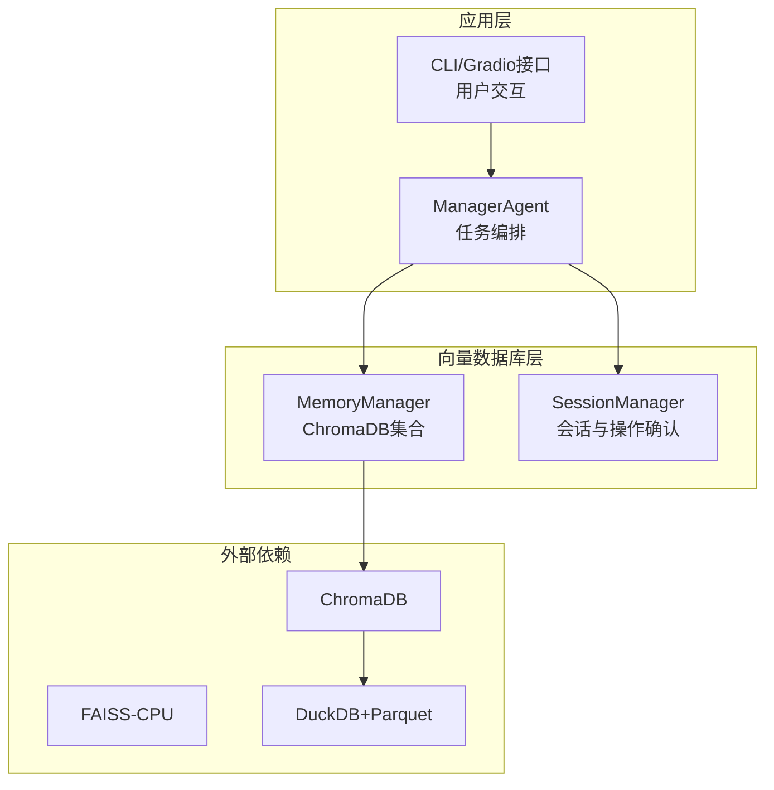
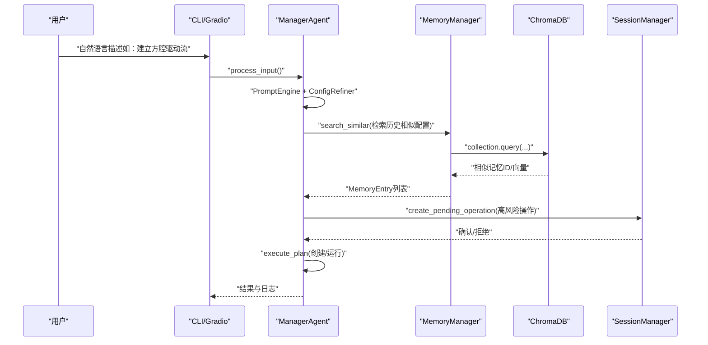
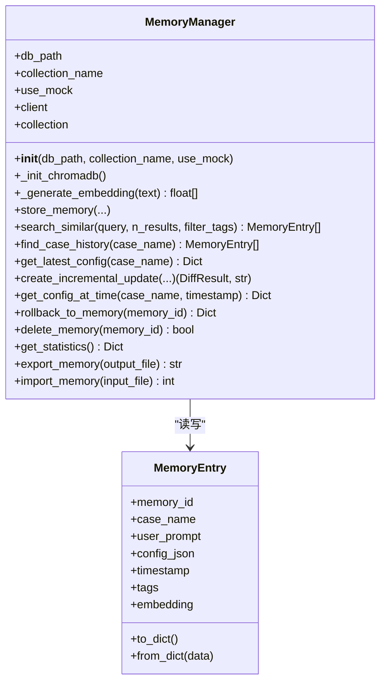
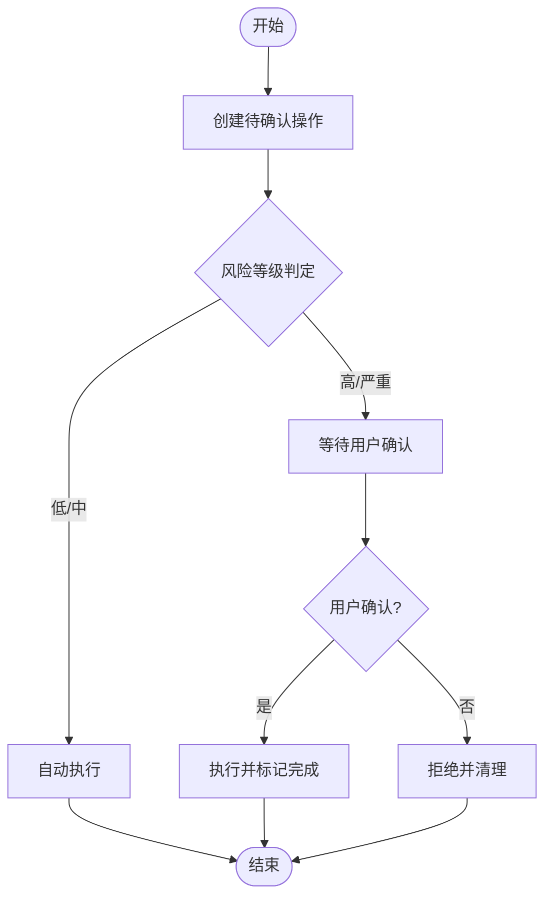
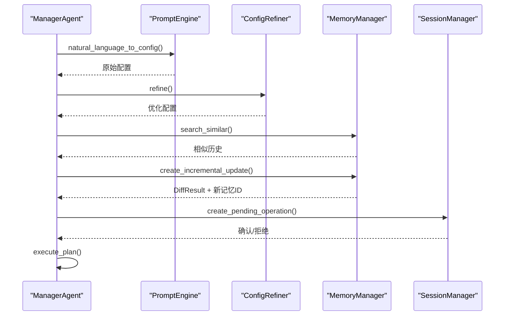
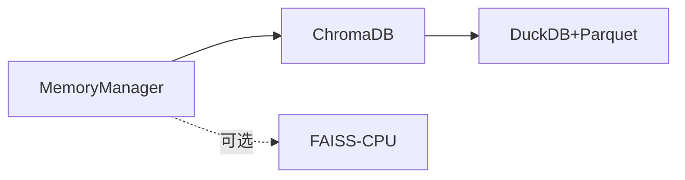
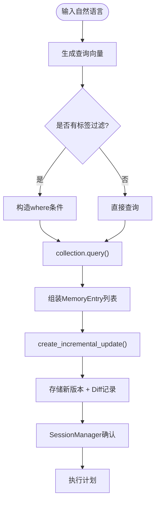

# 向量数据库优化

<cite>
**本文引用的文件**
- [memory_manager.py](file://openfoam_ai/memory/memory_manager.py)
- [session_manager.py](file://openfoam_ai/memory/session_manager.py)
- [requirements.txt](file://openfoam_ai/requirements.txt)
- [main.py](file://openfoam_ai/main.py)
- [manager_agent.py](file://openfoam_ai/agents/manager_agent.py)
- [test_phase3.py](file://openfoam_ai/tests/test_phase3.py)
- [main_phase3.py](file://openfoam_ai/main_phase3.py)
</cite>

## 目录
1. [简介](#简介)
2. [项目结构](#项目结构)
3. [核心组件](#核心组件)
4. [架构总览](#架构总览)
5. [详细组件分析](#详细组件分析)
6. [依赖分析](#依赖分析)
7. [性能考量](#性能考量)
8. [故障排查指南](#故障排查指南)
9. [结论](#结论)
10. [附录](#附录)

## 简介
本指南面向OpenFOAM AI项目中的向量数据库优化，聚焦ChromaDB在项目中的使用现状与可优化方向。当前项目通过MemoryManager封装ChromaDB，实现“算例配置向量化存储 + 自然语言相似检索 + 增量更新”的能力，并提供模拟模式回退。本文将围绕以下主题展开：
- ChromaDB索引配置与查询优化
- 嵌入向量生成与存储优化
- 向量检索性能优化（ANN、缓存、批量）
- 数据导入导出性能优化（批量写入、事务、压缩）
- 监控与维护（指标、空间回收、碎片整理）
- 大规模数据的存储优化（分片、冷热分离、增量更新）
- 不同规模数据集的配置建议与调优策略

## 项目结构
与向量数据库相关的核心模块位于openfoam_ai/memory目录，包含：
- MemoryManager：基于ChromaDB的向量存储与检索
- SessionManager：会话与高风险操作确认（间接影响向量检索的业务流程）

图表来源
- [memory_manager.py:243-254](file://openfoam_ai/memory/memory_manager.py#L243-L254)
- [requirements.txt:9-11](file://openfoam_ai/requirements.txt#L9-L11)

章节来源
- [memory_manager.py:1-804](file://openfoam_ai/memory/memory_manager.py#L1-L804)
- [session_manager.py:1-565](file://openfoam_ai/memory/session_manager.py#L1-L565)
- [requirements.txt:1-40](file://openfoam_ai/requirements.txt#L1-L40)

## 核心组件
- MemoryManager
  - ChromaDB集合初始化与元数据配置（HNSW余弦空间）
  - 文本向量化（当前为演示实现，后续可替换为高质量嵌入模型）
  - 存储/查询/删除/统计/导入导出
- SessionManager
  - 会话上下文与高风险操作确认，间接影响检索触发场景
- ManagerAgent
  - 与MemoryManager协作，驱动检索与增量更新流程
- 依赖
  - ChromaDB、FAISS-CPU（可选）、DuckDB+Parquet（持久化后端）

章节来源
- [memory_manager.py:243-284](file://openfoam_ai/memory/memory_manager.py#L243-L284)
- [session_manager.py:171-448](file://openfoam_ai/memory/session_manager.py#L171-L448)
- [manager_agent.py:38-458](file://openfoam_ai/agents/manager_agent.py#L38-L458)
- [requirements.txt:9-11](file://openfoam_ai/requirements.txt#L9-L11)

## 架构总览
下图展示从用户输入到向量检索与执行的关键流程。

图表来源
- [manager_agent.py:75-205](file://openfoam_ai/agents/manager_agent.py#L75-L205)
- [memory_manager.py:347-395](file://openfoam_ai/memory/memory_manager.py#L347-L395)
- [session_manager.py:308-394](file://openfoam_ai/memory/session_manager.py#L308-L394)

## 详细组件分析

### MemoryManager：ChromaDB集成与检索
- 集合初始化与元数据
  - 使用duckdb+parquet作为持久化后端
  - 集合元数据设置HNSW余弦距离空间
- 向量生成
  - 当前实现为演示级向量化（固定维度、词频哈希+归一化）
  - 建议替换为高质量嵌入模型（如sentence-transformers），并统一维度
- 存储与查询
  - add：同时写入文档、元数据与向量
  - query：支持where过滤（标签）与n_results限制
- 模拟模式
  - 内存字典+余弦相似度，便于开发与测试

图表来源
- [memory_manager.py:198-687](file://openfoam_ai/memory/memory_manager.py#L198-L687)

章节来源
- [memory_manager.py:243-254](file://openfoam_ai/memory/memory_manager.py#L243-L254)
- [memory_manager.py:256-284](file://openfoam_ai/memory/memory_manager.py#L256-L284)
- [memory_manager.py:291-345](file://openfoam_ai/memory/memory_manager.py#L291-L345)
- [memory_manager.py:347-395](file://openfoam_ai/memory/memory_manager.py#L347-L395)
- [memory_manager.py:421-457](file://openfoam_ai/memory/memory_manager.py#L421-L457)
- [memory_manager.py:562-582](file://openfoam_ai/memory/memory_manager.py#L562-L582)
- [memory_manager.py:584-608](file://openfoam_ai/memory/memory_manager.py#L584-L608)
- [memory_manager.py:610-687](file://openfoam_ai/memory/memory_manager.py#L610-L687)

### SessionManager：会话与高风险操作
- 会话上下文、消息历史、当前算例与配置
- 待确认操作（高风险操作分级与确认流程）
- 自动保存与导出

图表来源
- [session_manager.py:308-394](file://openfoam_ai/memory/session_manager.py#L308-L394)
- [session_manager.py:445-448](file://openfoam_ai/memory/session_manager.py#L445-L448)

章节来源
- [session_manager.py:171-448](file://openfoam_ai/memory/session_manager.py#L171-L448)

### ManagerAgent：检索与增量更新编排
- 自然语言理解 → 配置生成 → 本地优化 → 验证 → 计划生成
- 检索相似历史配置 → 增量更新（Diff） → 待确认操作 → 执行

图表来源
- [manager_agent.py:75-205](file://openfoam_ai/agents/manager_agent.py#L75-L205)
- [memory_manager.py:474-520](file://openfoam_ai/memory/memory_manager.py#L474-L520)
- [session_manager.py:308-394](file://openfoam_ai/memory/session_manager.py#L308-L394)

章节来源
- [manager_agent.py:38-458](file://openfoam_ai/agents/manager_agent.py#L38-L458)

## 依赖分析
- ChromaDB：向量数据库与持久化（duckdb+parquet）
- FAISS-CPU：可选的高性能ANN替代方案（项目已声明依赖）
- DuckDB+Parquet：ChromaDB持久化后端
- 项目当前未直接使用FAISS，但具备扩展条件

图表来源
- [requirements.txt:9-11](file://openfoam_ai/requirements.txt#L9-L11)
- [memory_manager.py:243-254](file://openfoam_ai/memory/memory_manager.py#L243-L254)

章节来源
- [requirements.txt:1-40](file://openfoam_ai/requirements.txt#L1-L40)
- [memory_manager.py:243-254](file://openfoam_ai/memory/memory_manager.py#L243-L254)

## 性能考量

### ChromaDB索引配置与查询优化
- 空间与距离度量
  - 集合元数据已设置余弦空间，适合余弦相似检索
  - 建议：向量维度统一且与嵌入模型一致；避免频繁切换空间类型
- HNSW参数
  - 当前未显式设置HNSW参数；可在集合创建时补充构建参数（如ef_construction、M）以平衡召回率与查询延迟
- 查询过滤
  - 使用metadata过滤（如标签）可缩小候选集，降低查询开销
- 分页与Top-K
  - n_results限制返回数量；结合where过滤可进一步减少扫描

章节来源
- [memory_manager.py:250-254](file://openfoam_ai/memory/memory_manager.py#L250-L254)
- [memory_manager.py:369-378](file://openfoam_ai/memory/memory_manager.py#L369-L378)

### 嵌入向量生成与存储优化
- 维度选择
  - 当前演示实现固定维度；建议采用高质量嵌入模型并统一维度，便于索引与相似度计算
- 相似性计算
  - 余弦距离空间已启用；确保向量归一化一致性
- 内存占用控制
  - 向量仅在检索时临时生成；长期存储仅保留向量ID与元数据，避免重复序列化

章节来源
- [memory_manager.py:267-284](file://openfoam_ai/memory/memory_manager.py#L267-L284)
- [memory_manager.py:250-254](file://openfoam_ai/memory/memory_manager.py#L250-L254)

### 向量检索性能优化
- ANN算法应用
  - ChromaDB默认使用HNSW；若需更高吞吐，可评估FAISS-CPU作为替代或并行加速
- 查询缓存策略
  - 对高频查询（如“相似历史”）可引入短期缓存（LRU），键为查询文本哈希+过滤条件
- 批量处理优化
  - 批量add/query时利用向量化接口，减少网络/进程开销
  - 对相似检索，先做关键词过滤再做向量查询

章节来源
- [memory_manager.py:347-395](file://openfoam_ai/memory/memory_manager.py#L347-L395)
- [requirements.txt:10-11](file://openfoam_ai/requirements.txt#L10-L11)

### 数据导入导出性能优化
- 批量写入
  - 使用collection.add的批量接口一次性写入多个向量与元数据
- 事务管理
  - ChromaDB内部事务由duckdb+parquet保障；避免频繁commit
- 数据压缩
  - DuckDB+Parquet自带列式压缩；可结合向量压缩（如二值化/低位浮点）进一步节省空间（需权衡精度）

章节来源
- [memory_manager.py:332-342](file://openfoam_ai/memory/memory_manager.py#L332-L342)
- [memory_manager.py:610-687](file://openfoam_ai/memory/memory_manager.py#L610-L687)

### 监控与维护最佳实践
- 性能指标监控
  - 查询耗时、召回率、误召回率、索引大小、磁盘占用
- 空间回收与碎片整理
  - 定期compact/merge（duckdb层面）；必要时重建集合以整理碎片
- 版本与回滚
  - 增量更新记录diff；支持按memory_id回滚到历史版本

章节来源
- [memory_manager.py:541-561](file://openfoam_ai/memory/memory_manager.py#L541-L561)
- [memory_manager.py:584-608](file://openfoam_ai/memory/memory_manager.py#L584-L608)

### 大规模数据存储优化
- 分片存储
  - 按业务域/时间/标签分集合或分表；查询时定向路由
- 冷热数据分离
  - 热点算例常检索的向量优先驻留；历史/低频数据迁移至低成本存储
- 增量更新机制
  - 基于Diff的增量写入，减少全量重建成本

章节来源
- [memory_manager.py:474-520](file://openfoam_ai/memory/memory_manager.py#L474-L520)

### 不同规模数据集的配置建议
- 小规模（<10万）
  - 单集合、默认HNSW参数、定期备份
- 中等规模（10万–100万）
  - 引入标签过滤、批量写入、查询缓存
- 大规模（>100万）
  - 分集合/分表、FAISS-CPU并行、冷热分离、向量压缩

[本节为通用指导，无需具体文件引用]

## 故障排查指南
- ChromaDB初始化失败
  - 回退到模拟模式；检查依赖安装与权限
- 查询结果为空
  - 检查过滤条件、标签是否存在；确认向量维度与模型一致
- 增量更新未生效
  - 确认最新配置获取与Diff生成流程；检查标签与时间戳
- 会话确认未执行
  - 检查待确认操作状态与用户输入；确认自动保存

章节来源
- [memory_manager.py:233-241](file://openfoam_ai/memory/memory_manager.py#L233-L241)
- [memory_manager.py:369-378](file://openfoam_ai/memory/memory_manager.py#L369-L378)
- [memory_manager.py:490-520](file://openfoam_ai/memory/memory_manager.py#L490-L520)
- [session_manager.py:340-394](file://openfoam_ai/memory/session_manager.py#L340-L394)

## 结论
当前OpenFOAM AI项目已具备基于ChromaDB的向量检索能力，并通过模拟模式保证开发与测试稳定性。为进一步提升性能与可维护性，建议：
- 替换为高质量嵌入模型并统一维度
- 显式配置HNSW参数，结合标签过滤与查询缓存
- 批量写入与并行查询，必要时引入FAISS-CPU
- 建立监控体系与冷热分离策略，支撑大规模数据演进

[本节为总结，无需具体文件引用]

## 附录

### 关键流程：相似检索与增量更新

图表来源
- [memory_manager.py:347-395](file://openfoam_ai/memory/memory_manager.py#L347-L395)
- [memory_manager.py:474-520](file://openfoam_ai/memory/memory_manager.py#L474-L520)
- [session_manager.py:308-394](file://openfoam_ai/memory/session_manager.py#L308-L394)

### 测试与演示参考
- 阶段三测试覆盖了相似检索、历史查询、增量更新与待确认操作
- main_phase3展示了检索相似配置与增量更新的端到端流程

章节来源
- [test_phase3.py:153-197](file://openfoam_ai/tests/test_phase3.py#L153-L197)
- [test_phase3.py:489-525](file://openfoam_ai/tests/test_phase3.py#L489-L525)
- [main_phase3.py:321-356](file://openfoam_ai/main_phase3.py#L321-L356)