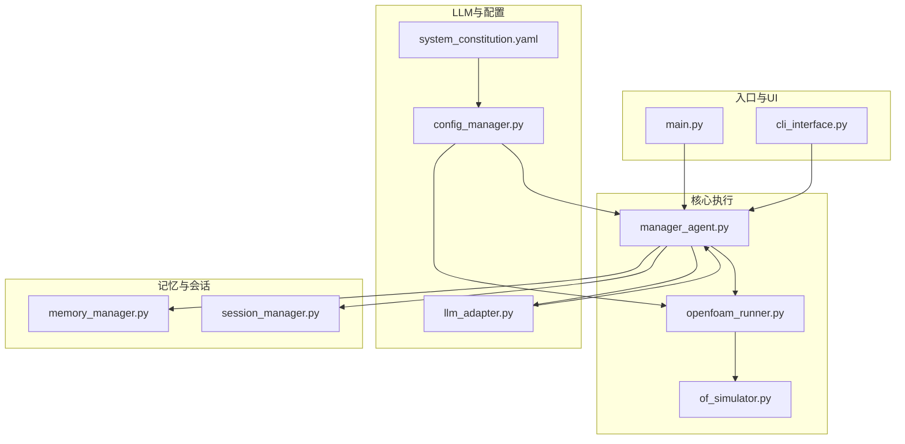
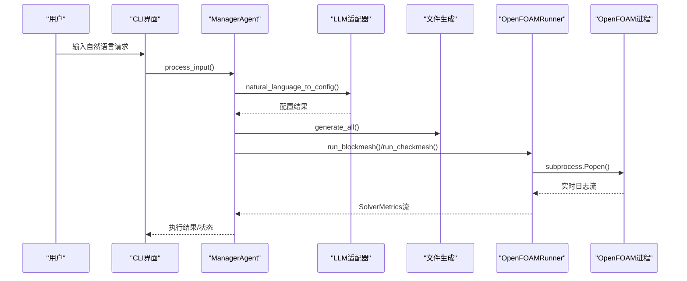
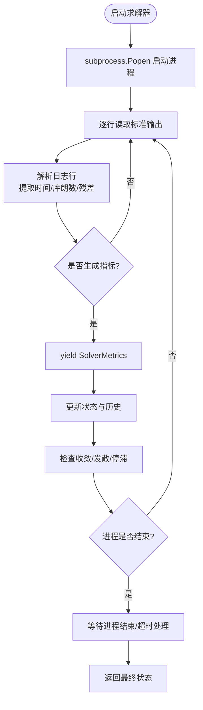
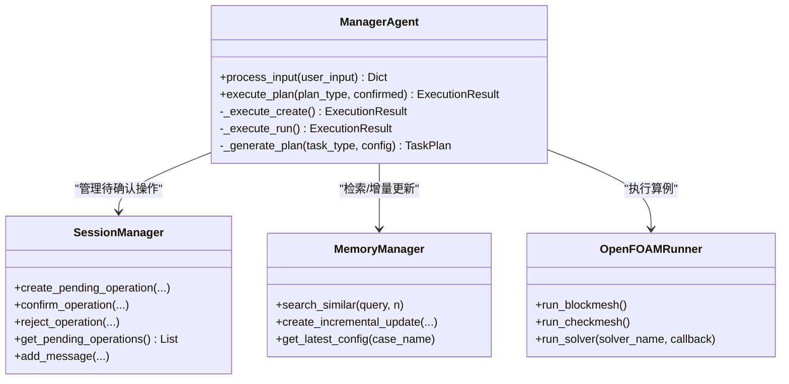
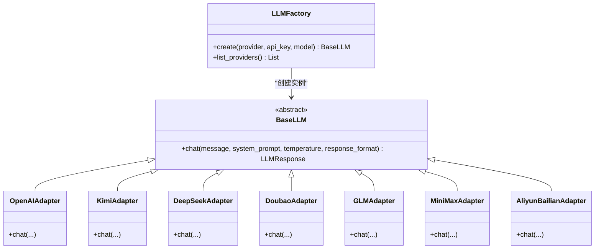
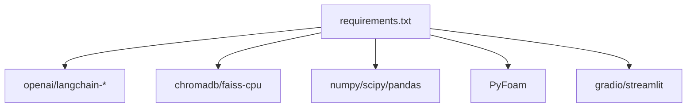

# 并发处理优化

<cite>
**本文档引用的文件**
- [main.py](file://openfoam_ai/main.py)
- [openfoam_runner.py](file://openfoam_ai/core/openfoam_runner.py)
- [manager_agent.py](file://openfoam_ai/agents/manager_agent.py)
- [llm_adapter.py](file://openfoam_ai/core/llm_adapter.py)
- [memory_manager.py](file://openfoam_ai/memory/memory_manager.py)
- [session_manager.py](file://openfoam_ai/memory/session_manager.py)
- [config_manager.py](file://openfoam_ai/core/config_manager.py)
- [of_simulator.py](file://openfoam_ai/utils/of_simulator.py)
- [cli_interface.py](file://openfoam_ai/ui/cli_interface.py)
- [system_constitution.yaml](file://openfoam_ai/config/system_constitution.yaml)
- [requirements.txt](file://openfoam_ai/requirements.txt)
</cite>

## 目录
1. [简介](#简介)
2. [项目结构](#项目结构)
3. [核心组件](#核心组件)
4. [架构总览](#架构总览)
5. [详细组件分析](#详细组件分析)
6. [依赖分析](#依赖分析)
7. [性能考虑](#性能考虑)
8. [故障排查指南](#故障排查指南)
9. [结论](#结论)
10. [附录](#附录)

## 简介
本指南面向OpenFOAM AI项目的并发处理优化，围绕多线程与异步设计模式、线程池管理、异步任务调度、并发安全机制展开；同时覆盖OpenFOAM求解器执行的并发优化策略（并行计算配置、进程间通信与资源共享）、ManagerAgent的任务调度并发优化（任务队列管理、优先级调度与负载均衡）、LLM调用的并发优化（请求限流、连接池管理与超时处理），以及并发性能监控与调试工具的使用方法，并提供高并发场景下的系统稳定性保障与故障恢复策略。

## 项目结构
OpenFOAM AI采用模块化分层架构：
- 核心执行层：OpenFOAMRunner负责命令执行、日志解析与求解器状态监控
- 任务编排层：ManagerAgent协调各子Agent与执行流程
- LLM适配层：LLMFactory与多种适配器支持多供应商接入
- 记忆与会话层：MemoryManager与SessionManager提供上下文与历史管理
- 配置与宪法层：ConfigManager集中管理配置与系统约束
- UI与工具层：CLI界面、仿真模拟器等

**图表来源**
- [main.py:1-251](file://openfoam_ai/main.py#L1-L251)
- [manager_agent.py:1-458](file://openfoam_ai/agents/manager_agent.py#L1-L458)
- [openfoam_runner.py:1-548](file://openfoam_ai/core/openfoam_runner.py#L1-L548)
- [llm_adapter.py:1-688](file://openfoam_ai/core/llm_adapter.py#L1-L688)
- [memory_manager.py:1-804](file://openfoam_ai/memory/memory_manager.py#L1-L804)
- [session_manager.py:1-565](file://openfoam_ai/memory/session_manager.py#L1-L565)
- [config_manager.py:1-227](file://openfoam_ai/core/config_manager.py#L1-L227)
- [of_simulator.py:1-180](file://openfoam_ai/utils/of_simulator.py#L1-L180)
- [cli_interface.py:1-401](file://openfoam_ai/ui/cli_interface.py#L1-L401)
- [system_constitution.yaml:1-103](file://openfoam_ai/config/system_constitution.yaml#L1-L103)

**章节来源**
- [main.py:1-251](file://openfoam_ai/main.py#L1-L251)
- [manager_agent.py:1-458](file://openfoam_ai/agents/manager_agent.py#L1-L458)
- [openfoam_runner.py:1-548](file://openfoam_ai/core/openfoam_runner.py#L1-L548)
- [llm_adapter.py:1-688](file://openfoam_ai/core/llm_adapter.py#L1-L688)
- [memory_manager.py:1-804](file://openfoam_ai/memory/memory_manager.py#L1-L804)
- [session_manager.py:1-565](file://openfoam_ai/memory/session_manager.py#L1-L565)
- [config_manager.py:1-227](file://openfoam_ai/core/config_manager.py#L1-L227)
- [of_simulator.py:1-180](file://openfoam_ai/utils/of_simulator.py#L1-L180)
- [cli_interface.py:1-401](file://openfoam_ai/ui/cli_interface.py#L1-L401)
- [system_constitution.yaml:1-103](file://openfoam_ai/config/system_constitution.yaml#L1-L103)

## 核心组件
- OpenFOAMRunner：封装OpenFOAM命令执行、日志捕获与解析、求解器状态监控，支持实时指标流式输出与异常处理
- ManagerAgent：任务编排与执行，协调LLM、文件生成、OpenFOAM执行与状态反馈
- LLMFactory：统一LLM适配器工厂，支持多供应商与SDK/HTTP两种调用模式
- MemoryManager：基于ChromaDB/模拟模式的记忆存储与相似检索，支持增量更新
- SessionManager：多轮对话上下文、待确认操作队列与持久化
- ConfigManager：集中配置管理，支持默认值、环境变量与宪法文件合并
- OpenFOAMSimulator：简易仿真运行器，提供异步执行能力

**章节来源**
- [openfoam_runner.py:44-198](file://openfoam_ai/core/openfoam_runner.py#L44-L198)
- [manager_agent.py:38-338](file://openfoam_ai/agents/manager_agent.py#L38-L338)
- [llm_adapter.py:577-634](file://openfoam_ai/core/llm_adapter.py#L577-L634)
- [memory_manager.py:198-583](file://openfoam_ai/memory/memory_manager.py#L198-L583)
- [session_manager.py:171-448](file://openfoam_ai/memory/session_manager.py#L171-L448)
- [config_manager.py:16-218](file://openfoam_ai/core/config_manager.py#L16-L218)
- [of_simulator.py:13-180](file://openfoam_ai/utils/of_simulator.py#L13-L180)

## 架构总览
OpenFOAM AI的并发执行链路如下：
- CLI/交互入口接收用户请求，ManagerAgent解析意图并生成执行计划
- ManagerAgent调用LLM进行配置生成与优化，随后协调文件生成与OpenFOAMRunner执行
- OpenFOAMRunner通过subprocess启动求解器，实时解析日志并产出SolverMetrics
- MemoryManager与SessionManager分别维护历史配置与对话上下文
- ConfigManager提供并发安全的配置读取与宪法约束

**图表来源**
- [cli_interface.py:90-252](file://openfoam_ai/ui/cli_interface.py#L90-L252)
- [manager_agent.py:75-338](file://openfoam_ai/agents/manager_agent.py#L75-L338)
- [llm_adapter.py:577-634](file://openfoam_ai/core/llm_adapter.py#L577-L634)
- [openfoam_runner.py:77-198](file://openfoam_ai/core/openfoam_runner.py#L77-L198)

## 详细组件分析

### OpenFOAMRunner并发执行与监控
- 设计要点
  - 使用subprocess.Popen异步捕获标准输出，逐行解析日志并生成SolverMetrics
  - 通过状态机（IDLE/RUNNING/CONVERGED/DIVERGING/STALLED/ERROR/COMPLETED）跟踪求解器状态
  - 提供SolverMonitor对指标历史进行收敛与停滞检测
- 并发与安全
  - 当前实现为单进程串行执行，未引入线程池或异步队列
  - 建议在多算例场景下引入线程池与任务队列，避免阻塞主线程
- 关键流程

**图表来源**
- [openfoam_runner.py:99-198](file://openfoam_ai/core/openfoam_runner.py#L99-L198)
- [openfoam_runner.py:446-501](file://openfoam_ai/core/openfoam_runner.py#L446-L501)

**章节来源**
- [openfoam_runner.py:44-198](file://openfoam_ai/core/openfoam_runner.py#L44-L198)
- [openfoam_runner.py:446-516](file://openfoam_ai/core/openfoam_runner.py#L446-L516)

### ManagerAgent任务调度并发优化
- 设计要点
  - 任务计划生成与执行分离，支持确认机制与自动修复
  - 通过SessionManager维护待确认操作队列，支持高风险操作分级
  - MemoryManager提供历史配置检索与增量更新，减少重复工作
- 并发优化建议
  - 引入线程池管理多个算例的创建/运行任务
  - 为不同优先级任务设置队列与调度策略
  - 使用RLock保护共享状态（当前配置、执行历史）

**图表来源**
- [manager_agent.py:38-338](file://openfoam_ai/agents/manager_agent.py#L38-L338)
- [session_manager.py:171-448](file://openfoam_ai/memory/session_manager.py#L171-L448)
- [memory_manager.py:198-583](file://openfoam_ai/memory/memory_manager.py#L198-L583)
- [openfoam_runner.py:77-198](file://openfoam_ai/core/openfoam_runner.py#L77-L198)

**章节来源**
- [manager_agent.py:38-338](file://openfoam_ai/agents/manager_agent.py#L38-L338)
- [session_manager.py:171-448](file://openfoam_ai/memory/session_manager.py#L171-L448)
- [memory_manager.py:198-583](file://openfoam_ai/memory/memory_manager.py#L198-L583)

### LLM调用并发优化
- 设计要点
  - LLMFactory统一创建不同供应商适配器，支持SDK与HTTP两种模式
  - 各适配器内部使用requests或官方SDK，均具备超时控制
- 并发优化建议
  - 引入连接池（如requests.Session）复用TCP连接
  - 实施请求限流与重试策略，结合指数退避
  - 为不同供应商设置独立的并发上限与超时阈值

**图表来源**
- [llm_adapter.py:577-634](file://openfoam_ai/core/llm_adapter.py#L577-L634)
- [llm_adapter.py:39-167](file://openfoam_ai/core/llm_adapter.py#L39-L167)
- [llm_adapter.py:170-237](file://openfoam_ai/core/llm_adapter.py#L170-L237)
- [llm_adapter.py:240-298](file://openfoam_ai/core/llm_adapter.py#L240-L298)
- [llm_adapter.py:301-367](file://openfoam_ai/core/llm_adapter.py#L301-L367)
- [llm_adapter.py:370-434](file://openfoam_ai/core/llm_adapter.py#L370-L434)
- [llm_adapter.py:437-501](file://openfoam_ai/core/llm_adapter.py#L437-L501)
- [llm_adapter.py:504-574](file://openfoam_ai/core/llm_adapter.py#L504-L574)

**章节来源**
- [llm_adapter.py:577-634](file://openfoam_ai/core/llm_adapter.py#L577-L634)
- [llm_adapter.py:1-688](file://openfoam_ai/core/llm_adapter.py#L1-L688)

### 记忆与会话的并发安全
- MemoryManager
  - 使用模拟模式回退策略，避免外部依赖导致的阻塞
  - 嵌入向量生成为简化实现，适合演示用途
- SessionManager
  - 会话状态与待确认操作队列需并发安全
  - 建议引入RLock保护共享状态，自动保存采用异步落盘

**章节来源**
- [memory_manager.py:22-29](file://openfoam_ai/memory/memory_manager.py#L22-L29)
- [memory_manager.py:198-583](file://openfoam_ai/memory/memory_manager.py#L198-L583)
- [session_manager.py:171-448](file://openfoam_ai/memory/session_manager.py#L171-L448)

### 配置与宪法的并发安全
- ConfigManager采用单例+RLock，确保配置读取与热重载的线程安全
- 支持环境变量与默认值合并，提供统一访问接口

**章节来源**
- [config_manager.py:16-218](file://openfoam_ai/core/config_manager.py#L16-L218)
- [system_constitution.yaml:1-103](file://openfoam_ai/config/system_constitution.yaml#L1-L103)

### OpenFOAMSimulator异步执行
- 提供run_async方法，使用threading.Thread异步运行仿真
- 适用于GUI或批量任务场景，避免阻塞主线程

**章节来源**
- [of_simulator.py:95-104](file://openfoam_ai/utils/of_simulator.py#L95-L104)

## 依赖分析
- 外部依赖
  - LLM：openai、langchain系列
  - 向量库：chromadb、faiss
  - 科学计算：numpy、scipy、pandas、matplotlib
  - OpenFOAM接口：PyFoam
  - Web UI：gradio、streamlit
- 内部耦合
  - ManagerAgent依赖LLM、MemoryManager、SessionManager、OpenFOAMRunner
  - OpenFOAMRunner依赖ConfigManager提供的标准阈值
  - CLI界面依赖ManagerAgent与MemoryManager

**图表来源**
- [requirements.txt:1-40](file://openfoam_ai/requirements.txt#L1-L40)

**章节来源**
- [requirements.txt:1-40](file://openfoam_ai/requirements.txt#L1-L40)

## 性能考虑
- 线程池与任务队列
  - 为多算例创建/运行任务引入ThreadPoolExecutor，设置最大并发数（参考CPU核数与内存限制）
  - 使用优先级队列区分紧急/常规任务，避免高延迟任务阻塞
- I/O与日志
  - OpenFOAMRunner的逐行解析与写盘应采用缓冲与异步刷写，降低磁盘压力
  - 日志文件按求解器命名，避免竞争写入
- LLM调用
  - 使用requests.Session复用连接，设置合理超时与重试
  - 为不同供应商设置独立并发上限，避免被限流
- 资源管理
  - 通过ConfigManager读取max_parallel_threads与memory_limit_gb，动态调整并发度
  - 对长时间运行的求解器设置超时与信号处理

[本节为通用指导，无需具体文件引用]

## 故障排查指南
- 并发瓶颈识别
  - 使用线程转储与性能剖析工具定位阻塞点（如I/O密集或CPU密集阶段）
  - 观察OpenFOAMRunner日志解析是否成为瓶颈，必要时增加缓冲或异步化
- 死锁检测
  - 检查SessionManager与MemoryManager中的RLock使用是否成对出现
  - 确保回调函数中不持有全局锁
- 性能分析
  - 分析SolverMetrics生成频率与日志写盘开销
  - 对比不同供应商LLM的响应时间与成功率，优化限流策略
- 稳定性保障
  - 对subprocess进程设置超时与强制终止策略
  - 对LLM调用实施指数退避与熔断机制
  - 对会话与记忆的持久化采用异步落盘，避免阻塞主线程

**章节来源**
- [openfoam_runner.py:179-198](file://openfoam_ai/core/openfoam_runner.py#L179-L198)
- [session_manager.py:445-448](file://openfoam_ai/memory/session_manager.py#L445-L448)
- [memory_manager.py:649-687](file://openfoam_ai/memory/memory_manager.py#L649-L687)

## 结论
OpenFOAM AI在当前版本中主要采用串行执行与简单异步（线程）模式。为进一步提升高并发场景下的吞吐与稳定性，建议引入线程池与任务队列、连接池与限流、异步落盘与缓冲策略，并完善并发安全与资源管理。通过上述优化，可在保证系统稳定性的前提下显著提升多算例与多用户场景下的整体性能。

[本节为总结性内容，无需具体文件引用]

## 附录
- 高并发场景建议
  - 算例池化：将相似算例归类，复用网格与配置，减少重复工作
  - 负载均衡：根据CPU/内存/IO使用率动态分配任务
  - 故障恢复：对失败任务进行自动重试与降级处理，记录失败原因便于后续优化

[本节为通用建议，无需具体文件引用]