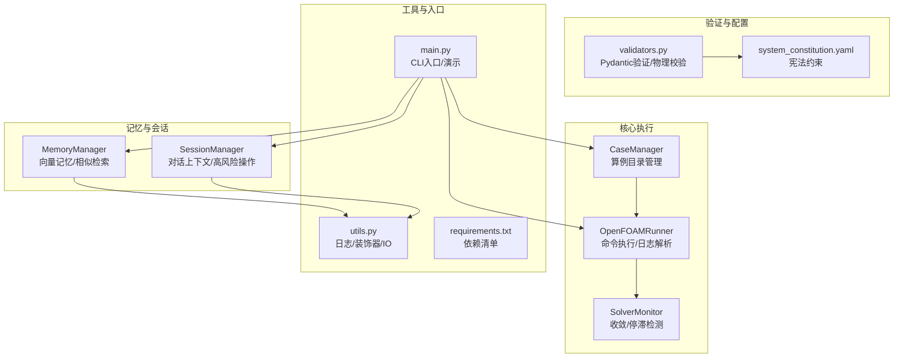
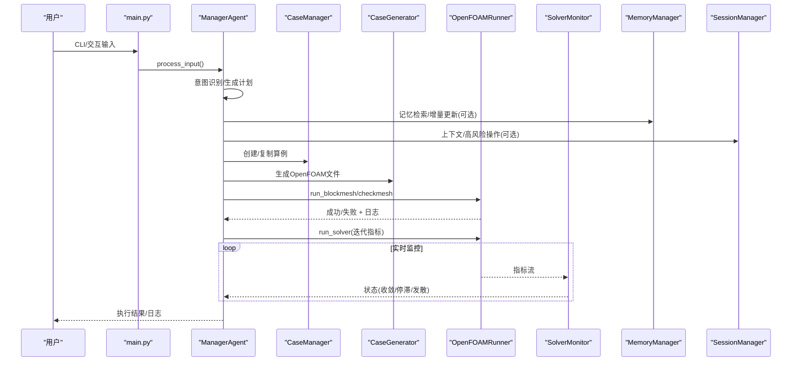
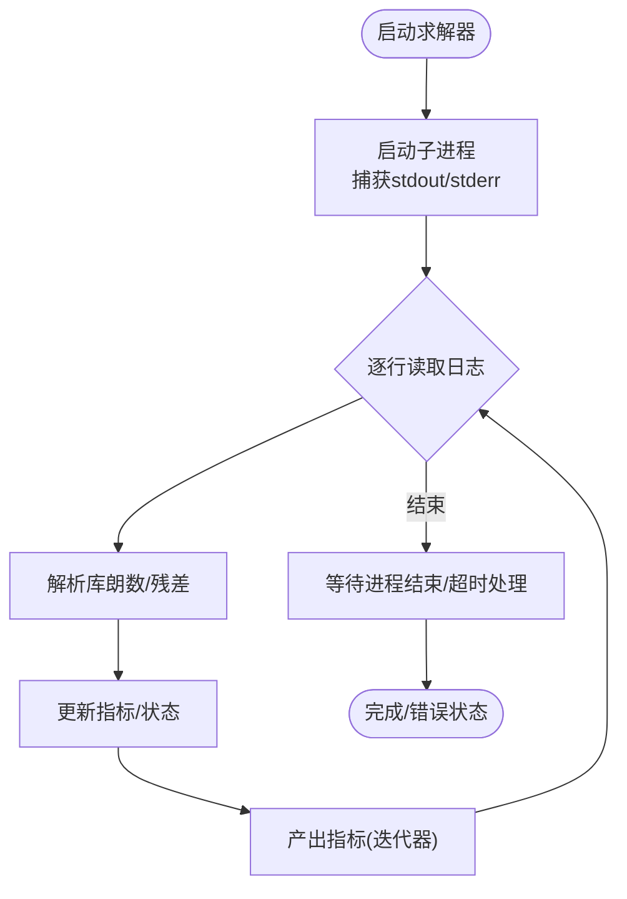
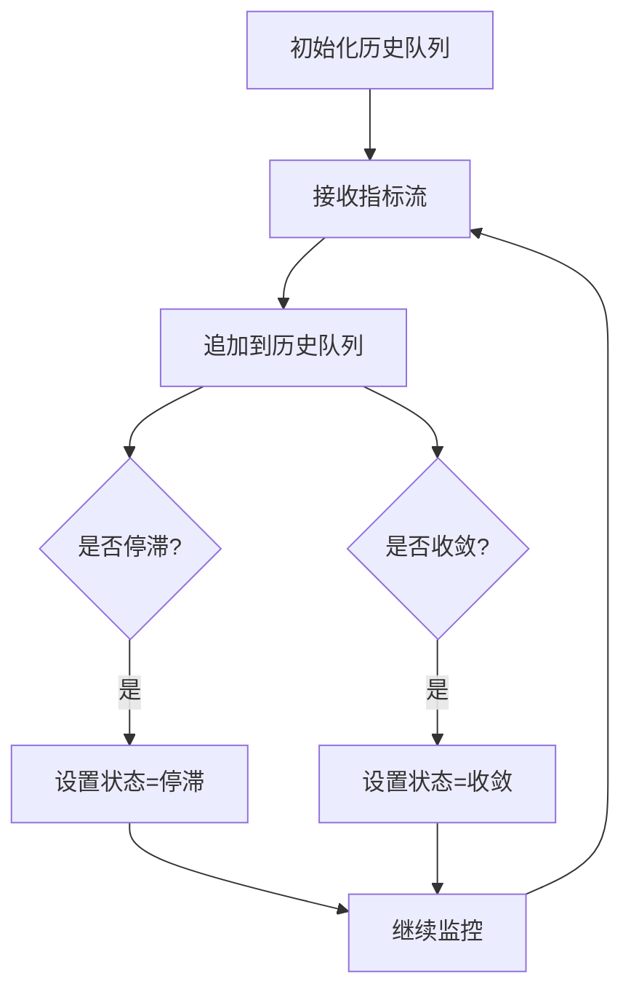
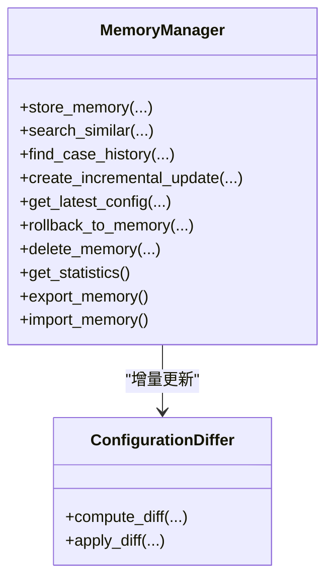
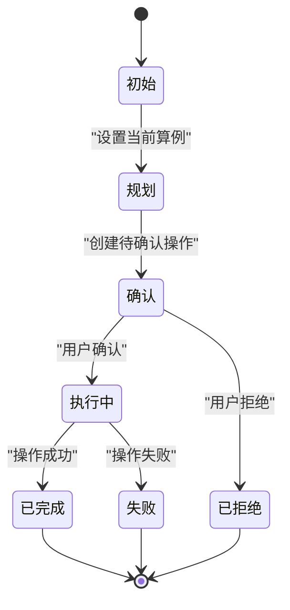
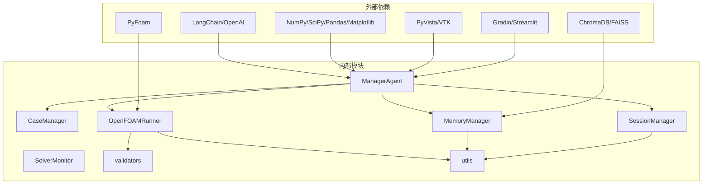

# 性能优化

<cite>
**本文引用的文件**
- [openfoam_ai/core/openfoam_runner.py](file://openfoam_ai/core/openfoam_runner.py)
- [openfoam_ai/core/case_manager.py](file://openfoam_ai/core/case_manager.py)
- [openfoam_ai/memory/memory_manager.py](file://openfoam_ai/memory/memory_manager.py)
- [openfoam_ai/memory/session_manager.py](file://openfoam_ai/memory/session_manager.py)
- [openfoam_ai/core/validators.py](file://openfoam_ai/core/validators.py)
- [openfoam_ai/config/system_constitution.yaml](file://openfoam_ai/config/system_constitution.yaml)
- [openfoam_ai/main.py](file://openfoam_ai/main.py)
- [openfoam_ai/core/utils.py](file://openfoam_ai/core/utils.py)
- [openfoam_ai/requirements.txt](file://openfoam_ai/requirements.txt)
</cite>

## 目录
1. [简介](#简介)
2. [项目结构](#项目结构)
3. [核心组件](#核心组件)
4. [架构总览](#架构总览)
5. [详细组件分析](#详细组件分析)
6. [依赖分析](#依赖分析)
7. [性能考量](#性能考量)
8. [故障排查指南](#故障排查指南)
9. [结论](#结论)
10. [附录](#附录)

## 简介
本指南面向OpenFOAM AI项目，聚焦于性能优化的系统性方法论，覆盖内存管理、并发设计、求解器执行优化、向量数据库查询优化、性能监控与分析、大规模算例与分布式方案，以及针对不同硬件配置的优化建议。文档以代码为依据，结合项目中的模块化实现，给出可落地的优化策略与最佳实践。

## 项目结构
项目采用“核心模块 + 记忆与会话 + 配置与验证 + 主入口”的组织方式：
- 核心执行与管理：算例目录管理、OpenFOAM命令执行、求解器监控
- 记忆与会话：向量数据库式记忆存储与检索、多轮对话上下文与高风险操作确认
- 验证与约束：基于宪法的硬约束与物理一致性校验
- 工具与入口：通用工具函数、主程序入口与演示流程

图表来源
- [openfoam_ai/core/case_manager.py:27-262](file://openfoam_ai/core/case_manager.py#L27-L262)
- [openfoam_ai/core/openfoam_runner.py:44-517](file://openfoam_ai/core/openfoam_runner.py#L44-L517)
- [openfoam_ai/memory/memory_manager.py:198-688](file://openfoam_ai/memory/memory_manager.py#L198-L688)
- [openfoam_ai/memory/session_manager.py:171-489](file://openfoam_ai/memory/session_manager.py#L171-L489)
- [openfoam_ai/core/validators.py:13-441](file://openfoam_ai/core/validators.py#L13-L441)
- [openfoam_ai/config/system_constitution.yaml:1-103](file://openfoam_ai/config/system_constitution.yaml#L1-L103)
- [openfoam_ai/core/utils.py:16-111](file://openfoam_ai/core/utils.py#L16-L111)
- [openfoam_ai/main.py:1-251](file://openfoam_ai/main.py#L1-L251)
- [openfoam_ai/requirements.txt:1-40](file://openfoam_ai/requirements.txt#L1-L40)

章节来源
- [openfoam_ai/main.py:1-251](file://openfoam_ai/main.py#L1-L251)
- [openfoam_ai/core/case_manager.py:27-262](file://openfoam_ai/core/case_manager.py#L27-L262)
- [openfoam_ai/core/openfoam_runner.py:44-517](file://openfoam_ai/core/openfoam_runner.py#L44-L517)
- [openfoam_ai/memory/memory_manager.py:198-688](file://openfoam_ai/memory/memory_manager.py#L198-L688)
- [openfoam_ai/memory/session_manager.py:171-489](file://openfoam_ai/memory/session_manager.py#L171-L489)
- [openfoam_ai/core/validators.py:13-441](file://openfoam_ai/core/validators.py#L13-L441)
- [openfoam_ai/config/system_constitution.yaml:1-103](file://openfoam_ai/config/system_constitution.yaml#L1-L103)
- [openfoam_ai/core/utils.py:16-111](file://openfoam_ai/core/utils.py#L16-L111)
- [openfoam_ai/requirements.txt:1-40](file://openfoam_ai/requirements.txt#L1-L40)

## 核心组件
- 算例目录管理（CaseManager）：负责创建/复制/清理算例目录，维护算例元信息，保障OpenFOAM标准目录结构。
- OpenFOAM命令执行（OpenFOAMRunner）：封装blockMesh/checkMesh/solver执行，实时解析日志、提取指标、状态机管理。
- 求解器监控（SolverMonitor）：基于历史指标检测收敛、停滞与发散，提供摘要与阈值控制。
- 记忆管理（MemoryManager）：基于ChromaDB/模拟模式的向量存储与相似检索，支持增量Diff更新与导出导入。
- 会话管理（SessionManager）：多轮对话上下文、高风险操作确认、自动保存与导出。
- 验证与约束（validators + system_constitution.yaml）：基于宪法的硬约束与Pydantic验证，防止不合理配置。
- 工具与入口（utils + main）：日志、执行时间装饰器、JSON IO；CLI入口与演示流程。

章节来源
- [openfoam_ai/core/case_manager.py:27-262](file://openfoam_ai/core/case_manager.py#L27-L262)
- [openfoam_ai/core/openfoam_runner.py:44-517](file://openfoam_ai/core/openfoam_runner.py#L44-L517)
- [openfoam_ai/memory/memory_manager.py:198-688](file://openfoam_ai/memory/memory_manager.py#L198-L688)
- [openfoam_ai/memory/session_manager.py:171-489](file://openfoam_ai/memory/session_manager.py#L171-L489)
- [openfoam_ai/core/validators.py:13-441](file://openfoam_ai/core/validators.py#L13-L441)
- [openfoam_ai/config/system_constitution.yaml:1-103](file://openfoam_ai/config/system_constitution.yaml#L1-L103)
- [openfoam_ai/core/utils.py:16-111](file://openfoam_ai/core/utils.py#L16-L111)
- [openfoam_ai/main.py:1-251](file://openfoam_ai/main.py#L1-L251)

## 架构总览
下图展示从用户输入到求解器执行与结果监控的关键路径，以及记忆与会话在其中的协同作用。

图表来源
- [openfoam_ai/main.py:37-200](file://openfoam_ai/main.py#L37-L200)
- [openfoam_ai/core/case_manager.py:51-262](file://openfoam_ai/core/case_manager.py#L51-L262)
- [openfoam_ai/core/openfoam_runner.py:77-198](file://openfoam_ai/core/openfoam_runner.py#L77-L198)
- [openfoam_ai/memory/memory_manager.py:291-521](file://openfoam_ai/memory/memory_manager.py#L291-L521)
- [openfoam_ai/memory/session_manager.py:171-448](file://openfoam_ai/memory/session_manager.py#L171-L448)

## 详细组件分析

### 组件A：OpenFOAMRunner（求解器执行与日志解析）
- 关键职责
  - 执行blockMesh/checkMesh与求解器命令
  - 实时读取标准输出，解析库朗数、残差等指标
  - 状态机管理（空闲/运行/收敛/发散/停滞/错误/完成）
  - 日志文件落盘与异常处理
- 性能要点
  - 流式读取stdout，避免阻塞与内存堆积
  - 指标解析正则匹配，需保持简洁与健壮
  - 超时等待与进程终止，防止僵尸进程
  - 阈值来自宪法配置，避免不合理的CFL/残差
- 并发与异步
  - 通过迭代器逐行产出指标，适合异步消费
  - 可配合外部事件循环或协程进行非阻塞监控

图表来源
- [openfoam_ai/core/openfoam_runner.py:111-198](file://openfoam_ai/core/openfoam_runner.py#L111-L198)
- [openfoam_ai/core/openfoam_runner.py:347-387](file://openfoam_ai/core/openfoam_runner.py#L347-L387)

章节来源
- [openfoam_ai/core/openfoam_runner.py:44-517](file://openfoam_ai/core/openfoam_runner.py#L44-L517)
- [openfoam_ai/config/system_constitution.yaml:23-31](file://openfoam_ai/config/system_constitution.yaml#L23-L31)

### 组件B：SolverMonitor（收敛/停滞检测）
- 关键职责
  - 基于历史指标窗口检测停滞与收敛
  - 维护指标历史队列，限制长度避免内存膨胀
  - 与Runner共享状态，统一收敛判定
- 性能要点
  - 指标历史队列长度可控，避免无限增长
  - 滞停检测基于残差波动幅度，阈值来自配置
  - 收敛判断严格基于残差低于目标值

图表来源
- [openfoam_ai/core/openfoam_runner.py:429-517](file://openfoam_ai/core/openfoam_runner.py#L429-L517)

章节来源
- [openfoam_ai/core/openfoam_runner.py:429-517](file://openfoam_ai/core/openfoam_runner.py#L429-L517)

### 组件C：MemoryManager（向量数据库与增量更新）
- 关键职责
  - ChromaDB/模拟模式的向量存储与相似检索
  - 增量Diff更新：计算新增/删除/修改项，支持回滚
  - 会话历史管理：按时间排序、统计信息导出/导入
- 性能要点
  - 嵌入向量生成采用简单哈希（演示用途），生产建议使用高质量嵌入模型
  - 模拟模式使用余弦相似度，复杂度O(N×D)，N为记忆条目数，D为向量维数
  - 标签过滤与metadata查询在ChromaDB中更高效
- 内存与存储
  - 模拟模式内存驻留，注意条目数量与向量维度
  - ChromaDB duckdb+parquet持久化，适合中等规模数据

图表来源
- [openfoam_ai/memory/memory_manager.py:198-688](file://openfoam_ai/memory/memory_manager.py#L198-L688)

章节来源
- [openfoam_ai/memory/memory_manager.py:198-688](file://openfoam_ai/memory/memory_manager.py#L198-L688)

### 组件D：SessionManager（多轮对话与高风险操作）
- 关键职责
  - 对话消息持久化与历史截断
  - 当前算例上下文与意图追踪
  - 高风险操作确认与状态机
- 性能要点
  - 历史消息数量上限控制，避免无限增长
  - 自动保存与手动保存双通道，兼顾可靠性
  - 风险等级映射与确认提示生成

图表来源
- [openfoam_ai/memory/session_manager.py:171-448](file://openfoam_ai/memory/session_manager.py#L171-L448)

章节来源
- [openfoam_ai/memory/session_manager.py:171-489](file://openfoam_ai/memory/session_manager.py#L171-L489)

### 组件E：validators（Pydantic验证与物理校验）
- 关键职责
  - MeshConfig/SolverConfig/边界条件等结构化验证
  - 物理一致性校验（质量/能量守恒、边界兼容性）
  - 宪法约束集成（网格数、长宽比、求解器组合、物性范围）
- 性能要点
  - Pydantic校验在配置生成后一次性执行，避免重复开销
  - 物理校验为后处理阶段，成本相对较低

章节来源
- [openfoam_ai/core/validators.py:13-441](file://openfoam_ai/core/validators.py#L13-L441)
- [openfoam_ai/config/system_constitution.yaml:13-82](file://openfoam_ai/config/system_constitution.yaml#L13-L82)

### 组件F：utils（日志与执行时间装饰器）
- 关键职责
  - JSON安全读写、目录确保、大小格式化
  - 执行时间装饰器，便于性能剖析
- 性能要点
  - 装饰器零开销包装，适合关键路径函数
  - IO操作尽量批量/异步化，避免阻塞主线程

章节来源
- [openfoam_ai/core/utils.py:16-111](file://openfoam_ai/core/utils.py#L16-L111)

## 依赖分析
- 外部依赖
  - 向量数据库：ChromaDB、FAISS（CPU）
  - 科学计算：NumPy、SciPy、Pandas、Matplotlib
  - LLM框架：LangChain、OpenAI
  - OpenFOAM接口：PyFoam
  - 后处理：PyVista、VTK
  - Web UI：Gradio、Streamlit
- 内部耦合
  - ManagerAgent协调CaseManager、OpenFOAMRunner、MemoryManager、SessionManager
  - OpenFOAMRunner依赖宪法阈值进行状态判定
  - MemoryManager与SessionManager各自独立，通过上层Agent协调

图表来源
- [openfoam_ai/requirements.txt:4-31](file://openfoam_ai/requirements.txt#L4-L31)
- [openfoam_ai/main.py:19-21](file://openfoam_ai/main.py#L19-L21)
- [openfoam_ai/core/openfoam_runner.py:11-13](file://openfoam_ai/core/openfoam_runner.py#L11-L13)
- [openfoam_ai/memory/memory_manager.py:22-28](file://openfoam_ai/memory/memory_manager.py#L22-L28)

章节来源
- [openfoam_ai/requirements.txt:1-40](file://openfoam_ai/requirements.txt#L1-L40)
- [openfoam_ai/main.py:19-21](file://openfoam_ai/main.py#L19-L21)

## 性能考量

### 内存管理最佳实践
- 向量数据库优化
  - 生产环境优先使用高质量嵌入模型，提升检索精度与召回率
  - ChromaDB启用持久化与压缩，定期compact与optimize
  - 模拟模式下控制条目数量与向量维度，必要时分片存储
- 缓存机制设计
  - 会话历史截断：SessionManager限制最大历史消息数，避免无限增长
  - 指标历史窗口：SolverMonitor固定长度队列，降低内存占用
  - 自动保存：SessionStore与MemoryManager定期持久化，减少重启损失
- 内存泄漏预防
  - 进程管理：OpenFOAMRunner显式等待/终止子进程，释放句柄
  - 文件句柄：日志写入完成后及时flush/close
  - 数据结构：避免在迭代器中累积大量中间结果

章节来源
- [openfoam_ai/memory/session_manager.py:247-252](file://openfoam_ai/memory/session_manager.py#L247-L252)
- [openfoam_ai/core/openfoam_runner.py:180-198](file://openfoam_ai/core/openfoam_runner.py#L180-L198)
- [openfoam_ai/core/openfoam_runner.py:147-156](file://openfoam_ai/core/openfoam_runner.py#L147-L156)

### 并发处理设计模式
- 多线程
  - 适用于I/O密集型：日志写盘、文件读写、网络请求（LLM调用）
  - 注意GIL限制，科学计算建议使用NumPy/SciPy的向量化操作
- 异步处理
  - 使用迭代器与回调（OpenFOAMRunner）实现非阻塞指标流
  - 事件循环中消费指标，避免主线程阻塞
- 并行计算
  - OpenFOAM并行运行（processor目录清理与保留策略由CaseManager控制）
  - 建议在大规模算例中合理划分并行度，结合硬件核数与内存容量

章节来源
- [openfoam_ai/core/openfoam_runner.py:99-198](file://openfoam_ai/core/openfoam_runner.py#L99-L198)
- [openfoam_ai/core/case_manager.py:148-194](file://openfoam_ai/core/case_manager.py#L148-L194)

### OpenFOAM求解器执行优化
- 网格优化
  - 遵循宪法网格标准：最小网格数、长宽比、边界层y+要求
  - 检查网格质量（checkMesh），关注非正交性、偏斜度、长宽比
- 求解器参数调优
  - CFL条件：依据宪法限制选择合适的时间步长
  - 残差目标：收敛阈值来自宪法，避免过松或过严
  - 求解器选择：与物理类型匹配，避免禁止组合
- 计算资源利用
  - 合理设置写入间隔，平衡数据完整性与IO开销
  - 清理中间结果（CaseManager），保留必要日志与结果

章节来源
- [openfoam_ai/config/system_constitution.yaml:13-31](file://openfoam_ai/config/system_constitution.yaml#L13-L31)
- [openfoam_ai/core/openfoam_runner.py:303-346](file://openfoam_ai/core/openfoam_runner.py#L303-L346)
- [openfoam_ai/core/case_manager.py:148-194](file://openfoam_ai/core/case_manager.py#L148-L194)

### 向量数据库查询优化
- 索引策略
  - ChromaDB使用cosine空间，适合语义相似检索
  - metadata过滤（标签）可显著缩小候选集
- 查询优化
  - 生成高质量嵌入向量，提升检索精度
  - 控制返回结果数量（n_results），避免过多I/O
- 存储结构
  - DuckDB+Parquet持久化，支持压缩与分区
  - 模拟模式适合小规模测试，生产建议使用ChromaDB

章节来源
- [openfoam_ai/memory/memory_manager.py:243-254](file://openfoam_ai/memory/memory_manager.py#L243-L254)
- [openfoam_ai/memory/memory_manager.py:347-395](file://openfoam_ai/memory/memory_manager.py#L347-L395)

### 性能监控与分析
- 内存使用监控
  - 使用utils.format_size进行人类可读的大小显示
  - 会话与记忆条目的数量与大小应纳入监控指标
- 执行时间统计
  - 使用utils.log_execution_time装饰器对关键函数进行剖析
  - OpenFOAMRunner内部记录命令执行耗时
- 瓶颈识别
  - 指标流速率与日志解析正则复杂度
  - ChromaDB查询与磁盘IO延迟
  - 会话与记忆的持久化频率与批量策略

章节来源
- [openfoam_ai/core/utils.py:80-111](file://openfoam_ai/core/utils.py#L80-L111)
- [openfoam_ai/core/openfoam_runner.py:264-301](file://openfoam_ai/core/openfoam_runner.py#L264-L301)

### 大规模算例与分布式方案
- 大规模算例
  - 网格加密与边界层细化需结合y+要求与求解器稳定性
  - 合理设置时间步长与收敛阈值，避免长时间无效迭代
- 分布式计算
  - 利用OpenFOAM并行能力（processor目录），结合CaseManager清理策略
  - 建议在集群环境中统一管理算例目录与日志，避免IO争用

章节来源
- [openfoam_ai/config/system_constitution.yaml:19-21](file://openfoam_ai/config/system_constitution.yaml#L19-L21)
- [openfoam_ai/core/case_manager.py:148-194](file://openfoam_ai/core/case_manager.py#L148-L194)

### 针对不同硬件配置的优化建议
- CPU受限
  - 降低并行度，减少内存峰值
  - 使用更保守的时间步长，提高稳定性
- 内存受限
  - 限制会话历史与指标历史长度
  - 使用模拟模式进行开发测试，ChromaDB用于生产
- 存储受限
  - 定期清理旧日志与中间结果
  - 使用压缩与分区策略（ChromaDB）

章节来源
- [openfoam_ai/memory/session_manager.py:247-252](file://openfoam_ai/memory/session_manager.py#L247-L252)
- [openfoam_ai/core/openfoam_runner.py:180-198](file://openfoam_ai/core/openfoam_runner.py#L180-L198)
- [openfoam_ai/memory/memory_manager.py:328-342](file://openfoam_ai/memory/memory_manager.py#L328-L342)

## 故障排查指南
- 求解器启动失败
  - 检查OpenFOAM安装与PATH，确认命令可用
  - 查看日志文件，定位权限/路径问题
- 发散/停滞
  - 检查CFL与残差阈值是否合理
  - 适当减小时间步长或调整松弛因子
- 记忆库不可用
  - ChromaDB不可用时自动回退模拟模式
  - 检查数据库路径与权限
- 会话异常
  - 确认自动保存是否成功
  - 导出/导入会话进行恢复

章节来源
- [openfoam_ai/core/openfoam_runner.py:127-142](file://openfoam_ai/core/openfoam_runner.py#L127-L142)
- [openfoam_ai/memory/memory_manager.py:233-241](file://openfoam_ai/memory/memory_manager.py#L233-L241)
- [openfoam_ai/memory/session_manager.py:445-448](file://openfoam_ai/memory/session_manager.py#L445-L448)

## 结论
本指南基于OpenFOAM AI项目的实际实现，提出了从内存管理、并发设计、求解器执行、向量检索到性能监控与大规模/分布式部署的系统性优化策略。通过宪法约束与Pydantic验证确保配置合理性，借助迭代器与异步模式提升执行效率，并结合ChromaDB与会话持久化实现可追溯、可回滚的智能工作流。

## 附录
- 快速参考
  - 网格标准与求解器阈值：参见system_constitution.yaml
  - 求解器执行与日志解析：参见openfoam_runner.py
  - 算例目录管理与清理：参见case_manager.py
  - 记忆与会话：参见memory_manager.py与session_manager.py
  - 验证与约束：参见validators.py与system_constitution.yaml
  - 工具函数与入口：参见utils.py与main.py