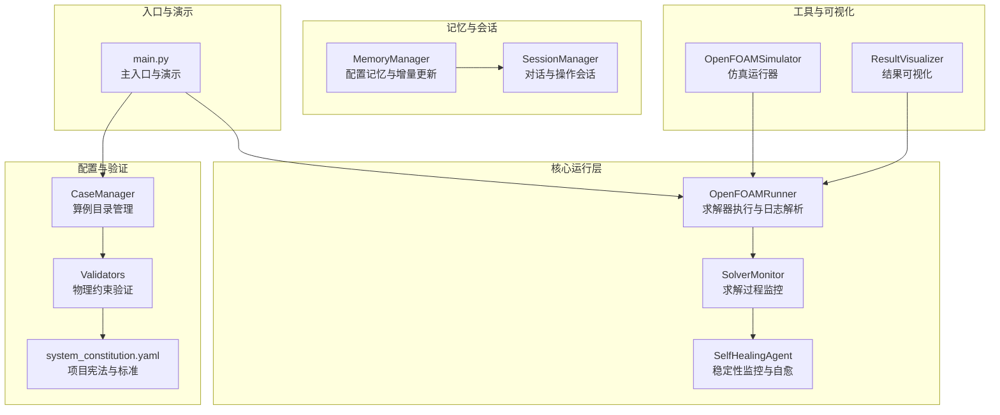
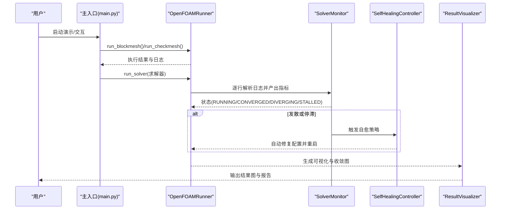
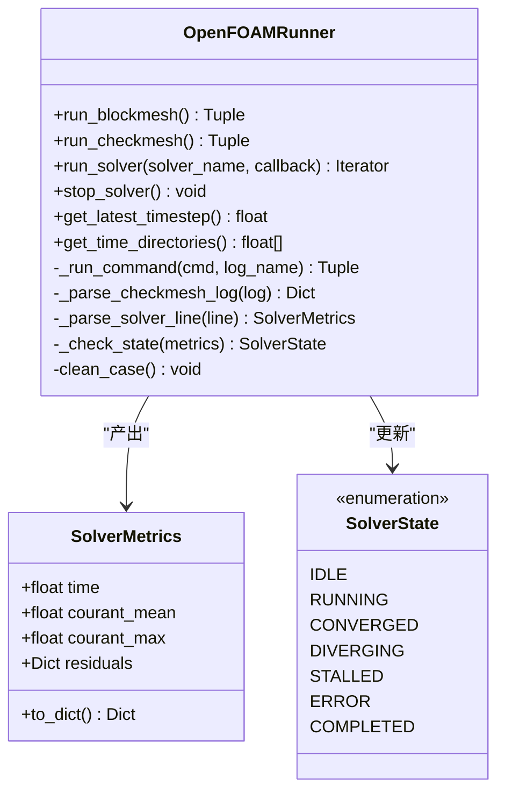
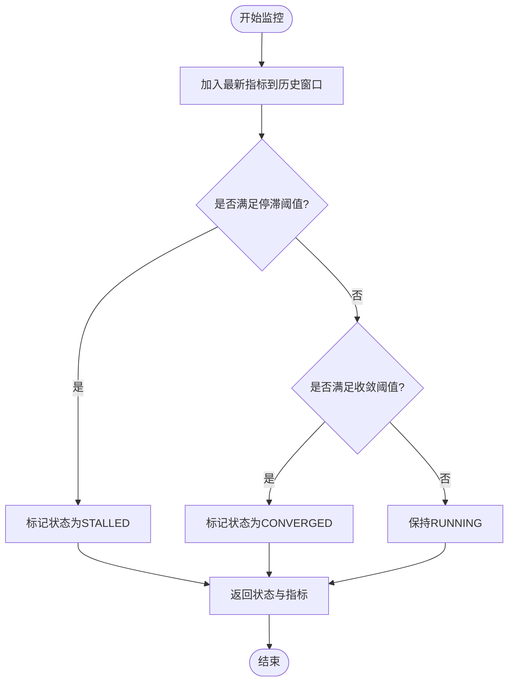
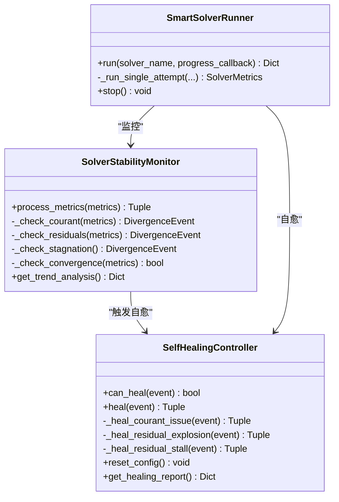
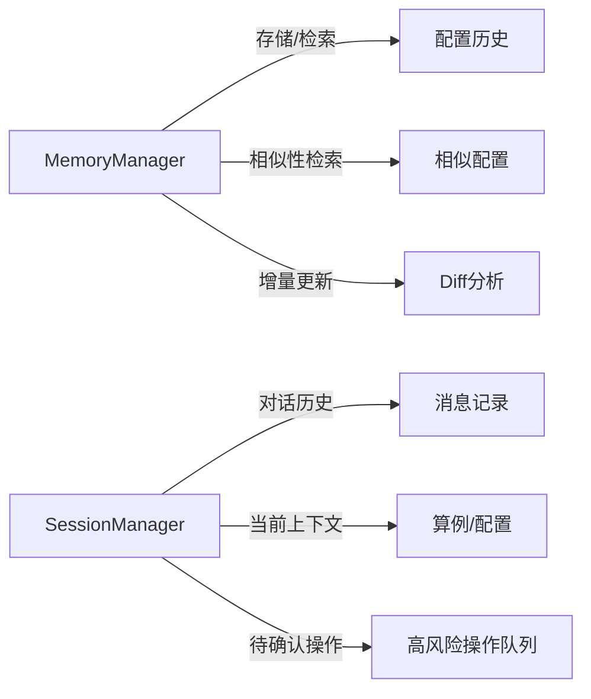
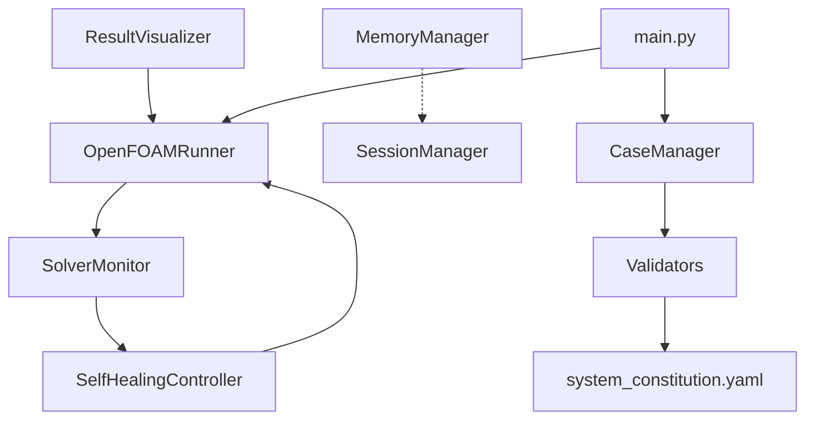

# 性能监控与分析

<cite>
**本文档引用的文件**
- [openfoam_ai/core/openfoam_runner.py](file://openfoam_ai/core/openfoam_runner.py)
- [openfoam_ai/core/case_manager.py](file://openfoam_ai/core/case_manager.py)
- [openfoam_ai/memory/memory_manager.py](file://openfoam_ai/memory/memory_manager.py)
- [openfoam_ai/memory/session_manager.py](file://openfoam_ai/memory/session_manager.py)
- [openfoam_ai/utils/of_simulator.py](file://openfoam_ai/utils/of_simulator.py)
- [openfoam_ai/utils/result_visualizer.py](file://openfoam_ai/utils/result_visualizer.py)
- [openfoam_ai/agents/self_healing_agent.py](file://openfoam_ai/agents/self_healing_agent.py)
- [openfoam_ai/main.py](file://openfoam_ai/main.py)
- [openfoam_ai/config/system_constitution.yaml](file://openfoam_ai/config/system_constitution.yaml)
- [openfoam_ai/core/validators.py](file://openfoam_ai/core/validators.py)
</cite>

## 目录
1. [简介](#简介)
2. [项目结构](#项目结构)
3. [核心组件](#核心组件)
4. [架构总览](#架构总览)
5. [详细组件分析](#详细组件分析)
6. [依赖关系分析](#依赖关系分析)
7. [性能考虑](#性能考虑)
8. [故障排查指南](#故障排查指南)
9. [结论](#结论)
10. [附录](#附录)

## 简介
本指南面向OpenFOAM AI项目的性能监控与分析需求，系统阐述如何在OpenFOAM求解器执行过程中进行实时监控、异常检测与自愈、性能指标采集与分析，并提供针对不同应用场景的监控策略与分析报告模板。文档结合项目现有代码实现，重点覆盖以下方面：
- 求解器执行过程的实时监控：库朗数、残差、收敛状态与停滞检测
- 异常检测与自愈机制：基于阈值的发散检测与自动修复
- 性能分析工具链：日志解析、可视化与报告生成
- 关键性能指标（KPI）定义与计算：执行时间、资源消耗、吞吐量
- 瓶颈识别与诊断：热点分析、调用栈分析与内存泄漏检测思路
- 基准测试与回归测试：实施方案与效果量化评估

## 项目结构
OpenFOAM AI项目采用模块化设计，核心围绕“算例管理、求解器运行、监控与自愈、记忆与会话、结果可视化”五大模块展开。整体结构如下：

**图表来源**
- [openfoam_ai/core/openfoam_runner.py:44-548](file://openfoam_ai/core/openfoam_runner.py#L44-L548)
- [openfoam_ai/core/case_manager.py:27-639](file://openfoam_ai/core/case_manager.py#L27-L639)
- [openfoam_ai/memory/memory_manager.py:198-800](file://openfoam_ai/memory/memory_manager.py#L198-L800)
- [openfoam_ai/memory/session_manager.py:171-565](file://openfoam_ai/memory/session_manager.py#L171-L565)
- [openfoam_ai/utils/of_simulator.py:13-180](file://openfoam_ai/utils/of_simulator.py#L13-L180)
- [openfoam_ai/utils/result_visualizer.py:14-353](file://openfoam_ai/utils/result_visualizer.py#L14-L353)
- [openfoam_ai/agents/self_healing_agent.py:58-642](file://openfoam_ai/agents/self_healing_agent.py#L58-L642)
- [openfoam_ai/main.py:1-251](file://openfoam_ai/main.py#L1-L251)
- [openfoam_ai/config/system_constitution.yaml:1-103](file://openfoam_ai/config/system_constitution.yaml#L1-L103)
- [openfoam_ai/core/validators.py:13-441](file://openfoam_ai/core/validators.py#L13-L441)

**章节来源**
- [openfoam_ai/main.py:1-251](file://openfoam_ai/main.py#L1-L251)
- [openfoam_ai/core/openfoam_runner.py:44-548](file://openfoam_ai/core/openfoam_runner.py#L44-L548)

## 核心组件
- OpenFOAMRunner：封装OpenFOAM命令执行、日志捕获与解析，提供实时指标产出与状态机管理
- SolverMonitor：基于历史指标进行停滞与收敛检测，提供监控摘要
- SelfHealingAgent：稳定性监控与自愈控制器，支持多种发散类型的自动修复
- CaseManager：算例目录结构管理、清理与状态维护
- MemoryManager：配置历史记忆、相似性检索与增量更新
- SessionManager：多轮对话上下文、待确认操作与持久化
- OpenFOAMSimulator：简化版仿真运行器，便于演示与测试
- ResultVisualizer：结果可视化与收敛监控图生成
- Validators与system_constitution.yaml：物理约束与标准配置，保障配置合法性

**章节来源**
- [openfoam_ai/core/openfoam_runner.py:44-548](file://openfoam_ai/core/openfoam_runner.py#L44-L548)
- [openfoam_ai/agents/self_healing_agent.py:58-642](file://openfoam_ai/agents/self_healing_agent.py#L58-L642)
- [openfoam_ai/core/case_manager.py:27-639](file://openfoam_ai/core/case_manager.py#L27-L639)
- [openfoam_ai/memory/memory_manager.py:198-800](file://openfoam_ai/memory/memory_manager.py#L198-L800)
- [openfoam_ai/memory/session_manager.py:171-565](file://openfoam_ai/memory/session_manager.py#L171-L565)
- [openfoam_ai/utils/of_simulator.py:13-180](file://openfoam_ai/utils/of_simulator.py#L13-L180)
- [openfoam_ai/utils/result_visualizer.py:14-353](file://openfoam_ai/utils/result_visualizer.py#L14-L353)
- [openfoam_ai/core/validators.py:13-441](file://openfoam_ai/core/validators.py#L13-L441)
- [openfoam_ai/config/system_constitution.yaml:1-103](file://openfoam_ai/config/system_constitution.yaml#L1-L103)

## 架构总览
OpenFOAM AI的性能监控与分析体系由“执行层—监控层—自愈层—存储与会话层—可视化层”构成，形成闭环的监控与反馈机制。

**图表来源**
- [openfoam_ai/main.py:101-173](file://openfoam_ai/main.py#L101-L173)
- [openfoam_ai/core/openfoam_runner.py:99-198](file://openfoam_ai/core/openfoam_runner.py#L99-L198)
- [openfoam_ai/agents/self_healing_agent.py:479-615](file://openfoam_ai/agents/self_healing_agent.py#L479-L615)
- [openfoam_ai/utils/result_visualizer.py:20-79](file://openfoam_ai/utils/result_visualizer.py#L20-L79)

## 详细组件分析

### OpenFOAMRunner：求解器执行与实时监控
- 功能要点
  - 执行blockMesh、checkMesh与求解器命令，捕获标准输出并逐行解析
  - 解析库朗数与残差，构建SolverMetrics并驱动状态机
  - 提供清理算例、时间步目录管理与日志写入能力
- 实时监控
  - 通过正则表达式解析日志中的Time/Courant/Residuals
  - 基于阈值判断发散（Courant数、残差大小）
  - 通过回调函数将日志行传递给上层处理
- 异常处理
  - 进程启动失败、权限不足、日志解码错误等均进行容错与状态标记

**图表来源**
- [openfoam_ai/core/openfoam_runner.py:44-548](file://openfoam_ai/core/openfoam_runner.py#L44-L548)

**章节来源**
- [openfoam_ai/core/openfoam_runner.py:77-198](file://openfoam_ai/core/openfoam_runner.py#L77-L198)
- [openfoam_ai/core/openfoam_runner.py:303-387](file://openfoam_ai/core/openfoam_runner.py#L303-L387)
- [openfoam_ai/core/openfoam_runner.py:389-408](file://openfoam_ai/core/openfoam_runner.py#L389-L408)

### SolverMonitor：收敛与停滞检测
- 功能要点
  - 维护指标历史窗口，检测停滞与收敛
  - 基于残差变化率与阈值判断停滞
  - 提供监控摘要（最终时间、库朗数、残差、总步数、最终状态）
- 关键算法
  - 停滞检测：最近N步内残差波动幅度小于阈值
  - 收敛检测：所有残差均低于目标阈值

**图表来源**
- [openfoam_ai/core/openfoam_runner.py:446-501](file://openfoam_ai/core/openfoam_runner.py#L446-L501)

**章节来源**
- [openfoam_ai/core/openfoam_runner.py:446-516](file://openfoam_ai/core/openfoam_runner.py#L446-L516)

### SelfHealingAgent：稳定性监控与自愈
- 功能要点
  - 实时解析指标，检测库朗数超标、残差爆炸、残差停滞等发散类型
  - 根据发散类型自动调整求解参数（如时间步长、松弛因子、非正交修正器）
  - 限制最大自愈尝试次数，支持恢复到原始配置
- 自愈策略
  - 库朗数问题：减小时间步长并从最新时间步重启
  - 残差爆炸：减小松弛因子
  - 残差停滞：增加非正交修正器
- 报告与历史
  - 记录每次自愈动作与原因，生成自愈报告

**图表来源**
- [openfoam_ai/agents/self_healing_agent.py:58-642](file://openfoam_ai/agents/self_healing_agent.py#L58-L642)

**章节来源**
- [openfoam_ai/agents/self_healing_agent.py:86-196](file://openfoam_ai/agents/self_healing_agent.py#L86-L196)
- [openfoam_ai/agents/self_healing_agent.py:277-441](file://openfoam_ai/agents/self_healing_agent.py#L277-L441)
- [openfoam_ai/agents/self_healing_agent.py:479-615](file://openfoam_ai/agents/self_healing_agent.py#L479-L615)

### MemoryManager与SessionManager：配置记忆与会话上下文
- MemoryManager
  - 存储算例配置历史，支持相似性检索与增量更新（Diff update）
  - 提供配置差异分析与回滚能力
- SessionManager
  - 管理会话历史、当前算例上下文与待确认操作
  - 支持高风险操作的确认与风险等级管理

**图表来源**
- [openfoam_ai/memory/memory_manager.py:198-800](file://openfoam_ai/memory/memory_manager.py#L198-L800)
- [openfoam_ai/memory/session_manager.py:171-565](file://openfoam_ai/memory/session_manager.py#L171-L565)

**章节来源**
- [openfoam_ai/memory/memory_manager.py:291-520](file://openfoam_ai/memory/memory_manager.py#L291-L520)
- [openfoam_ai/memory/session_manager.py:304-440](file://openfoam_ai/memory/session_manager.py#L304-L440)

### ResultVisualizer：结果可视化与收敛监控
- 功能要点
  - 生成速度场/压力场云图、流线图、涡量图
  - 从日志读取残差并绘制收敛监控图
  - 支持局部放大区域与圆柱几何标注
- 适用场景
  - 结果验证、可视化报告生成、收敛性分析

**章节来源**
- [openfoam_ai/utils/result_visualizer.py:20-79](file://openfoam_ai/utils/result_visualizer.py#L20-L79)
- [openfoam_ai/utils/result_visualizer.py:247-298](file://openfoam_ai/utils/result_visualizer.py#L247-L298)

## 依赖关系分析
- 组件耦合
  - OpenFOAMRunner与SolverMonitor：Runner产出指标，Monitor消费指标并更新状态
  - SelfHealingController依赖Runner的配置文件（controlDict/fvSolution）进行自动修复
  - ResultVisualizer依赖Runner产生的日志与时间步数据
  - MemoryManager与SessionManager为上层交互提供上下文与历史
- 外部依赖
  - OpenFOAM命令行工具（blockMesh/checkMesh/求解器）
  - Python子进程与正则表达式（日志解析）
  - Matplotlib（结果可视化）

**图表来源**
- [openfoam_ai/core/openfoam_runner.py:44-548](file://openfoam_ai/core/openfoam_runner.py#L44-L548)
- [openfoam_ai/agents/self_healing_agent.py:479-642](file://openfoam_ai/agents/self_healing_agent.py#L479-L642)
- [openfoam_ai/utils/result_visualizer.py:14-353](file://openfoam_ai/utils/result_visualizer.py#L14-L353)
- [openfoam_ai/memory/memory_manager.py:198-800](file://openfoam_ai/memory/memory_manager.py#L198-L800)
- [openfoam_ai/memory/session_manager.py:171-565](file://openfoam_ai/memory/session_manager.py#L171-L565)
- [openfoam_ai/main.py:1-251](file://openfoam_ai/main.py#L1-L251)
- [openfoam_ai/core/case_manager.py:27-639](file://openfoam_ai/core/case_manager.py#L27-L639)
- [openfoam_ai/core/validators.py:13-441](file://openfoam_ai/core/validators.py#L13-L441)
- [openfoam_ai/config/system_constitution.yaml:1-103](file://openfoam_ai/config/system_constitution.yaml#L1-L103)

**章节来源**
- [openfoam_ai/core/openfoam_runner.py:44-548](file://openfoam_ai/core/openfoam_runner.py#L44-L548)
- [openfoam_ai/agents/self_healing_agent.py:479-642](file://openfoam_ai/agents/self_healing_agent.py#L479-L642)

## 性能考虑
- 日志解析性能
  - 使用逐行读取与正则匹配，建议在高并发或多算例场景下增加缓冲与批处理
  - 对于超大日志文件，可考虑分段解析与异步写入
- 指标历史窗口
  - SolverMonitor维护固定长度历史窗口，避免内存无限增长；可根据硬件资源调整窗口大小
- 自愈策略成本
  - 自愈涉及文件读写与求解器重启，应限制最大尝试次数并记录开销
- 可视化开销
  - Matplotlib绘图适合离线生成，实时生成大量图像可能影响性能；建议按需生成或批量导出

[本节为通用性能讨论，无需源码引用]

## 故障排查指南
- 常见问题与定位
  - 求解器启动失败：检查OpenFOAM安装与PATH，查看进程启动异常与权限错误
  - 日志解码错误：忽略非法编码行并继续处理，避免中断求解流程
  - 发散与停滞：通过SolverMonitor与SelfHealingAgent的事件与建议进行定位与修复
- 自愈流程
  - 库朗数超标：减小时间步长并从最新时间步重启
  - 残差爆炸：降低松弛因子
  - 残差停滞：增加非正交修正器
- 回滚与恢复
  - 使用SelfHealingController备份原始配置，必要时一键恢复

**章节来源**
- [openfoam_ai/core/openfoam_runner.py:127-142](file://openfoam_ai/core/openfoam_runner.py#L127-L142)
- [openfoam_ai/agents/self_healing_agent.py:302-350](file://openfoam_ai/agents/self_healing_agent.py#L302-L350)
- [openfoam_ai/agents/self_healing_agent.py:449-461](file://openfoam_ai/agents/self_healing_agent.py#L449-L461)

## 结论
OpenFOAM AI项目已具备完善的求解器执行监控与自愈能力，能够实现实时指标解析、异常检测与自动修复，并通过记忆与会话模块实现配置历史与交互上下文的管理。结合可视化工具，可形成从“监控—诊断—修复—验证”的闭环体系。后续可在日志解析性能、指标历史窗口优化、自愈策略成本控制与可视化批量导出等方面进一步提升。

[本节为总结性内容，无需源码引用]

## 附录

### 关键性能指标（KPI）定义与计算
- 执行时间统计
  - 单命令执行耗时：通过命令执行前后的时间戳差计算
  - 求解器总时长：从启动到结束的总耗时（含重启）
- 资源消耗评估
  - CPU利用率：可通过系统工具（如psutil）在外部采集（本项目未内置）
  - 内存使用：可通过系统工具在外部采集（本项目未内置）
  - 磁盘I/O：通过系统工具在外部采集（本项目未内置）
  - 网络性能：本项目为本地仿真，暂不涉及网络性能
- 吞吐量测量
  - 时间步/秒：总时间步数除以总执行时间
  - 内存占用峰值：通过系统工具在外部采集（本项目未内置）

[本节为概念性说明，无需源码引用]

### 性能分析工具使用方法
- Python性能分析器
  - cProfile：对关键函数（如日志解析、指标计算）进行采样，定位热点
  - line_profiler：逐行分析热点代码，指导优化
- 内存分析工具
  - memory_profiler：跟踪内存分配热点，辅助发现潜在泄漏
  - tracemalloc：获取调用栈与内存分配关系
- 系统监控工具
  - top/htop：观察CPU与内存使用
  - iostat：监控磁盘I/O
  - netstat/ss：监控网络连接（本项目为本地仿真，较少使用）

[本节为通用工具说明，无需源码引用]

### 瓶颈识别与诊断技术
- 热点分析
  - 使用cProfile/line_profiler对日志解析与指标计算进行采样
- 调用栈分析
  - 结合memory_profiler与tracemalloc，定位内存分配热点与调用链
- 内存泄漏检测
  - 通过memory_profiler对比不同阶段的内存曲线，识别异常增长

[本节为通用技术说明，无需源码引用]

### 基准测试与回归测试实施方案
- 基准测试
  - 选择标准算例（如驱动方腔、阶梯流场）在相同网格与参数下运行
  - 记录执行时间、收敛步数、资源消耗等KPI
- 回归测试
  - 对关键配置变更（如时间步长、松弛因子、网格细化）进行对比
  - 通过MemoryManager记录配置历史，便于回溯与对比

[本节为通用流程说明，无需源码引用]

### 性能优化效果量化评估
- 指标对比
  - 优化前后KPI对比（执行时间、收敛步数、资源消耗）
- 报告模板
  - 执行摘要、配置对比、KPI对比表、可视化图表、结论与建议

[本节为通用模板说明，无需源码引用]