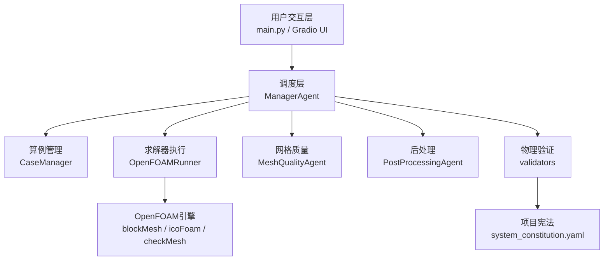
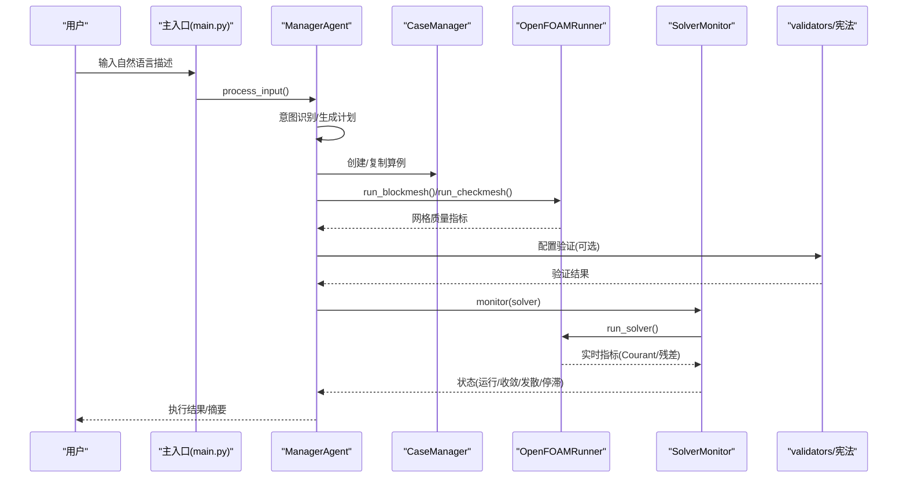
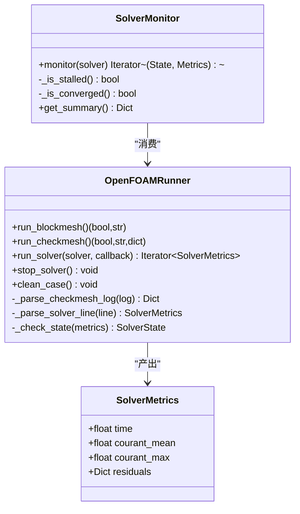
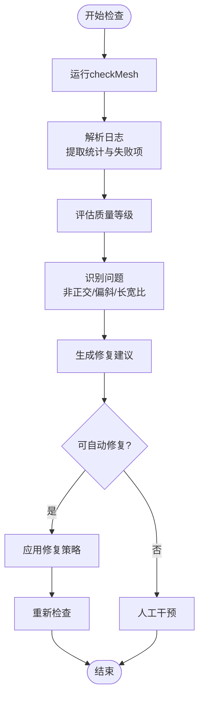
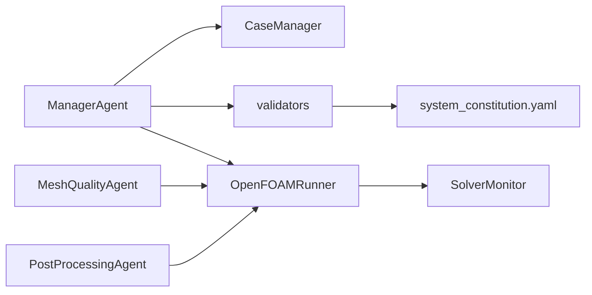

# 求解器性能优化

<cite>
**本文档引用的文件**
- [openfoam_ai/core/openfoam_runner.py](file://openfoam_ai/core/openfoam_runner.py)
- [openfoam_ai/core/case_manager.py](file://openfoam_ai/core/case_manager.py)
- [openfoam_ai/agents/mesh_quality_agent.py](file://openfoam_ai/agents/mesh_quality_agent.py)
- [openfoam_ai/agents/postprocessing_agent.py](file://openfoam_ai/agents/postprocessing_agent.py)
- [openfoam_ai/utils/of_simulator.py](file://openfoam_ai/utils/of_simulator.py)
- [openfoam_ai/core/validators.py](file://openfoam_ai/core/validators.py)
- [openfoam_ai/config/system_constitution.yaml](file://openfoam_ai/config/system_constitution.yaml)
- [openfoam_ai/agents/manager_agent.py](file://openfoam_ai/agents/manager_agent.py)
- [openfoam_ai/main.py](file://openfoam_ai/main.py)
</cite>

## 目录
1. [引言](#引言)
2. [项目结构](#项目结构)
3. [核心组件](#核心组件)
4. [架构总览](#架构总览)
5. [详细组件分析](#详细组件分析)
6. [依赖关系分析](#依赖关系分析)
7. [性能考虑](#性能考虑)
8. [故障排除指南](#故障排除指南)
9. [结论](#结论)
10. [附录](#附录)

## 引言
本指南面向使用OpenFOAM AI项目的工程师与研究人员，聚焦于求解器性能优化的系统性方法。内容涵盖求解器参数调优、收敛加速、数值稳定性、网格优化、资源利用、仿真监控与实时性能分析，并提供针对不同物理问题的求解器选择策略与大规模算例的优化方案。

## 项目结构
OpenFOAM AI采用模块化设计，围绕“交互-调度-执行-后处理”主线组织：
- 交互层：主入口与UI负责用户输入与流程编排
- 调度层：Manager Agent解析意图、生成计划、协调执行
- 执行层：CaseManager、OpenFOAMRunner封装OpenFOAM命令与监控
- 质量保障：validators与system_constitution.yaml提供硬约束与防错机制
- 后处理：PostProcessing Agent提供可视化与结果验证

**图表来源**
- [openfoam_ai/main.py:1-251](file://openfoam_ai/main.py#L1-L251)
- [openfoam_ai/agents/manager_agent.py:1-458](file://openfoam_ai/agents/manager_agent.py#L1-L458)
- [openfoam_ai/core/case_manager.py:1-639](file://openfoam_ai/core/case_manager.py#L1-L639)
- [openfoam_ai/core/openfoam_runner.py:1-548](file://openfoam_ai/core/openfoam_runner.py#L1-L548)
- [openfoam_ai/agents/mesh_quality_agent.py:1-547](file://openfoam_ai/agents/mesh_quality_agent.py#L1-L547)
- [openfoam_ai/agents/postprocessing_agent.py:1-588](file://openfoam_ai/agents/postprocessing_agent.py#L1-L588)
- [openfoam_ai/core/validators.py:1-441](file://openfoam_ai/core/validators.py#L1-L441)
- [openfoam_ai/config/system_constitution.yaml:1-103](file://openfoam_ai/config/system_constitution.yaml#L1-L103)

**章节来源**
- [openfoam_ai/README.md:104-128](file://openfoam_ai/README.md#L104-L128)

## 核心组件
- OpenFOAMRunner：封装OpenFOAM命令执行、日志捕获、指标解析与状态判定，支持实时监控与异常检测
- CaseManager：标准化算例目录结构、复制模板、清理与状态管理
- MeshQualityAgent：基于checkMesh深度解析网格质量，提供自动修复建议与策略
- PostProcessingAgent：自然语言到绘图的转换、PyVista脚本生成与结果验证
- validators + system_constitution.yaml：基于Pydantic的硬约束与宪法规则，防止不合理的配置
- ManagerAgent：任务调度、意图识别、计划生成与执行协调
- OpenFOAMSimulator：简易仿真运行器，提供网格生成、求解器运行与残差提取

**章节来源**
- [openfoam_ai/core/openfoam_runner.py:44-548](file://openfoam_ai/core/openfoam_runner.py#L44-L548)
- [openfoam_ai/core/case_manager.py:27-262](file://openfoam_ai/core/case_manager.py#L27-L262)
- [openfoam_ai/agents/mesh_quality_agent.py:61-547](file://openfoam_ai/agents/mesh_quality_agent.py#L61-L547)
- [openfoam_ai/agents/postprocessing_agent.py:108-588](file://openfoam_ai/agents/postprocessing_agent.py#L108-L588)
- [openfoam_ai/core/validators.py:13-441](file://openfoam_ai/core/validators.py#L13-L441)
- [openfoam_ai/config/system_constitution.yaml:1-103](file://openfoam_ai/config/system_constitution.yaml#L1-L103)
- [openfoam_ai/agents/manager_agent.py:38-458](file://openfoam_ai/agents/manager_agent.py#L38-L458)
- [openfoam_ai/utils/of_simulator.py:13-180](file://openfoam_ai/utils/of_simulator.py#L13-L180)

## 架构总览
下图展示了从用户输入到求解器执行与监控的关键交互路径，以及质量与验证机制的嵌入点。

**图表来源**
- [openfoam_ai/main.py:37-100](file://openfoam_ai/main.py#L37-L100)
- [openfoam_ai/agents/manager_agent.py:75-339](file://openfoam_ai/agents/manager_agent.py#L75-L339)
- [openfoam_ai/core/case_manager.py:51-241](file://openfoam_ai/core/case_manager.py#L51-L241)
- [openfoam_ai/core/openfoam_runner.py:77-198](file://openfoam_ai/core/openfoam_runner.py#L77-L198)
- [openfoam_ai/core/validators.py:389-441](file://openfoam_ai/core/validators.py#L389-L441)

## 详细组件分析

### OpenFOAMRunner：求解器执行与监控
- 关键职责
  - 执行blockMesh、checkMesh与求解器命令
  - 实时解析日志，提取Courant数与残差
  - 基于阈值判定求解状态（运行/收敛/发散/停滞/完成）
  - 支持停止求解器与清理算例
- 性能相关要点
  - Courant数上限与残差阈值来自system_constitution.yaml
  - 实时指标用于早期发现发散与停滞
  - 日志文件落盘便于离线分析与回放
- 优化建议
  - 合理设置写入间隔与时间步长，避免日志过多导致I/O瓶颈
  - 在回调中加入轻量级指标聚合，减少频繁磁盘写入
  - 对长时间运行的算例启用自动清理策略（保留必要日志）

**图表来源**
- [openfoam_ai/core/openfoam_runner.py:44-517](file://openfoam_ai/core/openfoam_runner.py#L44-L517)

**章节来源**
- [openfoam_ai/core/openfoam_runner.py:77-198](file://openfoam_ai/core/openfoam_runner.py#L77-L198)
- [openfoam_ai/core/openfoam_runner.py:347-409](file://openfoam_ai/core/openfoam_runner.py#L347-L409)
- [openfoam_ai/core/openfoam_runner.py:429-517](file://openfoam_ai/core/openfoam_runner.py#L429-L517)

### CaseManager：算例生命周期管理
- 关键职责
  - 创建/复制/删除/清理算例
  - 标准化目录结构（0/, constant/, system/, logs/）
  - 状态维护与信息持久化（.case_info.json）
- 性能相关要点
  - 清理时保留必要的日志与结果，避免重复下载
  - 并行目录（processor*）的清理有助于后续并行运行
- 优化建议
  - 在清理策略中区分“保留结果”与“仅清理中间步”
  - 对大型算例启用增量清理，减少I/O开销

**章节来源**
- [openfoam_ai/core/case_manager.py:51-241](file://openfoam_ai/core/case_manager.py#L51-L241)
- [openfoam_ai/core/case_manager.py:148-194](file://openfoam_ai/core/case_manager.py#L148-L194)

### MeshQualityAgent：网格质量评估与自动修复
- 关键职责
  - 执行checkMesh并深度解析质量指标
  - 评估质量等级（优秀/良好/可接受/较差/严重）
  - 生成问题清单与修复建议
  - 自动修复策略（如添加非正交修正器）
- 质量阈值与建议
  - 非正交性、偏斜度、长宽比等指标阈值来源于system_constitution.yaml
  - 针对性建议包括修正器数量调整、边界层加密与网格重划
- 优化建议
  - 在自动修复后重新checkMesh，形成闭环
  - 对严重问题（失败检查数>0）拒绝自动修复，转人工干预

**图表来源**
- [openfoam_ai/agents/mesh_quality_agent.py:111-178](file://openfoam_ai/agents/mesh_quality_agent.py#L111-L178)
- [openfoam_ai/agents/mesh_quality_agent.py:233-366](file://openfoam_ai/agents/mesh_quality_agent.py#L233-L366)

**章节来源**
- [openfoam_ai/agents/mesh_quality_agent.py:111-178](file://openfoam_ai/agents/mesh_quality_agent.py#L111-L178)
- [openfoam_ai/agents/mesh_quality_agent.py:233-366](file://openfoam_ai/agents/mesh_quality_agent.py#L233-L366)

### PostProcessingAgent：后处理与可视化
- 关键职责
  - 自然语言到绘图类型的映射
  - 自动生成PyVista脚本并执行渲染
  - 结果质量验证（收敛、守恒）
- 性能相关要点
  - Mock模式支持离线开发与测试
  - 可配置输出格式（PNG/PDF/SVG/VTK）
- 优化建议
  - 在生成脚本时指定高分辨率窗口尺寸，减少二次缩放
  - 对批量绘图采用批处理与并行渲染（在可用时）

**章节来源**
- [openfoam_ai/agents/postprocessing_agent.py:172-380](file://openfoam_ai/agents/postprocessing_agent.py#L172-L380)
- [openfoam_ai/agents/postprocessing_agent.py:493-529](file://openfoam_ai/agents/postprocessing_agent.py#L493-L529)

### validators + system_constitution.yaml：物理约束与防错
- 关键职责
  - Pydantic硬约束：网格分辨率、时间步长、求解器选择、边界条件
  - 宪法规则：网格质量、求解器标准、物性范围、禁止组合、质量/能量守恒容差
- 性能相关要点
  - 通过CFL估计与阈值提前规避不稳定配置
  - 禁止组合避免无效求解器/物理类型搭配
- 优化建议
  - 在配置生成阶段即进行约束检查，减少无效运行
  - 将宪法阈值作为默认参数，允许用户在严格模式下覆盖

**章节来源**
- [openfoam_ai/core/validators.py:13-441](file://openfoam_ai/core/validators.py#L13-L441)
- [openfoam_ai/config/system_constitution.yaml:13-83](file://openfoam_ai/config/system_constitution.yaml#L13-L83)

### ManagerAgent：任务调度与状态管理
- 关键职责
  - 意图识别、计划生成、执行协调
  - 与OpenFOAMRunner协作进行网格生成与求解监控
  - 状态更新与日志汇总
- 优化建议
  - 在执行计划中加入“确认”环节，降低高风险操作风险
  - 对长时间运行的算例提供进度汇报与异常提醒

**章节来源**
- [openfoam_ai/agents/manager_agent.py:75-339](file://openfoam_ai/agents/manager_agent.py#L75-L339)

### OpenFOAMSimulator：简易仿真运行器
- 关键职责
  - 检查OpenFOAM环境、生成网格、运行求解器、停止仿真
  - 提取残差历史用于分析
- 优化建议
  - 增加超时控制与资源限制
  - 支持异步运行与回调通知

**章节来源**
- [openfoam_ai/utils/of_simulator.py:13-180](file://openfoam_ai/utils/of_simulator.py#L13-L180)

## 依赖关系分析
- 组件耦合
  - ManagerAgent依赖CaseManager、OpenFOAMRunner、validators
  - OpenFOAMRunner被SolverMonitor消费，产出指标供监控使用
  - MeshQualityAgent依赖OpenFOAMRunner执行checkMesh
  - validators与system_constitution.yaml共同约束配置合法性
- 外部依赖
  - OpenFOAM命令（blockMesh、checkMesh、求解器）
  - 可选：PyVista（后处理）、ChromaDB（记忆模块，阶段三）

**图表来源**
- [openfoam_ai/agents/manager_agent.py:12-64](file://openfoam_ai/agents/manager_agent.py#L12-L64)
- [openfoam_ai/core/openfoam_runner.py:44-198](file://openfoam_ai/core/openfoam_runner.py#L44-L198)
- [openfoam_ai/agents/mesh_quality_agent.py:93-93](file://openfoam_ai/agents/mesh_quality_agent.py#L93-L93)
- [openfoam_ai/core/validators.py:13-15](file://openfoam_ai/core/validators.py#L13-L15)
- [openfoam_ai/config/system_constitution.yaml:1-103](file://openfoam_ai/config/system_constitution.yaml#L1-L103)
- [openfoam_ai/agents/postprocessing_agent.py:154-166](file://openfoam_ai/agents/postprocessing_agent.py#L154-L166)

**章节来源**
- [openfoam_ai/agents/manager_agent.py:1-458](file://openfoam_ai/agents/manager_agent.py#L1-L458)
- [openfoam_ai/core/openfoam_runner.py:1-548](file://openfoam_ai/core/openfoam_runner.py#L1-L548)

## 性能考虑
- 求解器参数调优
  - 时间步长与CFL：依据system_constitution.yaml的max_courant_explicit/implicit限制，结合几何尺度估算合理Δt
  - 残差目标：min_convergence_residual用于收敛判定，避免过严导致不必要的迭代
  - 修正器：当非正交性偏高时，适度增加nNonOrthogonalCorrectors
- 收敛加速
  - 稳态问题：使用simpleFoam并提高relTol；瞬态问题：适当增大写入间隔以减少I/O
  - 速度-压力耦合：PISO循环次数与非正交修正器平衡
- 数值稳定性
  - Courant数上限：通用限制courant_limit_general，避免显式格式不稳定
  - 发散阈值：divergence_threshold用于早期发现异常
- 网格优化
  - 长宽比与偏斜度：严格控制max_aspect_ratio与skewness
  - 边界层：满足y+要求，渐进加密，增长率为system_constitution.yaml建议值
- 计算资源利用
  - CPU并行：利用OpenFOAM自带并行（decomposePar/runParallel），结合CaseManager清理processor目录
  - 内存优化：避免一次性加载过多时间步，定期清理中间结果
  - I/O性能：合理设置writeInterval，使用压缩关闭（如需要）与ASCII精度折中
- 仿真监控与实时分析
  - 实时监控：通过OpenFOAMRunner的回调与SolverMonitor的历史窗口检测停滞与发散
  - 指标采集：记录Courant数、残差、时间步进展，形成收敛曲线
- 大规模算例
  - 分区并行：先进行网格分区（decomposePar），再并行运行（mpirun）
  - 集群资源管理：结合SLURM/LSF提交作业，设置节点数、核心数与内存限制
- 硬件平台适配
  - CPU密集型：优先提高核心数，降低单核负载
  - GPU加速：若使用支持GPU的求解器（如特定版本OpenFOAM），可考虑启用

[本节为通用指导，不直接分析具体文件]

## 故障排除指南
- 常见问题与定位
  - OpenFOAM未安装/环境未就绪：主入口会检测blockMesh可用性，提示PATH问题
  - 配置验证失败：validators抛出Pydantic异常，检查几何、求解器与边界条件
  - 网格质量不达标：MeshQualityAgent给出质量等级与修复建议，严重问题需人工干预
  - 求解发散/停滞：OpenFOAMRunner基于Courant数与残差阈值判定，建议减小Δt或调整松弛因子
- 处理流程
  - 首先运行checkMesh，依据报告调整网格或修正器
  - 使用validators进行配置审查，确保满足宪法规则
  - 启动SolverMonitor观察收敛曲线，必要时调整求解参数
  - 对长时间运行算例，定期清理中间结果，避免磁盘空间耗尽

**章节来源**
- [openfoam_ai/main.py:230-247](file://openfoam_ai/main.py#L230-L247)
- [openfoam_ai/core/validators.py:389-441](file://openfoam_ai/core/validators.py#L389-L441)
- [openfoam_ai/agents/mesh_quality_agent.py:111-178](file://openfoam_ai/agents/mesh_quality_agent.py#L111-L178)
- [openfoam_ai/core/openfoam_runner.py:389-409](file://openfoam_ai/core/openfoam_runner.py#L389-L409)

## 结论
通过将“配置硬约束+网格质量+实时监控+后处理验证”贯穿整个工作流，OpenFOAM AI项目在自动化的同时确保了高性能与高可靠性。建议在实际工程中：
- 以system_constitution.yaml为基准配置求解参数
- 以MeshQualityAgent为入口进行网格质量把关
- 以OpenFOAMRunner/SolverMonitor为手段进行实时性能分析
- 以PostProcessingAgent为出口进行结果验证与报告生成

[本节为总结性内容，不直接分析具体文件]

## 附录
- 求解器选择策略（基于宪法与验证器）
  - 不可压缩流：icoFoam/simpleFoam/pimpleFoam
  - 自然对流：buoyantBoussinesqPimpleFoam/buoyantPimpleFoam
  - 禁止组合：如icoFoam用于可压流、simpleFoam用于瞬态等
- 物理参数范围
  - 运动粘度、密度、Prandtl数等范围由宪法约束，超出范围需谨慎评估
- 质量/能量守恒容差
  - 质量与能量守恒的容差在宪法中定义，后处理阶段可据此验证

**章节来源**
- [openfoam_ai/core/validators.py:204-264](file://openfoam_ai/core/validators.py#L204-L264)
- [openfoam_ai/config/system_constitution.yaml:33-43](file://openfoam_ai/config/system_constitution.yaml#L33-L43)
- [openfoam_ai/agents/postprocessing_agent.py:493-529](file://openfoam_ai/agents/postprocessing_agent.py#L493-L529)