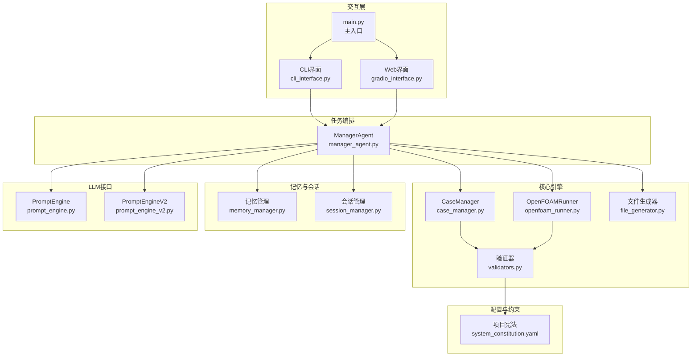
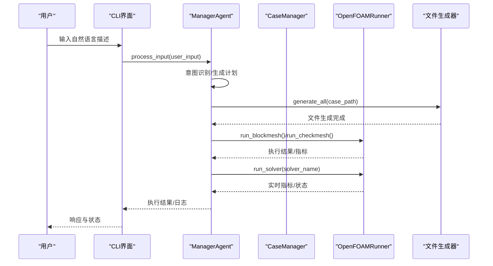
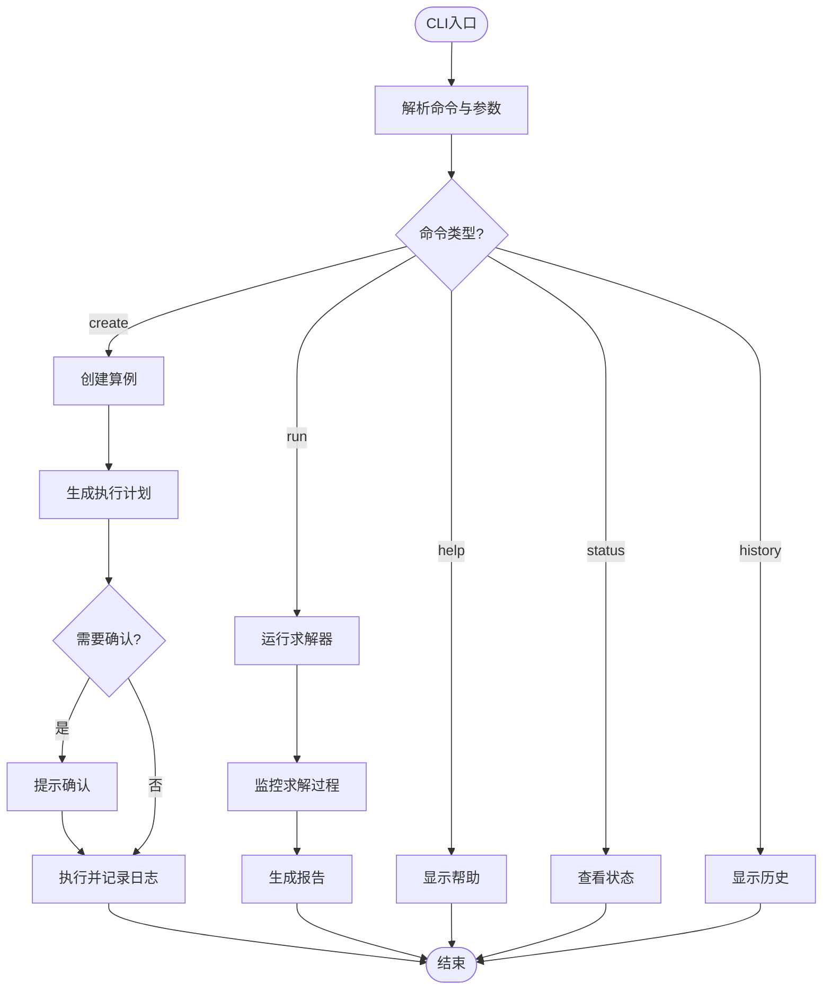
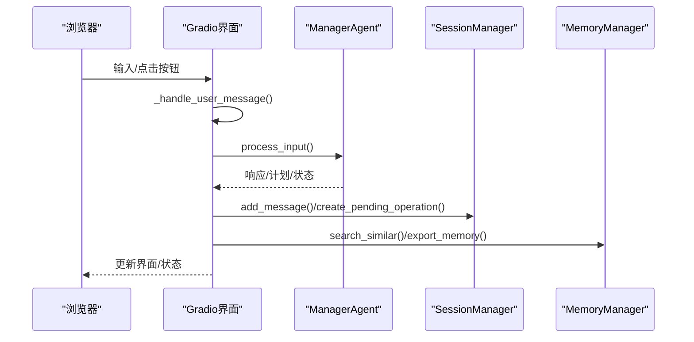
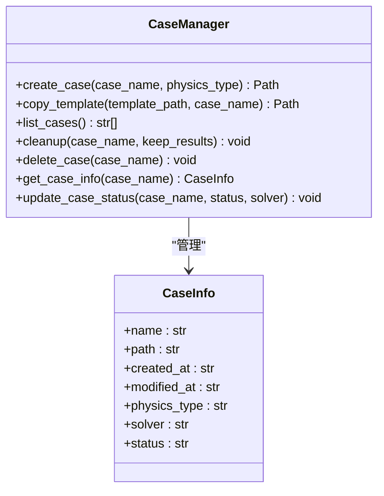
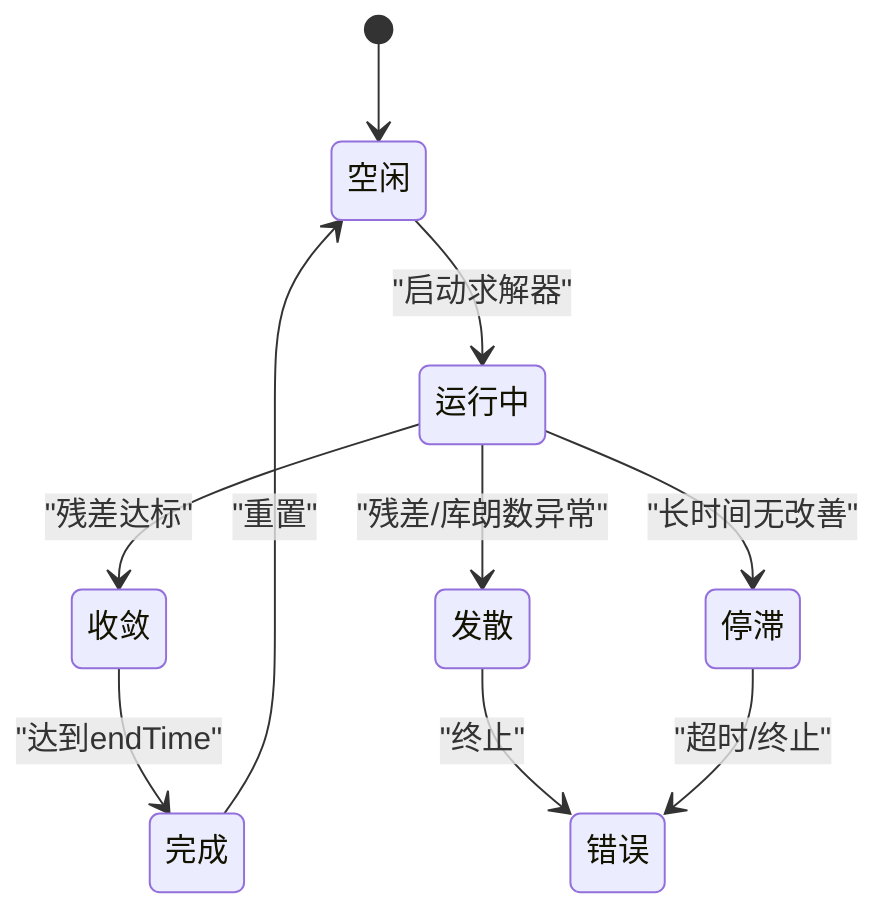
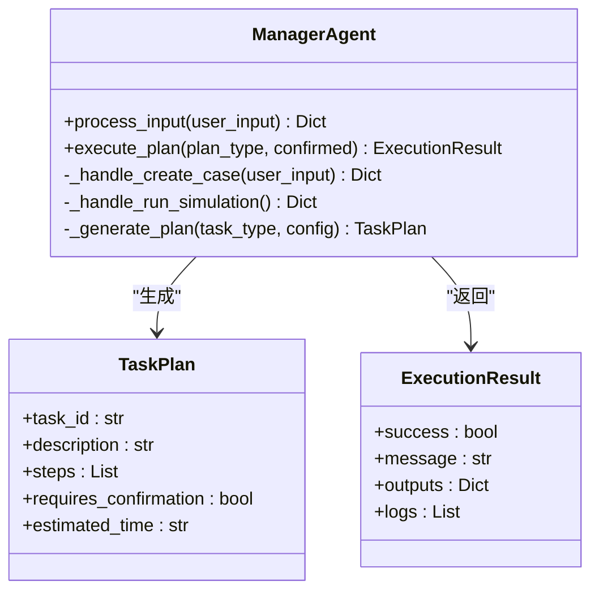
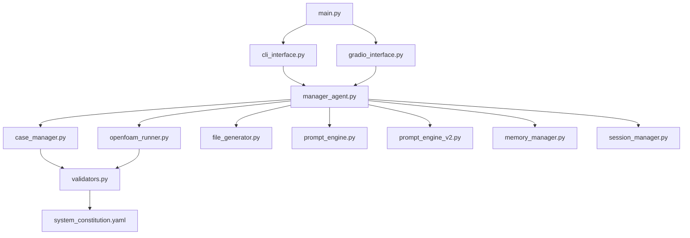

# API扩展点

<cite>
**本文引用的文件**
- [main.py](file://openfoam_ai/main.py)
- [cli_interface.py](file://openfoam_ai/ui/cli_interface.py)
- [gradio_interface.py](file://openfoam_ai/ui/gradio_interface.py)
- [manager_agent.py](file://openfoam_ai/agents/manager_agent.py)
- [case_manager.py](file://openfoam_ai/core/case_manager.py)
- [openfoam_runner.py](file://openfoam_ai/core/openfoam_runner.py)
- [validators.py](file://openfoam_ai/core/validators.py)
- [file_generator.py](file://openfoam_ai/core/file_generator.py)
- [memory_manager.py](file://openfoam_ai/memory/memory_manager.py)
- [session_manager.py](file://openfoam_ai/memory/session_manager.py)
- [prompt_engine.py](file://openfoam_ai/agents/prompt_engine.py)
- [prompt_engine_v2.py](file://openfoam_ai/agents/prompt_engine_v2.py)
- [system_constitution.yaml](file://openfoam_ai/config/system_constitution.yaml)
- [README.md](file://openfoam_ai/README.md)
</cite>

## 目录
1. [简介](#简介)
2. [项目结构](#项目结构)
3. [核心组件](#核心组件)
4. [架构总览](#架构总览)
5. [详细组件分析](#详细组件分析)
6. [依赖分析](#依赖分析)
7. [性能考量](#性能考量)
8. [故障排查指南](#故障排查指南)
9. [结论](#结论)
10. [附录](#附录)

## 简介
本指南面向希望在OpenFOAM AI项目中进行API扩展的开发者，系统讲解可扩展的接口点与设计原则，涵盖：
- CLI接口扩展：命令行参数解析、子命令注册、输出格式定制
- Web界面API扩展：基于Gradio的Web交互与前端集成
- 核心API扩展：CaseManager算例管理、OpenFOAMRunner求解器执行、ManagerAgent任务调度
- 自定义API端点：路由定义、请求处理、响应格式化
- 标准模板与安全考虑：认证授权、输入验证、错误处理
- API文档生成与测试验证

## 项目结构
项目采用模块化分层设计，核心模块包括：
- 交互层：main.py、CLI界面、Gradio界面
- 任务编排：ManagerAgent
- 核心引擎：CaseManager、OpenFOAMRunner、文件生成器
- 验证与约束：validators、system_constitution.yaml
- 记忆与会话：memory_manager、session_manager
- LLM接口：prompt_engine、prompt_engine_v2

**图表来源**
- [main.py:1-251](file://openfoam_ai/main.py#L1-L251)
- [cli_interface.py:1-401](file://openfoam_ai/ui/cli_interface.py#L1-L401)
- [gradio_interface.py:1-484](file://openfoam_ai/ui/gradio_interface.py#L1-L484)
- [manager_agent.py:1-458](file://openfoam_ai/agents/manager_agent.py#L1-L458)
- [case_manager.py:1-639](file://openfoam_ai/core/case_manager.py#L1-L639)
- [openfoam_runner.py:1-548](file://openfoam_ai/core/openfoam_runner.py#L1-L548)
- [file_generator.py:1-635](file://openfoam_ai/core/file_generator.py#L1-L635)
- [validators.py:1-441](file://openfoam_ai/core/validators.py#L1-L441)
- [memory_manager.py:1-804](file://openfoam_ai/memory/memory_manager.py#L1-L804)
- [session_manager.py:1-565](file://openfoam_ai/memory/session_manager.py#L1-L565)
- [prompt_engine.py:1-616](file://openfoam_ai/agents/prompt_engine.py#L1-L616)
- [prompt_engine_v2.py:1-541](file://openfoam_ai/agents/prompt_engine_v2.py#L1-L541)
- [system_constitution.yaml:1-103](file://openfoam_ai/config/system_constitution.yaml#L1-L103)

**章节来源**
- [README.md:130-150](file://openfoam_ai/README.md#L130-L150)

## 核心组件
- ManagerAgent：意图识别、计划生成、执行协调、与UI交互
- CaseManager：算例目录结构管理、复制模板、清理与删除
- OpenFOAMRunner：命令执行、日志解析、实时监控、状态判定
- PromptEngine/PromptEngineV2：自然语言到配置的转换、解释与改进建议
- validators：Pydantic硬约束与物理验证
- memory_manager/session_manager：记忆与会话状态管理
- file_generator：OpenFOAM字典文件生成

**章节来源**
- [manager_agent.py:38-458](file://openfoam_ai/agents/manager_agent.py#L38-L458)
- [case_manager.py:27-262](file://openfoam_ai/core/case_manager.py#L27-L262)
- [openfoam_runner.py:44-548](file://openfoam_ai/core/openfoam_runner.py#L44-L548)
- [prompt_engine.py:20-616](file://openfoam_ai/agents/prompt_engine.py#L20-L616)
- [prompt_engine_v2.py:24-541](file://openfoam_ai/agents/prompt_engine_v2.py#L24-L541)
- [validators.py:13-441](file://openfoam_ai/core/validators.py#L13-L441)
- [memory_manager.py:198-804](file://openfoam_ai/memory/memory_manager.py#L198-L804)
- [session_manager.py:171-565](file://openfoam_ai/memory/session_manager.py#L171-L565)
- [file_generator.py:506-635](file://openfoam_ai/core/file_generator.py#L506-L635)

## 架构总览
系统采用“交互层-任务编排-核心引擎-验证约束”的分层架构。交互层通过CLI或Web接收用户输入，ManagerAgent进行意图识别与计划生成，随后协调CaseManager、OpenFOAMRunner与文件生成器完成算例创建与求解，并通过validators与system_constitution.yaml确保配置合规。

**图表来源**
- [cli_interface.py:139-206](file://openfoam_ai/ui/cli_interface.py#L139-L206)
- [manager_agent.py:75-338](file://openfoam_ai/agents/manager_agent.py#L75-L338)
- [case_manager.py:51-86](file://openfoam_ai/core/case_manager.py#L51-L86)
- [openfoam_runner.py:77-198](file://openfoam_ai/core/openfoam_runner.py#L77-L198)
- [file_generator.py:515-532](file://openfoam_ai/core/file_generator.py#L515-L532)

## 详细组件分析

### CLI接口扩展
- 扩展点
  - 命令行参数解析：在main.py的argparse中新增子命令与参数
  - 子命令注册：在CLIInterface中新增命令处理逻辑
  - 输出格式定制：统一响应格式，支持JSON/表格/树形展示
- 开发流程
  1) 在main.py中定义新参数与子命令
  2) 在CLIInterface中新增命令分支与处理函数
  3) 在ManagerAgent中新增对应意图与执行逻辑
  4) 在UI层统一格式化输出
- 安全与健壮性
  - 参数校验与默认值
  - 异常捕获与降级输出
  - 会话状态持久化

**图表来源**
- [main.py:202-247](file://openfoam_ai/main.py#L202-L247)
- [cli_interface.py:118-132](file://openfoam_ai/ui/cli_interface.py#L118-L132)
- [manager_agent.py:106-140](file://openfoam_ai/agents/manager_agent.py#L106-L140)

**章节来源**
- [main.py:202-247](file://openfoam_ai/main.py#L202-L247)
- [cli_interface.py:90-138](file://openfoam_ai/ui/cli_interface.py#L90-L138)
- [manager_agent.py:176-206](file://openfoam_ai/agents/manager_agent.py#L176-L206)

### Web界面API扩展（Gradio）
- 扩展点
  - Gradio界面组件：聊天面板、状态显示、配置展示、记忆检索
  - 事件绑定：submit按钮、搜索按钮、导出按钮
  - 确认机制：高风险操作的确认提示与状态流转
- 开发流程
  1) 在GradioInterface中新增组件与布局
  2) 绑定事件处理函数（_handle_user_message/_handle_confirmation等）
  3) 与ManagerAgent/SessionManager/MemoryManager对接
  4) 配置启动参数（server_name/port/share）
- 集成要点
  - 与现有会话与记忆模块无缝集成
  - 实时状态更新与错误提示

**图表来源**
- [gradio_interface.py:99-194](file://openfoam_ai/ui/gradio_interface.py#L99-L194)
- [gradio_interface.py:364-392](file://openfoam_ai/ui/gradio_interface.py#L364-L392)
- [manager_agent.py:176-206](file://openfoam_ai/agents/manager_agent.py#L176-L206)
- [session_manager.py:304-334](file://openfoam_ai/memory/session_manager.py#L304-L334)
- [memory_manager.py:347-396](file://openfoam_ai/memory/memory_manager.py#L347-L396)

**章节来源**
- [gradio_interface.py:299-432](file://openfoam_ai/ui/gradio_interface.py#L299-L432)
- [session_manager.py:171-448](file://openfoam_ai/memory/session_manager.py#L171-L448)
- [memory_manager.py:198-346](file://openfoam_ai/memory/memory_manager.py#L198-L346)

### 核心API扩展

#### CaseManager算例管理API
- 扩展点
  - 创建/复制/清理/删除算例
  - 算例信息持久化与状态更新
  - 模板复制与批量操作
- 开发要点
  - 严格校验算例目录结构
  - 状态机管理（init/meshed/solving/converged/diverged/completed）
  - 与文件生成器协同生成标准目录结构

**图表来源**
- [case_manager.py:27-262](file://openfoam_ai/core/case_manager.py#L27-L262)

**章节来源**
- [case_manager.py:51-241](file://openfoam_ai/core/case_manager.py#L51-L241)

#### OpenFOAMRunner求解器执行API
- 扩展点
  - blockMesh/checkMesh执行与日志解析
  - 求解器实时监控与状态判定
  - 指标提取（时间、库朗数、残差）
- 开发要点
  - 进程管理与异常处理
  - 实时日志写入与指标解析
  - 状态机（idle/running/converged/diverging/stalled/error/completed）

**图表来源**
- [openfoam_runner.py:16-25](file://openfoam_ai/core/openfoam_runner.py#L16-L25)
- [openfoam_runner.py:389-409](file://openfoam_ai/core/openfoam_runner.py#L389-L409)

**章节来源**
- [openfoam_runner.py:77-198](file://openfoam_ai/core/openfoam_runner.py#L77-L198)
- [openfoam_runner.py:347-409](file://openfoam_ai/core/openfoam_runner.py#L347-L409)

#### ManagerAgent任务调度API
- 扩展点
  - 意图识别与计划生成
  - 执行结果封装与日志记录
  - 与UI层的交互协议
- 开发要点
  - 任务计划数据结构（TaskPlan）
  - 执行结果封装（ExecutionResult）
  - 与LLM接口的集成

**图表来源**
- [manager_agent.py:19-36](file://openfoam_ai/agents/manager_agent.py#L19-L36)
- [manager_agent.py:340-362](file://openfoam_ai/agents/manager_agent.py#L340-L362)
- [manager_agent.py:176-206](file://openfoam_ai/agents/manager_agent.py#L176-L206)

**章节来源**
- [manager_agent.py:75-338](file://openfoam_ai/agents/manager_agent.py#L75-L338)

### 自定义API端点开发流程
- 路由定义
  - 基于现有UI组件扩展新的交互入口
  - 在Gradio中新增组件与事件绑定
- 请求处理
  - 与ManagerAgent交互，传递用户输入
  - 与SessionManager/MemoryManager协作
- 响应格式化
  - 统一响应结构（type/message/logs/outputs）
  - 支持JSON/HTML/Markdown等多种格式

**章节来源**
- [gradio_interface.py:299-398](file://openfoam_ai/ui/gradio_interface.py#L299-L398)
- [manager_agent.py:176-206](file://openfoam_ai/agents/manager_agent.py#L176-L206)

### API标准模板与安全考虑
- 标准模板
  - 响应结构：type、message、logs、outputs
  - 计划结构：steps、requires_confirmation、estimated_time
  - 执行结果：success、message、outputs、logs
- 安全考虑
  - 输入验证：validators.py中的Pydantic模型
  - 宪法约束：system_constitution.yaml中的硬性规则
  - 风险操作：SessionManager中的高风险操作分级与确认机制
  - 错误处理：统一异常捕获与降级输出

**章节来源**
- [validators.py:13-441](file://openfoam_ai/core/validators.py#L13-L441)
- [system_constitution.yaml:1-103](file://openfoam_ai/config/system_constitution.yaml#L1-L103)
- [session_manager.py:182-201](file://openfoam_ai/memory/session_manager.py#L182-L201)

## 依赖分析
模块间依赖关系如下：

**图表来源**
- [main.py:19-21](file://openfoam_ai/main.py#L19-L21)
- [cli_interface.py:12-14](file://openfoam_ai/ui/cli_interface.py#L12-L14)
- [gradio_interface.py:26-28](file://openfoam_ai/ui/gradio_interface.py#L26-L28)
- [manager_agent.py:12-16](file://openfoam_ai/agents/manager_agent.py#L12-L16)
- [case_manager.py:6-12](file://openfoam_ai/core/case_manager.py#L6-L12)
- [openfoam_runner.py:6-13](file://openfoam_ai/core/openfoam_runner.py#L6-L13)
- [validators.py:6-11](file://openfoam_ai/core/validators.py#L6-L11)
- [memory_manager.py:22-28](file://openfoam_ai/memory/memory_manager.py#L22-L28)
- [session_manager.py:10-17](file://openfoam_ai/memory/session_manager.py#L10-L17)
- [prompt_engine.py:11-17](file://openfoam_ai/agents/prompt_engine.py#L11-L17)
- [prompt_engine_v2.py:16-21](file://openfoam_ai/agents/prompt_engine_v2.py#L16-L21)
- [system_constitution.yaml:1-3](file://openfoam_ai/config/system_constitution.yaml#L1-L3)

**章节来源**
- [README.md:130-150](file://openfoam_ai/README.md#L130-L150)

## 性能考量
- I/O与日志
  - 求解器日志实时写入，避免阻塞UI
  - 大文件写入采用缓冲与异步策略
- 并发与状态
  - 求解器运行状态机，避免重复执行
  - 会话与记忆的持久化采用增量保存
- 资源管理
  - 进程管理与资源回收
  - 网格与结果的清理策略

[本节为通用指导，无需具体文件引用]

## 故障排查指南
- 常见问题
  - OpenFOAM环境未就绪：检查blockMesh命令可用性
  - Pydantic验证失败：核对system_constitution.yaml中的约束
  - Gradio不可用：安装gradio或回退到CLI
  - 记忆库不可用：ChromaDB初始化失败时自动回退到模拟模式
- 调试建议
  - 启用详细日志：设置环境变量LOG_LEVEL=DEBUG
  - 使用Mock模式测试配置生成：PromptEngine(api_key=None)
  - 运行单元测试：pytest openfoam_ai/tests/
  - 检查算例目录结构：确保0/、constant/、system/目录存在

**章节来源**
- [README.md:208-237](file://openfoam_ai/README.md#L208-L237)

## 结论
通过以上扩展点与开发流程，开发者可以在不破坏现有架构的前提下，灵活扩展CLI与Web交互、增强核心引擎能力、完善API端点与安全机制。建议优先从UI扩展入手，逐步深入核心引擎与验证约束，确保扩展的稳定性与可维护性。

[本节为总结性内容，无需具体文件引用]

## 附录
- API文档生成
  - 基于现有模块注释与类型提示，可使用Sphinx/MyST生成文档
  - 建议为每个公共方法提供简短描述与参数说明
- 测试验证
  - 单元测试：针对核心模块（CaseManager、OpenFOAMRunner、validators）
  - 集成测试：CLI/Web与ManagerAgent的端到端流程
  - 回归测试：宪法规则变更后的兼容性验证

[本节为通用指导，无需具体文件引用]