# Agent开发模板与最佳实践

<cite>
**本文档引用的文件**
- [openfoam_ai/agents/__init__.py](file://openfoam_ai/agents/__init__.py)
- [openfoam_ai/agents/manager_agent.py](file://openfoam_ai/agents/manager_agent.py)
- [openfoam_ai/agents/prompt_engine.py](file://openfoam_ai/agents/prompt_engine.py)
- [openfoam_ai/agents/prompt_engine_v2.py](file://openfoam_ai/agents/prompt_engine_v2.py)
- [openfoam_ai/agents/critic_agent.py](file://openfoam_ai/agents/critic_agent.py)
- [openfoam_ai/agents/mesh_quality_agent.py](file://openfoam_ai/agents/mesh_quality_agent.py)
- [openfoam_ai/agents/self_healing_agent.py](file://openfoam_ai/agents/self_healing_agent.py)
- [openfoam_ai/agents/physics_validation_agent.py](file://openfoam_ai/agents/physics_validation_agent.py)
- [openfoam_ai/agents/postprocessing_agent.py](file://openfoam_ai/agents/postprocessing_agent.py)
- [openfoam_ai/agents/geometry_image_agent.py](file://openfoam_ai/agents/geometry_image_agent.py)
- [openfoam_ai/core/openfoam_runner.py](file://openfoam_ai/core/openfoam_runner.py)
- [openfoam_ai/core/case_manager.py](file://openfoam_ai/core/case_manager.py)
- [openfoam_ai/core/validators.py](file://openfoam_ai/core/validators.py)
- [openfoam_ai/memory/memory_manager.py](file://openfoam_ai/memory/memory_manager.py)
- [openfoam_ai/config/system_constitution.yaml](file://openfoam_ai/config/system_constitution.yaml)
</cite>

## 目录
1. [引言](#引言)
2. [项目结构](#项目结构)
3. [核心组件](#核心组件)
4. [架构概览](#架构概览)
5. [详细组件分析](#详细组件分析)
6. [依赖关系分析](#依赖关系分析)
7. [性能考虑](#性能考虑)
8. [故障排查指南](#故障排查指南)
9. [结论](#结论)
10. [附录](#附录)

## 引言

本指南面向希望基于OpenFOAM AI项目开发Agent的开发者，提供一套完整的Agent开发模板与最佳实践。项目采用多Agent协作架构，围绕"生成-审查-执行-验证-可视化"的闭环流程，实现了从自然语言到CFD仿真的端到端自动化。

本指南深入讲解Agent架构设计原则、通用模式、接口设计、状态管理、生命周期控制、异常处理机制，以及Agent间通信协作、注册发现、配置管理、日志记录等关键主题。同时提供性能优化策略、调试技巧和完整开发示例，帮助开发者快速掌握Agent开发的核心技能。

## 项目结构

OpenFOAM AI项目采用模块化设计，Agent层位于`openfoam_ai/agents/`目录，核心基础设施位于`openfoam_ai/core/`，记忆管理位于`openfoam_ai/memory/`，配置规则位于`openfoam_ai/config/`。

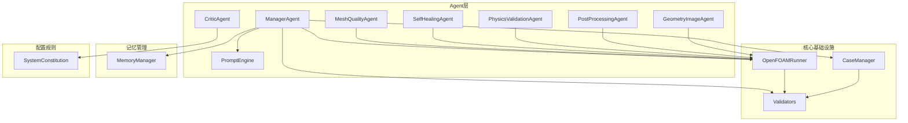

**图表来源**
- [openfoam_ai/agents/__init__.py:1-184](file://openfoam_ai/agents/__init__.py#L1-L184)
- [openfoam_ai/core/openfoam_runner.py:1-548](file://openfoam_ai/core/openfoam_runner.py#L1-L548)
- [openfoam_ai/core/case_manager.py:1-639](file://openfoam_ai/core/case_manager.py#L1-L639)
- [openfoam_ai/memory/memory_manager.py:1-804](file://openfoam_ai/memory/memory_manager.py#L1-L804)

**章节来源**
- [openfoam_ai/agents/__init__.py:1-184](file://openfoam_ai/agents/__init__.py#L1-L184)
- [openfoam_ai/config/system_constitution.yaml:1-103](file://openfoam_ai/config/system_constitution.yaml#L1-L103)

## 核心组件

### Agent接口设计模式

项目采用统一的Agent接口规范，所有Agent都遵循相似的生命周期模式：

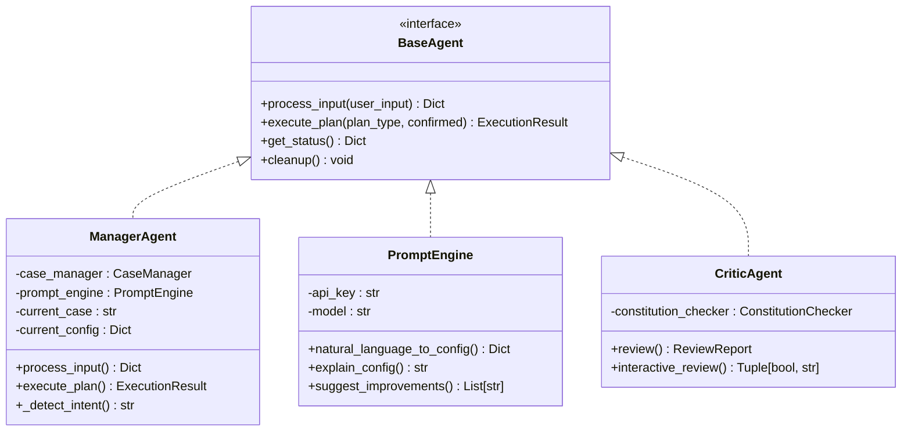

**图表来源**
- [openfoam_ai/agents/manager_agent.py:38-458](file://openfoam_ai/agents/manager_agent.py#L38-L458)
- [openfoam_ai/agents/prompt_engine.py:20-616](file://openfoam_ai/agents/prompt_engine.py#L20-L616)
- [openfoam_ai/agents/critic_agent.py:286-629](file://openfoam_ai/agents/critic_agent.py#L286-L629)

### 状态管理模式

Agent采用有限状态机模式管理内部状态：

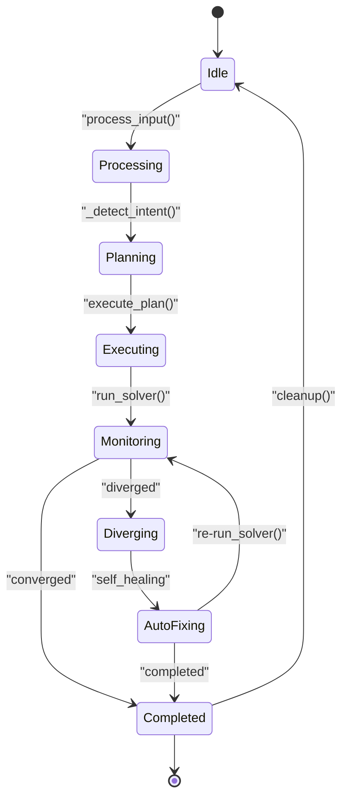

**图表来源**
- [openfoam_ai/core/openfoam_runner.py:16-25](file://openfoam_ai/core/openfoam_runner.py#L16-L25)
- [openfoam_ai/agents/self_healing_agent.py:58-642](file://openfoam_ai/agents/self_healing_agent.py#L58-L642)

**章节来源**
- [openfoam_ai/agents/manager_agent.py:38-458](file://openfoam_ai/agents/manager_agent.py#L38-L458)
- [openfoam_ai/core/openfoam_runner.py:16-25](file://openfoam_ai/core/openfoam_runner.py#L16-L25)

## 架构概览

项目采用"总控Agent + 专业Agent + 基础设施"的分层架构：

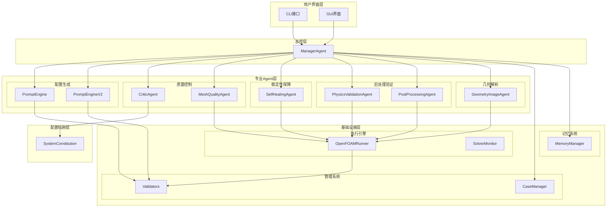

**图表来源**
- [openfoam_ai/agents/manager_agent.py:38-458](file://openfoam_ai/agents/manager_agent.py#L38-L458)
- [openfoam_ai/core/openfoam_runner.py:44-548](file://openfoam_ai/core/openfoam_runner.py#L44-L548)
- [openfoam_ai/memory/memory_manager.py:198-804](file://openfoam_ai/memory/memory_manager.py#L198-L804)

## 详细组件分析

### ManagerAgent - 总控Agent

ManagerAgent是整个系统的核心协调者，负责用户交互、任务调度和状态管理。

#### 核心功能架构

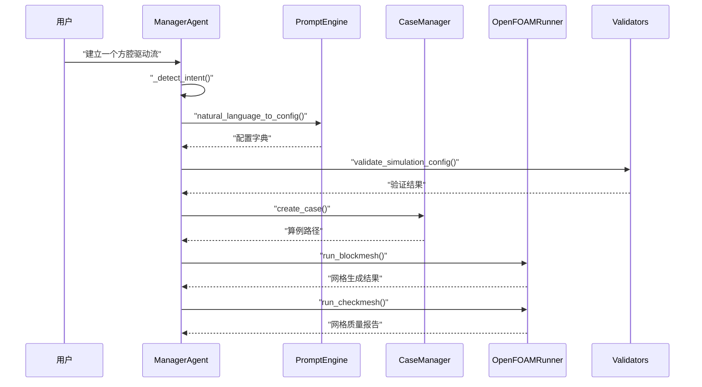

**图表来源**
- [openfoam_ai/agents/manager_agent.py:75-458](file://openfoam_ai/agents/manager_agent.py#L75-L458)
- [openfoam_ai/core/case_manager.py:51-86](file://openfoam_ai/core/case_manager.py#L51-L86)
- [openfoam_ai/core/openfoam_runner.py:77-98](file://openfoam_ai/core/openfoam_runner.py#L77-L98)

#### 生命周期管理

ManagerAgent实现了完整的生命周期管理：

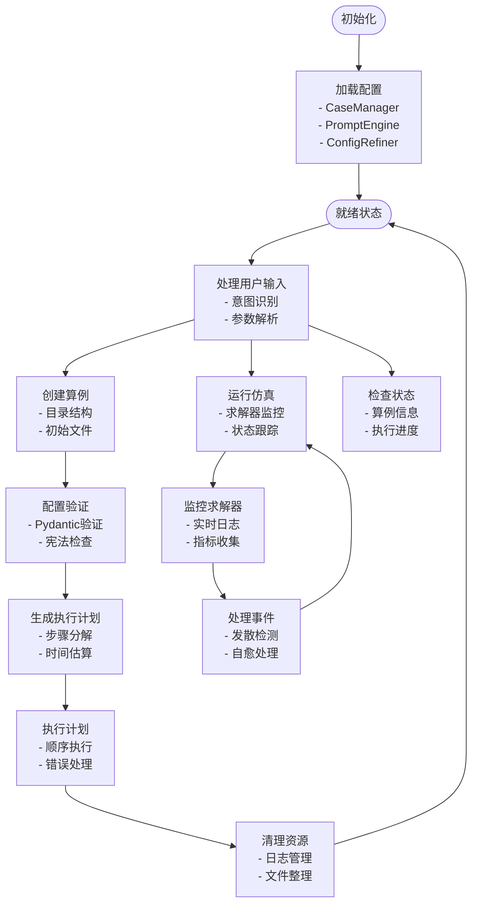

**图表来源**
- [openfoam_ai/agents/manager_agent.py:50-458](file://openfoam_ai/agents/manager_agent.py#L50-L458)

**章节来源**
- [openfoam_ai/agents/manager_agent.py:38-458](file://openfoam_ai/agents/manager_agent.py#L38-L458)

### PromptEngine - 配置生成Agent

PromptEngine负责将自然语言转换为结构化的OpenFOAM配置，支持多种大语言模型。

#### 多模型适配架构

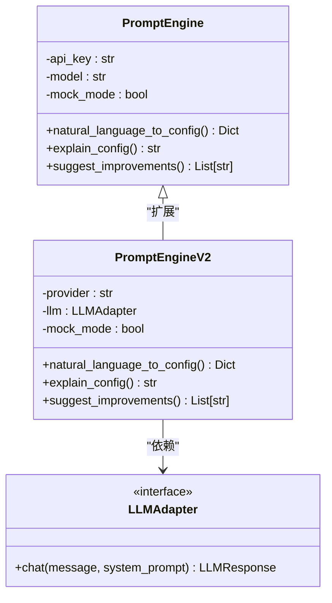

**图表来源**
- [openfoam_ai/agents/prompt_engine.py:20-616](file://openfoam_ai/agents/prompt_engine.py#L20-L616)
- [openfoam_ai/agents/prompt_engine_v2.py:24-541](file://openfoam_ai/agents/prompt_engine_v2.py#L24-L541)

#### 配置验证与优化

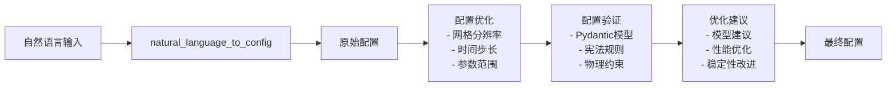

**图表来源**
- [openfoam_ai/agents/prompt_engine.py:476-571](file://openfoam_ai/agents/prompt_engine.py#L476-L571)
- [openfoam_ai/core/validators.py:179-275](file://openfoam_ai/core/validators.py#L179-L275)

**章节来源**
- [openfoam_ai/agents/prompt_engine.py:20-616](file://openfoam_ai/agents/prompt_engine.py#L20-L616)
- [openfoam_ai/agents/prompt_engine_v2.py:24-541](file://openfoam_ai/agents/prompt_engine_v2.py#L24-L541)

### CriticAgent - 审查Agent

CriticAgent基于AI约束宪法对配置进行全面审查，确保仿真质量和安全性。

#### 审查流程架构

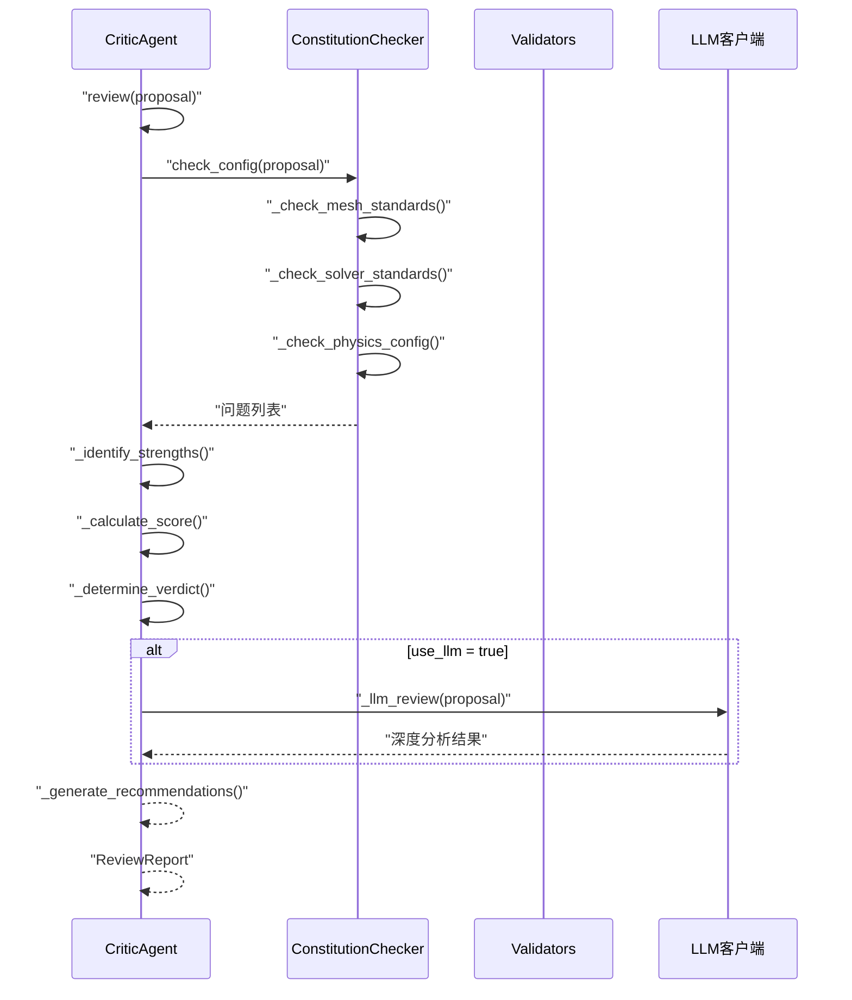

**图表来源**
- [openfoam_ai/agents/critic_agent.py:360-593](file://openfoam_ai/agents/critic_agent.py#L360-L593)

#### 宪法规则引擎

CriticAgent内置完整的宪法规则检查系统：

| 审查类别 | 检查规则 | 阈值限制 | 处理策略 |
|---------|---------|---------|---------|
| 网格质量 | 最小网格数 | 2D≥400, 3D≥8000 | 警告/拒绝 |
| 网格质量 | 长宽比 | ≤100 | 警告/拒绝 |
| 数值稳定性 | 库朗数 | 显式≤0.5, 隐式≤5.0 | 自动修复/拒绝 |
| 物理一致性 | 求解器匹配 | 物理类型约束 | 拒绝 |
| 边界条件 | 完整性检查 | 入口/出口存在 | 警告 |

**章节来源**
- [openfoam_ai/agents/critic_agent.py:47-593](file://openfoam_ai/agents/critic_agent.py#L47-L593)
- [openfoam_ai/config/system_constitution.yaml:13-31](file://openfoam_ai/config/system_constitution.yaml#L13-L31)

### MeshQualityAgent - 网格质量Agent

MeshQualityAgent专门负责网格质量检查和自动修复。

#### 网格质量评估体系

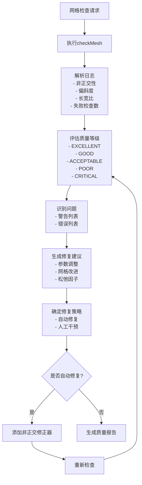

**图表来源**
- [openfoam_ai/agents/mesh_quality_agent.py:111-476](file://openfoam_ai/agents/mesh_quality_agent.py#L111-L476)

#### 自动修复策略

| 问题类型 | 修复策略 | 实施方法 | 风险等级 |
|---------|---------|---------|---------|
| 非正交性过高 | 增加修正器 | 修改fvSolution | 低 |
| 偏斜度过高 | 网格重划分 | 重新生成网格 | 中 |
| 长宽比过大 | 渐进加密 | 局部加密网格 | 中 |
| 网格数不足 | 整体加密 | 全局加密网格 | 中 |

**章节来源**
- [openfoam_ai/agents/mesh_quality_agent.py:61-476](file://openfoam_ai/agents/mesh_quality_agent.py#L61-L476)

### SelfHealingAgent - 自愈Agent

SelfHealingAgent实现求解稳定性监控和自动修复功能。

#### 求解稳定性监控

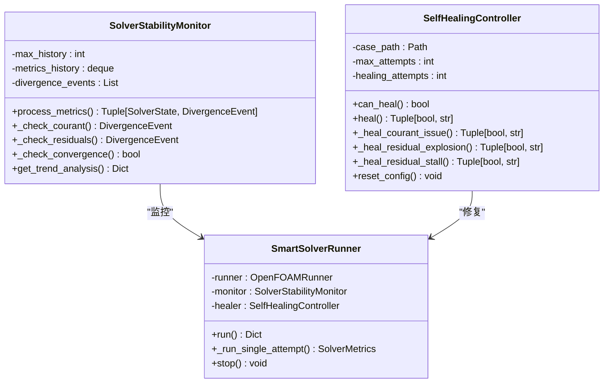

**图表来源**
- [openfoam_ai/agents/self_healing_agent.py:58-642](file://openfoam_ai/agents/self_healing_agent.py#L58-L642)

#### 发散检测算法

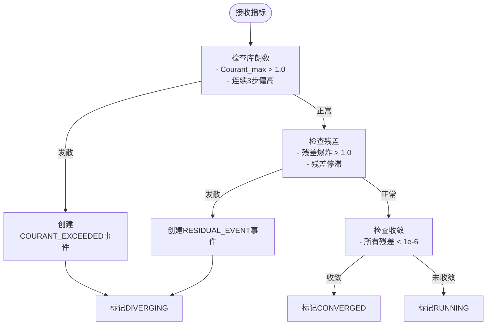

**图表来源**
- [openfoam_ai/agents/self_healing_agent.py:86-197](file://openfoam_ai/agents/self_healing_agent.py#L86-L197)

**章节来源**
- [openfoam_ai/agents/self_healing_agent.py:58-642](file://openfoam_ai/agents/self_healing_agent.py#L58-L642)

### PhysicsValidationAgent - 物理验证Agent

PhysicsValidationAgent负责后处理阶段的物理一致性验证。

#### 验证体系架构

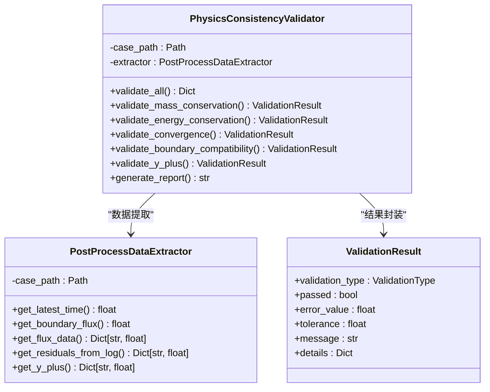

**图表来源**
- [openfoam_ai/agents/physics_validation_agent.py:174-517](file://openfoam_ai/agents/physics_validation_agent.py#L174-L517)

#### 物理验证清单

| 验证类型 | 容差要求 | 检测方法 | 关键指标 |
|---------|---------|---------|---------|
| 质量守恒 | ±0.1% | 流量平衡检查 | 入口流量 vs 出口流量 |
| 能量守恒 | ±0.1% | 热量平衡检查 | 入口热流 + 出口热流 + 壁面热流 |
| 动量平衡 | ±1% | 压力梯度检查 | 压力残差收敛 |
| 收敛性 | <1e-6 | 残差监控 | 所有变量残差 |
| y+检查 | 30-300 | 边界层网格检查 | 壁面y+值 |

**章节来源**
- [openfoam_ai/agents/physics_validation_agent.py:174-517](file://openfoam_ai/agents/physics_validation_agent.py#L174-L517)

### PostProcessingAgent - 后处理Agent

PostProcessingAgent实现基于PyVista的后处理和可视化功能。

#### 可视化工作流

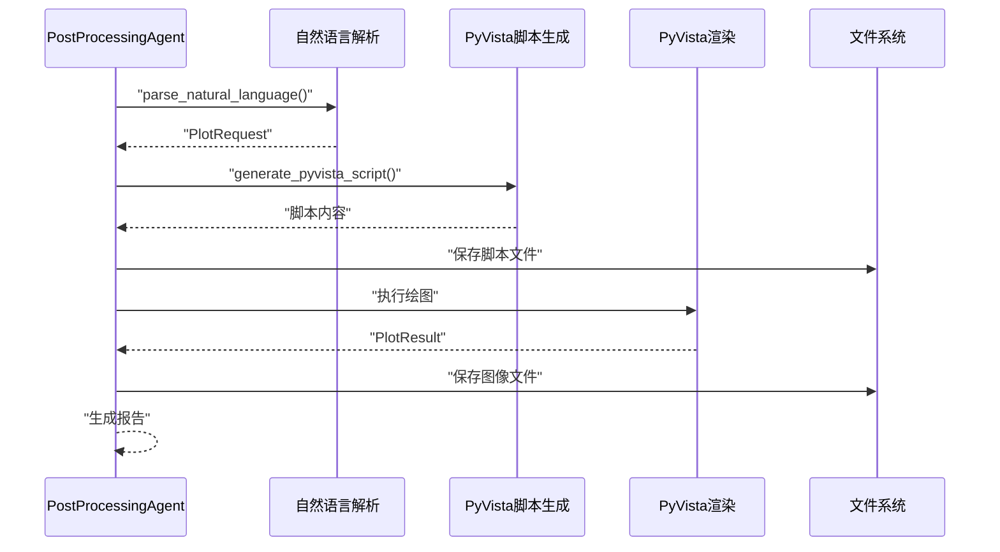

**图表来源**
- [openfoam_ai/agents/postprocessing_agent.py:172-588](file://openfoam_ai/agents/postprocessing_agent.py#L172-L588)

#### 绘图类型支持

| 绘图类型 | 字段变量 | 适用场景 | 输出格式 |
|---------|---------|---------|---------|
| 等值线图 | U, p, T, k, ε | 流场分布 | PNG, PDF, SVG |
| 流线图 | U | 速度场方向 | PNG, PDF, SVG |
| 矢量图 | U | 速度场大小 | PNG, PDF, SVG |
| 等值面 | U, p, T | 三维场可视化 | PNG, PDF, SVG |
| 截面图 | U, p, T | 垂直/水平截面 | PNG, PDF, SVG |
| 线图 | 时间序列 | 残差收敛 | PNG, PDF, SVG |
| 散点图 | 点云数据 | 粒子追踪 | PNG, PDF, SVG |

**章节来源**
- [openfoam_ai/agents/postprocessing_agent.py:108-588](file://openfoam_ai/agents/postprocessing_agent.py#L108-L588)

### GeometryImageAgent - 几何解析Agent

GeometryImageAgent实现基于视觉模型的几何图像解析功能。

#### 几何解析流程

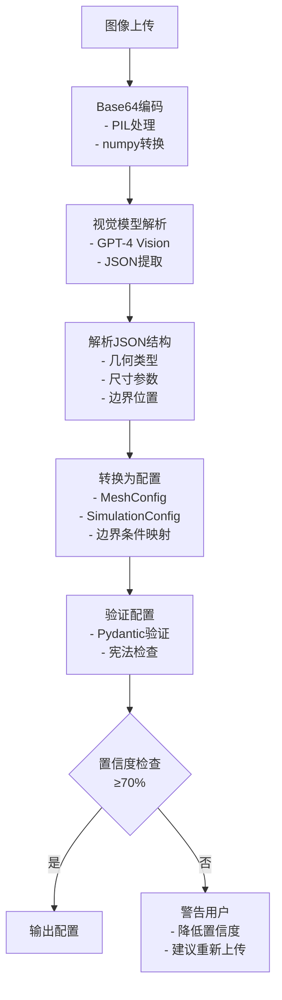

**图表来源**
- [openfoam_ai/agents/geometry_image_agent.py:184-521](file://openfoam_ai/agents/geometry_image_agent.py#L184-L521)

**章节来源**
- [openfoam_ai/agents/geometry_image_agent.py:78-521](file://openfoam_ai/agents/geometry_image_agent.py#L78-L521)

### MemoryManager - 记忆管理Agent

MemoryManager提供基于ChromaDB的向量数据库存储和检索功能。

#### 记忆管理架构

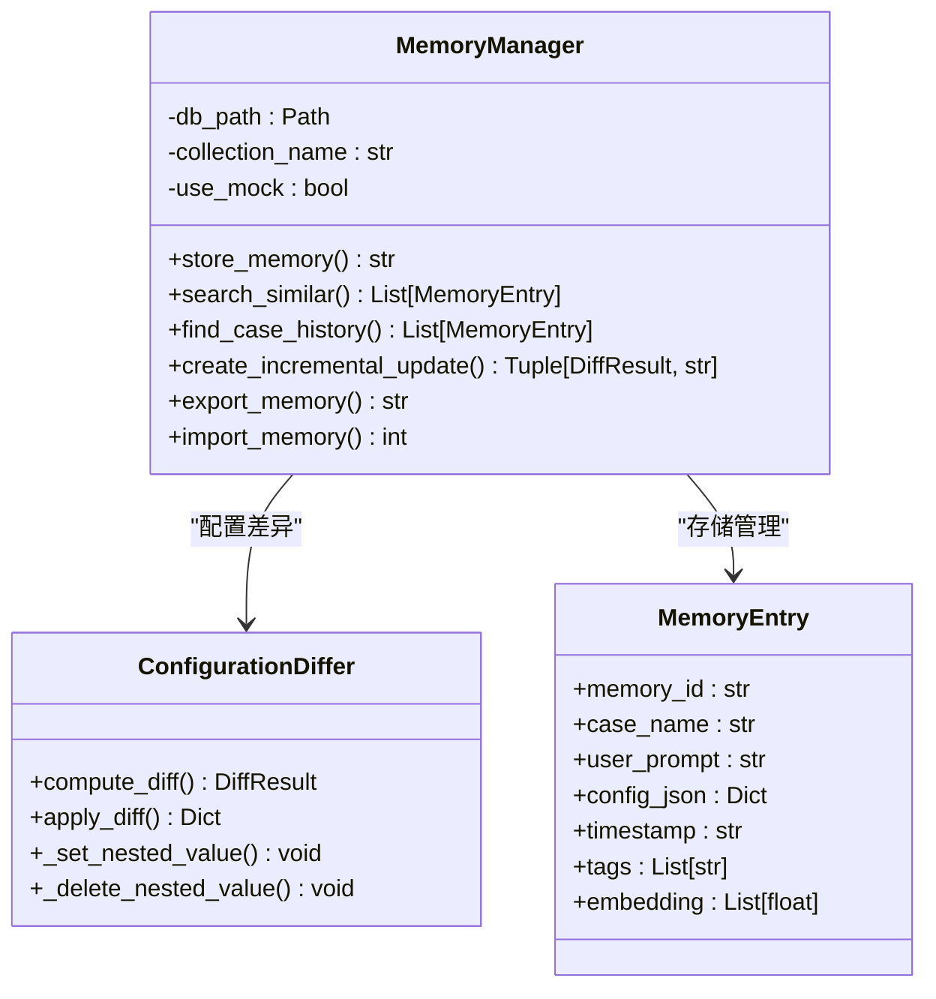

**图表来源**
- [openfoam_ai/memory/memory_manager.py:198-804](file://openfoam_ai/memory/memory_manager.py#L198-L804)

#### 增量更新机制

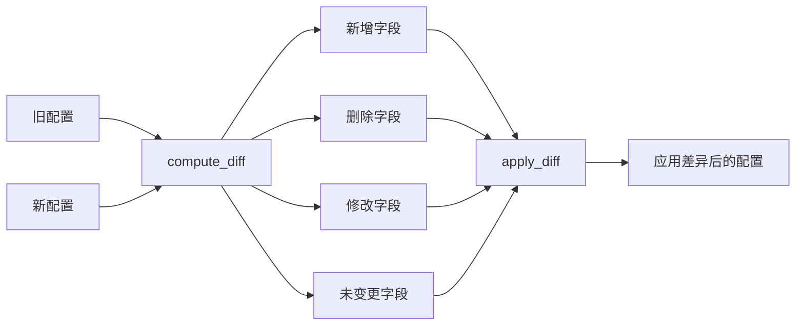

**图表来源**
- [openfoam_ai/memory/memory_manager.py:64-196](file://openfoam_ai/memory/memory_manager.py#L64-L196)

**章节来源**
- [openfoam_ai/memory/memory_manager.py:198-804](file://openfoam_ai/memory/memory_manager.py#L198-L804)

## 依赖关系分析

### 组件耦合关系

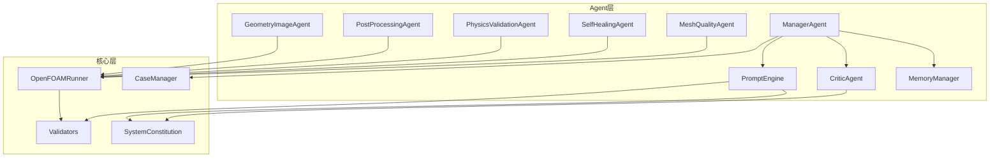

**图表来源**
- [openfoam_ai/agents/__init__.py:1-184](file://openfoam_ai/agents/__init__.py#L1-L184)
- [openfoam_ai/core/openfoam_runner.py:44-548](file://openfoam_ai/core/openfoam_runner.py#L44-L548)

### 外部依赖管理

项目采用分层依赖管理策略：

| 依赖类型 | 用途 | 版本要求 | 备注 |
|---------|------|---------|------|
| OpenAI API | LLM调用 | 1.0+ | 可选依赖 |
| PyVista | 可视化 | 0.40+ | 可选依赖 |
| ChromaDB | 向量存储 | 0.4+ | 可选依赖 |
| Pydantic | 配置验证 | 2.0+ | 必需依赖 |
| NumPy | 数值计算 | 1.20+ | 可选依赖 |
| YAML | 配置文件 | 5.0+ | 必需依赖 |

**章节来源**
- [openfoam_ai/agents/__init__.py:25-133](file://openfoam_ai/agents/__init__.py#L25-L133)

## 性能考虑

### 并发处理优化

1. **异步日志处理**：OpenFOAMRunner使用异步日志捕获，避免阻塞主进程
2. **批量配置验证**：Validators支持批量验证多个配置
3. **缓存机制**：MemoryManager实现配置缓存，减少重复计算

### 内存管理策略

1. **历史数据限制**：SolverMonitor维护固定长度的历史队列（100步）
2. **增量更新**：MemoryManager仅存储配置差异，减少存储空间
3. **资源清理**：自动清理临时文件和日志文件

### 缓存策略

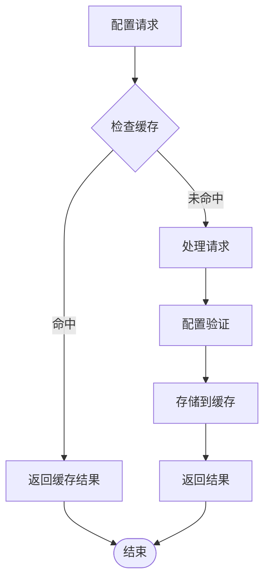

### 资源复用技术

1. **连接池管理**：ChromaDB客户端连接池
2. **模型缓存**：LLM模型实例缓存
3. **文件句柄复用**：日志文件和配置文件句柄复用

## 故障排查指南

### 常见问题诊断

#### LLM集成问题

| 问题症状 | 可能原因 | 解决方案 |
|---------|---------|---------|
| API调用失败 | 网络连接问题 | 检查网络连接和代理设置 |
| API密钥无效 | 密钥过期或格式错误 | 重新生成并验证密钥 |
| 请求超时 | 服务器负载过高 | 增加重试次数和退避策略 |
| JSON解析错误 | 模型输出格式不符 | 添加JSON格式化提示词 |

#### OpenFOAM执行问题

| 问题症状 | 可能原因 | 解决方案 |
|---------|---------|---------|
| 求解器找不到 | PATH环境变量未设置 | 检查OpenFOAM安装路径 |
| 权限不足 | 文件权限问题 | 修改文件权限或使用管理员权限 |
| 内存不足 | 网格过大 | 减少网格分辨率或增加内存 |
| 发散计算 | 参数设置不当 | 调整时间步长和松弛因子 |

#### 配置验证失败

| 问题症状 | 可能原因 | 解决方案 |
|---------|---------|---------|
| 网格数不足 | 2D网格<400或3D网格<8000 | 增加密度分辨率 |
| 长宽比过大 | 网格拉伸严重 | 调整网格生成参数 |
| 库朗数超限 | 时间步长过大 | 减小时间步长 |
| 求解器不匹配 | 物理类型与求解器不兼容 | 更换合适的求解器 |

### 调试技巧

1. **日志级别控制**：使用DEBUG级别获取详细执行信息
2. **中间结果检查**：定期检查配置生成和验证中间结果
3. **性能监控**：监控内存使用和CPU占用情况
4. **错误堆栈分析**：捕获完整错误堆栈信息

**章节来源**
- [openfoam_ai/core/openfoam_runner.py:118-197](file://openfoam_ai/core/openfoam_runner.py#L118-L197)
- [openfoam_ai/agents/self_healing_agent.py:264-276](file://openfoam_ai/agents/self_healing_agent.py#L264-L276)

## 结论

本指南提供了基于OpenFOAM AI项目的完整Agent开发模板与最佳实践。通过多Agent协作架构，项目实现了从自然语言到CFD仿真的端到端自动化流程。

关键要点包括：
- 统一的Agent接口设计和生命周期管理
- 基于宪法规则的硬约束验证系统
- 多层次的质量控制和自愈机制
- 智能的配置生成和优化策略
- 完善的记忆管理和增量更新机制

这些模式和实践为开发复杂的AI驱动CFD系统提供了坚实的基础，开发者可以根据具体需求进行扩展和定制。

## 附录

### 开发模板

#### 基础Agent模板

```python
from abc import ABC, abstractmethod
from typing import Dict, Any, Optional
from dataclasses import dataclass

@dataclass
class AgentState:
    """Agent状态数据类"""
    status: str
    last_updated: str
    metadata: Dict[str, Any]

class BaseAgent(ABC):
    """Agent基类"""
    
    def __init__(self, config: Optional[Dict[str, Any]] = None):
        self.config = config or {}
        self.state = AgentState("initialized", "", {})
        
    @abstractmethod
    def process_input(self, user_input: str) -> Dict[str, Any]:
        """处理用户输入"""
        pass
    
    @abstractmethod
    def execute_plan(self, plan_type: str, confirmed: bool = True) -> Dict[str, Any]:
        """执行计划"""
        pass
    
    def get_status(self) -> Dict[str, Any]:
        """获取状态"""
        return {
            "agent_type": self.__class__.__name__,
            "state": self.state,
            "config": self.config
        }
    
    def cleanup(self) -> None:
        """清理资源"""
        self.state = AgentState("cleaned", "", {})
```

#### 配置管理模板

```python
from pydantic import BaseModel, validator
from typing import Optional

class AgentConfig(BaseModel):
    """Agent配置基类"""
    
    agent_name: str
    enabled: bool = True
    log_level: str = "INFO"
    
    @validator('log_level')
    def validate_log_level(cls, v):
        valid_levels = ['DEBUG', 'INFO', 'WARNING', 'ERROR']
        if v not in valid_levels:
            raise ValueError(f"Invalid log level: {v}")
        return v

class SpecificAgentConfig(AgentConfig):
    """特定Agent配置"""
    param1: int = 10
    param2: str = "default"
    
    @validator('param1')
    def validate_param1(cls, v):
        if v < 0:
            raise ValueError("param1 must be positive")
        return v
```

#### 日志记录模板

```python
import logging
from datetime import datetime

class AgentLogger:
    """Agent日志记录器"""
    
    def __init__(self, agent_name: str, level: str = "INFO"):
        self.logger = logging.getLogger(f"Agent.{agent_name}")
        self.logger.setLevel(getLevelNumber(level))
        
        # 避免重复处理器
        if not self.logger.handlers:
            handler = logging.StreamHandler()
            formatter = logging.Formatter(
                '%(asctime)s - %(name)s - %(levelname)s - %(message)s'
            )
            handler.setFormatter(formatter)
            self.logger.addHandler(handler)
    
    def debug(self, message: str, **kwargs):
        self.logger.debug(f"{message} | {kwargs}")
    
    def info(self, message: str, **kwargs):
        self.logger.info(f"{message} | {kwargs}")
    
    def warning(self, message: str, **kwargs):
        self.logger.warning(f"{message} | {kwargs}")
    
    def error(self, message: str, **kwargs):
        self.logger.error(f"{message} | {kwargs}")
```

### 开发示例

#### 简单Agent开发流程

1. **定义Agent接口**：继承BaseAgent，实现抽象方法
2. **配置验证**：使用Pydantic定义配置模型
3. **状态管理**：实现状态转换和持久化
4. **异常处理**：添加完善的错误处理机制
5. **日志记录**：实现详细的日志记录
6. **测试验证**：编写单元测试和集成测试

#### 复杂系统开发流程

1. **架构设计**：确定Agent间通信协议和数据格式
2. **模块化设计**：将功能拆分为独立的Agent模块
3. **依赖注入**：实现灵活的依赖注入机制
4. **配置管理**：建立统一的配置管理系统
5. **监控告警**：实现系统监控和异常告警
6. **性能优化**：实施缓存、并发和资源复用策略

### 最佳实践清单

#### 代码质量
- 使用类型注解和Pydantic验证
- 编写完整的单元测试
- 实现详细的文档注释
- 遵循PEP 8编码规范

#### 性能优化
- 实现缓存机制减少重复计算
- 使用异步处理提高响应速度
- 优化内存使用避免泄漏
- 实施资源池管理

#### 安全性
- 输入验证和输出净化
- API密钥安全存储
- 权限控制和访问审计
- 数据加密和传输安全

#### 可维护性
- 模块化设计便于扩展
- 清晰的日志记录便于调试
- 完善的错误处理机制
- 版本兼容性和迁移策略