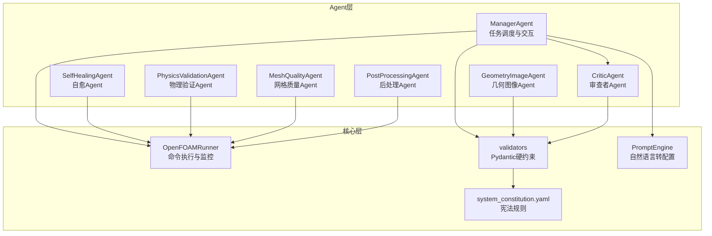
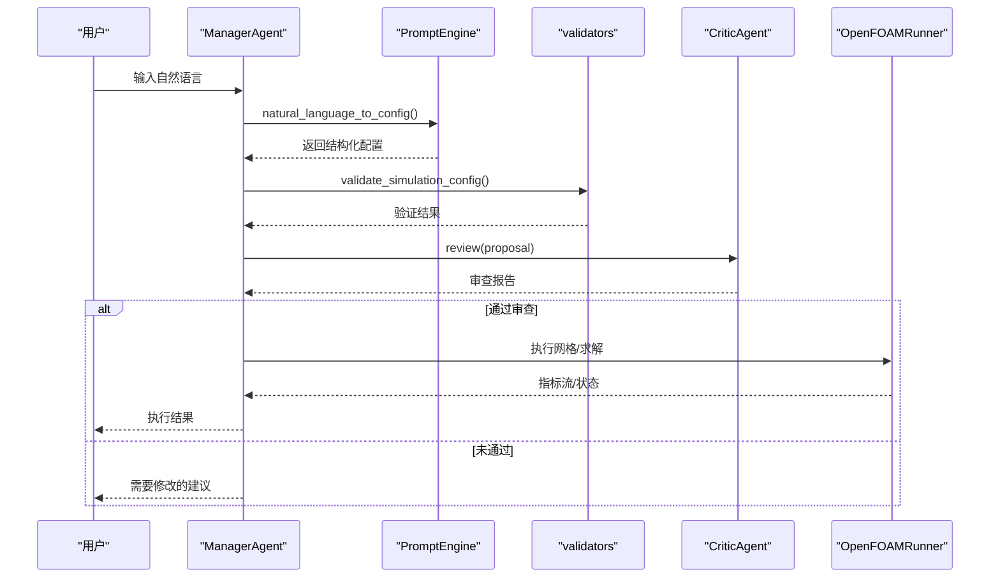
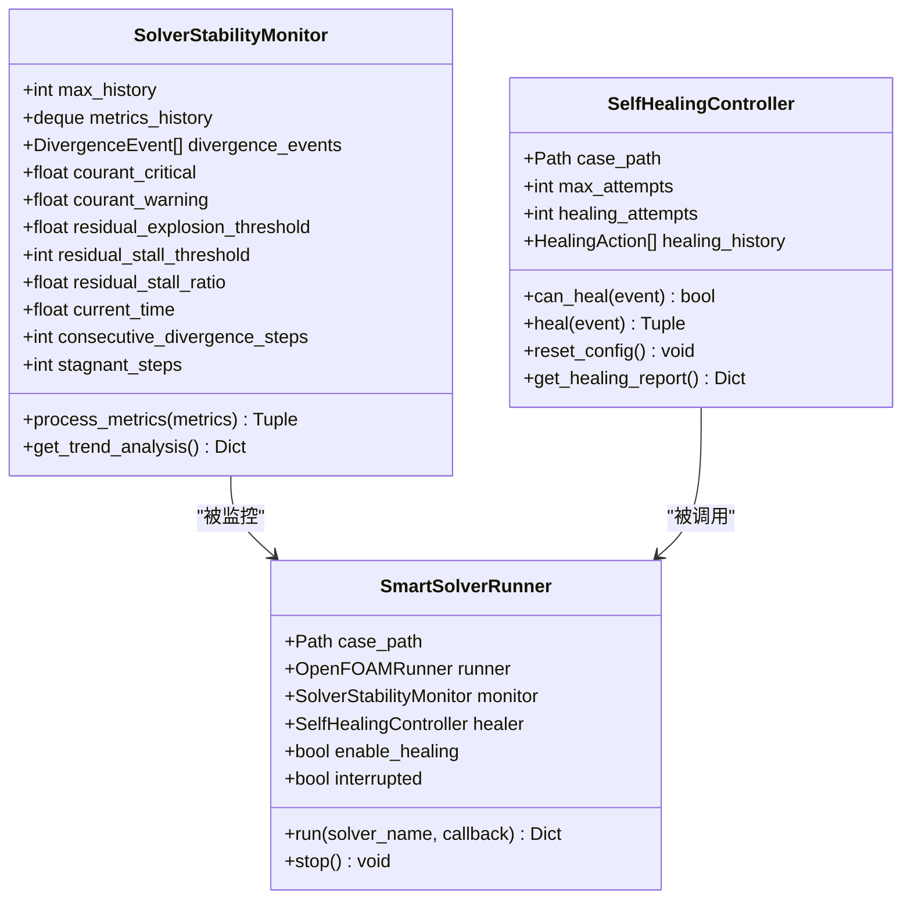
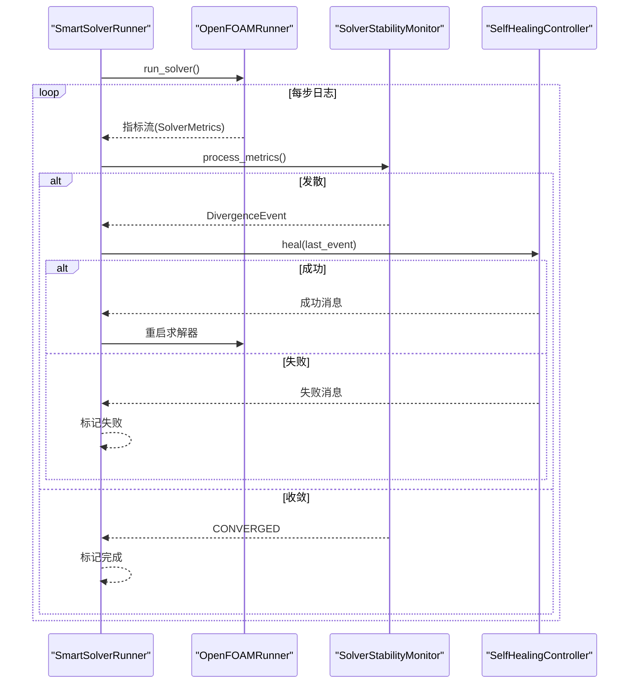
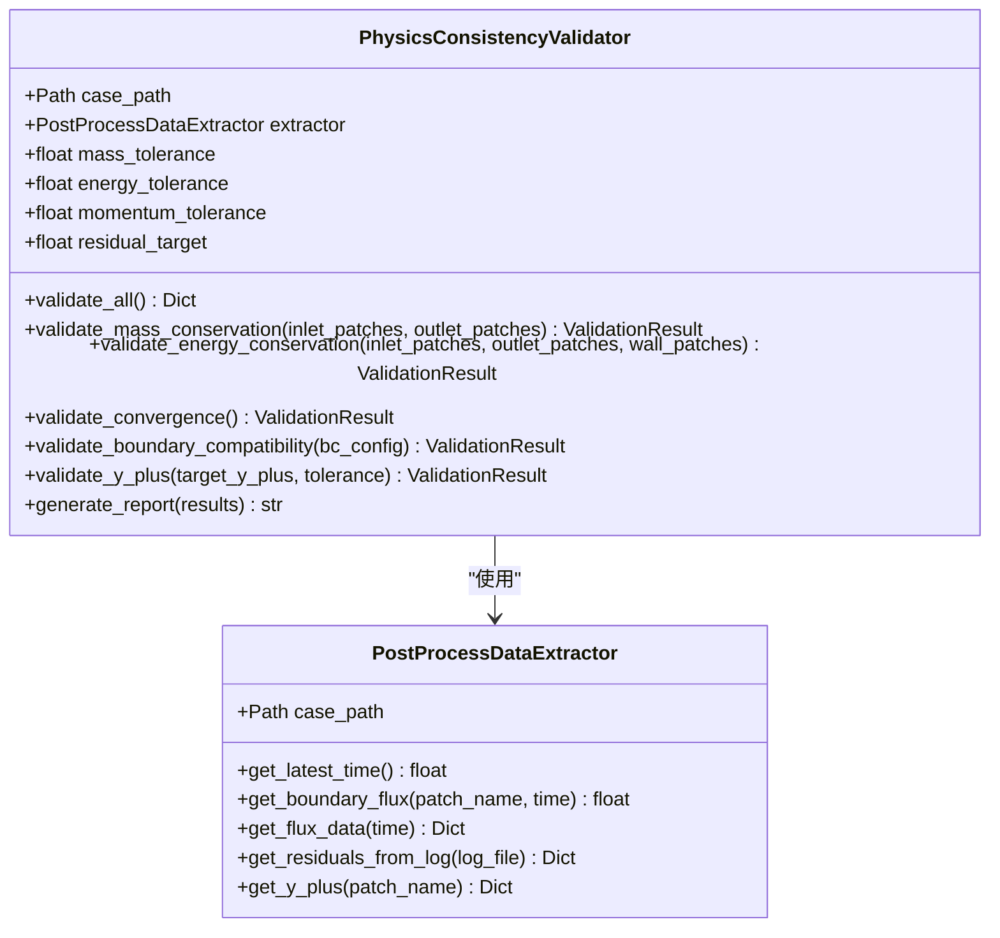
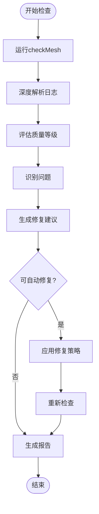
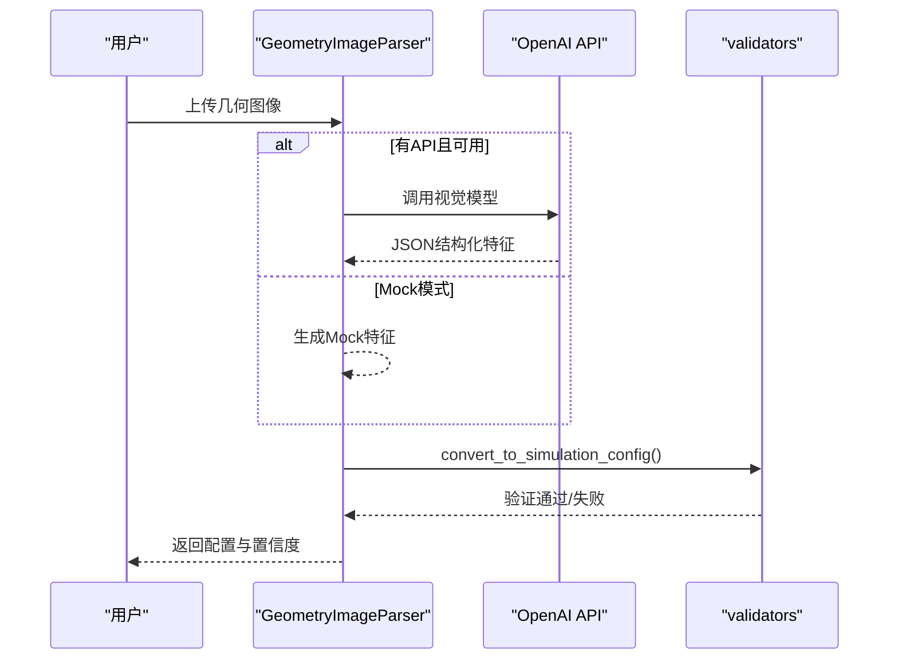
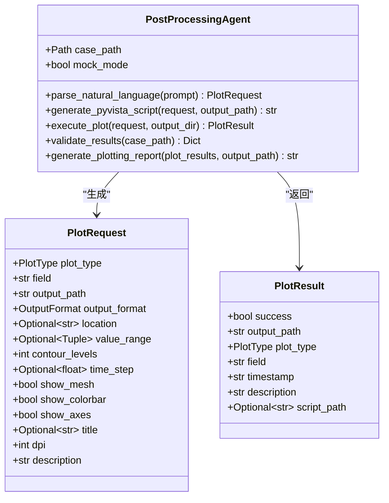
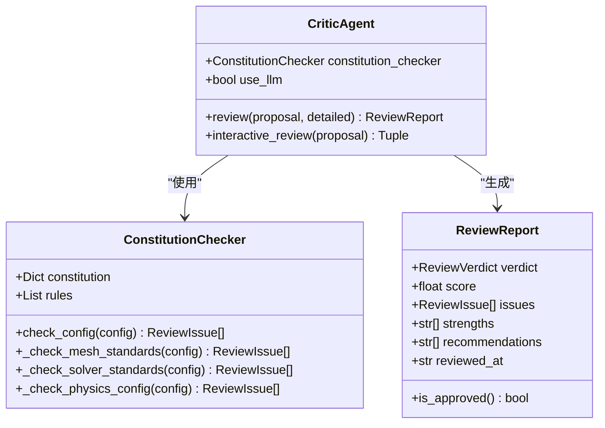
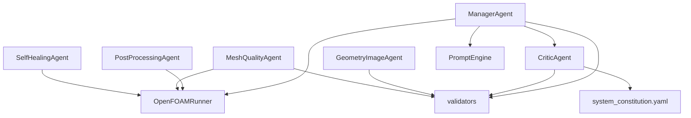

# Agent扩展开发

<cite>
**本文档引用的文件**
- [openfoam_ai/agents/self_healing_agent.py](file://openfoam_ai/agents/self_healing_agent.py)
- [openfoam_ai/agents/physics_validation_agent.py](file://openfoam_ai/agents/physics_validation_agent.py)
- [openfoam_ai/agents/mesh_quality_agent.py](file://openfoam_ai/agents/mesh_quality_agent.py)
- [openfoam_ai/agents/geometry_image_agent.py](file://openfoam_ai/agents/geometry_image_agent.py)
- [openfoam_ai/agents/manager_agent.py](file://openfoam_ai/agents/manager_agent.py)
- [openfoam_ai/agents/critic_agent.py](file://openfoam_ai/agents/critic_agent.py)
- [openfoam_ai/agents/postprocessing_agent.py](file://openfoam_ai/agents/postprocessing_agent.py)
- [openfoam_ai/agents/__init__.py](file://openfoam_ai/agents/__init__.py)
- [openfoam_ai/core/openfoam_runner.py](file://openfoam_ai/core/openfoam_runner.py)
- [openfoam_ai/core/validators.py](file://openfoam_ai/core/validators.py)
- [openfoam_ai/config/system_constitution.yaml](file://openfoam_ai/config/system_constitution.yaml)
- [openfoam_ai/agents/prompt_engine.py](file://openfoam_ai/agents/prompt_engine.py)
- [openfoam_ai/main.py](file://openfoam_ai/main.py)
</cite>

## 目录
1. [简介](#简介)
2. [项目结构](#项目结构)
3. [核心组件](#核心组件)
4. [架构总览](#架构总览)
5. [详细组件分析](#详细组件分析)
6. [依赖关系分析](#依赖关系分析)
7. [性能考虑](#性能考虑)
8. [故障排查指南](#故障排查指南)
9. [结论](#结论)
10. [附录](#附录)

## 简介
本指南面向希望在OpenFOAM AI项目中扩展Agent能力的开发者，系统讲解Agent架构设计原理与扩展机制，并提供SelfHealingAgent自愈Agent、PhysicsValidationAgent物理验证Agent、MeshQualityAgent网格质量评估Agent、GeometryImageAgent几何图像处理Agent的开发流程与最佳实践。文档还涵盖Agent注册、配置管理与生命周期控制的实现细节，帮助您高效构建高质量的Agent扩展。

## 项目结构
OpenFOAM AI采用“模块化Agent + 核心运行器”的架构，Agent位于openfoam_ai/agents目录，核心运行与验证逻辑位于openfoam_ai/core。系统通过ManagerAgent统一协调各Agent，通过PromptEngine将自然语言转化为结构化配置，通过OpenFOAMRunner执行OpenFOAM命令并监控求解过程，通过validators与system_constitution.yaml实现硬约束验证。

图表来源
- [openfoam_ai/agents/manager_agent.py:38-458](file://openfoam_ai/agents/manager_agent.py#L38-L458)
- [openfoam_ai/core/openfoam_runner.py:44-200](file://openfoam_ai/core/openfoam_runner.py#L44-L200)
- [openfoam_ai/core/validators.py:179-200](file://openfoam_ai/core/validators.py#L179-L200)
- [openfoam_ai/config/system_constitution.yaml:1-103](file://openfoam_ai/config/system_constitution.yaml#L1-L103)

章节来源
- [openfoam_ai/agents/__init__.py:1-184](file://openfoam_ai/agents/__init__.py#L1-L184)
- [openfoam_ai/main.py:1-200](file://openfoam_ai/main.py#L1-L200)

## 核心组件
- ManagerAgent：统一的任务调度与交互中枢，负责意图识别、计划生成、执行与状态管理。
- OpenFOAMRunner：封装OpenFOAM命令执行、日志捕获与指标解析，提供求解器状态与指标流。
- validators与system_constitution.yaml：基于Pydantic的硬约束验证体系，确保配置符合宪法要求。
- PromptEngine：将自然语言转换为结构化配置，支持解释与改进建议。
- 各Agent：围绕特定领域（网格质量、物理验证、自愈、几何图像、后处理、审查）提供专业能力。

章节来源
- [openfoam_ai/agents/manager_agent.py:38-458](file://openfoam_ai/agents/manager_agent.py#L38-L458)
- [openfoam_ai/core/openfoam_runner.py:44-200](file://openfoam_ai/core/openfoam_runner.py#L44-L200)
- [openfoam_ai/core/validators.py:179-200](file://openfoam_ai/core/validators.py#L179-L200)
- [openfoam_ai/config/system_constitution.yaml:1-103](file://openfoam_ai/config/system_constitution.yaml#L1-L103)
- [openfoam_ai/agents/prompt_engine.py:20-200](file://openfoam_ai/agents/prompt_engine.py#L20-L200)

## 架构总览
系统采用“Agent协作 + 核心运行器 + 硬约束验证”的分层架构。ManagerAgent负责上层交互与任务编排；各Agent专注各自领域的专业能力；OpenFOAMRunner提供底层执行与监控；validators与system_constitution.yaml确保生成配置的物理与工程合规性。

图表来源
- [openfoam_ai/agents/manager_agent.py:142-338](file://openfoam_ai/agents/manager_agent.py#L142-L338)
- [openfoam_ai/agents/prompt_engine.py:92-126](file://openfoam_ai/agents/prompt_engine.py#L92-L126)
- [openfoam_ai/core/validators.py:179-200](file://openfoam_ai/core/validators.py#L179-L200)
- [openfoam_ai/agents/critic_agent.py:360-407](file://openfoam_ai/agents/critic_agent.py#L360-L407)
- [openfoam_ai/core/openfoam_runner.py:99-198](file://openfoam_ai/core/openfoam_runner.py#L99-L198)

## 详细组件分析

### SelfHealingAgent 自愈Agent
SelfHealingAgent围绕求解稳定性监控与自动修复展开，包含三个核心组件：SolverStabilityMonitor（稳定性监控器）、SelfHealingController（自愈控制器）、SmartSolverRunner（智能运行器）。

- SolverStabilityMonitor
  - 功能：实时解析求解器日志，检测库朗数、残差爆炸、残差停滞等发散模式，维护指标历史并生成趋势分析。
  - 关键阈值：库朗数临界/警告阈值、残差爆炸阈值、残差停滞阈值与比例阈值。
  - 输出：SolverState（运行/收敛/发散/停滞/错误/完成）与DivergenceEvent（发散事件）。

- SelfHealingController
  - 功能：根据发散类型选择修复策略，自动调整求解器参数（如时间步长、松弛因子、非正交修正器），并支持最多尝试次数限制。
  - 修复策略：针对库朗数超标、残差爆炸、残差停滞分别采取不同修复动作，并记录HealingAction历史。
  - 配置恢复：在首次运行时备份原始配置，必要时可重置回原始状态。

- SmartSolverRunner
  - 功能：集成监控与自愈，循环运行求解器，遇到发散时触发自愈，直至收敛或达到最大重启次数。
  - 生命周期：启动、运行、监控、发散处理、重启、完成/失败/中断。

图表来源
- [openfoam_ai/agents/self_healing_agent.py:58-230](file://openfoam_ai/agents/self_healing_agent.py#L58-L230)
- [openfoam_ai/agents/self_healing_agent.py:232-476](file://openfoam_ai/agents/self_healing_agent.py#L232-L476)
- [openfoam_ai/agents/self_healing_agent.py:479-614](file://openfoam_ai/agents/self_healing_agent.py#L479-L614)

图表来源
- [openfoam_ai/agents/self_healing_agent.py:570-609](file://openfoam_ai/agents/self_healing_agent.py#L570-L609)
- [openfoam_ai/core/openfoam_runner.py:99-198](file://openfoam_ai/core/openfoam_runner.py#L99-L198)

章节来源
- [openfoam_ai/agents/self_healing_agent.py:1-642](file://openfoam_ai/agents/self_healing_agent.py#L1-L642)
- [openfoam_ai/core/openfoam_runner.py:16-42](file://openfoam_ai/core/openfoam_runner.py#L16-L42)

开发要点
- 发散事件检测：库朗数、残差爆炸、残差停滞三类事件，结合阈值与趋势分析。
- 自愈动作：时间步长调整、松弛因子调整、非正交修正器添加，需记录动作历史。
- 智能运行器：循环重启与自愈，设置最大重启次数，支持中断与状态报告。

### PhysicsValidationAgent 物理验证Agent
PhysicsValidationAgent专注于后处理阶段的物理一致性验证，包含数据提取器与验证器两部分。

- PostProcessDataExtractor
  - 功能：从OpenFOAM算例中提取物理量，如边界流量、最终残差、y+等。
  - 方法：get_latest_time、get_boundary_flux、get_flux_data、get_residuals_from_log、get_y_plus。

- PhysicsConsistencyValidator
  - 功能：执行质量守恒、能量守恒、收敛性、边界兼容性、y+检查等验证。
  - 验证类型：ValidationType枚举覆盖质量守恒、能量守恒、动量平衡、边界兼容性、y+检查、收敛检查。
  - 结果：ValidationResult，包含通过状态、误差值、容差、消息与细节。

图表来源
- [openfoam_ai/agents/physics_validation_agent.py:38-172](file://openfoam_ai/agents/physics_validation_agent.py#L38-L172)
- [openfoam_ai/agents/physics_validation_agent.py:174-478](file://openfoam_ai/agents/physics_validation_agent.py#L174-L478)

章节来源
- [openfoam_ai/agents/physics_validation_agent.py:1-517](file://openfoam_ai/agents/physics_validation_agent.py#L1-L517)

开发要点
- 数据提取：优先使用postProcess等工具解析日志与结果，降级到解析文件。
- 验证规则：基于system_constitution.yaml中的Validation_Requirements与Solver_Standards。
- 报告生成：提供结构化报告，汇总各项验证结果与总体结论。

### MeshQualityAgent 网格质量评估Agent
MeshQualityAgent基于checkMesh结果进行网格质量评估与自动修复建议。

- MeshQualityChecker
  - 功能：执行checkMesh、深度解析日志、评估质量等级、识别问题、生成建议、自动修复。
  - 质量等级：EXCELLENT/GOOD/ACCEPTABLE/POOR/CRITICAL。
  - 修复策略：针对非正交性问题自动添加非正交修正器。

- MeshAutoFixer
  - 功能：提供更细粒度的自动修复能力，按严重程度设置修正器数量。

图表来源
- [openfoam_ai/agents/mesh_quality_agent.py:111-177](file://openfoam_ai/agents/mesh_quality_agent.py#L111-L177)

章节来源
- [openfoam_ai/agents/mesh_quality_agent.py:1-547](file://openfoam_ai/agents/mesh_quality_agent.py#L1-L547)
- [openfoam_ai/config/system_constitution.yaml:13-31](file://openfoam_ai/config/system_constitution.yaml#L13-L31)

开发要点
- 阈值与规则：基于system_constitution.yaml的Mesh_Standards与Physical_Constraints。
- 交互提示：生成交互式提示，支持用户确认自动修复。
- 自动修复：仅对非正交性等可自动修复问题实施修复，严重错误需人工干预。

### GeometryImageAgent 几何图像处理Agent
GeometryImageAgent基于视觉模型解析几何图像，提取关键特征并转换为OpenFOAM配置参数。

- GeometryImageParser
  - 功能：解析用户上传的几何示意图，提取几何类型、尺寸、边界位置、边界条件等，转换为SimulationConfig并通过Pydantic验证。
  - 系统提示词：严格遵循AI约束宪法，确保生成配置满足网格分辨率、边界层网格、y+等要求。
  - Mock模式：在无API时提供基础解析能力，便于测试。

图表来源
- [openfoam_ai/agents/geometry_image_agent.py:204-268](file://openfoam_ai/agents/geometry_image_agent.py#L204-L268)
- [openfoam_ai/agents/geometry_image_agent.py:371-482](file://openfoam_ai/agents/geometry_image_agent.py#L371-L482)

章节来源
- [openfoam_ai/agents/geometry_image_agent.py:1-533](file://openfoam_ai/agents/geometry_image_agent.py#L1-L533)
- [openfoam_ai/core/validators.py:179-200](file://openfoam_ai/core/validators.py#L179-L200)

开发要点
- 系统提示词：严格遵循AI约束宪法，确保生成配置满足网格分辨率、边界层网格、y+等要求。
- 配置转换：将几何特征映射到MeshConfig、SolverConfig与边界条件。
- 置信度验证：提供置信度阈值，低于阈值时给出改进建议。

### PostProcessingAgent 后处理Agent
PostProcessingAgent基于自然语言需求自动生成PyVista绘图脚本，读取OpenFOAM结果数据并生成高分辨率矢量图。

- PostProcessingAgent
  - 功能：解析自然语言绘图需求，生成PyVista脚本，执行绘图并生成报告。
  - 绘图类型：等值线、流线、矢量、等值面、截面、线图、散点、时序图。
  - 结果验证：验证残差收敛、质量守恒、能量守恒等。

图表来源
- [openfoam_ai/agents/postprocessing_agent.py:108-171](file://openfoam_ai/agents/postprocessing_agent.py#L108-L171)
- [openfoam_ai/agents/postprocessing_agent.py:172-239](file://openfoam_ai/agents/postprocessing_agent.py#L172-L239)
- [openfoam_ai/agents/postprocessing_agent.py:345-379](file://openfoam_ai/agents/postprocessing_agent.py#L345-L379)

章节来源
- [openfoam_ai/agents/postprocessing_agent.py:1-588](file://openfoam_ai/agents/postprocessing_agent.py#L1-L588)

开发要点
- 自然语言解析：将中文/英文绘图需求映射到PlotRequest。
- PyVista脚本生成：根据绘图类型生成对应脚本，支持高分辨率输出。
- 结果验证：基于日志与结果目录验证收敛与守恒。

### CriticAgent 审查者Agent
CriticAgent基于AI约束宪法对方案进行硬约束审查，模拟严苛教授视角，提供详细的审查报告与建议。

- CriticAgent
  - 功能：基于ConstitutionChecker检查配置是否违反宪法，生成评分、问题清单、建议与结论。
  - 审查结论：APPROVE/CONDITIONAL/REJECT。
  - LLM深度审查：可选启用，进一步提升审查深度。

图表来源
- [openfoam_ai/agents/critic_agent.py:286-407](file://openfoam_ai/agents/critic_agent.py#L286-L407)
- [openfoam_ai/agents/critic_agent.py:47-130](file://openfoam_ai/agents/critic_agent.py#L47-L130)
- [openfoam_ai/agents/critic_agent.py:32-45](file://openfoam_ai/agents/critic_agent.py#L32-L45)

章节来源
- [openfoam_ai/agents/critic_agent.py:1-629](file://openfoam_ai/agents/critic_agent.py#L1-L629)
- [openfoam_ai/config/system_constitution.yaml:1-103](file://openfoam_ai/config/system_constitution.yaml#L1-L103)

开发要点
- 宪法规则：基于system_constitution.yaml的Core_Directives、Mesh_Standards、Solver_Standards等。
- 评分与结论：综合问题严重性与方案优点，给出Approve/Conditional/Reject结论。
- 交互审查：支持交互式审查，允许用户先修复问题再继续执行。

## 依赖关系分析
- Agent层内部依赖：各Agent相对独立，通过ManagerAgent协调；SelfHealingAgent依赖OpenFOAMRunner；MeshQualityAgent依赖OpenFOAMRunner与validators；GeometryImageAgent依赖validators；PostProcessingAgent依赖OpenFOAMRunner；CriticAgent依赖validators与system_constitution.yaml。
- 核心层依赖：OpenFOAMRunner依赖validators加载宪法；validators依赖system_constitution.yaml；PromptEngine依赖LLM（可Mock）。

图表来源
- [openfoam_ai/agents/self_healing_agent.py:17-24](file://openfoam_ai/agents/self_healing_agent.py#L17-L24)
- [openfoam_ai/agents/mesh_quality_agent.py:14-21](file://openfoam_ai/agents/mesh_quality_agent.py#L14-L21)
- [openfoam_ai/agents/geometry_image_agent.py:35-43](file://openfoam_ai/agents/geometry_image_agent.py#L35-L43)
- [openfoam_ai/agents/postprocessing_agent.py:23-33](file://openfoam_ai/agents/postprocessing_agent.py#L23-L33)
- [openfoam_ai/agents/critic_agent.py:53-58](file://openfoam_ai/agents/critic_agent.py#L53-L58)
- [openfoam_ai/agents/manager_agent.py:12-16](file://openfoam_ai/agents/manager_agent.py#L12-L16)

章节来源
- [openfoam_ai/agents/__init__.py:25-132](file://openfoam_ai/agents/__init__.py#L25-L132)
- [openfoam_ai/core/openfoam_runner.py:13-14](file://openfoam_ai/core/openfoam_runner.py#L13-L14)

## 性能考虑
- 日志解析与指标流：OpenFOAMRunner逐行解析日志，注意异常处理与编码问题，避免阻塞主循环。
- 自愈策略：减少不必要的重启与文件修改，优先采用保守的修复策略（如逐步减小时间步长）。
- 网格质量检查：checkMesh开销较大，建议在关键节点执行，避免频繁重复检查。
- 后处理绘图：PyVista渲染开销较高，建议在Mock模式下进行单元测试，生产环境使用高分辨率输出。

## 故障排查指南
- 求解器启动失败：检查OpenFOAM安装与PATH设置，查看错误日志定位FileNotFoundError/PermissionError。
- 发散检测误报：调整阈值与趋势分析窗口，结合历史指标判断是否为真实发散。
- 网格质量修复失败：确认fvSolution文件存在与可写权限，检查正则表达式匹配是否正确。
- 几何图像解析失败：检查API密钥与网络连接，降级到Mock模式验证基础流程。
- 审查不通过：根据CriticAgent的ReviewReport与建议逐项整改，重点关注关键问题。

章节来源
- [openfoam_ai/core/openfoam_runner.py:127-142](file://openfoam_ai/core/openfoam_runner.py#L127-L142)
- [openfoam_ai/agents/self_healing_agent.py:348-349](file://openfoam_ai/agents/self_healing_agent.py#L348-L349)
- [openfoam_ai/agents/geometry_image_agent.py:162-169](file://openfoam_ai/agents/geometry_image_agent.py#L162-L169)
- [openfoam_ai/agents/critic_agent.py:505-529](file://openfoam_ai/agents/critic_agent.py#L505-L529)

## 结论
通过本指南，您可以在OpenFOAM AI项目中高效扩展Agent能力。建议遵循以下原则：
- 以系统约束为先：所有Agent必须遵守system_constitution.yaml的硬约束。
- 以数据驱动：基于OpenFOAM日志与结果进行决策，避免臆测。
- 以协作为主：通过ManagerAgent统一编排，Agent间保持低耦合高内聚。
- 以可验证为目标：提供可复现的报告与可追溯的历史记录。

## 附录

### 新Agent开发模板与最佳实践
- 接口设计
  - 定义清晰的数据类（如DivergenceEvent、ValidationResult、MeshQualityReport等）。
  - 提供统一的输入/输出接口，便于与ManagerAgent集成。
- 状态管理
  - 维护必要的状态（如历史指标、修复尝试次数、配置备份）。
  - 支持中断与恢复，避免长时间阻塞。
- 异常处理
  - 对外部依赖（如API、文件系统、OpenFOAM命令）进行健壮的异常处理。
  - 提供降级策略（如Mock模式）以保障基本功能。
- 与其他Agent协作
  - 通过ManagerAgent的计划与执行机制参与工作流。
  - 与CriticAgent配合进行审查，与validators配合进行硬约束验证。
- 注册与生命周期
  - 在openfoam_ai/agents/__init__.py中导出新Agent及其类/工厂函数。
  - 在main.py或ManagerAgent中注册新Agent的处理逻辑与调用入口。

章节来源
- [openfoam_ai/agents/__init__.py:134-183](file://openfoam_ai/agents/__init__.py#L134-L183)
- [openfoam_ai/main.py:19-22](file://openfoam_ai/main.py#L19-L22)
- [openfoam_ai/agents/manager_agent.py:75-104](file://openfoam_ai/agents/manager_agent.py#L75-L104)