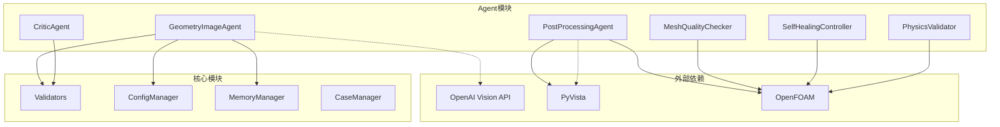
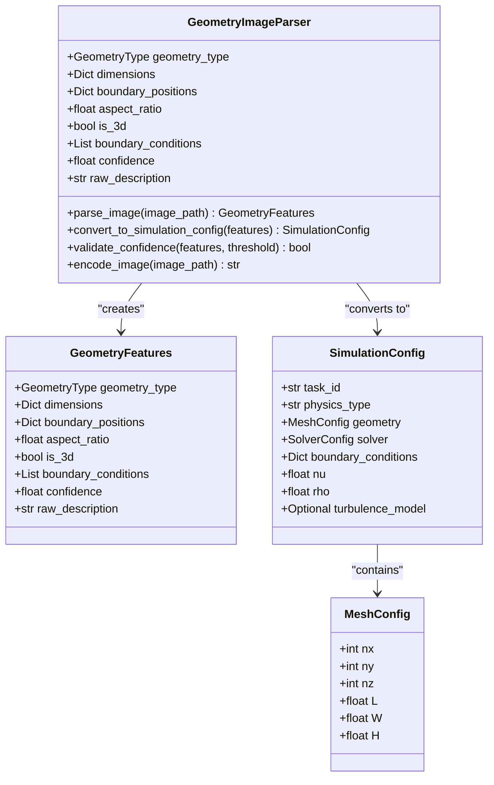
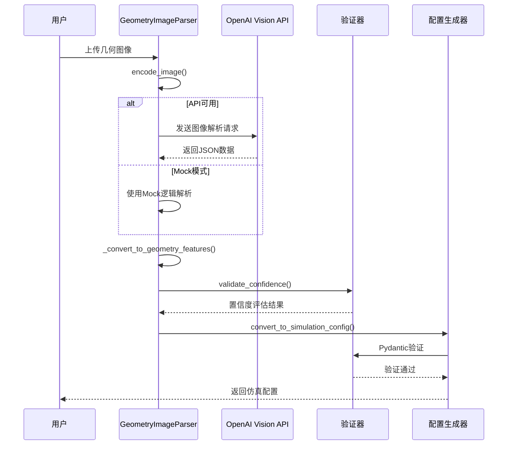
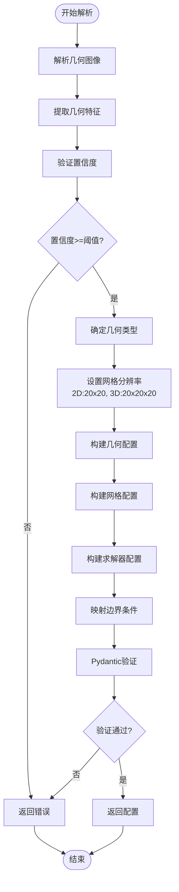
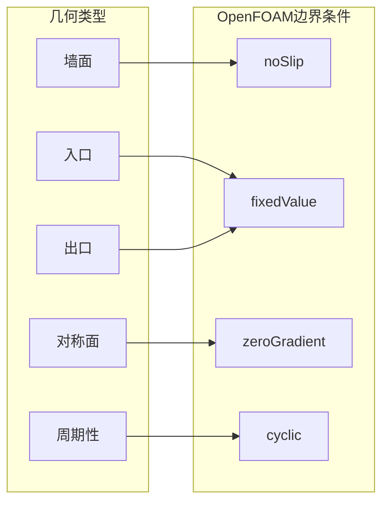
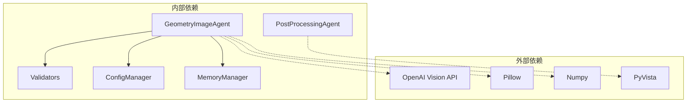
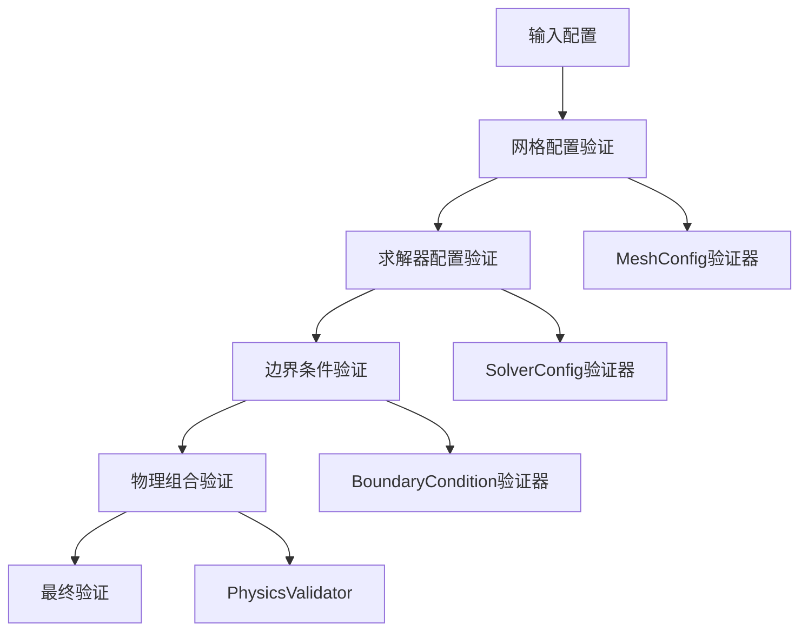
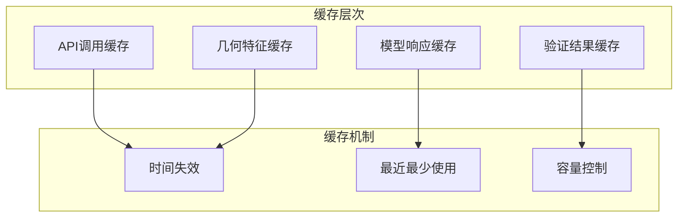

# 几何图像处理Agent开发

<cite>
**本文档引用的文件**
- [geometry_image_agent.py](file://openfoam_ai/agents/geometry_image_agent.py)
- [__init__.py](file://openfoam_ai/agents/__init__.py)
- [validators.py](file://openfoam_ai/core/validators.py)
- [config_manager.py](file://openfoam_ai/core/config_manager.py)
- [memory_manager.py](file://openfoam_ai/memory/memory_manager.py)
- [postprocessing_agent.py](file://openfoam_ai/agents/postprocessing_agent.py)
- [system_constitution.yaml](file://openfoam_ai/config/system_constitution.yaml)
- [main_phase4.py](file://openfoam_ai/main_phase4.py)
- [test_phase4.py](file://openfoam_ai/tests/test_phase4.py)
</cite>

## 目录
1. [简介](#简介)
2. [项目结构](#项目结构)
3. [核心组件](#核心组件)
4. [架构概览](#架构概览)
5. [详细组件分析](#详细组件分析)
6. [依赖关系分析](#依赖关系分析)
7. [性能考虑](#性能考虑)
8. [故障排除指南](#故障排除指南)
9. [结论](#结论)
10. [附录](#附录)

## 简介

GeometryImageAgent是一个专门用于几何图像处理的智能体模块，基于视觉模型实现几何特征提取和OpenFOAM仿真配置转换。该模块遵循严格的AI约束宪法，确保生成的仿真配置符合CFD最佳实践和物理规律。

本模块的核心功能包括：
- **几何图像解析**：从用户上传的几何示意图中提取关键特征
- **特征提取**：识别几何类型、尺寸、边界位置和拓扑结构
- **配置转换**：将几何特征转换为结构化的OpenFOAM仿真配置
- **验证机制**：通过Pydantic硬约束确保配置的物理合理性
- **置信度评估**：提供解析结果的可信度评估

## 项目结构

OpenFOAM AI Agent项目采用模块化设计，GeometryImageAgent作为第四阶段新增的核心模块，与其他Agent协同工作形成完整的CFD自动化流程。



**图表来源**
- [geometry_image_agent.py:1-533](file://openfoam_ai/agents/geometry_image_agent.py#L1-L533)
- [postprocessing_agent.py:1-588](file://openfoam_ai/agents/postprocessing_agent.py#L1-L588)
- [validators.py:1-441](file://openfoam_ai/core/validators.py#L1-L441)

**章节来源**
- [geometry_image_agent.py:1-50](file://openfoam_ai/agents/geometry_image_agent.py#L1-L50)
- [__init__.py:15-184](file://openfoam_ai/agents/__init__.py#L15-L184)

## 核心组件

### 几何图像解析器 (GeometryImageParser)

GeometryImageParser是整个模块的核心组件，负责将几何图像转换为结构化的仿真配置。其主要职责包括：

- **图像解析**：支持OpenAI Vision API和Mock模式两种解析方式
- **特征提取**：识别几何类型、尺寸参数、边界位置和拓扑结构
- **配置转换**：将几何特征转换为OpenFOAM仿真配置
- **验证机制**：通过Pydantic硬约束确保配置的物理合理性

### 几何特征数据类 (GeometryFeatures)

GeometryFeatures是标准化的几何特征表示，包含以下关键属性：

- **几何类型**：矩形、圆形、管道、方腔、翼型等
- **尺寸参数**：长度、宽度、高度、直径等
- **边界位置**：入口、出口、壁面等边界的具体坐标
- **拓扑信息**：长宽比、三维标识等
- **边界条件**：推断的边界类型和建议的边界条件
- **置信度**：解析结果的可信度评估

### 验证系统

系统采用多层次的验证机制确保配置的物理合理性：

- **Pydantic硬约束**：强制验证配置格式和基本物理规律
- **宪法约束**：遵循AI约束宪法中的CFD最佳实践
- **网格质量检查**：验证网格分辨率和长宽比要求
- **求解器兼容性**：确保求解器与物理类型的匹配

**章节来源**
- [geometry_image_agent.py:78-533](file://openfoam_ai/agents/geometry_image_agent.py#L78-L533)
- [validators.py:179-275](file://openfoam_ai/core/validators.py#L179-L275)

## 架构概览

GeometryImageAgent采用分层架构设计，确保模块间的松耦合和高内聚。



**图表来源**
- [geometry_image_agent.py:65-375](file://openfoam_ai/agents/geometry_image_agent.py#L65-L375)
- [validators.py:18-87](file://openfoam_ai/core/validators.py#L18-L87)

## 详细组件分析

### 几何图像解析流程



**图表来源**
- [geometry_image_agent.py:184-482](file://openfoam_ai/agents/geometry_image_agent.py#L184-L482)

### 配置转换算法

配置转换过程遵循严格的算法流程：



**图表来源**
- [geometry_image_agent.py:371-482](file://openfoam_ai/agents/geometry_image_agent.py#L371-L482)

### 几何类型识别

系统支持多种几何类型的自动识别：

| 几何类型 | 特征识别 | 网格要求 | 边界条件 |
|---------|----------|----------|----------|
| 矩形 | 四边形边界，直角 | 2D:≥400单元，3D:≥8000单元 | 壁面、入口、出口 |
| 圆形 | 圆形轮廓，对称性 | 2D:≥400单元，3D:≥8000单元 | 壁面、入口、出口 |
| 管道 | 圆柱形，轴对称 | 3D:≥8000单元，长宽比≤100 | 入口、出口、壁面 |
| 方腔 | 方形，驱动流 | 2D:≥400单元，长宽比≤100 | 移动壁面、固定壁面 |
| 翼型 | 空气动力学外形 | 2D:≥400单元，3D:≥8000单元 | 前缘、后缘、上下表面 |

**章节来源**
- [geometry_image_agent.py:46-76](file://openfoam_ai/agents/geometry_image_agent.py#L46-L76)

### 边界条件映射

系统提供自动化的边界条件映射功能：



**图表来源**
- [geometry_image_agent.py:484-501](file://openfoam_ai/agents/geometry_image_agent.py#L484-L501)

**章节来源**
- [geometry_image_agent.py:484-501](file://openfoam_ai/agents/geometry_image_agent.py#L484-L501)

## 依赖关系分析

### 内部依赖

GeometryImageAgent与系统其他模块存在紧密的依赖关系：



**图表来源**
- [geometry_image_agent.py:21-43](file://openfoam_ai/agents/geometry_image_agent.py#L21-L43)
- [validators.py:6-11](file://openfoam_ai/core/validators.py#L6-L11)

### 验证器依赖链

验证系统采用分层验证策略：



**图表来源**
- [validators.py:18-275](file://openfoam_ai/core/validators.py#L18-L275)

**章节来源**
- [validators.py:179-275](file://openfoam_ai/core/validators.py#L179-L275)

## 性能考虑

### 并行计算优化

系统支持多线程和异步处理以提升性能：

- **图像解析并发**：多个图像可以并行解析
- **配置验证流水线**：验证步骤可以流水线化处理
- **内存管理**：合理控制图像和中间数据的内存占用

### 缓存策略



### 内存管理

- **图像处理**：使用Pillow进行高效图像处理
- **数据结构**：使用dataclass减少内存开销
- **垃圾回收**：及时释放临时对象

## 故障排除指南

### 常见问题及解决方案

| 问题类型 | 症状 | 解决方案 |
|---------|------|----------|
| API连接失败 | OpenAI初始化失败 | 检查API密钥和网络连接 |
| 图像解析错误 | JSON格式错误 | 验证图像质量和格式 |
| 配置验证失败 | Pydantic验证异常 | 检查几何参数和边界条件 |
| 置信度过低 | 低于阈值 | 提供更清晰的图像或补充标注 |

### 调试工具

系统提供了完善的调试和监控功能：

- **日志记录**：详细的执行日志和错误信息
- **性能监控**：函数执行时间和资源使用情况
- **配置导出**：完整的配置历史和变更记录

**章节来源**
- [geometry_image_agent.py:265-267](file://openfoam_ai/agents/geometry_image_agent.py#L265-L267)

## 结论

GeometryImageAgent为OpenFOAM AI Agent系统提供了强大的几何图像处理能力。通过严格的验证机制和智能的配置转换算法，该模块能够将用户的几何示意图转换为高质量的OpenFOAM仿真配置。

### 主要优势

1. **严格的约束验证**：遵循AI约束宪法，确保配置的物理合理性
2. **灵活的解析模式**：支持OpenAI Vision API和Mock模式
3. **完整的配置转换**：从几何特征到仿真配置的端到端转换
4. **智能的边界条件推断**：基于几何特征自动推断合适的边界条件
5. **完善的错误处理**：提供详细的错误信息和恢复建议

### 发展前景

随着AI视觉模型技术的不断发展，GeometryImageAgent将继续演进，支持更多复杂的几何类型识别和更精确的特征提取算法。同时，系统的验证机制也将不断完善，确保生成的仿真配置更加可靠和高效。

## 附录

### 使用示例

```python
# 创建几何图像解析器
parser = create_geometry_parser(api_key="your-api-key")

# 解析几何图像
features = parser.parse_image("path/to/geometry.png")

# 验证置信度
is_valid = parser.validate_confidence(features, threshold=0.7)

# 转换为仿真配置
config = parser.convert_to_simulation_config(features, solver_name="icoFoam")
```

### 配置参数说明

| 参数 | 类型 | 默认值 | 说明 |
|------|------|--------|------|
| api_key | Optional[str] | None | OpenAI API密钥 |
| model | str | "gpt-4-vision-preview" | 视觉模型名称 |
| threshold | float | 0.7 | 置信度阈值 |
| solver_name | str | "icoFoam" | 求解器名称 |

### 开发最佳实践

1. **图像质量**：确保输入图像清晰，包含足够的几何细节
2. **标注规范**：在图像中标注关键尺寸和边界信息
3. **验证优先**：始终验证解析结果的置信度和物理合理性
4. **版本控制**：使用MemoryManager跟踪配置变更历史
5. **错误处理**：妥善处理各种异常情况并提供用户友好的错误信息