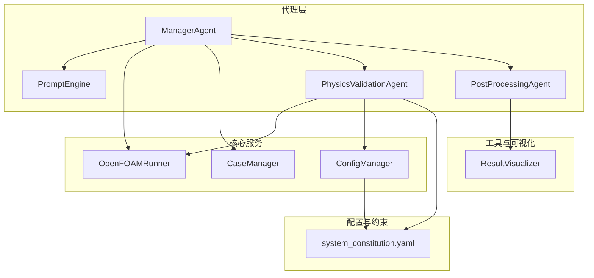
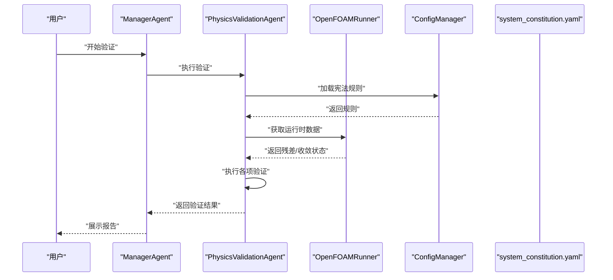
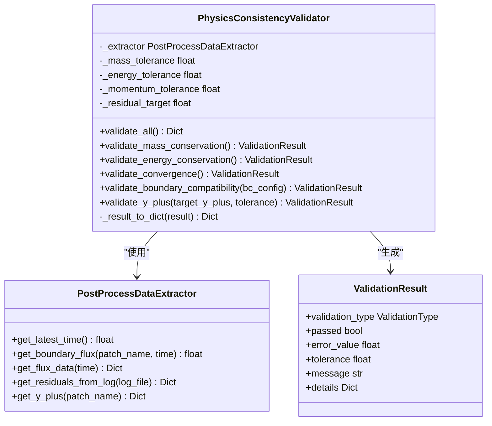
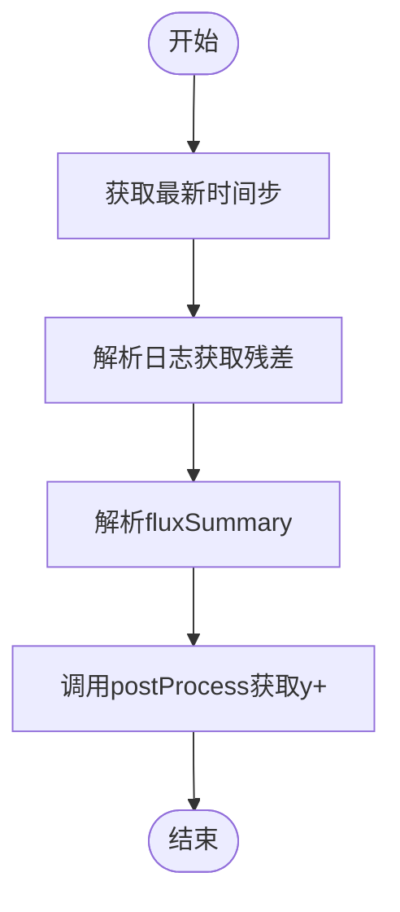
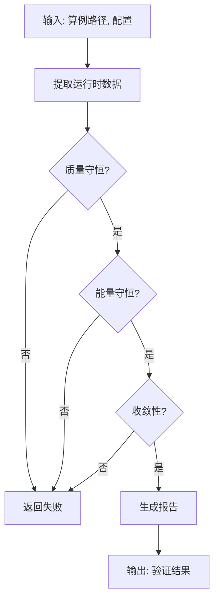
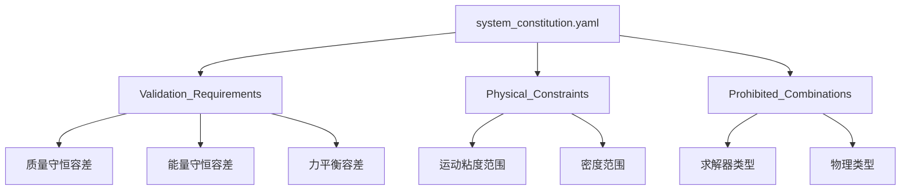
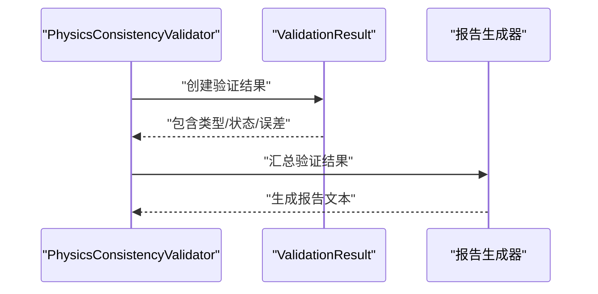
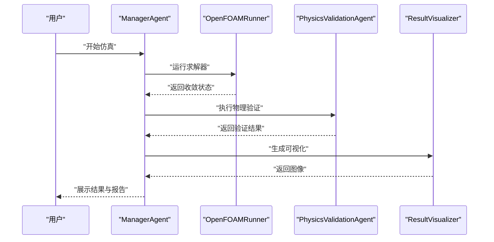
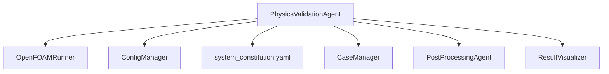

# 物理验证Agent开发

<cite>
**本文档引用的文件**
- [physics_validation_agent.py](file://openfoam_ai/agents/physics_validation_agent.py)
- [validators.py](file://openfoam_ai/core/validators.py)
- [openfoam_runner.py](file://openfoam_ai/core/openfoam_runner.py)
- [case_manager.py](file://openfoam_ai/core/case_manager.py)
- [manager_agent.py](file://openfoam_ai/agents/manager_agent.py)
- [config_manager.py](file://openfoam_ai/core/config_manager.py)
- [system_constitution.yaml](file://openfoam_ai/config/system_constitution.yaml)
- [prompt_engine.py](file://openfoam_ai/agents/prompt_engine.py)
- [postprocessing_agent.py](file://openfoam_ai/agents/postprocessing_agent.py)
- [result_visualizer.py](file://openfoam_ai/utils/result_visualizer.py)
</cite>

## 目录
1. [简介](#简介)
2. [项目结构](#项目结构)
3. [核心组件](#核心组件)
4. [架构概览](#架构概览)
5. [详细组件分析](#详细组件分析)
6. [依赖关系分析](#依赖关系分析)
7. [性能考虑](#性能考虑)
8. [故障排查指南](#故障排查指南)
9. [结论](#结论)
10. [附录](#附录)

## 简介
本指南面向开发者，系统性地介绍PhysicsValidationAgent物理验证Agent的设计与实现。该Agent位于OpenFOAM AI工作流的后处理阶段，负责执行物理一致性验证，确保仿真结果满足流体力学基本定律、边界条件合理性以及数值稳定性要求。文档涵盖验证规则体系、算法设计、结果评估与报告生成机制，并提供规则定制指南与完整验证流程示例，帮助开发者构建可靠的物理验证系统。

## 项目结构
OpenFOAM AI采用模块化架构，PhysicsValidationAgent作为核心Agent之一，与其他Agent协同完成从配置生成、仿真执行到后处理与验证的全流程。关键模块包括：
- 代理层：ManagerAgent、PhysicsValidationAgent、PostProcessingAgent、PromptEngine等
- 核心服务：OpenFOAMRunner、CaseManager、ConfigManager
- 配置与约束：system_constitution.yaml
- 工具与可视化：result_visualizer.py

**图表来源**
- [manager_agent.py:38-458](file://openfoam_ai/agents/manager_agent.py#L38-L458)
- [physics_validation_agent.py:174-480](file://openfoam_ai/agents/physics_validation_agent.py#L174-L480)
- [postprocessing_agent.py:108-588](file://openfoam_ai/agents/postprocessing_agent.py#L108-L588)
- [openfoam_runner.py:44-548](file://openfoam_ai/core/openfoam_runner.py#L44-L548)
- [case_manager.py:27-639](file://openfoam_ai/core/case_manager.py#L27-L639)
- [config_manager.py:16-227](file://openfoam_ai/core/config_manager.py#L16-L227)
- [system_constitution.yaml:1-103](file://openfoam_ai/config/system_constitution.yaml#L1-L103)
- [result_visualizer.py:14-353](file://openfoam_ai/utils/result_visualizer.py#L14-L353)

**章节来源**
- [manager_agent.py:38-458](file://openfoam_ai/agents/manager_agent.py#L38-L458)
- [physics_validation_agent.py:174-480](file://openfoam_ai/agents/physics_validation_agent.py#L174-L480)
- [openfoam_runner.py:44-548](file://openfoam_ai/core/openfoam_runner.py#L44-L548)
- [case_manager.py:27-639](file://openfoam_ai/core/case_manager.py#L27-L639)
- [config_manager.py:16-227](file://openfoam_ai/core/config_manager.py#L16-L227)
- [system_constitution.yaml:1-103](file://openfoam_ai/config/system_constitution.yaml#L1-L103)
- [result_visualizer.py:14-353](file://openfoam_ai/utils/result_visualizer.py#L14-L353)

## 核心组件
- PhysicsConsistencyValidator：物理一致性验证器，负责质量守恒、能量守恒、收敛性、边界兼容性、y+检查等验证
- PostProcessDataExtractor：后处理数据提取器，从OpenFOAM算例中提取边界流量、残差、y+等数据
- OpenFOAMRunner：OpenFOAM命令执行器，负责运行求解器并解析日志
- CaseManager：算例管理器，负责创建、清理和维护算例目录
- ConfigManager：配置管理器，集中管理宪法规则与默认配置
- PostProcessingAgent：后处理Agent，负责结果可视化与质量验证
- ResultVisualizer：结果可视化器，生成速度场、压力场、涡量等图像

**章节来源**
- [physics_validation_agent.py:174-480](file://openfoam_ai/agents/physics_validation_agent.py#L174-L480)
- [openfoam_runner.py:44-548](file://openfoam_ai/core/openfoam_runner.py#L44-L548)
- [case_manager.py:27-639](file://openfoam_ai/core/case_manager.py#L27-L639)
- [config_manager.py:16-227](file://openfoam_ai/core/config_manager.py#L16-L227)
- [postprocessing_agent.py:108-588](file://openfoam_ai/agents/postprocessing_agent.py#L108-L588)
- [result_visualizer.py:14-353](file://openfoam_ai/utils/result_visualizer.py#L14-L353)

## 架构概览
PhysicsValidationAgent在ManagerAgent的协调下，结合OpenFOAMRunner提供的运行时数据与ConfigManager提供的宪法约束，完成对仿真结果的物理一致性验证。验证流程如下：

**图表来源**
- [manager_agent.py:268-339](file://openfoam_ai/agents/manager_agent.py#L268-L339)
- [physics_validation_agent.py:197-224](file://openfoam_ai/agents/physics_validation_agent.py#L197-L224)
- [openfoam_runner.py:347-387](file://openfoam_ai/core/openfoam_runner.py#L347-L387)
- [config_manager.py:94-119](file://openfoam_ai/core/config_manager.py#L94-L119)
- [system_constitution.yaml:33-36](file://openfoam_ai/config/system_constitution.yaml#L33-L36)

## 详细组件分析

### 物理一致性验证器（PhysicsConsistencyValidator）
PhysicsConsistencyValidator是物理验证的核心组件，提供以下验证能力：
- 质量守恒验证：检查进出口流量平衡，容差为0.1%
- 能量守恒验证：检查热流入、热流出与壁面热流之和接近零，容差为0.1%
- 收敛性检查：基于残差阈值1e-6判断收敛
- 边界兼容性检查：检查压力-速度耦合与边界完整性
- y+检查：基于宪法规则的目标y+范围进行验证

**图表来源**
- [physics_validation_agent.py:174-480](file://openfoam_ai/agents/physics_validation_agent.py#L174-L480)

**章节来源**
- [physics_validation_agent.py:174-480](file://openfoam_ai/agents/physics_validation_agent.py#L174-L480)

### 数据提取器（PostProcessDataExtractor）
PostProcessDataExtractor负责从OpenFOAM算例中提取验证所需的物理量数据：
- 从日志文件解析最终残差
- 通过foamDictionary/postProcess工具获取边界流量与y+数据
- 提供最新时间步检测与fluxSummary解析

**图表来源**
- [physics_validation_agent.py:47-171](file://openfoam_ai/agents/physics_validation_agent.py#L47-L171)

**章节来源**
- [physics_validation_agent.py:38-171](file://openfoam_ai/agents/physics_validation_agent.py#L38-L171)

### 验证算法设计
验证算法围绕三大核心原则设计：
- 数学约束条件：质量守恒、能量守恒、动量平衡
- 物理量范围检查：y+、库朗数、非正交性等
- 收敛性标准：残差阈值与收敛历史

**图表来源**
- [physics_validation_agent.py:197-224](file://openfoam_ai/agents/physics_validation_agent.py#L197-L224)

**章节来源**
- [physics_validation_agent.py:197-224](file://openfoam_ai/agents/physics_validation_agent.py#L197-L224)

### 验证规则体系
验证规则来源于system_constitution.yaml，包括：
- 验证要求：质量守恒容差0.1%、能量守恒容差0.1%、力平衡容差1%
- 物理约束：运动粘度、密度范围
- 禁止组合：solver与physics类型不匹配等

**图表来源**
- [system_constitution.yaml:33-64](file://openfoam_ai/config/system_constitution.yaml#L33-L64)

**章节来源**
- [system_constitution.yaml:33-64](file://openfoam_ai/config/system_constitution.yaml#L33-L64)

### 验证结果评估与报告生成
验证结果包含：
- 验证类型、通过状态、误差值、容差、消息与详细信息
- 总体结果与关键问题列表
- 报告生成器输出标准化报告

**图表来源**
- [physics_validation_agent.py:28-478](file://openfoam_ai/agents/physics_validation_agent.py#L28-L478)

**章节来源**
- [physics_validation_agent.py:28-478](file://openfoam_ai/agents/physics_validation_agent.py#L28-L478)

### 验证规则定制指南
- 自定义约束条件：在system_constitution.yaml中添加新的验证要求
- 阈值调整：修改Validation_Requirements中的容差值
- 特殊工况处理：通过Prohibited_Combinations与Physical_Constraints扩展规则
- 代码集成：在PhysicsConsistencyValidator中新增验证方法并注册到validate_all()

**章节来源**
- [system_constitution.yaml:33-64](file://openfoam_ai/config/system_constitution.yaml#L33-L64)
- [physics_validation_agent.py:197-224](file://openfoam_ai/agents/physics_validation_agent.py#L197-L224)

### 完整验证流程示例
1. ManagerAgent接收用户输入并生成配置
2. 生成算例目录与文件，运行blockMesh与checkMesh
3. 启动求解器并监控收敛状态
4. PhysicsValidationAgent执行物理一致性验证
5. 生成验证报告与可视化结果

**图表来源**
- [manager_agent.py:268-339](file://openfoam_ai/agents/manager_agent.py#L268-L339)
- [physics_validation_agent.py:451-478](file://openfoam_ai/agents/physics_validation_agent.py#L451-L478)
- [result_visualizer.py:20-79](file://openfoam_ai/utils/result_visualizer.py#L20-L79)

**章节来源**
- [manager_agent.py:268-339](file://openfoam_ai/agents/manager_agent.py#L268-L339)
- [physics_validation_agent.py:451-478](file://openfoam_ai/agents/physics_validation_agent.py#L451-L478)
- [result_visualizer.py:20-79](file://openfoam_ai/utils/result_visualizer.py#L20-L79)

## 依赖关系分析
PhysicsValidationAgent与系统其他组件的依赖关系如下：

**图表来源**
- [physics_validation_agent.py:187-189](file://openfoam_ai/agents/physics_validation_agent.py#L187-L189)
- [openfoam_runner.py:70-76](file://openfoam_ai/core/openfoam_runner.py#L70-L76)
- [config_manager.py:94-119](file://openfoam_ai/core/config_manager.py#L94-L119)
- [case_manager.py:27-50](file://openfoam_ai/core/case_manager.py#L27-L50)
- [postprocessing_agent.py:108-117](file://openfoam_ai/agents/postprocessing_agent.py#L108-L117)
- [result_visualizer.py:14-19](file://openfoam_ai/utils/result_visualizer.py#L14-L19)

**章节来源**
- [physics_validation_agent.py:187-189](file://openfoam_ai/agents/physics_validation_agent.py#L187-L189)
- [openfoam_runner.py:70-76](file://openfoam_ai/core/openfoam_runner.py#L70-L76)
- [config_manager.py:94-119](file://openfoam_ai/core/config_manager.py#L94-L119)
- [case_manager.py:27-50](file://openfoam_ai/core/case_manager.py#L27-L50)
- [postprocessing_agent.py:108-117](file://openfoam_ai/agents/postprocessing_agent.py#L108-L117)
- [result_visualizer.py:14-19](file://openfoam_ai/utils/result_visualizer.py#L14-L19)

## 性能考虑
- 数据提取效率：优先使用postProcess与foamDictionary的解析结果，避免重复读取文件
- 阈值设置：根据宪法规则动态调整容差，平衡准确性与性能
- 并行处理：在大规模算例中考虑并行验证多个验证类型
- 缓存策略：对重复使用的配置与规则进行缓存

## 故障排查指南
常见问题与解决方案：
- 残差未收敛：检查求解器设置、时间步长与松弛因子
- 质量不守恒：核查边界条件与网格质量
- y+异常：调整边界层网格或选择合适湍流模型
- 数据提取失败：确认OpenFOAM工具链可用与日志文件存在

**章节来源**
- [openfoam_runner.py:347-387](file://openfoam_ai/core/openfoam_runner.py#L347-L387)
- [physics_validation_agent.py:114-171](file://openfoam_ai/agents/physics_validation_agent.py#L114-L171)

## 结论
PhysicsValidationAgent通过严格的物理一致性验证与宪法规则约束，确保OpenFOAM仿真结果的可靠性与可复现性。开发者可通过定制验证规则、优化算法实现与增强报告生成机制，进一步提升系统的实用性与智能化水平。

## 附录
- 验证类型枚举：质量守恒、能量守恒、动量平衡、边界兼容性、y+检查、收敛性检查
- 验证结果数据结构：包含类型、通过状态、误差值、容差、消息与详细信息
- 报告生成：标准化报告模板，包含时间戳、算例路径、验证结果与关键问题

**章节来源**
- [physics_validation_agent.py:17-478](file://openfoam_ai/agents/physics_validation_agent.py#L17-L478)