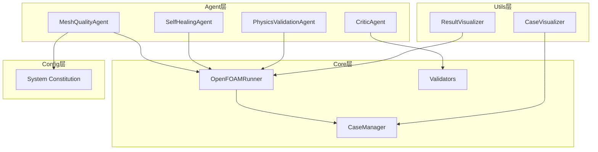
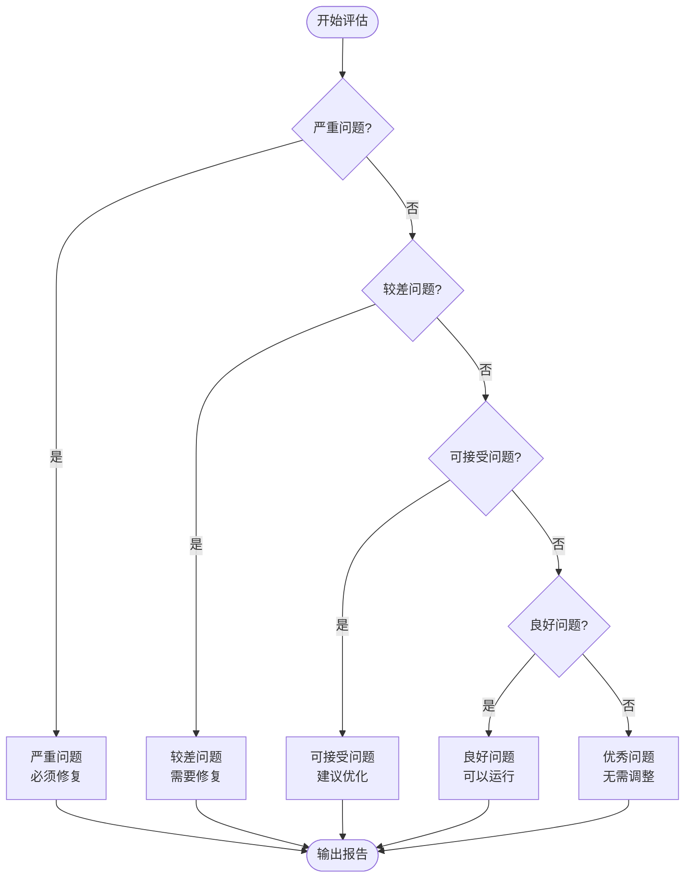
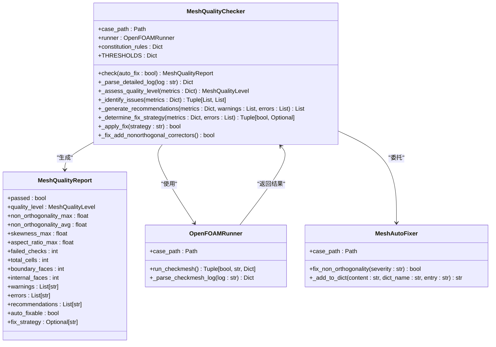
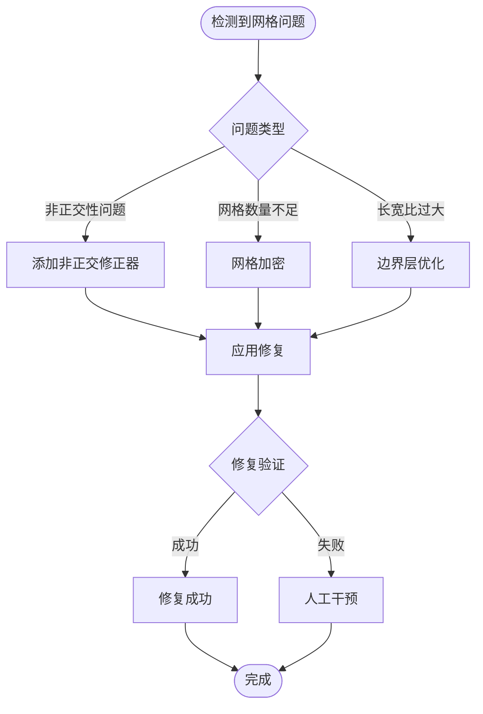
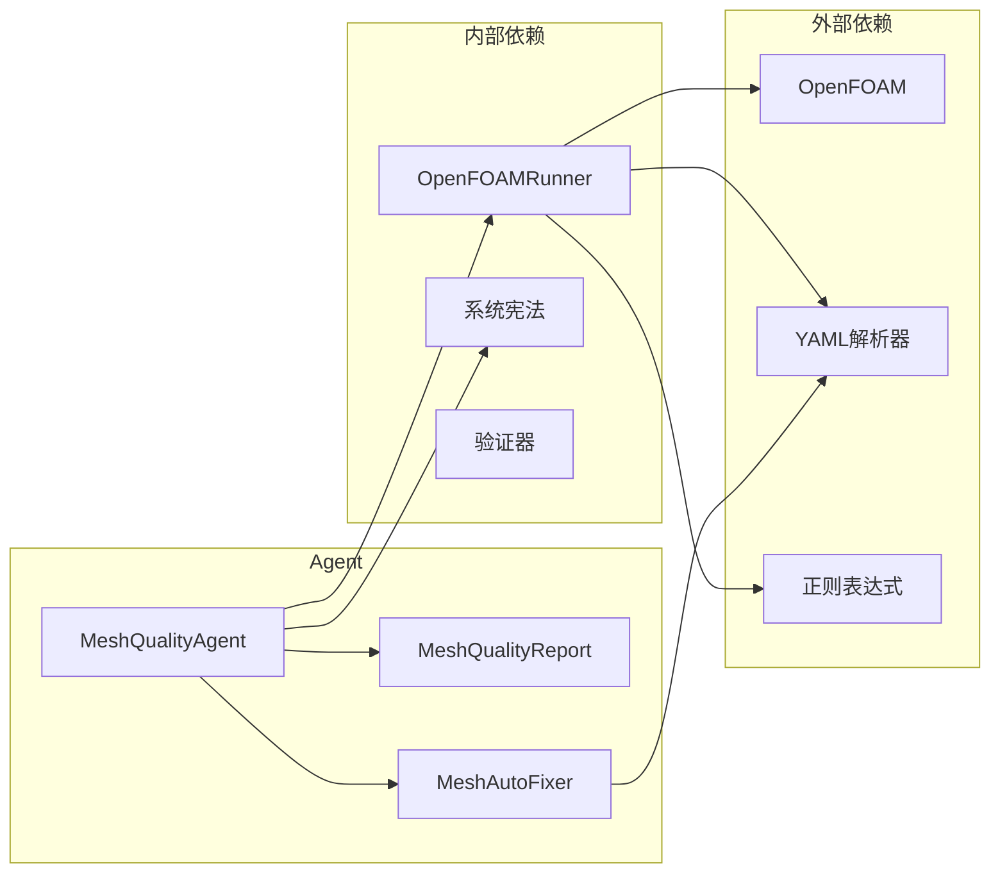
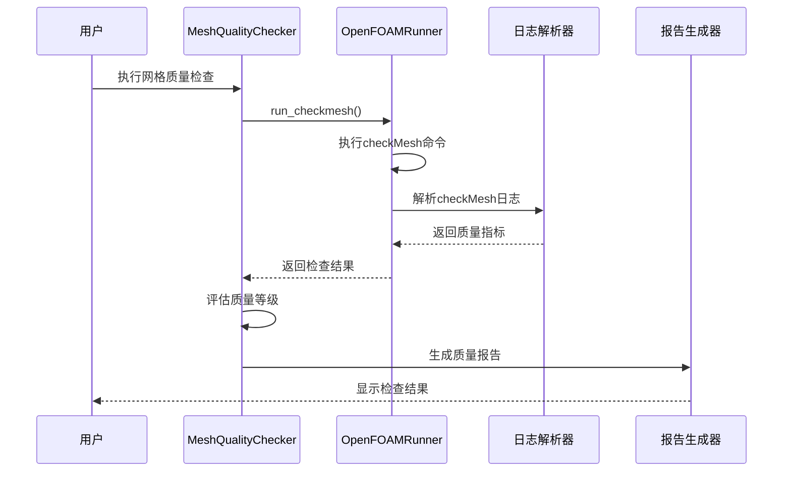

# 网格质量评估Agent开发

<cite>
**本文档引用的文件**
- [mesh_quality_agent.py](file://openfoam_ai/agents/mesh_quality_agent.py)
- [openfoam_runner.py](file://openfoam_ai/core/openfoam_runner.py)
- [system_constitution.yaml](file://openfoam_ai/config/system_constitution.yaml)
- [validators.py](file://openfoam_ai/core/validators.py)
- [case_visualizer.py](file://openfoam_ai/utils/case_visualizer.py)
- [result_visualizer.py](file://openfoam_ai/utils/result_visualizer.py)
- [test_phase2.py](file://openfoam_ai/tests/test_phase2.py)
- [.case_info.json](file://demo_cases/cavity_demo/.case_info.json)
</cite>

## 目录
1. [简介](#简介)
2. [项目结构](#项目结构)
3. [核心组件](#核心组件)
4. [架构概览](#架构概览)
5. [详细组件分析](#详细组件分析)
6. [依赖关系分析](#依赖关系分析)
7. [性能考虑](#性能考虑)
8. [故障排除指南](#故障排除指南)
9. [结论](#结论)
10. [附录](#附录)

## 简介

MeshQualityAgent网格质量评估Agent是OpenFOAM AI Agent系统中的关键组件，负责对CFD算例进行全面的网格质量评估。该Agent基于OpenFOAM的checkMesh工具，结合AI约束宪法和CFD最佳实践，提供智能化的网格质量诊断、自动修复建议和质量报告生成功能。

本Agent专注于以下核心指标的评估：
- **雅可比矩阵质量**：通过非正交性检查评估网格的几何质量
- **扭曲度测量**：通过偏斜度指标评估单元形状质量
- **纵横比分析**：通过长宽比检查评估网格的均匀性
- **正交性检查**：通过非正交性角度评估网格与面法线的垂直程度

## 项目结构

OpenFOAM AI Agent系统的整体架构采用模块化设计，各组件职责明确：



**图表来源**
- [mesh_quality_agent.py:1-547](file://openfoam_ai/agents/mesh_quality_agent.py#L1-L547)
- [openfoam_runner.py:1-548](file://openfoam_ai/core/openfoam_runner.py#L1-L548)
- [system_constitution.yaml:1-103](file://openfoam_ai/config/system_constitution.yaml#L1-L103)

**章节来源**
- [mesh_quality_agent.py:1-547](file://openfoam_ai/agents/mesh_quality_agent.py#L1-L547)
- [openfoam_runner.py:1-548](file://openfoam_ai/core/openfoam_runner.py#L1-L548)

## 核心组件

### 网格质量等级体系

Agent采用五级质量等级评估体系，确保评估结果的标准化和可操作性：



**图表来源**
- [mesh_quality_agent.py:24-31](file://openfoam_ai/agents/mesh_quality_agent.py#L24-L31)
- [mesh_quality_agent.py:233-265](file://openfoam_ai/agents/mesh_quality_agent.py#L233-L265)

### 质量阈值配置

Agent使用双重阈值体系，结合AI约束宪法和CFD最佳实践：

| 指标类型 | 警告阈值 | 失败阈值 | 宪法要求 |
|---------|---------|---------|---------|
| 非正交性 | 70° | 85° | ≤70° |
| 偏斜度 | 4.0 | 10.0 | 无直接限制 |
| 长宽比 | 100 | 1000 | ≤100 |
| 网格数量(2D) | - | - | ≥400单元 |
| 网格数量(3D) | - | - | ≥8000单元 |

**章节来源**
- [mesh_quality_agent.py:72-82](file://openfoam_ai/agents/mesh_quality_agent.py#L72-L82)
- [system_constitution.yaml:13-21](file://openfoam_ai/config/system_constitution.yaml#L13-L21)

## 架构概览

MeshQualityAgent采用分层架构设计，确保代码的可维护性和扩展性：



**图表来源**
- [mesh_quality_agent.py:61-527](file://openfoam_ai/agents/mesh_quality_agent.py#L61-L527)
- [openfoam_runner.py:44-346](file://openfoam_ai/core/openfoam_runner.py#L44-L346)

## 详细组件分析

### 网格质量检查器

MeshQualityChecker是Agent的核心组件，负责执行完整的网格质量评估流程：

#### 关键功能模块

1. **初始化与配置**
   - 加载AI约束宪法规则
   - 初始化OpenFOAMRunner实例
   - 配置质量阈值参数

2. **checkMesh执行**
   - 调用OpenFOAMRunner.run_checkmesh()
   - 捕获并解析checkMesh日志
   - 提取关键质量指标

3. **质量评估**
   - 基于阈值体系评估质量等级
   - 识别潜在问题类型
   - 生成修复建议

4. **自动修复**
   - 判断是否可自动修复
   - 执行修复策略
   - 验证修复效果

**章节来源**
- [mesh_quality_agent.py:84-177](file://openfoam_ai/agents/mesh_quality_agent.py#L84-L177)

### 质量指标解析

Agent能够从checkMesh日志中提取多种关键指标：

#### 非正交性分析
- **最大非正交性角度**：评估网格与面法线的垂直程度
- **平均非正交性角度**：反映整体网格质量水平
- **阈值参考**：宪法要求≤70°，超过85°为严重问题

#### 偏斜度测量
- **最大偏斜度**：评估单元形状质量
- **计算原理**：基于雅可比矩阵的条件数
- **影响**：直接影响数值精度和稳定性

#### 长宽比分析
- **最大长宽比**：评估网格均匀性
- **阈值参考**：宪法要求≤100
- **问题识别**：过大的长宽比导致数值扩散

**章节来源**
- [mesh_quality_agent.py:179-231](file://openfoam_ai/agents/mesh_quality_agent.py#L179-L231)
- [openfoam_runner.py:303-345](file://openfoam_ai/core/openfoam_runner.py#L303-L345)

### 修复策略设计

Agent提供智能的自动修复策略，针对不同问题类型采用相应的修复方法：



**图表来源**
- [mesh_quality_agent.py:351-372](file://openfoam_ai/agents/mesh_quality_agent.py#L351-L372)
- [mesh_quality_agent.py:367-414](file://openfoam_ai/agents/mesh_quality_agent.py#L367-L414)

**章节来源**
- [mesh_quality_agent.py:351-414](file://openfoam_ai/agents/mesh_quality_agent.py#L351-L414)

### 报告生成机制

MeshQualityReport类提供完整的质量报告生成功能：

#### 报告结构
- **基础信息**：算例路径、检查时间、通过状态
- **质量指标**：各项关键指标的数值和单位
- **统计信息**：网格单元数、面数统计
- **问题详情**：警告和错误列表
- **修复建议**：具体的改进建议
- **修复状态**：自动修复可行性

#### 可视化支持
- **交互式提示**：生成用户友好的交互提示
- **质量等级标识**：使用颜色编码标识质量等级
- **问题分类**：按严重性分类问题

**章节来源**
- [mesh_quality_agent.py:34-58](file://openfoam_ai/agents/mesh_quality_agent.py#L34-L58)
- [mesh_quality_agent.py:416-453](file://openfoam_ai/agents/mesh_quality_agent.py#L416-L453)

## 依赖关系分析

### 核心依赖关系



**图表来源**
- [mesh_quality_agent.py:14-21](file://openfoam_ai/agents/mesh_quality_agent.py#L14-L21)
- [openfoam_runner.py:6-13](file://openfoam_ai/core/openfoam_runner.py#L6-L13)

### 数据流分析

Agent的数据处理遵循严格的流水线模式：



**图表来源**
- [mesh_quality_agent.py:111-177](file://openfoam_ai/agents/mesh_quality_agent.py#L111-L177)
- [openfoam_runner.py:87-97](file://openfoam_ai/core/openfoam_runner.py#L87-L97)

**章节来源**
- [mesh_quality_agent.py:111-177](file://openfoam_ai/agents/mesh_quality_agent.py#L111-L177)
- [openfoam_runner.py:87-97](file://openfoam_ai/core/openfoam_runner.py#L87-L97)

## 性能考虑

### 计算复杂度分析

| 操作类型 | 时间复杂度 | 空间复杂度 | 说明 |
|---------|-----------|-----------|------|
| 日志解析 | O(n) | O(1) | n为日志行数 |
| 质量评估 | O(1) | O(1) | 常数时间比较 |
| 修复应用 | O(1) | O(1) | 文件修改操作 |
| 报告生成 | O(k) | O(k) | k为问题数量 |

### 内存使用优化

1. **流式日志处理**：避免一次性加载整个日志文件
2. **增量报告构建**：逐步构建报告对象，减少内存峰值
3. **正则表达式缓存**：复用编译后的正则表达式对象

### 并发处理

Agent目前采用同步处理模式，适合单算例检查场景。对于批量处理需求，可考虑：
- 多线程并发检查多个算例
- 异步I/O操作提升日志读取效率
- 缓存机制减少重复解析

## 故障排除指南

### 常见问题诊断

#### OpenFOAM命令执行失败
**症状**：检查器无法执行checkMesh命令
**原因**：
- OpenFOAM未正确安装
- PATH环境变量配置错误
- 权限不足

**解决方案**：
1. 验证OpenFOAM安装状态
2. 检查PATH环境变量
3. 确认文件权限设置

#### 日志解析错误
**症状**：质量指标提取失败
**原因**：
- checkMesh版本差异
- 日志格式变化
- 编码问题

**解决方案**：
1. 检查OpenFOAM版本兼容性
2. 更新正则表达式模式
3. 验证文件编码格式

#### 修复失败
**症状**：自动修复未生效
**原因**：
- fvSolution文件格式错误
- 配置语法不正确
- 文件权限问题

**解决方案**：
1. 验证fvSolution文件结构
2. 检查配置语法格式
3. 确认文件写入权限

**章节来源**
- [openfoam_runner.py:127-142](file://openfoam_ai/core/openfoam_runner.py#L127-L142)
- [mesh_quality_agent.py:412-414](file://openfoam_ai/agents/mesh_quality_agent.py#L412-L414)

### 调试技巧

1. **启用详细日志**：在开发环境中增加调试输出
2. **单元测试**：编写针对性的单元测试覆盖各种场景
3. **模拟环境**：使用测试用例模拟不同的网格质量状况
4. **性能监控**：监控内存使用和执行时间

## 结论

MeshQualityAgent网格质量评估Agent为OpenFOAM AI系统提供了完整的网格质量保障机制。通过结合AI约束宪法、CFD最佳实践和智能化的自动修复策略，该Agent能够：

1. **全面评估**：覆盖所有关键网格质量指标
2. **智能诊断**：提供准确的问题识别和严重性分级
3. **自动修复**：针对可修复问题提供自动化解决方案
4. **可视化报告**：生成清晰易懂的质量报告

该Agent的设计充分考虑了CFD工程的实际需求，在保证准确性的同时提供了良好的用户体验。通过持续的优化和扩展，该Agent将成为OpenFOAM AI生态系统中不可或缺的重要组件。

## 附录

### 配置参数说明

#### 质量阈值配置
- `non_orthogonality_warn`: 70°（警告阈值）
- `non_orthogonality_fail`: 85°（失败阈值）
- `skewness_warn`: 4.0（警告阈值）
- `skewness_fail`: 10.0（失败阈值）
- `aspect_ratio_warn`: 100（警告阈值）
- `aspect_ratio_fail`: 1000（失败阈值）

#### 宪法要求
- `min_cells_2d`: 400（2D最小网格数）
- `min_cells_3d`: 8000（3D最小网格数）
- `max_aspect_ratio`: 100（最大长宽比）

### 使用示例

```python
# 基本使用
checker = MeshQualityChecker(case_path)
report = checker.check()

# 自动修复模式
report = checker.check(auto_fix=True)

# 生成交互式提示
prompt = checker.generate_interactive_prompt(report)
```

### 扩展建议

1. **多尺度评估**：添加局部网格质量评估功能
2. **机器学习集成**：使用ML模型预测网格质量趋势
3. **实时监控**：集成求解过程中的网格质量监控
4. **云端部署**：支持分布式网格质量评估服务