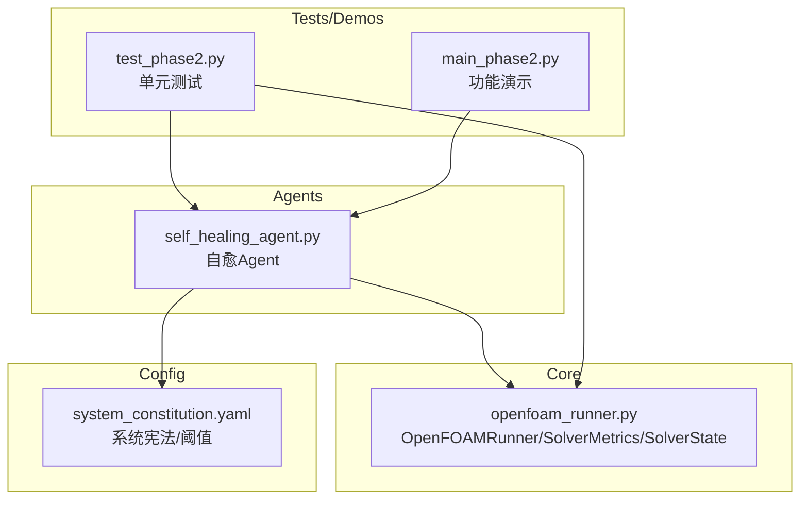
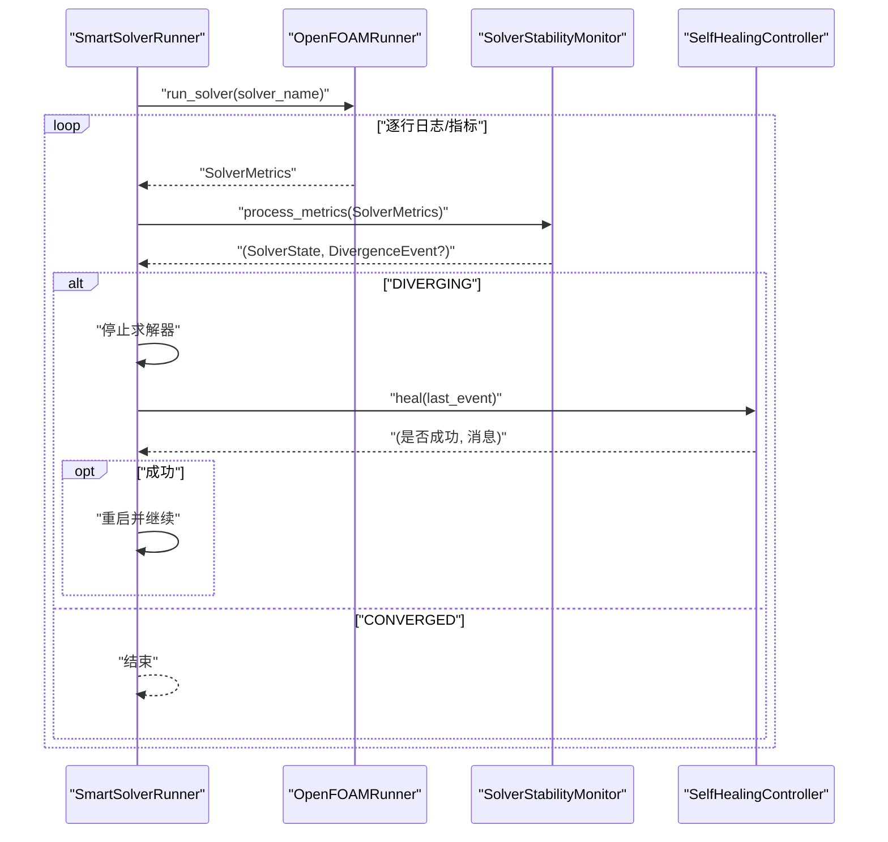
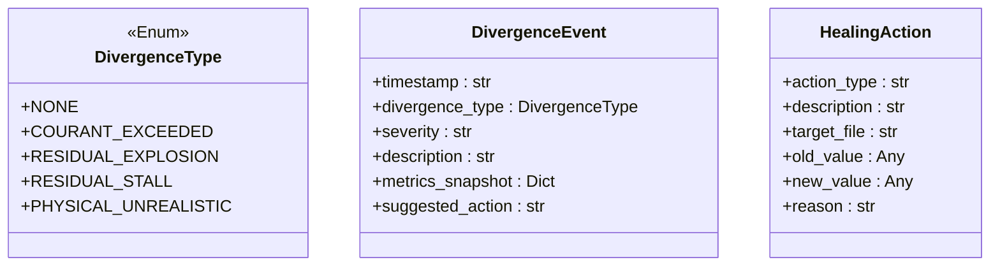
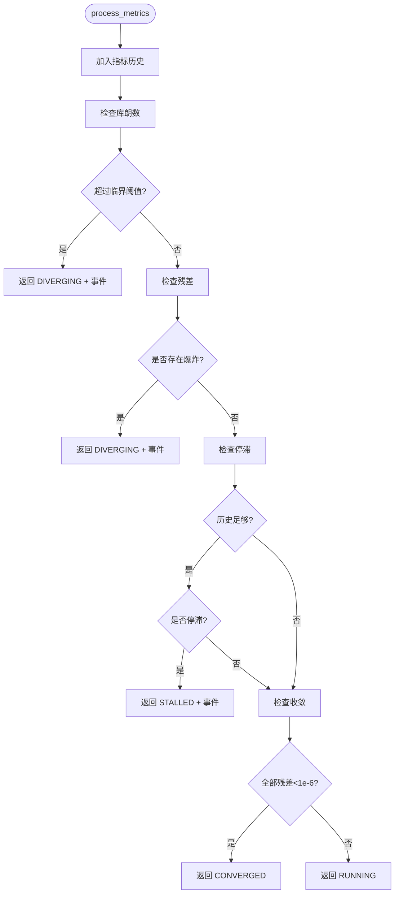
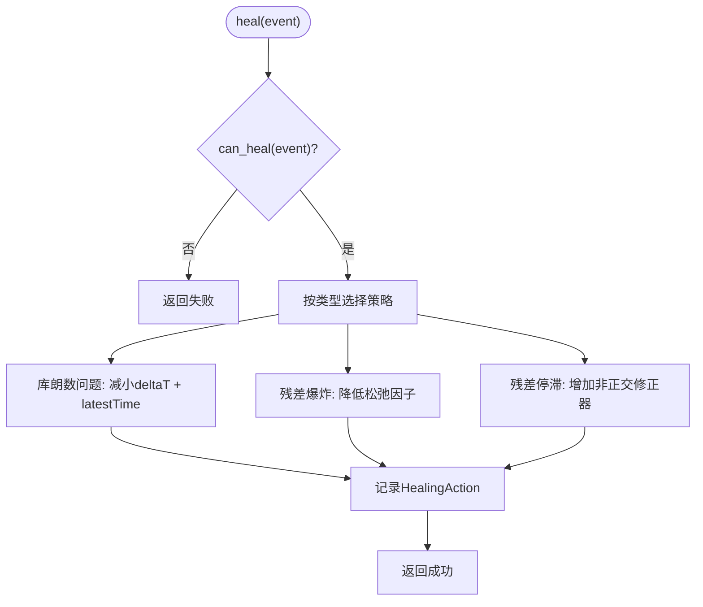
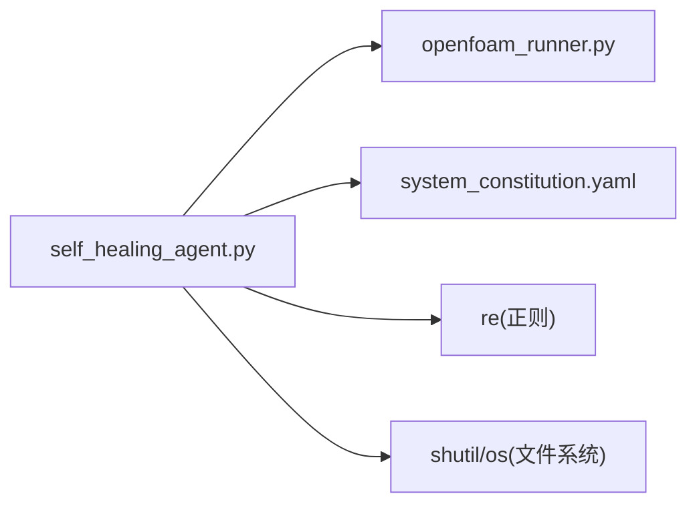

# 自愈Agent开发

<cite>
**本文引用的文件列表**
- [self_healing_agent.py](file://openfoam_ai/agents/self_healing_agent.py)
- [openfoam_runner.py](file://openfoam_ai/core/openfoam_runner.py)
- [system_constitution.yaml](file://openfoam_ai/config/system_constitution.yaml)
- [test_phase2.py](file://openfoam_ai/tests/test_phase2.py)
- [main_phase2.py](file://openfoam_ai/main_phase2.py)
</cite>

## 目录
1. [简介](#简介)
2. [项目结构](#项目结构)
3. [核心组件](#核心组件)
4. [架构总览](#架构总览)
5. [详细组件分析](#详细组件分析)
6. [依赖关系分析](#依赖关系分析)
7. [性能考量](#性能考量)
8. [故障排查指南](#故障排查指南)
9. [结论](#结论)
10. [附录](#附录)

## 简介
本指南面向开发者，系统讲解SelfHealingAgent自愈Agent的设计与实现，重点覆盖：
- SolverStabilityMonitor稳定性监控器：DivergenceType发散类型、DivergenceEvent发散事件、HealingAction自愈动作的数据模型设计
- SolverStabilityMonitor的监控算法：库朗数检查、残差爆炸检测、残差停滞分析、收敛性判断
- SelfHealingController自愈控制器的修复策略：库朗数问题修复、残差爆炸修复、残差停滞修复
- SmartSolverRunner智能运行器的集成机制：监控与自愈的协调工作流程
- 自愈配置参数调优：阈值设置、最大尝试次数、恢复策略选择
- 完整的代码示例与最佳实践，帮助快速理解与扩展

## 项目结构
自愈Agent位于openfoam_ai/agents/self_healing_agent.py，核心运行器位于openfoam_ai/core/openfoam_runner.py，系统约束规则位于openfoam_ai/config/system_constitution.yaml，配套测试与演示位于openfoam_ai/tests/test_phase2.py与openfoam_ai/main_phase2.py。



图表来源
- [self_healing_agent.py:1-642](file://openfoam_ai/agents/self_healing_agent.py#L1-L642)
- [openfoam_runner.py:1-200](file://openfoam_ai/core/openfoam_runner.py#L1-L200)
- [system_constitution.yaml:1-103](file://openfoam_ai/config/system_constitution.yaml#L1-L103)
- [test_phase2.py:1-200](file://openfoam_ai/tests/test_phase2.py#L1-L200)
- [main_phase2.py:80-135](file://openfoam_ai/main_phase2.py#L80-L135)

章节来源
- [self_healing_agent.py:1-642](file://openfoam_ai/agents/self_healing_agent.py#L1-L642)
- [openfoam_runner.py:1-200](file://openfoam_ai/core/openfoam_runner.py#L1-L200)
- [system_constitution.yaml:1-103](file://openfoam_ai/config/system_constitution.yaml#L1-L103)
- [test_phase2.py:1-200](file://openfoam_ai/tests/test_phase2.py#L1-L200)
- [main_phase2.py:80-135](file://openfoam_ai/main_phase2.py#L80-L135)

## 核心组件
- 数据模型
  - DivergenceType：发散类型枚举，包含NONE、COURANT_EXCEEDED、RESIDUAL_EXPLOSION、RESIDUAL_STALL、PHYSICAL_UNREALISTIC
  - DivergenceEvent：发散事件数据类，包含时间戳、发散类型、严重程度、描述、指标快照、建议动作
  - HealingAction：自愈动作数据类，包含动作类型、描述、目标文件、旧值、新值、原因
- 监控器
  - SolverStabilityMonitor：实时解析指标、检测发散模式、记录历史、触发告警；包含阈值配置与趋势分析
- 控制器
  - SelfHealingController：根据发散类型选择修复策略、自动调整OpenFOAM配置、从上次保存点重启、限制最大尝试次数
- 运行器
  - SmartSolverRunner：集成监控与自愈，协调一次或多次重启尝试，收集运行结果与自愈报告

章节来源
- [self_healing_agent.py:27-56](file://openfoam_ai/agents/self_healing_agent.py#L27-L56)
- [self_healing_agent.py:58-230](file://openfoam_ai/agents/self_healing_agent.py#L58-L230)
- [self_healing_agent.py:232-477](file://openfoam_ai/agents/self_healing_agent.py#L232-L477)
- [self_healing_agent.py:479-615](file://openfoam_ai/agents/self_healing_agent.py#L479-L615)

## 架构总览
自愈Agent通过SmartSolverRunner串联OpenFOAMRunner与SolverStabilityMonitor，并在检测到发散时委托SelfHealingController执行修复，随后继续运行直至收敛或完成。



图表来源
- [self_healing_agent.py:479-615](file://openfoam_ai/agents/self_healing_agent.py#L479-L615)
- [openfoam_runner.py:99-198](file://openfoam_ai/core/openfoam_runner.py#L99-L198)

## 详细组件分析

### 数据模型设计
- DivergenceType：统一管理发散类型，便于后续扩展新的发散类型
- DivergenceEvent：标准化发散事件，便于记录与展示；包含严重程度与建议动作
- HealingAction：标准化自愈动作，便于审计与回滚



图表来源
- [self_healing_agent.py:27-56](file://openfoam_ai/agents/self_healing_agent.py#L27-L56)

章节来源
- [self_healing_agent.py:27-56](file://openfoam_ai/agents/self_healing_agent.py#L27-L56)

### SolverStabilityMonitor稳定性监控器
- 监控职责
  - 接收实时指标，维护历史队列
  - 检测库朗数、残差爆炸、残差停滞、收敛状态
  - 生成趋势分析与建议
- 关键阈值
  - 库朗数：临界阈值与警告阈值
  - 残差爆炸：阈值
  - 残差停滞：步数阈值与下降比例阈值
- 算法要点
  - 库朗数检查：超过临界阈值即判定为发散；超过警告阈值且连续多步则发出警告
  - 残差爆炸：任一变量残差超过阈值即判定为发散
  - 残差停滞：在固定窗口内检查变量残差是否停滞（下降比例小于阈值）
  - 收敛判断：所有变量残差均低于1e-6



图表来源
- [self_healing_agent.py:86-197](file://openfoam_ai/agents/self_healing_agent.py#L86-L197)

章节来源
- [self_healing_agent.py:58-230](file://openfoam_ai/agents/self_healing_agent.py#L58-L230)

### SelfHealingController自愈控制器
- 修复策略
  - 库朗数问题：减小时间步长、设置从latestTime重启
  - 残差爆炸：降低松弛因子（限制上限），保留历史记录
  - 残差停滞：增加非正交修正器（nNonOrthogonalCorrectors）
- 保护机制
  - 限制最大尝试次数
  - 某些发散类型（如物理量不现实）不自动修复
  - 自动备份原始配置，支持重置



图表来源
- [self_healing_agent.py:264-442](file://openfoam_ai/agents/self_healing_agent.py#L264-L442)

章节来源
- [self_healing_agent.py:232-477](file://openfoam_ai/agents/self_healing_agent.py#L232-L477)

### SmartSolverRunner智能运行器
- 协作流程
  - 通过OpenFOAMRunner实时获取SolverMetrics
  - 使用SolverStabilityMonitor判断状态与事件
  - 若检测到发散且允许自愈，则调用SelfHealingController执行修复
  - 限制最大重启次数，汇总运行结果与自愈报告
- 结果结构
  - 包含求解器名称、起止时间、状态、重启次数、发散事件列表、最终指标、自愈报告

```mermaid
sequenceDiagram
participant SR as "SmartSolverRunner"
participant OR as "OpenFOAMRunner"
participant SM as "SolverStabilityMonitor"
participant HC as "SelfHealingController"
SR->>OR : "run_solver(...)"
loop "指标流"
OR-->>SR : "SolverMetrics"
SR->>SM : "process_metrics"
SM-->>SR : "(state, event?)"
alt "DIVERGING"
SR->>HC : "heal(last_event)"
HC-->>SR : "(ok, msg)"
opt "ok"
SR->>SR : "重启并继续"
else "fail"
SR-->>SR : "标记失败并退出"
end
else "CONVERGED"
SR-->>SR : "标记收敛并退出"
end
end
```

图表来源
- [self_healing_agent.py:479-615](file://openfoam_ai/agents/self_healing_agent.py#L479-L615)

章节来源
- [self_healing_agent.py:479-615](file://openfoam_ai/agents/self_healing_agent.py#L479-L615)

## 依赖关系分析
- 模块耦合
  - self_healing_agent依赖openfoam_runner的SolverMetrics/SolverState
  - 配置参数来源于system_constitution.yaml（通过validators加载）
- 外部依赖
  - 正则表达式用于解析与修改OpenFOAM配置文件
  - 文件系统用于备份与恢复配置



图表来源
- [self_healing_agent.py:17-25](file://openfoam_ai/agents/self_healing_agent.py#L17-L25)
- [openfoam_runner.py:70-76](file://openfoam_ai/core/openfoam_runner.py#L70-L76)
- [system_constitution.yaml:23-31](file://openfoam_ai/config/system_constitution.yaml#L23-L31)

章节来源
- [self_healing_agent.py:17-25](file://openfoam_ai/agents/self_healing_agent.py#L17-L25)
- [openfoam_runner.py:70-76](file://openfoam_ai/core/openfoam_runner.py#L70-L76)
- [system_constitution.yaml:23-31](file://openfoam_ai/config/system_constitution.yaml#L23-L31)

## 性能考量
- 指标历史管理
  - 使用deque控制最大历史长度，避免内存膨胀
- 检测复杂度
  - 库朗数与残差爆炸检查为O(1)，残差停滞检查为O(N)窗口内的遍历
- I/O开销
  - 配置文件读写与正则替换为主要开销，建议批量修改与缓存
- 并发与中断
  - 当前实现为串行流式处理；若需并发，应考虑线程安全与锁

[本节为通用性能讨论，无需特定文件来源]

## 故障排查指南
- 常见问题
  - 无法解析deltaT：确认controlDict中存在deltaT定义
  - 未找到可修改的松弛因子：确认fvSolution中存在relaxationFactors段落
  - 非正交修正器未生效：确认nNonOrthogonalCorrectors字段存在或正确添加
- 调试建议
  - 在OpenFOAMRunner中打印日志行，定位解析失败位置
  - 使用单元测试验证各检查逻辑与修复策略
  - 参考演示脚本main_phase2.py进行端到端验证

章节来源
- [test_phase2.py:150-226](file://openfoam_ai/tests/test_phase2.py#L150-L226)
- [main_phase2.py:87-135](file://openfoam_ai/main_phase2.py#L87-L135)

## 结论
SelfHealingAgent通过清晰的数据模型、稳健的监控算法与可扩展的修复策略，实现了OpenFOAM求解过程中的自动诊断与自愈。配合SmartSolverRunner的协调机制，能够在不中断用户交互的前提下提升求解成功率与稳定性。建议在生产环境中结合系统宪法与阈值配置，按需调整监控与修复策略。

[本节为总结性内容，无需特定文件来源]

## 附录

### 自愈配置参数调优指南
- 阈值设置
  - 库朗数：参考system_constitution.yaml中的通用限制与求解器标准，结合具体算例调整临界与警告阈值
  - 残差爆炸：根据变量量级设定合理阈值，避免误报
  - 残差停滞：窗口大小与下降比例阈值需结合算例收敛特性调优
- 最大尝试次数
  - 建议从3开始，逐步增加以平衡成功率与耗时
- 恢复策略选择
  - 库朗数问题优先减小时间步长
  - 残差爆炸优先降低松弛因子
  - 残差停滞优先增加非正交修正器
- 参考配置
  - 系统宪法中包含求解器标准与错误处理策略，可作为阈值与策略的依据

章节来源
- [system_constitution.yaml:23-31](file://openfoam_ai/config/system_constitution.yaml#L23-L31)
- [system_constitution.yaml:84-96](file://openfoam_ai/config/system_constitution.yaml#L84-L96)
- [self_healing_agent.py:74-79](file://openfoam_ai/agents/self_healing_agent.py#L74-L79)

### 代码示例与最佳实践
- 示例路径
  - 自愈控制器初始化与修复：[self_healing_agent.py:243-300](file://openfoam_ai/agents/self_healing_agent.py#L243-L300)
  - 库朗数修复策略：[self_healing_agent.py:302-350](file://openfoam_ai/agents/self_healing_agent.py#L302-L350)
  - 残差爆炸修复策略：[self_healing_agent.py:351-402](file://openfoam_ai/agents/self_healing_agent.py#L351-L402)
  - 残差停滞修复策略：[self_healing_agent.py:403-442](file://openfoam_ai/agents/self_healing_agent.py#L403-L442)
  - 智能运行器集成：[self_healing_agent.py:479-615](file://openfoam_ai/agents/self_healing_agent.py#L479-L615)
  - 单元测试验证：[test_phase2.py:150-226](file://openfoam_ai/tests/test_phase2.py#L150-L226)
  - 功能演示：[main_phase2.py:87-135](file://openfoam_ai/main_phase2.py#L87-L135)

最佳实践
- 在修复前先备份原始配置，确保可回滚
- 修复策略应与系统宪法一致，避免破坏物理一致性
- 对关键参数修改进行记录与审计，便于追踪与复现
- 结合趋势分析与告警，避免频繁重启导致资源浪费