# 扩展开发指南

<cite>
**本文档引用的文件**
- [openfoam_ai/agents/__init__.py](file://openfoam_ai/agents/__init__.py)
- [openfoam_ai/agents/self_healing_agent.py](file://openfoam_ai/agents/self_healing_agent.py)
- [openfoam_ai/agents/physics_validation_agent.py](file://openfoam_ai/agents/physics_validation_agent.py)
- [openfoam_ai/agents/mesh_quality_agent.py](file://openfoam_ai/agents/mesh_quality_agent.py)
- [openfoam_ai/agents/geometry_image_agent.py](file://openfoam_ai/agents/geometry_image_agent.py)
- [openfoam_ai/agents/postprocessing_agent.py](file://openfoam_ai/agents/postprocessing_agent.py)
- [openfoam_ai/agents/critic_agent.py](file://openfoam_ai/agents/critic_agent.py)
- [openfoam_ai/agents/manager_agent.py](file://openfoam_ai/agents/manager_agent.py)
- [openfoam_ai/core/openfoam_runner.py](file://openfoam_ai/core/openfoam_runner.py)
- [openfoam_ai/core/validators.py](file://openfoam_ai/core/validators.py)
- [openfoam_ai/config/system_constitution.yaml](file://openfoam_ai/config/system_constitution.yaml)
- [openfoam_ai/main.py](file://openfoam_ai/main.py)
</cite>

## 目录
1. [项目概述](#项目概述)
2. [系统架构](#系统架构)
3. [Agent扩展机制](#agent扩展机制)
4. [SelfHealingAgent自愈Agent开发](#selfhealingagent自愈agent开发)
5. [PhysicsValidationAgent物理验证Agent开发](#physicsvalidationagent物理验证agent开发)
6. [MeshQualityAgent网格质量Agent开发](#meshqualityagent网格质量agent开发)
7. [GeometryImageAgent几何图像Agent开发](#geometryimageagent几何图像agent开发)
8. [PostProcessingAgent后处理Agent开发](#postprocessingagent后处理agent开发)
9. [CriticAgent审查Agent开发](#criticagent审查agent开发)
10. [新Agent开发模板](#新agent开发模板)
11. [最佳实践](#最佳实践)
12. [插件系统扩展点](#插件系统扩展点)
13. [第三方库集成](#第三方库集成)
14. [故障排查指南](#故障排查指南)
15. [总结](#总结)

## 项目概述

OpenFOAM AI项目是一个基于大语言模型的自动化CFD仿真智能体系统，旨在通过智能化的Agent协作来简化CFD仿真流程。该项目采用模块化设计，包含多个专门的Agent来处理不同的仿真任务。

项目的核心特点包括：
- 基于AI约束宪法的硬约束验证系统
- 多Agent协作的智能体架构
- 完整的CFD仿真工作流自动化
- 强大的网格质量和物理验证能力

## 系统架构

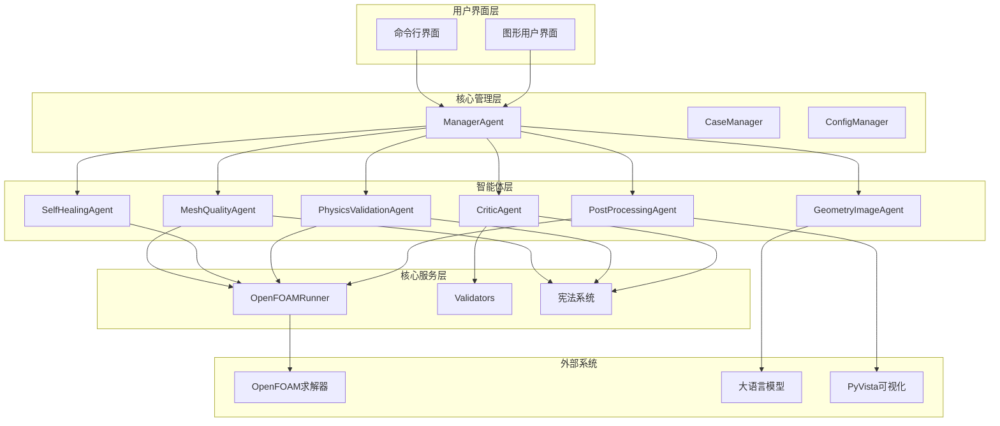
```mermaid
graph TB
subgraph "用户界面层"
CLI[命令行界面]
GUI[图形用户界面]
end
subgraph "核心管理层"
Manager[ManagerAgent]
CaseMgr[CaseManager]
ConfigMgr[ConfigManager]
end
subgraph "智能体层"
MeshAgent[MeshQualityAgent]
HealAgent[SelfHealingAgent]
PhysAgent[PhysicsValidationAgent]
GeoAgent[GeometryImageAgent]
PostAgent[PostProcessingAgent]
Critic[CriticAgent]
end
subgraph "核心服务层"
Runner[OpenFOAMRunner]
Validator[Validators]
Constitution[宪法系统]
end
subgraph "外部系统"
OpenFOAM[OpenFOAM求解器]
LLM[大语言模型]
PyVista[PyVista可视化]
end
CLI --> Manager
GUI --> Manager
Manager --> MeshAgent
Manager --> HealAgent
Manager --> PhysAgent
Manager --> GeoAgent
Manager --> PostAgent
Manager --> Critic
MeshAgent --> Runner
HealAgent --> Runner
PhysAgent --> Runner
PostAgent --> Runner
Critic --> Validator
Runner --> OpenFOAM
MeshAgent --> Constitution
PhysAgent --> Constitution
Critic --> Constitution
GeoAgent --> LLM
PostAgent --> PyVista
```

**图表来源**
- [openfoam_ai/agents/manager_agent.py:38-458](file://openfoam_ai/agents/manager_agent.py#L38-L458)
- [openfoam_ai/core/openfoam_runner.py:44-548](file://openfoam_ai/core/openfoam_runner.py#L44-L548)

## Agent扩展机制

### Agent接口设计原则

所有Agent都遵循统一的接口规范：

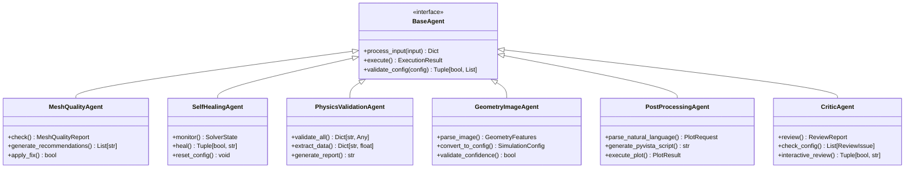
```mermaid
classDiagram
class BaseAgent {
<<interface>>
+process_input(input) Dict
+execute() ExecutionResult
+validate_config(config) Tuple[bool, List]
}
class MeshQualityAgent {
+check() MeshQualityReport
+generate_recommendations() List[str]
+apply_fix() bool
}
class SelfHealingAgent {
+monitor() SolverState
+heal() Tuple[bool, str]
+reset_config() void
}
class PhysicsValidationAgent {
+validate_all() Dict[str, Any]
+extract_data() Dict[str, float]
+generate_report() str
}
class GeometryImageAgent {
+parse_image() GeometryFeatures
+convert_to_config() SimulationConfig
+validate_confidence() bool
}
class PostProcessingAgent {
+parse_natural_language() PlotRequest
+generate_pyvista_script() str
+execute_plot() PlotResult
}
class CriticAgent {
+review() ReviewReport
+check_config() List[ReviewIssue]
+interactive_review() Tuple[bool, str]
}
BaseAgent <|-- MeshQualityAgent
BaseAgent <|-- SelfHealingAgent
BaseAgent <|-- PhysicsValidationAgent
BaseAgent <|-- GeometryImageAgent
BaseAgent <|-- PostProcessingAgent
BaseAgent <|-- CriticAgent
```

**图表来源**
- [openfoam_ai/agents/mesh_quality_agent.py:61-547](file://openfoam_ai/agents/mesh_quality_agent.py#L61-L547)
- [openfoam_ai/agents/self_healing_agent.py:58-642](file://openfoam_ai/agents/self_healing_agent.py#L58-L642)
- [openfoam_ai/agents/physics_validation_agent.py:174-517](file://openfoam_ai/agents/physics_validation_agent.py#L174-L517)
- [openfoam_ai/agents/geometry_image_agent.py:78-533](file://openfoam_ai/agents/geometry_image_agent.py#L78-L533)
- [openfoam_ai/agents/postprocessing_agent.py:108-588](file://openfoam_ai/agents/postprocessing_agent.py#L108-L588)
- [openfoam_ai/agents/critic_agent.py:286-629](file://openfoam_ai/agents/critic_agent.py#L286-L629)

### Agent协作机制

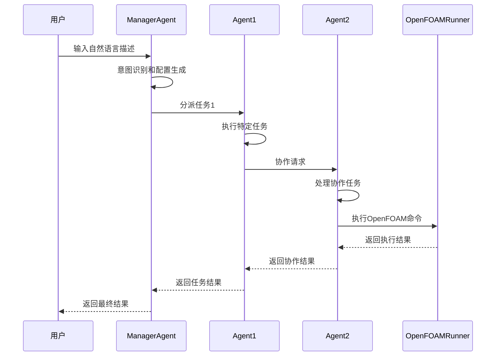
```mermaid
sequenceDiagram
participant User as 用户
participant Manager as ManagerAgent
participant Agent1 as Agent1
participant Agent2 as Agent2
participant Runner as OpenFOAMRunner
User->>Manager : 输入自然语言描述
Manager->>Manager : 意图识别和配置生成
Manager->>Agent1 : 分派任务1
Agent1->>Agent1 : 执行特定任务
Agent1->>Agent2 : 协作请求
Agent2->>Agent2 : 处理协作任务
Agent2->>Runner : 执行OpenFOAM命令
Runner-->>Agent2 : 返回执行结果
Agent2-->>Agent1 : 返回协作结果
Agent1-->>Manager : 返回任务结果
Manager-->>User : 返回最终结果
```

**图表来源**
- [openfoam_ai/agents/manager_agent.py:75-458](file://openfoam_ai/agents/manager_agent.py#L75-L458)
- [openfoam_ai/core/openfoam_runner.py:99-198](file://openfoam_ai/core/openfoam_runner.py#L99-L198)

## SelfHealingAgent自愈Agent开发

### 故障检测机制

SelfHealingAgent实现了多层次的故障检测系统：

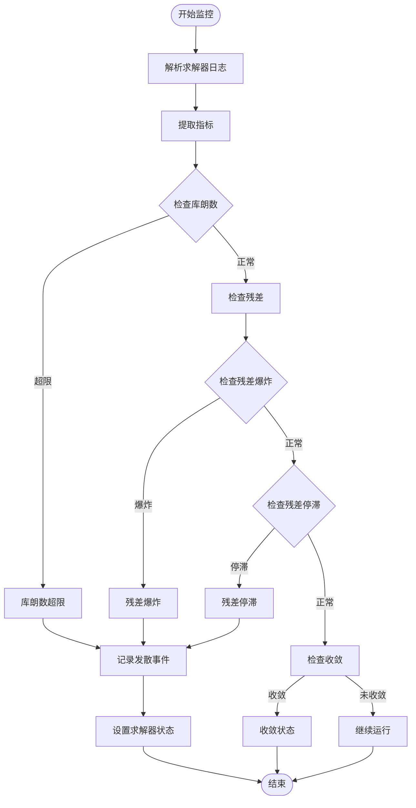
```mermaid
flowchart TD
Start([开始监控]) --> ParseLog[解析求解器日志]
ParseLog --> ExtractMetrics[提取指标]
ExtractMetrics --> CheckCourant{检查库朗数}
CheckCourant --> |超限| CourantExceeded[库朗数超限]
CheckCourant --> |正常| CheckResiduals[检查残差]
CourantExceeded --> DetectEvent[记录发散事件]
CheckResiduals --> CheckExplosion{检查残差爆炸}
CheckExplosion --> |爆炸| ResidualExplosion[残差爆炸]
CheckExplosion --> |正常| CheckStall{检查残差停滞}
ResidualExplosion --> DetectEvent
CheckStall --> |停滞| ResidualStall[残差停滞]
CheckStall --> |正常| CheckConvergence[检查收敛]
ResidualStall --> DetectEvent
CheckConvergence --> |收敛| Converged[收敛状态]
CheckConvergence --> |未收敛| Running[继续运行]
DetectEvent --> SetState[设置求解器状态]
SetState --> End([结束])
Converged --> End
Running --> End
```

**图表来源**
- [openfoam_ai/agents/self_healing_agent.py:86-196](file://openfoam_ai/agents/self_healing_agent.py#L86-L196)

### 自动修复策略

自愈Agent提供了三种主要的修复策略：

1. **库朗数超限修复**：自动减小时间步长并从最新时间步重启
2. **残差爆炸修复**：减小松弛因子以提高数值稳定性
3. **残差停滞修复**：增加非正交修正器来改善收敛性

### 恢复机制实现

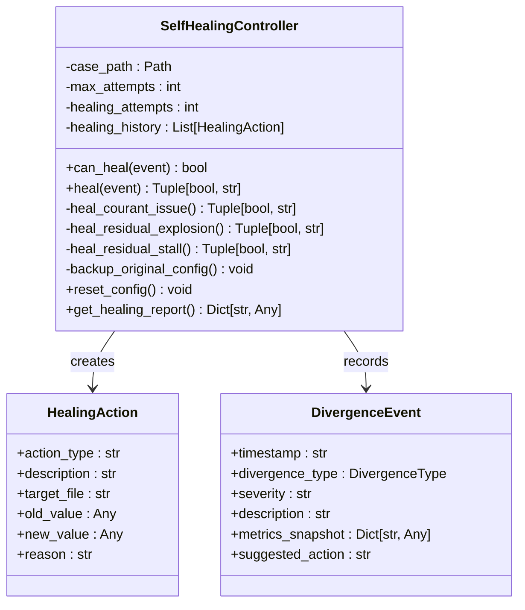
```mermaid
classDiagram
class SelfHealingController {
-case_path : Path
-max_attempts : int
-healing_attempts : int
-healing_history : List[HealingAction]
+can_heal(event) bool
+heal(event) Tuple[bool, str]
-heal_courant_issue() Tuple[bool, str]
-heal_residual_explosion() Tuple[bool, str]
-heal_residual_stall() Tuple[bool, str]
-backup_original_config() void
+reset_config() void
+get_healing_report() Dict[str, Any]
}
class HealingAction {
+action_type : str
+description : str
+target_file : str
+old_value : Any
+new_value : Any
+reason : str
}
class DivergenceEvent {
+timestamp : str
+divergence_type : DivergenceType
+severity : str
+description : str
+metrics_snapshot : Dict[str, Any]
+suggested_action : str
}
SelfHealingController --> HealingAction : creates
SelfHealingController --> DivergenceEvent : records
```

**图表来源**
- [openfoam_ai/agents/self_healing_agent.py:232-476](file://openfoam_ai/agents/self_healing_agent.py#L232-L476)

**章节来源**
- [openfoam_ai/agents/self_healing_agent.py:1-642](file://openfoam_ai/agents/self_healing_agent.py#L1-L642)

## PhysicsValidationAgent物理验证Agent开发

### 验证规则定义

PhysicsValidationAgent实现了全面的物理验证体系：

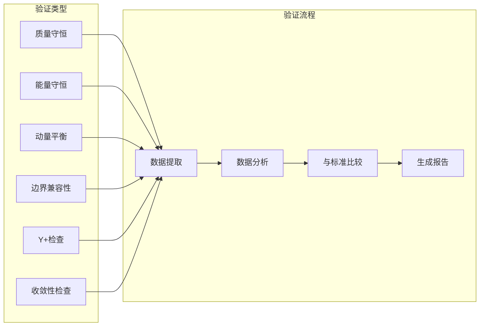
```mermaid
graph LR
subgraph "验证类型"
Mass[质量守恒]
Energy[能量守恒]
Momentum[动量平衡]
Boundary[边界兼容性]
YPlus[Y+检查]
Convergence[收敛性检查]
end
subgraph "验证流程"
Extract[数据提取] --> Analyze[数据分析]
Analyze --> Compare[与标准比较]
Compare --> Report[生成报告]
end
Mass --> Extract
Energy --> Extract
Momentum --> Extract
Boundary --> Extract
YPlus --> Extract
Convergence --> Extract
```

**图表来源**
- [openfoam_ai/agents/physics_validation_agent.py:17-517](file://openfoam_ai/agents/physics_validation_agent.py#L17-L517)

### 物理约束检查

验证Agent基于AI约束宪法进行硬约束检查：

| 验证类型 | 容差要求 | 检查方法 | 宪法依据 |
|---------|---------|---------|----------|
| 质量守恒 | ±0.1% | 进出口流量平衡 | Core_Directives.2 |
| 能量守恒 | ±0.1% | 热量收支平衡 | Core_Directives.2 |
| 收敛性 | 1e-6 | 残差阈值检查 | Solver_Standards.24 |
| 边界兼容性 | 无量纲 | 物理合理性检查 | Prohibited_Combinations |

### 结果评估标准

验证结果采用五级评估标准：

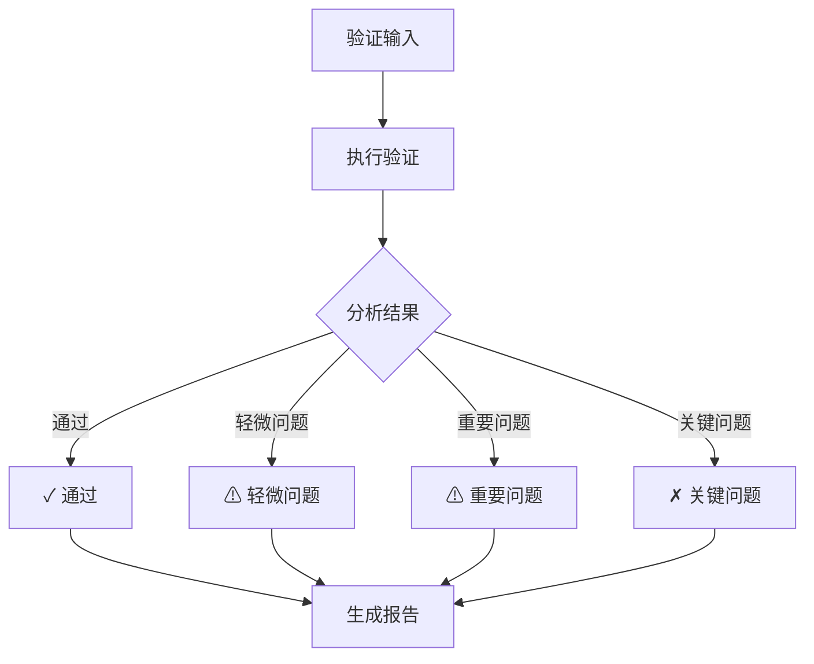
```mermaid
flowchart TD
Input[验证输入] --> Process[执行验证]
Process --> Analyze{分析结果}
Analyze --> |通过| Pass[✓ 通过]
Analyze --> |轻微问题| Minor[⚠ 轻微问题]
Analyze --> |重要问题| Major[⚠ 重要问题]
Analyze --> |关键问题| Critical[✗ 关键问题]
Pass --> Output[生成报告]
Minor --> Output
Major --> Output
Critical --> Output
```

**图表来源**
- [openfoam_ai/agents/physics_validation_agent.py:197-224](file://openfoam_ai/agents/physics_validation_agent.py#L197-L224)

**章节来源**
- [openfoam_ai/agents/physics_validation_agent.py:1-517](file://openfoam_ai/agents/physics_validation_agent.py#L1-L517)

## MeshQualityAgent网格质量Agent开发

### 网格质量指标

MeshQualityAgent实现了多维度的网格质量评估：

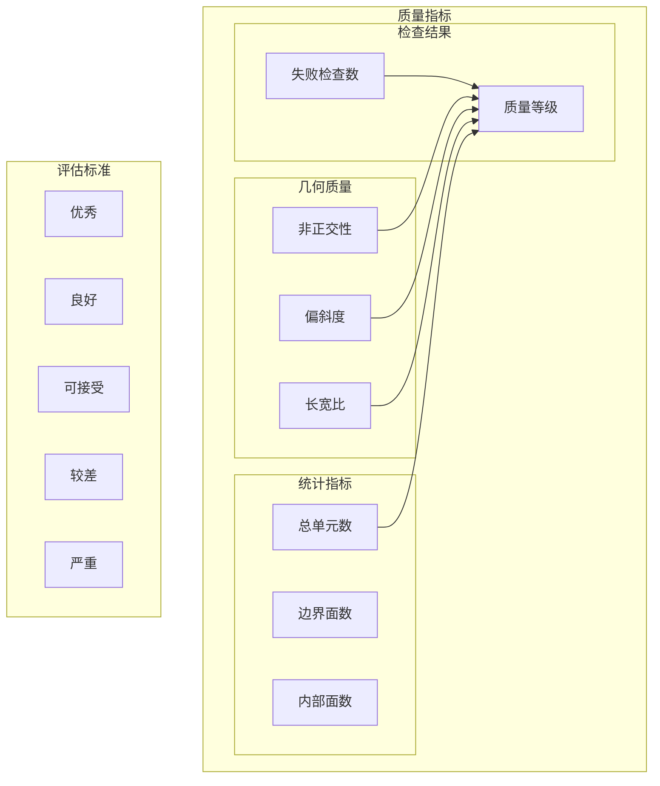
```mermaid
graph TB
subgraph "质量指标"
subgraph "几何质量"
NonOrtho[非正交性]
Skewness[偏斜度]
AspectRatio[长宽比]
end
subgraph "统计指标"
TotalCells[总单元数]
BoundaryFaces[边界面数]
InternalFaces[内部面数]
end
subgraph "检查结果"
FailedChecks[失败检查数]
QualityLevel[质量等级]
end
end
subgraph "评估标准"
Excellent[优秀]
Good[良好]
Acceptable[可接受]
Poor[较差]
Critical[严重]
end
NonOrtho --> QualityLevel
Skewness --> QualityLevel
AspectRatio --> QualityLevel
TotalCells --> QualityLevel
FailedChecks --> QualityLevel
```

**图表来源**
- [openfoam_ai/agents/mesh_quality_agent.py:24-162](file://openfoam_ai/agents/mesh_quality_agent.py#L24-L162)

### 评估算法实现

网格质量评估采用层次化算法：

1. **基础指标提取**：从checkMesh日志中提取关键指标
2. **阈值比较**：与宪法标准进行对比
3. **质量等级判定**：根据多项指标综合评估
4. **问题识别**：自动识别潜在问题
5. **修复建议**：提供针对性的改进建议

### 改进建议生成

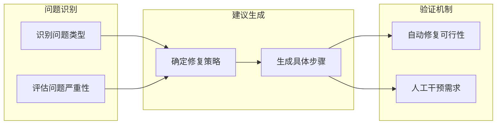
```mermaid
flowchart LR
subgraph "问题识别"
Issue[识别问题类型]
Severity[评估问题严重性]
end
subgraph "建议生成"
Strategy[确定修复策略]
Implementation[生成具体步骤]
end
subgraph "验证机制"
AutoFix[自动修复可行性]
Manual[人工干预需求]
end
Issue --> Strategy
Severity --> Strategy
Strategy --> Implementation
Implementation --> AutoFix
Implementation --> Manual
```

**图表来源**
- [openfoam_ai/agents/mesh_quality_agent.py:311-365](file://openfoam_ai/agents/mesh_quality_agent.py#L311-L365)

**章节来源**
- [openfoam_ai/agents/mesh_quality_agent.py:1-547](file://openfoam_ai/agents/mesh_quality_agent.py#L1-L547)

## GeometryImageAgent几何图像Agent开发

### 几何特征提取

GeometryImageAgent实现了基于视觉模型的几何解析功能：

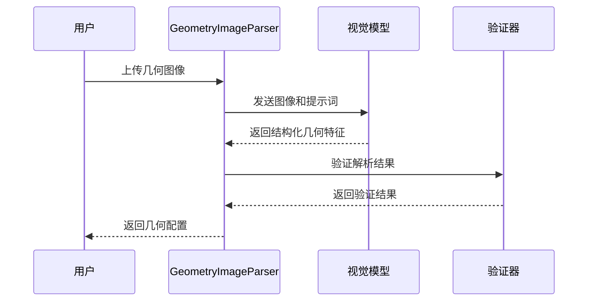
```mermaid
sequenceDiagram
participant User as 用户
participant Parser as GeometryImageParser
participant Vision as 视觉模型
participant Validator as 验证器
User->>Parser : 上传几何图像
Parser->>Vision : 发送图像和提示词
Vision-->>Parser : 返回结构化几何特征
Parser->>Validator : 验证解析结果
Validator-->>Parser : 返回验证结果
Parser-->>User : 返回几何配置
```

**图表来源**
- [openfoam_ai/agents/geometry_image_agent.py:184-375](file://openfoam_ai/agents/geometry_image_agent.py#L184-L375)

### 几何类型识别

支持的几何类型包括：

| 几何类型 | 特征描述 | 网格要求 |
|---------|---------|----------|
| 矩形 | 平面几何，四个直角 | 2D: ≥20×20网格 |
| 圆形 | 轴对称几何 | 2D: ≥20×20网格 |
| 管道 | 轴对称管道 | 3D: ≥20×20×20网格 |
| 方腔 | 封闭腔体 | 2D: ≥20×20网格 |
| 翼型 | 空气动力学外形 | 2D: ≥20×20网格 |

### 边界条件推断

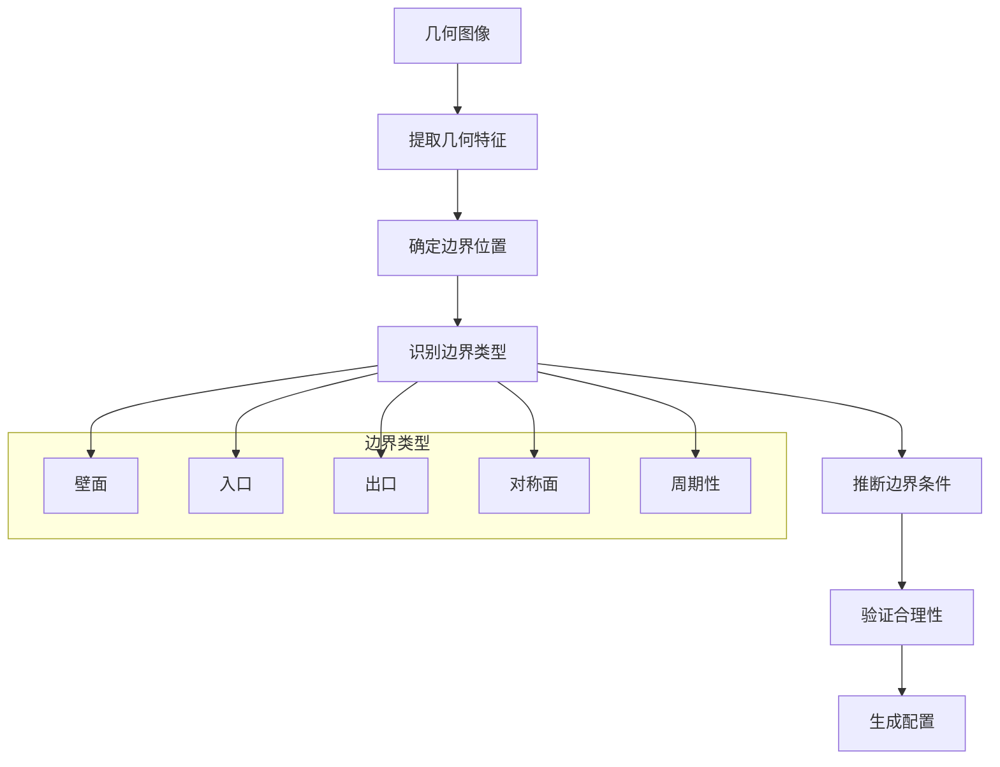
```mermaid
flowchart TD
Image[几何图像] --> Features[提取几何特征]
Features --> Position[确定边界位置]
Position --> Type[识别边界类型]
Type --> Condition[推断边界条件]
Condition --> Validate[验证合理性]
Validate --> Config[生成配置]
subgraph "边界类型"
Wall[壁面]
Inlet[入口]
Outlet[出口]
Symmetry[对称面]
Periodic[周期性]
end
Type --> Wall
Type --> Inlet
Type --> Outlet
Type --> Symmetry
Type --> Periodic
```

**图表来源**
- [openfoam_ai/agents/geometry_image_agent.py:371-482](file://openfoam_ai/agents/geometry_image_agent.py#L371-L482)

**章节来源**
- [openfoam_ai/agents/geometry_image_agent.py:1-533](file://openfoam_ai/agents/geometry_image_agent.py#L1-L533)

## PostProcessingAgent后处理Agent开发

### 绘图类型支持

PostProcessingAgent支持多种可视化类型：

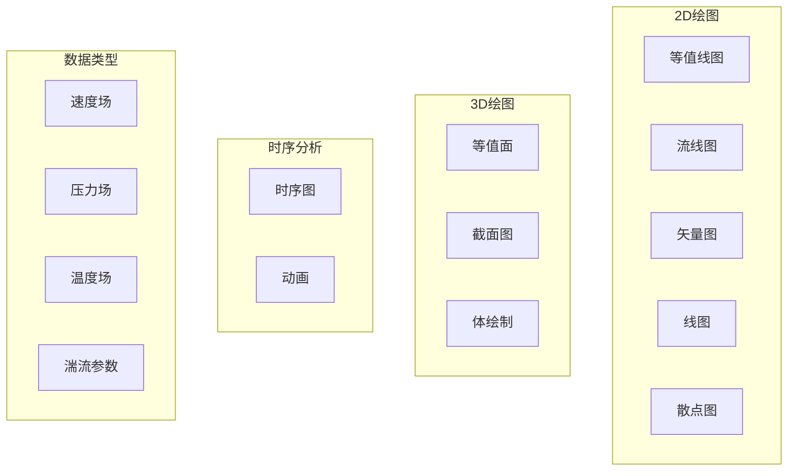
```mermaid
graph TB
subgraph "2D绘图"
Contour[等值线图]
Streamline[流线图]
Vector[矢量图]
LinePlot[线图]
Scatter[散点图]
end
subgraph "3D绘图"
Isosurface[等值面]
Slice[截面图]
Volume[体绘制]
end
subgraph "时序分析"
TimeSeries[时序图]
Animation[动画]
end
subgraph "数据类型"
Velocity[速度场]
Pressure[压力场]
Temperature[温度场]
Turbulence[湍流参数]
end
```

**图表来源**
- [openfoam_ai/agents/postprocessing_agent.py:36-106](file://openfoam_ai/agents/postprocessing_agent.py#L36-L106)

### 自然语言解析

Agent能够理解用户的各种绘图需求：

| 用户表达 | 绘图类型 | 场变量 | 位置描述 |
|---------|---------|--------|----------|
| "绘制中心截面的速度等值线" | 等值线图 | 速度 | 中心截面 |
| "画出入口处的压力分布" | 截面图 | 压力 | 入口截面 |
| "生成流线图展示流动方向" | 流线图 | 速度 | 全域 |
| "制作温度随时间的变化曲线" | 时序图 | 温度 | 指定点 |

### PyVista脚本生成

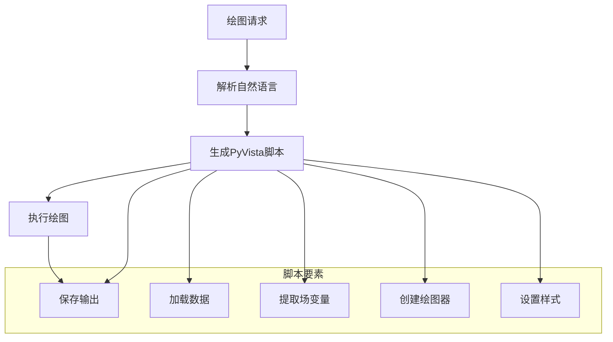
```mermaid
flowchart TD
Request[绘图请求] --> Parse[解析自然语言]
Parse --> Generate[生成PyVista脚本]
Generate --> Execute[执行绘图]
Execute --> Save[保存结果]
subgraph "脚本要素"
Load[加载数据]
Extract[提取场变量]
Create[创建绘图器]
Style[设置样式]
Save[保存输出]
end
Generate --> Load
Generate --> Extract
Generate --> Create
Generate --> Style
Generate --> Save
```

**图表来源**
- [openfoam_ai/agents/postprocessing_agent.py:241-343](file://openfoam_ai/agents/postprocessing_agent.py#L241-L343)

**章节来源**
- [openfoam_ai/agents/postprocessing_agent.py:1-588](file://openfoam_ai/agents/postprocessing_agent.py#L1-L588)

## CriticAgent审查Agent开发

### 审查结论分类

CriticAgent实现了严格的审查制度：

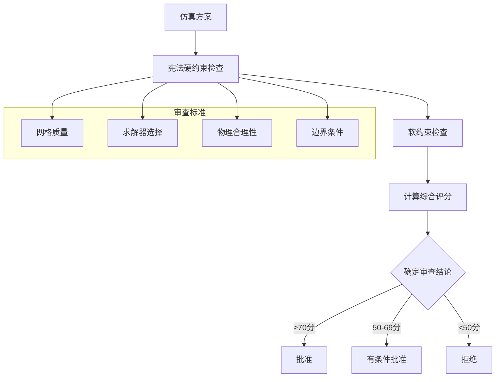
```mermaid
flowchart TD
Proposal[仿真方案] --> HardCheck[宪法硬约束检查]
HardCheck --> SoftCheck[软约束检查]
SoftCheck --> Score[计算综合评分]
Score --> Verdict{确定审查结论}
Verdict --> |≥70分| Approve[批准]
Verdict --> |50-69分| Conditional[有条件批准]
Verdict --> |<50分| Reject[拒绝]
subgraph "审查标准"
Mesh[网格质量]
Solver[求解器选择]
Physics[物理合理性]
Boundary[边界条件]
end
HardCheck --> Mesh
HardCheck --> Solver
HardCheck --> Physics
HardCheck --> Boundary
```

**图表来源**
- [openfoam_ai/agents/critic_agent.py:465-479](file://openfoam_ai/agents/critic_agent.py#L465-L479)

### 宪法规则检查

基于system_constitution.yaml的硬约束检查：

| 规则类型 | 检查内容 | 违反后果 |
|---------|---------|----------|
| 网格标准 | 最小网格数、长宽比限制 | 关键问题 |
| 求解器标准 | 库朗数限制、松弛因子范围 | 重要问题 |
| 物理约束 | 物理参数范围、组合合理性 | 重要问题 |
| 质量要求 | 能量守恒、收敛性 | 重要问题 |

### 问题严重性分级

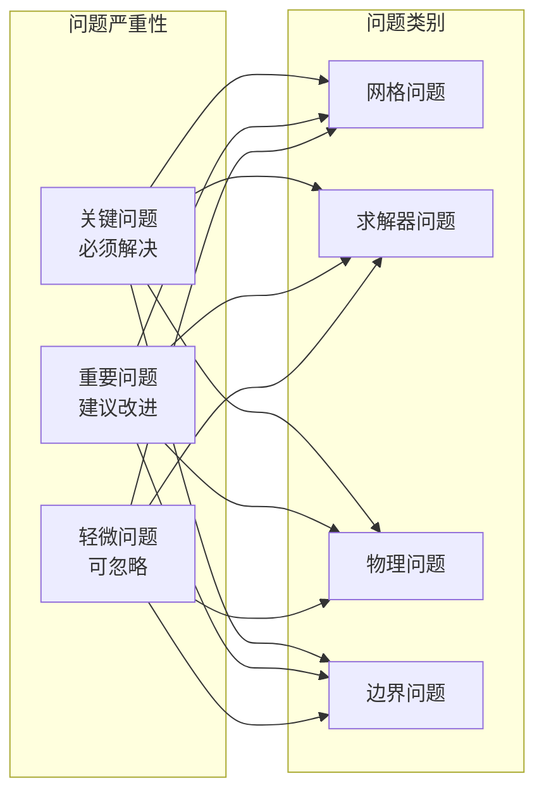
```mermaid
graph LR
subgraph "问题严重性"
Critical[关键问题<br/>必须解决]
Major[重要问题<br/>建议改进]
Minor[轻微问题<br/>可忽略]
end
subgraph "问题类别"
Mesh[网格问题]
Solver[求解器问题]
Physics[物理问题]
Boundary[边界问题]
end
Critical --> Mesh
Critical --> Solver
Critical --> Physics
Critical --> Boundary
Major --> Mesh
Major --> Solver
Major --> Physics
Major --> Boundary
Minor --> Mesh
Minor --> Solver
Minor --> Physics
Minor --> Boundary
```

**图表来源**
- [openfoam_ai/agents/critic_agent.py:15-45](file://openfoam_ai/agents/critic_agent.py#L15-L45)

**章节来源**
- [openfoam_ai/agents/critic_agent.py:1-629](file://openfoam_ai/agents/critic_agent.py#L1-L629)

## 新Agent开发模板

### 基础Agent模板

```python
from typing import Dict, Any, Optional
from dataclasses import dataclass
from enum import Enum

class AgentState(Enum):
    IDLE = "idle"
    PROCESSING = "processing"
    COMPLETED = "completed"
    ERROR = "error"

@dataclass
class AgentResult:
    success: bool
    message: str
    data: Dict[str, Any]
    logs: List[str]

class BaseAgent:
    """Agent基类模板"""
    
    def __init__(self, config: Optional[Dict[str, Any]] = None):
        self.config = config or {}
        self.state = AgentState.IDLE
        self.history: List[Dict[str, Any]] = []
    
    def process_input(self, input_data: Any) -> AgentResult:
        """处理输入数据"""
        try:
            self.state = AgentState.PROCESSING
            result = self._execute_task(input_data)
            self.state = AgentState.COMPLETED
            return AgentResult(
                success=True,
                message="处理成功",
                data=result,
                logs=self.history
            )
        except Exception as e:
            self.state = AgentState.ERROR
            return AgentResult(
                success=False,
                message=str(e),
                data={},
                logs=self.history
            )
    
    def _execute_task(self, input_data: Any) -> Dict[str, Any]:
        """执行具体任务 - 需要子类实现"""
        raise NotImplementedError
    
    def validate_config(self, config: Dict[str, Any]) -> Tuple[bool, List[str]]:
        """验证配置 - 可选实现"""
        return True, []
    
    def get_status(self) -> Dict[str, Any]:
        """获取Agent状态"""
        return {
            "state": self.state.value,
            "config": self.config,
            "history_length": len(self.history)
        }
```

### 配置验证模板

```python
from pydantic import BaseModel, validator, root_validator
from typing import Optional, List

class AgentConfig(BaseModel):
    """Agent配置验证模板"""
    
    # 基本配置
    agent_name: str
    version: str = "1.0.0"
    
    # 参数验证
    @validator('agent_name')
    def validate_agent_name(cls, v):
        if not v or len(v) < 3:
            raise ValueError("Agent名称必须至少3个字符")
        return v
    
    @root_validator
    def validate_configuration(cls, values):
        """根级配置验证"""
        # 实现复杂的配置关系验证
        return values

class AgentData(BaseModel):
    """Agent数据验证模板"""
    
    # 数据字段验证
    data_type: str
    data_value: Any
    
    @validator('data_value')
    def validate_data_value(cls, v, values):
        """验证数据值"""
        if values.get('data_type') == 'critical':
            if v is None:
                raise ValueError("关键数据不能为空")
        return v
```

### 日志和错误处理模板

```python
import logging
from typing import List

class AgentLogger:
    """Agent日志管理模板"""
    
    def __init__(self, agent_name: str):
        self.logger = logging.getLogger(f"Agent.{agent_name}")
        self.setup_logger()
    
    def setup_logger(self):
        """设置日志配置"""
        self.logger.setLevel(logging.DEBUG)
        
        # 文件处理器
        file_handler = logging.FileHandler(f"{agent_name}.log")
        file_handler.setLevel(logging.INFO)
        
        # 控制台处理器
        console_handler = logging.StreamHandler()
        console_handler.setLevel(logging.DEBUG)
        
        # 格式化器
        formatter = logging.Formatter(
            '%(asctime)s - %(name)s - %(levelname)s - %(message)s'
        )
        file_handler.setFormatter(formatter)
        console_handler.setFormatter(formatter)
        
        self.logger.addHandler(file_handler)
        self.logger.addHandler(console_handler)
    
    def log_info(self, message: str):
        """记录信息日志"""
        self.logger.info(message)
    
    def log_error(self, message: str):
        """记录错误日志"""
        self.logger.error(message)
    
    def log_debug(self, message: str):
        """记录调试日志"""
        self.logger.debug(message)
```

**章节来源**
- [openfoam_ai/agents/mesh_quality_agent.py:61-177](file://openfoam_ai/agents/mesh_quality_agent.py#L61-L177)
- [openfoam_ai/agents/self_healing_agent.py:58-113](file://openfoam_ai/agents/self_healing_agent.py#L58-L113)
- [openfoam_ai/agents/physics_validation_agent.py:27-173](file://openfoam_ai/agents/physics_validation_agent.py#L27-L173)

## 最佳实践

### Agent设计原则

1. **单一职责原则**：每个Agent专注于特定的功能领域
2. **接口标准化**：统一的输入输出接口便于集成
3. **错误处理**：完善的异常处理和错误恢复机制
4. **配置验证**：基于Pydantic的强类型配置验证
5. **日志记录**：完整的操作日志便于调试和审计

### 性能优化建议

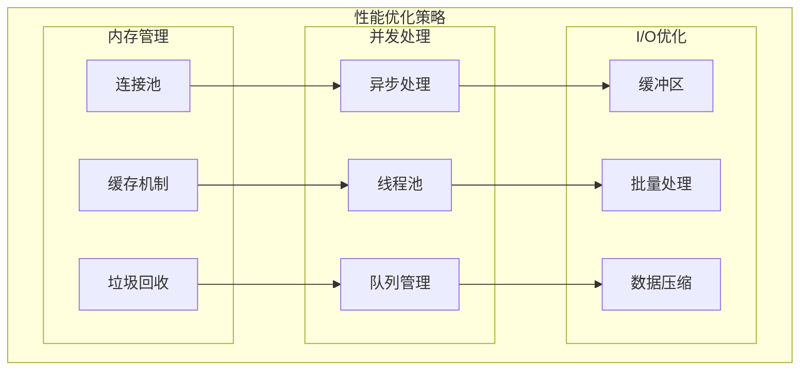
```mermaid
flowchart TD
subgraph "性能优化策略"
subgraph "内存管理"
Pool[连接池]
Cache[缓存机制]
GC[垃圾回收]
end
subgraph "并发处理"
Async[异步处理]
Thread[线程池]
Queue[队列管理]
end
subgraph "I/O优化"
Buffer[缓冲区]
Batch[批量处理]
Compression[数据压缩]
end
end
Pool --> Async
Cache --> Thread
GC --> Queue
Async --> Buffer
Thread --> Batch
Queue --> Compression
```

### 安全考虑

1. **输入验证**：所有外部输入都必须经过严格验证
2. **权限控制**：限制Agent对系统资源的访问权限
3. **数据隔离**：不同算例的数据必须完全隔离
4. **审计日志**：记录所有关键操作便于追溯
5. **异常防护**：防止恶意输入导致系统崩溃

## 插件系统扩展点

### 扩展点识别

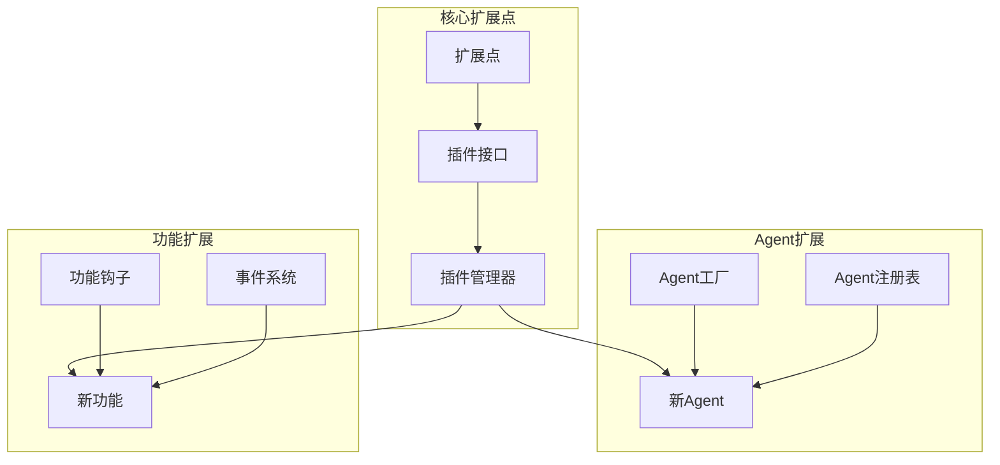
```mermaid
graph TB
subgraph "核心扩展点"
ExtensionPoint[扩展点]
PluginInterface[插件接口]
PluginManager[插件管理器]
end
subgraph "Agent扩展"
NewAgent[新Agent]
AgentFactory[Agent工厂]
AgentRegistry[Agent注册表]
end
subgraph "功能扩展"
NewFeature[新功能]
FeatureHook[功能钩子]
EventSystem[事件系统]
end
ExtensionPoint --> PluginInterface
PluginInterface --> PluginManager
PluginManager --> NewAgent
PluginManager --> NewFeature
AgentFactory --> NewAgent
AgentRegistry --> NewAgent
FeatureHook --> NewFeature
EventSystem --> NewFeature
```

**图表来源**
- [openfoam_ai/agents/__init__.py:134-183](file://openfoam_ai/agents/__init__.py#L134-L183)

### 插件开发流程

1. **定义接口**：确定插件需要实现的标准接口
2. **实现功能**：编写具体的插件实现代码
3. **注册插件**：在Agent注册表中注册新插件
4. **测试验证**：进行全面的功能和性能测试
5. **部署集成**：将插件集成到主系统中

### 插件配置管理

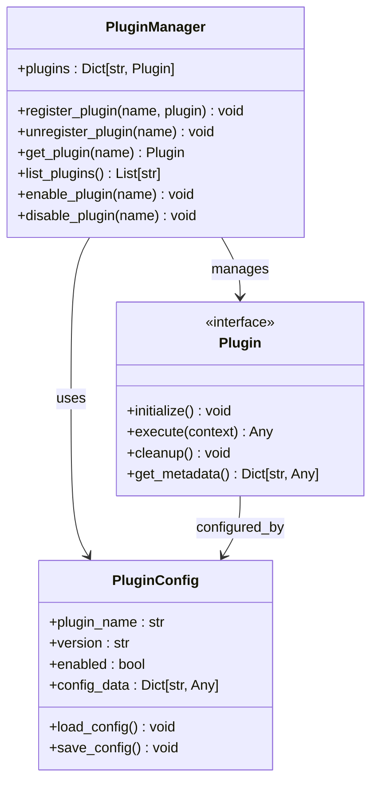
```mermaid
classDiagram
class PluginConfig {
+plugin_name : str
+version : str
+enabled : bool
+config_data : Dict[str, Any]
+load_config() void
+save_config() void
}
class PluginManager {
+plugins : Dict[str, Plugin]
+register_plugin(name, plugin) void
+unregister_plugin(name) void
+get_plugin(name) Plugin
+list_plugins() List[str]
+enable_plugin(name) void
+disable_plugin(name) void
}
class Plugin {
<<interface>>
+initialize() void
+execute(context) Any
+cleanup() void
+get_metadata() Dict[str, Any]
}
PluginManager --> Plugin : manages
PluginManager --> PluginConfig : uses
Plugin --> PluginConfig : configured_by
```

**图表来源**
- [openfoam_ai/agents/__init__.py:134-183](file://openfoam_ai/agents/__init__.py#L134-L183)

**章节来源**
- [openfoam_ai/agents/__init__.py:1-184](file://openfoam_ai/agents/__init__.py#L1-L184)

## 第三方库集成

### 支持的第三方库

| 库名称 | 版本要求 | 功能用途 | 集成方式 |
|-------|---------|---------|---------|
| OpenAI | >=0.27.0 | GPT模型调用 | 可选依赖 |
| PyVista | >=0.43.0 | 可视化渲染 | 可选依赖 |
| Pydantic | >=1.10.0 | 数据验证 | 核心依赖 |
| NumPy | >=1.21.0 | 数值计算 | 核心依赖 |
| YAML | >=5.4.0 | 配置文件解析 | 核心依赖 |

### 集成策略

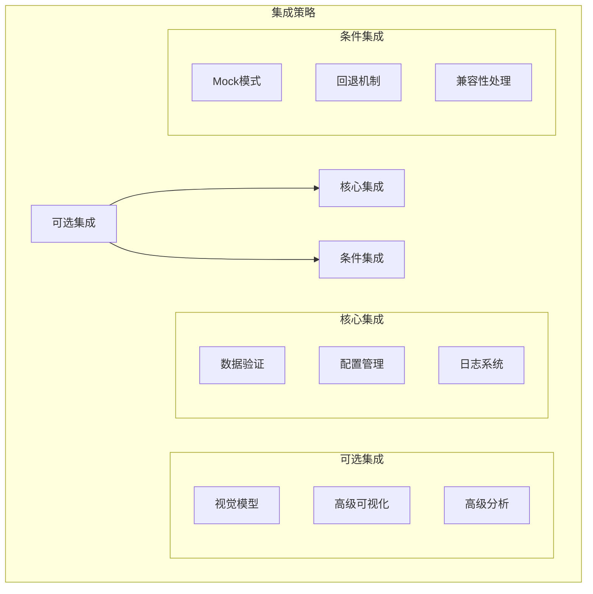
```mermaid
flowchart TD
subgraph "集成策略"
Optional[可选集成] --> Required[核心集成]
Optional --> Conditional[条件集成]
subgraph "可选集成"
Vision[视觉模型]
Visualization[高级可视化]
AdvancedAnalytics[高级分析]
end
subgraph "核心集成"
Validation[数据验证]
Configuration[配置管理]
Logging[日志系统]
end
subgraph "条件集成"
Mock[Mock模式]
Fallback[回退机制]
Compatibility[兼容性处理]
end
end
```

### 兼容性处理

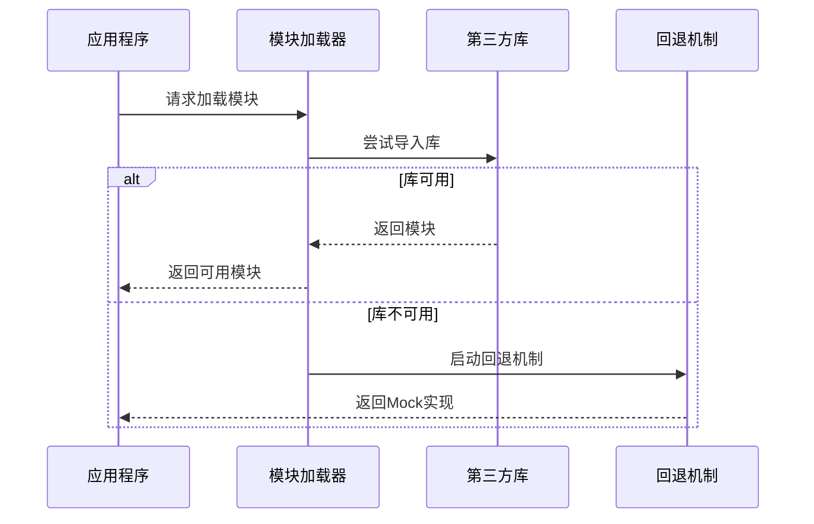
```mermaid
sequenceDiagram
participant App as 应用程序
participant Loader as 模块加载器
participant Library as 第三方库
participant Fallback as 回退机制
App->>Loader : 请求加载模块
Loader->>Library : 尝试导入库
alt 库可用
Library-->>Loader : 返回模块
Loader-->>App : 返回可用模块
else 库不可用
Loader->>Fallback : 启动回退机制
Fallback-->>App : 返回Mock实现
end
```

**图表来源**
- [openfoam_ai/agents/geometry_image_agent.py:21-43](file://openfoam_ai/agents/geometry_image_agent.py#L21-L43)
- [openfoam_ai/agents/postprocessing_agent.py:23-33](file://openfoam_ai/agents/postprocessing_agent.py#L23-L33)

## 故障排查指南

### 常见问题诊断

```mermaid
flowchart TD
Problem[出现故障] --> Identify{问题类型识别}
Identify --> |配置错误| ConfigError[配置错误]
Identify --> |网络问题| NetworkError[网络问题]
Identify --> |权限问题| PermissionError[权限问题]
Identify --> |资源不足| ResourceError[资源不足]
Identify --> |版本冲突| VersionError[版本冲突]
ConfigError --> CheckConfig[检查配置文件]
NetworkError --> CheckNetwork[检查网络连接]
PermissionError --> CheckPermission[检查权限设置]
ResourceError --> CheckResource[检查系统资源]
VersionError --> CheckVersion[检查版本兼容性]
CheckConfig --> FixConfig[修复配置]
CheckNetwork --> FixNetwork[修复网络]
CheckPermission --> FixPermission[修复权限]
CheckResource --> FixResource[修复资源]
CheckVersion --> FixVersion[修复版本]
FixConfig --> Test[重新测试]
FixNetwork --> Test
FixPermission --> Test
FixResource --> Test
FixVersion --> Test
Test --> Success{问题解决?}
Success --> |是| Done[完成]
Success --> |否| Escalate[升级处理]
Escalate --> Support[联系技术支持]
```

### 调试技巧

1. **日志分析**：仔细分析Agent的日志输出
2. **状态检查**：定期检查Agent的状态和配置
3. **性能监控**：监控Agent的内存和CPU使用情况
4. **错误追踪**：使用异常追踪工具定位问题根源
5. **单元测试**：为关键功能编写单元测试

### 性能优化

```mermaid
graph LR
subgraph "性能瓶颈识别"
Memory[内存泄漏]
CPU[CPU占用过高]
IO[I/O等待]
Network[网络延迟]
end
subgraph "优化策略"
subgraph "内存优化"
Garbage[垃圾回收优化]
Pool[对象池]
Lazy[延迟加载]
end
subgraph "并发优化"
Async[异步处理]
Parallel[并行计算]
Cache[缓存策略]
end
subgraph "I/O优化"
Buffer[缓冲区优化]
Batch[批量处理]
Compression[数据压缩]
end
end
Memory --> Garbage
Memory --> Pool
Memory --> Lazy
CPU --> Async
CPU --> Parallel
CPU --> Cache
IO --> Buffer
IO --> Batch
IO --> Compression
```

## 总结

OpenFOAM AI项目的扩展开发指南为开发者提供了完整的Agent开发框架和最佳实践。通过理解现有的Agent架构和实现模式，开发者可以：

1. **快速上手**：利用现有的模板和示例代码
2. **遵循规范**：按照统一的接口和设计原则开发
3. **保证质量**：通过严格的验证和测试确保代码质量
4. **易于维护**：采用模块化设计便于后续维护和扩展

项目的核心优势在于其基于AI约束宪法的硬约束验证系统，确保所有生成的CFD配置都符合工程实践标准。同时，多Agent协作机制为复杂的仿真任务提供了灵活的解决方案。

通过本指南，开发者可以创建高质量的Agent来扩展OpenFOAM AI系统的功能，为CFD仿真自动化提供更强有力的支持。