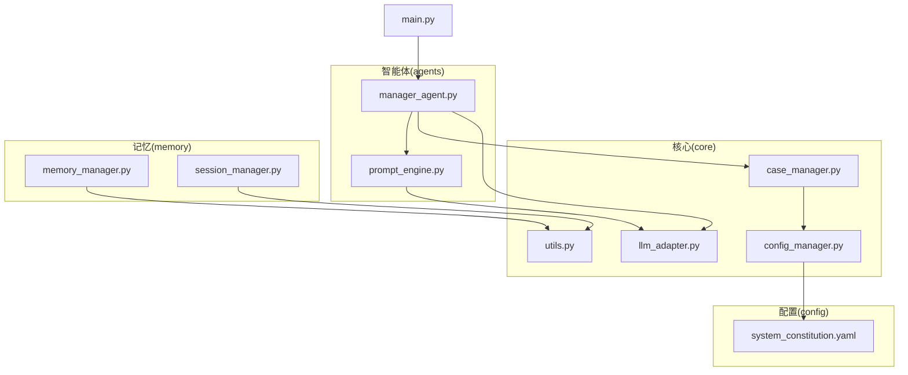
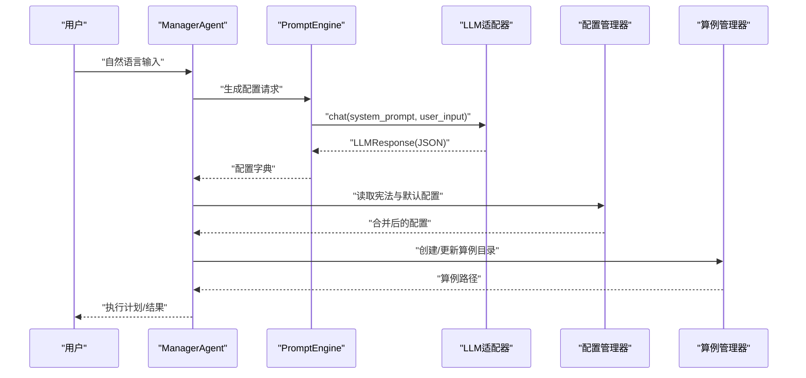
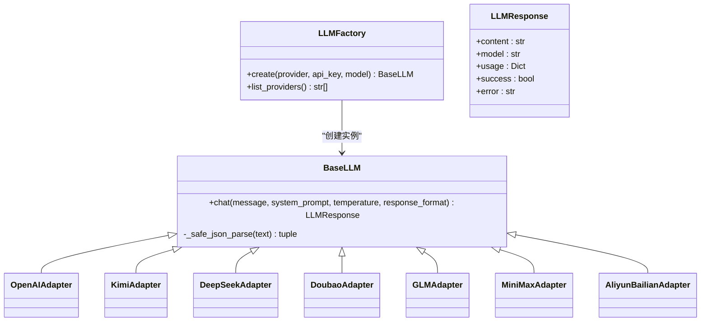
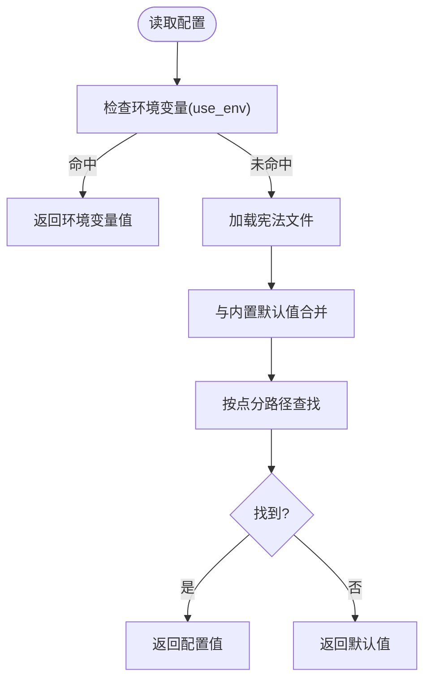
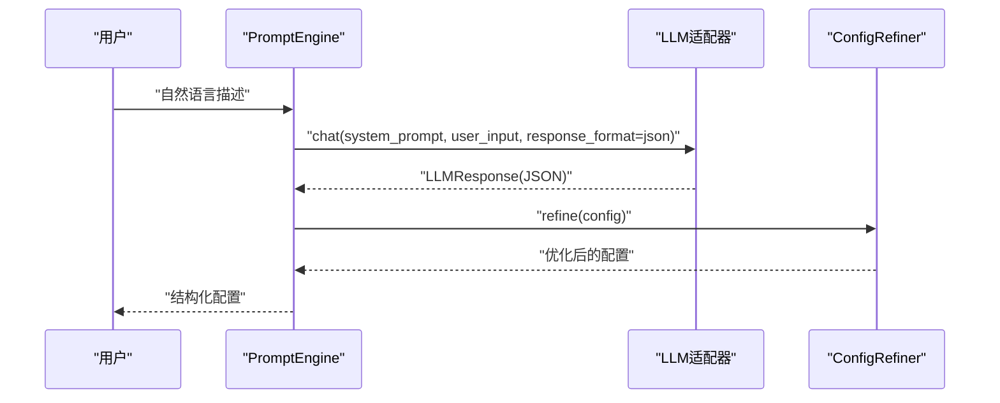
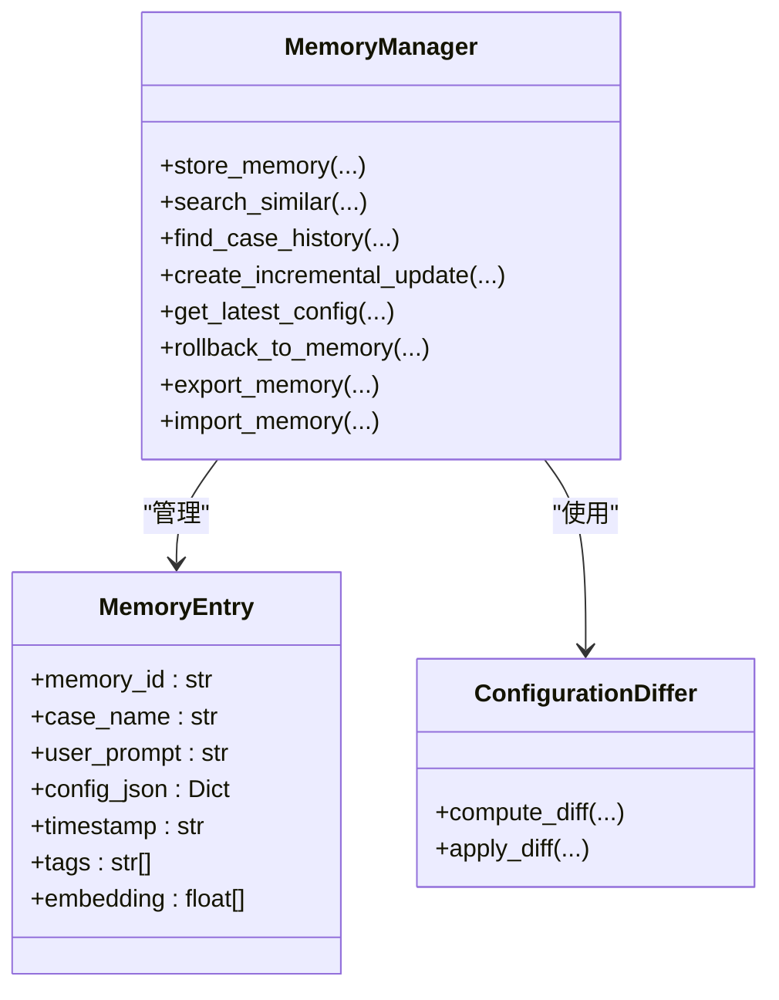
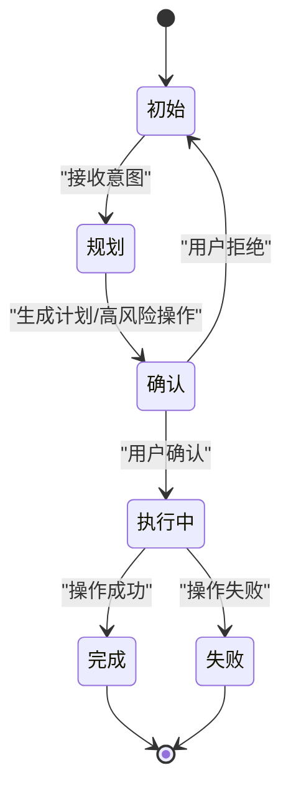
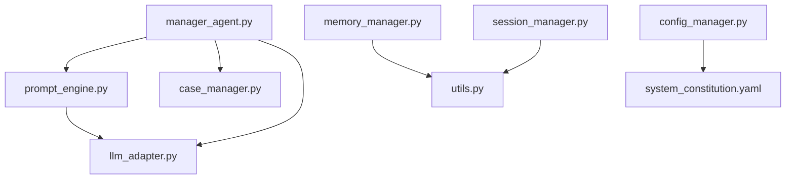

# 插件系统开发

<cite>
**本文档引用的文件**
- [llm_adapter.py](file://openfoam_ai/core/llm_adapter.py)
- [config_manager.py](file://openfoam_ai/core/config_manager.py)
- [memory_manager.py](file://openfoam_ai/memory/memory_manager.py)
- [prompt_engine.py](file://openfoam_ai/agents/prompt_engine.py)
- [case_manager.py](file://openfoam_ai/core/case_manager.py)
- [utils.py](file://openfoam_ai/core/utils.py)
- [session_manager.py](file://openfoam_ai/memory/session_manager.py)
- [system_constitution.yaml](file://openfoam_ai/config/system_constitution.yaml)
- [main.py](file://openfoam_ai/main.py)
- [manager_agent.py](file://openfoam_ai/agents/manager_agent.py)
- [test_basic.py](file://openfoam_ai/tests/test_basic.py)
</cite>

## 目录
1. [简介](#简介)
2. [项目结构](#项目结构)
3. [核心组件](#核心组件)
4. [架构总览](#架构总览)
5. [详细组件分析](#详细组件分析)
6. [依赖分析](#依赖分析)
7. [性能考虑](#性能考虑)
8. [故障排查指南](#故障排查指南)
9. [结论](#结论)
10. [附录](#附录)

## 简介
本指南面向希望为OpenFOAM AI项目开发插件的开发者，系统阐述插件架构设计、扩展机制与标准接口规范。重点覆盖以下插件类型：
- LLM适配器插件：标准化不同大语言模型的接入、接口与配置管理
- 配置管理插件：集中化配置解析、参数校验与动态加载
- 提示词引擎插件：模板管理、变量替换与上下文处理
- 记忆管理插件：向量数据库集成、存储策略与检索算法
- 会话管理插件：多轮对话上下文、操作确认与持久化

同时给出插件注册、生命周期管理、错误处理与插件间通信协议的实现细节，帮助开发者快速构建稳定、可维护的插件生态。

## 项目结构
OpenFOAM AI采用模块化组织，核心插件相关模块分布如下：
- core：核心基础设施（配置、算例、工具）
- agents：智能体与提示词引擎
- memory：记忆与会话管理
- config：系统宪法（约束规则）
- tests：基础测试用例

**图表来源**
- [main.py:1-200](file://openfoam_ai/main.py#L1-L200)
- [manager_agent.py:1-200](file://openfoam_ai/agents/manager_agent.py#L1-L200)
- [prompt_engine.py:1-616](file://openfoam_ai/agents/prompt_engine.py#L1-L616)
- [case_manager.py:1-639](file://openfoam_ai/core/case_manager.py#L1-L639)
- [llm_adapter.py:1-688](file://openfoam_ai/core/llm_adapter.py#L1-L688)
- [config_manager.py:1-227](file://openfoam_ai/core/config_manager.py#L1-L227)
- [memory_manager.py:1-804](file://openfoam_ai/memory/memory_manager.py#L1-L804)
- [session_manager.py:1-565](file://openfoam_ai/memory/session_manager.py#L1-L565)
- [system_constitution.yaml:1-103](file://openfoam_ai/config/system_constitution.yaml#L1-L103)

**章节来源**
- [main.py:1-200](file://openfoam_ai/main.py#L1-L200)
- [manager_agent.py:1-200](file://openfoam_ai/agents/manager_agent.py#L1-L200)

## 核心组件
- LLM适配器：统一抽象与工厂模式，支持多家大模型，提供一致的chat接口与响应结构
- 配置管理器：单例模式，集中加载宪法、环境变量与默认配置，支持热重载与类型转换
- 提示词引擎：系统提示词模板、JSON输出约束、多轮上下文与Mock模式
- 记忆管理器：基于ChromaDB或模拟模式的向量检索、增量更新与历史版本管理
- 会话管理器：消息与上下文持久化、高风险操作确认、统计导出
- 算例管理器：标准OpenFOAM目录结构创建、模板复制与清理
- 工具库：JSON读写、目录确保、格式化与执行时间装饰器

**章节来源**
- [llm_adapter.py:1-688](file://openfoam_ai/core/llm_adapter.py#L1-L688)
- [config_manager.py:1-227](file://openfoam_ai/core/config_manager.py#L1-L227)
- [prompt_engine.py:1-616](file://openfoam_ai/agents/prompt_engine.py#L1-L616)
- [memory_manager.py:1-804](file://openfoam_ai/memory/memory_manager.py#L1-L804)
- [session_manager.py:1-565](file://openfoam_ai/memory/session_manager.py#L1-L565)
- [case_manager.py:1-639](file://openfoam_ai/core/case_manager.py#L1-L639)
- [utils.py:1-111](file://openfoam_ai/core/utils.py#L1-L111)

## 架构总览
OpenFOAM AI通过ManagerAgent协调各插件模块，形成“输入理解—配置生成—验证—执行—反馈”的闭环。LLM适配器与提示词引擎负责自然语言到结构化配置的转换；配置管理器提供统一的约束与默认值；记忆与会话模块增强用户体验与可追溯性；算例管理器负责文件系统层面的算例生命周期管理。

**图表来源**
- [manager_agent.py:75-200](file://openfoam_ai/agents/manager_agent.py#L75-L200)
- [prompt_engine.py:92-126](file://openfoam_ai/agents/prompt_engine.py#L92-L126)
- [llm_adapter.py:47-116](file://openfoam_ai/core/llm_adapter.py#L47-L116)
- [config_manager.py:136-181](file://openfoam_ai/core/config_manager.py#L136-L181)
- [case_manager.py:51-86](file://openfoam_ai/core/case_manager.py#L51-L86)

## 详细组件分析

### LLM适配器插件开发指南
- 设计要点
  - 抽象基类BaseLLM定义统一接口chat，屏蔽SDK/HTTP差异
  - 每家模型实现独立适配器，集中于工厂类LLMFactory
  - 统一响应结构LLMResponse，包含content/model/usage/success/error
  - 支持SDK模式与requests回退模式，增强容错能力
- 接口标准化
  - chat(message, system_prompt, temperature, response_format) -> LLMResponse
  - 支持JSON响应格式约束（response_format="json"）
- 配置管理
  - 优先从环境变量读取API Key，否则要求显式传入
  - 工厂类提供默认模型映射，避免硬编码
- 扩展新模型
  - 新增适配器类继承BaseLLM，实现chat与必要参数映射
  - 在LLMFactory.ADAPTERS中注册映射关系
  - 如需默认模型，补充默认映射表

**图表来源**
- [llm_adapter.py:39-688](file://openfoam_ai/core/llm_adapter.py#L39-L688)

**章节来源**
- [llm_adapter.py:1-688](file://openfoam_ai/core/llm_adapter.py#L1-L688)

### 配置管理插件开发指南
- 设计要点
  - ConfigManager单例，线程安全锁保护
  - 加载顺序：环境变量 -> 宪法文件(system_constitution.yaml) -> 内置默认值
  - 支持强制重载与路径自定义
- 接口规范
  - get(key, default, use_env)：支持点分路径与类型转换
  - 分类访问：get_mesh_standard/get_solver_standard/get_performance_setting/get_environment
  - reload/dump_config用于调试与热重载
- 扩展新配置域
  - 在_configeration.yaml中添加键空间
  - 在_get_constitution_path中确保路径正确
  - 在ConfigManager中提供分类访问方法

**图表来源**
- [config_manager.py:136-181](file://openfoam_ai/core/config_manager.py#L136-L181)

**章节来源**
- [config_manager.py:1-227](file://openfoam_ai/core/config_manager.py#L1-L227)
- [system_constitution.yaml:1-103](file://openfoam_ai/config/system_constitution.yaml#L1-L103)

### 提示词引擎插件开发指南
- 设计要点
  - PromptEngine封装系统提示词模板与JSON输出约束
  - 支持Mock模式，基于关键词匹配生成符合宪法的配置
  - ConfigRefiner本地优化配置（网格、时间步长、任务ID等）
- 接口规范
  - natural_language_to_config(user_input) -> Dict
  - explain_config(config) -> str
  - suggest_improvements(config, log_summary) -> List[str]
- 扩展模板与规则
  - 在SYSTEM_PROMPT_TEMPLATE中增加物理类型/求解器约束
  - 在ConfigRefiner.validate_critical_params中加入新约束
  - 在Mock模式场景中扩展关键词与默认配置

**图表来源**
- [prompt_engine.py:92-126](file://openfoam_ai/agents/prompt_engine.py#L92-L126)
- [prompt_engine.py:485-532](file://openfoam_ai/agents/prompt_engine.py#L485-L532)

**章节来源**
- [prompt_engine.py:1-616](file://openfoam_ai/agents/prompt_engine.py#L1-L616)

### 记忆管理插件开发指南
- 设计要点
  - MemoryManager支持ChromaDB与模拟模式双路径
  - MemoryEntry统一记忆条目结构，含embedding与tags
  - ConfigurationDiffer实现增量更新(diff)，支持apply_diff
  - 支持相似性检索、历史查询、回滚与导出
- 接口规范
  - store_memory(case_name, user_prompt, config, tags) -> memory_id
  - search_similar(query, n_results, filter_tags) -> List[MemoryEntry]
  - create_incremental_update(case_name, modification_prompt, new_config) -> (DiffResult, memory_id)
  - find_case_history(case_name) -> List[MemoryEntry]
  - get_latest_config(case_name) -> Dict
  - rollback_to_memory(memory_id) -> Dict
  - export_memory()/import_memory()
- 扩展向量化
  - _generate_embedding可替换为sentence-transformers等高质量模型
  - 支持metadata过滤与标签索引

**图表来源**
- [memory_manager.py:32-196](file://openfoam_ai/memory/memory_manager.py#L32-L196)
- [memory_manager.py:198-687](file://openfoam_ai/memory/memory_manager.py#L198-L687)

**章节来源**
- [memory_manager.py:1-804](file://openfoam_ai/memory/memory_manager.py#L1-L804)

### 会话管理插件开发指南
- 设计要点
  - SessionManager管理多轮对话上下文、当前算例与待确认操作
  - SessionStore负责会话数据持久化（JSON文件）
  - 高风险操作分级与确认流程，支持自动保存与导出
- 接口规范
  - add_message(role, content, metadata)
  - set_current_case(case_name, config)
  - create_pending_operation(type, description, details) -> PendingOperation
  - confirm_operation/reject_operation/complete_operation
  - export_session()/get_statistics()
- 扩展
  - 新增操作类型与风险等级映射
  - 自定义确认提示模板
  - 增加更多上下文字段（如用户偏好、项目信息）

**图表来源**
- [session_manager.py:28-400](file://openfoam_ai/memory/session_manager.py#L28-L400)

**章节来源**
- [session_manager.py:1-565](file://openfoam_ai/memory/session_manager.py#L1-L565)

### 算例管理插件开发指南
- 设计要点
  - CaseManager负责标准OpenFOAM目录结构创建与模板复制
  - 提供清理、删除、状态更新与信息持久化
- 接口规范
  - create_case(case_name, physics_type)
  - copy_template(template_path, case_name)
  - list_cases()/get_case_info()/update_case_status()
  - cleanup(keep_results)/delete_case()
- 扩展
  - 新增物理类型模板与默认文件
  - 增加算例迁移与版本控制

**章节来源**
- [case_manager.py:1-639](file://openfoam_ai/core/case_manager.py#L1-L639)

### 工具库插件开发指南
- 设计要点
  - 提供JSON读写、目录确保、大小格式化与执行时间装饰器
- 接口规范
  - save_json/load_json/ensure_directory/format_size/log_execution_time
- 扩展
  - 新增序列化格式支持
  - 增加日志级别与输出格式定制

**章节来源**
- [utils.py:1-111](file://openfoam_ai/core/utils.py#L1-L111)

## 依赖分析
- 模块耦合
  - ManagerAgent依赖PromptEngine、CaseManager、LLM适配器
  - PromptEngine依赖LLM适配器与Mock模式
  - MemoryManager依赖ChromaDB或模拟模式
  - SessionManager依赖持久化存储
  - ConfigManager依赖宪法文件与环境变量
- 外部依赖
  - openai（可选）、requests（HTTP回退）、yaml、pathlib、threading
- 循环依赖
  - 未发现循环依赖，模块间通过清晰接口交互

**图表来源**
- [manager_agent.py:1-200](file://openfoam_ai/agents/manager_agent.py#L1-L200)
- [prompt_engine.py:1-616](file://openfoam_ai/agents/prompt_engine.py#L1-L616)
- [case_manager.py:1-639](file://openfoam_ai/core/case_manager.py#L1-L639)
- [llm_adapter.py:1-688](file://openfoam_ai/core/llm_adapter.py#L1-L688)
- [memory_manager.py:1-804](file://openfoam_ai/memory/memory_manager.py#L1-L804)
- [session_manager.py:1-565](file://openfoam_ai/memory/session_manager.py#L1-L565)
- [config_manager.py:1-227](file://openfoam_ai/core/config_manager.py#L1-L227)
- [system_constitution.yaml:1-103](file://openfoam_ai/config/system_constitution.yaml#L1-L103)

**章节来源**
- [test_basic.py:1-270](file://openfoam_ai/tests/test_basic.py#L1-L270)

## 性能考虑
- LLM调用
  - 使用response_format="json"减少后处理开销
  - 控制temperature与消息长度，降低token消耗
- 记忆检索
  - ChromaDB使用余弦距离，建议批量查询与索引优化
  - 模拟模式下使用余弦相似度，注意向量维度与归一化
- 配置加载
  - ConfigManager缓存宪法与环境变量，避免重复IO
  - 支持force_reload用于开发调试
- 并发与线程安全
  - ConfigManager使用RLock保护共享状态
- I/O优化
  - 使用utils.ensure_directory与格式化工具减少异常开销

[本节为通用指导，无需具体文件分析]

## 故障排查指南
- LLM适配器
  - SDK不可用时自动回退到requests模式，检查网络与API Key
  - JSON解析失败时返回LLMResponse.success=False与error
- 配置管理器
  - 宪法文件加载失败时使用默认值，检查路径与权限
  - get()不命中返回默认值，确认键名与大小写
- 记忆管理器
  - ChromaDB初始化失败自动切换模拟模式，检查依赖安装
  - 搜索结果为空时检查embedding生成与标签过滤
- 会话管理器
  - 保存/加载失败时检查存储路径权限
  - 高风险操作未确认时需用户二次确认
- 算例管理器
  - 目录创建失败检查权限与磁盘空间
  - 模板复制失败检查源路径存在性

**章节来源**
- [llm_adapter.py:53-116](file://openfoam_ai/core/llm_adapter.py#L53-L116)
- [config_manager.py:104-119](file://openfoam_ai/core/config_manager.py#L104-L119)
- [memory_manager.py:233-241](file://openfoam_ai/memory/memory_manager.py#L233-L241)
- [session_manager.py:119-150](file://openfoam_ai/memory/session_manager.py#L119-L150)
- [case_manager.py:62-86](file://openfoam_ai/core/case_manager.py#L62-L86)

## 结论
OpenFOAM AI的插件系统以清晰的抽象与模块化设计为基础，通过统一接口与工厂模式实现LLM适配、配置管理、提示词工程、记忆与会话管理的可插拔扩展。开发者可依据本文档的接口规范与最佳实践，快速开发高质量插件，并通过测试用例与日志工具保障稳定性与可维护性。

[本节为总结，无需具体文件分析]

## 附录

### 插件开发标准模板与接口规范
- 插件注册
  - LLMFactory.ADAPTERS注册新适配器映射
  - ConfigManager提供统一配置入口
- 生命周期管理
  - 单例模式：ConfigManager
  - 自动保存：SessionManager
  - 缓存与热重载：ConfigManager.reload
- 错误处理机制
  - 统一返回结构（如LLMResponse）
  - 降级策略（Mock模式、模拟模式）
  - 详细日志与异常捕获

**章节来源**
- [llm_adapter.py:577-634](file://openfoam_ai/core/llm_adapter.py#L577-L634)
- [config_manager.py:31-49](file://openfoam_ai/core/config_manager.py#L31-L49)
- [session_manager.py:445-451](file://openfoam_ai/memory/session_manager.py#L445-L451)

### 插件间通信协议与数据交换格式
- 统一数据结构
  - LLMResponse：content/model/usage/success/error
  - MemoryEntry：memory_id/case_name/user_prompt/config_json/timestamp/tags/embedding
  - ConversationMessage：role/content/timestamp/metadata
- 配置约定
  - PromptEngine输出严格JSON，遵循SYSTEM_PROMPT_TEMPLATE约束
  - ConfigRefiner对关键参数进行本地优化与校验
- 文件与目录
  - CaseManager创建标准OpenFOAM目录结构
  - SessionManager/SessionStore使用JSON文件持久化

**章节来源**
- [prompt_engine.py:30-73](file://openfoam_ai/agents/prompt_engine.py#L30-L73)
- [memory_manager.py:32-51](file://openfoam_ai/memory/memory_manager.py#L32-L51)
- [session_manager.py:38-51](file://openfoam_ai/memory/session_manager.py#L38-L51)
- [case_manager.py:48-86](file://openfoam_ai/core/case_manager.py#L48-L86)