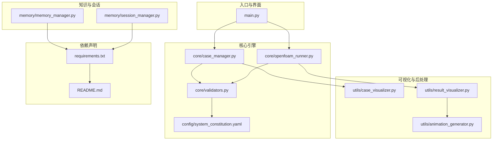
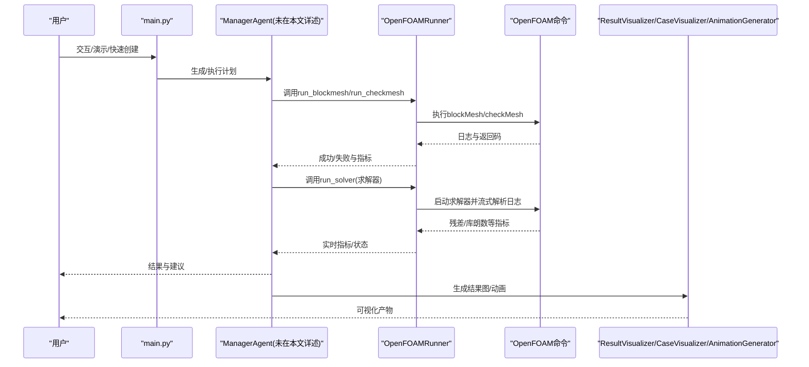
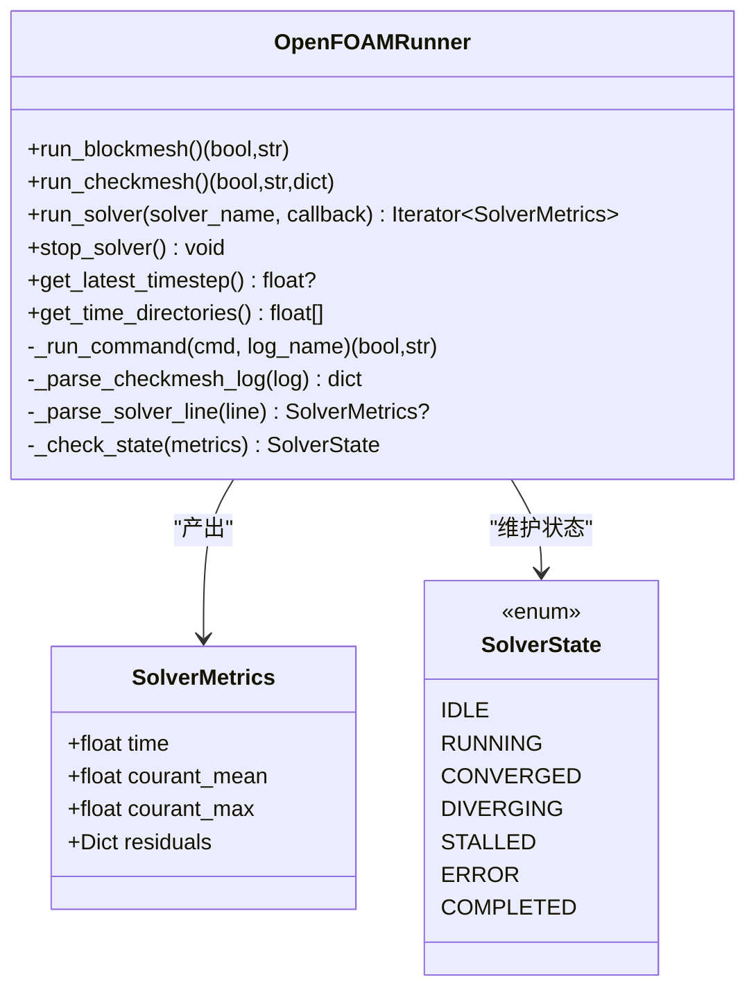
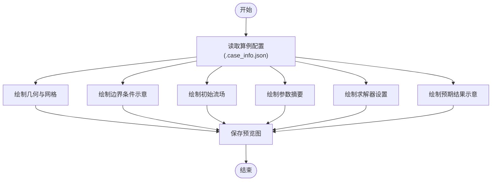
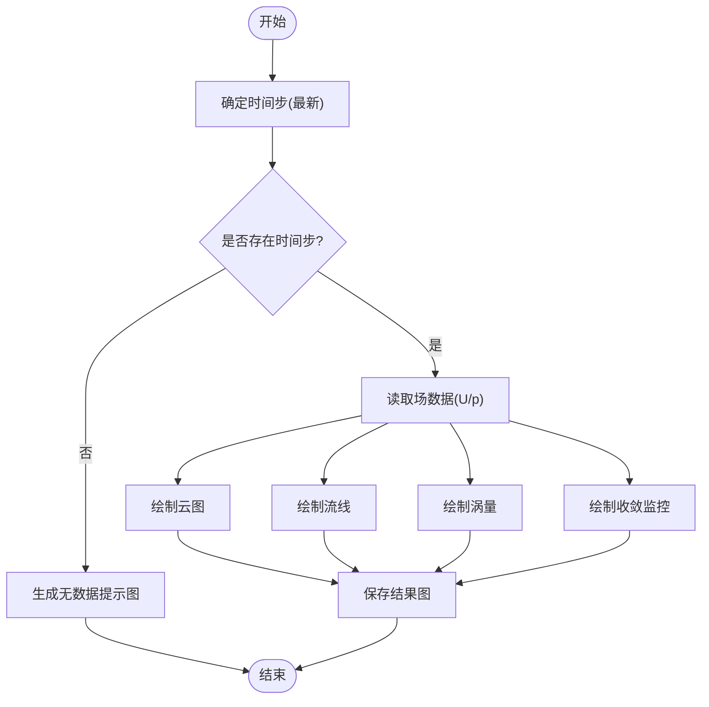
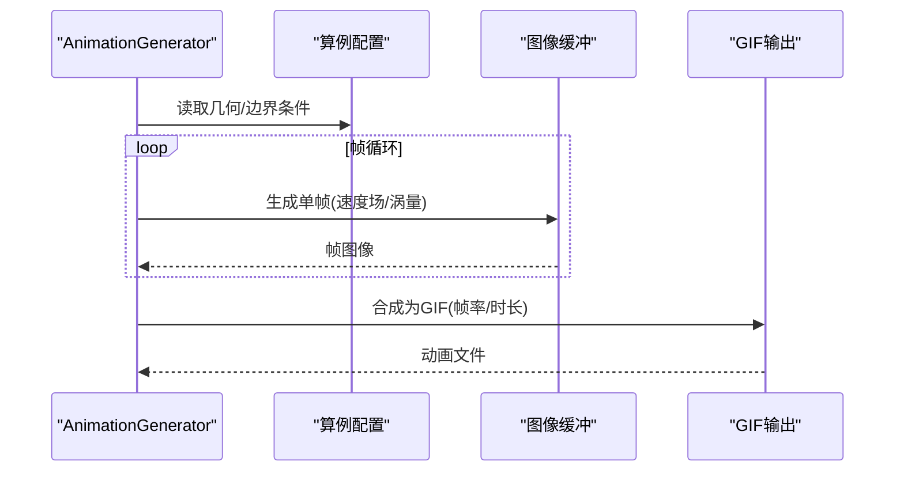
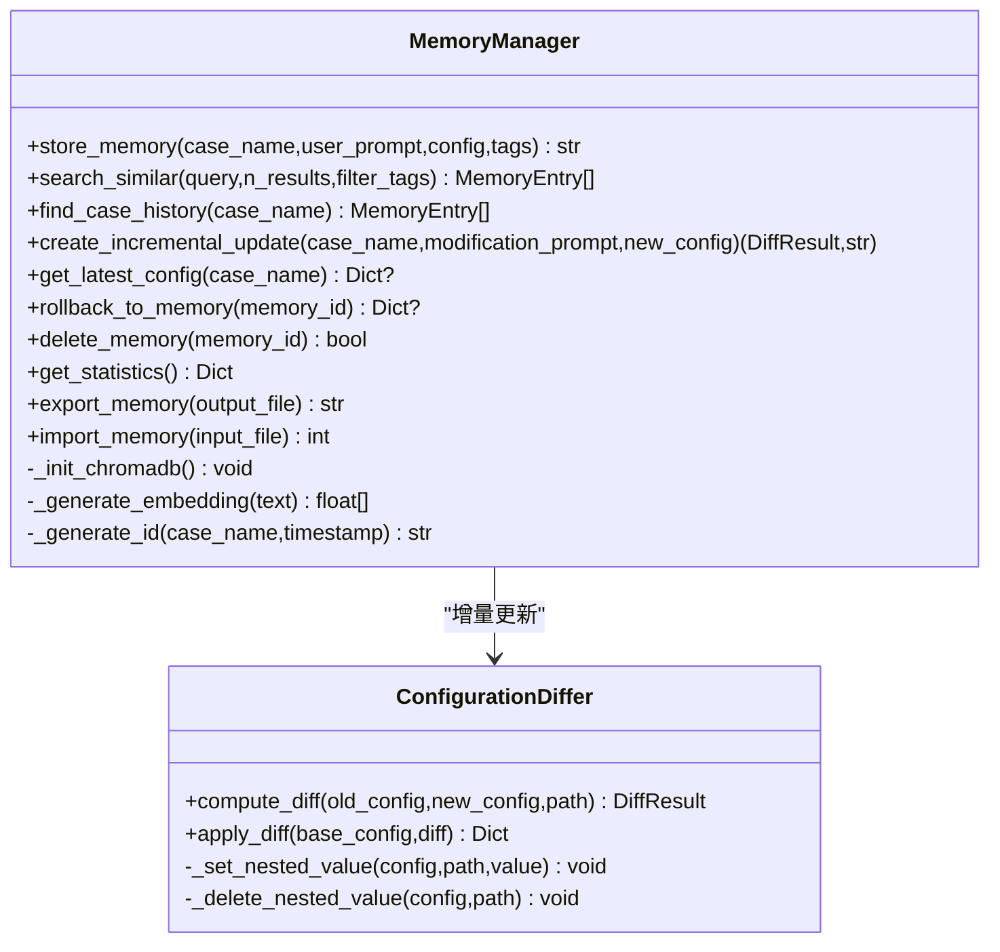
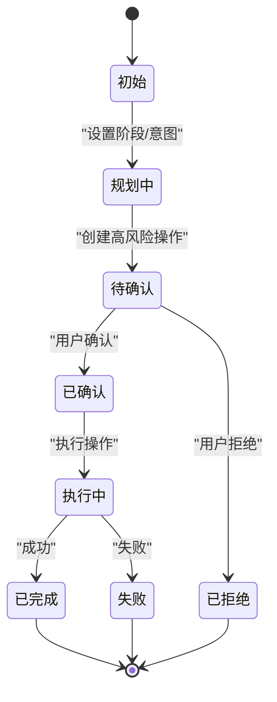
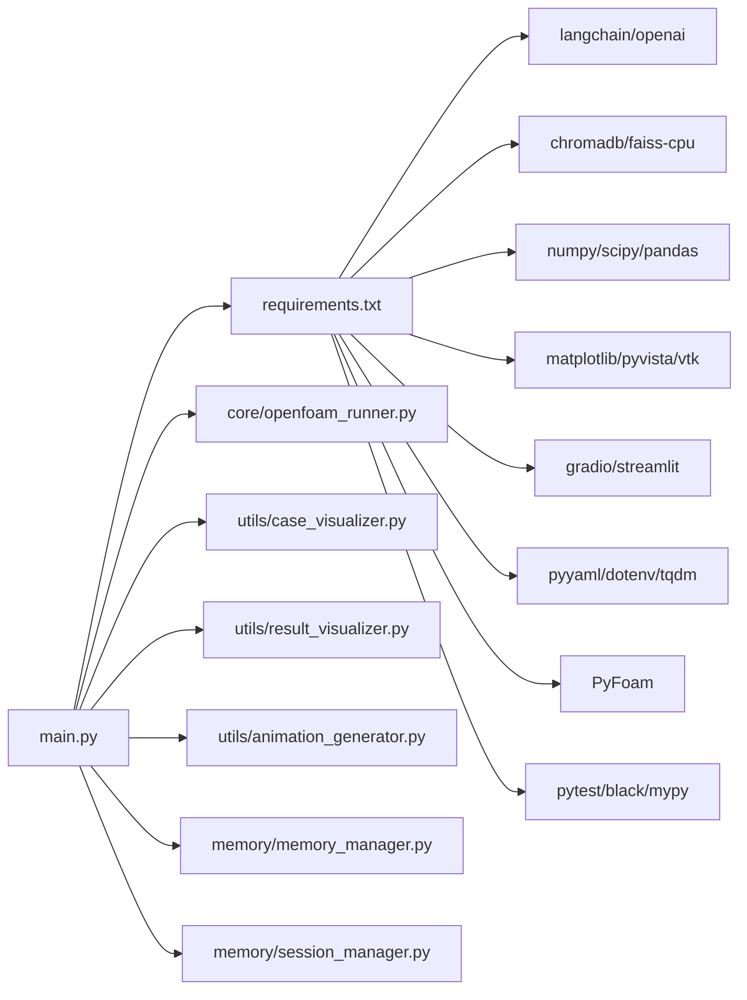

# 第三方库集成

<cite>
**本文引用的文件**
- [requirements.txt](file://openfoam_ai/requirements.txt)
- [README.md](file://openfoam_ai/README.md)
- [main.py](file://openfoam_ai/main.py)
- [openfoam_runner.py](file://openfoam_ai/core/openfoam_runner.py)
- [case_visualizer.py](file://openfoam_ai/utils/case_visualizer.py)
- [result_visualizer.py](file://openfoam_ai/utils/result_visualizer.py)
- [animation_generator.py](file://openfoam_ai/utils/animation_generator.py)
- [memory_manager.py](file://openfoam_ai/memory/memory_manager.py)
- [session_manager.py](file://openfoam_ai/memory/session_manager.py)
- [system_constitution.yaml](file://openfoam_ai/config/system_constitution.yaml)
- [test_basic.py](file://openfoam_ai/tests/test_basic.py)
- [test_case_manager.py](file://openfoam_ai/tests/test_case_manager.py)
</cite>

## 目录
1. [简介](#简介)
2. [项目结构](#项目结构)
3. [核心组件](#核心组件)
4. [架构总览](#架构总览)
5. [详细组件分析](#详细组件分析)
6. [依赖关系分析](#依赖关系分析)
7. [性能考量](#性能考量)
8. [故障排查指南](#故障排查指南)
9. [结论](#结论)
10. [附录](#附录)

## 简介
本指南面向OpenFOAM AI项目的第三方库集成，聚焦以下目标：
- 总结外部库集成最佳实践与实现方法
- 详解OFSimulator（OpenFOAM仿真模拟器）的集成流程（OpenFOAM求解器调用、参数传递、结果处理）
- 详解CaseVisualizer（算例可视化工具）的集成方法（几何渲染、流场显示、交互式操作）
- 详解ResultVisualizer（结果可视化工具）的开发要点（数据后处理、图表生成、动画制作）
- 详解向量数据库集成（ChromaDB与FAISS）的配置、索引管理与查询优化
- 提供标准化集成流程、版本兼容性检查、依赖冲突解决与性能优化策略
- 提供集成测试与质量保证的方法与工具

## 项目结构
OpenFOAM AI采用模块化设计，核心围绕“算例管理”“求解器执行”“可视化与后处理”“记忆与会话管理”“配置与宪法约束”展开。

**图示来源**
- [main.py:1-251](file://openfoam_ai/main.py#L1-L251)
- [openfoam_runner.py:1-548](file://openfoam_ai/core/openfoam_runner.py#L1-L548)
- [case_visualizer.py:1-314](file://openfoam_ai/utils/case_visualizer.py#L1-L314)
- [result_visualizer.py:1-353](file://openfoam_ai/utils/result_visualizer.py#L1-L353)
- [animation_generator.py:1-272](file://openfoam_ai/utils/animation_generator.py#L1-L272)
- [memory_manager.py:1-804](file://openfoam_ai/memory/memory_manager.py#L1-L804)
- [session_manager.py:1-565](file://openfoam_ai/memory/session_manager.py#L1-L565)
- [system_constitution.yaml:1-103](file://openfoam_ai/config/system_constitution.yaml#L1-L103)
- [requirements.txt:1-40](file://openfoam_ai/requirements.txt#L1-L40)
- [README.md:1-291](file://openfoam_ai/README.md#L1-L291)

**章节来源**
- [README.md:130-150](file://openfoam_ai/README.md#L130-L150)
- [requirements.txt:1-40](file://openfoam_ai/requirements.txt#L1-L40)

## 核心组件
- 算例管理器（CaseManager）：负责创建/复制/清理/删除OpenFOAM算例目录结构，并维护算例元数据。
- 求解器执行器（OpenFOAMRunner）：封装blockMesh/checkMesh/求解器调用，实时解析日志与指标，提供状态机与监控。
- 可视化工具链：CaseVisualizer（几何与边界示意）、ResultVisualizer（云图/流线/涡量/收敛监控）、AnimationGenerator（动画）。
- 记忆与会话：MemoryManager（ChromaDB/FAISS模拟，向量检索、增量更新）、SessionManager（多轮对话上下文、高风险操作确认）。
- 宪法与约束：system_constitution.yaml定义网格、求解器、物理与错误处理等硬性规则，validators.py与Runner共同执行。

**章节来源**
- [case_visualizer.py:16-82](file://openfoam_ai/utils/case_visualizer.py#L16-L82)
- [result_visualizer.py:14-80](file://openfoam_ai/utils/result_visualizer.py#L14-L80)
- [animation_generator.py:16-80](file://openfoam_ai/utils/animation_generator.py#L16-L80)
- [memory_manager.py:198-242](file://openfoam_ai/memory/memory_manager.py#L198-L242)
- [session_manager.py:171-202](file://openfoam_ai/memory/session_manager.py#L171-L202)
- [system_constitution.yaml:1-103](file://openfoam_ai/config/system_constitution.yaml#L1-L103)

## 架构总览
下图展示从用户交互到OpenFOAM求解与后处理的端到端流程，以及第三方库在其中的位置与职责。

**图示来源**
- [main.py:101-173](file://openfoam_ai/main.py#L101-L173)
- [openfoam_runner.py:77-198](file://openfoam_ai/core/openfoam_runner.py#L77-L198)
- [result_visualizer.py:20-79](file://openfoam_ai/utils/result_visualizer.py#L20-L79)
- [case_visualizer.py:31-82](file://openfoam_ai/utils/case_visualizer.py#L31-L82)
- [animation_generator.py:31-79](file://openfoam_ai/utils/animation_generator.py#L31-L79)

## 详细组件分析

### OFSimulator（OpenFOAM仿真模拟器）集成
- 职责：封装OpenFOAM命令执行、日志捕获、残差解析、求解器状态判定与停止控制。
- 关键点：
  - 环境探测：通过系统命令检查OpenFOAM是否可用。
  - 命令执行：使用子进程调用blockMesh、checkMesh、求解器；支持超时与异常处理。
  - 指标解析：从日志中抽取时间、库朗数、残差等，形成统一指标对象。
  - 状态机：Idle/Running/Converged/Diverging/Stalled/Error/Completed。
  - 监控器：基于历史指标检测停滞与收敛，提供摘要。

**图示来源**
- [openfoam_runner.py:44-198](file://openfoam_ai/core/openfoam_runner.py#L44-L198)
- [openfoam_runner.py:27-42](file://openfoam_ai/core/openfoam_runner.py#L27-L42)

**章节来源**
- [openfoam_runner.py:77-198](file://openfoam_ai/core/openfoam_runner.py#L77-L198)
- [openfoam_runner.py:303-346](file://openfoam_ai/core/openfoam_runner.py#L303-L346)
- [openfoam_runner.py:347-387](file://openfoam_ai/core/openfoam_runner.py#L347-L387)
- [openfoam_runner.py:389-409](file://openfoam_ai/core/openfoam_runner.py#L389-L409)

### CaseVisualizer（算例可视化工具）集成
- 职责：在不运行OpenFOAM的前提下，基于算例配置生成几何、边界、初始流场、参数与预期结果的综合预览图。
- 关键点：
  - 配置来源：读取算例根目录的配置文件，用于推断几何、网格、边界条件与求解器设置。
  - 图表布局：多子图布局（几何与网格、边界条件、初始流场、参数摘要、求解器设置、预期结果）。
  - 预期结果：根据边界条件判断流动类型（如卡门涡街），给出示意。

**图示来源**
- [case_visualizer.py:23-82](file://openfoam_ai/utils/case_visualizer.py#L23-L82)
- [case_visualizer.py:84-125](file://openfoam_ai/utils/case_visualizer.py#L84-L125)
- [case_visualizer.py:126-186](file://openfoam_ai/utils/case_visualizer.py#L126-L186)
- [case_visualizer.py:187-216](file://openfoam_ai/utils/case_visualizer.py#L187-L216)
- [case_visualizer.py:217-238](file://openfoam_ai/utils/case_visualizer.py#L217-L238)
- [case_visualizer.py:239-285](file://openfoam_ai/utils/case_visualizer.py#L239-L285)

**章节来源**
- [case_visualizer.py:31-82](file://openfoam_ai/utils/case_visualizer.py#L31-L82)

### ResultVisualizer（结果可视化工具）开发要点
- 职责：基于OpenFOAM仿真结果生成多维可视化（云图、流线、涡量、收敛监控），并支持局部放大与无数据提示。
- 关键点：
  - 数据读取：模拟读取场数据；实际项目中应从OpenFOAM结果目录读取。
  - 场量选择：支持速度场与压力场；涡量由速度场梯度计算。
  - 监控图：从求解器日志解析残差，绘制收敛曲线。
  - 无数据保护：若无时间步，生成提示图。

**图示来源**
- [result_visualizer.py:20-79](file://openfoam_ai/utils/result_visualizer.py#L20-L79)
- [result_visualizer.py:81-149](file://openfoam_ai/utils/result_visualizer.py#L81-L149)
- [result_visualizer.py:151-187](file://openfoam_ai/utils/result_visualizer.py#L151-L187)
- [result_visualizer.py:189-213](file://openfoam_ai/utils/result_visualizer.py#L189-L213)
- [result_visualizer.py:214-246](file://openfoam_ai/utils/result_visualizer.py#L214-L246)
- [result_visualizer.py:247-298](file://openfoam_ai/utils/result_visualizer.py#L247-L298)
- [result_visualizer.py:299-314](file://openfoam_ai/utils/result_visualizer.py#L299-L314)

**章节来源**
- [result_visualizer.py:14-80](file://openfoam_ai/utils/result_visualizer.py#L14-L80)

### 动画生成（AnimationGenerator）
- 职责：基于配置生成流动演化动画（速度场/涡量），支持帧数与帧率控制。
- 关键点：
  - 时间推进：从0到设定终时刻，按帧数均匀分布。
  - 场量演化：随时间增强（如卡门涡街）。
  - 输出：生成GIF动画文件。

**图示来源**
- [animation_generator.py:31-79](file://openfoam_ai/utils/animation_generator.py#L31-L79)
- [animation_generator.py:81-100](file://openfoam_ai/utils/animation_generator.py#L81-L100)
- [animation_generator.py:102-181](file://openfoam_ai/utils/animation_generator.py#L102-L181)
- [animation_generator.py:183-235](file://openfoam_ai/utils/animation_generator.py#L183-L235)

**章节来源**
- [animation_generator.py:16-80](file://openfoam_ai/utils/animation_generator.py#L16-L80)

### 向量数据库集成（ChromaDB与FAISS）
- ChromaDB集成：
  - 自动初始化：优先尝试导入ChromaDB，失败则回退到模拟模式。
  - 集合管理：创建/获取集合，设置空间度量（余弦距离）。
  - 嵌入生成：使用简单哈希生成固定维度向量（演示用途，实际应使用语义嵌入模型）。
  - 检索与导出：支持相似性检索、标签过滤、历史导出。
- FAISS集成：
  - 依赖声明：requirements中包含faiss-cpu。
  - 集成策略：可在MemoryManager中扩展FAISS客户端，替换向量存储与检索逻辑，保持接口一致。
  - 索引管理：构建/持久化向量索引，支持批量添加与增量更新。
  - 查询优化：设置合适的索引参数（如内积/余弦相似度、Top-K、召回率与延迟权衡）。

**图示来源**
- [memory_manager.py:198-242](file://openfoam_ai/memory/memory_manager.py#L198-L242)
- [memory_manager.py:256-284](file://openfoam_ai/memory/memory_manager.py#L256-L284)
- [memory_manager.py:347-396](file://openfoam_ai/memory/memory_manager.py#L347-L396)
- [memory_manager.py:474-521](file://openfoam_ai/memory/memory_manager.py#L474-L521)

**章节来源**
- [memory_manager.py:22-30](file://openfoam_ai/memory/memory_manager.py#L22-L30)
- [memory_manager.py:243-255](file://openfoam_ai/memory/memory_manager.py#L243-L255)
- [memory_manager.py:256-284](file://openfoam_ai/memory/memory_manager.py#L256-L284)
- [requirements.txt:9-12](file://openfoam_ai/requirements.txt#L9-L12)

### 会话管理（SessionManager）
- 职责：管理多轮对话上下文、当前算例状态、待确认操作与风险等级，支持自动保存与导出。
- 关键点：
  - 高风险操作识别与确认提示生成。
  - 消息历史与上下文摘要。
  - 操作生命周期：pending/confirmed/rejected/executing/completed/failed。

**图示来源**
- [session_manager.py:171-202](file://openfoam_ai/memory/session_manager.py#L171-L202)
- [session_manager.py:304-333](file://openfoam_ai/memory/session_manager.py#L304-L333)
- [session_manager.py:340-391](file://openfoam_ai/memory/session_manager.py#L340-L391)

**章节来源**
- [session_manager.py:171-202](file://openfoam_ai/memory/session_manager.py#L171-L202)

## 依赖关系分析
- 依赖声明：requirements.txt集中声明了LLM框架、向量数据库、科学计算、OpenFOAM接口、后处理、Web UI、工具库等。
- 运行时依赖：OpenFOAM命令行工具（blockMesh、checkMesh、求解器）需正确安装并加入PATH。
- 可视化依赖：Matplotlib、PyVista、VTK等用于绘图与三维可视化。
- 记忆与会话：ChromaDB/FAISS（CPU版）与JSON持久化。

**图示来源**
- [requirements.txt:4-39](file://openfoam_ai/requirements.txt#L4-L39)
- [main.py:19-21](file://openfoam_ai/main.py#L19-L21)
- [openfoam_runner.py:1-16](file://openfoam_ai/core/openfoam_runner.py#L1-L16)
- [case_visualizer.py:6-13](file://openfoam_ai/utils/case_visualizer.py#L6-L13)
- [result_visualizer.py:5-12](file://openfoam_ai/utils/result_visualizer.py#L5-L12)
- [animation_generator.py:6-14](file://openfoam_ai/utils/animation_generator.py#L6-L14)
- [memory_manager.py:22-30](file://openfoam_ai/memory/memory_manager.py#L22-L30)
- [session_manager.py:11-18](file://openfoam_ai/memory/session_manager.py#L11-L18)

**章节来源**
- [requirements.txt:1-40](file://openfoam_ai/requirements.txt#L1-L40)
- [README.md:25-50](file://openfoam_ai/README.md#L25-L50)

## 性能考量
- 求解器性能：
  - 控制库朗数与时间步长，避免显式格式不稳定。
  - 合理设置松弛因子与写入间隔，平衡精度与性能。
- 可视化性能：
  - Matplotlib后端切换至非交互式（Agg）以减少GUI开销。
  - 降低图像分辨率与颜色映射层级，提高生成速度。
- 向量检索：
  - ChromaDB使用余弦距离，FAISS可选择内积/余弦索引，合理设置Top-K与批量插入大小。
  - 对高频查询进行缓存与预热，避免重复计算嵌入。

[本节为通用指导，无需具体文件分析]

## 故障排查指南
- OpenFOAM环境：
  - 症状：找不到blockMesh/checkMesh/求解器命令。
  - 处理：确认OpenFOAM已安装且PATH正确；在Docker容器内运行。
- 配置验证：
  - 症状：Pydantic校验失败或宪法规则触发。
  - 处理：检查网格分辨率、时间步长、求解器与物理类型的匹配、禁止组合。
- 可视化异常：
  - 症状：Matplotlib/GUI相关报错。
  - 处理：切换后端为Agg；确保依赖安装完整。
- 记忆与会话：
  - 症状：ChromaDB初始化失败或无法持久化。
  - 处理：回退到模拟模式；检查数据库目录权限与磁盘空间。

**章节来源**
- [README.md:208-237](file://openfoam_ai/README.md#L208-L237)
- [openfoam_runner.py:127-142](file://openfoam_ai/core/openfoam_runner.py#L127-L142)
- [validators.py:389-411](file://openfoam_ai/core/validators.py#L389-L411)

## 结论
本指南系统梳理了OpenFOAM AI项目中第三方库的集成路径与实现细节，覆盖求解器执行、可视化后处理、向量数据库与会话管理等关键环节。通过宪法约束与验证器保障配置合理性，借助模块化架构实现可扩展与可维护的系统。建议在生产环境中优先启用ChromaDB并引入语义嵌入模型，结合FAISS进行大规模检索优化，并配套完善的测试与质量保证体系。

[本节为总结性内容，无需具体文件分析]

## 附录

### 第三方库集成标准流程
- 环境准备：安装Python 3.10+与OpenFOAM，确保命令可用。
- 依赖安装：pip安装requirements.txt中声明的包。
- 配置验证：加载system_constitution.yaml，确保配置满足硬性规则。
- 求解器执行：使用OpenFOAMRunner封装命令，解析日志与指标。
- 可视化生成：CaseVisualizer生成预览图，ResultVisualizer生成结果图，AnimationGenerator生成动画。
- 向量数据库：MemoryManager优先使用ChromaDB，必要时回退模拟模式；FAISS可作为替代方案。
- 会话管理：SessionManager管理多轮对话与高风险操作确认。
- 测试与质量：运行单元测试，检查导入、算例管理、验证器与文件生成等功能。

**章节来源**
- [README.md:17-50](file://openfoam_ai/README.md#L17-L50)
- [requirements.txt:1-40](file://openfoam_ai/requirements.txt#L1-L40)
- [system_constitution.yaml:1-103](file://openfoam_ai/config/system_constitution.yaml#L1-L103)
- [test_basic.py:12-58](file://openfoam_ai/tests/test_basic.py#L12-L58)
- [test_case_manager.py:18-180](file://openfoam_ai/tests/test_case_manager.py#L18-L180)

### 版本兼容性检查清单
- Python版本：3.10+
- OpenFOAM版本：Foundation v11 或 ESI v2312
- LLM SDK：langchain与openai版本需满足最低要求
- 向量库：chromadb与faiss-cpu版本需与操作系统匹配
- 可视化库：matplotlib/pyvista/vtk版本需兼容当前Python版本

**章节来源**
- [README.md:19-24](file://openfoam_ai/README.md#L19-L24)
- [requirements.txt:5-28](file://openfoam_ai/requirements.txt#L5-L28)

### 依赖冲突解决策略
- 使用虚拟环境隔离依赖，避免全局污染。
- 通过pip-tools或poetry锁定版本，减少冲突。
- 对于GUI/渲染相关库，优先使用CPU版本（如faiss-cpu）以降低系统依赖复杂度。
- 对于ChromaDB不可用的情况，启用MemoryManager的模拟模式，保证功能可用性。

**章节来源**
- [memory_manager.py:22-30](file://openfoam_ai/memory/memory_manager.py#L22-L30)
- [requirements.txt:9-12](file://openfoam_ai/requirements.txt#L9-L12)

### 集成测试与质量保证
- 单元测试：覆盖模块导入、算例管理、配置验证、文件生成与PromptEngine。
- 集成测试：验证OpenFOAMRunner与可视化工具链协同工作。
- 质量工具：pytest、black、mypy用于测试与静态检查。
- 日志与导出：会话与记忆支持导出，便于审计与复现。

**章节来源**
- [test_basic.py:12-270](file://openfoam_ai/tests/test_basic.py#L12-L270)
- [test_case_manager.py:18-180](file://openfoam_ai/tests/test_case_manager.py#L18-L180)
- [session_manager.py:449-477](file://openfoam_ai/memory/session_manager.py#L449-L477)
- [memory_manager.py:610-653](file://openfoam_ai/memory/memory_manager.py#L610-L653)