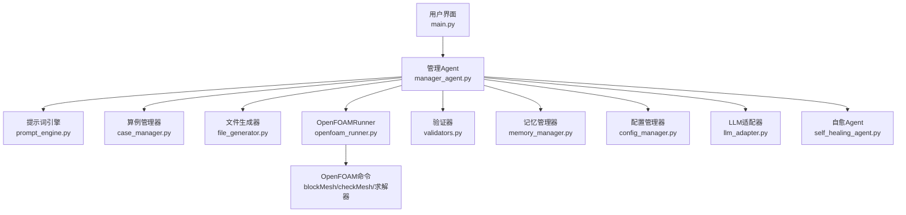
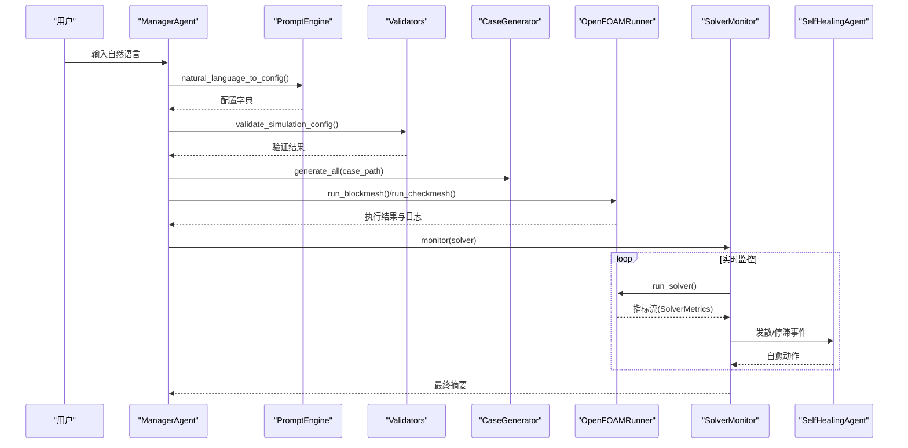
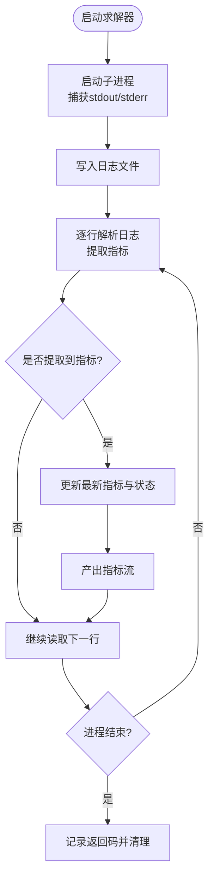
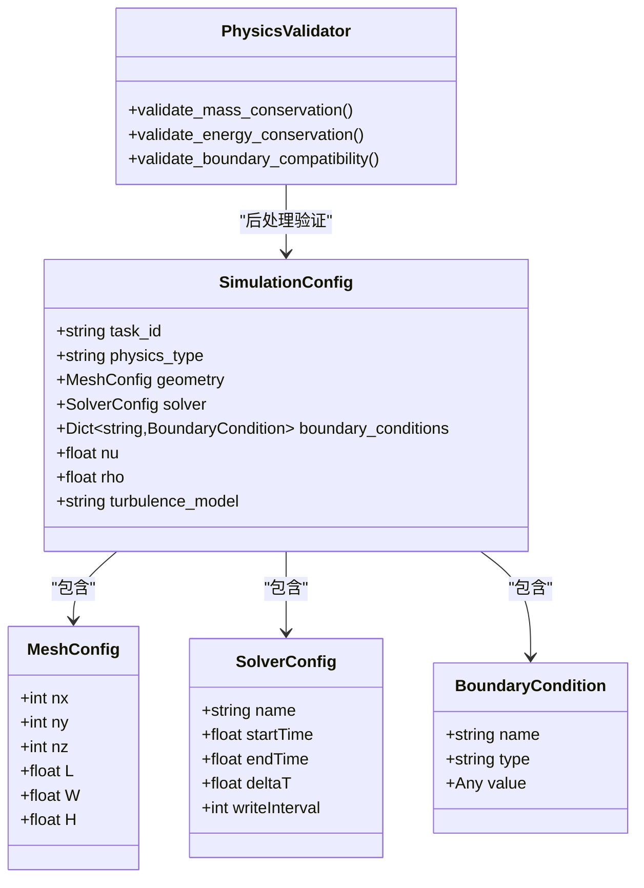
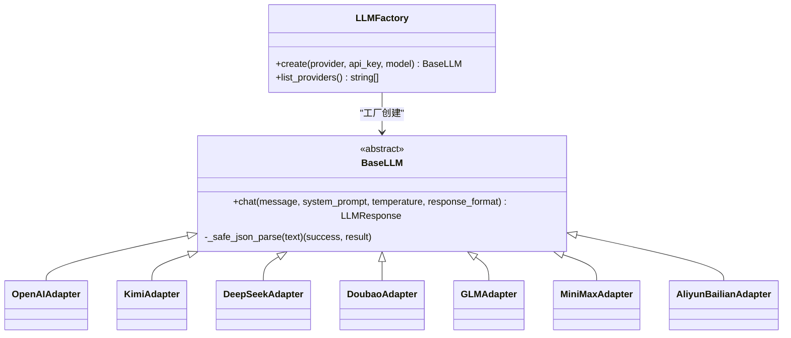
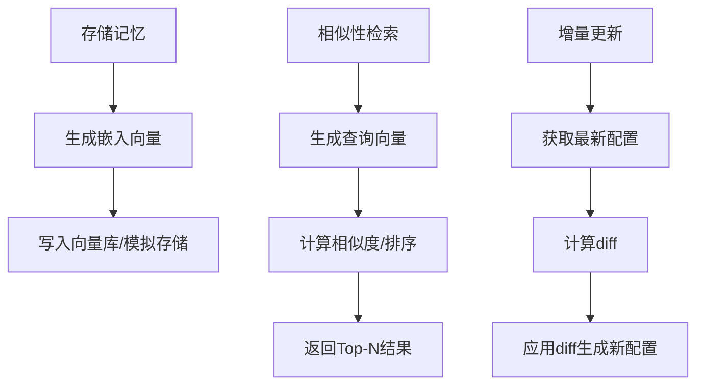
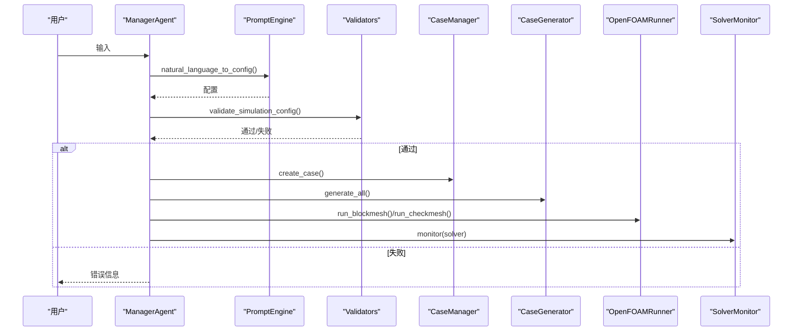
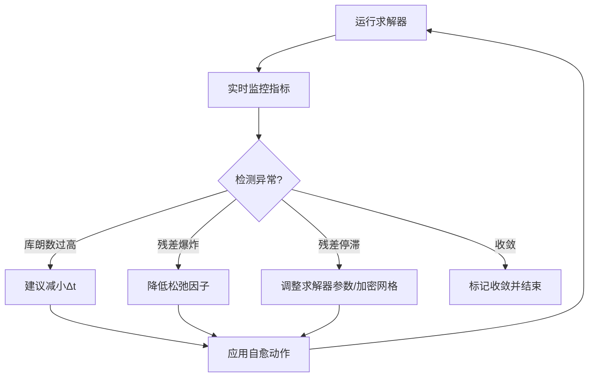
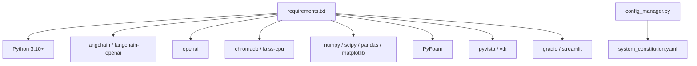

# 调试与故障排除

<cite>
**本文引用的文件**
- [README.md](file://openfoam_ai/README.md)
- [main.py](file://openfoam_ai/main.py)
- [openfoam_runner.py](file://openfoam_ai/core/openfoam_runner.py)
- [memory_manager.py](file://openfoam_ai/memory/memory_manager.py)
- [llm_adapter.py](file://openfoam_ai/core/llm_adapter.py)
- [validators.py](file://openfoam_ai/core/validators.py)
- [system_constitution.yaml](file://openfoam_ai/config/system_constitution.yaml)
- [manager_agent.py](file://openfoam_ai/agents/manager_agent.py)
- [requirements.txt](file://openfoam_ai/requirements.txt)
- [config_manager.py](file://openfoam_ai/core/config_manager.py)
- [self_healing_agent.py](file://openfoam_ai/agents/self_healing_agent.py)
- [test_basic.py](file://openfoam_ai/tests/test_basic.py)
</cite>

## 目录
1. [简介](#简介)
2. [项目结构](#项目结构)
3. [核心组件](#核心组件)
4. [架构总览](#架构总览)
5. [详细组件分析](#详细组件分析)
6. [依赖分析](#依赖分析)
7. [性能考虑](#性能考虑)
8. [故障排除指南](#故障排除指南)
9. [结论](#结论)
10. [附录](#附录)

## 简介
本指南面向OpenFOAM AI项目的开发者与运维人员，提供系统性的调试与故障排除方法。内容覆盖Python调试器、日志分析、性能监控工具的使用；常见问题的诊断流程（LLM集成、OpenFOAM求解器、内存管理、网络连接）；异常处理与最佳实践；以及开发与生产环境的差异与注意事项。针对Agent、Runner、MemoryManager等关键组件，给出具体定位方法与排障步骤。

## 项目结构
项目采用模块化分层组织，核心模块包括：
- 交互入口与UI：main.py
- 核心引擎：OpenFOAMRunner（命令执行与日志解析）、Validators（物理约束与验证）
- LLM适配：llm_adapter.py（多供应商适配）
- 记忆管理：memory_manager.py（向量存储与增量更新）
- 配置与宪法：system_constitution.yaml、config_manager.py
- 任务编排：manager_agent.py（计划生成与执行）
- 自愈监控：self_healing_agent.py（稳定性监控与自动修复）

图表来源
- [main.py:1-251](file://openfoam_ai/main.py#L1-L251)
- [manager_agent.py:1-458](file://openfoam_ai/agents/manager_agent.py#L1-L458)
- [openfoam_runner.py:1-548](file://openfoam_ai/core/openfoam_runner.py#L1-L548)
- [memory_manager.py:1-804](file://openfoam_ai/memory/memory_manager.py#L1-L804)
- [llm_adapter.py:1-688](file://openfoam_ai/core/llm_adapter.py#L1-L688)
- [validators.py:1-441](file://openfoam_ai/core/validators.py#L1-L441)
- [config_manager.py:1-227](file://openfoam_ai/core/config_manager.py#L1-L227)
- [self_healing_agent.py:1-642](file://openfoam_ai/agents/self_healing_agent.py#L1-L642)

章节来源
- [README.md:130-150](file://openfoam_ai/README.md#L130-L150)
- [requirements.txt:1-40](file://openfoam_ai/requirements.txt#L1-L40)

## 核心组件
- OpenFOAMRunner：封装OpenFOAM命令执行、日志捕获与解析、状态机与错误处理，支持blockMesh、checkMesh与求解器运行，并提供实时指标流。
- Validators：基于Pydantic的硬约束验证，结合system_constitution.yaml中的宪法规则，保障配置的物理合理性。
- LLM适配器：统一多供应商LLM接口，支持OpenAI、KIMI、DeepSeek、GLM、MiniMax、阿里云百炼等，具备Mock模式与环境变量自动读取。
- MemoryManager：基于ChromaDB的向量存储与检索，支持配置历史的增量更新与回滚。
- ManagerAgent：任务编排与交互中枢，负责意图识别、计划生成、执行协调与状态管理。
- 自愈Agent：实时监控求解器日志，检测发散与停滞，触发自愈动作（如减小时间步、调整松弛因子）。

章节来源
- [openfoam_runner.py:44-548](file://openfoam_ai/core/openfoam_runner.py#L44-L548)
- [validators.py:1-441](file://openfoam_ai/core/validators.py#L1-L441)
- [llm_adapter.py:1-688](file://openfoam_ai/core/llm_adapter.py#L1-L688)
- [memory_manager.py:1-804](file://openfoam_ai/memory/memory_manager.py#L1-L804)
- [manager_agent.py:1-458](file://openfoam_ai/agents/manager_agent.py#L1-L458)
- [self_healing_agent.py:1-642](file://openfoam_ai/agents/self_healing_agent.py#L1-L642)

## 架构总览
下图展示从用户交互到OpenFOAM求解器执行的关键路径，以及监控与自愈环节：

图表来源
- [manager_agent.py:176-338](file://openfoam_ai/agents/manager_agent.py#L176-L338)
- [openfoam_runner.py:99-198](file://openfoam_ai/core/openfoam_runner.py#L99-L198)
- [self_healing_agent.py:479-576](file://openfoam_ai/agents/self_healing_agent.py#L479-L576)

## 详细组件分析

### OpenFOAMRunner（求解器执行与日志解析）
- 关键职责：封装OpenFOAM命令执行、实时日志解析、状态机判定、错误处理与资源清理。
- 日志解析：支持blockMesh、checkMesh与求解器日志解析，提取时间步、库朗数、残差等指标。
- 状态机：IDLE/RUNNING/CONVERGED/DIVERGING/STALLED/ERROR/COMPLETED。
- 错误处理：捕获命令未找到、权限不足、日志解码错误、进程等待异常等，保证稳健性。
- 监控扩展：SolverMonitor基于Runner提供收敛/停滞检测与摘要输出。

图表来源
- [openfoam_runner.py:111-198](file://openfoam_ai/core/openfoam_runner.py#L111-L198)

章节来源
- [openfoam_runner.py:77-301](file://openfoam_ai/core/openfoam_runner.py#L77-L301)
- [openfoam_runner.py:303-387](file://openfoam_ai/core/openfoam_runner.py#L303-L387)
- [openfoam_runner.py:389-426](file://openfoam_ai/core/openfoam_runner.py#L389-L426)

### Validators（物理约束与验证）
- Pydantic模型：MeshConfig、SolverConfig、BoundaryCondition、SimulationConfig。
- 宪法规则：通过ConfigManager加载system_constitution.yaml，校验网格长宽比、总网格数、CFL条件、求解器与物理类型匹配、禁止组合等。
- 运行期验证：PhysicsValidator提供质量守恒、能量守恒、边界兼容性检查。

图表来源
- [validators.py:18-274](file://openfoam_ai/core/validators.py#L18-L274)
- [validators.py:277-386](file://openfoam_ai/core/validators.py#L277-L386)

章节来源
- [validators.py:13-16](file://openfoam_ai/core/validators.py#L13-L16)
- [validators.py:18-274](file://openfoam_ai/core/validators.py#L18-L274)
- [validators.py:277-386](file://openfoam_ai/core/validators.py#L277-L386)
- [system_constitution.yaml:1-103](file://openfoam_ai/config/system_constitution.yaml#L1-L103)
- [config_manager.py:94-181](file://openfoam_ai/core/config_manager.py#L94-L181)

### LLM适配器（多供应商统一接口）
- 支持：OpenAI、KIMI、DeepSeek、豆包（Doubao）、GLM、MiniMax、阿里云百炼。
- Mock模式：未提供API Key时自动进入Mock模式，便于离线测试。
- 环境变量：自动读取各供应商的API Key环境变量。
- 错误处理：统一返回LLMResponse结构，包含content、model、usage与success/error。

图表来源
- [llm_adapter.py:39-167](file://openfoam_ai/core/llm_adapter.py#L39-L167)
- [llm_adapter.py:170-574](file://openfoam_ai/core/llm_adapter.py#L170-L574)
- [llm_adapter.py:577-634](file://openfoam_ai/core/llm_adapter.py#L577-L634)

章节来源
- [llm_adapter.py:1-688](file://openfoam_ai/core/llm_adapter.py#L1-L688)

### MemoryManager（记忆与增量更新）
- 存储：支持ChromaDB与模拟模式，向量嵌入由简单哈希生成（演示用途）。
- 检索：相似性搜索，支持标签过滤。
- 增量更新：ConfigurationDiffer计算配置差异，支持diff应用与回滚。
- 导出/导入：支持JSON导出与批量导入，便于迁移与备份。

图表来源
- [memory_manager.py:291-345](file://openfoam_ai/memory/memory_manager.py#L291-L345)
- [memory_manager.py:474-520](file://openfoam_ai/memory/memory_manager.py#L474-L520)
- [memory_manager.py:610-652](file://openfoam_ai/memory/memory_manager.py#L610-L652)

章节来源
- [memory_manager.py:1-804](file://openfoam_ai/memory/memory_manager.py#L1-L804)

### ManagerAgent（任务编排与交互）
- 意图识别：根据关键词判断创建/修改/运行/状态/帮助。
- 计划生成：为创建任务生成标准步骤清单。
- 执行协调：调用CaseManager、CaseGenerator、OpenFOAMRunner、SolverMonitor等。
- 状态管理：维护当前算例、配置与执行历史。

图表来源
- [manager_agent.py:75-338](file://openfoam_ai/agents/manager_agent.py#L75-L338)

章节来源
- [manager_agent.py:1-458](file://openfoam_ai/agents/manager_agent.py#L1-L458)

### 自愈Agent（稳定性监控与自动修复）
- 实时监控：基于SolverStabilityMonitor解析指标，检测库朗数超标、残差爆炸/停滞、收敛状态。
- 告警与建议：记录发散事件与建议动作（如减小时间步、调整松弛因子）。
- 自愈执行：SmartSolverRunner集成监控与自愈控制器，按策略自动调整求解参数。

图表来源
- [self_healing_agent.py:86-196](file://openfoam_ai/agents/self_healing_agent.py#L86-L196)
- [self_healing_agent.py:479-576](file://openfoam_ai/agents/self_healing_agent.py#L479-L576)

章节来源
- [self_healing_agent.py:1-642](file://openfoam_ai/agents/self_healing_agent.py#L1-L642)

## 依赖分析
- Python版本与第三方库：项目要求Python 3.10+，依赖langchain、openai、chromadb、numpy、PyFoam、pyvista、gradio等。
- 配置与环境：通过ConfigManager统一加载system_constitution.yaml与环境变量，提供默认值与热重载能力。
- LLM供应商：llm_adapter.py统一抽象，支持多供应商切换与Mock模式。

图表来源
- [requirements.txt:1-40](file://openfoam_ai/requirements.txt#L1-L40)
- [config_manager.py:94-181](file://openfoam_ai/core/config_manager.py#L94-L181)
- [system_constitution.yaml:1-103](file://openfoam_ai/config/system_constitution.yaml#L1-L103)

章节来源
- [requirements.txt:1-40](file://openfoam_ai/requirements.txt#L1-L40)
- [config_manager.py:1-227](file://openfoam_ai/core/config_manager.py#L1-L227)

## 性能考虑
- 日志解析与I/O：OpenFOAMRunner在写日志文件时采用flush与逐行解析，避免阻塞；对Unicode解码错误进行容错处理。
- 指标流与状态机：通过迭代器产出SolverMetrics，减少内存占用；SolverMonitor维护固定长度历史窗口，控制内存增长。
- 并行与超时：ConfigManager提供并行核数与超时上限的默认配置，可根据环境调整。
- 向量存储：MemoryManager在模拟模式下使用内存存储，ChromaDB模式下支持持久化与查询优化。

章节来源
- [openfoam_runner.py:146-198](file://openfoam_ai/core/openfoam_runner.py#L146-L198)
- [openfoam_runner.py:429-516](file://openfoam_ai/core/openfoam_runner.py#L429-L516)
- [config_manager.py:67-71](file://openfoam_ai/core/config_manager.py#L67-L71)
- [memory_manager.py:243-254](file://openfoam_ai/memory/memory_manager.py#L243-L254)

## 故障排除指南

### 通用调试方法
- 启用详细日志：设置环境变量LOG_LEVEL=DEBUG（若项目支持），或在关键模块打印调试信息。
- 使用Mock模式：LLM适配器在未提供API Key时自动进入Mock模式，便于离线测试配置生成链路。
- 单元测试：运行基础测试用例，验证模块导入、验证器、文件生成器、PromptEngine等核心功能。
- 状态检查：通过ManagerAgent的“查看状态”功能确认当前算例与求解器状态。
- 配置验证：核对system_constitution.yaml中的网格、求解器、物理约束与禁止组合规则。

章节来源
- [README.md:208-237](file://openfoam_ai/README.md#L208-L237)
- [test_basic.py:1-270](file://openfoam_ai/tests/test_basic.py#L1-L270)
- [llm_adapter.py:636-670](file://openfoam_ai/core/llm_adapter.py#L636-L670)
- [manager_agent.py:389-409](file://openfoam_ai/agents/manager_agent.py#L389-L409)
- [system_constitution.yaml:1-103](file://openfoam_ai/config/system_constitution.yaml#L1-L103)

### LLM集成问题
- 症状：导入openai失败、API Key未设置、请求异常。
- 排查：
  - 确认requirements.txt中openai与langchain版本满足。
  - 设置对应供应商的API Key环境变量（如OPENAI_API_KEY、KIMI_API_KEY等）。
  - 若未设置API Key，LLM适配器将自动进入Mock模式。
- 修复：补齐API Key或使用Mock模式进行功能验证。

章节来源
- [requirements.txt:4-8](file://openfoam_ai/requirements.txt#L4-L8)
- [llm_adapter.py:636-670](file://openfoam_ai/core/llm_adapter.py#L636-L670)
- [llm_adapter.py:594-628](file://openfoam_ai/core/llm_adapter.py#L594-L628)

### OpenFOAM求解器错误
- 症状：命令未找到、权限不足、日志解码错误、进程异常结束。
- 排查：
  - 确认OpenFOAM已正确安装且PATH可用（main.py在启动时会检测blockMesh）。
  - 检查算例目录结构（0/、constant/、system/、logs/）是否完整。
  - 查看OpenFOAMRunner生成的日志文件（logs目录），关注库朗数、残差与checkMesh质量指标。
- 修复：
  - 修正PATH或使用Docker容器。
  - 优化网格与时间步长，确保CFL条件满足。
  - 使用SolverMonitor/SelfHealingAgent自动检测与修复。

章节来源
- [main.py:230-238](file://openfoam_ai/main.py#L230-L238)
- [openfoam_runner.py:77-97](file://openfoam_ai/core/openfoam_runner.py#L77-L97)
- [openfoam_runner.py:117-142](file://openfoam_ai/core/openfoam_runner.py#L117-L142)
- [openfoam_runner.py:169-174](file://openfoam_ai/core/openfoam_runner.py#L169-L174)
- [openfoam_runner.py:175-187](file://openfoam_ai/core/openfoam_runner.py#L175-L187)

### 内存管理异常
- 症状：向量数据库初始化失败、存储/检索异常、导出/导入失败。
- 排查：
  - ChromaDB不可用时自动回退到模拟模式，检查依赖安装。
  - 检查数据库路径权限与磁盘空间。
  - 使用MemoryManager的统计接口查看存储状态。
- 修复：
  - 安装chromadb与faiss-cpu依赖。
  - 清理旧数据库或更换db_path。
  - 使用导出/导入功能迁移数据。

章节来源
- [memory_manager.py:22-29](file://openfoam_ai/memory/memory_manager.py#L22-L29)
- [memory_manager.py:233-241](file://openfoam_ai/memory/memory_manager.py#L233-L241)
- [memory_manager.py:584-608](file://openfoam_ai/memory/memory_manager.py#L584-L608)
- [requirements.txt:9-11](file://openfoam_ai/requirements.txt#L9-L11)

### 网络连接问题
- 症状：LLM请求超时、HTTP错误、返回码异常。
- 排查：
  - 检查网络连通性与代理设置。
  - 根据供应商调整请求URL与超时参数。
  - 查看LLMResponse.error字段获取详细错误信息。
- 修复：
  - 更换网络环境或配置代理。
  - 降级模型或切换到Mock模式。

章节来源
- [llm_adapter.py:118-167](file://openfoam_ai/core/llm_adapter.py#L118-L167)
- [llm_adapter.py:191-237](file://openfoam_ai/core/llm_adapter.py#L191-L237)
- [llm_adapter.py:248-298](file://openfoam_ai/core/llm_adapter.py#L248-L298)

### 配置验证与宪法冲突
- 症状：配置验证失败、网格长宽比过大、CFL条件不满足、求解器与物理类型不匹配。
- 排查：
  - 检查system_constitution.yaml中的Mesh_Standards、Solver_Standards、Prohibited_Combinations。
  - 使用validators.py提供的验证函数输出具体错误信息。
- 修复：
  - 调整网格分辨率、时间步长与求解器选择。
  - 遵守禁止组合规则，如icoFoam不可用于可压流。

章节来源
- [validators.py:13-16](file://openfoam_ai/core/validators.py#L13-L16)
- [validators.py:51-87](file://openfoam_ai/core/validators.py#L51-L87)
- [validators.py:120-155](file://openfoam_ai/core/validators.py#L120-L155)
- [validators.py:204-264](file://openfoam_ai/core/validators.py#L204-L264)
- [system_constitution.yaml:13-64](file://openfoam_ai/config/system_constitution.yaml#L13-L64)

### 开发与生产环境差异
- 开发环境：
  - 可使用Mock模式与本地依赖，便于离线调试。
  - 建议开启详细日志与断点调试。
- 生产环境：
  - 确保OpenFOAM PATH、LLM API Key、ChromaDB服务可用。
  - 配置超时、并行核数与内存限制，避免长时间阻塞。
  - 使用日志轮转与错误告警机制。

章节来源
- [config_manager.py:74-83](file://openfoam_ai/core/config_manager.py#L74-L83)
- [config_manager.py:183-193](file://openfoam_ai/core/config_manager.py#L183-L193)
- [README.md:208-237](file://openfoam_ai/README.md#L208-L237)

### 性能问题诊断与优化
- 内存泄漏检测：检查MemoryManager的存储与导出接口，确认无重复写入与未释放句柄。
- CPU使用率分析：通过SolverMonitor观察收敛速度与停滞步数，必要时降低时间步长或细化网格。
- I/O瓶颈识别：关注OpenFOAMRunner的日志写入频率与磁盘空间，避免频繁fsync导致延迟。

章节来源
- [memory_manager.py:610-652](file://openfoam_ai/memory/memory_manager.py#L610-L652)
- [openfoam_runner.py:146-156](file://openfoam_ai/core/openfoam_runner.py#L146-L156)
- [openfoam_runner.py:429-470](file://openfoam_ai/core/openfoam_runner.py#L429-L470)

## 结论
本指南提供了OpenFOAM AI项目的系统性调试与故障排除方法，涵盖LLM集成、OpenFOAM求解器、内存管理与网络连接等关键领域。通过合理利用日志、状态检查、配置验证与自愈机制，可显著提升系统的稳定性与可维护性。建议在开发与生产环境中分别采用不同的调试策略，并持续完善监控与告警体系。

## 附录
- 常见错误与建议：参见README.md的“常见错误”与“调试建议”章节。
- 基础测试：test_basic.py展示了模块导入、验证器、文件生成器与PromptEngine的基本测试流程。

章节来源
- [README.md:208-237](file://openfoam_ai/README.md#L208-L237)
- [test_basic.py:1-270](file://openfoam_ai/tests/test_basic.py#L1-L270)