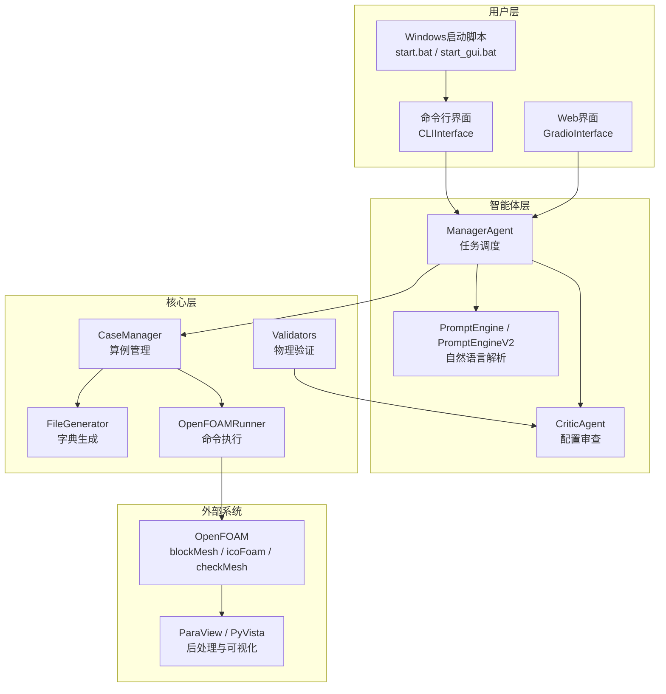
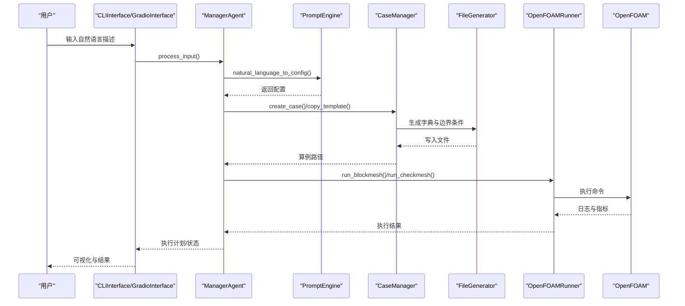
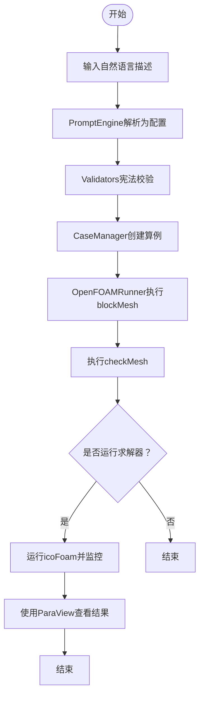
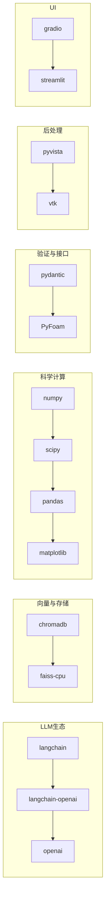

# 快速开始

<cite>
**本文引用的文件**
- [README.md](file://openfoam_ai/README.md)
- [requirements.txt](file://openfoam_ai/requirements.txt)
- [main.py](file://openfoam_ai/main.py)
- [quick_start.py](file://quick_start.py)
- [start_openfoam_ai.py](file://start_openfoam_ai.py)
- [interactive_openfoam_ai.py](file://interactive_openfoam_ai.py)
- [cli_interface.py](file://openfoam_ai/ui/cli_interface.py)
- [gradio_interface.py](file://openfoam_ai/ui/gradio_interface.py)
- [system_constitution.yaml](file://openfoam_ai/config/system_constitution.yaml)
- [start.bat](file://start.bat)
- [start_gui.bat](file://start_gui.bat)
- [launch_gui.py](file://launch_gui.py)
- [demo_full_workflow.py](file://demo_full_workflow.py)
- [cavity_demo/.case_info.json](file://demo_cases/cavity_demo/.case_info.json)
</cite>

## 目录
1. [简介](#简介)
2. [项目结构](#项目结构)
3. [核心组件](#核心组件)
4. [架构总览](#架构总览)
5. [详细组件分析](#详细组件分析)
6. [依赖关系分析](#依赖关系分析)
7. [性能考虑](#性能考虑)
8. [故障排除指南](#故障排除指南)
9. [结论](#结论)
10. [附录](#附录)

## 简介
本指南面向新手用户，帮助你在30分钟内成功运行第一个OpenFOAM AI自动化CFD仿真案例。你将学到：
- 环境要求与安装步骤
- 三种运行方式：交互模式、演示模式、命令行模式
- 从自然语言描述到结果可视化的完整流程
- 常见问题的解决方案

## 项目结构
OpenFOAM AI项目采用模块化设计，核心围绕“智能体 + 核心引擎 + 可视化”的三层架构组织。关键目录与职责如下：
- openfoam_ai/agents：智能体模块（管理Agent、提示词引擎、审查Agent等）
- openfoam_ai/core：核心功能（算例管理、文件生成、OpenFOAM执行、校验）
- openfoam_ai/ui：用户界面（CLI、Gradio）
- openfoam_ai/utils：工具模块（可视化、仿真模拟器等）
- demo_cases、gui_cases、interactive_cases：示例与演示算例
- docker：Docker部署配置
- 配置文件：system_constitution.yaml（项目宪法）

图表来源
- [main.py:1-251](file://openfoam_ai/main.py#L1-L251)
- [cli_interface.py:1-401](file://openfoam_ai/ui/cli_interface.py#L1-L401)
- [gradio_interface.py:1-484](file://openfoam_ai/ui/gradio_interface.py#L1-L484)

章节来源
- [README.md:130-150](file://openfoam_ai/README.md#L130-L150)

## 核心组件
- ManagerAgent：负责接收自然语言输入，生成执行计划，协调各Agent与核心模块。
- PromptEngine/PromptEngineV2：将自然语言转换为仿真配置，并支持解释与改进建议。
- CaseManager：管理算例目录结构，创建/复制/清理/删除算例。
- OpenFOAMRunner：封装OpenFOAM命令执行，提供网格生成、检查与求解器运行。
- Validators：基于宪法规则进行物理合理性与数值稳定性校验。
- CLIInterface/GradioInterface：提供命令行与Web交互界面。

章节来源
- [README.md:161-207](file://openfoam_ai/README.md#L161-L207)
- [main.py:19-251](file://openfoam_ai/main.py#L19-L251)
- [cli_interface.py:17-401](file://openfoam_ai/ui/cli_interface.py#L17-L401)
- [gradio_interface.py:31-484](file://openfoam_ai/ui/gradio_interface.py#L31-L484)

## 架构总览
下图展示了从用户输入到OpenFOAM执行与结果可视化的端到端流程。

图表来源
- [main.py:37-251](file://openfoam_ai/main.py#L37-L251)
- [cli_interface.py:139-252](file://openfoam_ai/ui/cli_interface.py#L139-L252)
- [gradio_interface.py:99-244](file://openfoam_ai/ui/gradio_interface.py#L99-L244)

## 详细组件分析

### 环境要求与安装
- Python 3.10+
- OpenFOAM（Foundation v11 或 ESI v2312）
- 可选：OpenAI API Key 或其他LLM提供商Key（如KIMI、DeepSeek等）
- 依赖：通过requirements.txt统一管理，包含LLM框架、向量数据库、科学计算、OpenFOAM接口、后处理、Web UI等

安装步骤
1) 克隆仓库并进入目录
2) 安装依赖：pip install -r requirements.txt
3) 可选：使用Docker Compose一键部署（docker/docker-compose.yml）

章节来源
- [README.md:19-37](file://openfoam_ai/README.md#L19-L37)
- [requirements.txt:1-40](file://openfoam_ai/requirements.txt#L1-L40)

### 运行方式
- 交互模式：python main.py
- 演示模式：python main.py --demo
- 命令行模式：python main.py --case "你的自然语言描述"

Windows快捷方式
- start.bat：激活虚拟环境并启动交互模式
- start_gui.bat：启动GUI服务（需安装Gradio与Matplotlib）

章节来源
- [README.md:39-51](file://openfoam_ai/README.md#L39-L51)
- [main.py:202-251](file://openfoam_ai/main.py#L202-L251)
- [start.bat:1-16](file://start.bat#L1-L16)
- [start_gui.bat:1-21](file://start_gui.bat#L1-L21)

### 第一个CFD算例：方腔驱动流
目标：建立一个二维方腔驱动流，顶部速度1m/s，雷诺数100。

完整流程
1) 交互模式输入自然语言描述
2) ManagerAgent调用PromptEngine生成配置
3) CaseManager创建算例目录并写入字典文件
4) OpenFOAMRunner执行blockMesh与checkMesh
5) 可选：运行求解器icoFoam并监控残差
6) 使用ParaView查看结果

图表来源
- [main.py:101-173](file://openfoam_ai/main.py#L101-L173)
- [start_openfoam_ai.py:132-276](file://start_openfoam_ai.py#L132-L276)

章节来源
- [README.md:54-102](file://openfoam_ai/README.md#L54-L102)
- [main.py:101-173](file://openfoam_ai/main.py#L101-L173)

### 多模态与后处理
- 可视化预览：生成几何、网格与预期流场的预览图
- 结果查看：使用paraFoam或PyVista进行后处理
- 记忆与会话：CLI/Web界面支持历史检索与导出

章节来源
- [interactive_openfoam_ai.py:289-446](file://interactive_openfoam_ai.py#L289-L446)
- [cli_interface.py:288-362](file://openfoam_ai/ui/cli_interface.py#L288-L362)
- [gradio_interface.py:246-298](file://openfoam_ai/ui/gradio_interface.py#L246-L298)

## 依赖关系分析
- LLM框架：langchain、langchain-openai、openai
- 向量数据库：chromadb、faiss-cpu
- 科学计算：numpy、scipy、pandas、matplotlib
- 数据验证：pydantic
- OpenFOAM接口：PyFoam
- 后处理：pyvista、vtk
- Web UI：gradio、streamlit
- 工具：pyyaml、python-dotenv、tqdm、pytest、black、mypy

图表来源
- [requirements.txt:4-39](file://openfoam_ai/requirements.txt#L4-L39)

章节来源
- [requirements.txt:1-40](file://openfoam_ai/requirements.txt#L1-L40)

## 性能考虑
- 网格规模：根据宪法规则，避免过小网格（如2D至少20x20），合理设置边界层增长与y+目标
- 求解器参数：库朗数、松弛因子、写入间隔等应满足稳定性与精度要求
- 并行与缓存：利用向量数据库加速相似案例检索；使用内存与会话管理提升交互效率
- 可视化：预览图生成依赖Matplotlib，建议提前安装以获得最佳体验

## 故障排除指南
常见问题与解决
- 空字节或UTF‑16 BOM导致的语法错误：运行清理脚本或转换文件编码为UTF‑8
- 缺少openai包：安装openai或使用Mock模式（设置api_key=None）
- OpenFOAM未安装或PATH未设置：确保blockMesh等命令可用，或在Docker容器内运行
- 配置不符合宪法规则：检查配置参数是否满足系统宪法约束
- Windows控制台编码问题：设置环境变量PYTHONIOENCODING=utf-8

调试建议
- 启用详细日志：设置环境变量LOG_LEVEL=DEBUG
- 使用Mock模式测试配置生成：PromptEngine(api_key=None)
- 运行单元测试：pytest openfoam_ai/tests/
- 检查算例目录结构：确保0/、constant/、system/目录存在

章节来源
- [README.md:208-237](file://openfoam_ai/README.md#L208-L237)

## 结论
通过本快速开始指南，你可以在30分钟内完成环境搭建、安装依赖、运行交互/演示/命令行模式，并成功执行第一个方腔驱动流算例。项目提供了完善的防幻觉机制与物理验证，确保生成的配置安全可靠。建议在掌握基础后，逐步探索GUI界面、记忆功能与多模态后处理能力。

## 附录

### 三种运行方式对照
- 交互模式：适合探索性工作流，支持多轮对话与即时反馈
- 演示模式：一键创建标准算例并展示关键步骤
- 命令行模式：适合批处理与自动化场景

章节来源
- [README.md:39-51](file://openfoam_ai/README.md#L39-L51)
- [main.py:202-251](file://openfoam_ai/main.py#L202-L251)

### 项目宪法要点（节选）
- 网格质量：最小网格数、最大非正交性、边界层y+目标
- 求解器标准：收敛残差、库朗数、松弛因子、写入间隔
- 物理约束：雷诺数、普朗特数、运动粘度与密度范围
- 禁止组合：求解器与物理类型不兼容组合
- 质量检查：运行前后与过程中的多项检查清单

章节来源
- [system_constitution.yaml:1-103](file://openfoam_ai/config/system_constitution.yaml#L1-L103)

### 示例算例信息
- cavity_demo：包含基本算例元数据，便于理解结构与后续扩展

章节来源
- [cavity_demo/.case_info.json:1-9](file://demo_cases/cavity_demo/.case_info.json#L1-L9)