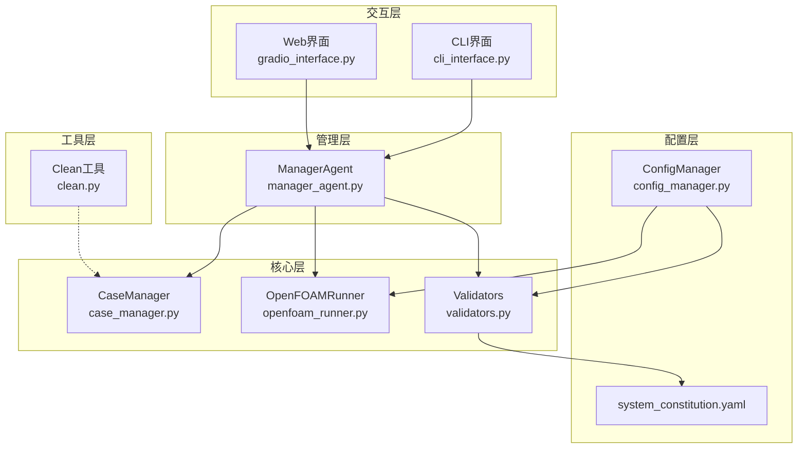
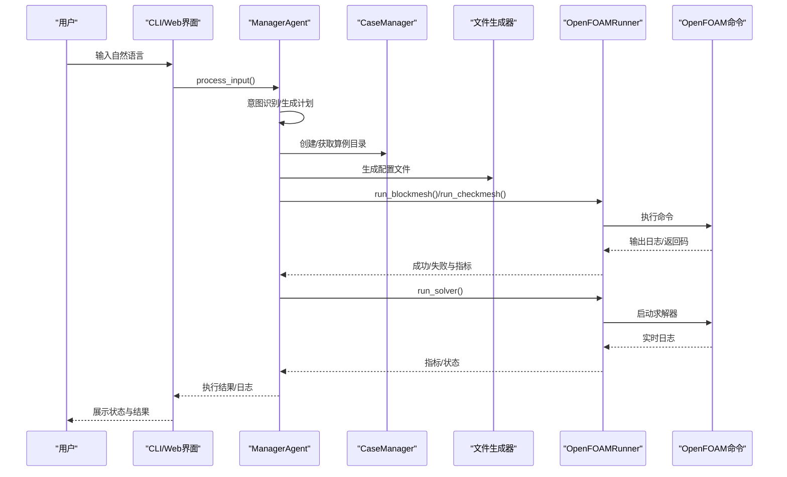
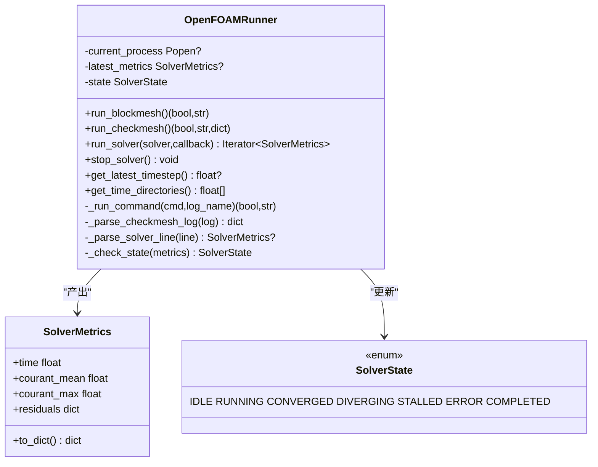
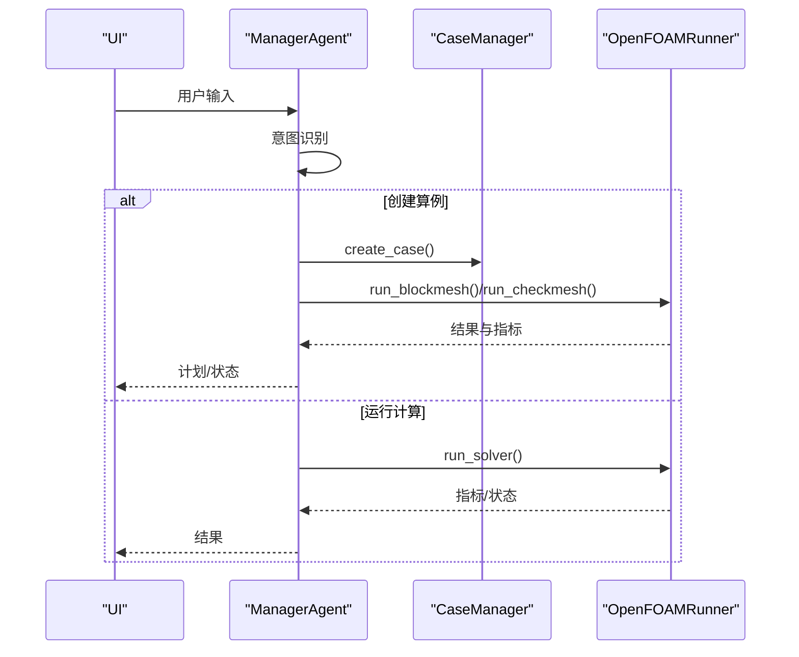
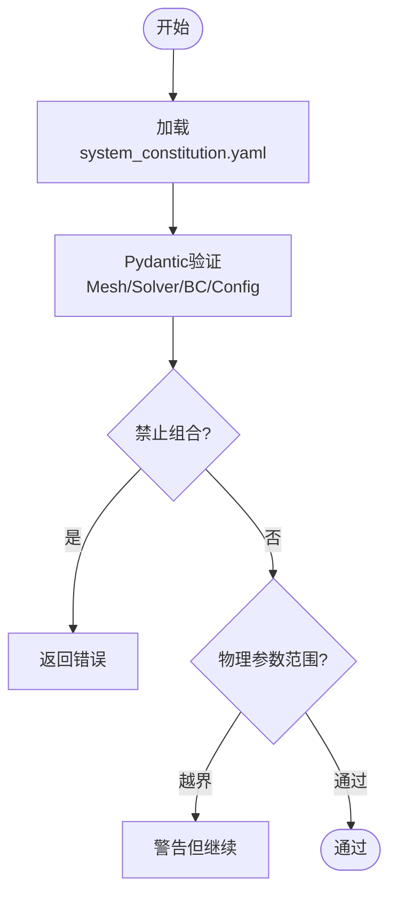
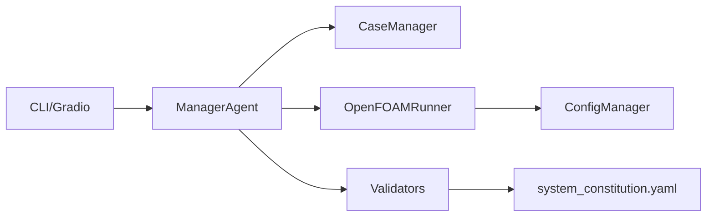
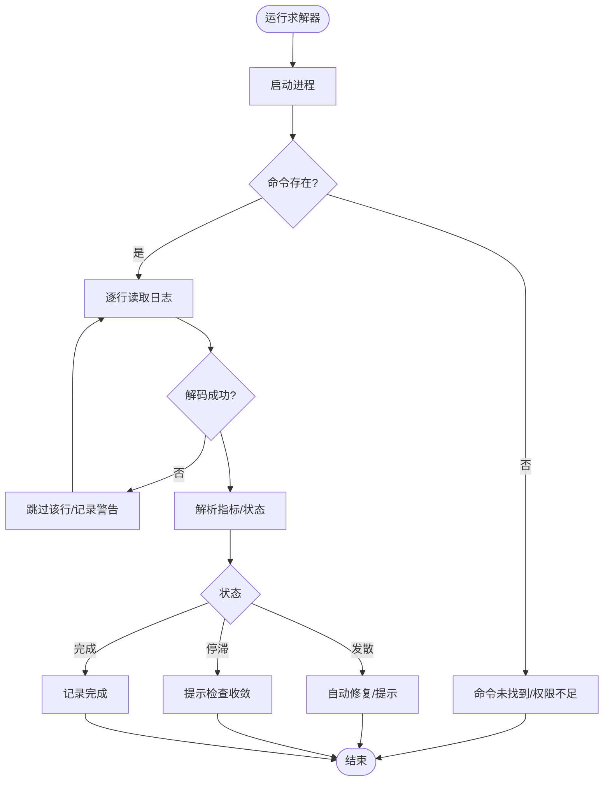

# 故障排除指南

<cite>
**本文引用的文件**
- [openfoam_ai/README.md](file://openfoam_ai/README.md)
- [clean.py](file://clean.py)
- [openfoam_ai/main.py](file://openfoam_ai/main.py)
- [openfoam_ai/core/openfoam_runner.py](file://openfoam_ai/core/openfoam_runner.py)
- [openfoam_ai/core/case_manager.py](file://openfoam_ai/core/case_manager.py)
- [openfoam_ai/core/config_manager.py](file://openfoam_ai/core/config_manager.py)
- [openfoam_ai/config/system_constitution.yaml](file://openfoam_ai/config/system_constitution.yaml)
- [openfoam_ai/core/validators.py](file://openfoam_ai/core/validators.py)
- [openfoam_ai/agents/manager_agent.py](file://openfoam_ai/agents/manager_agent.py)
- [openfoam_ai/requirements.txt](file://openfoam_ai/requirements.txt)
- [openfoam_ai/ui/cli_interface.py](file://openfoam_ai/ui/cli_interface.py)
- [openfoam_ai/ui/gradio_interface.py](file://openfoam_ai/ui/gradio_interface.py)
- [openfoam_ai/tests/test_case_manager.py](file://openfoam_ai/tests/test_case_manager.py)
- [openfoam_ai/tests/test_basic.py](file://openfoam_ai/tests/test_basic.py)
</cite>

## 目录
1. [简介](#简介)
2. [项目结构](#项目结构)
3. [核心组件](#核心组件)
4. [架构总览](#架构总览)
5. [详细组件分析](#详细组件分析)
6. [依赖关系分析](#依赖关系分析)
7. [性能考虑](#性能考虑)
8. [故障排除指南](#故障排除指南)
9. [结论](#结论)
10. [附录](#附录)

## 简介
本指南面向OpenFOAM AI项目的使用者与开发者，提供系统性的故障诊断与问题解决方法。内容涵盖安装问题诊断、配置问题排查、运行时错误处理策略、性能问题定位、内存与并发问题调试、日志分析技巧、错误代码解释以及Clean.py等工具的使用与清理策略。读者无需深厚的底层背景即可按步骤定位并解决问题。

## 项目结构
OpenFOAM AI采用模块化设计，围绕“自然语言理解—配置生成—文件生成—OpenFOAM执行—结果后处理”的闭环展开。关键模块包括：
- 交互层：CLI与Web UI（Gradio）
- 管理层：Manager Agent（任务调度、意图识别、状态管理）
- 核心层：CaseManager（算例目录管理）、OpenFOAMRunner（命令执行与日志解析）、Validators（配置与物理验证）
- 配置层：ConfigManager（宪法规则与环境变量）、system_constitution.yaml（硬约束）
- 工具层：clean.py（文件清理）

**图表来源**
- [openfoam_ai/ui/cli_interface.py:1-401](file://openfoam_ai/ui/cli_interface.py#L1-L401)
- [openfoam_ai/ui/gradio_interface.py:1-484](file://openfoam_ai/ui/gradio_interface.py#L1-L484)
- [openfoam_ai/agents/manager_agent.py:1-458](file://openfoam_ai/agents/manager_agent.py#L1-L458)
- [openfoam_ai/core/case_manager.py:1-639](file://openfoam_ai/core/case_manager.py#L1-L639)
- [openfoam_ai/core/openfoam_runner.py:1-548](file://openfoam_ai/core/openfoam_runner.py#L1-L548)
- [openfoam_ai/core/validators.py:1-441](file://openfoam_ai/core/validators.py#L1-L441)
- [openfoam_ai/core/config_manager.py:1-227](file://openfoam_ai/core/config_manager.py#L1-L227)
- [openfoam_ai/config/system_constitution.yaml:1-103](file://openfoam_ai/config/system_constitution.yaml#L1-L103)
- [clean.py:1-31](file://clean.py#L1-L31)

**章节来源**
- [openfoam_ai/README.md:130-150](file://openfoam_ai/README.md#L130-L150)

## 核心组件
- ManagerAgent：负责意图识别、生成执行计划、协调CaseManager、OpenFOAMRunner与Validators，并与UI交互。
- CaseManager：负责创建/复制/清理/删除算例目录，维护算例信息与状态。
- OpenFOAMRunner：封装blockMesh/checkMesh/求解器执行，实时解析日志、检测发散与停滞，支持停止求解器。
- Validators：基于Pydantic的硬约束验证，结合system_constitution.yaml进行物理合理性检查。
- ConfigManager：集中管理宪法规则、环境变量与默认配置，提供统一访问接口。
- UI层：CLI与Gradio提供自然语言交互、操作确认与状态展示。

**章节来源**
- [openfoam_ai/agents/manager_agent.py:38-105](file://openfoam_ai/agents/manager_agent.py#L38-L105)
- [openfoam_ai/core/case_manager.py:27-86](file://openfoam_ai/core/case_manager.py#L27-L86)
- [openfoam_ai/core/openfoam_runner.py:44-198](file://openfoam_ai/core/openfoam_runner.py#L44-L198)
- [openfoam_ai/core/validators.py:18-275](file://openfoam_ai/core/validators.py#L18-L275)
- [openfoam_ai/core/config_manager.py:16-135](file://openfoam_ai/core/config_manager.py#L16-L135)
- [openfoam_ai/ui/cli_interface.py:17-138](file://openfoam_ai/ui/cli_interface.py#L17-L138)
- [openfoam_ai/ui/gradio_interface.py:31-194](file://openfoam_ai/ui/gradio_interface.py#L31-L194)

## 架构总览
下图展示了从用户输入到OpenFOAM执行与结果反馈的关键流程，以及错误处理与日志记录的位置。

**图表来源**
- [openfoam_ai/ui/cli_interface.py:90-252](file://openfoam_ai/ui/cli_interface.py#L90-L252)
- [openfoam_ai/ui/gradio_interface.py:99-244](file://openfoam_ai/ui/gradio_interface.py#L99-L244)
- [openfoam_ai/agents/manager_agent.py:176-338](file://openfoam_ai/agents/manager_agent.py#L176-L338)
- [openfoam_ai/core/openfoam_runner.py:77-198](file://openfoam_ai/core/openfoam_runner.py#L77-L198)

## 详细组件分析

### 组件A：OpenFOAMRunner（命令执行与日志解析）
- 关键职责：执行blockMesh/checkMesh/求解器；实时解析日志行，提取时间、库朗数与残差；检测发散/停滞/完成状态；支持停止求解器。
- 错误处理：捕获命令未找到、权限不足、日志解码错误、写日志异常、进程等待异常等；返回状态机枚举。
- 性能与可靠性：缓冲逐行读取、异常跳过、超时强制终止、返回码判定。

**图表来源**
- [openfoam_ai/core/openfoam_runner.py:27-198](file://openfoam_ai/core/openfoam_runner.py#L27-L198)

**章节来源**
- [openfoam_ai/core/openfoam_runner.py:77-198](file://openfoam_ai/core/openfoam_runner.py#L77-L198)
- [openfoam_ai/core/openfoam_runner.py:303-387](file://openfoam_ai/core/openfoam_runner.py#L303-L387)
- [openfoam_ai/core/openfoam_runner.py:389-408](file://openfoam_ai/core/openfoam_runner.py#L389-L408)

### 组件B：ManagerAgent（任务调度与状态管理）
- 关键职责：意图识别（创建/修改/运行/状态/帮助）；生成执行计划；协调CaseManager与OpenFOAMRunner；与UI交互；记录执行历史。
- 风险控制：对高风险操作（如删除/覆盖）进行确认；自动修复开关；状态更新（meshed/solving/converged/diverged）。

**图表来源**
- [openfoam_ai/agents/manager_agent.py:75-105](file://openfoam_ai/agents/manager_agent.py#L75-L105)
- [openfoam_ai/agents/manager_agent.py:176-338](file://openfoam_ai/agents/manager_agent.py#L176-L338)

**章节来源**
- [openfoam_ai/agents/manager_agent.py:106-141](file://openfoam_ai/agents/manager_agent.py#L106-L141)
- [openfoam_ai/agents/manager_agent.py:207-267](file://openfoam_ai/agents/manager_agent.py#L207-L267)
- [openfoam_ai/agents/manager_agent.py:268-338](file://openfoam_ai/agents/manager_agent.py#L268-L338)

### 组件C：Validators（配置与物理验证）
- 关键职责：基于Pydantic的MeshConfig/SolverConfig/BoundaryCondition/SimulationConfig验证；禁止组合检查；物理参数范围检查；后处理物理一致性验证（质量/能量守恒）。
- 与宪法联动：读取system_constitution.yaml，结合默认值与环境变量进行约束。

**图表来源**
- [openfoam_ai/core/validators.py:18-275](file://openfoam_ai/core/validators.py#L18-L275)
- [openfoam_ai/config/system_constitution.yaml:53-64](file://openfoam_ai/config/system_constitution.yaml#L53-L64)

**章节来源**
- [openfoam_ai/core/validators.py:18-275](file://openfoam_ai/core/validators.py#L18-L275)
- [openfoam_ai/core/validators.py:277-387](file://openfoam_ai/core/validators.py#L277-L387)

### 组件D：ConfigManager（配置与宪法）
- 关键职责：加载system_constitution.yaml；合并默认值；读取环境变量；提供统一访问接口；支持热重载。
- 阈值与标准：从宪法读取求解器标准（库朗数、发散阈值、收敛残差）。

**章节来源**
- [openfoam_ai/core/config_manager.py:94-135](file://openfoam_ai/core/config_manager.py#L94-L135)
- [openfoam_ai/core/openfoam_runner.py:70-76](file://openfoam_ai/core/openfoam_runner.py#L70-L76)

### 组件E：UI层（CLI与Web）
- CLIInterface：增强命令行交互，支持多轮对话、记忆检索、操作确认、状态与统计展示。
- GradioInterface：Web界面，支持聊天式交互、配置可视化、记忆检索与导出、统计信息展示。

**章节来源**
- [openfoam_ai/ui/cli_interface.py:90-252](file://openfoam_ai/ui/cli_interface.py#L90-L252)
- [openfoam_ai/ui/gradio_interface.py:99-244](file://openfoam_ai/ui/gradio_interface.py#L99-L244)

## 依赖关系分析
- 依赖关系：ManagerAgent依赖CaseManager、OpenFOAMRunner、Validators；OpenFOAMRunner依赖ConfigManager；Validators依赖system_constitution.yaml；UI层依赖ManagerAgent与MemoryManager/SessionManager。
- 外部依赖：OpenFOAM命令（blockMesh/checkMesh/求解器）、Python第三方库（langchain、openai、pydantic、PyFoam、gradio等）。

**图表来源**
- [openfoam_ai/agents/manager_agent.py:12-16](file://openfoam_ai/agents/manager_agent.py#L12-L16)
- [openfoam_ai/core/openfoam_runner.py:13-13](file://openfoam_ai/core/openfoam_runner.py#L13-L13)
- [openfoam_ai/core/validators.py:11-11](file://openfoam_ai/core/validators.py#L11-L11)
- [openfoam_ai/core/config_manager.py:90-92](file://openfoam_ai/core/config_manager.py#L90-L92)
- [openfoam_ai/ui/cli_interface.py:12-14](file://openfoam_ai/ui/cli_interface.py#L12-L14)
- [openfoam_ai/ui/gradio_interface.py:26-28](file://openfoam_ai/ui/gradio_interface.py#L26-L28)

**章节来源**
- [openfoam_ai/requirements.txt:1-40](file://openfoam_ai/requirements.txt#L1-L40)

## 性能考虑
- 求解器监控：SolverMonitor记录指标历史，检测停滞与收敛；阈值来自ConfigManager与system_constitution.yaml。
- 并发与资源：OpenFOAMRunner使用subprocess运行命令；注意系统资源限制与并行核数设置。
- I/O与日志：逐行读取与写入日志，避免阻塞；异常跳过与超时处理保障稳定性。

**章节来源**
- [openfoam_ai/core/openfoam_runner.py:446-501](file://openfoam_ai/core/openfoam_runner.py#L446-L501)
- [openfoam_ai/core/config_manager.py:67-72](file://openfoam_ai/core/config_manager.py#L67-L72)

## 故障排除指南

### 一、安装与环境问题
- 症状：命令未找到（如blockMesh、checkMesh、求解器）。
  - 根本原因：OpenFOAM未安装或PATH未设置；Docker环境未启动。
  - 解决步骤：
    1) 在终端直接运行blockMesh -help确认OpenFOAM可用。
    2) 若未安装，按README的安装步骤安装OpenFOAM。
    3) 使用Docker Compose启动容器环境。
    4) 设置环境变量OPENFOAM_PATH/OPENFOAM_VERSION等（可选）。
- 症状：Python包缺失（如openai、gradio）。
  - 根本原因：requirements.txt未完全安装。
  - 解决步骤：pip install -r openfoam_ai/requirements.txt；若无网络，使用离线包或镜像源。
- 症状：Windows控制台编码问题导致Unicode字符报错。
  - 根本原因：默认编码为GBK。
  - 解决步骤：设置环境变量PYTHONIOENCODING=utf-8；或忽略该错误不影响功能。

**章节来源**
- [openfoam_ai/README.md:25-37](file://openfoam_ai/README.md#L25-L37)
- [openfoam_ai/README.md:216-230](file://openfoam_ai/README.md#L216-L230)
- [openfoam_ai/main.py:230-238](file://openfoam_ai/main.py#L230-L238)
- [openfoam_ai/requirements.txt:1-40](file://openfoam_ai/requirements.txt#L1-L40)

### 二、配置问题排查
- 症状：Pydantic验证失败（MeshConfig/SolverConfig/BC/Config）。
  - 根本原因：网格分辨率过低、时间步长过大、物理参数越界、求解器与物理类型不匹配、禁止组合。
  - 解决步骤：
    1) 检查system_constitution.yaml中的最小网格数、最大长宽比、CFL限制等。
    2) 使用Mock模式测试配置生成（PromptEngine api_key=None）。
    3) 通过Validators.validate_simulation_config()获取具体错误列表。
    4) 调整几何尺寸、网格分辨率、时间步长与求解器类型。
- 症状：配置与宪法冲突（如icoFoam用于可压流）。
  - 根本原因：Prohibited_Combinations规则触发。
  - 解决步骤：更换求解器或调整物理类型；参考宪法中的禁止组合表。

**章节来源**
- [openfoam_ai/core/validators.py:18-275](file://openfoam_ai/core/validators.py#L18-L275)
- [openfoam_ai/config/system_constitution.yaml:53-64](file://openfoam_ai/config/system_constitution.yaml#L53-L64)
- [openfoam_ai/README.md:200-227](file://openfoam_ai/README.md#L200-L227)

### 三、运行时错误处理
- 症状：求解器启动失败（命令未找到/权限不足）。
  - 根本原因：OpenFOAM未安装、PATH未设置、权限不足。
  - 解决步骤：确认OpenFOAM安装；在容器内运行；检查文件权限。
- 症状：求解器异常结束（返回码非0）。
  - 根本原因：发散、网格质量差、时间步长过大、边界条件不当。
  - 解决步骤：查看solver日志；降低时间步长；细化网格；检查边界条件；使用checkMesh验证网格质量。
- 症状：日志解码错误或写日志异常。
  - 根本原因：非UTF-8字符、磁盘空间不足。
  - 解决步骤：使用clean.py清理空字节与UTF-8 BOM；释放磁盘空间。

**图表来源**
- [openfoam_ai/core/openfoam_runner.py:118-198](file://openfoam_ai/core/openfoam_runner.py#L118-L198)
- [openfoam_ai/core/openfoam_runner.py:169-177](file://openfoam_ai/core/openfoam_runner.py#L169-L177)

**章节来源**
- [openfoam_ai/core/openfoam_runner.py:118-198](file://openfoam_ai/core/openfoam_runner.py#L118-L198)
- [openfoam_ai/core/openfoam_runner.py:169-177](file://openfoam_ai/core/openfoam_runner.py#L169-L177)

### 四、性能问题定位
- 症状：计算缓慢或长时间停滞。
  - 根本原因：网格过于粗糙、时间步长过大、求解器不稳定、收敛阈值过高。
  - 解决步骤：
    1) 使用SolverMonitor监控残差与库朗数；关注停滞检测逻辑。
    2) 降低时间步长；细化网格；调整松弛因子；切换隐式格式。
    3) 检查system_constitution.yaml中的收敛阈值与CFL限制。
- 症状：内存占用过高。
  - 根本原因：大规模网格、长时间运行、日志过多。
  - 解决步骤：定期清理日志；减少写入频率；使用并行核数限制；必要时拆分算例。

**章节来源**
- [openfoam_ai/core/openfoam_runner.py:446-501](file://openfoam_ai/core/openfoam_runner.py#L446-L501)
- [openfoam_ai/core/config_manager.py:67-72](file://openfoam_ai/core/config_manager.py#L67-L72)

### 五、内存泄漏与并发问题
- 内存泄漏检测：观察长时间运行后内存增长；使用系统监控工具（如任务管理器/资源监视器）对比进程RSS。
- 并发问题调试：确保subprocess进程正确关闭；在异常路径中强制终止并等待；避免重复启动同一求解器。
- 建议：在ManagerAgent中对高风险操作进行确认；在UI层提供停止按钮；合理设置超时与重试。

**章节来源**
- [openfoam_ai/core/openfoam_runner.py:199-208](file://openfoam_ai/core/openfoam_runner.py#L199-L208)
- [openfoam_ai/agents/manager_agent.py:307-315](file://openfoam_ai/agents/manager_agent.py#L307-L315)

### 六、日志分析技巧
- 日志位置：每个算例的logs目录下，包含blockMesh.log、checkMesh.log与solver日志。
- 分析要点：
  - blockMesh/checkMesh：检查失败检查数、非正交性、偏斜度、长宽比。
  - 求解器：关注Time/Courant Number、各变量残差；识别发散/停滞趋势。
- 建议：开启DEBUG日志（LOG_LEVEL=DEBUG）；定期清理旧日志；导出记忆与会话历史辅助回溯。

**章节来源**
- [openfoam_ai/core/openfoam_runner.py:303-345](file://openfoam_ai/core/openfoam_runner.py#L303-L345)
- [openfoam_ai/core/openfoam_runner.py:111-114](file://openfoam_ai/core/openfoam_runner.py#L111-L114)

### 七、错误代码与含义
- ModuleNotFoundError: openai：缺少openai包或未安装；解决：pip install openai；或使用Mock模式。
- FileNotFoundError: blockMesh：OpenFOAM未安装或PATH未设置；解决：安装OpenFOAM或使用Docker。
- PydanticValidationError：配置不符合宪法或验证器规则；解决：调整参数至合法范围。
- UnicodeEncodeError：Windows控制台编码问题；解决：设置PYTHONIOENCODING=utf-8。

**章节来源**
- [openfoam_ai/README.md:216-230](file://openfoam_ai/README.md#L216-L230)

### 八、工具使用与清理策略
- Clean.py：扫描openfoam_ai目录，移除空字节与UTF-8 BOM，修复文件编码问题。
  - 使用方法：python clean.py
  - 影响范围：遍历所有.py文件，逐个清理异常字符。
- CaseManager清理：支持保留/删除结果、清理processor目录、清理旧日志、重置状态。
  - 使用场景：重复试验、批量测试、磁盘空间不足时清理。

**章节来源**
- [clean.py:1-31](file://clean.py#L1-L31)
- [openfoam_ai/core/case_manager.py:148-194](file://openfoam_ai/core/case_manager.py#L148-L194)

### 九、测试与回归
- 单元测试：验证CaseManager、Validators、PromptEngine等模块的基本功能。
- 建议：在修改配置或运行前，先运行pytest openfoam_ai/tests/进行回归测试。

**章节来源**
- [openfoam_ai/tests/test_case_manager.py:1-180](file://openfoam_ai/tests/test_case_manager.py#L1-L180)
- [openfoam_ai/tests/test_basic.py:1-270](file://openfoam_ai/tests/test_basic.py#L1-L270)

## 结论
本指南提供了从安装、配置、运行到性能与故障处理的全链路排查方法。建议遵循“先验证环境与依赖—再检查配置与宪法—运行并监控日志—定位性能瓶颈—使用工具清理与测试”的顺序，结合UI层的确认机制与状态展示，高效定位并解决问题。

## 附录
- 快速检查清单
  - OpenFOAM是否可用（blockMesh -help）
  - Python依赖是否完整（requirements.txt）
  - 配置是否通过Validators与宪法检查
  - 日志是否正常生成与解析
  - 是否使用Clean.py修复编码问题
  - 是否启用DEBUG日志辅助分析