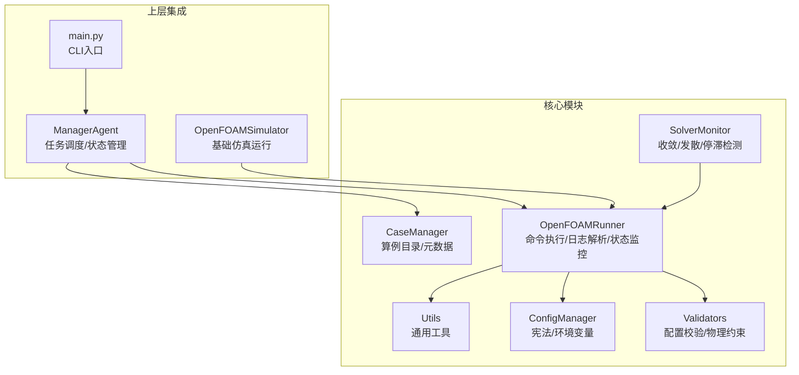
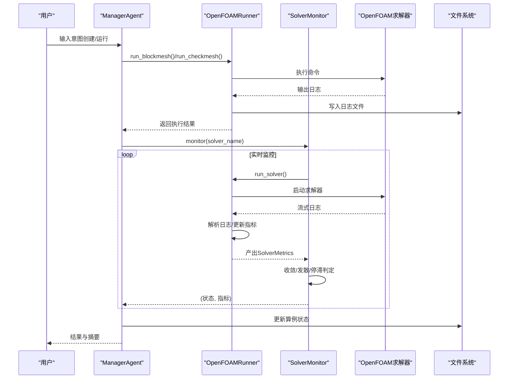
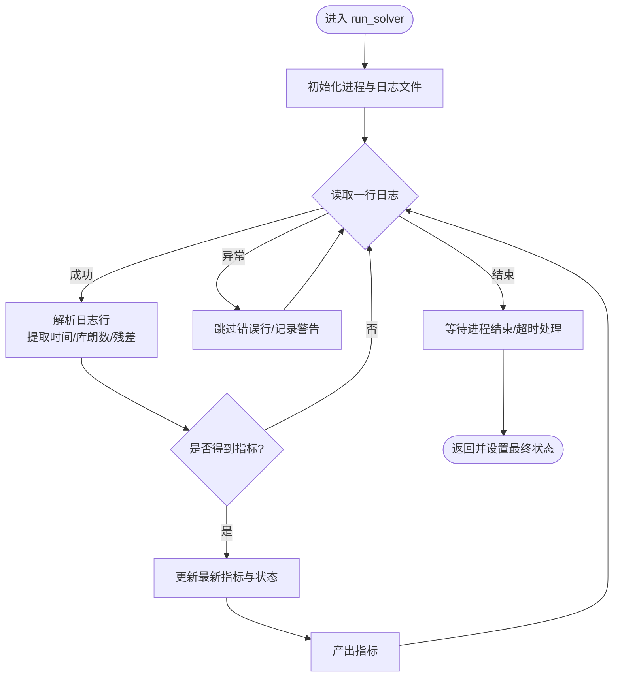
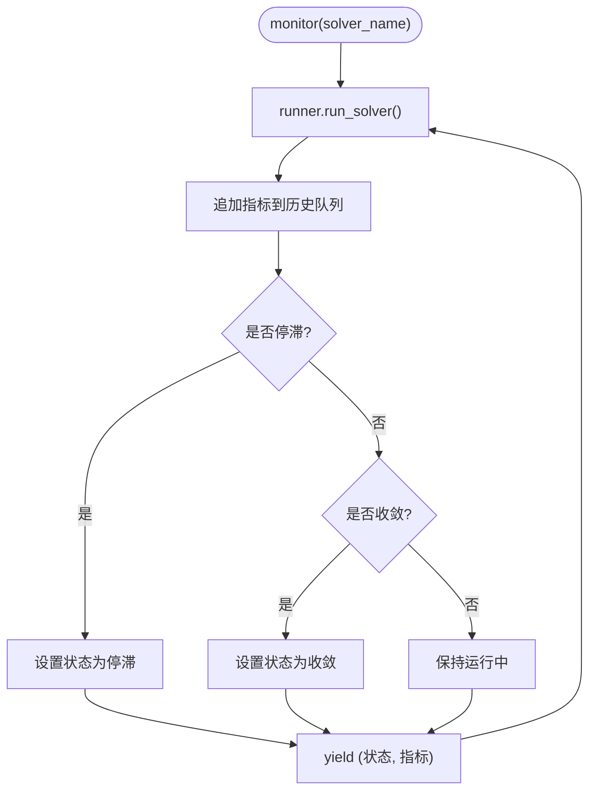
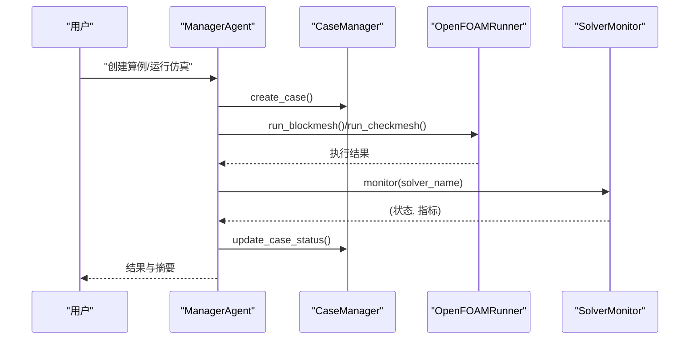
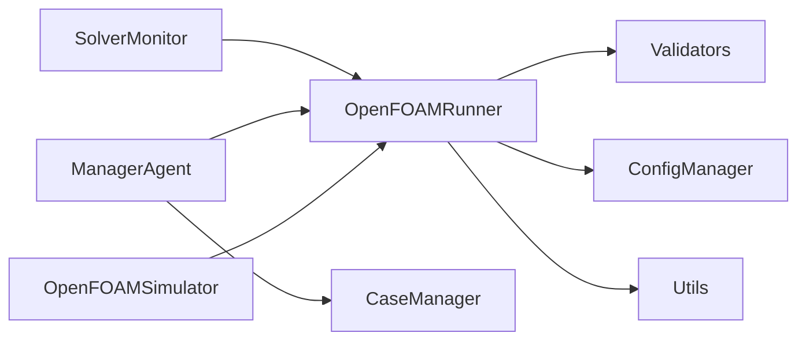

# OpenFOAM运行器模块

<cite>
**本文引用的文件**
- [openfoam_runner.py](file://openfoam_ai/core/openfoam_runner.py)
- [manager_agent.py](file://openfoam_ai/agents/manager_agent.py)
- [case_manager.py](file://openfoam_ai/core/case_manager.py)
- [of_simulator.py](file://openfoam_ai/utils/of_simulator.py)
- [utils.py](file://openfoam_ai/core/utils.py)
- [validators.py](file://openfoam_ai/core/validators.py)
- [system_constitution.yaml](file://openfoam_ai/config/system_constitution.yaml)
- [config_manager.py](file://openfoam_ai/core/config_manager.py)
- [main.py](file://openfoam_ai/main.py)
</cite>

## 目录
1. [简介](#简介)
2. [项目结构](#项目结构)
3. [核心组件](#核心组件)
4. [架构总览](#架构总览)
5. [详细组件分析](#详细组件分析)
6. [依赖关系分析](#依赖关系分析)
7. [性能考量](#性能考量)
8. [故障排查指南](#故障排查指南)
9. [结论](#结论)
10. [附录](#附录)

## 简介
本技术文档围绕OpenFOAMRunner运行器模块展开，系统阐述其在CFD求解器命令封装、进程管理与实时监控方面的实现原理。文档重点覆盖：
- OpenFOAMRunner的命令执行、日志解析、状态监控与异常处理
- SolverMonitor的监控策略、收敛性判断与发散检测机制
- 与ManagerAgent的协作关系与状态同步
- 与PyFoam的集成思路与系统命令封装
- 网格生成流程（blockMesh、checkMesh）、求解器选择策略与参数配置
- 性能监控、内存使用优化与长时间运行任务处理建议

## 项目结构
OpenFOAMRunner位于核心模块，负责与OpenFOAM命令交互、解析日志并驱动求解器生命周期；ManagerAgent协调任务与状态；CaseManager管理算例目录与元数据；Validators提供基于宪法的配置校验；ConfigManager集中管理宪法与环境变量；of_simulator提供基础仿真运行能力；utils提供通用工具。

图表来源
- [openfoam_runner.py:44-517](file://openfoam_ai/core/openfoam_runner.py#L44-L517)
- [manager_agent.py:38-338](file://openfoam_ai/agents/manager_agent.py#L38-L338)
- [case_manager.py:27-261](file://openfoam_ai/core/case_manager.py#L27-L261)
- [validators.py:13-155](file://openfoam_ai/core/validators.py#L13-L155)
- [config_manager.py:16-227](file://openfoam_ai/core/config_manager.py#L16-L227)
- [of_simulator.py:13-180](file://openfoam_ai/utils/of_simulator.py#L13-L180)
- [main.py:19-251](file://openfoam_ai/main.py#L19-L251)

章节来源
- [openfoam_runner.py:44-517](file://openfoam_ai/core/openfoam_runner.py#L44-L517)
- [manager_agent.py:38-338](file://openfoam_ai/agents/manager_agent.py#L38-L338)
- [case_manager.py:27-261](file://openfoam_ai/core/case_manager.py#L27-L261)
- [validators.py:13-155](file://openfoam_ai/core/validators.py#L13-L155)
- [config_manager.py:16-227](file://openfoam_ai/core/config_manager.py#L16-L227)
- [of_simulator.py:13-180](file://openfoam_ai/utils/of_simulator.py#L13-L180)
- [main.py:19-251](file://openfoam_ai/main.py#L19-L251)

## 核心组件
- OpenFOAMRunner：封装OpenFOAM命令执行、日志捕获与解析、状态判定与异常处理，支持blockMesh、checkMesh与求解器实时监控。
- SolverMonitor：基于历史指标进行收敛、发散与停滞检测，提供摘要与状态同步。
- ManagerAgent：与Runner协作，驱动创建与运行流程，维护会话状态与用户交互。
- CaseManager：管理算例目录结构、元数据与状态更新。
- Validators：基于system_constitution.yaml的硬约束校验，保障配置物理合理性。
- ConfigManager：集中加载与缓存宪法、读取环境变量，提供统一配置访问。
- OpenFOAMSimulator：基础仿真运行器，提供网格生成、求解器运行与日志解析能力（与Runner互补）。

章节来源
- [openfoam_runner.py:44-517](file://openfoam_ai/core/openfoam_runner.py#L44-L517)
- [manager_agent.py:38-338](file://openfoam_ai/agents/manager_agent.py#L38-L338)
- [case_manager.py:27-261](file://openfoam_ai/core/case_manager.py#L27-L261)
- [validators.py:13-155](file://openfoam_ai/core/validators.py#L13-L155)
- [config_manager.py:16-227](file://openfoam_ai/core/config_manager.py#L16-L227)
- [of_simulator.py:13-180](file://openfoam_ai/utils/of_simulator.py#L13-L180)

## 架构总览
OpenFOAMRunner采用“命令执行-日志解析-状态判定-异常处理”的流水线设计，结合SolverMonitor进行历史窗口分析，形成闭环的监控与反馈机制。ManagerAgent作为编排者，协调Runner与CaseManager完成端到端工作流。

图表来源
- [manager_agent.py:268-338](file://openfoam_ai/agents/manager_agent.py#L268-L338)
- [openfoam_runner.py:99-198](file://openfoam_ai/core/openfoam_runner.py#L99-L198)
- [openfoam_runner.py:429-517](file://openfoam_ai/core/openfoam_runner.py#L429-L517)

## 详细组件分析

### OpenFOAMRunner：命令封装、日志解析与状态监控
- 命令执行
  - run_blockmesh：执行blockMesh并记录日志。
  - run_checkmesh：执行checkMesh并解析网格质量指标。
  - run_solver：启动求解器，逐行捕获标准输出，实时解析日志并产出SolverMetrics。
- 日志解析
  - 解析时间步、库朗数（mean/max）与残差（Solving for ...）。
  - 通过正则表达式提取关键指标，构造SolverMetrics对象。
- 状态监控
  - _check_state：基于库朗数上限与残差阈值判定发散；默认运行中。
  - clean_case：清理时间步与并行目录，保留网格与配置。
- 异常处理
  - 对命令未找到、权限不足、Unicode解码错误、日志写入异常等进行捕获与降级处理。
  - 进程等待与超时处理，必要时强制终止并记录状态。

图表来源
- [openfoam_runner.py:99-198](file://openfoam_ai/core/openfoam_runner.py#L99-L198)
- [openfoam_runner.py:347-387](file://openfoam_ai/core/openfoam_runner.py#L347-L387)
- [openfoam_runner.py:389-408](file://openfoam_ai/core/openfoam_runner.py#L389-L408)

章节来源
- [openfoam_runner.py:77-198](file://openfoam_ai/core/openfoam_runner.py#L77-L198)
- [openfoam_runner.py:303-387](file://openfoam_ai/core/openfoam_runner.py#L303-L387)
- [openfoam_runner.py:389-408](file://openfoam_ai/core/openfoam_runner.py#L389-L408)
- [openfoam_runner.py:410-427](file://openfoam_ai/core/openfoam_runner.py#L410-L427)

### SolverMonitor：收敛性判断与发散检测
- 历史窗口管理：维护固定长度的历史指标队列，滚动丢弃过旧数据。
- 收敛判断：当所有变量残差均低于目标阈值且存在残差时视为收敛。
- 发散检测：基于连续发散容忍次数与阈值触发发散状态。
- 停滞检测：检查最近若干步残差波动幅度，若长期无显著下降则判定停滞。
- 摘要输出：提供最终时间、库朗数、残差与总步数等摘要信息。

图表来源
- [openfoam_runner.py:446-469](file://openfoam_ai/core/openfoam_runner.py#L446-L469)
- [openfoam_runner.py:471-501](file://openfoam_ai/core/openfoam_runner.py#L471-L501)

章节来源
- [openfoam_runner.py:429-517](file://openfoam_ai/core/openfoam_runner.py#L429-L517)

### 与ManagerAgent的协作与状态同步
- 创建流程：ManagerAgent生成计划、调用CaseManager创建目录、调用Runner执行blockMesh/checkMesh，并更新算例状态。
- 运行流程：ManagerAgent创建Runner与Monitor，循环监控并输出日志，最终汇总结果并更新状态。
- 用户交互：支持确认机制、帮助提示与状态查询。

图表来源
- [manager_agent.py:207-338](file://openfoam_ai/agents/manager_agent.py#L207-L338)
- [case_manager.py:51-86](file://openfoam_ai/core/case_manager.py#L51-L86)
- [openfoam_runner.py:77-97](file://openfoam_ai/core/openfoam_runner.py#L77-L97)

章节来源
- [manager_agent.py:176-338](file://openfoam_ai/agents/manager_agent.py#L176-L338)
- [case_manager.py:51-241](file://openfoam_ai/core/case_manager.py#L51-L241)

### 与PyFoam的集成思路
- PyFoam优势：提供更高层的Python接口，便于脚本化与自动化；支持更丰富的后处理与可视化。
- 集成建议：
  - 在Runner外部使用PyFoam进行网格后处理、结果可视化与统计分析。
  - Runner专注于命令执行与实时监控，PyFoam负责结果读取与二次开发。
  - 通过统一的日志与结果文件格式实现数据互通。

[本节为概念性说明，不直接映射具体源码文件]

### 系统命令封装与跨平台兼容性
- 命令封装：统一使用subprocess调用OpenFOAM命令，捕获标准输出与错误，写入日志文件。
- 跨平台考虑：
  - PATH环境变量与命令可用性检测（main.py中对blockMesh进行检测）。
  - 文本编码与换行符处理（text=True, universal_newlines=True）。
  - 日志写入与文件权限处理（UTF-8编码、异常捕获）。
- 并行与资源：ConfigManager提供并行核心数与内存限制等性能配置项，Runner内部未直接使用，可在上层策略中结合。

章节来源
- [openfoam_runner.py:118-126](file://openfoam_ai/core/openfoam_runner.py#L118-L126)
- [openfoam_runner.py:264-290](file://openfoam_ai/core/openfoam_runner.py#L264-L290)
- [main.py:230-238](file://openfoam_ai/main.py#L230-L238)
- [config_manager.py:74-83](file://openfoam_ai/core/config_manager.py#L74-L83)

### 网格生成流程与求解器选择策略
- 网格生成：blockMesh生成网格，checkMesh进行质量检查，解析失败数、非正交性、偏斜度与长宽比等指标。
- 求解器选择：从配置中读取solver名称（如icoFoam），Runner启动对应求解器；ManagerAgent在运行阶段动态选择并监控。
- 参数配置：通过system_constitution.yaml与Validators进行约束校验，确保网格、时间步长、库朗数与物理参数合理。

章节来源
- [openfoam_runner.py:77-97](file://openfoam_ai/core/openfoam_runner.py#L77-L97)
- [openfoam_runner.py:303-345](file://openfoam_ai/core/openfoam_runner.py#L303-L345)
- [validators.py:90-155](file://openfoam_ai/core/validators.py#L90-L155)
- [system_constitution.yaml:13-31](file://openfoam_ai/config/system_constitution.yaml#L13-L31)

### 性能监控、内存优化与长时间运行任务
- 性能监控：通过SolverMetrics中的时间步、库朗数与残差进行实时评估；SolverMonitor提供收敛/发散/停滞判定。
- 内存优化：历史队列长度限制（默认100步），避免无限增长；日志文件按需写入并flush。
- 长时间运行：进程等待与超时处理；支持Ctrl+C中断；日志文件持久化便于事后分析。

章节来源
- [openfoam_runner.py:437-438](file://openfoam_ai/core/openfoam_runner.py#L437-L438)
- [openfoam_runner.py:179-187](file://openfoam_ai/core/openfoam_runner.py#L179-L187)
- [openfoam_runner.py:147-156](file://openfoam_ai/core/openfoam_runner.py#L147-L156)

## 依赖关系分析
- Runner依赖Validators提供的宪法阈值（库朗数、残差、发散阈值）与ConfigManager的配置加载。
- ManagerAgent依赖Runner与CaseManager，协调任务与状态。
- of_simulator提供基础仿真运行能力，与Runner互补。

图表来源
- [openfoam_runner.py](file://openfoam_ai/core/openfoam_runner.py#L13)
- [validators.py:13-15](file://openfoam_ai/core/validators.py#L13-L15)
- [config_manager.py:94-119](file://openfoam_ai/core/config_manager.py#L94-L119)
- [manager_agent.py](file://openfoam_ai/agents/manager_agent.py#L16)
- [case_manager.py:27-261](file://openfoam_ai/core/case_manager.py#L27-L261)
- [of_simulator.py:13-180](file://openfoam_ai/utils/of_simulator.py#L13-L180)

章节来源
- [openfoam_runner.py:13-13](file://openfoam_ai/core/openfoam_runner.py#L13-L13)
- [validators.py:13-15](file://openfoam_ai/core/validators.py#L13-L15)
- [config_manager.py:94-119](file://openfoam_ai/core/config_manager.py#L94-L119)
- [manager_agent.py](file://openfoam_ai/agents/manager_agent.py#L16)
- [case_manager.py:27-261](file://openfoam_ai/core/case_manager.py#L27-L261)
- [of_simulator.py:13-180](file://openfoam_ai/utils/of_simulator.py#L13-L180)

## 性能考量
- I/O开销：日志逐行写入，建议在高频率输出场景下适当批量flush或降低输出频率。
- 内存占用：历史队列长度可控，默认100步；可按任务规模调整。
- CPU与并行：Runner本身为串行命令执行；并行能力由OpenFOAM求解器与环境决定，可通过ConfigManager的并行配置项在上层策略中参考。

[本节提供一般性指导，不直接分析具体文件]

## 故障排查指南
- 命令未找到：检查OpenFOAM安装与PATH设置；Runner捕获FileNotFoundError并标记ERROR状态。
- 权限不足：Runner捕获PermissionError并标记ERROR状态。
- 日志解码错误：捕获UnicodeDecodeError并跳过该行，继续处理。
- 进程未结束：超时后强制终止并记录状态。
- 网格质量不佳：checkMesh失败或质量指标异常，建议调整网格或边界条件。
- 发散/停滞：SolverMonitor检测到发散或停滞，建议调整时间步长、松弛因子或加密网格。

章节来源
- [openfoam_runner.py:127-142](file://openfoam_ai/core/openfoam_runner.py#L127-L142)
- [openfoam_runner.py:169-174](file://openfoam_ai/core/openfoam_runner.py#L169-L174)
- [openfoam_runner.py:180-187](file://openfoam_ai/core/openfoam_runner.py#L180-L187)
- [openfoam_runner.py:303-345](file://openfoam_ai/core/openfoam_runner.py#L303-L345)
- [openfoam_runner.py:471-487](file://openfoam_ai/core/openfoam_runner.py#L471-L487)

## 结论
OpenFOAMRunner通过清晰的命令封装、稳健的日志解析与完善的异常处理，实现了对OpenFOAM求解器的可靠执行与实时监控。配合SolverMonitor的收敛/发散/停滞检测与ManagerAgent的任务编排，形成了从创建到运行再到状态同步的完整工作流。结合Validators与ConfigManager的宪法约束，确保配置的物理合理性与工程实践规范。对于PyFoam的集成，建议在Runner之外进行高层封装与后处理，以发挥各自优势。

[本节为总结性内容，不直接分析具体文件]

## 附录

### 代码示例路径（不含具体代码内容）
- 启动求解器并实时监控
  - [run_solver:99-198](file://openfoam_ai/core/openfoam_runner.py#L99-L198)
  - [monitor:446-469](file://openfoam_ai/core/openfoam_runner.py#L446-L469)
- 获取运行指标与状态
  - [get_summary:503-516](file://openfoam_ai/core/openfoam_runner.py#L503-L516)
- 网格生成与质量检查
  - [run_blockmesh:77-85](file://openfoam_ai/core/openfoam_runner.py#L77-L85)
  - [run_checkmesh:87-97](file://openfoam_ai/core/openfoam_runner.py#L87-L97)
  - [_parse_checkmesh_log:303-345](file://openfoam_ai/core/openfoam_runner.py#L303-L345)
- 与ManagerAgent协作
  - [execute_run:268-338](file://openfoam_ai/agents/manager_agent.py#L268-L338)
  - [update_case_status:223-241](file://openfoam_ai/core/case_manager.py#L223-L241)
- 与PyFoam集成思路
  - [OpenFOAMSimulator:13-180](file://openfoam_ai/utils/of_simulator.py#L13-L180)
- 配置与约束
  - [load_constitution:13-15](file://openfoam_ai/core/validators.py#L13-L15)
  - [system_constitution.yaml:13-31](file://openfoam_ai/config/system_constitution.yaml#L13-L31)
  - [ConfigManager:94-227](file://openfoam_ai/core/config_manager.py#L94-L227)