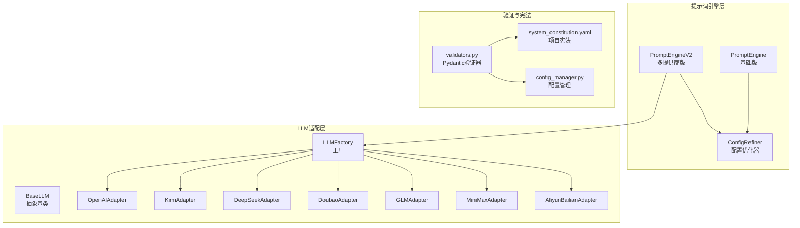
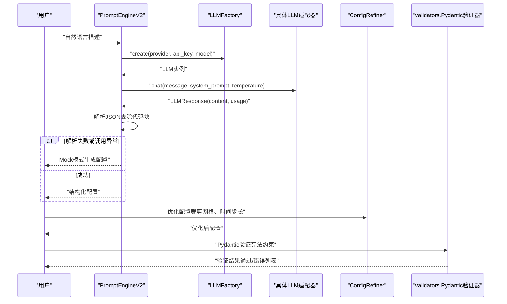
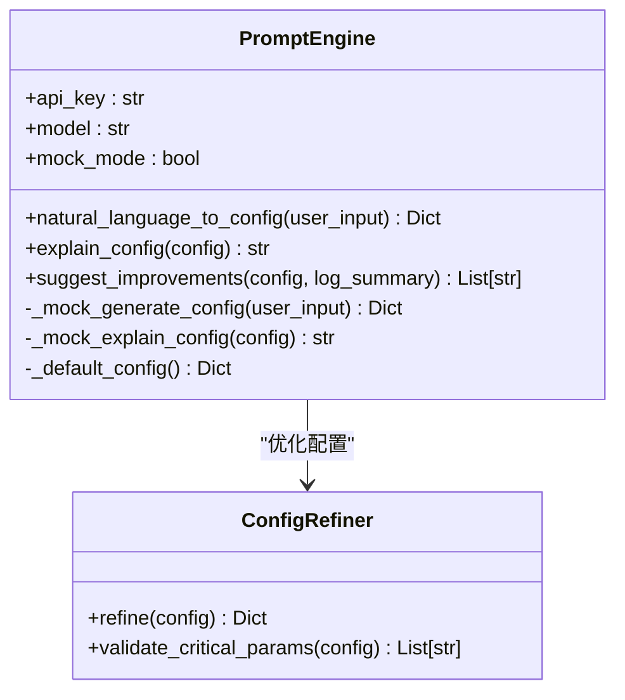
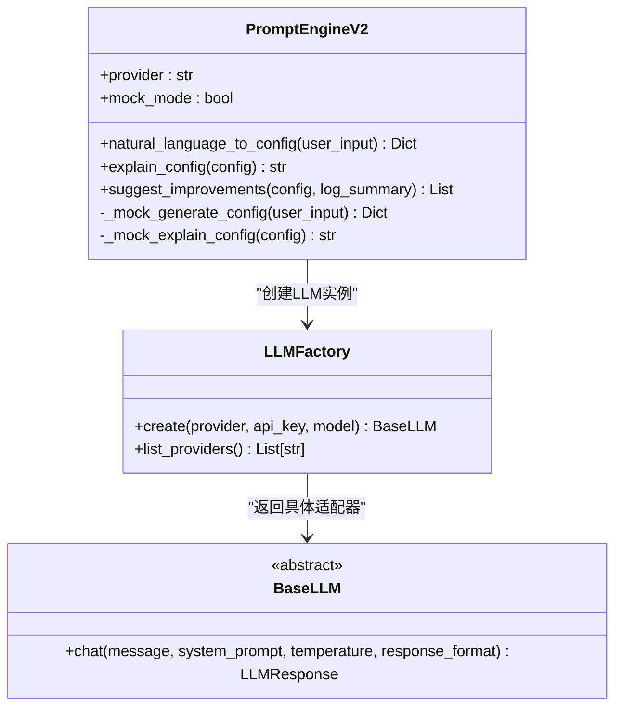
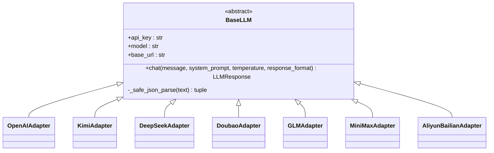
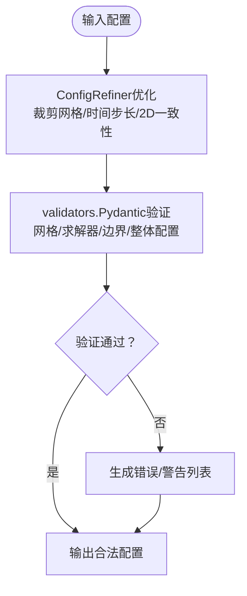
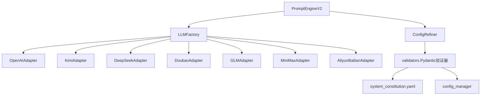

# 提示词引擎模块

<cite>
**本文引用的文件**
- [prompt_engine.py](file://openfoam_ai/agents/prompt_engine.py)
- [prompt_engine_v2.py](file://openfoam_ai/agents/prompt_engine_v2.py)
- [llm_adapter.py](file://openfoam_ai/core/llm_adapter.py)
- [validators.py](file://openfoam_ai/core/validators.py)
- [system_constitution.yaml](file://openfoam_ai/config/system_constitution.yaml)
- [config_manager.py](file://openfoam_ai/core/config_manager.py)
- [README.md](file://openfoam_ai/README.md)
</cite>

## 目录
1. [简介](#简介)
2. [项目结构](#项目结构)
3. [核心组件](#核心组件)
4. [架构总览](#架构总览)
5. [详细组件分析](#详细组件分析)
6. [依赖关系分析](#依赖关系分析)
7. [性能考虑](#性能考虑)
8. [故障排除指南](#故障排除指南)
9. [结论](#结论)
10. [附录](#附录)

## 简介
本文件面向“提示词引擎模块”的技术文档，聚焦以下目标：
- LLM集成策略与多提供商适配
- 自然语言到CFD配置的转换机制
- 提示词工程设计与配置优化算法
- PromptEngine与ConfigRefiner的设计原理（模板系统、上下文管理、错误恢复、Mock模式）
- 支持的LLM提供商、API封装、响应解析与配置验证流程
- 与项目宪法的集成、约束规则应用与合法性检查
- 性能调优、成本控制与故障排除

该模块提供两类提示词引擎：
- PromptEngine（基础版）：内置系统提示词模板，支持Mock模式与基础JSON输出
- PromptEngineV2（进阶版）：通过LLM适配器工厂统一接入多家LLM，具备更强的错误恢复与响应解析能力

## 项目结构
提示词引擎模块位于openfoam_ai/agents目录，核心文件如下：
- agents/prompt_engine.py：基础提示词引擎与配置优化器
- agents/prompt_engine_v2.py：多LLM提供商接入版本
- core/llm_adapter.py：LLM适配器工厂与各提供商SDK封装
- core/validators.py：基于Pydantic的物理约束验证器
- config/system_constitution.yaml：项目宪法（硬性约束）
- core/config_manager.py：宪法加载与配置管理
- README.md：模块使用说明与API参考

**图表来源**
- [prompt_engine.py:20-616](file://openfoam_ai/agents/prompt_engine.py#L20-L616)
- [prompt_engine_v2.py:24-541](file://openfoam_ai/agents/prompt_engine_v2.py#L24-L541)
- [llm_adapter.py:39-671](file://openfoam_ai/core/llm_adapter.py#L39-L671)
- [validators.py:179-441](file://openfoam_ai/core/validators.py#L179-L441)
- [system_constitution.yaml:1-103](file://openfoam_ai/config/system_constitution.yaml#L1-L103)
- [config_manager.py:16-227](file://openfoam_ai/core/config_manager.py#L16-L227)

**章节来源**
- [README.md:104-150](file://openfoam_ai/README.md#L104-L150)

## 核心组件
- PromptEngine（基础版）
  - 系统提示词模板：明确物理类型、求解器、输出JSON结构与约束条件
  - 自然语言转配置：调用LLM生成JSON，失败回退到默认配置
  - 配置解释与改进建议：基于LLM生成解释与建议
  - Mock模式：关键词匹配生成符合宪法的配置
- PromptEngineV2（多提供商版）
  - 通过LLMFactory统一创建不同提供商实例
  - 响应解析增强：自动剥离Markdown代码块中的JSON
  - 错误恢复：LLM调用失败自动降级到Mock模式
- ConfigRefiner（配置优化器）
  - 网格分辨率裁剪、2D/3D一致性调整
  - 时间步长与计算步数优化
  - 关键参数合法性校验（求解器-物理类型匹配、网格数量、计算步数）
- LLM适配器（多提供商）
  - BaseLLM抽象、各提供商Adapter实现
  - 统一chat接口、响应封装（LLMResponse）
- Pydantic验证器（宪法落地）
  - MeshConfig/SolverConfig/BoundaryCondition/SimulationConfig
  - 与system_constitution.yaml联动，执行硬约束与软警告

**章节来源**
- [prompt_engine.py:20-616](file://openfoam_ai/agents/prompt_engine.py#L20-L616)
- [prompt_engine_v2.py:24-541](file://openfoam_ai/agents/prompt_engine_v2.py#L24-L541)
- [llm_adapter.py:39-671](file://openfoam_ai/core/llm_adapter.py#L39-L671)
- [validators.py:179-441](file://openfoam_ai/core/validators.py#L179-L441)
- [system_constitution.yaml:1-103](file://openfoam_ai/config/system_constitution.yaml#L1-L103)
- [config_manager.py:94-135](file://openfoam_ai/core/config_manager.py#L94-L135)

## 架构总览
提示词引擎的端到端工作流如下：

**图表来源**
- [prompt_engine_v2.py:112-161](file://openfoam_ai/agents/prompt_engine_v2.py#L112-L161)
- [llm_adapter.py:594-671](file://openfoam_ai/core/llm_adapter.py#L594-L671)
- [validators.py:389-411](file://openfoam_ai/core/validators.py#L389-L411)

## 详细组件分析

### PromptEngine（基础版）
- 设计要点
  - 系统提示词模板固定，强调JSON结构与宪法约束
  - Mock模式通过关键词匹配生成典型场景配置，并满足宪法最小网格要求
  - 错误处理：API异常时返回默认配置，保障可用性
- 关键方法
  - natural_language_to_config：生成配置
  - explain_config：解释配置
  - suggest_improvements：基于日志给出改进建议
  - _mock_generate_config/_mock_explain_config：Mock模式实现
- 配置优化
  - ConfigRefiner对网格分辨率、时间步长、2D/3D一致性进行优化
  - validate_critical_params提供关键参数警告（网格数、求解器匹配、计算步数）

**图表来源**
- [prompt_engine.py:20-616](file://openfoam_ai/agents/prompt_engine.py#L20-L616)

**章节来源**
- [prompt_engine.py:92-126](file://openfoam_ai/agents/prompt_engine.py#L92-L126)
- [prompt_engine.py:127-216](file://openfoam_ai/agents/prompt_engine.py#L127-L216)
- [prompt_engine.py:217-474](file://openfoam_ai/agents/prompt_engine.py#L217-L474)
- [prompt_engine.py:485-571](file://openfoam_ai/agents/prompt_engine.py#L485-L571)

### PromptEngineV2（多提供商版）
- 设计要点
  - 通过LLMFactory统一创建不同提供商实例（OpenAI、Kimi、DeepSeek、豆包、GLM、MiniMax、阿里云百炼）
  - 统一chat接口，屏蔽SDK差异；响应解析增强，自动剥离代码块中的JSON
  - 错误恢复：LLM调用失败自动降级到Mock模式
- 关键方法
  - natural_language_to_config：统一生成配置流程
  - explain_config/suggest_improvements：LLM解释与建议
  - _mock_generate_config/_mock_explain_config：Mock模式实现
- 提示词工程
  - 固定系统提示词模板，强调JSON结构与宪法约束
  - 温度参数控制输出确定性（生成配置时较低，解释时较高）

**图表来源**
- [prompt_engine_v2.py:24-111](file://openfoam_ai/agents/prompt_engine_v2.py#L24-L111)
- [prompt_engine_v2.py:112-161](file://openfoam_ai/agents/prompt_engine_v2.py#L112-L161)
- [llm_adapter.py:577-634](file://openfoam_ai/core/llm_adapter.py#L577-L634)
- [llm_adapter.py:39-51](file://openfoam_ai/core/llm_adapter.py#L39-L51)

**章节来源**
- [prompt_engine_v2.py:84-111](file://openfoam_ai/agents/prompt_engine_v2.py#L84-L111)
- [prompt_engine_v2.py:112-161](file://openfoam_ai/agents/prompt_engine_v2.py#L112-L161)
- [prompt_engine_v2.py:162-238](file://openfoam_ai/agents/prompt_engine_v2.py#L162-L238)
- [prompt_engine_v2.py:239-438](file://openfoam_ai/agents/prompt_engine_v2.py#L239-L438)

### LLM适配器（多提供商）
- 设计要点
  - BaseLLM定义统一接口；各提供商Adapter实现chat方法
  - LLMResponse封装content、usage、success、error
  - LLMFactory提供create/list_providers，支持环境变量读取API Key
- 支持提供商
  - OpenAI、Kimi（Moonshot）、DeepSeek、豆包（Aliyun DashScope）、GLM（Zhipu）、MiniMax、阿里云百炼
- 错误处理
  - SDK可用时优先使用官方SDK；否则回退到requests模式
  - 统一返回LLMResponse，便于上层统一处理

**图表来源**
- [llm_adapter.py:39-51](file://openfoam_ai/core/llm_adapter.py#L39-L51)
- [llm_adapter.py:61-168](file://openfoam_ai/core/llm_adapter.py#L61-L168)
- [llm_adapter.py:170-238](file://openfoam_ai/core/llm_adapter.py#L170-L238)
- [llm_adapter.py:240-299](file://openfoam_ai/core/llm_adapter.py#L240-L299)
- [llm_adapter.py:301-368](file://openfoam_ai/core/llm_adapter.py#L301-L368)
- [llm_adapter.py:370-435](file://openfoam_ai/core/llm_adapter.py#L370-L435)
- [llm_adapter.py:437-502](file://openfoam_ai/core/llm_adapter.py#L437-L502)
- [llm_adapter.py:504-575](file://openfoam_ai/core/llm_adapter.py#L504-L575)

**章节来源**
- [llm_adapter.py:29-37](file://openfoam_ai/core/llm_adapter.py#L29-L37)
- [llm_adapter.py:594-671](file://openfoam_ai/core/llm_adapter.py#L594-L671)

### 配置优化与验证（ConfigRefiner + validators）
- ConfigRefiner
  - 确保task_id存在，裁剪网格分辨率到[10,1000]，2D问题强制nz=1
  - 限制最大计算步数，避免过长运行时间
  - 关键参数校验：求解器-物理类型匹配、网格数量、计算步数
- Pydantic验证器
  - MeshConfig：网格分辨率、长宽比、总网格数与宪法标准对比
  - SolverConfig：求解器名称、时间范围、时间步长、CFL条件
  - BoundaryCondition：边界类型与值的合理性
  - SimulationConfig：整体配置的物理组合合法性、禁止组合、物性范围
  - PhysicsValidator：后处理阶段的质量/能量守恒与边界兼容性检查

**图表来源**
- [prompt_engine.py:485-571](file://openfoam_ai/agents/prompt_engine.py#L485-L571)
- [validators.py:179-275](file://openfoam_ai/core/validators.py#L179-L275)
- [validators.py:277-387](file://openfoam_ai/core/validators.py#L277-L387)

**章节来源**
- [prompt_engine.py:485-571](file://openfoam_ai/agents/prompt_engine.py#L485-L571)
- [validators.py:18-88](file://openfoam_ai/core/validators.py#L18-L88)
- [validators.py:90-156](file://openfoam_ai/core/validators.py#L90-L156)
- [validators.py:158-177](file://openfoam_ai/core/validators.py#L158-L177)
- [validators.py:179-275](file://openfoam_ai/core/validators.py#L179-L275)
- [validators.py:277-387](file://openfoam_ai/core/validators.py#L277-L387)

## 依赖关系分析
- PromptEngineV2依赖LLMFactory与具体LLM适配器
- LLMFactory依赖各提供商SDK或requests
- validators依赖system_constitution.yaml与config_manager加载的宪法
- ConfigRefiner与validators共同作用于生成配置的合法性与稳定性

**图表来源**
- [prompt_engine_v2.py:16-22](file://openfoam_ai/agents/prompt_engine_v2.py#L16-L22)
- [llm_adapter.py:577-634](file://openfoam_ai/core/llm_adapter.py#L577-L634)
- [validators.py:13-16](file://openfoam_ai/core/validators.py#L13-L16)
- [config_manager.py:94-135](file://openfoam_ai/core/config_manager.py#L94-L135)

**章节来源**
- [prompt_engine_v2.py:16-22](file://openfoam_ai/agents/prompt_engine_v2.py#L16-L22)
- [llm_adapter.py:577-634](file://openfoam_ai/core/llm_adapter.py#L577-L634)
- [validators.py:13-16](file://openfoam_ai/core/validators.py#L13-L16)
- [config_manager.py:94-135](file://openfoam_ai/core/config_manager.py#L94-L135)

## 性能考虑
- 输出确定性与成本控制
  - 生成配置时使用较低温度，减少LLM输出多样性，提高JSON可解析性与稳定性
  - PromptEngineV2在Mock模式下完全离线，零API调用成本
- 时间步长与计算步数
  - ConfigRefiner限制最大计算步数，避免超长运行
  - validators对CFL条件进行估计性检查，建议使用更小时间步或隐式格式
- 网格分辨率与长宽比
  - MeshConfig对网格长宽比与总网格数进行约束，避免低质量网格导致的收敛困难与计算耗时
- 并发与资源
  - config_manager提供性能相关默认设置（如最大并行线程、内存限制、超时），可在环境变量中覆盖

**章节来源**
- [prompt_engine_v2.py:126-130](file://openfoam_ai/agents/prompt_engine_v2.py#L126-L130)
- [prompt_engine.py:524-529](file://openfoam_ai/agents/prompt_engine.py#L524-L529)
- [validators.py:51-87](file://openfoam_ai/core/validators.py#L51-L87)
- [validators.py:120-155](file://openfoam_ai/core/validators.py#L120-L155)
- [config_manager.py:51-72](file://openfoam_ai/core/config_manager.py#L51-L72)

## 故障排除指南
- ModuleNotFoundError: No module named 'openai'
  - 现象：导入openai失败，进入Mock模式
  - 处理：安装openai或使用PromptEngine(api_key=None)显式启用Mock
- API Key未设置或无效
  - 现象：LLMFactory创建失败，自动降级到Mock模式
  - 处理：设置对应环境变量（如OPENAI_API_KEY、KIMI_API_KEY等）或传入api_key
- JSON解析失败
  - 现象：LLM返回Markdown代码块包裹的JSON
  - 处理：PromptEngineV2自动剥离代码块；若仍失败，降级到Mock模式
- 配置验证失败（Pydantic）
  - 现象：validators抛出异常，返回错误列表
  - 处理：根据错误提示调整网格、求解器、边界条件或物性参数
- Windows控制台编码问题
  - 现象：UnicodeEncodeError
  - 处理：设置环境变量PYTHONIOENCODING=utf-8

**章节来源**
- [prompt_engine.py:12-18](file://openfoam_ai/agents/prompt_engine.py#L12-L18)
- [prompt_engine_v2.py:104-110](file://openfoam_ai/agents/prompt_engine_v2.py#L104-L110)
- [prompt_engine_v2.py:153-160](file://openfoam_ai/agents/prompt_engine_v2.py#L153-L160)
- [validators.py:406-410](file://openfoam_ai/core/validators.py#L406-L410)
- [README.md:216-231](file://openfoam_ai/README.md#L216-L231)

## 结论
提示词引擎模块通过PromptEngine与PromptEngineV2实现了从自然语言到CFD配置的稳健转换，并通过LLM适配器工厂与多提供商集成增强了可用性与鲁棒性。结合ConfigRefiner与validators的双重保障，系统在Mock模式与真实LLM模式下均能生成符合项目宪法的高质量配置，为后续OpenFOAM求解与后处理奠定坚实基础。

## 附录

### 使用示例（路径指引）
- 基础版PromptEngine
  - [prompt_engine.py:573-616](file://openfoam_ai/agents/prompt_engine.py#L573-L616)
- 多提供商PromptEngineV2
  - [prompt_engine_v2.py:510-541](file://openfoam_ai/agents/prompt_engine_v2.py#L510-L541)
- LLM适配器工厂
  - [llm_adapter.py:594-671](file://openfoam_ai/core/llm_adapter.py#L594-L671)
- 验证器与宪法
  - [validators.py:389-411](file://openfoam_ai/core/validators.py#L389-L411)
  - [system_constitution.yaml:1-103](file://openfoam_ai/config/system_constitution.yaml#L1-L103)
  - [config_manager.py:94-135](file://openfoam_ai/core/config_manager.py#L94-L135)