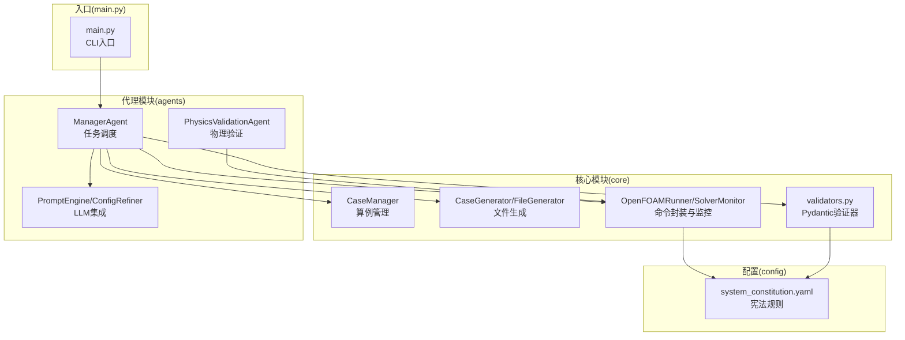
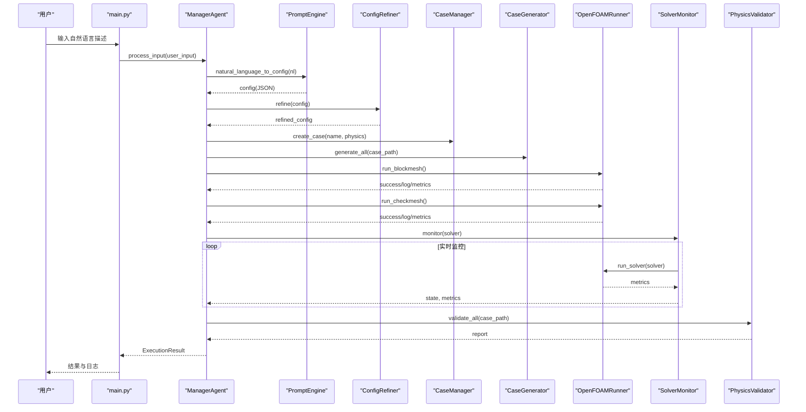
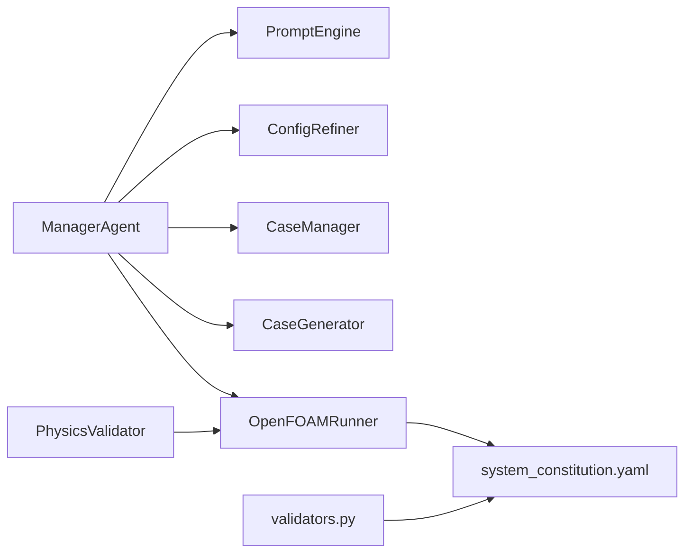

# 核心模块

<cite>
**本文引用的文件**
- [openfoam_ai/core/case_manager.py](file://openfoam_ai/core/case_manager.py)
- [openfoam_ai/agents/manager_agent.py](file://openfoam_ai/agents/manager_agent.py)
- [openfoam_ai/agents/prompt_engine.py](file://openfoam_ai/agents/prompt_engine.py)
- [openfoam_ai/core/openfoam_runner.py](file://openfoam_ai/core/openfoam_runner.py)
- [openfoam_ai/agents/physics_validation_agent.py](file://openfoam_ai/agents/physics_validation_agent.py)
- [openfoam_ai/core/validators.py](file://openfoam_ai/core/validators.py)
- [openfoam_ai/core/file_generator.py](file://openfoam_ai/core/file_generator.py)
- [openfoam_ai/config/system_constitution.yaml](file://openfoam_ai/config/system_constitution.yaml)
- [openfoam_ai/main.py](file://openfoam_ai/main.py)
</cite>

## 目录
1. [简介](#简介)
2. [项目结构](#项目结构)
3. [核心组件](#核心组件)
4. [架构总览](#架构总览)
5. [详细组件分析](#详细组件分析)
6. [依赖关系分析](#依赖关系分析)
7. [性能考虑](#性能考虑)
8. [故障排查指南](#故障排查指南)
9. [结论](#结论)
10. [附录](#附录)

## 简介
本文件面向OpenFOAM AI的核心模块，系统性阐述以下五个模块的设计与实现：
- ManagerAgent：任务调度与交互中枢，协调LLM、配置优化、算例生成与执行。
- PromptEngine：LLM集成策略，将自然语言转为结构化配置，并提供解释与改进建议。
- CaseManager：算例生命周期管理，负责创建、复制、清理、状态更新与信息持久化。
- OpenFOAMRunner：命令封装与监控，统一执行OpenFOAM工具链与求解器，解析日志并判定状态。
- PhysicsValidator：后处理阶段的物理一致性验证，涵盖质量守恒、能量守恒、收敛性等。

文档同时给出模块间依赖关系、协作流程、接口规范、配置选项与参数说明，并提供性能与最佳实践建议，兼顾初学者与高级开发者的理解需求。

## 项目结构
OpenFOAM AI采用“核心模块 + 代理模块 + 配置与工具”的分层组织：
- 核心模块（core）：算例管理、文件生成、命令执行、验证器、通用工具。
- 代理模块（agents）：ManagerAgent、PromptEngine、PhysicsValidationAgent等。
- 配置（config）：系统宪法（约束规则）、系统常量。
- 工具与UI（ui/utils）：可视化、动画、结果展示等。
- 示例与入口（main.py、examples）：交互CLI、演示脚本。

图表来源
- [openfoam_ai/core/case_manager.py:27-261](file://openfoam_ai/core/case_manager.py#L27-L261)
- [openfoam_ai/core/file_generator.py:506-603](file://openfoam_ai/core/file_generator.py#L506-L603)
- [openfoam_ai/core/openfoam_runner.py:44-516](file://openfoam_ai/core/openfoam_runner.py#L44-L516)
- [openfoam_ai/core/validators.py:13-264](file://openfoam_ai/core/validators.py#L13-L264)
- [openfoam_ai/agents/manager_agent.py:38-435](file://openfoam_ai/agents/manager_agent.py#L38-L435)
- [openfoam_ai/agents/prompt_engine.py:20-571](file://openfoam_ai/agents/prompt_engine.py#L20-L571)
- [openfoam_ai/agents/physics_validation_agent.py:174-478](file://openfoam_ai/agents/physics_validation_agent.py#L174-L478)
- [openfoam_ai/config/system_constitution.yaml:1-103](file://openfoam_ai/config/system_constitution.yaml#L1-L103)
- [openfoam_ai/main.py:19-246](file://openfoam_ai/main.py#L19-L246)

章节来源
- [openfoam_ai/main.py:19-246](file://openfoam_ai/main.py#L19-L246)

## 核心组件
本节概述五大核心模块的职责、关键接口与典型使用模式。

- ManagerAgent
  - 职责：意图识别、计划生成、执行计划、状态管理、与用户交互。
  - 关键接口：process_input、execute_plan、_generate_plan、_handle_*系列。
  - 使用模式：CLI交互、自动执行、确认机制。

- PromptEngine
  - 职责：系统提示词、JSON输出格式、Mock模式、解释与改进建议。
  - 关键接口：natural_language_to_config、explain_config、suggest_improvements。
  - 使用模式：LLM对接、本地优化(ConfigRefiner)、宪法约束。

- CaseManager
  - 职责：创建/复制/列出/清理/删除算例；维护算例信息(.case_info.json)。
  - 关键接口：create_case、copy_template、list_cases、cleanup、update_case_status。
  - 使用模式：标准化目录结构、模板复用、状态追踪。

- OpenFOAMRunner
  - 职责：封装blockMesh/checkMesh/求解器；实时日志解析；状态判定；清理。
  - 关键接口：run_blockmesh、run_checkmesh、run_solver、stop_solver、clean_case。
  - 使用模式：命令执行、监控迭代、阈值判定、异常处理。

- PhysicsValidator
  - 职责：后处理阶段物理一致性验证（质量/能量守恒、收敛性、边界兼容性等）。
  - 关键接口：validate_all、validate_mass_conservation、validate_energy_conservation、validate_convergence。
  - 使用模式：日志解析、残差提取、容差判断、报告生成。

章节来源
- [openfoam_ai/agents/manager_agent.py:38-435](file://openfoam_ai/agents/manager_agent.py#L38-L435)
- [openfoam_ai/agents/prompt_engine.py:20-571](file://openfoam_ai/agents/prompt_engine.py#L20-L571)
- [openfoam_ai/core/case_manager.py:27-261](file://openfoam_ai/core/case_manager.py#L27-L261)
- [openfoam_ai/core/openfoam_runner.py:44-516](file://openfoam_ai/core/openfoam_runner.py#L44-L516)
- [openfoam_ai/agents/physics_validation_agent.py:174-478](file://openfoam_ai/agents/physics_validation_agent.py#L174-L478)

## 架构总览
下图展示了从用户输入到算例执行与验证的端到端流程，以及模块间的依赖与协作。

图表来源
- [openfoam_ai/main.py:37-99](file://openfoam_ai/main.py#L37-L99)
- [openfoam_ai/agents/manager_agent.py:75-338](file://openfoam_ai/agents/manager_agent.py#L75-L338)
- [openfoam_ai/agents/prompt_engine.py:92-126](file://openfoam_ai/agents/prompt_engine.py#L92-L126)
- [openfoam_ai/core/case_manager.py:51-86](file://openfoam_ai/core/case_manager.py#L51-L86)
- [openfoam_ai/core/file_generator.py:515-532](file://openfoam_ai/core/file_generator.py#L515-L532)
- [openfoam_ai/core/openfoam_runner.py:77-198](file://openfoam_ai/core/openfoam_runner.py#L77-L198)
- [openfoam_ai/agents/physics_validation_agent.py:197-224](file://openfoam_ai/agents/physics_validation_agent.py#L197-L224)

## 详细组件分析

### ManagerAgent 任务调度机制
- 设计原理
  - 以“意图识别 + 计划生成 + 执行”为主线，结合配置验证与状态管理，形成闭环。
  - 通过可插拔的PromptEngine与ConfigRefiner，实现LLM与本地优化的协同。
- 实现细节
  - 意图识别：关键词匹配，覆盖创建、修改、运行、状态查询、帮助。
  - 计划生成：将配置映射为具体步骤（创建目录、生成文件、运行网格、检查网格）。
  - 执行流程：创建算例目录、生成文件、运行blockMesh、checkMesh，更新状态；运行求解器并监控，最终汇总结果。
  - 状态管理：current_case、current_config、execution_history；支持确认机制与自动修复开关。
- 接口规范
  - process_input(user_input) -> Dict
  - execute_plan(plan_type, confirmed) -> ExecutionResult
  - _generate_plan(task_type, config) -> TaskPlan
- 使用模式
  - CLI交互：输入自然语言，确认后执行；支持“开始计算”、“查看状态”等。
  - 自动执行：快速创建模式，直接生成并执行。
- 代码示例路径
  - [ManagerAgent.process_input:75-104](file://openfoam_ai/agents/manager_agent.py#L75-L104)
  - [ManagerAgent.execute_plan:176-205](file://openfoam_ai/agents/manager_agent.py#L176-L205)
  - [ManagerAgent._execute_create:207-266](file://openfoam_ai/agents/manager_agent.py#L207-L266)
  - [ManagerAgent._execute_run:268-338](file://openfoam_ai/agents/manager_agent.py#L268-L338)

章节来源
- [openfoam_ai/agents/manager_agent.py:38-435](file://openfoam_ai/agents/manager_agent.py#L38-L435)

### PromptEngine 的 LLM 集成策略
- 设计原理
  - 通过系统提示词模板约束输出格式与物理合理性；支持Mock模式以保障离线可用性。
  - 与ConfigRefiner配合，先由LLM生成JSON，再进行本地优化与警告提示。
- 实现细节
  - 系统提示词：明确可用物理类型、求解器、输出JSON结构与约束条件。
  - Mock模式：基于关键词匹配的场景库，自动生成符合宪法最小网格数的配置。
  - API集成：优先使用OpenAI客户端，失败回退默认配置；提供解释与改进建议接口。
- 接口规范
  - natural_language_to_config(user_input) -> Dict
  - explain_config(config) -> str
  - suggest_improvements(config, log_summary) -> List[str]
- 使用模式
  - 交互式：将自然语言描述转换为结构化配置。
  - 教育式：解释配置含义与宪法符合性检查。
  - 优化式：基于日志摘要提供改进建议。
- 代码示例路径
  - [PromptEngine.__init__:75-91](file://openfoam_ai/agents/prompt_engine.py#L75-L91)
  - [PromptEngine.natural_language_to_config:92-126](file://openfoam_ai/agents/prompt_engine.py#L92-L126)
  - [PromptEngine._mock_generate_config:217-373](file://openfoam_ai/agents/prompt_engine.py#L217-L373)
  - [ConfigRefiner.refine:485-532](file://openfoam_ai/agents/prompt_engine.py#L485-L532)

章节来源
- [openfoam_ai/agents/prompt_engine.py:20-571](file://openfoam_ai/agents/prompt_engine.py#L20-L571)

### CaseManager 的算例管理功能
- 设计原理
  - 统一管理OpenFOAM算例目录结构，提供创建、复制、清理、删除、状态更新与信息持久化。
  - 通过标准目录（0、constant、system、logs）与“.case_info.json”实现可追溯的生命周期管理。
- 实现细节
  - 创建：删除同名目录、创建标准目录、写入算例信息。
  - 复制：模板复制、重命名、更新信息。
  - 清理：删除时间步目录、并行目录、保留有限数量日志、重置状态。
  - 查询：列出有效算例、获取信息、更新状态。
- 接口规范
  - create_case(case_name, physics_type) -> Path
  - copy_template(template_path, case_name) -> Path
  - list_cases() -> List[str]
  - cleanup(case_name, keep_results) -> None
  - update_case_status(case_name, status, solver) -> None
- 使用模式
  - 标准化创建：一键生成方腔等典型算例。
  - 模板复用：从现有案例复制，快速扩展。
  - 生命周期管理：清理中间结果、保留网格与配置。
- 代码示例路径
  - [CaseManager.create_case:51-86](file://openfoam_ai/core/case_manager.py#L51-L86)
  - [CaseManager.copy_template:88-118](file://openfoam_ai/core/case_manager.py#L88-L118)
  - [CaseManager.cleanup:148-194](file://openfoam_ai/core/case_manager.py#L148-L194)
  - [CaseManager.update_case_status:223-240](file://openfoam_ai/core/case_manager.py#L223-L240)

章节来源
- [openfoam_ai/core/case_manager.py:27-261](file://openfoam_ai/core/case_manager.py#L27-L261)

### OpenFOAMRunner 的命令封装实现
- 设计原理
  - 统一封装OpenFOAM工具链与求解器命令，捕获日志、解析指标、判定状态、处理异常。
  - 通过宪法阈值（库朗数、残差、发散阈值）实现稳健的监控与保护。
- 实现细节
  - 命令执行：run_blockmesh、run_checkmesh、run_solver；统一异常处理与日志落盘。
  - 日志解析：解析checkMesh质量指标、求解器残差与库朗数；构造SolverMetrics。
  - 状态判定：根据库朗数与残差阈值判断收敛、发散、停滞或完成。
  - 监控器：SolverMonitor聚合历史、检测收敛与停滞，生成摘要。
- 接口规范
  - run_blockmesh() -> Tuple[bool, str]
  - run_checkmesh() -> Tuple[bool, str, Dict]
  - run_solver(solver_name, callback=None) -> Iterator[SolverMetrics]
  - stop_solver() -> None
  - clean_case() -> None
- 使用模式
  - 预处理：blockMesh与checkMesh质量检查。
  - 实时监控：求解器运行时的指标流与状态流。
  - 异常处理：命令未找到、权限不足、日志解码错误等。
- 代码示例路径
  - [OpenFOAMRunner.run_solver:99-198](file://openfoam_ai/core/openfoam_runner.py#L99-L198)
  - [OpenFOAMRunner._parse_checkmesh_log:303-345](file://openfoam_ai/core/openfoam_runner.py#L303-L345)
  - [OpenFOAMRunner._parse_solver_line:347-387](file://openfoam_ai/core/openfoam_runner.py#L347-L387)
  - [SolverMonitor.monitor:446-469](file://openfoam_ai/core/openfoam_runner.py#L446-L469)

章节来源
- [openfoam_ai/core/openfoam_runner.py:44-516](file://openfoam_ai/core/openfoam_runner.py#L44-L516)

### PhysicsValidator 的配置验证逻辑
- 设计原理
  - 前端通过validators.py使用Pydantic进行硬约束（宪法规则），后端通过physics_validation_agent进行后处理验证。
  - validators.py侧重“配置层面”的合法性与物理合理性；physics_validation_agent侧重“结果层面”的物理一致性。
- 实现细节
  - Pydantic验证器：MeshConfig、SolverConfig、BoundaryCondition、SimulationConfig，依据system_constitution.yaml进行约束。
  - 物理验证器：质量守恒、能量守恒、收敛性、边界兼容性、y+检查；支持生成报告。
- 接口规范
  - validate_simulation_config(config_dict) -> Tuple[bool, List[str]]
  - PhysicsConsistencyValidator.validate_all() -> Dict
  - PhysicsConsistencyValidator.validate_mass_conservation(...) -> ValidationResult
  - PhysicsConsistencyValidator.validate_energy_conservation(...) -> ValidationResult
  - PhysicsConsistencyValidator.validate_convergence() -> ValidationResult
- 使用模式
  - 配置阶段：validators.py拦截不合规配置，避免无效计算。
  - 结果阶段：physics_validation_agent对最终结果进行一致性检验。
- 代码示例路径
  - [validate_simulation_config:389-411](file://openfoam_ai/core/validators.py#L389-L411)
  - [PhysicsConsistencyValidator.validate_all:197-224](file://openfoam_ai/agents/physics_validation_agent.py#L197-L224)
  - [PhysicsConsistencyValidator.validate_mass_conservation:226-276](file://openfoam_ai/agents/physics_validation_agent.py#L226-L276)
  - [PhysicsConsistencyValidator.validate_energy_conservation:278-321](file://openfoam_ai/agents/physics_validation_agent.py#L278-L321)
  - [PhysicsConsistencyValidator.validate_convergence:323-355](file://openfoam_ai/agents/physics_validation_agent.py#L323-L355)

章节来源
- [openfoam_ai/core/validators.py:13-264](file://openfoam_ai/core/validators.py#L13-L264)
- [openfoam_ai/agents/physics_validation_agent.py:174-478](file://openfoam_ai/agents/physics_validation_agent.py#L174-L478)
- [openfoam_ai/config/system_constitution.yaml:13-51](file://openfoam_ai/config/system_constitution.yaml#L13-L51)

## 依赖关系分析
- 模块内聚与耦合
  - ManagerAgent高内聚地整合LLM、配置、算例与执行，耦合点在于与CaseManager、OpenFOAMRunner、Validators的协作。
  - PromptEngine与ConfigRefiner低耦合，便于替换或扩展LLM服务。
  - CaseManager与FileGenerator解耦，前者专注目录与信息，后者专注文件生成。
  - OpenFOAMRunner与Validators通过宪法配置共享阈值，减少重复配置。
- 外部依赖
  - OpenFOAM工具链（blockMesh、checkMesh、求解器）与Python subprocess交互。
  - 可选OpenAI SDK；Mock模式提供离线能力。
  - Pydantic用于强约束验证。
- 循环依赖
  - 未发现循环依赖；模块间为单向依赖（CLI -> ManagerAgent -> 子模块）。

图表来源
- [openfoam_ai/agents/manager_agent.py:50-64](file://openfoam_ai/agents/manager_agent.py#L50-L64)
- [openfoam_ai/core/openfoam_runner.py:71-75](file://openfoam_ai/core/openfoam_runner.py#L71-L75)
- [openfoam_ai/core/validators.py:13-15](file://openfoam_ai/core/validators.py#L13-L15)
- [openfoam_ai/agents/physics_validation_agent.py:187-189](file://openfoam_ai/agents/physics_validation_agent.py#L187-L189)

章节来源
- [openfoam_ai/agents/manager_agent.py:50-64](file://openfoam_ai/agents/manager_agent.py#L50-L64)
- [openfoam_ai/core/openfoam_runner.py:71-75](file://openfoam_ai/core/openfoam_runner.py#L71-L75)
- [openfoam_ai/core/validators.py:13-15](file://openfoam_ai/core/validators.py#L13-L15)
- [openfoam_ai/agents/physics_validation_agent.py:187-189](file://openfoam_ai/agents/physics_validation_agent.py#L187-L189)

## 性能考虑
- 网格与时间步
  - 遵循宪法最小网格数（2D≥400，3D≥8000），避免过粗网格导致结果不可靠。
  - 时间步长应满足CFL条件，显式求解器建议库朗数≤0.5；必要时降低Δt或切换隐式格式。
- I/O与日志
  - 求解器日志实时写盘，注意磁盘空间；可配置写入间隔（默认100步）。
  - 清理算例时保留最近若干日志，避免日志爆炸。
- 并行与资源
  - 并行计算时清理processor目录，避免残留影响后续计算。
  - 监控器维护固定长度的历史窗口，控制内存占用。
- LLM与Mock
  - 在无API或网络受限时启用Mock模式，保证可用性；但建议在正式验证前切换真实API。
- 验证与报告
  - 物理验证在后处理阶段进行，避免重复计算；收敛性与守恒性检查应作为标准流程。

[本节为通用指导，无需特定文件引用]

## 故障排查指南
- OpenFOAM命令未找到
  - 现象：run_solver报“命令未找到”，返回码非0。
  - 排查：确认OpenFOAM已安装且PATH正确；使用main.py的环境检测提示。
  - 参考路径：[OpenFOAMRunner.run_solver:118-142](file://openfoam_ai/core/openfoam_runner.py#L118-L142)
- 权限不足
  - 现象：启动求解器时报PermissionError。
  - 排查：检查文件权限与执行权限；以管理员身份运行或修正权限。
  - 参考路径：[OpenFOAMRunner.run_solver:133-142](file://openfoam_ai/core/openfoam_runner.py#L133-L142)
- 发散与停滞
  - 现象：库朗数过高、残差不降或停滞。
  - 排查：降低Δt、调整松弛因子、细化网格；SolverMonitor会检测并标记状态。
  - 参考路径：[OpenFOAMRunner._check_state:389-408](file://openfoam_ai/core/openfoam_runner.py#L389-L408)
- 配置不合法
  - 现象：validators.py抛出异常或返回错误列表。
  - 排查：检查网格分辨率、求解器与物理类型匹配、边界条件合理性。
  - 参考路径：[validate_simulation_config:389-411](file://openfoam_ai/core/validators.py#L389-L411)
- Mock模式解释
  - 现象：解释与建议来自Mock，需切换真实API以获得更准确结果。
  - 排查：设置OPENAI_API_KEY或使用真实LLM服务。
  - 参考路径：[PromptEngine.explain_config:127-166](file://openfoam_ai/agents/prompt_engine.py#L127-L166)

章节来源
- [openfoam_ai/core/openfoam_runner.py:118-142](file://openfoam_ai/core/openfoam_runner.py#L118-L142)
- [openfoam_ai/core/openfoam_runner.py:389-408](file://openfoam_ai/core/openfoam_runner.py#L389-L408)
- [openfoam_ai/core/validators.py:389-411](file://openfoam_ai/core/validators.py#L389-L411)
- [openfoam_ai/agents/prompt_engine.py:127-166](file://openfoam_ai/agents/prompt_engine.py#L127-L166)

## 结论
OpenFOAM AI通过模块化设计实现了从自然语言到CFD仿真的自动化闭环：ManagerAgent作为中枢协调LLM与工程流程，PromptEngine提供强大的语言到配置转换与解释能力，CaseManager与FileGenerator确保算例结构与文件生成的标准化，OpenFOAMRunner与SolverMonitor保障命令执行与实时监控的稳健性，PhysicsValidator在前后两端分别进行配置与结果的物理一致性把关。配合system_constitution.yaml的宪法规则，系统在可用性、可靠性与物理合理性之间取得平衡，既适合入门学习，也能支撑进阶研究与工程应用。

[本节为总结，无需特定文件引用]

## 附录
- 配置选项与参数说明（节选）
  - system_constitution.yaml
    - Mesh_Standards：2D/3D最小网格数、最大长宽比、y+目标区间等。
    - Solver_Standards：最小收敛残差、显式/隐式库朗数上限、松弛因子范围、默认写入间隔等。
    - Physical_Constraints：运动粘度、密度等物性范围。
    - Prohibited_Combinations：求解器与物理类型/湍流模型的禁止组合。
  - PromptEngine
    - 模型选择：model参数；Mock模式自动启用。
    - 输出格式：response_format=json_object；温度设置较低以增强确定性。
  - OpenFOAMRunner
    - 阈值来源：从宪法加载；可通过ConfigManager缓存。
    - 日志文件：按求解器命名，自动写入logs目录。
  - CaseManager
    - 标准目录：0、constant、system、logs。
    - 状态字段：init、meshed、solving、converged、diverged。
  - PhysicsValidator
    - 容差：质量/能量守恒容差0.1%，收敛残差目标1e-6。
    - 报告：生成可读的验证报告，标注关键问题。

章节来源
- [openfoam_ai/config/system_constitution.yaml:13-51](file://openfoam_ai/config/system_constitution.yaml#L13-L51)
- [openfoam_ai/agents/prompt_engine.py:75-91](file://openfoam_ai/agents/prompt_engine.py#L75-L91)
- [openfoam_ai/core/openfoam_runner.py:71-75](file://openfoam_ai/core/openfoam_runner.py#L71-L75)
- [openfoam_ai/core/case_manager.py:48-81](file://openfoam_ai/core/case_manager.py#L48-L81)
- [openfoam_ai/agents/physics_validation_agent.py:191-195](file://openfoam_ai/agents/physics_validation_agent.py#L191-L195)