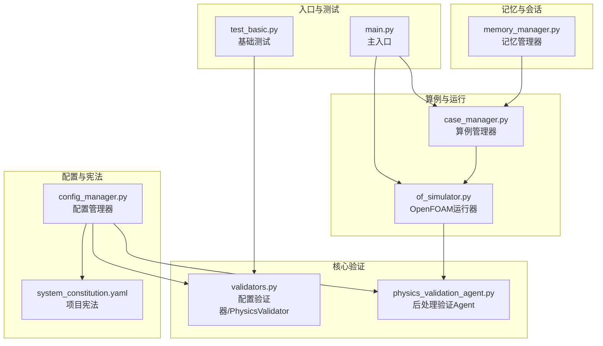
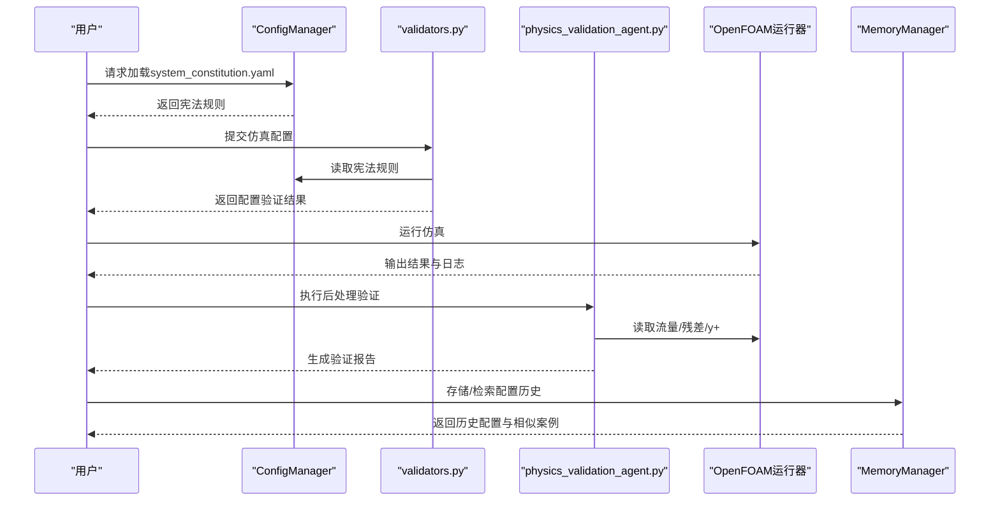
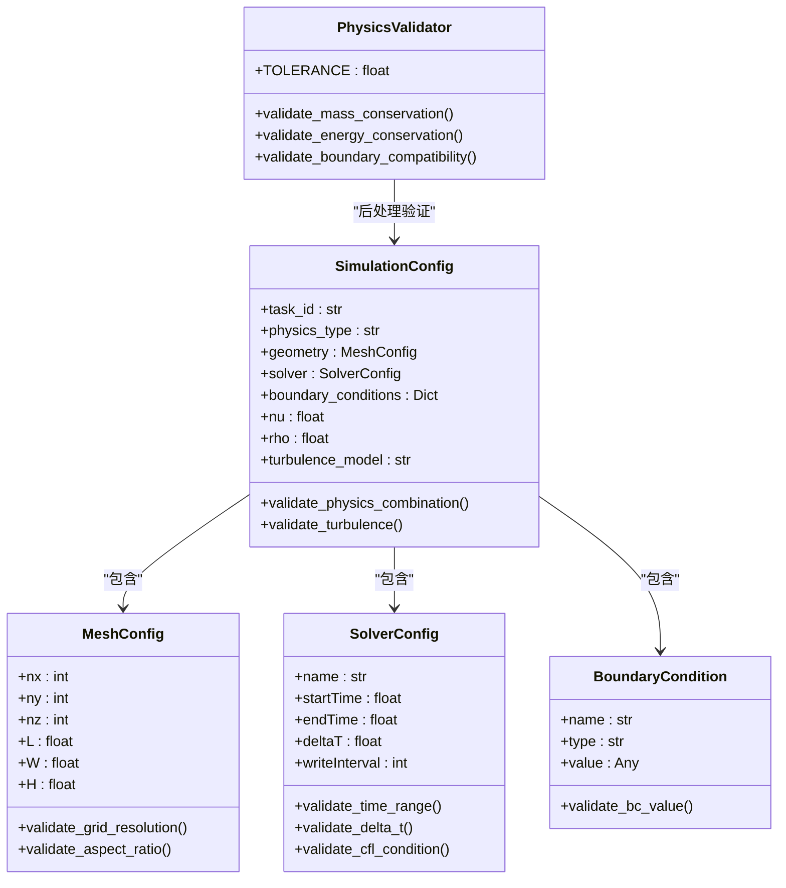
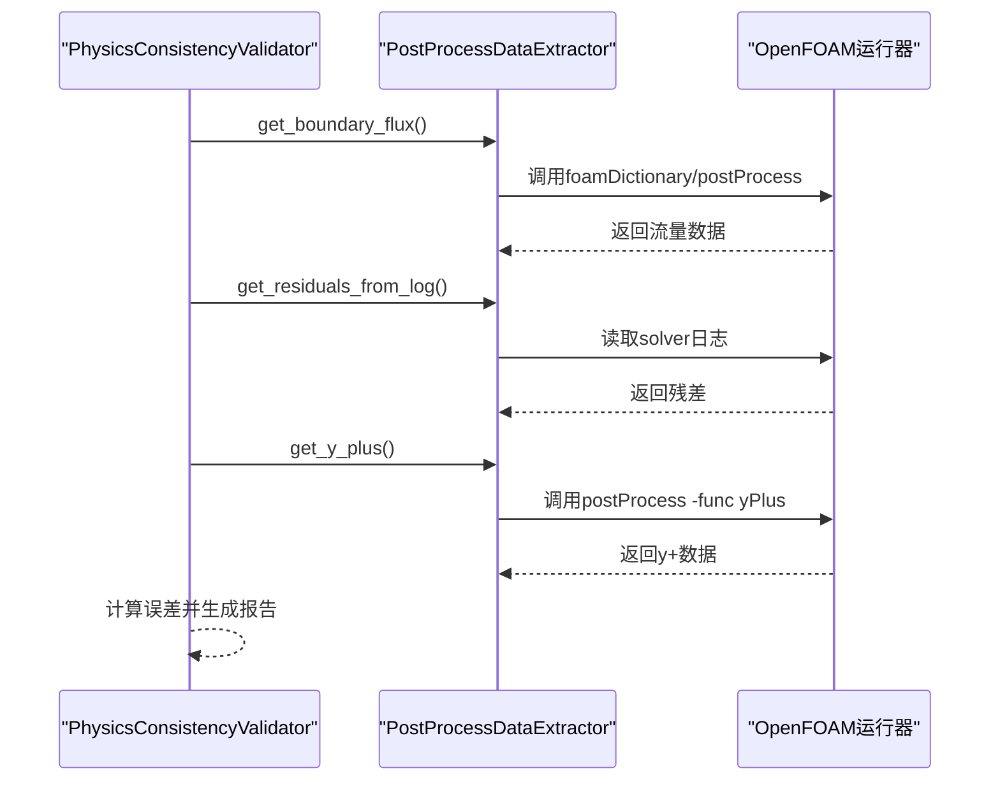
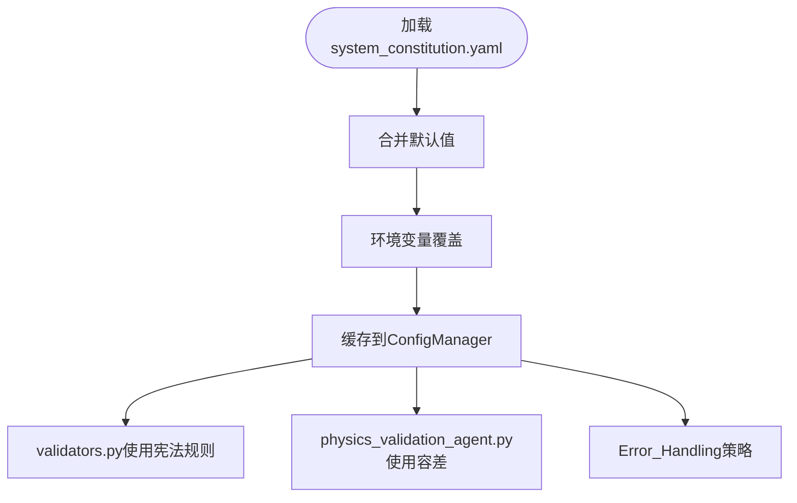
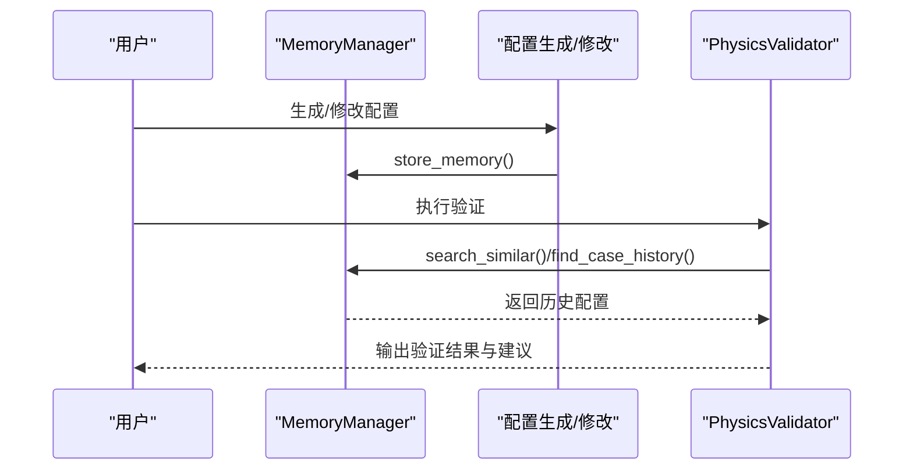
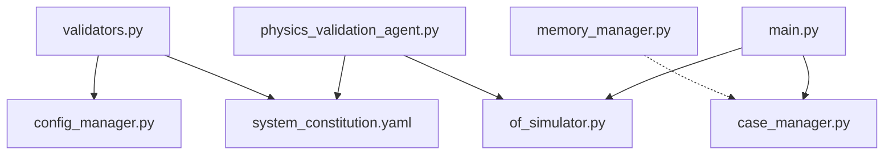

# 物理验证模块

<cite>
**本文引用的文件**
- [validators.py](file://openfoam_ai/core/validators.py)
- [system_constitution.yaml](file://openfoam_ai/config/system_constitution.yaml)
- [config_manager.py](file://openfoam_ai/core/config_manager.py)
- [physics_validation_agent.py](file://openfoam_ai/agents/physics_validation_agent.py)
- [memory_manager.py](file://openfoam_ai/memory/memory_manager.py)
- [case_manager.py](file://openfoam_ai/core/case_manager.py)
- [of_simulator.py](file://openfoam_ai/utils/of_simulator.py)
- [main.py](file://openfoam_ai/main.py)
- [test_basic.py](file://openfoam_ai/tests/test_basic.py)
</cite>

## 目录
1. [简介](#简介)
2. [项目结构](#项目结构)
3. [核心组件](#核心组件)
4. [架构总览](#架构总览)
5. [详细组件分析](#详细组件分析)
6. [依赖关系分析](#依赖关系分析)
7. [性能考虑](#性能考虑)
8. [故障排查指南](#故障排查指南)
9. [结论](#结论)
10. [附录](#附录)

## 简介
本技术文档围绕PhysicsValidator物理验证模块展开，系统阐述CFD仿真配置的物理约束检查、数学合理性验证与工程标准符合性评估。文档重点覆盖：
- PhysicsValidator的验证策略：网格质量检查、边界条件合理性验证、初始条件设置、求解器参数合法性检查
- 项目宪法（system_constitution.yaml）的集成、约束规则应用与验证逻辑实现
- 验证流程配置示例、执行流程与结果处理
- 与配置生成器的协作关系、自动修复建议与错误报告机制
- 验证规则定制、性能优化与扩展新验证项的方法
- 与MemoryManager的集成、历史配置对比与质量趋势分析

本文件兼顾初学者理解CFD验证概念与高级开发者实现细节与最佳实践。

## 项目结构
OpenFOAM AI Agent的物理验证模块位于openfoam_ai/core与openfoam_ai/agents目录下，配合config、memory、core等模块协同工作。关键文件与职责如下：
- openfoam_ai/core/validators.py：Pydantic驱动的配置验证器与PhysicsValidator后处理验证器
- openfoam_ai/config/system_constitution.yaml：项目宪法，定义网格、求解器、验证、物理约束、错误处理等规则
- openfoam_ai/core/config_manager.py：统一配置管理器，负责加载与缓存宪法、环境变量与默认配置
- openfoam_ai/agents/physics_validation_agent.py：后处理阶段的物理一致性验证Agent，包含质量守恒、能量守恒、收敛性等验证
- openfoam_ai/memory/memory_manager.py：记忆管理模块，支持配置历史存储、相似性检索与增量更新
- openfoam_ai/core/case_manager.py：算例目录管理器，负责创建/复制/清理算例目录
- openfoam_ai/utils/of_simulator.py：OpenFOAM仿真运行器，提供网格生成、求解器运行与残差提取
- openfoam_ai/main.py：主入口，提供交互/演示/快速创建模式
- openfoam_ai/tests/test_basic.py：基础测试，验证模块导入与核心功能

图表来源
- [validators.py:1-441](file://openfoam_ai/core/validators.py#L1-L441)
- [physics_validation_agent.py:1-517](file://openfoam_ai/agents/physics_validation_agent.py#L1-L517)
- [config_manager.py:1-227](file://openfoam_ai/core/config_manager.py#L1-L227)
- [system_constitution.yaml:1-103](file://openfoam_ai/config/system_constitution.yaml#L1-L103)
- [case_manager.py:1-639](file://openfoam_ai/core/case_manager.py#L1-L639)
- [of_simulator.py:1-180](file://openfoam_ai/utils/of_simulator.py#L1-L180)
- [memory_manager.py:1-804](file://openfoam_ai/memory/memory_manager.py#L1-L804)
- [main.py:1-251](file://openfoam_ai/main.py#L1-L251)
- [test_basic.py:1-270](file://openfoam_ai/tests/test_basic.py#L1-L270)

章节来源
- [validators.py:1-441](file://openfoam_ai/core/validators.py#L1-L441)
- [physics_validation_agent.py:1-517](file://openfoam_ai/agents/physics_validation_agent.py#L1-L517)
- [config_manager.py:1-227](file://openfoam_ai/core/config_manager.py#L1-L227)
- [system_constitution.yaml:1-103](file://openfoam_ai/config/system_constitution.yaml#L1-L103)
- [case_manager.py:1-639](file://openfoam_ai/core/case_manager.py#L1-L639)
- [of_simulator.py:1-180](file://openfoam_ai/utils/of_simulator.py#L1-L180)
- [memory_manager.py:1-804](file://openfoam_ai/memory/memory_manager.py#L1-L804)
- [main.py:1-251](file://openfoam_ai/main.py#L1-L251)
- [test_basic.py:1-270](file://openfoam_ai/tests/test_basic.py#L1-L270)

## 核心组件
- 配置验证器（validators.py）
  - MeshConfig：网格分辨率与长宽比、总网格数检查，依据system_constitution.yaml的Mesh_Standards
  - SolverConfig：求解器名称、时间范围、时间步长、CFL条件检查，依据Solver_Standards
  - BoundaryCondition：边界类型与值的合法性
  - SimulationConfig：整体配置的物理组合合理性、湍流模型选择、物理参数范围检查
  - validate_simulation_config：主入口，返回通过与否与错误列表
- PhysicsValidator（validators.py）
  - 质量守恒验证、能量守恒验证、边界兼容性检查等
- 后处理验证Agent（physics_validation_agent.py）
  - PostProcessDataExtractor：从OpenFOAM结果中提取流量、残差、y+等数据
  - PhysicsConsistencyValidator：执行质量守恒、能量守恒、收敛性、边界兼容性、y+检查
- 配置管理器（config_manager.py）
  - 加载system_constitution.yaml，提供统一访问接口与默认值合并
- 项目宪法（system_constitution.yaml）
  - Core_Directives、Mesh_Standards、Solver_Standards、Validation_Requirements、Physical_Constraints、Prohibited_Combinations、Quality_Checks、Error_Handling等
- 算例管理器（case_manager.py）
  - 创建/复制/清理算例目录，维护算例信息
- OpenFOAM运行器（of_simulator.py）
  - blockMesh生成网格、求解器运行、日志解析残差
- 记忆管理器（memory_manager.py）
  - 配置历史存储、相似性检索、增量更新（Diff update）

章节来源
- [validators.py:177-441](file://openfoam_ai/core/validators.py#L177-L441)
- [physics_validation_agent.py:174-517](file://openfoam_ai/agents/physics_validation_agent.py#L174-L517)
- [config_manager.py:16-227](file://openfoam_ai/core/config_manager.py#L16-L227)
- [system_constitution.yaml:1-103](file://openfoam_ai/config/system_constitution.yaml#L1-L103)
- [case_manager.py:27-262](file://openfoam_ai/core/case_manager.py#L27-L262)
- [of_simulator.py:13-180](file://openfoam_ai/utils/of_simulator.py#L13-L180)
- [memory_manager.py:198-804](file://openfoam_ai/memory/memory_manager.py#L198-L804)

## 架构总览
PhysicsValidator模块贯穿“配置阶段”与“后处理阶段”的验证闭环：
- 配置阶段：validators.py的SimulationConfig基于system_constitution.yaml进行硬约束与软约束检查，避免生成不符合物理规律的配置
- 后处理阶段：physics_validation_agent.py读取OpenFOAM运行结果，执行质量守恒、能量守恒、收敛性等验证，并生成报告
- 配置管理：config_manager.py统一加载宪法，提供默认值与环境变量覆盖
- 历史对比：memory_manager.py记录配置历史，支持相似性检索与增量更新，便于质量趋势分析

图表来源
- [config_manager.py:94-218](file://openfoam_ai/core/config_manager.py#L94-L218)
- [validators.py:389-411](file://openfoam_ai/core/validators.py#L389-L411)
- [physics_validation_agent.py:197-478](file://openfoam_ai/agents/physics_validation_agent.py#L197-L478)
- [of_simulator.py:51-180](file://openfoam_ai/utils/of_simulator.py#L51-L180)
- [memory_manager.py:291-520](file://openfoam_ai/memory/memory_manager.py#L291-L520)

## 详细组件分析

### 配置验证器（validators.py）
- MeshConfig
  - 网格分辨率检查：依据宪法中的min_cells_per_direction、min_cells_2d、min_cells_3d进行警告与错误提示
  - 长宽比与总网格数：root_validator中计算dx/dy等比值与总网格数，超过max_aspect_ratio或低于宪法阈值时抛出异常
- SolverConfig
  - 时间范围与时间步长：endTime必须大于startTime；deltaT过大时给出警告
  - CFL条件：基于宪法max_courant_explicit/max_courant_implicit与求解器类型进行估计与判断
- BoundaryCondition
  - fixedValue边界必须提供value
- SimulationConfig
  - 禁止组合检查：Prohibited_Combinations中禁止的solver/physics/turbulence组合
  - 物理参数范围：kinematic_viscosity与density范围检查
  - 湍流模型：限定在kEpsilon/kOmega/kOmegaSST/SpalartAllmaras/laminar之一
- validate_simulation_config
  - 主入口，捕获异常并返回错误信息列表

图表来源
- [validators.py:18-275](file://openfoam_ai/core/validators.py#L18-L275)
- [validators.py:277-387](file://openfoam_ai/core/validators.py#L277-L387)

章节来源
- [validators.py:18-275](file://openfoam_ai/core/validators.py#L18-L275)
- [validators.py:277-387](file://openfoam_ai/core/validators.py#L277-L387)

### 后处理验证Agent（physics_validation_agent.py）
- PostProcessDataExtractor
  - get_latest_time：获取最新时间步
  - get_boundary_flux：尝试使用foamDictionary/postProcess提取边界流量
  - get_flux_data：解析postProcess输出的流量数据
  - get_residuals_from_log：从solver日志提取最终残差
  - get_y_plus：使用postProcess -func yPlus提取y+数据
- PhysicsConsistencyValidator
  - validate_all：执行质量守恒、能量守恒、收敛性验证
  - validate_mass_conservation：计算入口/出口流量误差，容差来自Validation_Requirements
  - validate_energy_conservation：热流入/热流出/壁面热流之和与参考值比值误差
  - validate_convergence：检查最大残差是否低于目标阈值
  - validate_boundary_compatibility：检查压力入口与速度入口的兼容性、入口/出口完整性
  - validate_y_plus：检查y+是否在目标范围内
  - generate_report：生成结构化报告

图表来源
- [physics_validation_agent.py:38-172](file://openfoam_ai/agents/physics_validation_agent.py#L38-L172)
- [physics_validation_agent.py:174-478](file://openfoam_ai/agents/physics_validation_agent.py#L174-L478)
- [of_simulator.py:114-180](file://openfoam_ai/utils/of_simulator.py#L114-L180)

章节来源
- [physics_validation_agent.py:38-172](file://openfoam_ai/agents/physics_validation_agent.py#L38-L172)
- [physics_validation_agent.py:174-478](file://openfoam_ai/agents/physics_validation_agent.py#L174-L478)
- [of_simulator.py:114-180](file://openfoam_ai/utils/of_simulator.py#L114-L180)

### 项目宪法（system_constitution.yaml）与配置管理
- system_constitution.yaml定义了：
  - Core_Directives：核心指令（如能量守恒、边界层网格、时间步长独立性等）
  - Mesh_Standards：最小网格数、最大长宽比、y+目标范围、增长率等
  - Solver_Standards：收敛阈值、CFL限制、松弛因子范围、默认写入间隔等
  - Validation_Requirements：质量/能量/力平衡容差
  - Physical_Constraints：Re/Pr范围、运动粘度与密度范围
  - Prohibited_Combinations：禁止的求解器-物理-湍流组合
  - Quality_Checks：运行前后检查清单
  - Error_Handling：网格质量失败、发散、收敛停滞的自动修复策略
- config_manager.py
  - 单例模式加载宪法，支持环境变量覆盖与默认值合并
  - 提供get_mesh_standard、get_solver_standard等便捷接口

图表来源
- [system_constitution.yaml:1-103](file://openfoam_ai/config/system_constitution.yaml#L1-L103)
- [config_manager.py:94-218](file://openfoam_ai/core/config_manager.py#L94-L218)

章节来源
- [system_constitution.yaml:1-103](file://openfoam_ai/config/system_constitution.yaml#L1-L103)
- [config_manager.py:94-218](file://openfoam_ai/core/config_manager.py#L94-L218)

### 与MemoryManager的集成与历史对比
- memory_manager.py提供：
  - 存储/检索配置历史，支持相似性检索与增量更新（Diff update）
  - ConfigurationDiffer：计算两个配置的差异并应用到基础配置
  - find_case_history/get_latest_config：获取算例历史与最新配置
  - rollback_to_memory：回滚到指定记忆版本
- 与PhysicsValidator的协作：
  - 在配置生成/修改后，将新配置存入记忆库
  - 通过相似性检索获取历史相似案例，辅助验证与自动修复建议
  - 历史配置对比可用于质量趋势分析

图表来源
- [memory_manager.py:291-520](file://openfoam_ai/memory/memory_manager.py#L291-L520)
- [validators.py:389-411](file://openfoam_ai/core/validators.py#L389-L411)

章节来源
- [memory_manager.py:291-520](file://openfoam_ai/memory/memory_manager.py#L291-L520)
- [validators.py:389-411](file://openfoam_ai/core/validators.py#L389-L411)

### 验证流程配置示例与执行
- 配置验证示例（validators.py）
  - 有效配置：geometry.nx/ny满足宪法最小网格数，solver.endTime > startTime，deltaT合理
  - 无效配置：geometry.nx过小触发警告；solver.endTime <= startTime触发异常
- 后处理验证示例（physics_validation_agent.py）
  - 质量守恒：入口/出口流量误差小于Validation_Requirements.mass_conservation_tolerance
  - 能量守恒：热流入/热流出/壁面热流之和与参考值比值误差小于Validation_Requirements.energy_conservation_tolerance
  - 收敛性：最大残差低于Solver_Standards.min_convergence_residual
- 执行验证流程
  - 配置阶段：validators.validate_simulation_config
  - 后处理阶段：PhysicsConsistencyValidator.validate_all
  - 报告生成：generate_report

章节来源
- [validators.py:413-441](file://openfoam_ai/core/validators.py#L413-L441)
- [physics_validation_agent.py:197-478](file://openfoam_ai/agents/physics_validation_agent.py#L197-L478)

### 错误处理与自动修复建议
- system_constitution.yaml中的Error_Handling定义：
  - mesh_quality_fail：尝试自动修复，最多尝试次数
  - divergence_detected：降低时间步长、最小时间步长限制
  - convergence_stall：调整松弛因子或细化网格
- physics_validation_agent.py中的容错：
  - 无法获取数据时返回默认值并记录警告
  - y+检查无数据时默认通过

章节来源
- [system_constitution.yaml:84-97](file://openfoam_ai/config/system_constitution.yaml#L84-L97)
- [physics_validation_agent.py:323-438](file://openfoam_ai/agents/physics_validation_agent.py#L323-L438)

### 验证规则定制、性能优化与扩展
- 定制验证规则
  - 在system_constitution.yaml中新增/修改规则键值
  - 在validators.py中扩展新的验证类或在现有类中添加validator/root_validator
  - 在physics_validation_agent.py中新增验证方法并纳入validate_all
- 性能优化
  - 使用ConfigManager缓存宪法，避免重复I/O
  - 合理设置Validation_Requirements容差，减少过度严格导致的反复迭代
  - 使用MemoryManager的相似性检索减少重复配置生成
- 扩展新验证项
  - 新增ValidationType枚举值
  - 在PostProcessDataExtractor中添加数据提取方法
  - 在PhysicsConsistencyValidator中实现具体验证逻辑

章节来源
- [system_constitution.yaml:13-103](file://openfoam_ai/config/system_constitution.yaml#L13-L103)
- [validators.py:18-275](file://openfoam_ai/core/validators.py#L18-L275)
- [physics_validation_agent.py:17-40](file://openfoam_ai/agents/physics_validation_agent.py#L17-L40)

## 依赖关系分析
- 模块耦合
  - validators.py依赖config_manager.py加载system_constitution.yaml
  - physics_validation_agent.py依赖of_simulator.py读取OpenFOAM结果
  - memory_manager.py与case_manager.py相互独立，均可被上层流程调用
- 外部依赖
  - OpenFOAM命令行工具：blockMesh、postProcess、foamDictionary
  - ChromaDB（可选）：用于向量数据库存储与检索

图表来源
- [validators.py:11-15](file://openfoam_ai/core/validators.py#L11-L15)
- [config_manager.py:94-119](file://openfoam_ai/core/config_manager.py#L94-L119)
- [physics_validation_agent.py:73-103](file://openfoam_ai/agents/physics_validation_agent.py#L73-L103)
- [of_simulator.py:22-24](file://openfoam_ai/utils/of_simulator.py#L22-L24)
- [memory_manager.py:225-241](file://openfoam_ai/memory/memory_manager.py#L225-L241)
- [case_manager.py:45-46](file://openfoam_ai/core/case_manager.py#L45-L46)
- [main.py:19-21](file://openfoam_ai/main.py#L19-L21)

章节来源
- [validators.py:11-15](file://openfoam_ai/core/validators.py#L11-L15)
- [config_manager.py:94-119](file://openfoam_ai/core/config_manager.py#L94-L119)
- [physics_validation_agent.py:73-103](file://openfoam_ai/agents/physics_validation_agent.py#L73-L103)
- [of_simulator.py:22-24](file://openfoam_ai/utils/of_simulator.py#L22-L24)
- [memory_manager.py:225-241](file://openfoam_ai/memory/memory_manager.py#L225-L241)
- [case_manager.py:45-46](file://openfoam_ai/core/case_manager.py#L45-L46)
- [main.py:19-21](file://openfoam_ai/main.py#L19-L21)

## 性能考虑
- 配置加载与缓存
  - 使用ConfigManager单例与锁保护，避免重复加载宪法文件
  - 默认值与环境变量覆盖减少运行时分支判断
- 验证开销
  - Pydantic的validator/root_validator在配置阶段快速拦截不合理参数
  - 后处理验证依赖OpenFOAM日志与工具输出，建议在仿真完成后批量执行
- 记忆管理
  - MemoryManager支持向量数据库（可选）与模拟模式，可根据部署环境选择
  - 相似性检索与增量更新有助于减少重复工作量

[本节为一般性指导，无需特定文件引用]

## 故障排查指南
- 配置验证失败
  - 检查geometry.nx/ny是否低于宪法最小网格数
  - 检查solver.endTime是否大于startTime
  - 检查turbulence_model是否在允许列表内
- 后处理验证失败
  - 确认OpenFOAM日志与结果目录存在且可读
  - 检查边界名称是否与实际一致（入口/出口/壁面）
  - 若y+数据缺失，确认postProcess -func yPlus可用
- 记忆管理问题
  - ChromaDB不可用时自动回退到模拟模式
  - 检查存储路径权限与磁盘空间

章节来源
- [validators.py:389-411](file://openfoam_ai/core/validators.py#L389-L411)
- [physics_validation_agent.py:114-171](file://openfoam_ai/agents/physics_validation_agent.py#L114-L171)
- [memory_manager.py:233-241](file://openfoam_ai/memory/memory_manager.py#L233-L241)

## 结论
PhysicsValidator模块通过“配置阶段硬约束 + 后处理阶段软验证”的双轨机制，结合system_constitution.yaml的工程标准与MemoryManager的历史对比能力，实现了从配置生成到结果验证的闭环。该体系既保障了仿真配置的物理合理性与工程合规性，又提供了自动修复建议与质量趋势分析能力，适合不同层次用户的使用需求。

[本节为总结性内容，无需特定文件引用]

## 附录
- 代码示例路径
  - 配置验证入口：[validators.py:389-411](file://openfoam_ai/core/validators.py#L389-L411)
  - 后处理验证入口：[physics_validation_agent.py:197-224](file://openfoam_ai/agents/physics_validation_agent.py#L197-L224)
  - 项目宪法规则：[system_constitution.yaml:13-103](file://openfoam_ai/config/system_constitution.yaml#L13-L103)
  - 配置管理器加载：[config_manager.py:94-119](file://openfoam_ai/core/config_manager.py#L94-L119)
  - OpenFOAM运行器：[of_simulator.py:51-180](file://openfoam_ai/utils/of_simulator.py#L51-L180)
  - 算例管理器：[case_manager.py:51-86](file://openfoam_ai/core/case_manager.py#L51-L86)
  - 记忆管理器：[memory_manager.py:291-520](file://openfoam_ai/memory/memory_manager.py#L291-L520)
  - 基础测试：[test_basic.py:84-128](file://openfoam_ai/tests/test_basic.py#L84-L128)

[本节为附录性内容，无需特定文件引用]