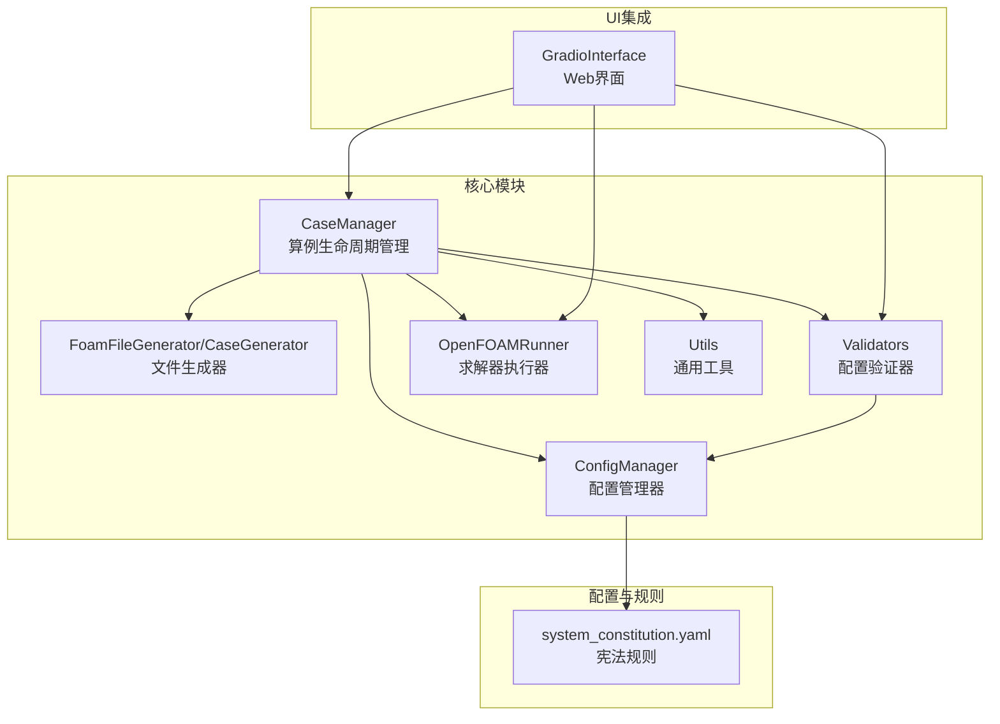
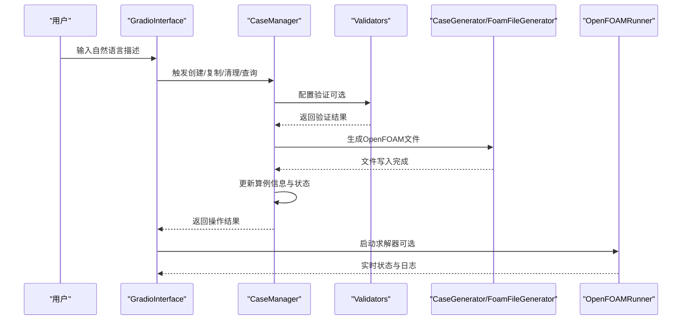
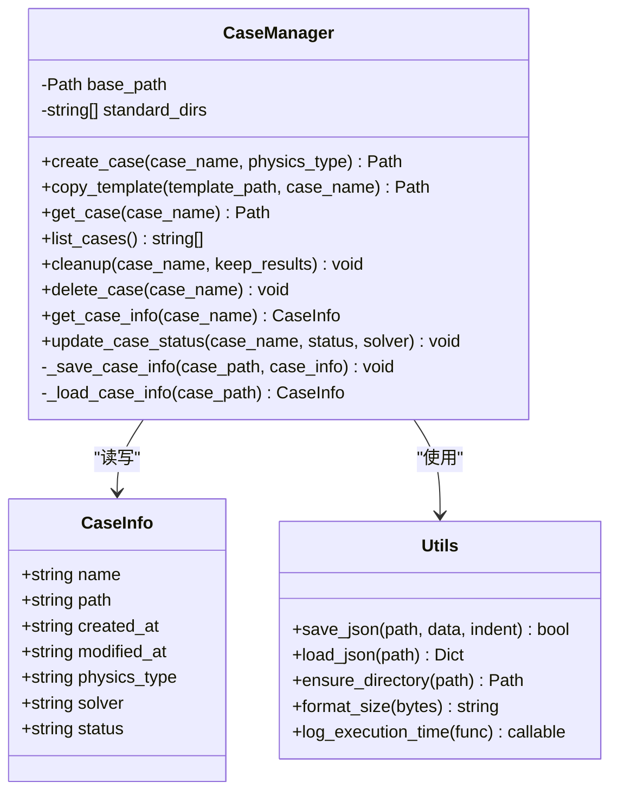
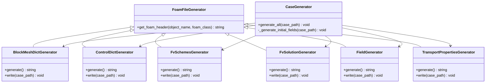
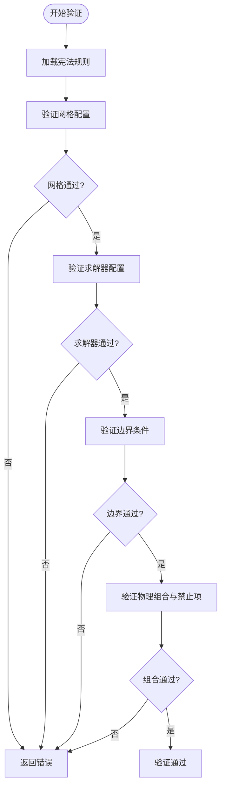
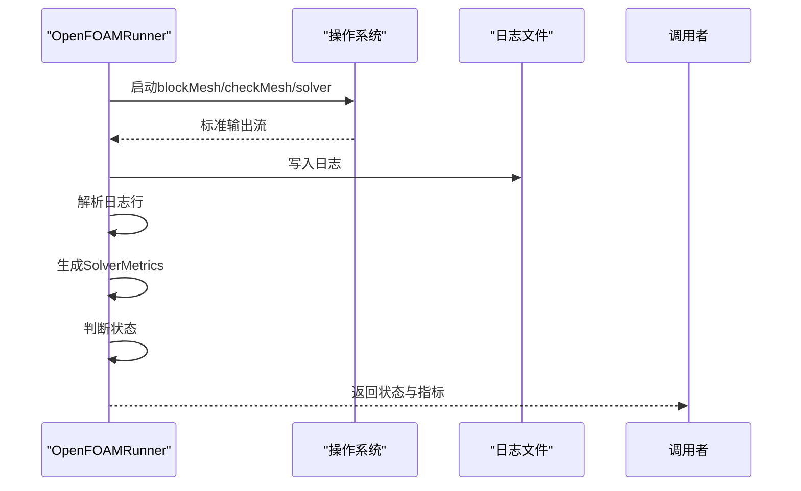
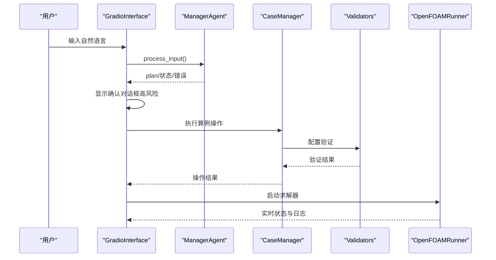
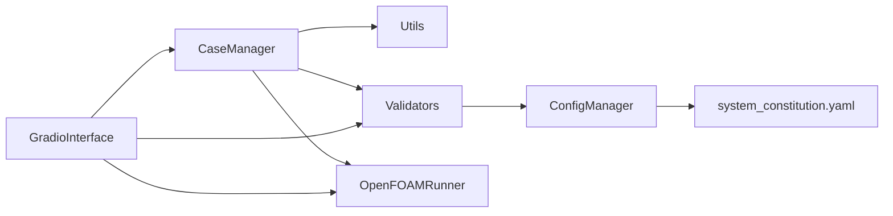

# 算例管理模块

<cite>
**本文档引用的文件**
- [case_manager.py](file://openfoam_ai/core/case_manager.py)
- [file_generator.py](file://openfoam_ai/core/file_generator.py)
- [validators.py](file://openfoam_ai/core/validators.py)
- [utils.py](file://openfoam_ai/core/utils.py)
- [config_manager.py](file://openfoam_ai/core/config_manager.py)
- [openfoam_runner.py](file://openfoam_ai/core/openfoam_runner.py)
- [system_constitution.yaml](file://openfoam_ai/config/system_constitution.yaml)
- [.case_info.json](file://demo_cases/demo_case/.case_info.json)
- [test_case_manager.py](file://openfoam_ai/tests/test_case_manager.py)
- [gradio_interface.py](file://openfoam_ai/ui/gradio_interface.py)
</cite>

## 目录
1. [简介](#简介)
2. [项目结构](#项目结构)
3. [核心组件](#核心组件)
4. [架构总览](#架构总览)
5. [详细组件分析](#详细组件分析)
6. [依赖关系分析](#依赖关系分析)
7. [性能考虑](#性能考虑)
8. [故障排查指南](#故障排查指南)
9. [结论](#结论)
10. [附录](#附录)

## 简介
本文件面向CaseManager算例管理模块，系统性阐述OpenFOAM算例的生命周期管理、目录结构组织、文件生成机制与状态跟踪。文档涵盖：
- 算例创建、复制、删除、清理与状态更新
- OpenFOAM标准目录结构（0、constant、system、logs）的管理策略与命名规范
- 与文件生成器、配置验证器、求解器运行器的协作关系
- 错误处理机制、批量操作支持与性能优化建议
- 与UI组件的集成方式与数据持久化策略

## 项目结构
本模块位于openfoam_ai/core目录下，围绕CaseManager为核心，配合文件生成器、验证器、配置管理器与运行器形成完整的算例管理闭环，并通过UI组件对外提供交互能力。

图表来源
- [case_manager.py:27-262](file://openfoam_ai/core/case_manager.py#L27-L262)
- [file_generator.py:11-604](file://openfoam_ai/core/file_generator.py#L11-L604)
- [validators.py:179-275](file://openfoam_ai/core/validators.py#L179-L275)
- [config_manager.py:16-222](file://openfoam_ai/core/config_manager.py#L16-L222)
- [openfoam_runner.py:44-548](file://openfoam_ai/core/openfoam_runner.py#L44-L548)
- [system_constitution.yaml:1-103](file://openfoam_ai/config/system_constitution.yaml#L1-L103)
- [gradio_interface.py:31-484](file://openfoam_ai/ui/gradio_interface.py#L31-L484)

章节来源
- [case_manager.py:1-639](file://openfoam_ai/core/case_manager.py#L1-L639)
- [file_generator.py:1-635](file://openfoam_ai/core/file_generator.py#L1-L635)
- [validators.py:1-441](file://openfoam_ai/core/validators.py#L1-L441)
- [config_manager.py:1-227](file://openfoam_ai/core/config_manager.py#L1-L227)
- [openfoam_runner.py:1-548](file://openfoam_ai/core/openfoam_runner.py#L1-L548)
- [system_constitution.yaml:1-103](file://openfoam_ai/config/system_constitution.yaml#L1-L103)
- [gradio_interface.py:1-484](file://openfoam_ai/ui/gradio_interface.py#L1-L484)

## 核心组件
- CaseManager：负责算例目录结构创建、模板复制、算例清单、清理与删除、状态更新与信息持久化。
- FoamFileGenerator/CaseGenerator：将结构化配置转换为OpenFOAM字典文件，生成system、constant与初始场文件。
- Validators：基于Pydantic的硬约束验证系统，防止生成不符合物理规律的配置。
- ConfigManager：统一加载并缓存宪法规则，提供环境变量与默认配置的访问接口。
- OpenFOAMRunner：封装OpenFOAM命令执行、日志捕获与收敛状态判断。
- Utils：提供JSON读写、目录确保、大小格式化与执行时间装饰器等通用工具。
- GradioInterface：Web界面，承载用户与算例管理流程的交互。

章节来源
- [case_manager.py:27-262](file://openfoam_ai/core/case_manager.py#L27-L262)
- [file_generator.py:11-604](file://openfoam_ai/core/file_generator.py#L11-L604)
- [validators.py:179-275](file://openfoam_ai/core/validators.py#L179-L275)
- [config_manager.py:16-222](file://openfoam_ai/core/config_manager.py#L16-L222)
- [openfoam_runner.py:44-548](file://openfoam_ai/core/openfoam_runner.py#L44-L548)
- [utils.py:16-111](file://openfoam_ai/core/utils.py#L16-L111)
- [gradio_interface.py:31-484](file://openfoam_ai/ui/gradio_interface.py#L31-L484)

## 架构总览
下面的序列图展示了从用户输入到算例生成与状态更新的典型流程，以及与验证器、文件生成器和运行器的协作关系。

图表来源
- [gradio_interface.py:99-244](file://openfoam_ai/ui/gradio_interface.py#L99-L244)
- [case_manager.py:51-241](file://openfoam_ai/core/case_manager.py#L51-L241)
- [validators.py:389-411](file://openfoam_ai/core/validators.py#L389-L411)
- [file_generator.py:506-532](file://openfoam_ai/core/file_generator.py#L506-L532)
- [openfoam_runner.py:99-198](file://openfoam_ai/core/openfoam_runner.py#L99-L198)

## 详细组件分析

### CaseManager：算例生命周期管理
- 目录结构管理
  - 标准目录：0、constant、system、logs
  - 创建时自动确保目录存在；复制时保留模板结构并更新算例信息
- 算例信息持久化
  - 使用JSON文件存储CaseInfo，包含名称、路径、创建/修改时间、物理类型、求解器、状态等
  - 通过工具函数进行安全读写，避免异常导致的数据损坏
- 生命周期操作
  - 创建：删除同名目录（如存在），重建标准目录，写入算例信息
  - 复制：校验模板存在性，删除目标目录（如存在），复制并更新信息
  - 清理：删除时间步目录、并行处理器目录，保留最近的日志，重置状态为init
  - 删除：彻底移除算例目录
  - 查询：列出有效算例（具备system与constant目录）、获取算例路径、读取算例信息
  - 状态更新：更新状态与最后修改时间，可选设置求解器名称
- 工具函数
  - create_cavity_case：便捷函数，创建标准方腔驱动流算例，包含blockMeshDict、controlDict、fvSchemes、fvSolution、初始场与transportProperties

图表来源
- [case_manager.py:15-262](file://openfoam_ai/core/case_manager.py#L15-L262)
- [utils.py:16-62](file://openfoam_ai/core/utils.py#L16-L62)

章节来源
- [case_manager.py:27-262](file://openfoam_ai/core/case_manager.py#L27-L262)
- [utils.py:16-62](file://openfoam_ai/core/utils.py#L16-L62)

### FoamFileGenerator/CaseGenerator：文件生成机制
- 生成器体系
  - FoamFileGenerator：提供OpenFOAM文件头模板
  - BlockMeshDictGenerator：生成blockMeshDict，支持几何尺寸与网格分辨率参数化
  - ControlDictGenerator：生成controlDict，支持求解器名称、时间范围与写入间隔
  - FvSchemesGenerator：按物理类型生成数值格式方案
  - FvSolutionGenerator：按求解器与物理类型生成求解器设置与算法参数
  - FieldGenerator：生成U、p、T等初始场文件，支持边界条件类型与值
  - TransportPropertiesGenerator：生成transportProperties
  - CaseGenerator：整合上述生成器，一键生成完整算例文件
- 参数化与默认值
  - 通过配置字典注入参数，生成器内部根据物理类型与求解器名称选择合适的默认设置
  - 边界条件自动推断与默认填充，确保生成的算例具备可运行性

图表来源
- [file_generator.py:11-604](file://openfoam_ai/core/file_generator.py#L11-L604)

章节来源
- [file_generator.py:11-604](file://openfoam_ai/core/file_generator.py#L11-L604)

### Validators：配置验证与物理约束
- 验证器层次
  - MeshConfig：网格分辨率、几何尺寸、长宽比与总网格数校验
  - SolverConfig：求解器名称、时间范围、时间步长与CFL条件校验
  - BoundaryCondition：边界类型与值的合法性校验
  - SimulationConfig：整体配置的组合验证，包括物理类型与求解器匹配、禁止组合、物理参数范围等
- 物理一致性校验器
  - PhysicsValidator：质量守恒、能量守恒与边界兼容性检查（用于后处理阶段）
- 与宪法规则集成
  - 通过ConfigManager加载system_constitution.yaml，动态调整校验阈值与限制条件

图表来源
- [validators.py:179-275](file://openfoam_ai/core/validators.py#L179-L275)
- [config_manager.py:94-135](file://openfoam_ai/core/config_manager.py#L94-L135)
- [system_constitution.yaml:13-82](file://openfoam_ai/config/system_constitution.yaml#L13-L82)

章节来源
- [validators.py:179-275](file://openfoam_ai/core/validators.py#L179-L275)
- [config_manager.py:94-135](file://openfoam_ai/core/config_manager.py#L94-L135)
- [system_constitution.yaml:13-82](file://openfoam_ai/config/system_constitution.yaml#L13-L82)

### OpenFOAMRunner：求解器执行与状态监控
- 命令执行
  - blockMesh、checkMesh等预处理命令执行，捕获标准输出与错误输出，写入日志文件
  - 求解器启动，实时读取标准输出，解析库朗数与残差，生成SolverMetrics
- 状态判断
  - 基于库朗数上限、残差阈值与发散容忍度判断求解状态（运行中、收敛、发散、停滞、错误）
- 数据清理
  - 清理时间步目录与并行处理器目录，保留网格与配置

图表来源
- [openfoam_runner.py:99-198](file://openfoam_ai/core/openfoam_runner.py#L99-L198)
- [openfoam_runner.py:347-409](file://openfoam_ai/core/openfoam_runner.py#L347-L409)

章节来源
- [openfoam_runner.py:44-548](file://openfoam_ai/core/openfoam_runner.py#L44-L548)

### UI集成：GradioInterface
- 交互流程
  - 用户输入自然语言，ManagerAgent处理并生成计划
  - 对于高风险步骤（如创建/删除算例）弹出确认对话框
  - 实时显示状态与配置摘要，支持记忆检索与导出
- 与核心模块协作
  - 通过CaseManager执行算例操作
  - 通过Validators进行配置校验
  - 通过OpenFOAMRunner执行求解器并展示实时日志

图表来源
- [gradio_interface.py:99-244](file://openfoam_ai/ui/gradio_interface.py#L99-L244)
- [case_manager.py:51-241](file://openfoam_ai/core/case_manager.py#L51-L241)
- [validators.py:389-411](file://openfoam_ai/core/validators.py#L389-L411)
- [openfoam_runner.py:99-198](file://openfoam_ai/core/openfoam_runner.py#L99-L198)

章节来源
- [gradio_interface.py:31-484](file://openfoam_ai/ui/gradio_interface.py#L31-L484)

## 依赖关系分析
- 模块内聚与耦合
  - CaseManager与Utils耦合度低，通过工具函数实现JSON读写与目录确保
  - Validators与ConfigManager通过单例ConfigManager共享宪法规则，降低重复加载成本
  - OpenFOAMRunner与Validators通过宪法规则进行阈值配置，保持一致性
- 外部依赖
  - Gradio用于Web界面，非核心功能，不影响算例管理主流程
  - Python标准库subprocess用于命令执行，re用于日志解析

图表来源
- [case_manager.py:27-262](file://openfoam_ai/core/case_manager.py#L27-L262)
- [validators.py:179-275](file://openfoam_ai/core/validators.py#L179-L275)
- [config_manager.py:16-222](file://openfoam_ai/core/config_manager.py#L16-L222)
- [openfoam_runner.py:44-548](file://openfoam_ai/core/openfoam_runner.py#L44-L548)
- [gradio_interface.py:31-484](file://openfoam_ai/ui/gradio_interface.py#L31-L484)

章节来源
- [case_manager.py:27-262](file://openfoam_ai/core/case_manager.py#L27-L262)
- [validators.py:179-275](file://openfoam_ai/core/validators.py#L179-L275)
- [config_manager.py:16-222](file://openfoam_ai/core/config_manager.py#L16-L222)
- [openfoam_runner.py:44-548](file://openfoam_ai/core/openfoam_runner.py#L44-L548)
- [gradio_interface.py:31-484](file://openfoam_ai/ui/gradio_interface.py#L31-L484)

## 性能考虑
- 文件生成批量化
  - CaseGenerator一次性生成system、constant与初始场文件，减少多次I/O开销
- 日志与状态监控
  - OpenFOAMRunner采用流式读取与增量解析，避免大文件内存占用
  - SolverMonitor维护固定长度的历史窗口，控制内存使用
- 配置缓存
  - ConfigManager单例缓存宪法规则，避免重复加载
- 并行与资源限制
  - 通过环境变量与宪法规则限制并行核心数与内存上限，避免资源争用

[本节为通用指导，无需特定文件来源]

## 故障排查指南
- 算例创建失败
  - 检查基础路径是否存在且可写
  - 查看算例信息文件是否正确生成与读取
- 模板复制异常
  - 确认模板路径存在，目标算例目录是否被正确删除
- 清理无效
  - 确认算例目录包含system与constant目录，否则不会被识别为有效算例
  - 检查日志清理策略与时间戳排序
- 配置验证失败
  - 核对几何尺寸、网格分辨率与求解器参数是否符合宪法规则
  - 关注CFL条件与物理参数范围警告
- 求解器执行错误
  - 检查OpenFOAM安装路径与命令可用性
  - 查看日志文件中的错误信息与返回码
  - 监控状态是否进入发散或停滞

章节来源
- [case_manager.py:148-208](file://openfoam_ai/core/case_manager.py#L148-L208)
- [validators.py:104-155](file://openfoam_ai/core/validators.py#L104-L155)
- [openfoam_runner.py:245-301](file://openfoam_ai/core/openfoam_runner.py#L245-L301)

## 结论
CaseManager模块通过标准化的目录结构、参数化的文件生成、严格的配置验证与完善的生命周期管理，实现了OpenFOAM算例的高效创建、维护与执行。结合ConfigManager的宪法规则与OpenFOAMRunner的状态监控，系统在保证物理合理性的同时，提供了良好的用户体验与可扩展性。UI组件进一步降低了使用门槛，使得非专业用户也能快速上手。

[本节为总结性内容，无需特定文件来源]

## 附录

### OpenFOAM标准目录结构与命名规范
- 0：初始场目录，存放U、p、T等初始条件文件
- constant：常量属性目录，存放transportProperties等
- system：求解器配置目录，存放blockMeshDict、controlDict、fvSchemes、fvSolution等
- logs：日志目录，存放各类命令与求解器日志

章节来源
- [case_manager.py:48-70](file://openfoam_ai/core/case_manager.py#L48-L70)
- [file_generator.py:506-532](file://openfoam_ai/core/file_generator.py#L506-L532)

### 算例模板设计与批量操作支持
- 模板设计
  - 使用BlockMeshDictGenerator与FieldGenerator生成标准几何与初始场
  - 通过CaseGenerator一键生成完整算例
- 批量操作
  - 通过循环调用CaseManager的创建/清理/删除方法实现批量处理
  - 结合单元测试验证批量流程的正确性

章节来源
- [file_generator.py:506-604](file://openfoam_ai/core/file_generator.py#L506-L604)
- [test_case_manager.py:26-142](file://openfoam_ai/tests/test_case_manager.py#L26-L142)

### 代码示例路径（不含具体代码内容）
- 创建新算例：[create_case:51-86](file://openfoam_ai/core/case_manager.py#L51-L86)
- 复制模板算例：[copy_template:88-118](file://openfoam_ai/core/case_manager.py#L88-L118)
- 清理算例：[cleanup:148-194](file://openfoam_ai/core/case_manager.py#L148-L194)
- 删除算例：[delete_case:195-208](file://openfoam_ai/core/case_manager.py#L195-L208)
- 查询算例状态：[get_case_info:210-221](file://openfoam_ai/core/case_manager.py#L210-L221)、[update_case_status:223-240](file://openfoam_ai/core/case_manager.py#L223-L240)
- 生成方腔算例：[create_cavity_case:265-622](file://openfoam_ai/core/case_manager.py#L265-L622)
- 生成文件集：[CaseGenerator.generate_all:515-532](file://openfoam_ai/core/file_generator.py#L515-L532)
- 配置验证：[validate_simulation_config:389-411](file://openfoam_ai/core/validators.py#L389-L411)
- 执行求解器：[OpenFOAMRunner.run_solver:99-198](file://openfoam_ai/core/openfoam_runner.py#L99-L198)