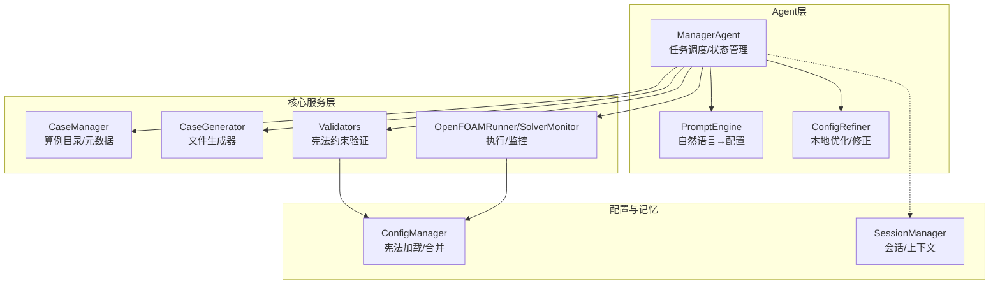
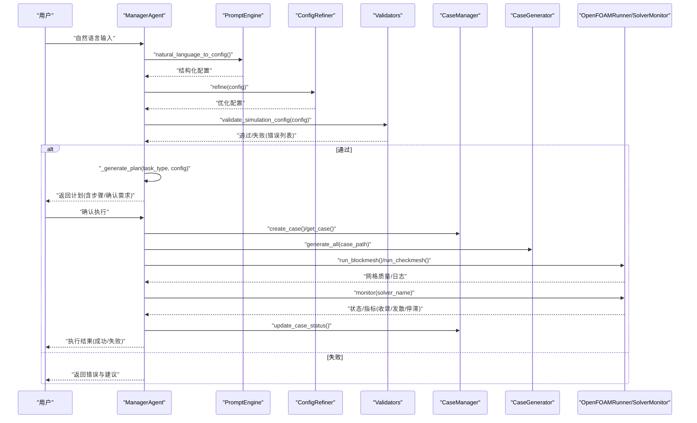
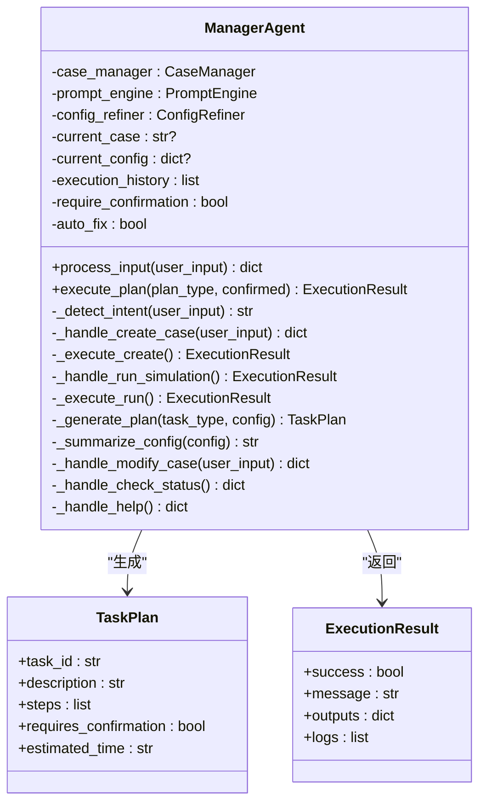
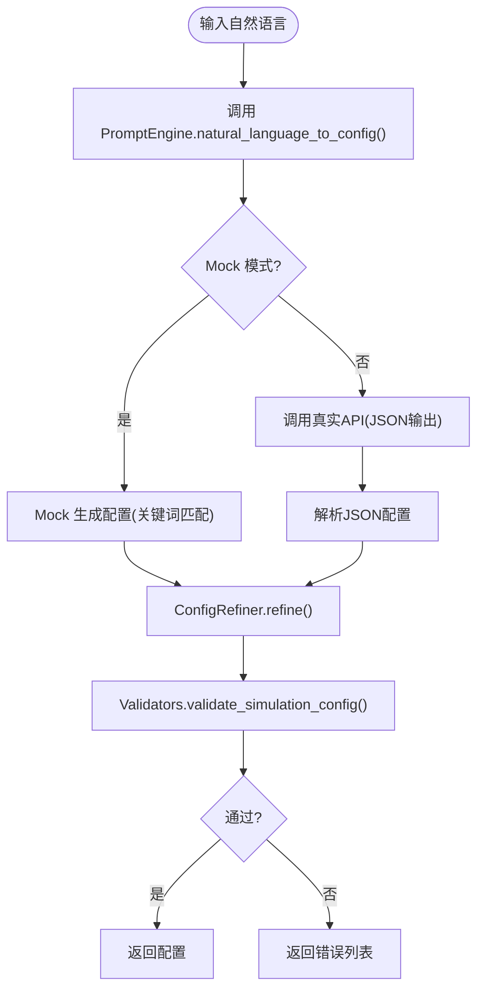
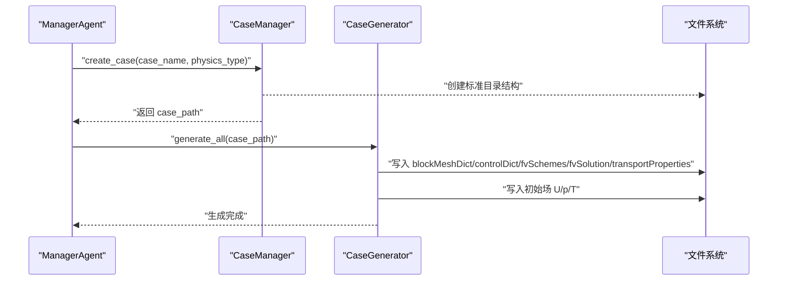
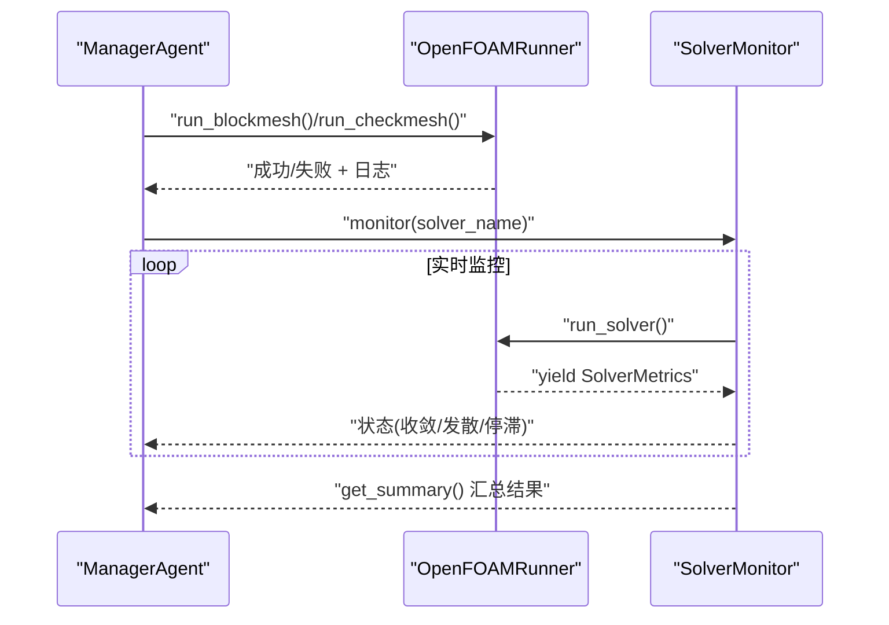
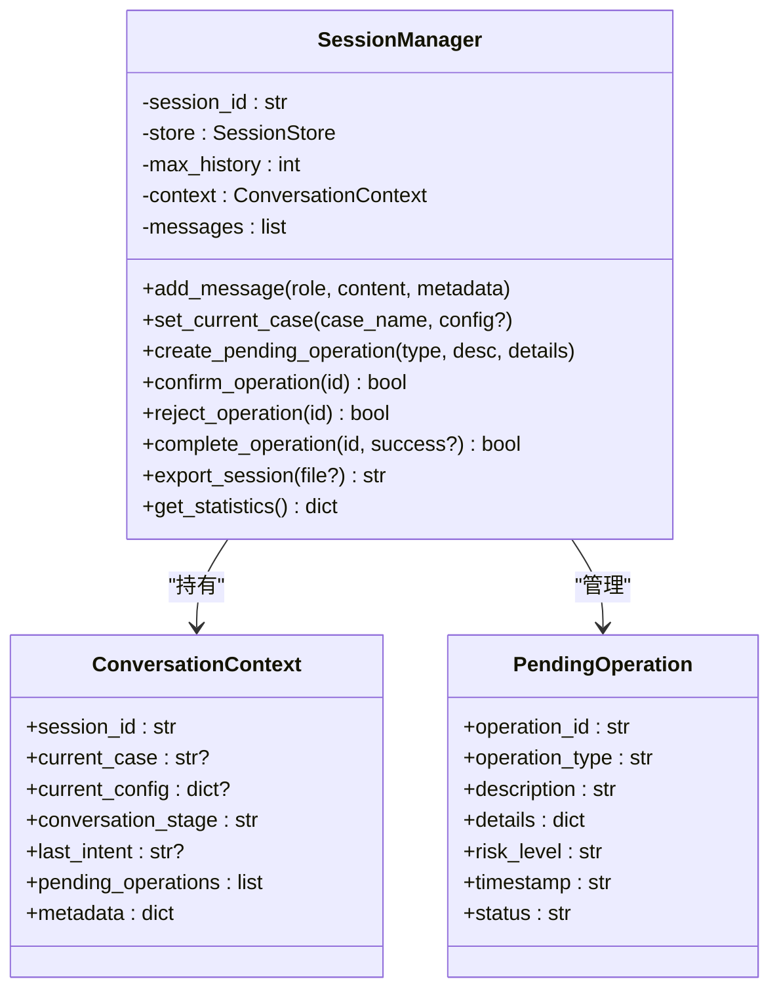
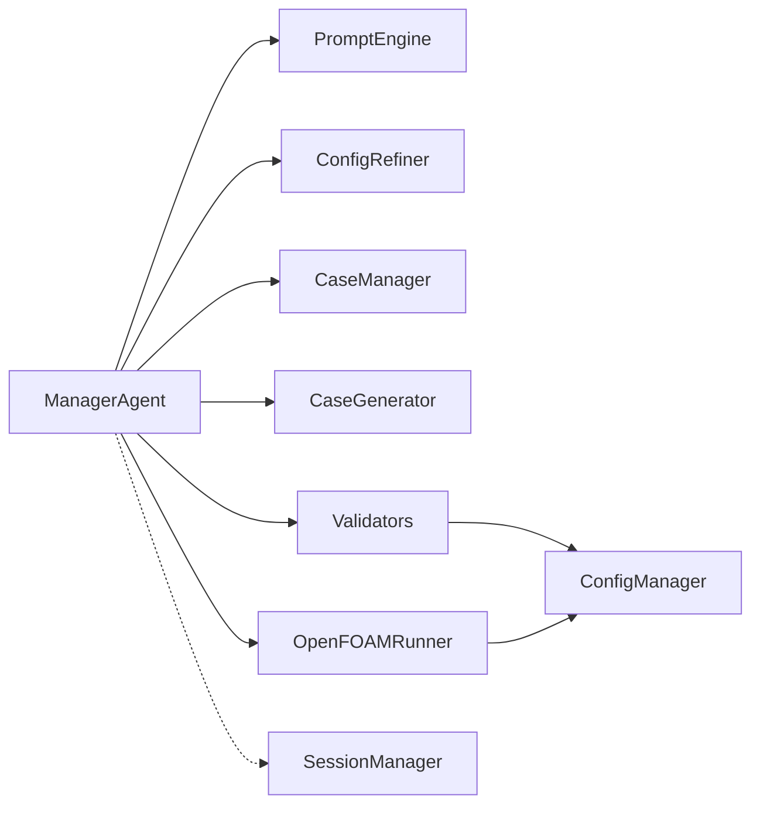

# 管理Agent模块

<cite>
**本文引用的文件**
- [manager_agent.py](file://openfoam_ai/agents/manager_agent.py)
- [prompt_engine.py](file://openfoam_ai/agents/prompt_engine.py)
- [case_manager.py](file://openfoam_ai/core/case_manager.py)
- [openfoam_runner.py](file://openfoam_ai/core/openfoam_runner.py)
- [validators.py](file://openfoam_ai/core/validators.py)
- [file_generator.py](file://openfoam_ai/core/file_generator.py)
- [session_manager.py](file://openfoam_ai/memory/session_manager.py)
- [system_constitution.yaml](file://openfoam_ai/config/system_constitution.yaml)
- [config_manager.py](file://openfoam_ai/core/config_manager.py)
</cite>

## 目录
1. [简介](#简介)
2. [项目结构](#项目结构)
3. [核心组件](#核心组件)
4. [架构总览](#架构总览)
5. [详细组件分析](#详细组件分析)
6. [依赖关系分析](#依赖关系分析)
7. [性能考虑](#性能考虑)
8. [故障排查指南](#故障排查指南)
9. [结论](#结论)
10. [附录](#附录)

## 简介
ManagerAgent 是 OpenFOAM AI 系统中的核心协调器，负责接收用户自然语言输入，将其意图识别为具体任务，生成可执行计划，并协调各子模块（提示词引擎、算例管理、文件生成、OpenFOAM 执行器、验证器等）完成端到端工作流。它还承担会话状态管理与关键操作确认机制，确保在复杂仿真流程中保持可控、可审计与可恢复。

## 项目结构
ManagerAgent 所属模块位于 openfoam_ai/agents 目录，围绕其协作的主要模块包括：
- 提示词引擎：将自然语言转为结构化配置
- 算例管理器：创建/管理 OpenFOAM 算例目录与元数据
- 文件生成器：将配置渲染为 OpenFOAM 字典文件
- OpenFOAM 执行器：执行 blockMesh/checkMesh/solver 并监控状态
- 验证器：基于宪法规则进行硬约束校验
- 会话管理器：维护多轮对话上下文与高风险操作确认

图表来源
- [manager_agent.py:38-458](file://openfoam_ai/agents/manager_agent.py#L38-L458)
- [prompt_engine.py:20-616](file://openfoam_ai/agents/prompt_engine.py#L20-L616)
- [case_manager.py:27-639](file://openfoam_ai/core/case_manager.py#L27-L639)
- [file_generator.py:506-635](file://openfoam_ai/core/file_generator.py#L506-L635)
- [openfoam_runner.py:44-548](file://openfoam_ai/core/openfoam_runner.py#L44-L548)
- [validators.py:13-441](file://openfoam_ai/core/validators.py#L13-L441)
- [config_manager.py:16-227](file://openfoam_ai/core/config_manager.py#L16-L227)
- [session_manager.py:171-565](file://openfoam_ai/memory/session_manager.py#L171-L565)

章节来源
- [manager_agent.py:38-458](file://openfoam_ai/agents/manager_agent.py#L38-L458)
- [prompt_engine.py:20-616](file://openfoam_ai/agents/prompt_engine.py#L20-L616)
- [case_manager.py:27-639](file://openfoam_ai/core/case_manager.py#L27-L639)
- [file_generator.py:506-635](file://openfoam_ai/core/file_generator.py#L506-L635)
- [openfoam_runner.py:44-548](file://openfoam_ai/core/openfoam_runner.py#L44-L548)
- [validators.py:13-441](file://openfoam_ai/core/validators.py#L13-L441)
- [config_manager.py:16-227](file://openfoam_ai/core/config_manager.py#L16-L227)
- [session_manager.py:171-565](file://openfoam_ai/memory/session_manager.py#L171-L565)

## 核心组件
- 数据类
  - TaskPlan：描述任务计划，包含步骤、是否需要确认、预估耗时等
  - ExecutionResult：封装执行结果，包含成功标志、消息、输出、日志
- 主要职责
  - 意图识别：将用户输入映射为 create/modify/run/status/help 等意图
  - 计划生成：基于配置生成可执行步骤清单
  - 执行控制：按计划执行创建/运行任务，处理确认与错误
  - 状态管理：维护当前算例、配置、执行历史
  - 与外部模块协作：PromptEngine、CaseManager、CaseGenerator、OpenFOAMRunner、Validators、SessionManager

章节来源
- [manager_agent.py:19-74](file://openfoam_ai/agents/manager_agent.py#L19-L74)
- [manager_agent.py:176-205](file://openfoam_ai/agents/manager_agent.py#L176-L205)
- [manager_agent.py:340-361](file://openfoam_ai/agents/manager_agent.py#L340-L361)

## 架构总览
ManagerAgent 的工作流从“自然语言输入”开始，经由 PromptEngine 与 ConfigRefiner 生成结构化配置，随后通过 Validators 进行宪法级硬约束校验；若通过，则生成 TaskPlan 并可进入执行阶段；执行阶段由 CaseManager 创建算例目录，CaseGenerator 生成 OpenFOAM 字典文件，OpenFOAMRunner 执行 blockMesh/checkMesh 与求解器，并通过 SolverMonitor 实时监控收敛状态；最后由 CaseManager 更新状态并在 SessionManager 中持久化会话上下文。

图表来源
- [manager_agent.py:75-104](file://openfoam_ai/agents/manager_agent.py#L75-L104)
- [prompt_engine.py:92-126](file://openfoam_ai/agents/prompt_engine.py#L92-L126)
- [validators.py:389-411](file://openfoam_ai/core/validators.py#L389-L411)
- [case_manager.py:51-86](file://openfoam_ai/core/case_manager.py#L51-L86)
- [file_generator.py:515-532](file://openfoam_ai/core/file_generator.py#L515-L532)
- [openfoam_runner.py:77-98](file://openfoam_ai/core/openfoam_runner.py#L77-L98)
- [openfoam_runner.py:299-301](file://openfoam_ai/core/openfoam_runner.py#L299-L301)
- [openfoam_runner.py:446-469](file://openfoam_ai/core/openfoam_runner.py#L446-L469)

## 详细组件分析

### ManagerAgent 类
- 设计理念
  - 以“任务为中心”的协调器：将复杂的仿真流程拆分为可确认、可回滚的步骤
  - 强调“确认优先”：对高风险操作（如创建/运行）默认要求用户确认
  - 与宪法规则强耦合：通过 Validators 与 ConfigManager 的宪法加载，确保生成配置符合硬约束
- 关键方法
  - process_input：意图识别与路由
  - _detect_intent：关键词匹配的简化版意图识别
  - _handle_create_case/_execute_create：创建算例的完整流程（目录、文件、网格、质量检查）
  - _handle_run_simulation/_execute_run：运行仿真并监控收敛状态
  - _generate_plan：生成可执行步骤清单
  - _summarize_config：生成配置摘要供用户确认
  - _handle_check_status/_handle_help：状态查询与帮助信息
- 数据类
  - TaskPlan：任务计划数据结构
  - ExecutionResult：执行结果数据结构

图表来源
- [manager_agent.py:38-458](file://openfoam_ai/agents/manager_agent.py#L38-L458)
- [manager_agent.py:19-36](file://openfoam_ai/agents/manager_agent.py#L19-L36)
- [manager_agent.py:29-36](file://openfoam_ai/agents/manager_agent.py#L29-L36)

章节来源
- [manager_agent.py:38-458](file://openfoam_ai/agents/manager_agent.py#L38-L458)

### PromptEngine 与 ConfigRefiner
- PromptEngine
  - 将自然语言转换为结构化配置，支持真实 API 与 Mock 模式
  - 提供解释配置与基于日志的改进建议能力
- ConfigRefiner
  - 在本地对 LLM 生成的配置进行优化与修正（如网格分辨率、时间步长、任务ID）
  - 提供关键参数的警告检查（网格数、求解器匹配、计算步数）

图表来源
- [prompt_engine.py:92-126](file://openfoam_ai/agents/prompt_engine.py#L92-L126)
- [prompt_engine.py:217-373](file://openfoam_ai/agents/prompt_engine.py#L217-L373)
- [validators.py:389-411](file://openfoam_ai/core/validators.py#L389-L411)
- [validators.py:51-87](file://openfoam_ai/core/validators.py#L51-L87)

章节来源
- [prompt_engine.py:20-616](file://openfoam_ai/agents/prompt_engine.py#L20-L616)
- [validators.py:13-441](file://openfoam_ai/core/validators.py#L13-L441)

### CaseManager 与 CaseGenerator
- CaseManager
  - 创建/复制/清理算例目录，维护 .case_info.json 元数据
  - 提供状态更新与算例列表查询
- CaseGenerator
  - 将配置渲染为 OpenFOAM 所需的 system/constant/0 目录文件
  - 自动生成 blockMeshDict、controlDict、fvSchemes、fvSolution、transportProperties 以及初始场

图表来源
- [case_manager.py:51-86](file://openfoam_ai/core/case_manager.py#L51-L86)
- [file_generator.py:515-532](file://openfoam_ai/core/file_generator.py#L515-L532)
- [file_generator.py:506-635](file://openfoam_ai/core/file_generator.py#L506-L635)

章节来源
- [case_manager.py:27-639](file://openfoam_ai/core/case_manager.py#L27-L639)
- [file_generator.py:506-635](file://openfoam_ai/core/file_generator.py#L506-L635)

### OpenFOAMRunner 与 SolverMonitor
- OpenFOAMRunner
  - 执行 blockMesh/checkMesh 与求解器命令，捕获日志并解析指标
  - 提供错误处理与进程管理（启动/等待/终止）
- SolverMonitor
  - 持续监控求解过程，检测收敛、发散、停滞
  - 生成摘要（最终时间、库朗数、残差、状态）

图表来源
- [openfoam_runner.py:77-98](file://openfoam_ai/core/openfoam_runner.py#L77-L98)
- [openfoam_runner.py:299-301](file://openfoam_ai/core/openfoam_runner.py#L299-L301)
- [openfoam_runner.py:446-469](file://openfoam_ai/core/openfoam_runner.py#L446-L469)
- [openfoam_runner.py:503-516](file://openfoam_ai/core/openfoam_runner.py#L503-L516)

章节来源
- [openfoam_runner.py:44-548](file://openfoam_ai/core/openfoam_runner.py#L44-L548)

### 会话管理与状态持久化
- SessionManager
  - 维护多轮对话历史、当前算例上下文、待确认操作队列
  - 提供高风险操作的风险等级与确认提示生成
  - 自动/手动保存会话，支持导出与统计

图表来源
- [session_manager.py:171-565](file://openfoam_ai/memory/session_manager.py#L171-L565)
- [session_manager.py:69-106](file://openfoam_ai/memory/session_manager.py#L69-L106)
- [session_manager.py:54-67](file://openfoam_ai/memory/session_manager.py#L54-L67)

章节来源
- [session_manager.py:171-565](file://openfoam_ai/memory/session_manager.py#L171-L565)

## 依赖关系分析
- 内聚性与耦合
  - ManagerAgent 与各子模块通过明确接口耦合：PromptEngine、CaseManager、CaseGenerator、OpenFOAMRunner、Validators、SessionManager
  - 与宪法规则的耦合通过 ConfigManager 与 validators 模块实现，避免硬编码
- 外部依赖
  - OpenFOAM 命令（blockMesh、checkMesh、求解器）与日志解析
  - LLM API（可选，Mock 模式下可禁用）
- 潜在循环依赖
  - 未发现循环依赖；模块间为单向调用链

图表来源
- [manager_agent.py:50-64](file://openfoam_ai/agents/manager_agent.py#L50-L64)
- [validators.py:13-15](file://openfoam_ai/core/validators.py#L13-L15)
- [config_manager.py:94-119](file://openfoam_ai/core/config_manager.py#L94-L119)
- [openfoam_runner.py:71-76](file://openfoam_ai/core/openfoam_runner.py#L71-L76)

章节来源
- [manager_agent.py:50-64](file://openfoam_ai/agents/manager_agent.py#L50-L64)
- [validators.py:13-15](file://openfoam_ai/core/validators.py#L13-L15)
- [config_manager.py:94-119](file://openfoam_ai/core/config_manager.py#L94-L119)

## 性能考虑
- 配置优化
  - ConfigRefiner 限制网格分辨率与时间步长范围，避免过长计算时间
  - 基于宪法的 CFL 估计与阈值，减少无效尝试
- 执行器优化
  - OpenFOAMRunner 使用流式日志解析，避免一次性读取大文件
  - SolverMonitor 限制历史长度，控制内存占用
- I/O 与并发
  - 文件生成采用批量写入，减少磁盘抖动
  - 会话持久化采用增量保存策略，避免频繁写盘

[本节为通用指导，无需特定文件引用]

## 故障排查指南
- 意图识别失败
  - 检查输入关键词是否覆盖（中文/英文）；可扩展关键词集合
- 配置验证失败
  - 查看 Validators 抛出的具体错误；关注网格数、求解器匹配、CFL 条件
- 网格生成失败
  - 检查 blockMesh 日志；确认几何与边界定义
- 求解器异常
  - 检查 SolverMonitor 的状态与指标；关注库朗数与残差
- 会话丢失
  - 确认 SessionStore 路径可写；检查自动保存触发条件

章节来源
- [manager_agent.py:106-140](file://openfoam_ai/agents/manager_agent.py#L106-L140)
- [validators.py:389-411](file://openfoam_ai/core/validators.py#L389-L411)
- [openfoam_runner.py:118-142](file://openfoam_ai/core/openfoam_runner.py#L118-L142)
- [session_manager.py:445-448](file://openfoam_ai/memory/session_manager.py#L445-L448)

## 结论
ManagerAgent 通过清晰的任务计划与严格的宪法约束，将自然语言转化为可执行的仿真流程。其模块化设计与强健的错误处理机制，使得复杂仿真任务在可控、可审计的状态下完成。配合会话管理与高风险操作确认，进一步提升了系统的安全性与用户体验。

[本节为总结性内容，无需特定文件引用]

## 附录

### 配置选项说明
- ManagerAgent
  - require_confirmation：是否需要用户确认
  - auto_fix：是否自动修复（如检测到发散趋势）
- PromptEngine
  - api_key/model：真实 API 模式；Mock 模式下降级
- OpenFOAMRunner
  - courant_limit/divergence_threshold/residual_target：从宪法加载的阈值
- ConfigManager
  - system_constitution.yaml：宪法规则（网格、求解器、物理约束、错误处理等）

章节来源
- [manager_agent.py:72-73](file://openfoam_ai/agents/manager_agent.py#L72-L73)
- [prompt_engine.py:75-91](file://openfoam_ai/agents/prompt_engine.py#L75-L91)
- [openfoam_runner.py:71-76](file://openfoam_ai/core/openfoam_runner.py#L71-L76)
- [config_manager.py:94-119](file://openfoam_ai/core/config_manager.py#L94-L119)
- [system_constitution.yaml:13-52](file://openfoam_ai/config/system_constitution.yaml#L13-L52)

### 错误处理策略
- 输入层：意图识别失败返回帮助信息
- 配置层：验证失败返回错误列表与建议
- 执行层：命令执行失败记录日志并返回失败结果
- 监控层：发散/停滞检测，自动修复或提示调整

章节来源
- [manager_agent.py:154-158](file://openfoam_ai/agents/manager_agent.py#L154-L158)
- [openfoam_runner.py:118-142](file://openfoam_ai/core/openfoam_runner.py#L118-L142)
- [openfoam_runner.py:399-408](file://openfoam_ai/core/openfoam_runner.py#L399-L408)

### 性能优化建议
- 合理设置时间步长与写入间隔，兼顾精度与效率
- 使用合理的网格分辨率，避免过细或过粗
- 在会话管理中限制历史长度，减少内存占用
- 对于长时间仿真，启用自动保存与断点续跑

[本节为通用指导，无需特定文件引用]

### 代码示例（路径引用）
- 初始化 ManagerAgent
  - [manager_agent.py:50-64](file://openfoam_ai/agents/manager_agent.py#L50-L64)
- 处理用户输入
  - [manager_agent.py:75-104](file://openfoam_ai/agents/manager_agent.py#L75-L104)
- 生成执行计划
  - [manager_agent.py:340-361](file://openfoam_ai/agents/manager_agent.py#L340-L361)
- 执行创建任务
  - [manager_agent.py:207-266](file://openfoam_ai/agents/manager_agent.py#L207-L266)
- 执行运行任务
  - [manager_agent.py:268-338](file://openfoam_ai/agents/manager_agent.py#L268-L338)
- 生成配置（PromptEngine）
  - [prompt_engine.py:92-126](file://openfoam_ai/agents/prompt_engine.py#L92-L126)
- 优化配置（ConfigRefiner）
  - [prompt_engine.py:485-532](file://openfoam_ai/agents/prompt_engine.py#L485-L532)
- 验证配置（Validators）
  - [validators.py:389-411](file://openfoam_ai/core/validators.py#L389-L411)
- 生成算例文件
  - [file_generator.py:515-532](file://openfoam_ai/core/file_generator.py#L515-L532)
- 执行网格与求解器
  - [openfoam_runner.py:77-98](file://openfoam_ai/core/openfoam_runner.py#L77-L98)
  - [openfoam_runner.py:299-301](file://openfoam_ai/core/openfoam_runner.py#L299-L301)
- 监控求解过程
  - [openfoam_runner.py:446-469](file://openfoam_ai/core/openfoam_runner.py#L446-L469)
- 会话管理
  - [session_manager.py:229-253](file://openfoam_ai/memory/session_manager.py#L229-L253)
  - [session_manager.py:304-333](file://openfoam_ai/memory/session_manager.py#L304-L333)