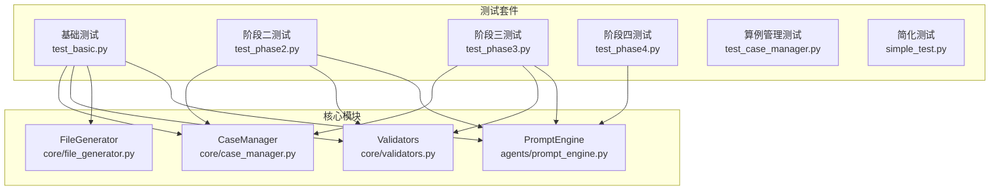
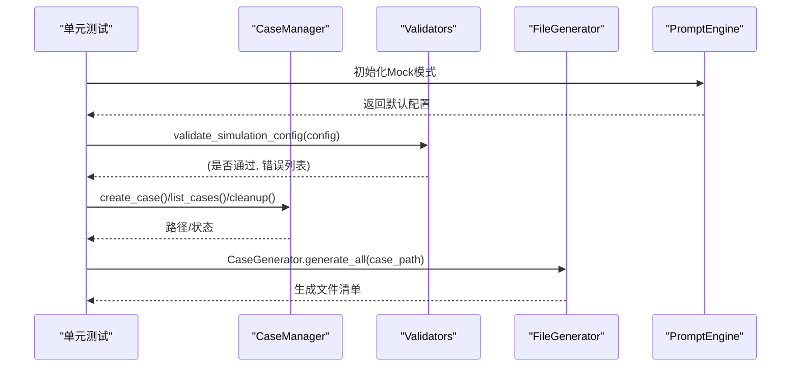
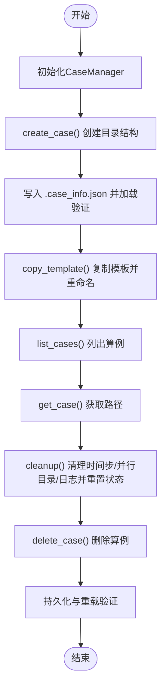
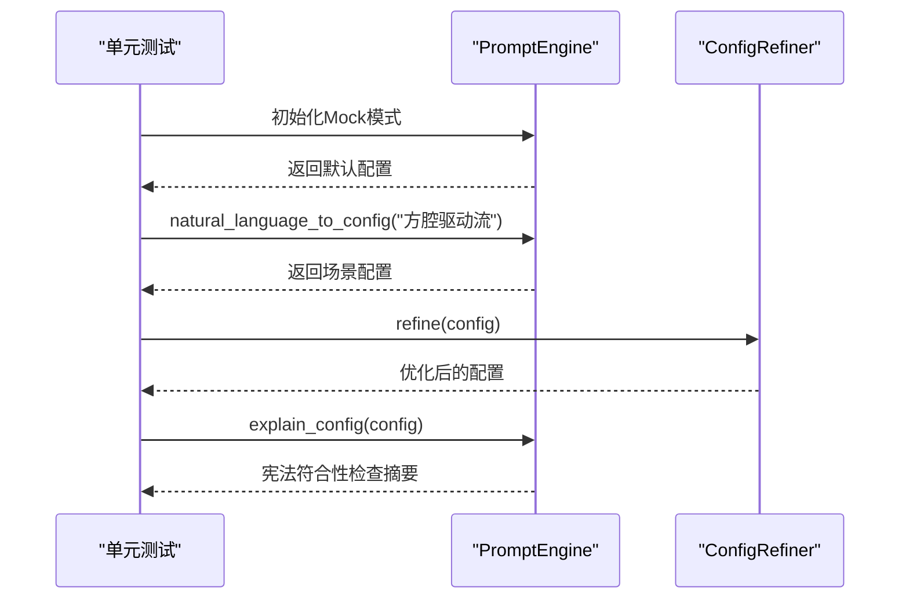
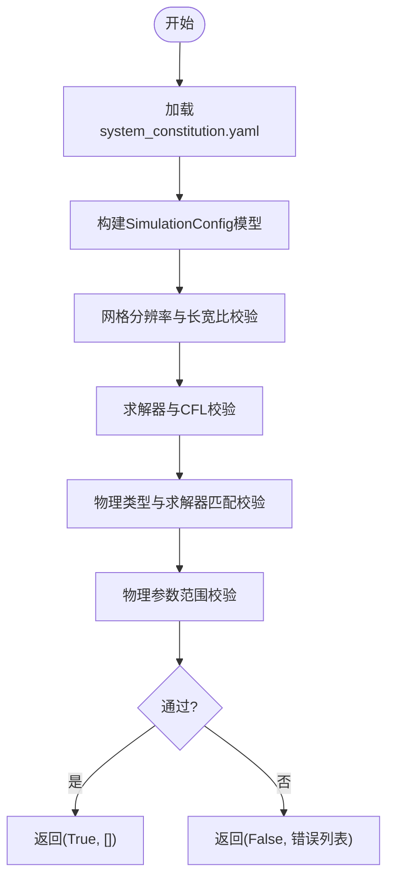
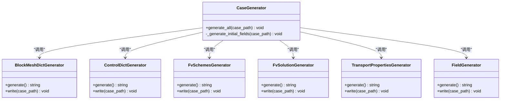
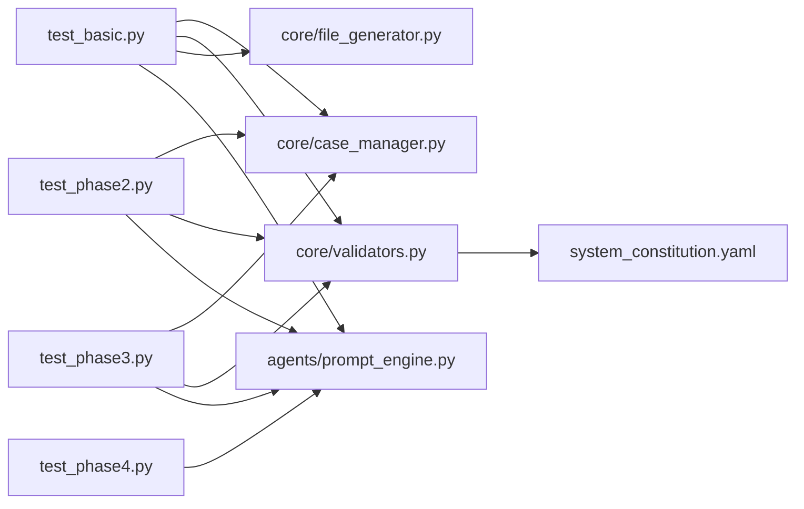

# 单元测试

<cite>
**本文引用的文件**
- [openfoam_ai/tests/test_case_manager.py](file://openfoam_ai/tests/test_case_manager.py)
- [openfoam_ai/tests/test_basic.py](file://openfoam_ai/tests/test_basic.py)
- [openfoam_ai/tests/test_phase2.py](file://openfoam_ai/tests/test_phase2.py)
- [openfoam_ai/tests/test_phase3.py](file://openfoam_ai/tests/test_phase3.py)
- [openfoam_ai/tests/test_phase4.py](file://openfoam_ai/tests/test_phase4.py)
- [openfoam_ai/core/case_manager.py](file://openfoam_ai/core/case_manager.py)
- [openfoam_ai/core/validators.py](file://openfoam_ai/core/validators.py)
- [openfoam_ai/core/file_generator.py](file://openfoam_ai/core/file_generator.py)
- [openfoam_ai/agents/prompt_engine.py](file://openfoam_ai/agents/prompt_engine.py)
- [openfoam_ai/config/system_constitution.yaml](file://openfoam_ai/config/system_constitution.yaml)
- [openfoam_ai/tests/simple_test.py](file://openfoam_ai/tests/simple_test.py)
</cite>

## 目录
1. [引言](#引言)
2. [项目结构](#项目结构)
3. [核心组件](#核心组件)
4. [架构总览](#架构总览)
5. [详细组件分析](#详细组件分析)
6. [依赖分析](#依赖分析)
7. [性能考虑](#性能考虑)
8. [故障排查指南](#故障排查指南)
9. [结论](#结论)
10. [附录](#附录)

## 引言
本文件面向OpenFOAM AI项目的单元测试体系，系统梳理各核心模块的测试设计理念、测试策略与覆盖范围，并给出针对CaseManager、PromptEngine、Validators、FileGenerator等关键模块的测试实现方法、断言策略、Mock对象使用与测试数据准备建议。文档同时提供测试执行方法与最佳实践，帮助开发者编写高质量的单元测试。

## 项目结构
OpenFOAM AI的测试分布在openfoam_ai/tests目录下，按阶段划分：
- 基础测试：验证模块导入与基本功能
- 阶段二测试：网格质量、自愈、物理校验、审查者Agent
- 阶段三测试：记忆管理、配置差异分析、会话管理
- 阶段四测试：几何图像解析与后处理Agent
- 简化测试：语法与结构验证

图表来源
- [openfoam_ai/tests/test_basic.py:1-270](file://openfoam_ai/tests/test_basic.py#L1-L270)
- [openfoam_ai/tests/test_phase2.py:1-411](file://openfoam_ai/tests/test_phase2.py#L1-L411)
- [openfoam_ai/tests/test_phase3.py:1-549](file://openfoam_ai/tests/test_phase3.py#L1-L549)
- [openfoam_ai/tests/test_phase4.py:1-183](file://openfoam_ai/tests/test_phase4.py#L1-L183)
- [openfoam_ai/tests/test_case_manager.py:1-180](file://openfoam_ai/tests/test_case_manager.py#L1-L180)
- [openfoam_ai/tests/simple_test.py:1-114](file://openfoam_ai/tests/simple_test.py#L1-L114)

章节来源
- [openfoam_ai/tests/test_basic.py:1-270](file://openfoam_ai/tests/test_basic.py#L1-L270)
- [openfoam_ai/tests/test_phase2.py:1-411](file://openfoam_ai/tests/test_phase2.py#L1-L411)
- [openfoam_ai/tests/test_phase3.py:1-549](file://openfoam_ai/tests/test_phase3.py#L1-L549)
- [openfoam_ai/tests/test_phase4.py:1-183](file://openfoam_ai/tests/test_phase4.py#L1-L183)
- [openfoam_ai/tests/test_case_manager.py:1-180](file://openfoam_ai/tests/test_case_manager.py#L1-L180)
- [openfoam_ai/tests/simple_test.py:1-114](file://openfoam_ai/tests/simple_test.py#L1-L114)

## 核心组件
- CaseManager：负责创建、复制、清理、删除算例，维护算例信息与状态。
- Validators：基于Pydantic的硬约束验证器，结合system_constitution.yaml中的宪法规则进行配置校验。
- FileGenerator：将结构化配置转换为OpenFOAM字典文件，生成blockMeshDict、controlDict、fvSchemes、fvSolution、场文件等。
- PromptEngine：将自然语言转换为结构化配置，支持Mock模式与配置优化器。

章节来源
- [openfoam_ai/core/case_manager.py:1-639](file://openfoam_ai/core/case_manager.py#L1-L639)
- [openfoam_ai/core/validators.py:1-441](file://openfoam_ai/core/validators.py#L1-L441)
- [openfoam_ai/core/file_generator.py:1-635](file://openfoam_ai/core/file_generator.py#L1-L635)
- [openfoam_ai/agents/prompt_engine.py:1-616](file://openfoam_ai/agents/prompt_engine.py#L1-L616)
- [openfoam_ai/config/system_constitution.yaml:1-103](file://openfoam_ai/config/system_constitution.yaml#L1-L103)

## 架构总览
单元测试围绕“模块导入—功能验证—Mock模式—集成流程”展开，既覆盖单模块行为，也验证跨模块协作。

图表来源
- [openfoam_ai/tests/test_basic.py:185-226](file://openfoam_ai/tests/test_basic.py#L185-L226)
- [openfoam_ai/tests/test_basic.py:131-183](file://openfoam_ai/tests/test_basic.py#L131-L183)
- [openfoam_ai/tests/test_basic.py:84-129](file://openfoam_ai/tests/test_basic.py#L84-L129)
- [openfoam_ai/tests/test_basic.py:61-82](file://openfoam_ai/tests/test_basic.py#L61-L82)
- [openfoam_ai/agents/prompt_engine.py:75-91](file://openfoam_ai/agents/prompt_engine.py#L75-L91)
- [openfoam_ai/core/validators.py:389-411](file://openfoam_ai/core/validators.py#L389-L411)
- [openfoam_ai/core/case_manager.py:51-86](file://openfoam_ai/core/case_manager.py#L51-L86)
- [openfoam_ai/core/file_generator.py:506-532](file://openfoam_ai/core/file_generator.py#L506-L532)

## 详细组件分析

### CaseManager 单元测试
- 设计理念：以“临时目录隔离+断言文件存在性/内容一致性”为核心，确保算例目录结构、信息持久化与清理逻辑正确。
- 测试覆盖：
  - 初始化与路径有效性
  - 创建算例目录结构与.info文件
  - 从模板复制算例与文件一致性
  - 列出算例、获取算例路径
  - 清理算例（时间步、并行目录、日志）、状态重置
  - 删除算例
  - 算例信息持久化与重载
- 断言策略：路径存在性、目录结构完整性、JSON信息字段一致性、状态变更。
- Mock与测试数据：使用tempfile.TemporaryDirectory()创建隔离环境；通过直接读写文件验证内容。
- 执行方法：支持pytest或直接运行脚本。

图表来源
- [openfoam_ai/tests/test_case_manager.py:18-180](file://openfoam_ai/tests/test_case_manager.py#L18-L180)
- [openfoam_ai/core/case_manager.py:51-261](file://openfoam_ai/core/case_manager.py#L51-L261)

章节来源
- [openfoam_ai/tests/test_case_manager.py:1-180](file://openfoam_ai/tests/test_case_manager.py#L1-L180)
- [openfoam_ai/core/case_manager.py:1-639](file://openfoam_ai/core/case_manager.py#L1-L639)

### PromptEngine 单元测试
- 设计理念：Mock模式下模拟不同场景（方腔、管道、翼型、传热、多相流），确保输出符合宪法规则与典型配置。
- 测试覆盖：
  - 初始化（Mock模式）与自然语言转配置
  - 配置解释（宪法符合性检查）
  - 配置优化（网格、时间步长、求解器匹配）
- 断言策略：输出配置字段完整性、网格数满足宪法最小值、CFL估计在安全范围内、边界条件摘要。
- Mock与测试数据：内置场景字典，关键词匹配，自动提升分辨率以满足宪法要求。
- 执行方法：unittest或pytest。

图表来源
- [openfoam_ai/tests/test_basic.py:185-226](file://openfoam_ai/tests/test_basic.py#L185-L226)
- [openfoam_ai/agents/prompt_engine.py:75-91](file://openfoam_ai/agents/prompt_engine.py#L75-L91)
- [openfoam_ai/agents/prompt_engine.py:217-374](file://openfoam_ai/agents/prompt_engine.py#L217-L374)
- [openfoam_ai/agents/prompt_engine.py:485-533](file://openfoam_ai/agents/prompt_engine.py#L485-L533)

章节来源
- [openfoam_ai/tests/test_basic.py:185-226](file://openfoam_ai/tests/test_basic.py#L185-L226)
- [openfoam_ai/agents/prompt_engine.py:1-616](file://openfoam_ai/agents/prompt_engine.py#L1-L616)

### Validators 单元测试
- 设计理念：基于Pydantic的硬约束验证，结合system_constitution.yaml中的宪法规则，确保配置在网格、求解器、边界条件、物理参数等方面合理。
- 测试覆盖：
  - 有效配置验证通过
  - 无效配置（网格过小、长宽比过大、CFL超限、求解器与物理类型不匹配）识别
  - 物理一致性校验（质量/能量守恒、边界兼容性）
- 断言策略：返回值布尔标志与错误列表；对关键字段（网格数、长宽比、CFL、求解器）进行数值范围与组合约束检查。
- Mock与测试数据：使用测试配置字典，覆盖不同场景与边界条件。
- 执行方法：unittest或pytest。

图表来源
- [openfoam_ai/tests/test_basic.py:84-129](file://openfoam_ai/tests/test_basic.py#L84-L129)
- [openfoam_ai/core/validators.py:13-16](file://openfoam_ai/core/validators.py#L13-L16)
- [openfoam_ai/core/validators.py:179-275](file://openfoam_ai/core/validators.py#L179-L275)
- [openfoam_ai/core/validators.py:277-387](file://openfoam_ai/core/validators.py#L277-L387)
- [openfoam_ai/config/system_constitution.yaml:13-65](file://openfoam_ai/config/system_constitution.yaml#L13-L65)

章节来源
- [openfoam_ai/tests/test_basic.py:84-129](file://openfoam_ai/tests/test_basic.py#L84-L129)
- [openfoam_ai/core/validators.py:1-441](file://openfoam_ai/core/validators.py#L1-L441)
- [openfoam_ai/config/system_constitution.yaml:1-103](file://openfoam_ai/config/system_constitution.yaml#L1-L103)

### FileGenerator 单元测试
- 设计理念：验证从配置到OpenFOAM字典文件的转换过程，确保生成文件的完整性与正确性。
- 测试覆盖：
  - 生成blockMeshDict、controlDict、fvSchemes、fvSolution、transportProperties
  - 初始场文件（U、p、T）生成与边界条件格式化
  - CaseGenerator.generate_all()整合生成
- 断言策略：遍历预期文件路径，验证文件存在与内容片段（如头部、关键字、求解器设置）。
- Mock与测试数据：使用临时目录与最小配置，确保生成文件结构一致。
- 执行方法：unittest或pytest。

图表来源
- [openfoam_ai/tests/test_basic.py:131-183](file://openfoam_ai/tests/test_basic.py#L131-L183)
- [openfoam_ai/core/file_generator.py:506-603](file://openfoam_ai/core/file_generator.py#L506-L603)

章节来源
- [openfoam_ai/tests/test_basic.py:131-183](file://openfoam_ai/tests/test_basic.py#L131-L183)
- [openfoam_ai/core/file_generator.py:1-635](file://openfoam_ai/core/file_generator.py#L1-L635)

### 阶段二（AI自查与自愈）单元测试
- 设计理念：验证网格质量检查、自愈控制、物理一致性校验与审查者Agent的逻辑。
- 测试覆盖：
  - 网格质量评估（优秀/临界等级）、问题识别、修复策略（如添加非正交修正器）
  - 稳定性监控（库朗数、残差爆炸）、自愈控制器修复流程
  - 物理校验（质量/能量守恒、收敛性）
  - 审查者Agent（宪法规则检查、评分与结论）
- 断言策略：质量等级枚举值、事件类型与严重性、配置修改前后对比、验证结果通过/失败。
- Mock与测试数据：使用临时目录与预置文件（如fvSolution、controlDict），模拟不同指标场景。
- 执行方法：unittest。

章节来源
- [openfoam_ai/tests/test_phase2.py:1-411](file://openfoam_ai/tests/test_phase2.py#L1-L411)

### 阶段三（记忆性建模与充分交互）单元测试
- 设计理念：验证记忆管理、配置差异分析、会话管理与交互流程。
- 测试覆盖：
  - 配置差异计算（新增、删除、修改）、差异应用
  - 记忆存储、相似检索、历史查询、增量更新、统计与导出导入
  - 会话消息管理、当前算例设置、待确认操作、风险级别判断、确认提示生成、会话持久化
- 断言策略：差异对象has_changes与修改项、记忆历史长度、会话消息与上下文状态。
- Mock与测试数据：MemoryManager使用mock模式，SessionManager使用临时存储路径。
- 执行方法：unittest。

章节来源
- [openfoam_ai/tests/test_phase3.py:1-549](file://openfoam_ai/tests/test_phase3.py#L1-L549)

### 阶段四（几何图像解析与后处理）单元测试
- 设计理念：验证几何图像解析Agent与后处理Agent的Mock模式与工作流。
- 测试覆盖：
  - 几何图像解析（方腔、管道等类型识别）
  - 将几何特征转换为仿真配置
  - 后处理Agent解析自然语言绘图请求、生成脚本、Mock执行
  - 完整工作流（解析→转换→绘图）
- 断言策略：几何类型枚举、配置对象字段、PlotRequest解析结果、脚本内容片段。
- Mock与测试数据：使用临时文件模拟图像与输出路径。
- 执行方法：unittest。

章节来源
- [openfoam_ai/tests/test_phase4.py:1-183](file://openfoam_ai/tests/test_phase4.py#L1-L183)

## 依赖分析
- 测试对模块的依赖：
  - 基础测试依赖core与agents模块的导入与基本功能
  - 阶段二测试依赖core.openfoam_runner的SolverMetrics结构
  - Validators依赖system_constitution.yaml中的宪法规则
  - FileGenerator依赖Jinja2模板（在生成器内部使用）
- 循环依赖规避：测试通过sys.path插入项目根目录，避免相对导入引起的循环依赖

图表来源
- [openfoam_ai/tests/test_basic.py:1-270](file://openfoam_ai/tests/test_basic.py#L1-L270)
- [openfoam_ai/tests/test_phase2.py:1-411](file://openfoam_ai/tests/test_phase2.py#L1-L411)
- [openfoam_ai/tests/test_phase3.py:1-549](file://openfoam_ai/tests/test_phase3.py#L1-L549)
- [openfoam_ai/tests/test_phase4.py:1-183](file://openfoam_ai/tests/test_phase4.py#L1-L183)
- [openfoam_ai/core/validators.py:13-16](file://openfoam_ai/core/validators.py#L13-L16)
- [openfoam_ai/config/system_constitution.yaml:1-103](file://openfoam_ai/config/system_constitution.yaml#L1-L103)

章节来源
- [openfoam_ai/tests/test_basic.py:1-270](file://openfoam_ai/tests/test_basic.py#L1-L270)
- [openfoam_ai/tests/test_phase2.py:1-411](file://openfoam_ai/tests/test_phase2.py#L1-L411)
- [openfoam_ai/tests/test_phase3.py:1-549](file://openfoam_ai/tests/test_phase3.py#L1-L549)
- [openfoam_ai/tests/test_phase4.py:1-183](file://openfoam_ai/tests/test_phase4.py#L1-L183)
- [openfoam_ai/core/validators.py:1-441](file://openfoam_ai/core/validators.py#L1-L441)
- [openfoam_ai/config/system_constitution.yaml:1-103](file://openfoam_ai/config/system_constitution.yaml#L1-L103)

## 性能考虑
- 测试隔离：使用tempfile.TemporaryDirectory()确保测试互不干扰，避免磁盘IO开销。
- Mock优先：PromptEngine与MemoryManager在测试中使用Mock模式，减少外部依赖与网络延迟。
- 最小化断言：仅断言关键路径与边界条件，避免冗余检查导致测试缓慢。
- 并行执行：建议使用pytest并行插件（如pytest-xdist）加速阶段内测试。

## 故障排查指南
- 导入失败：检查sys.path是否正确插入项目根目录；确认模块路径与文件名一致。
- Mock模式异常：确认未安装openai或未提供API密钥，此时PromptEngine进入Mock模式。
- 配置验证失败：核对system_constitution.yaml中的宪法规则，确保配置满足网格最小数、长宽比、CFL等约束。
- 文件生成缺失：检查CaseGenerator.generate_all()是否在目标目录创建了system/constant/0等必要子目录。
- 阶段二Agent异常：确认临时目录中存在controlDict、fvSolution等文件，且内容符合预期。

章节来源
- [openfoam_ai/tests/test_basic.py:12-59](file://openfoam_ai/tests/test_basic.py#L12-L59)
- [openfoam_ai/agents/prompt_engine.py:75-91](file://openfoam_ai/agents/prompt_engine.py#L75-L91)
- [openfoam_ai/core/validators.py:389-411](file://openfoam_ai/core/validators.py#L389-L411)
- [openfoam_ai/core/file_generator.py:515-532](file://openfoam_ai/core/file_generator.py#L515-L532)
- [openfoam_ai/tests/test_phase2.py:150-176](file://openfoam_ai/tests/test_phase2.py#L150-L176)

## 结论
OpenFOAM AI的单元测试体系以“Mock模式+最小化外部依赖+严格断言”为核心，覆盖从配置生成、算例管理到AI自查与自愈、记忆与会话、几何解析与后处理的全链路。通过宪法规则驱动的验证器与严格的文件生成器，测试确保配置与文件的合规性与一致性。建议在持续集成中启用并行执行与覆盖率统计，进一步提升测试效率与质量。

## 附录
- 测试执行方法
  - 基础测试：python -m pytest openfoam_ai/tests/test_basic.py -v 或直接运行脚本
  - 阶段二测试：python -m pytest openfoam_ai/tests/test_phase2.py -v
  - 阶段三测试：python -m pytest openfoam_ai/tests/test_phase3.py -v
  - 阶段四测试：python -m pytest openfoam_ai/tests/test_phase4.py -v
  - 算例管理测试：python -m pytest openfoam_ai/tests/test_case_manager.py -v
  - 简化测试：python openfoam_ai/tests/simple_test.py
- 测试数据准备
  - 使用tempfile.TemporaryDirectory()创建隔离目录
  - 在测试中手动创建必要子目录（如0、constant、system、logs）
  - 对于阶段二测试，提前写入controlDict、fvSolution等文件以模拟运行状态
- 最佳实践
  - 为每个模块编写独立的测试文件，保持关注点分离
  - 使用Mock模式替代真实API调用，确保测试稳定
  - 对关键路径（如配置验证、文件生成）增加边界条件测试
  - 使用pytest标记（@pytest.mark.parametrize）扩展参数化测试