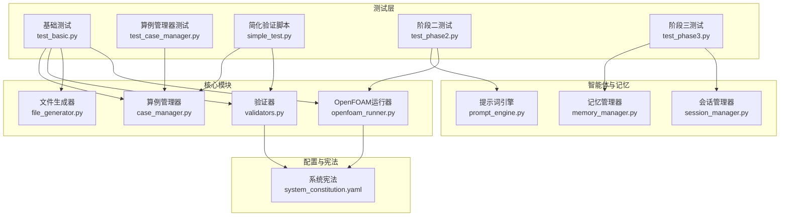
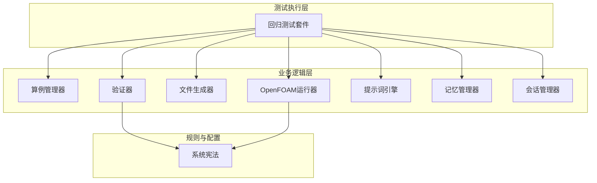
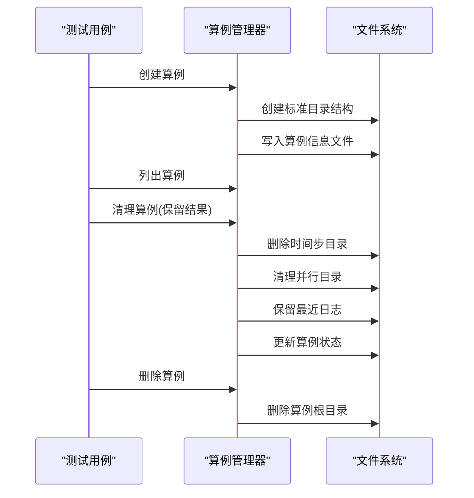
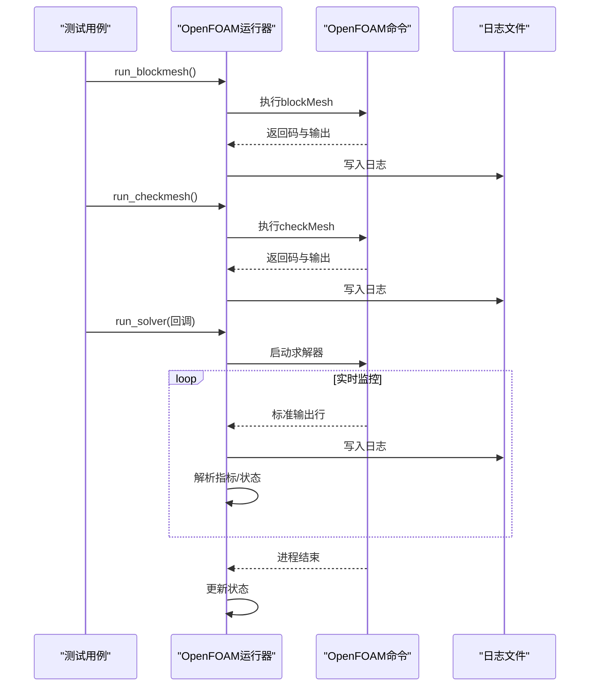
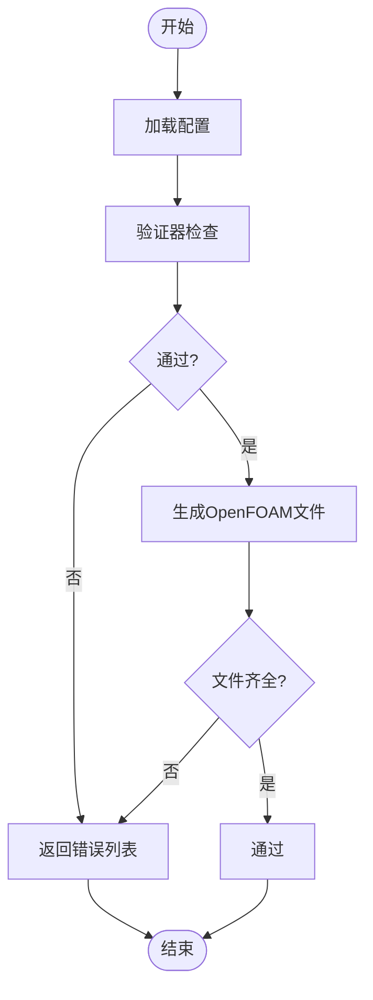
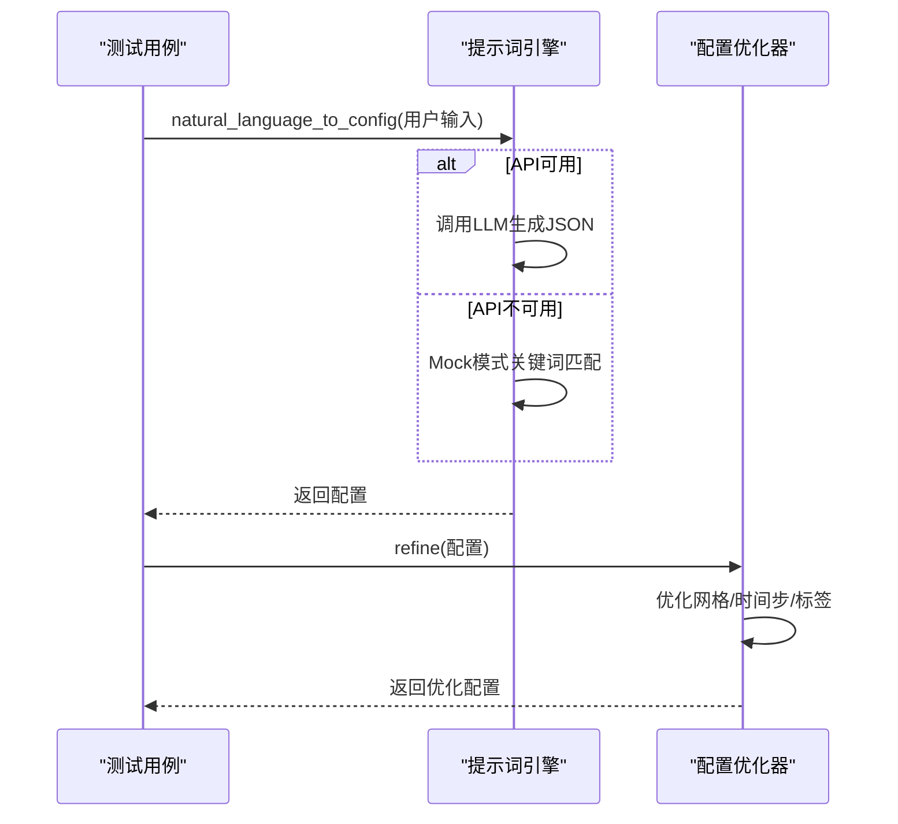
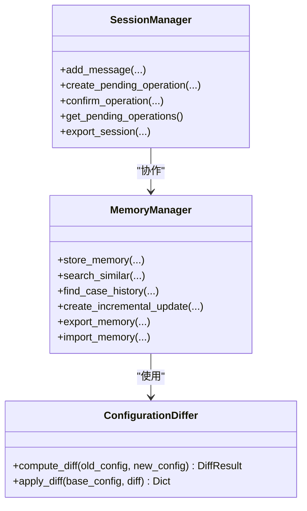
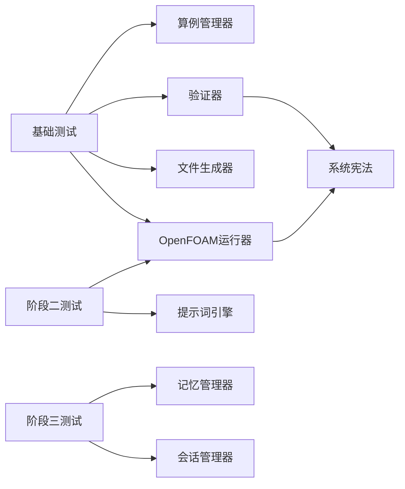

# 回归测试

<cite>
**本文引用的文件**
- [openfoam_ai\tests\test_basic.py](file://openfoam_ai/tests/test_basic.py)
- [openfoam_ai\tests\test_case_manager.py](file://openfoam_ai/tests/test_case_manager.py)
- [openfoam_ai\tests\simple_test.py](file://openfoam_ai/tests/simple_test.py)
- [openfoam_ai\tests\test_phase2.py](file://openfoam_ai/tests/test_phase2.py)
- [openfoam_ai\tests\test_phase3.py](file://openfoam_ai/tests/test_phase3.py)
- [openfoam_ai\core\case_manager.py](file://openfoam_ai/core/case_manager.py)
- [openfoam_ai\core\openfoam_runner.py](file://openfoam_ai/core/openfoam_runner.py)
- [openfoam_ai\core\validators.py](file://openfoam_ai/core/validators.py)
- [openfoam_ai\core\file_generator.py](file://openfoam_ai/core/file_generator.py)
- [openfoam_ai\agents\prompt_engine.py](file://openfoam_ai/agents/prompt_engine.py)
- [openfoam_ai\memory\memory_manager.py](file://openfoam_ai/memory/memory_manager.py)
- [openfoam_ai\memory\session_manager.py](file://openfoam_ai/memory/session_manager.py)
- [openfoam_ai\config\system_constitution.yaml](file://openfoam_ai/config/system_constitution.yaml)
</cite>

## 目录
1. [引言](#引言)
2. [项目结构](#项目结构)
3. [核心组件](#核心组件)
4. [架构总览](#架构总览)
5. [详细组件分析](#详细组件分析)
6. [依赖分析](#依赖分析)
7. [性能考虑](#性能考虑)
8. [故障排查指南](#故障排查指南)
9. [结论](#结论)
10. [附录](#附录)

## 引言
本文件面向OpenFOAM AI项目的回归测试体系，旨在建立一套系统化、可重复、可扩展的自动化回归测试方案。回归测试的核心目标是确保每次新增功能或修改代码不会破坏现有功能，保障项目在持续演进过程中的质量与稳定性。本文将结合项目现有测试用例与核心模块，给出测试策略、执行频率、覆盖率统计、结果对比与缺陷追踪机制，并提供最佳实践与环境稳定性保障建议。

## 项目结构
OpenFOAM AI采用模块化设计，测试覆盖了核心功能、Agent模块、记忆与会话管理、以及UI接口等关键路径。测试文件组织清晰，既有单元级测试，也有端到端集成测试，便于构建完整的回归测试矩阵。

图示来源
- [openfoam_ai\tests\test_basic.py:1-270](file://openfoam_ai/tests/test_basic.py#L1-L270)
- [openfoam_ai\tests\test_case_manager.py:1-180](file://openfoam_ai/tests/test_case_manager.py#L1-L180)
- [openfoam_ai\tests\simple_test.py:1-114](file://openfoam_ai/tests/simple_test.py#L1-L114)
- [openfoam_ai\tests\test_phase2.py:1-411](file://openfoam_ai/tests/test_phase2.py#L1-L411)
- [openfoam_ai\tests\test_phase3.py:1-549](file://openfoam_ai/tests/test_phase3.py#L1-L549)
- [openfoam_ai\core\case_manager.py:1-639](file://openfoam_ai/core/case_manager.py#L1-L639)
- [openfoam_ai\core\openfoam_runner.py:1-548](file://openfoam_ai/core/openfoam_runner.py#L1-L548)
- [openfoam_ai\core\validators.py:1-441](file://openfoam_ai/core/validators.py#L1-L441)
- [openfoam_ai\core\file_generator.py:1-635](file://openfoam_ai/core/file_generator.py#L1-L635)
- [openfoam_ai\agents\prompt_engine.py:1-616](file://openfoam_ai/agents/prompt_engine.py#L1-L616)
- [openfoam_ai\memory\memory_manager.py:1-804](file://openfoam_ai/memory/memory_manager.py#L1-L804)
- [openfoam_ai\memory\session_manager.py:1-565](file://openfoam_ai/memory/session_manager.py#L1-L565)
- [openfoam_ai\config\system_constitution.yaml:1-103](file://openfoam_ai/config/system_constitution.yaml#L1-L103)

章节来源
- [openfoam_ai\tests\test_basic.py:1-270](file://openfoam_ai/tests/test_basic.py#L1-L270)
- [openfoam_ai\tests\test_case_manager.py:1-180](file://openfoam_ai/tests/test_case_manager.py#L1-L180)
- [openfoam_ai\tests\simple_test.py:1-114](file://openfoam_ai/tests/simple_test.py#L1-L114)
- [openfoam_ai\tests\test_phase2.py:1-411](file://openfoam_ai/tests/test_phase2.py#L1-L411)
- [openfoam_ai\tests\test_phase3.py:1-549](file://openfoam_ai/tests/test_phase3.py#L1-L549)

## 核心组件
- 算例管理器：负责创建、复制、清理、删除算例，维护算例信息与状态。
- OpenFOAM运行器：封装OpenFOAM命令执行、日志捕获、收敛与稳定性监控。
- 验证器：基于宪法规则与Pydantic模型进行配置合法性与物理一致性验证。
- 文件生成器：将结构化配置转换为OpenFOAM字典文件。
- 提示词引擎：将自然语言转换为结构化配置，支持Mock模式与配置优化。
- 记忆与会话：支持配置历史检索、增量更新与对话上下文管理。
- 系统宪法：定义网格、求解器、物理参数等约束与质量检查流程。

章节来源
- [openfoam_ai\core\case_manager.py:1-639](file://openfoam_ai/core/case_manager.py#L1-L639)
- [openfoam_ai\core\openfoam_runner.py:1-548](file://openfoam_ai/core/openfoam_runner.py#L1-L548)
- [openfoam_ai\core\validators.py:1-441](file://openfoam_ai/core/validators.py#L1-L441)
- [openfoam_ai\core\file_generator.py:1-635](file://openfoam_ai/core/file_generator.py#L1-L635)
- [openfoam_ai\agents\prompt_engine.py:1-616](file://openfoam_ai/agents/prompt_engine.py#L1-L616)
- [openfoam_ai\memory\memory_manager.py:1-804](file://openfoam_ai/memory/memory_manager.py#L1-L804)
- [openfoam_ai\memory\session_manager.py:1-565](file://openfoam_ai/memory/session_manager.py#L1-L565)
- [openfoam_ai\config\system_constitution.yaml:1-103](file://openfoam_ai/config/system_constitution.yaml#L1-L103)

## 架构总览
下图展示了回归测试在系统中的位置与交互关系：测试驱动核心模块，核心模块依赖宪法规则与配置；运行器负责与外部工具交互；验证器与文件生成器确保配置与文件生成的正确性；智能体与记忆模块提供配置生成与历史管理能力。

图示来源
- [openfoam_ai\tests\test_basic.py:1-270](file://openfoam_ai/tests/test_basic.py#L1-L270)
- [openfoam_ai\core\case_manager.py:1-639](file://openfoam_ai/core/case_manager.py#L1-L639)
- [openfoam_ai\core\validators.py:1-441](file://openfoam_ai/core/validators.py#L1-L441)
- [openfoam_ai\core\file_generator.py:1-635](file://openfoam_ai/core/file_generator.py#L1-L635)
- [openfoam_ai\core\openfoam_runner.py:1-548](file://openfoam_ai/core/openfoam_runner.py#L1-L548)
- [openfoam_ai\agents\prompt_engine.py:1-616](file://openfoam_ai/agents/prompt_engine.py#L1-L616)
- [openfoam_ai\memory\memory_manager.py:1-804](file://openfoam_ai/memory/memory_manager.py#L1-L804)
- [openfoam_ai\memory\session_manager.py:1-565](file://openfoam_ai/memory/session_manager.py#L1-L565)
- [openfoam_ai\config\system_constitution.yaml:1-103](file://openfoam_ai/config/system_constitution.yaml#L1-L103)

## 详细组件分析

### 算例管理器回归测试
- 测试目标：验证算例创建、复制、列表、清理、删除、信息持久化等功能。
- 关键断言：目录结构完整性、算例信息文件存在与内容正确、状态重置、日志清理策略。
- 风险点：清理逻辑对时间步与并行目录的处理，日志保留策略。

图示来源
- [openfoam_ai\tests\test_case_manager.py:1-180](file://openfoam_ai/tests/test_case_manager.py#L1-L180)
- [openfoam_ai\core\case_manager.py:1-639](file://openfoam_ai/core/case_manager.py#L1-L639)

章节来源
- [openfoam_ai\tests\test_case_manager.py:1-180](file://openfoam_ai/tests/test_case_manager.py#L1-L180)
- [openfoam_ai\core\case_manager.py:1-639](file://openfoam_ai/core/case_manager.py#L1-L639)

### OpenFOAM运行器回归测试
- 测试目标：验证blockMesh、checkMesh、求解器运行与日志解析、收敛与发散检测、稳定性监控。
- 关键断言：命令执行返回码、日志文件生成、指标解析准确性、状态机转换。
- 风险点：日志解码异常、进程等待超时、指标阈值判定。

图示来源
- [openfoam_ai\tests\test_basic.py:1-270](file://openfoam_ai/tests/test_basic.py#L1-L270)
- [openfoam_ai\core\openfoam_runner.py:1-548](file://openfoam_ai/core/openfoam_runner.py#L1-L548)

章节来源
- [openfoam_ai\tests\test_basic.py:1-270](file://openfoam_ai/tests/test_basic.py#L1-L270)
- [openfoam_ai\core\openfoam_runner.py:1-548](file://openfoam_ai/core/openfoam_runner.py#L1-L548)

### 验证器与文件生成器回归测试
- 测试目标：验证配置合法性（网格、求解器、边界条件、物理参数）、文件生成完整性与正确性。
- 关键断言：配置验证通过/失败、生成文件清单、默认边界与初始场生成。
- 风险点：宪法规则变更导致的验证失败、文件生成器模板缺失。

图示来源
- [openfoam_ai\tests\test_basic.py:1-270](file://openfoam_ai/tests/test_basic.py#L1-L270)
- [openfoam_ai\core\validators.py:1-441](file://openfoam_ai/core/validators.py#L1-L441)
- [openfoam_ai\core\file_generator.py:1-635](file://openfoam_ai/core/file_generator.py#L1-L635)

章节来源
- [openfoam_ai\tests\test_basic.py:1-270](file://openfoam_ai/tests/test_basic.py#L1-L270)
- [openfoam_ai\core\validators.py:1-441](file://openfoam_ai/core/validators.py#L1-L441)
- [openfoam_ai\core\file_generator.py:1-635](file://openfoam_ai/core/file_generator.py#L1-L635)

### 提示词引擎与配置优化回归测试
- 测试目标：验证自然语言到配置的转换、Mock模式行为、配置优化与关键参数校验。
- 关键断言：Mock场景匹配、配置字段完整性、优化后参数范围合规。
- 风险点：API不可用时的降级行为、优化策略对极端输入的鲁棒性。

图示来源
- [openfoam_ai\tests\test_phase2.py:1-411](file://openfoam_ai/tests/test_phase2.py#L1-L411)
- [openfoam_ai\agents\prompt_engine.py:1-616](file://openfoam_ai/agents/prompt_engine.py#L1-L616)

章节来源
- [openfoam_ai\tests\test_phase2.py:1-411](file://openfoam_ai/tests/test_phase2.py#L1-L411)
- [openfoam_ai\agents\prompt_engine.py:1-616](file://openfoam_ai/agents/prompt_engine.py#L1-L616)

### 记忆与会话管理回归测试
- 测试目标：验证配置差异分析、增量更新、相似性检索、会话上下文与待确认操作。
- 关键断言：差异计算正确性、增量更新应用、相似度排序、会话持久化。
- 风险点：嵌套字典差异处理、向量检索精度、会话状态一致性。

图示来源
- [openfoam_ai\tests\test_phase3.py:1-549](file://openfoam_ai/tests/test_phase3.py#L1-L549)
- [openfoam_ai\memory\memory_manager.py:1-804](file://openfoam_ai/memory/memory_manager.py#L1-L804)
- [openfoam_ai\memory\session_manager.py:1-565](file://openfoam_ai/memory/session_manager.py#L1-L565)

章节来源
- [openfoam_ai\tests\test_phase3.py:1-549](file://openfoam_ai/tests/test_phase3.py#L1-L549)
- [openfoam_ai\memory\memory_manager.py:1-804](file://openfoam_ai/memory/memory_manager.py#L1-L804)
- [openfoam_ai\memory\session_manager.py:1-565](file://openfoam_ai/memory/session_manager.py#L1-L565)

## 依赖分析
- 测试与模块耦合：测试用例通过模块接口进行调用，避免直接依赖内部实现细节，有利于长期维护。
- 外部依赖：OpenFOAM运行器依赖系统命令与日志解析；提示词引擎依赖LLM API；记忆管理器在可用时依赖ChromaDB。
- 配置与规则：验证器与运行器均依赖系统宪法配置，确保测试与生产一致。

图示来源
- [openfoam_ai\tests\test_basic.py:1-270](file://openfoam_ai/tests/test_basic.py#L1-L270)
- [openfoam_ai\tests\test_phase2.py:1-411](file://openfoam_ai/tests/test_phase2.py#L1-L411)
- [openfoam_ai\tests\test_phase3.py:1-549](file://openfoam_ai/tests/test_phase3.py#L1-L549)
- [openfoam_ai\core\validators.py:1-441](file://openfoam_ai/core/validators.py#L1-L441)
- [openfoam_ai\core\openfoam_runner.py:1-548](file://openfoam_ai/core/openfoam_runner.py#L1-L548)
- [openfoam_ai\config\system_constitution.yaml:1-103](file://openfoam_ai/config/system_constitution.yaml#L1-L103)

章节来源
- [openfoam_ai\tests\test_basic.py:1-270](file://openfoam_ai/tests/test_basic.py#L1-L270)
- [openfoam_ai\tests\test_phase2.py:1-411](file://openfoam_ai/tests/test_phase2.py#L1-L411)
- [openfoam_ai\tests\test_phase3.py:1-549](file://openfoam_ai/tests/test_phase3.py#L1-L549)
- [openfoam_ai\config\system_constitution.yaml:1-103](file://openfoam_ai/config/system_constitution.yaml#L1-L103)

## 性能考虑
- 测试执行频率：建议在PR合并前执行全量回归测试，在夜间或CI流水线中执行长时间稳定性测试。
- 并行执行：利用pytest并行插件对独立测试用例并行执行，缩短回归周期。
- 资源隔离：使用临时目录与容器化环境隔离测试资源，避免相互干扰。
- 指标监控：在运行器中记录命令耗时与日志大小，作为回归性能基线。

## 故障排查指南
- 模块导入失败：检查测试脚本中的路径注入逻辑，确保项目根目录加入sys.path。
- OpenFOAM命令未找到：确认OpenFOAM安装与PATH配置，或在测试中使用Mock模式。
- 验证失败：根据宪法规则调整配置参数，关注网格数、时间步长、求解器选择等。
- 记忆检索不准确：在可用时启用ChromaDB，否则使用Mock模式的向量生成策略需优化。

章节来源
- [openfoam_ai\tests\simple_test.py:1-114](file://openfoam_ai/tests/simple_test.py#L1-L114)
- [openfoam_ai\core\openfoam_runner.py:1-548](file://openfoam_ai/core/openfoam_runner.py#L1-L548)
- [openfoam_ai\config\system_constitution.yaml:1-103](file://openfoam_ai/config/system_constitution.yaml#L1-L103)

## 结论
通过现有测试用例与核心模块的梳理，OpenFOAM AI已具备完善的回归测试基础。建议进一步完善CI集成、覆盖率统计与缺陷追踪流程，确保回归测试在持续演进中发挥最大价值。

## 附录

### 自动化回归测试配置建议
- CI集成：在CI中执行基础测试与关键模块测试，失败即阻断合并。
- 覆盖率统计：使用覆盖率工具统计核心模块与关键路径覆盖率，设定阈值。
- 测试执行频率：每日全量回归 + PR触发快速回归。
- 测试数据版本管理：使用Git LFS或制品库管理测试算例与结果快照。
- 环境稳定性：使用容器镜像统一依赖版本，定期更新镜像以保持稳定性。

### 测试结果对比与缺陷追踪
- 对比分析：对比不同版本的收敛曲线、残差历史与网格质量指标。
- 缺陷追踪：将测试失败与缺陷关联，形成闭环管理；对反复出现的问题建立回归用例。