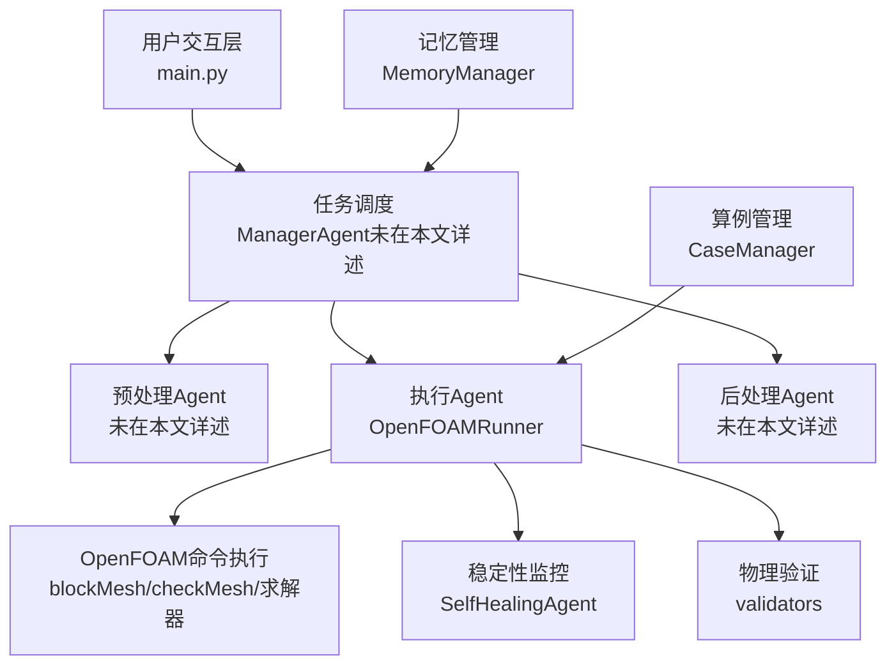
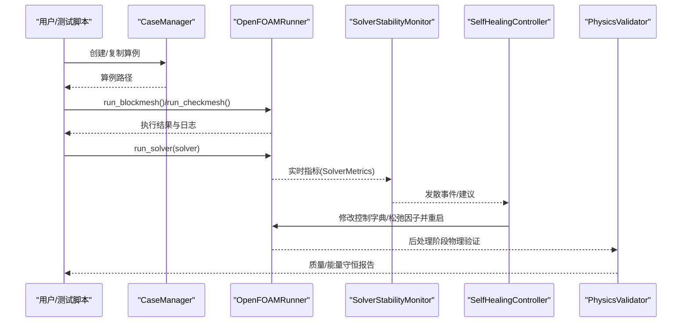
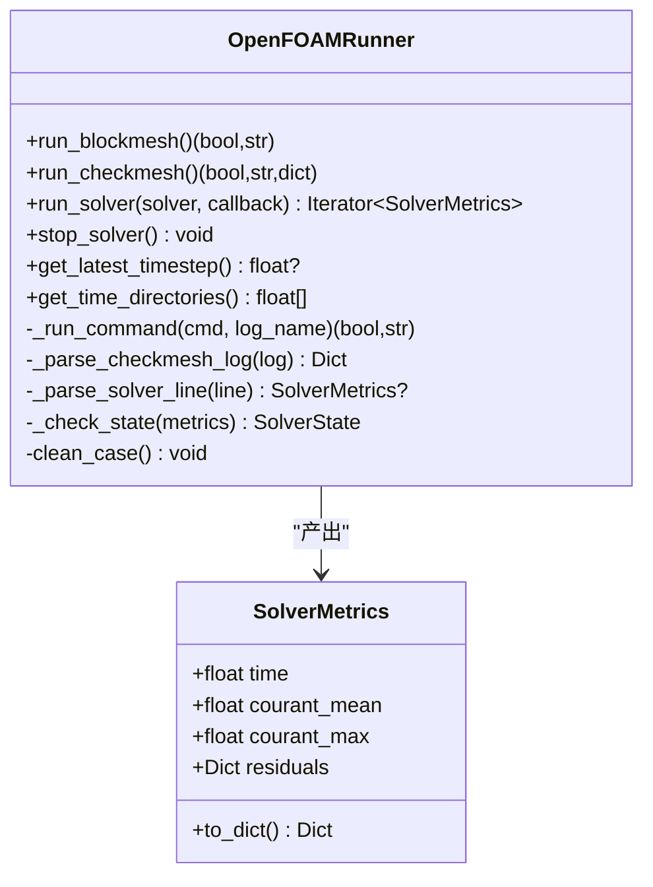
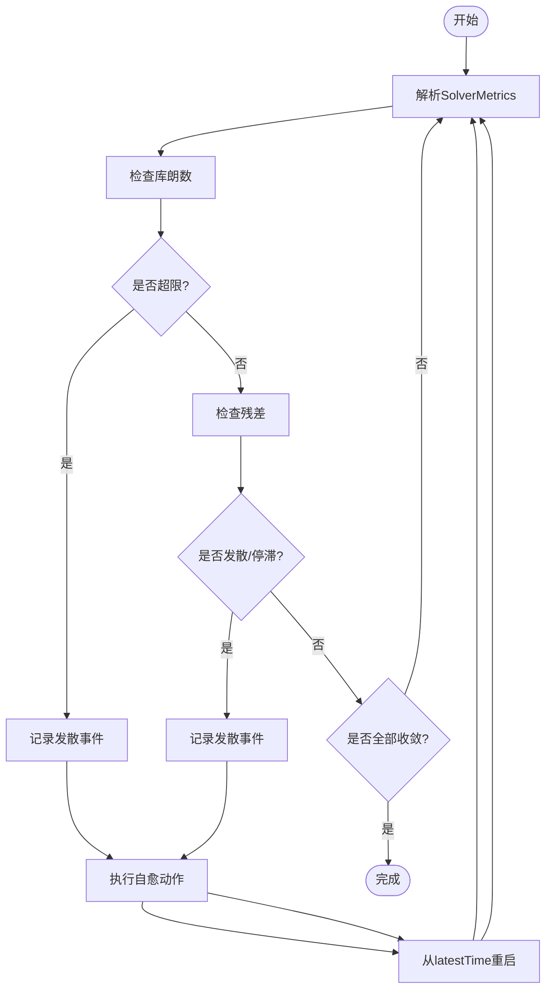
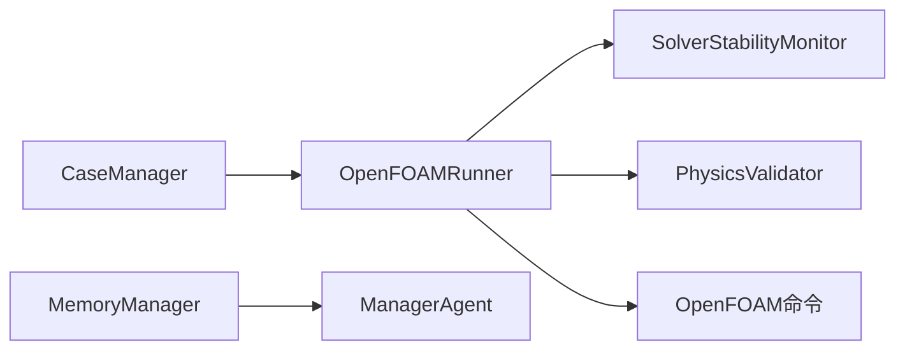

# 性能测试

<cite>
**本文引用的文件**
- [openfoam_ai/README.md](file://openfoam_ai/README.md)
- [openfoam_ai/main.py](file://openfoam_ai/main.py)
- [openfoam_ai/core/openfoam_runner.py](file://openfoam_ai/core/openfoam_runner.py)
- [openfoam_ai/core/case_manager.py](file://openfoam_ai/core/case_manager.py)
- [openfoam_ai/core/validators.py](file://openfoam_ai/core/validators.py)
- [openfoam_ai/config/system_constitution.yaml](file://openfoam_ai/config/system_constitution.yaml)
- [openfoam_ai/agents/self_healing_agent.py](file://openfoam_ai/agents/self_healing_agent.py)
- [openfoam_ai/utils/of_simulator.py](file://openfoam_ai/utils/of_simulator.py)
- [openfoam_ai/memory/memory_manager.py](file://openfoam_ai/memory/memory_manager.py)
- [openfoam_ai/tests/test_basic.py](file://openfoam_ai/tests/test_basic.py)
- [openfoam_ai/tests/test_case_manager.py](file://openfoam_ai/tests/test_case_manager.py)
- [openfoam_ai/demo_features.py](file://openfoam_ai/demo_features.py)
- [openfoam_ai/auto_demo.py](file://openfoam_ai/auto_demo.py)
</cite>

## 目录
1. [引言](#引言)
2. [项目结构](#项目结构)
3. [核心组件](#核心组件)
4. [架构总览](#架构总览)
5. [详细组件分析](#详细组件分析)
6. [依赖分析](#依赖分析)
7. [性能考量](#性能考量)
8. [故障排查指南](#故障排查指南)
9. [结论](#结论)
10. [附录](#附录)

## 引言
本技术文档面向OpenFOAM AI系统的性能测试，围绕“设计目标、测试策略、不同负载条件下的评估方法、基准设置、内存监控与资源优化、测试用例设计原则与指标定义、执行流程与结果分析、瓶颈识别与优化建议”等方面展开。文档以代码库为依据，结合现有模块（算例管理、命令执行、稳定性监控、自愈控制、验证与宪法约束、记忆管理、仿真工具等）给出可落地的性能测试方案。

## 项目结构
OpenFOAM AI由“用户交互层—任务调度—预处理/执行/后处理—OpenFOAM计算引擎”构成，核心模块包括：
- 核心执行与监控：OpenFOAMRunner、SelfHealingAgent（稳定性监控与自愈）
- 算例生命周期：CaseManager（创建/复制/清理/删除）、System Constitution（宪法约束）
- 验证与约束：validators（Pydantic硬约束+宪法规则）
- 记忆与增量：MemoryManager（配置向量化存储、相似检索、增量更新）
- 仿真工具：OpenFOAMSimulator（网格生成、求解器运行、残差提取）

图表来源
- [openfoam_ai/main.py:1-251](file://openfoam_ai/main.py#L1-L251)
- [openfoam_ai/core/openfoam_runner.py:1-548](file://openfoam_ai/core/openfoam_runner.py#L1-L548)
- [openfoam_ai/agents/self_healing_agent.py:1-642](file://openfoam_ai/agents/self_healing_agent.py#L1-L642)
- [openfoam_ai/core/case_manager.py:1-639](file://openfoam_ai/core/case_manager.py#L1-L639)
- [openfoam_ai/memory/memory_manager.py:1-804](file://openfoam_ai/memory/memory_manager.py#L1-L804)

章节来源
- [openfoam_ai/README.md:104-150](file://openfoam_ai/README.md#L104-L150)
- [openfoam_ai/main.py:19-251](file://openfoam_ai/main.py#L19-L251)

## 核心组件
- OpenFOAMRunner：封装blockMesh/checkMesh/求解器执行，实时解析日志、提取库朗数与残差、判定收敛/发散/停滞、支持停止求解器、清理算例。
- SelfHealingAgent：求解稳定性监控与自愈控制，检测库朗数/残差异常，记录事件，自动调整控制字典与松弛因子，从最新时间步重启。
- CaseManager：标准化算例目录结构，支持创建/复制/清理/删除，维护算例信息与状态。
- validators：基于Pydantic与宪法规则的硬约束验证，保障网格、求解器、边界条件、物理参数的合理性。
- MemoryManager：配置向量化存储、相似检索、增量更新（Diff），支持导出/导入。
- OpenFOAMSimulator：简易仿真运行器，提供网格生成、求解器运行、异步运行、残差提取等能力。

章节来源
- [openfoam_ai/core/openfoam_runner.py:44-548](file://openfoam_ai/core/openfoam_runner.py#L44-L548)
- [openfoam_ai/agents/self_healing_agent.py:58-642](file://openfoam_ai/agents/self_healing_agent.py#L58-L642)
- [openfoam_ai/core/case_manager.py:27-262](file://openfoam_ai/core/case_manager.py#L27-L262)
- [openfoam_ai/core/validators.py:18-441](file://openfoam_ai/core/validators.py#L18-L441)
- [openfoam_ai/memory/memory_manager.py:198-804](file://openfoam_ai/memory/memory_manager.py#L198-L804)
- [openfoam_ai/utils/of_simulator.py:13-180](file://openfoam_ai/utils/of_simulator.py#L13-L180)

## 架构总览
下图展示性能测试关注的关键交互：命令执行器负责执行OpenFOAM命令并产出日志；稳定性监控器解析日志并触发自愈；验证器在执行前后进行物理约束检查；记忆管理器记录配置与历史版本，便于对比与回归。

图表来源
- [openfoam_ai/core/openfoam_runner.py:99-198](file://openfoam_ai/core/openfoam_runner.py#L99-L198)
- [openfoam_ai/agents/self_healing_agent.py:479-615](file://openfoam_ai/agents/self_healing_agent.py#L479-L615)
- [openfoam_ai/core/validators.py:277-387](file://openfoam_ai/core/validators.py#L277-L387)

## 详细组件分析

### OpenFOAMRunner：命令执行与日志解析
- 关键职责：执行blockMesh/checkMesh/求解器；捕获标准输出；解析库朗数与残差；判定状态（运行/收敛/发散/停滞/完成/错误）；支持停止求解器；清理算例。
- 性能相关点：
  - 日志逐行解析，实时生成指标对象；适合高频采样（每步或每若干步）。
  - 写日志文件与标准输出同步，注意I/O开销。
  - 进程等待与超时处理，避免僵尸进程。
- 指标结构：SolverMetrics包含时间、库朗数均值/最大、各场变量残差字典。

图表来源
- [openfoam_ai/core/openfoam_runner.py:44-548](file://openfoam_ai/core/openfoam_runner.py#L44-L548)

章节来源
- [openfoam_ai/core/openfoam_runner.py:77-301](file://openfoam_ai/core/openfoam_runner.py#L77-L301)
- [openfoam_ai/core/openfoam_runner.py:347-427](file://openfoam_ai/core/openfoam_runner.py#L347-L427)

### SelfHealingAgent：稳定性监控与自愈
- 关键职责：实时解析指标，检测库朗数/残差异常，记录发散事件，自动调整控制字典（时间步长、重启策略）与松弛因子，必要时增加非正交修正器，限制最大尝试次数。
- 性能相关点：
  - 历史窗口大小影响趋势判断与响应延迟。
  - 自愈动作涉及文件读写与替换，需考虑I/O成本。
  - 重启策略（latestTime）可减少重复计算，提高整体吞吐。

图表来源
- [openfoam_ai/agents/self_healing_agent.py:58-230](file://openfoam_ai/agents/self_healing_agent.py#L58-L230)
- [openfoam_ai/agents/self_healing_agent.py:232-477](file://openfoam_ai/agents/self_healing_agent.py#L232-L477)

章节来源
- [openfoam_ai/agents/self_healing_agent.py:86-197](file://openfoam_ai/agents/self_healing_agent.py#L86-L197)
- [openfoam_ai/agents/self_healing_agent.py:277-442](file://openfoam_ai/agents/self_healing_agent.py#L277-L442)

### CaseManager：算例生命周期管理
- 关键职责：创建/复制/清理/删除算例；维护算例信息（名称、路径、创建/修改时间、物理类型、求解器、状态）；清理日志与时间步目录。
- 性能相关点：
  - 清理策略影响磁盘占用与后续运行效率。
  - 状态字段可用于测试流程控制与断点恢复。

章节来源
- [openfoam_ai/core/case_manager.py:51-262](file://openfoam_ai/core/case_manager.py#L51-L262)

### validators：物理约束与宪法规则
- 关键职责：基于Pydantic模型与宪法规则进行硬约束验证；检查网格长宽比、总网格数、CFL条件、求解器与物理类型的匹配、禁止组合、物性范围等；后处理阶段进行质量/能量守恒验证。
- 性能相关点：
  - 验证前置可减少无效运行，提升整体吞吐。
  - 宪法阈值（如收敛残差、库朗数上限、松弛因子范围）直接影响求解稳定性与性能。

章节来源
- [openfoam_ai/core/validators.py:18-441](file://openfoam_ai/core/validators.py#L18-L441)
- [openfoam_ai/config/system_constitution.yaml:13-103](file://openfoam_ai/config/system_constitution.yaml#L13-L103)

### MemoryManager：配置记忆与增量更新
- 关键职责：向量化存储配置、相似性检索、增量更新（Diff）、导出/导入、回滚到历史版本。
- 性能相关点：
  - 模拟模式下使用简单哈希生成向量，便于测试；生产环境建议使用高质量嵌入模型。
  - 增量更新可显著降低存储与传输成本，便于回归对比。

章节来源
- [openfoam_ai/memory/memory_manager.py:198-804](file://openfoam_ai/memory/memory_manager.py#L198-L804)

### OpenFOAMSimulator：简易仿真运行器
- 关键职责：检查OpenFOAM安装、生成网格、运行求解器、异步运行、停止仿真、获取最新时间步、提取残差历史。
- 性能相关点：
  - 适用于快速验证与演示场景；生产测试建议使用OpenFOAMRunner以获得更细粒度的日志与指标。

章节来源
- [openfoam_ai/utils/of_simulator.py:13-180](file://openfoam_ai/utils/of_simulator.py#L13-L180)

## 依赖分析
- 模块耦合：
  - OpenFOAMRunner与SelfHealingAgent通过SolverMetrics耦合，前者提供指标，后者消费并触发自愈。
  - CaseManager为OpenFOAMRunner提供算例上下文（路径、日志目录）。
  - validators在执行前后提供约束保障，减少无效运行。
  - MemoryManager与ManagerAgent协作（未在本文详述），用于配置历史与增量更新。
- 外部依赖：
  - OpenFOAM命令（blockMesh/checkMesh/求解器）。
  - 可选：ChromaDB（向量数据库），若不可用则回退到模拟模式。

图表来源
- [openfoam_ai/core/openfoam_runner.py:44-548](file://openfoam_ai/core/openfoam_runner.py#L44-L548)
- [openfoam_ai/agents/self_healing_agent.py:58-230](file://openfoam_ai/agents/self_healing_agent.py#L58-L230)
- [openfoam_ai/core/case_manager.py:27-262](file://openfoam_ai/core/case_manager.py#L27-L262)
- [openfoam_ai/memory/memory_manager.py:198-804](file://openfoam_ai/memory/memory_manager.py#L198-L804)

## 性能考量
- 指标采集频率与粒度
  - 建议按“每N步”输出一次关键指标（时间、库朗数、残差），兼顾实时性与开销。
  - 对于长时间运行，可采用“阶梯式采样”，初期高采样，后期降采样。
- I/O与日志
  - 日志文件写入与标准输出捕获是主要I/O瓶颈；建议异步写入或缓冲批量写入。
  - 控制日志级别，避免冗余信息。
- 并行与重启
  - 利用latestTime重启可避免重复计算，提高吞吐。
  - 自愈动作（减小Δt、调整松弛因子、增加非正交修正器）需权衡稳定性与收敛速度。
- 资源监控
  - 建议结合系统监控工具（CPU/内存/磁盘/网络）观察整体资源占用。
  - 对于大规模网格，优先评估内存峰值与磁盘空间。
- 验证前置
  - 在执行前进行validators与宪法规则检查，可显著减少无效运行与失败重试。

## 故障排查指南
- 常见问题与定位
  - OpenFOAM命令未找到：检查PATH与OpenFOAM安装。
  - 权限不足：确保求解器可执行。
  - 日志解码错误：忽略非法编码行，继续处理。
  - 求解器异常结束：检查返回码与日志文件。
- 自愈失败
  - 若多次自愈仍发散，检查配置是否超出物理合理范围（CFL、松弛因子、网格质量）。
  - 回滚到上一版本配置，对比差异定位问题。
- 验证失败
  - 质量/能量守恒不满足：检查边界条件、网格质量、物性参数。

章节来源
- [openfoam_ai/core/openfoam_runner.py:127-142](file://openfoam_ai/core/openfoam_runner.py#L127-L142)
- [openfoam_ai/agents/self_healing_agent.py:264-276](file://openfoam_ai/agents/self_healing_agent.py#L264-L276)
- [openfoam_ai/core/validators.py:277-387](file://openfoam_ai/core/validators.py#L277-L387)

## 结论
本性能测试方案以OpenFOAMRunner为核心观测点，结合SelfHealingAgent的稳定性监控与自愈能力，辅以validators的宪法约束与MemoryManager的历史对比，形成“采集—监控—自愈—验证—回归”的闭环。通过合理的指标采样频率、I/O优化、重启策略与资源监控，可在不同负载条件下系统性评估OpenFOAM AI的性能表现，并为优化提供数据支撑。

## 附录

### 性能测试设计目标与策略
- 设计目标
  - 建立可重复、可量化的性能基线，覆盖不同网格规模、求解器类型、边界条件与物性参数。
  - 识别并量化瓶颈（CPU、内存、I/O、网络），提出针对性优化建议。
- 测试策略
  - 分层测试：单元级（模块功能）、集成级（模块交互）、端到端（完整工作流）。
  - 负载梯度：从轻量网格到高分辨率网格，逐步增加复杂度。
  - 场景覆盖：稳态/瞬态、不可压/可压、传热/多相等典型场景。

章节来源
- [openfoam_ai/README.md:104-150](file://openfoam_ai/README.md#L104-L150)

### 性能基准设置
- 基准算例
  - 方腔驱动流（2D/3D）、绕柱/绕球等经典算例。
- 基准参数
  - 网格：20x20/40x40/80x80（2D），20x20x1/40x40x1（3D）。
  - 求解器：icoFoam/simpleFoam/pimpleFoam等。
  - 物性：水/油/空气等典型流体。
- 基准指标
  - 计算时间、内存峰值、I/O吞吐、收敛步数、最终残差、发散次数、重启次数。

章节来源
- [openfoam_ai/core/case_manager.py:265-622](file://openfoam_ai/core/case_manager.py#L265-L622)
- [openfoam_ai/config/system_constitution.yaml:13-103](file://openfoam_ai/config/system_constitution.yaml#L13-L103)

### 内存使用监控与资源优化
- 监控要点
  - 进程内存峰值、堆栈增长、日志文件大小。
  - 磁盘空间与时间步目录清理策略。
- 优化建议
  - 合理设置写入间隔与压缩选项。
  - 使用latestTime重启与增量写入。
  - 采用异步I/O与缓冲策略。

章节来源
- [openfoam_ai/core/openfoam_runner.py:146-198](file://openfoam_ai/core/openfoam_runner.py#L146-L198)
- [openfoam_ai/agents/self_healing_agent.py:449-477](file://openfoam_ai/agents/self_healing_agent.py#L449-L477)

### 测试用例设计原则与指标定义
- 设计原则
  - 可重现：固定随机种子、统一环境。
  - 可扩展：按网格规模与复杂度分组。
  - 可对比：同一场景不同配置的对照实验。
- 指标定义
  - 吞吐：单位时间内完成的算例数或步数。
  - 质量：最终残差、收敛步数、发散/停滞次数。
  - 资源：CPU利用率、内存峰值、磁盘I/O、网络带宽。
  - 稳定性：自愈成功率、重启次数、失败率。

章节来源
- [openfoam_ai/core/validators.py:18-441](file://openfoam_ai/core/validators.py#L18-L441)
- [openfoam_ai/memory/memory_manager.py:474-521](file://openfoam_ai/memory/memory_manager.py#L474-L521)

### 执行方法与结果分析
- 执行方法
  - 使用OpenFOAMRunner.run_solver获取实时指标，结合SelfHealingAgent进行稳定性监控。
  - 使用validators在执行前后进行约束验证。
  - 使用MemoryManager记录配置与历史版本，便于对比。
- 结果分析
  - 统计收敛曲线、发散事件分布、自愈效果。
  - 对比不同网格/求解器/物性的性能差异。
  - 识别瓶颈并制定优化方案。

章节来源
- [openfoam_ai/core/openfoam_runner.py:99-198](file://openfoam_ai/core/openfoam_runner.py#L99-L198)
- [openfoam_ai/agents/self_healing_agent.py:479-615](file://openfoam_ai/agents/self_healing_agent.py#L479-L615)
- [openfoam_ai/memory/memory_manager.py:474-521](file://openfoam_ai/memory/memory_manager.py#L474-L521)

### 瓶颈识别技巧
- 指标异常
  - 库朗数持续偏高：减小Δt或加密网格。
  - 残差停滞：增加非正交修正器或调整松弛因子。
  - 发散频繁：检查边界条件与网格质量。
- 工具辅助
  - 使用系统监控工具观察CPU/内存/磁盘/网络。
  - 对比不同配置的收敛曲线与自愈次数。

章节来源
- [openfoam_ai/agents/self_healing_agent.py:114-197](file://openfoam_ai/agents/self_healing_agent.py#L114-L197)
- [openfoam_ai/core/validators.py:277-387](file://openfoam_ai/core/validators.py#L277-L387)

### 测试数据规模选择
- 2D：20x20（基准）、40x40（中等）、80x80（高）。
- 3D：20x20x1（基准）、40x40x1（中等）、80x80x1（高）。
- 场景：稳态/瞬态、不同物性、不同边界条件。

章节来源
- [openfoam_ai/core/case_manager.py:265-622](file://openfoam_ai/core/case_manager.py#L265-L622)
- [openfoam_ai/config/system_constitution.yaml:13-103](file://openfoam_ai/config/system_constitution.yaml#L13-L103)

### 示例执行脚本与演示
- 演示脚本展示了从自然语言到算例创建、网格质量检查、稳定性监控、记忆管理与后处理的完整流程，可作为性能测试的参考骨架。

章节来源
- [openfoam_ai/demo_features.py:1-296](file://openfoam_ai/demo_features.py#L1-L296)
- [openfoam_ai/auto_demo.py:1-296](file://openfoam_ai/auto_demo.py#L1-L296)