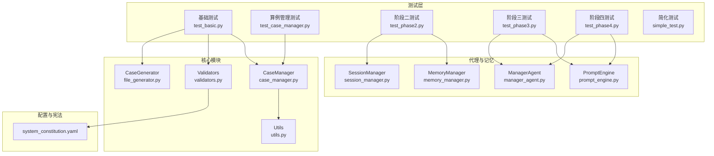
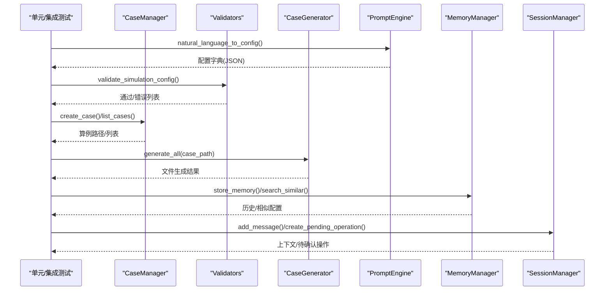
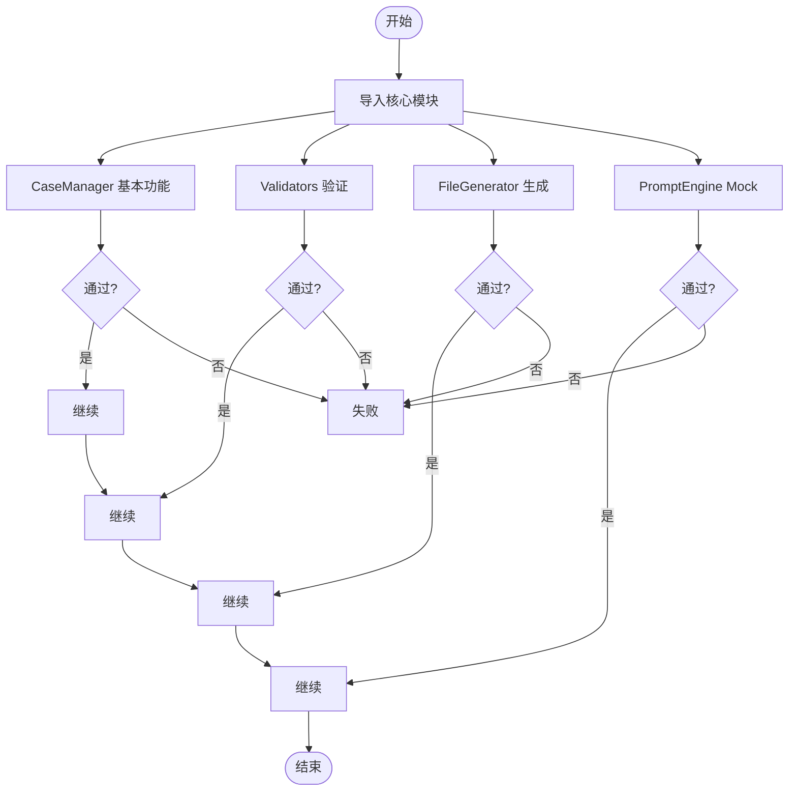
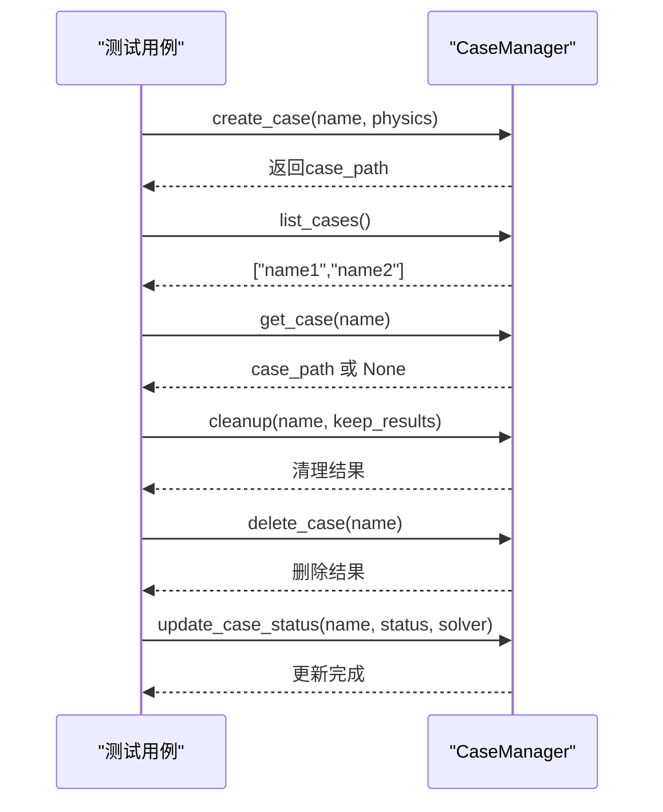
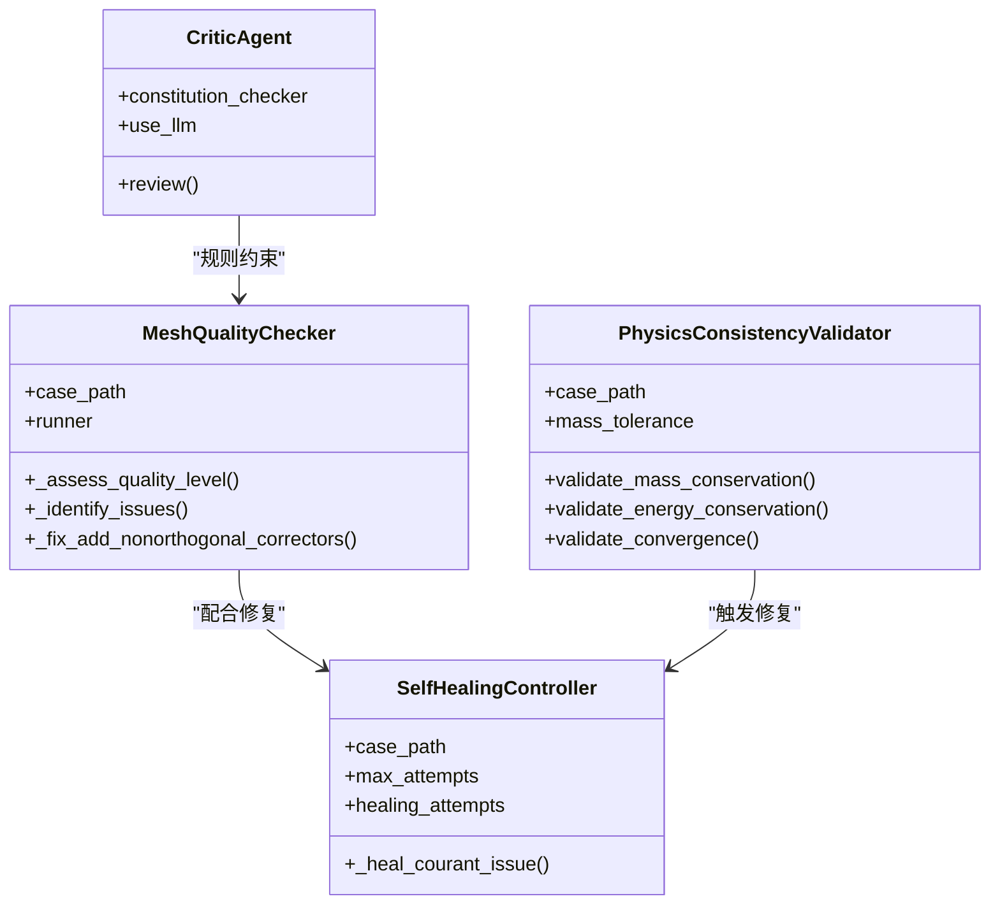
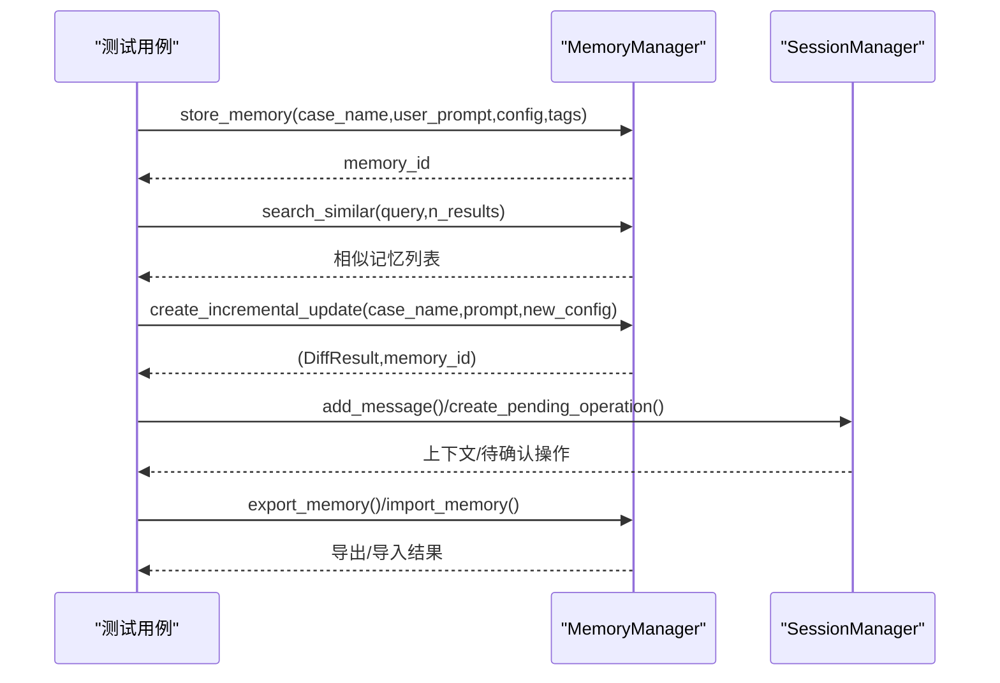
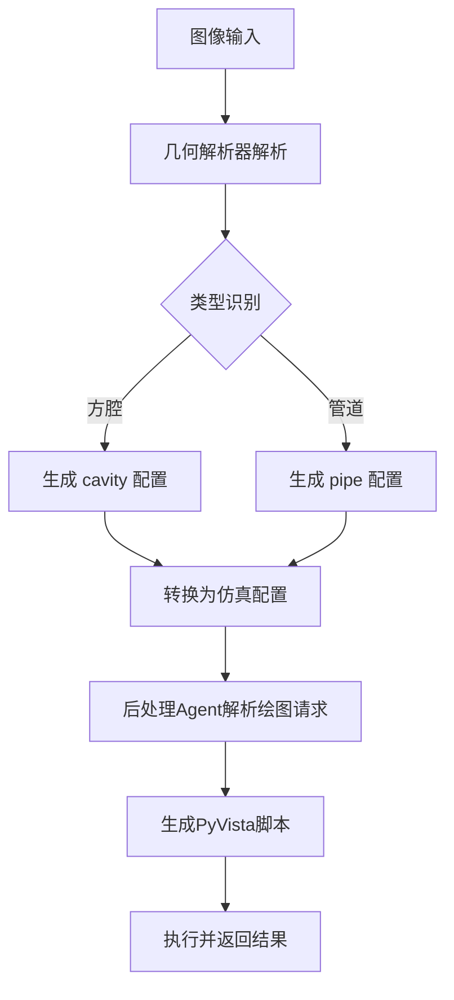
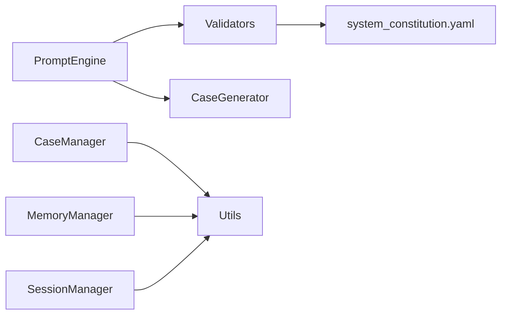

# 测试与质量保证

<cite>
**本文引用的文件**
- [openfoam_ai\tests\test_basic.py](file://openfoam_ai/tests/test_basic.py)
- [openfoam_ai\tests\simple_test.py](file://openfoam_ai/tests/simple_test.py)
- [openfoam_ai\tests\test_case_manager.py](file://openfoam_ai/tests/test_case_manager.py)
- [openfoam_ai\tests\test_phase2.py](file://openfoam_ai/tests/test_phase2.py)
- [openfoam_ai\tests\test_phase3.py](file://openfoam_ai/tests/test_phase3.py)
- [openfoam_ai\tests\test_phase4.py](file://openfoam_ai/tests/test_phase4.py)
- [openfoam_ai\core\case_manager.py](file://openfoam_ai/core/case_manager.py)
- [openfoam_ai\core\validators.py](file://openfoam_ai/core/validators.py)
- [openfoam_ai\core\file_generator.py](file://openfoam_ai/core/file_generator.py)
- [openfoam_ai\core\utils.py](file://openfoam_ai/core/utils.py)
- [openfoam_ai\agents\prompt_engine.py](file://openfoam_ai/agents/prompt_engine.py)
- [openfoam_ai\memory\memory_manager.py](file://openfoam_ai/memory/memory_manager.py)
- [openfoam_ai\memory\session_manager.py](file://openfoam_ai/memory/session_manager.py)
- [openfoam_ai\agents\manager_agent.py](file://openfoam_ai/agents/manager_agent.py)
- [openfoam_ai\config\system_constitution.yaml](file://openfoam_ai/config/system_constitution.yaml)
</cite>

## 目录
1. [引言](#引言)
2. [项目结构](#项目结构)
3. [核心组件](#核心组件)
4. [架构总览](#架构总览)
5. [详细组件分析](#详细组件分析)
6. [依赖分析](#依赖分析)
7. [性能考虑](#性能考虑)
8. [故障排查指南](#故障排查指南)
9. [结论](#结论)
10. [附录](#附录)

## 引言
本文件面向OpenFOAM AI项目的测试与质量保证体系，系统化梳理测试框架设计理念、单元测试与集成测试策略、核心模块测试覆盖范围、断言与验证方法，并给出端到端测试、性能基准与兼容性验证流程。同时提供回归测试自动化执行、测试数据准备与测试环境隔离方案，以及测试覆盖率统计、代码质量度量与持续集成配置建议，帮助开发者编写高质量测试代码。

## 项目结构
OpenFOAM AI采用“模块化+分阶段”的组织方式，测试用例按阶段划分，分别覆盖基础导入验证、算例管理、AI自查自愈、记忆与会话、几何图像解析与后处理等模块。核心模块包括：
- 核心层：算例管理、配置验证、文件生成、通用工具
- 代理层：提示词引擎、管理Agent、阶段二/三/四专用Agent
- 记忆与会话：向量数据库存储、增量更新、会话状态管理
- 配置与宪法：系统宪法规则、约束与验证

**图表来源**
- [openfoam_ai\tests\test_basic.py:1-270](file://openfoam_ai/tests/test_basic.py#L1-L270)
- [openfoam_ai\tests\test_case_manager.py:1-180](file://openfoam_ai/tests/test_case_manager.py#L1-L180)
- [openfoam_ai\tests\test_phase2.py:1-411](file://openfoam_ai/tests/test_phase2.py#L1-L411)
- [openfoam_ai\tests\test_phase3.py:1-549](file://openfoam_ai/tests/test_phase3.py#L1-L549)
- [openfoam_ai\tests\test_phase4.py:1-183](file://openfoam_ai/tests/test_phase4.py#L1-L183)
- [openfoam_ai\core\case_manager.py:1-639](file://openfoam_ai/core/case_manager.py#L1-L639)
- [openfoam_ai\core\validators.py:1-441](file://openfoam_ai/core/validators.py#L1-L441)
- [openfoam_ai\core\file_generator.py:1-635](file://openfoam_ai/core/file_generator.py#L1-L635)
- [openfoam_ai\core\utils.py:1-111](file://openfoam_ai/core/utils.py#L1-L111)
- [openfoam_ai\agents\prompt_engine.py:1-616](file://openfoam_ai/agents/prompt_engine.py#L1-L616)
- [openfoam_ai\memory\memory_manager.py:1-804](file://openfoam_ai/memory/memory_manager.py#L1-L804)
- [openfoam_ai\memory\session_manager.py:1-565](file://openfoam_ai/memory/session_manager.py#L1-L565)
- [openfoam_ai\agents\manager_agent.py:1-458](file://openfoam_ai/agents/manager_agent.py#L1-L458)
- [openfoam_ai\config\system_constitution.yaml:1-103](file://openfoam_ai/config/system_constitution.yaml#L1-L103)

**章节来源**
- [openfoam_ai\tests\test_basic.py:1-270](file://openfoam_ai/tests/test_basic.py#L1-L270)
- [openfoam_ai\tests\simple_test.py:1-114](file://openfoam_ai/tests/simple_test.py#L1-L114)

## 核心组件
- 算例管理（CaseManager）：负责创建/复制/清理/删除算例，维护算例信息与状态，确保OpenFOAM标准目录结构与元数据一致。
- 配置验证（Validators）：基于Pydantic的硬约束验证，结合宪法规则（system_constitution.yaml）进行网格、求解器、边界条件、物理参数的合法性与合理性检查。
- 文件生成（CaseGenerator/FileGenerator）：将结构化配置转换为OpenFOAM字典文件（blockMeshDict/controlDict/fvSchemes/fvSolution/transportProperties/初场文件）。
- 提示词引擎（PromptEngine）：将自然语言转换为结构化配置，支持Mock模式与配置优化（ConfigRefiner）。
- 记忆与会话（MemoryManager/SessionManager）：向量数据库存储与检索、增量更新（Diff）、会话上下文与待确认操作队列。
- 通用工具（Utils）：JSON读写、目录确保、大小格式化、执行时间装饰器等。

**章节来源**
- [openfoam_ai\core\case_manager.py:1-639](file://openfoam_ai/core/case_manager.py#L1-L639)
- [openfoam_ai\core\validators.py:1-441](file://openfoam_ai/core/validators.py#L1-L441)
- [openfoam_ai\core\file_generator.py:1-635](file://openfoam_ai/core/file_generator.py#L1-L635)
- [openfoam_ai\agents\prompt_engine.py:1-616](file://openfoam_ai/agents/prompt_engine.py#L1-L616)
- [openfoam_ai\memory\memory_manager.py:1-804](file://openfoam_ai/memory/memory_manager.py#L1-L804)
- [openfoam_ai\memory\session_manager.py:1-565](file://openfoam_ai/memory/session_manager.py#L1-L565)
- [openfoam_ai\core\utils.py:1-111](file://openfoam_ai/core/utils.py#L1-L111)

## 架构总览
测试体系围绕“模块隔离、断言明确、可重复执行”展开，采用Python内置unittest与自定义测试脚本相结合的方式，覆盖导入验证、单元测试、集成测试与端到端工作流。

**图表来源**
- [openfoam_ai\tests\test_basic.py:12-270](file://openfoam_ai/tests/test_basic.py#L12-L270)
- [openfoam_ai\tests\test_phase2.py:27-411](file://openfoam_ai/tests/test_phase2.py#L27-L411)
- [openfoam_ai\tests\test_phase3.py:28-549](file://openfoam_ai/tests/test_phase3.py#L28-L549)
- [openfoam_ai\tests\test_phase4.py:19-183](file://openfoam_ai/tests/test_phase4.py#L19-L183)
- [openfoam_ai\agents\prompt_engine.py:92-216](file://openfoam_ai/agents/prompt_engine.py#L92-L216)
- [openfoam_ai\core\validators.py:389-411](file://openfoam_ai/core/validators.py#L389-L411)
- [openfoam_ai\core\case_manager.py:51-209](file://openfoam_ai/core/case_manager.py#L51-L209)
- [openfoam_ai\core\file_generator.py:515-532](file://openfoam_ai/core/file_generator.py#L515-L532)
- [openfoam_ai\memory\memory_manager.py:291-345](file://openfoam_ai/memory/memory_manager.py#L291-L345)
- [openfoam_ai\memory\session_manager.py:229-333](file://openfoam_ai/memory/session_manager.py#L229-L333)

## 详细组件分析

### 基础测试（导入与核心功能）
- 目标：验证核心模块可导入、基础功能可用。
- 断言策略：逐模块导入并打印结果；对关键API进行基本行为验证（如CaseManager创建目录、Validators验证配置、FileGenerator生成文件、PromptEngine在Mock模式下的配置生成与优化）。
- 覆盖范围：导入链路、算例管理、验证器、文件生成、提示词引擎。

**图表来源**
- [openfoam_ai\tests\test_basic.py:12-270](file://openfoam_ai/tests/test_basic.py#L12-L270)

**章节来源**
- [openfoam_ai\tests\test_basic.py:12-270](file://openfoam_ai/tests/test_basic.py#L12-L270)

### 算例管理器（CaseManager）单元测试
- 目标：验证算例生命周期管理（创建、复制、列出、获取、清理、删除、状态更新、信息持久化）。
- 断言策略：断言目录结构存在、算例信息文件存在且可加载、清理后时间步与并行目录删除、日志清理策略、状态重置。
- 覆盖范围：目录结构、信息持久化、清理策略、状态管理。

**图表来源**
- [openfoam_ai\tests\test_case_manager.py:18-180](file://openfoam_ai/tests/test_case_manager.py#L18-L180)
- [openfoam_ai\core\case_manager.py:51-241](file://openfoam_ai/core/case_manager.py#L51-L241)

**章节来源**
- [openfoam_ai\tests\test_case_manager.py:18-180](file://openfoam_ai/tests/test_case_manager.py#L18-L180)
- [openfoam_ai\core\case_manager.py:51-241](file://openfoam_ai/core/case_manager.py#L51-L241)

### 阶段二测试（AI自查与自愈）
- 目标：验证网格质量自查、自愈控制、物理一致性校验、审查者规则检查。
- 断言策略：网格质量等级评估、问题识别与修复策略、稳定性监控（库朗数/残差）、自愈控制器修复效果、物理校验器质量/能量/收敛性验证、审查者配置合规性评分。
- 覆盖范围：MeshQualityChecker、SelfHealingController、PhysicsConsistencyValidator、CriticAgent、集成工作流。

**图表来源**
- [openfoam_ai\tests\test_phase2.py:27-411](file://openfoam_ai/tests/test_phase2.py#L27-L411)

**章节来源**
- [openfoam_ai\tests\test_phase2.py:27-411](file://openfoam_ai/tests/test_phase2.py#L27-L411)

### 阶段三测试（记忆与会话）
- 目标：验证配置差异分析（Diff）、记忆存储与检索、增量更新、会话上下文与待确认操作。
- 断言策略：差异计算（新增/删除/修改/不变）、应用差异、相似性检索（Mock/ChromaDB）、历史查询、统计信息、导出/导入、会话持久化、高风险操作确认流程。
- 覆盖范围：ConfigurationDiffer、MemoryManager、SessionManager、集成工作流。

**图表来源**
- [openfoam_ai\tests\test_phase3.py:36-549](file://openfoam_ai/tests/test_phase3.py#L36-L549)
- [openfoam_ai\memory\memory_manager.py:64-196](file://openfoam_ai/memory/memory_manager.py#L64-L196)
- [openfoam_ai\memory\session_manager.py:171-448](file://openfoam_ai/memory/session_manager.py#L171-L448)

**章节来源**
- [openfoam_ai\tests\test_phase3.py:36-549](file://openfoam_ai/tests/test_phase3.py#L36-L549)
- [openfoam_ai\memory\memory_manager.py:64-196](file://openfoam_ai/memory/memory_manager.py#L64-L196)
- [openfoam_ai\memory\session_manager.py:171-448](file://openfoam_ai/memory/session_manager.py#L171-L448)

### 阶段四测试（几何图像解析与后处理）
- 目标：验证几何图像解析（Mock模式）、配置转换、后处理Agent的绘图请求解析与脚本生成、执行（Mock模式）。
- 断言策略：解析器初始化与模式判断、几何类型识别、配置转换、绘图请求解析（类型/字段/格式/时间）、脚本生成与执行结果。
- 覆盖范围：geometry_image_agent、postprocessing_agent、集成工作流。

**图表来源**
- [openfoam_ai\tests\test_phase4.py:23-183](file://openfoam_ai/tests/test_phase4.py#L23-L183)

**章节来源**
- [openfoam_ai\tests\test_phase4.py:23-183](file://openfoam_ai/tests/test_phase4.py#L23-L183)

### 端到端测试与工作流
- 目标：串联提示词引擎、配置验证、算例创建、网格生成与检查、（可选）运行监控与收敛评估。
- 断言策略：计划生成、配置摘要、网格生成与质量检查、状态更新、（可选）收敛状态与摘要输出。
- 覆盖范围：ManagerAgent、OpenFOAMRunner/SolverMonitor（在ManagerAgent中使用）。

**章节来源**
- [openfoam_ai\agents\manager_agent.py:176-339](file://openfoam_ai/agents/manager_agent.py#L176-L339)

## 依赖分析
- 模块内聚与耦合
  - 核心模块（case_manager、validators、file_generator、utils）内聚度高，对外暴露稳定接口，内部通过工具函数（JSON读写、目录确保）解耦。
  - 代理层与核心层松耦合，通过明确的数据结构（配置字典、MemoryEntry、ConversationMessage）传递数据。
- 外部依赖
  - ChromaDB（可选）：用于向量数据库存储；缺失时回退到Mock模式。
  - OpenAI（可选）：用于真实API模式；缺失或无密钥时进入Mock模式。
- 循环依赖规避
  - 测试脚本通过sys.path插入项目根目录，避免相对导入导致的循环依赖；核心模块间通过显式导入与工具函数避免循环引用。

**图表来源**
- [openfoam_ai\agents\prompt_engine.py:12-17](file://openfoam_ai/agents/prompt_engine.py#L12-L17)
- [openfoam_ai\memory\memory_manager.py:22-29](file://openfoam_ai/memory/memory_manager.py#L22-L29)
- [openfoam_ai\core\validators.py:13-16](file://openfoam_ai/core/validators.py#L13-L16)
- [openfoam_ai\config\system_constitution.yaml:1-103](file://openfoam_ai/config/system_constitution.yaml#L1-L103)

**章节来源**
- [openfoam_ai\memory\memory_manager.py:22-29](file://openfoam_ai/memory/memory_manager.py#L22-L29)
- [openfoam_ai\agents\prompt_engine.py:12-17](file://openfoam_ai/agents/prompt_engine.py#L12-L17)

## 性能考虑
- 测试执行性能
  - 使用临时目录（tempfile）隔离测试数据，避免I/O竞争；在Mock模式下减少外部API调用开销。
  - 通过装饰器记录函数执行时间（utils.log_execution_time）辅助定位性能瓶颈。
- 验证器性能
  - Validators基于Pydantic的快速验证与宪法规则的轻量检查，避免昂贵的数值计算。
- 记忆检索性能
  - Mock模式使用余弦相似度计算；生产环境建议使用ChromaDB并启用合适索引与向量维度。
- 并行与资源
  - 算例清理策略删除时间步与并行目录，减少磁盘占用；日志保留最近若干份，避免无限增长。

**章节来源**
- [openfoam_ai\core\utils.py:97-111](file://openfoam_ai/core/utils.py#L97-L111)
- [openfoam_ai\memory\memory_manager.py:397-420](file://openfoam_ai/memory/memory_manager.py#L397-L420)

## 故障排查指南
- 导入与语法验证
  - 使用简化测试脚本（simple_test.py）验证核心模块语法正确性，定位语法错误与缺失文件。
- 配置验证失败
  - 使用Validators的validate_simulation_config输出错误列表，结合system_constitution.yaml中的约束逐项排查（网格数、长宽比、CFL、求解器匹配、物理参数范围）。
- 网格与文件生成
  - 检查CaseManager的目录结构与信息文件；确认CaseGenerator生成的文件路径与内容符合预期。
- 记忆与会话
  - 若ChromaDB不可用，确认MemoryManager处于Mock模式；检查导出/导入流程与存储路径权限。
- 会话确认流程
  - 高风险操作（删除算例、覆盖数据等）需确认；检查PendingOperation状态与确认提示生成。

**章节来源**
- [openfoam_ai\tests\simple_test.py:12-114](file://openfoam_ai/tests/simple_test.py#L12-L114)
- [openfoam_ai\core\validators.py:389-411](file://openfoam_ai/core/validators.py#L389-L411)
- [openfoam_ai\config\system_constitution.yaml:13-52](file://openfoam_ai/config/system_constitution.yaml#L13-L52)
- [openfoam_ai\memory\memory_manager.py:223-241](file://openfoam_ai/memory/memory_manager.py#L223-L241)
- [openfoam_ai\memory\session_manager.py:393-438](file://openfoam_ai/memory/session_manager.py#L393-L438)

## 结论
OpenFOAM AI的测试与质量保证体系以“模块化测试+宪法约束+Mock回退”为核心，覆盖导入验证、单元测试、集成测试与端到端工作流。通过明确的断言策略、稳定的接口契约与可重复的测试环境，确保核心功能的可靠性与可维护性。建议在CI中引入覆盖率统计与静态分析，持续完善测试矩阵与回归自动化。

## 附录

### 测试覆盖范围与断言策略清单
- 基础测试
  - 导入验证：模块导入成功、异常捕获与失败提示
  - 核心功能：CaseManager创建/列出/清理/删除、Validators配置验证、FileGenerator文件生成、PromptEngine Mock模式
- 算例管理器
  - 目录结构、信息持久化、清理策略、状态更新
- 阶段二
  - 网格质量评估与修复、稳定性监控、物理一致性验证、审查者评分
- 阶段三
  - 差异分析、相似性检索、增量更新、会话上下文与高风险操作
- 阶段四
  - 几何解析、配置转换、绘图请求解析与脚本生成、执行结果

**章节来源**
- [openfoam_ai\tests\test_basic.py:12-270](file://openfoam_ai/tests/test_basic.py#L12-L270)
- [openfoam_ai\tests\test_case_manager.py:18-180](file://openfoam_ai/tests/test_case_manager.py#L18-L180)
- [openfoam_ai\tests\test_phase2.py:27-411](file://openfoam_ai/tests/test_phase2.py#L27-L411)
- [openfoam_ai\tests\test_phase3.py:36-549](file://openfoam_ai/tests/test_phase3.py#L36-L549)
- [openfoam_ai\tests\test_phase4.py:23-183](file://openfoam_ai/tests/test_phase4.py#L23-L183)

### 测试数据准备与环境隔离
- 临时目录：使用tempfile创建隔离的测试工作区，避免污染生产数据。
- Mock模式：PromptEngine与MemoryManager在缺少API密钥或依赖时自动切换到Mock模式，确保测试可运行。
- 配置隔离：通过独立的测试配置与宪法文件副本，避免相互干扰。

**章节来源**
- [openfoam_ai\tests\test_phase2.py:30-41](file://openfoam_ai/tests/test_phase2.py#L30-L41)
- [openfoam_ai\memory\memory_manager.py:223-241](file://openfoam_ai/memory/memory_manager.py#L223-L241)
- [openfoam_ai\agents\prompt_engine.py:83-91](file://openfoam_ai/agents/prompt_engine.py#L83-L91)

### 测试覆盖率统计与代码质量度量
- 覆盖率统计
  - 使用pytest或unittest结合覆盖率工具（如coverage.py）统计行/分支/函数覆盖率，重点关注核心模块与关键路径。
- 代码质量度量
  - 静态分析：pylint/flake8检查命名规范、复杂度与潜在问题。
  - 规范性：统一异常处理、日志记录、断言信息清晰可追溯。

[本节为通用指导，无需特定文件引用]

### 持续集成配置建议
- 触发策略：PR/MR触发全量测试；主干推送触发关键模块回归。
- 测试矩阵：按Python版本与依赖版本矩阵运行；区分Mock与真实API模式。
- 报告与归档：上传测试报告与覆盖率数据，保留失败日志与快照。
- 自动化回归：定期运行全量测试集，确保回归通过。

[本节为通用指导，无需特定文件引用]