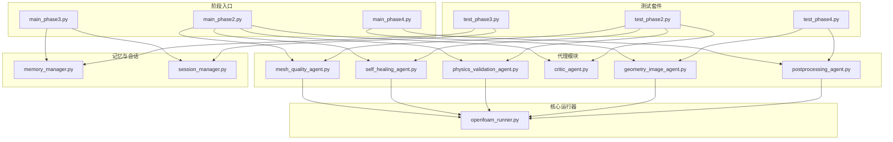
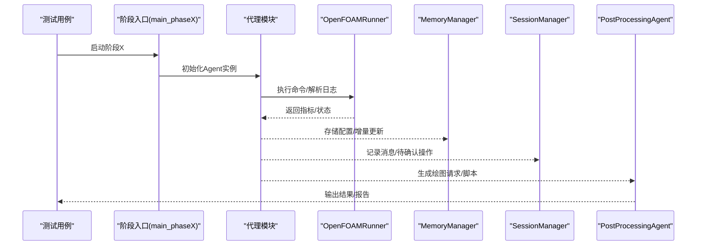
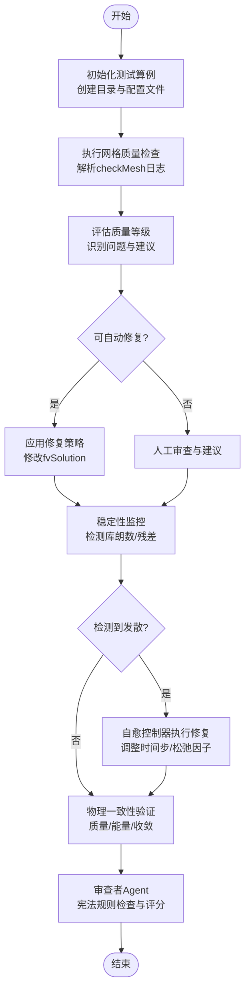
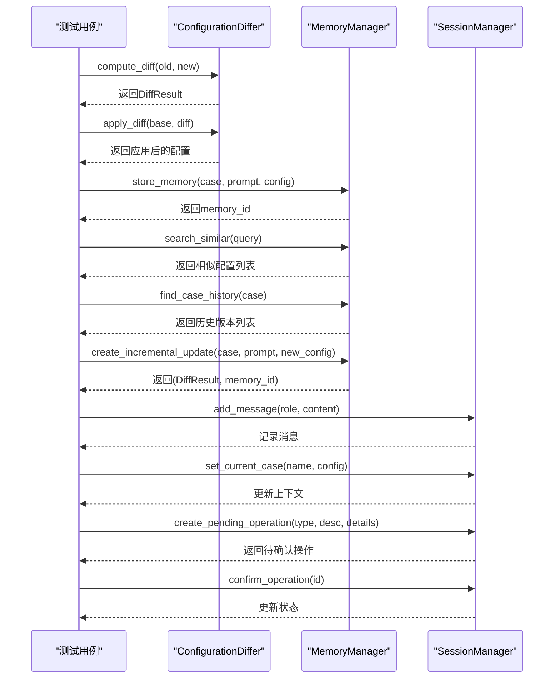
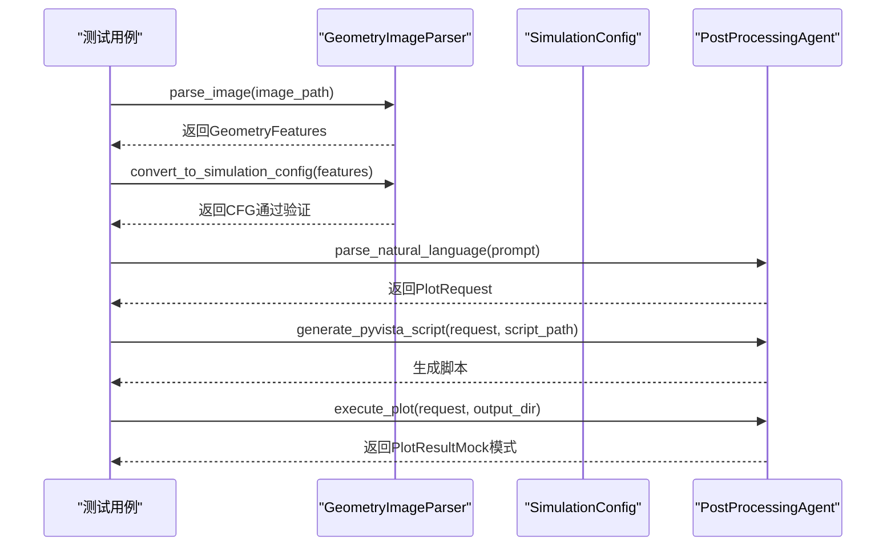
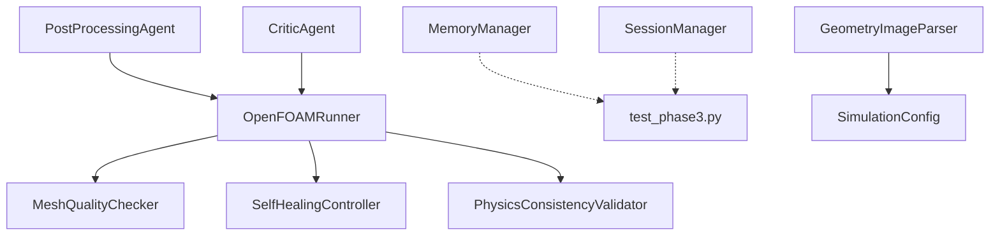

# 集成测试

<cite>
**本文档引用的文件**
- [openfoam_ai/tests/test_phase2.py](file://openfoam_ai/tests/test_phase2.py)
- [openfoam_ai/tests/test_phase3.py](file://openfoam_ai/tests/test_phase3.py)
- [openfoam_ai/tests/test_phase4.py](file://openfoam_ai/tests/test_phase4.py)
- [openfoam_ai/main_phase2.py](file://openfoam_ai/main_phase2.py)
- [openfoam_ai/main_phase3.py](file://openfoam_ai/main_phase3.py)
- [openfoam_ai/main_phase4.py](file://openfoam_ai/main_phase4.py)
- [openfoam_ai/memory/memory_manager.py](file://openfoam_ai/memory/memory_manager.py)
- [openfoam_ai/memory/session_manager.py](file://openfoam_ai/memory/session_manager.py)
- [openfoam_ai/agents/mesh_quality_agent.py](file://openfoam_ai/agents/mesh_quality_agent.py)
- [openfoam_ai/agents/self_healing_agent.py](file://openfoam_ai/agents/self_healing_agent.py)
- [openfoam_ai/agents/physics_validation_agent.py](file://openfoam_ai/agents/physics_validation_agent.py)
- [openfoam_ai/agents/critic_agent.py](file://openfoam_ai/agents/critic_agent.py)
- [openfoam_ai/agents/postprocessing_agent.py](file://openfoam_ai/agents/postprocessing_agent.py)
- [openfoam_ai/agents/geometry_image_agent.py](file://openfoam_ai/agents/geometry_image_agent.py)
- [openfoam_ai/core/openfoam_runner.py](file://openfoam_ai/core/openfoam_runner.py)
</cite>

## 目录
1. [引言](#引言)
2. [项目结构](#项目结构)
3. [核心组件](#核心组件)
4. [架构总览](#架构总览)
5. [详细组件分析](#详细组件分析)
6. [依赖关系分析](#依赖关系分析)
7. [性能考虑](#性能考虑)
8. [故障排除指南](#故障排除指南)
9. [结论](#结论)
10. [附录](#附录)

## 引言
本文件面向OpenFOAM AI项目的集成测试，系统化阐述阶段化测试的实施策略，重点覆盖Phase2（AI自查与自愈）、Phase3（记忆性建模与充分交互）、Phase4（多模态解析与后处理）三个阶段的测试目标、测试流程与验证方法。文档旨在帮助测试人员与开发人员理解模块间接口、数据流与跨模块协作的测试策略，并提供端到端工作流程的测试实施步骤、测试数据准备与结果验证方法，确保系统整体功能正确性。

## 项目结构
OpenFOAM AI采用模块化架构，核心分为：
- 阶段化入口程序：main_phase2.py、main_phase3.py、main_phase4.py
- 测试套件：tests/test_phase2.py、tests/test_phase3.py、tests/test_phase4.py
- 核心运行器：core/openfoam_runner.py（封装OpenFOAM命令执行与日志解析）
- 代理模块：agents/*（网格质量、自愈、物理验证、审查、几何图像解析、后处理）
- 记忆与会话：memory/memory_manager.py、memory/session_manager.py

图表来源
- [openfoam_ai/main_phase2.py:1-284](file://openfoam_ai/main_phase2.py#L1-L284)
- [openfoam_ai/main_phase3.py:1-486](file://openfoam_ai/main_phase3.py#L1-L486)
- [openfoam_ai/main_phase4.py:1-266](file://openfoam_ai/main_phase4.py#L1-L266)
- [openfoam_ai/core/openfoam_runner.py:1-548](file://openfoam_ai/core/openfoam_runner.py#L1-L548)

章节来源
- [openfoam_ai/main_phase2.py:1-284](file://openfoam_ai/main_phase2.py#L1-L284)
- [openfoam_ai/main_phase3.py:1-486](file://openfoam_ai/main_phase3.py#L1-L486)
- [openfoam_ai/main_phase4.py:1-266](file://openfoam_ai/main_phase4.py#L1-L266)

## 核心组件
- OpenFOAMRunner：统一执行OpenFOAM命令、捕获日志、解析指标、监控状态，为网格质量、自愈、物理验证提供底层支撑。
- MeshQualityChecker：基于checkMesh结果进行网格质量评估、问题识别与自动修复策略生成。
- SelfHealingController：实时监控求解器状态，检测发散并自动调整求解参数，支持从最新时间步重启。
- PhysicsConsistencyValidator：后处理阶段的物理一致性验证，包括质量守恒、能量守恒、收敛性等。
- CriticAgent：基于AI约束宪法的审查者Agent，进行硬约束检查与评分。
- MemoryManager：基于向量数据库的算例配置存储与检索，支持增量更新与导出导入。
- SessionManager：多轮对话与上下文管理，支持待确认操作与风险等级判定。
- GeometryImageParser：几何图像解析，将视觉输入转换为OpenFOAM配置。
- PostProcessingAgent：自然语言绘图请求解析与PyVista脚本生成，支持Mock模式。

章节来源
- [openfoam_ai/core/openfoam_runner.py:1-548](file://openfoam_ai/core/openfoam_runner.py#L1-L548)
- [openfoam_ai/agents/mesh_quality_agent.py:1-547](file://openfoam_ai/agents/mesh_quality_agent.py#L1-L547)
- [openfoam_ai/agents/self_healing_agent.py:1-642](file://openfoam_ai/agents/self_healing_agent.py#L1-L642)
- [openfoam_ai/agents/physics_validation_agent.py:1-517](file://openfoam_ai/agents/physics_validation_agent.py#L1-L517)
- [openfoam_ai/agents/critic_agent.py:1-629](file://openfoam_ai/agents/critic_agent.py#L1-L629)
- [openfoam_ai/memory/memory_manager.py:1-804](file://openfoam_ai/memory/memory_manager.py#L1-L804)
- [openfoam_ai/memory/session_manager.py:1-565](file://openfoam_ai/memory/session_manager.py#L1-L565)
- [openfoam_ai/agents/geometry_image_agent.py:1-533](file://openfoam_ai/agents/geometry_image_agent.py#L1-L533)
- [openfoam_ai/agents/postprocessing_agent.py:1-588](file://openfoam_ai/agents/postprocessing_agent.py#L1-L588)

## 架构总览
集成测试围绕“阶段化入口 → 代理模块 → 核心运行器 → 记忆/会话/后处理”的链路展开，强调：
- 模块间接口契约：如OpenFOAMRunner提供的指标解析、日志捕获接口；MemoryManager的存储/检索接口；SessionManager的消息与操作队列接口。
- 数据流验证：从几何图像解析到配置生成，从网格质量检查到自愈修复，再到物理验证与后处理输出。
- 跨模块协作：审查者Agent与生成者Agent的对抗式协作；记忆与会话在增量更新中的协同；后处理与验证的闭环。

图表来源
- [openfoam_ai/main_phase2.py:1-284](file://openfoam_ai/main_phase2.py#L1-L284)
- [openfoam_ai/main_phase3.py:1-486](file://openfoam_ai/main_phase3.py#L1-L486)
- [openfoam_ai/main_phase4.py:1-266](file://openfoam_ai/main_phase4.py#L1-L266)
- [openfoam_ai/core/openfoam_runner.py:1-548](file://openfoam_ai/core/openfoam_runner.py#L1-L548)
- [openfoam_ai/memory/memory_manager.py:1-804](file://openfoam_ai/memory/memory_manager.py#L1-L804)
- [openfoam_ai/memory/session_manager.py:1-565](file://openfoam_ai/memory/session_manager.py#L1-L565)
- [openfoam_ai/agents/postprocessing_agent.py:1-588](file://openfoam_ai/agents/postprocessing_agent.py#L1-L588)

## 详细组件分析

### 阶段二：AI自查与自愈（Phase2）
测试目标
- 验证网格质量检查器的初始化、质量评估、问题识别与修复策略有效性。
- 验证求解稳定性监控与自愈控制器的发散检测与自动修复流程。
- 验证物理一致性验证器的质量守恒、能量守恒与收敛性检查。
- 验证审查者Agent的宪法规则检查与评分体系。

测试流程
- 网格质量检查：构造测试算例目录结构，创建fvSolution/controlDict，调用MeshQualityChecker执行checkMesh并解析报告。
- 自愈流程：构造DivergenceEvent，调用SelfHealingController执行修复，验证controlDict/fvSolution的修改。
- 物理验证：构造solver.log，调用PhysicsConsistencyValidator进行质量/能量/收敛性验证。
- 审查流程：构造配置提案，调用CriticAgent进行宪法规则检查与评分。

图表来源
- [openfoam_ai/tests/test_phase2.py:1-411](file://openfoam_ai/tests/test_phase2.py#L1-L411)
- [openfoam_ai/agents/mesh_quality_agent.py:1-547](file://openfoam_ai/agents/mesh_quality_agent.py#L1-L547)
- [openfoam_ai/agents/self_healing_agent.py:1-642](file://openfoam_ai/agents/self_healing_agent.py#L1-L642)
- [openfoam_ai/agents/physics_validation_agent.py:1-517](file://openfoam_ai/agents/physics_validation_agent.py#L1-L517)
- [openfoam_ai/agents/critic_agent.py:1-629](file://openfoam_ai/agents/critic_agent.py#L1-L629)

章节来源
- [openfoam_ai/tests/test_phase2.py:1-411](file://openfoam_ai/tests/test_phase2.py#L1-L411)
- [openfoam_ai/agents/mesh_quality_agent.py:1-547](file://openfoam_ai/agents/mesh_quality_agent.py#L1-L547)
- [openfoam_ai/agents/self_healing_agent.py:1-642](file://openfoam_ai/agents/self_healing_agent.py#L1-L642)
- [openfoam_ai/agents/physics_validation_agent.py:1-517](file://openfoam_ai/agents/physics_validation_agent.py#L1-L517)
- [openfoam_ai/agents/critic_agent.py:1-629](file://openfoam_ai/agents/critic_agent.py#L1-L629)

### 阶段三：记忆性建模与充分交互（Phase3）
测试目标
- 验证ConfigurationDiffer的差异计算、应用与回滚。
- 验证MemoryManager的存储、检索、增量更新、导出导入与统计信息。
- 验证SessionManager的消息记录、当前算例上下文、待确认操作与风险等级判定。
- 验证记忆与会话在增量更新工作流中的协同。

测试流程
- 配置差异：构造旧/新配置，调用ConfigurationDiffer.compute_diff与apply_diff，验证变更摘要与应用结果。
- 记忆管理：调用MemoryManager.store_memory、search_similar、find_case_history、create_incremental_update，验证存储与检索行为。
- 会话管理：调用SessionManager.add_message、set_current_case、create_pending_operation、confirm_operation，验证上下文与操作队列。
- 集成工作流：结合MemoryManager与SessionManager，模拟用户基于历史配置的增量修改与确认流程。

图表来源
- [openfoam_ai/tests/test_phase3.py:1-549](file://openfoam_ai/tests/test_phase3.py#L1-L549)
- [openfoam_ai/memory/memory_manager.py:1-804](file://openfoam_ai/memory/memory_manager.py#L1-L804)
- [openfoam_ai/memory/session_manager.py:1-565](file://openfoam_ai/memory/session_manager.py#L1-L565)

章节来源
- [openfoam_ai/tests/test_phase3.py:1-549](file://openfoam_ai/tests/test_phase3.py#L1-L549)
- [openfoam_ai/memory/memory_manager.py:1-804](file://openfoam_ai/memory/memory_manager.py#L1-L804)
- [openfoam_ai/memory/session_manager.py:1-565](file://openfoam_ai/memory/session_manager.py#L1-L565)

### 阶段四：多模态解析与后处理（Phase4）
测试目标
- 验证几何图像解析器的Mock模式与解析结果，以及配置转换与置信度验证。
- 验证后处理Agent的自然语言绘图请求解析、PyVista脚本生成与Mock模式执行。
- 验证端到端工作流：图像解析 → 配置生成 → 后处理绘图。

测试流程
- 几何图像解析：构造测试图像文件，调用GeometryImageParser.parse_image，验证返回的GeometryFeatures类型、尺寸、边界条件与置信度。
- 配置转换：调用convert_to_simulation_config，验证生成的SimulationConfig通过硬约束验证。
- 后处理流程：调用PostProcessingAgent.parse_natural_language生成PlotRequest，生成PyVista脚本并执行（Mock模式），验证输出文件与脚本路径。

图表来源
- [openfoam_ai/tests/test_phase4.py:1-183](file://openfoam_ai/tests/test_phase4.py#L1-L183)
- [openfoam_ai/agents/geometry_image_agent.py:1-533](file://openfoam_ai/agents/geometry_image_agent.py#L1-L533)
- [openfoam_ai/agents/postprocessing_agent.py:1-588](file://openfoam_ai/agents/postprocessing_agent.py#L1-L588)

章节来源
- [openfoam_ai/tests/test_phase4.py:1-183](file://openfoam_ai/tests/test_phase4.py#L1-L183)
- [openfoam_ai/agents/geometry_image_agent.py:1-533](file://openfoam_ai/agents/geometry_image_agent.py#L1-L533)
- [openfoam_ai/agents/postprocessing_agent.py:1-588](file://openfoam_ai/agents/postprocessing_agent.py#L1-L588)

## 依赖关系分析
模块间依赖与耦合
- OpenFOAMRunner为网格质量、自愈、物理验证提供统一的日志解析与状态监控能力，是核心依赖。
- MemoryManager与SessionManager分别负责配置存储与会话上下文，彼此独立但可协同。
- 几何图像解析与后处理Agent依赖外部库（如PyVista、OpenAI），在缺失时进入Mock模式，保证测试可执行性。
- 审查者Agent依赖AI约束宪法配置，确保硬约束检查的可追溯性。

图表来源
- [openfoam_ai/core/openfoam_runner.py:1-548](file://openfoam_ai/core/openfoam_runner.py#L1-L548)
- [openfoam_ai/agents/mesh_quality_agent.py:1-547](file://openfoam_ai/agents/mesh_quality_agent.py#L1-L547)
- [openfoam_ai/agents/self_healing_agent.py:1-642](file://openfoam_ai/agents/self_healing_agent.py#L1-L642)
- [openfoam_ai/agents/physics_validation_agent.py:1-517](file://openfoam_ai/agents/physics_validation_agent.py#L1-L517)
- [openfoam_ai/memory/memory_manager.py:1-804](file://openfoam_ai/memory/memory_manager.py#L1-L804)
- [openfoam_ai/memory/session_manager.py:1-565](file://openfoam_ai/memory/session_manager.py#L1-L565)
- [openfoam_ai/agents/geometry_image_agent.py:1-533](file://openfoam_ai/agents/geometry_image_agent.py#L1-L533)
- [openfoam_ai/agents/postprocessing_agent.py:1-588](file://openfoam_ai/agents/postprocessing_agent.py#L1-L588)
- [openfoam_ai/agents/critic_agent.py:1-629](file://openfoam_ai/agents/critic_agent.py#L1-L629)

章节来源
- [openfoam_ai/core/openfoam_runner.py:1-548](file://openfoam_ai/core/openfoam_runner.py#L1-L548)
- [openfoam_ai/memory/memory_manager.py:1-804](file://openfoam_ai/memory/memory_manager.py#L1-L804)
- [openfoam_ai/memory/session_manager.py:1-565](file://openfoam_ai/memory/session_manager.py#L1-L565)
- [openfoam_ai/agents/geometry_image_agent.py:1-533](file://openfoam_ai/agents/geometry_image_agent.py#L1-L533)
- [openfoam_ai/agents/postprocessing_agent.py:1-588](file://openfoam_ai/agents/postprocessing_agent.py#L1-L588)
- [openfoam_ai/agents/critic_agent.py:1-629](file://openfoam_ai/agents/critic_agent.py#L1-L629)

## 性能考虑
- 日志解析与指标提取：OpenFOAMRunner在实时监控中频繁解析日志行，建议在测试中使用Mock日志以减少I/O开销。
- 向量存储与检索：MemoryManager在Mock模式下使用简单余弦相似度，实际部署建议使用ChromaDB并配置合适的向量维度与索引。
- 后处理脚本生成：PostProcessingAgent在Mock模式下跳过PyVista执行，实际场景中可通过批处理与缓存提升效率。
- 自愈与重启：SelfHealingController限制最大尝试次数，避免无限重启导致资源耗尽。

## 故障排除指南
常见问题与定位
- OpenFOAM命令未找到：检查OpenFOAM安装与PATH设置，OpenFOAMRunner在启动求解器时会抛出相应错误。
- 日志解析异常：UnicodeDecodeError或解析格式不符，检查日志编码与格式，必要时在测试中注入标准日志样例。
- PyVista不可用：PostProcessingAgent进入Mock模式，输出占位文件，确保测试环境具备可选依赖。
- 配置验证失败：GeometryImageParser转换配置时触发Pydantic验证错误，检查几何特征与边界条件映射。

章节来源
- [openfoam_ai/core/openfoam_runner.py:118-198](file://openfoam_ai/core/openfoam_runner.py#L118-L198)
- [openfoam_ai/agents/postprocessing_agent.py:167-171](file://openfoam_ai/agents/postprocessing_agent.py#L167-L171)
- [openfoam_ai/agents/geometry_image_agent.py:480-483](file://openfoam_ai/agents/geometry_image_agent.py#L480-L483)

## 结论
通过阶段化测试策略，OpenFOAM AI在Phase2、Phase3、Phase4三个阶段实现了从网格质量自查、自愈与物理验证，到记忆性建模与充分交互，再到多模态解析与后处理的完整闭环。测试用例覆盖了模块接口、数据流与跨模块协作，配合Mock模式与外部依赖模拟，确保在不同环境下均可稳定执行。建议在CI流水线中持续运行这些测试，以保障系统整体功能正确性与鲁棒性。

## 附录

### 执行步骤与测试数据准备
- Phase2测试
  - 运行入口：cd openfoam_ai && python -m pytest tests/test_phase2.py -v
  - 测试数据：临时目录下创建算例结构（0、constant、system、logs），并在system中放置controlDict/fvSolution。
- Phase3测试
  - 运行入口：cd openfoam_ai && python -m pytest tests/test_phase3.py -v
  - 测试数据：临时目录下创建MemoryManager与SessionManager所需的数据与配置。
- Phase4测试
  - 运行入口：cd openfoam_ai && python -m pytest tests/test_phase4.py -v
  - 测试数据：临时目录下创建测试图像文件与后处理输出目录。

### 结果验证方法
- 单元测试断言：使用unittest断言返回对象的关键属性（如质量等级、修复状态、配置差异、绘图结果）。
- 端到端验证：通过阶段入口程序（main_phaseX.py）执行完整工作流，验证日志输出与文件生成。
- Mock模式验证：在缺少外部依赖时，验证Mock模式的行为与输出文件的存在性。

章节来源
- [openfoam_ai/tests/test_phase2.py:390-411](file://openfoam_ai/tests/test_phase2.py#L390-L411)
- [openfoam_ai/tests/test_phase3.py:527-549](file://openfoam_ai/tests/test_phase3.py#L527-L549)
- [openfoam_ai/tests/test_phase4.py:164-183](file://openfoam_ai/tests/test_phase4.py#L164-L183)
- [openfoam_ai/main_phase2.py:232-247](file://openfoam_ai/main_phase2.py#L232-L247)
- [openfoam_ai/main_phase3.py:452-461](file://openfoam_ai/main_phase3.py#L452-L461)
- [openfoam_ai/main_phase4.py:248-266](file://openfoam_ai/main_phase4.py#L248-L266)