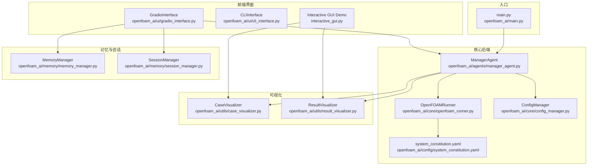
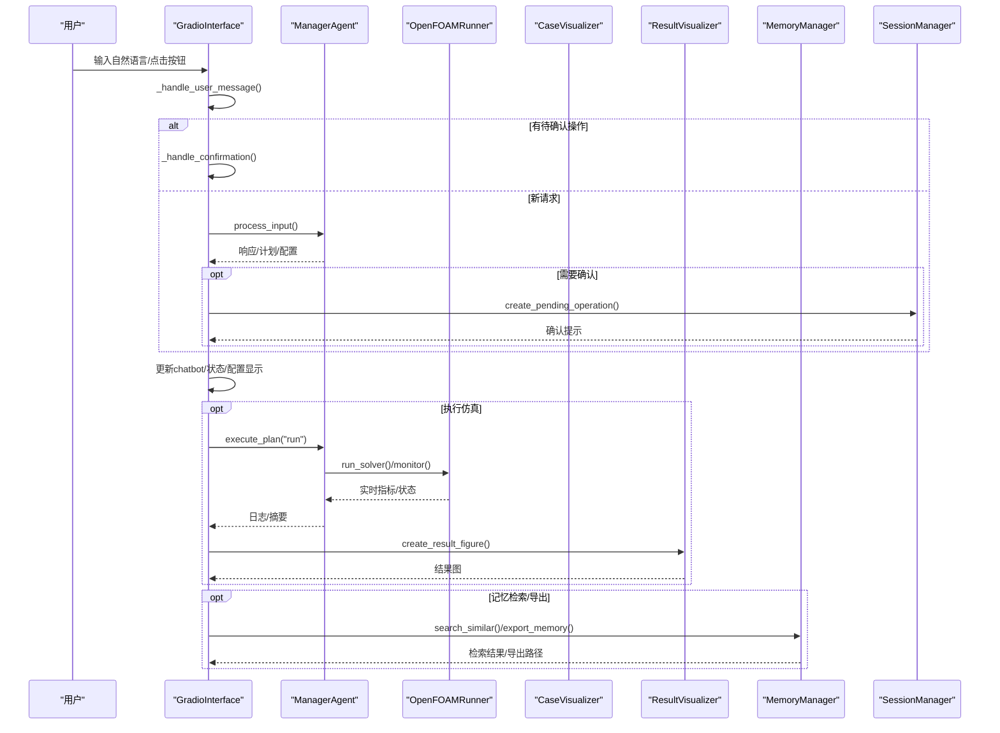
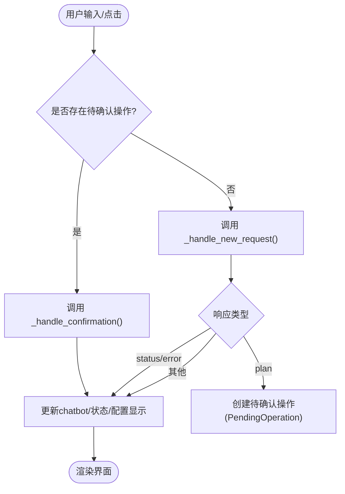
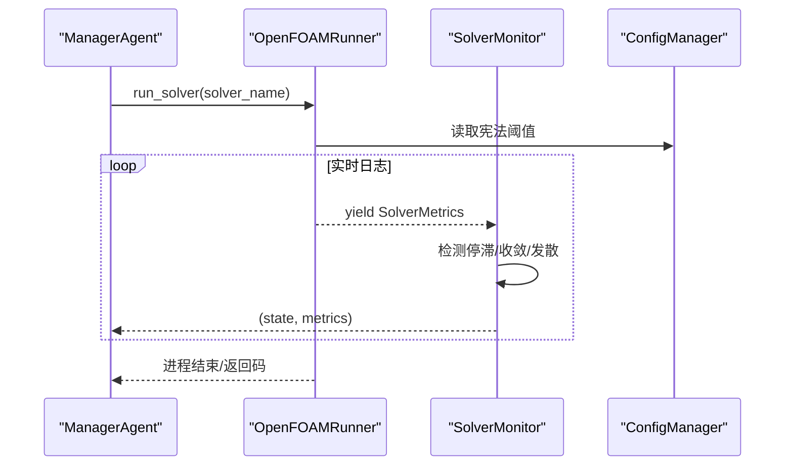
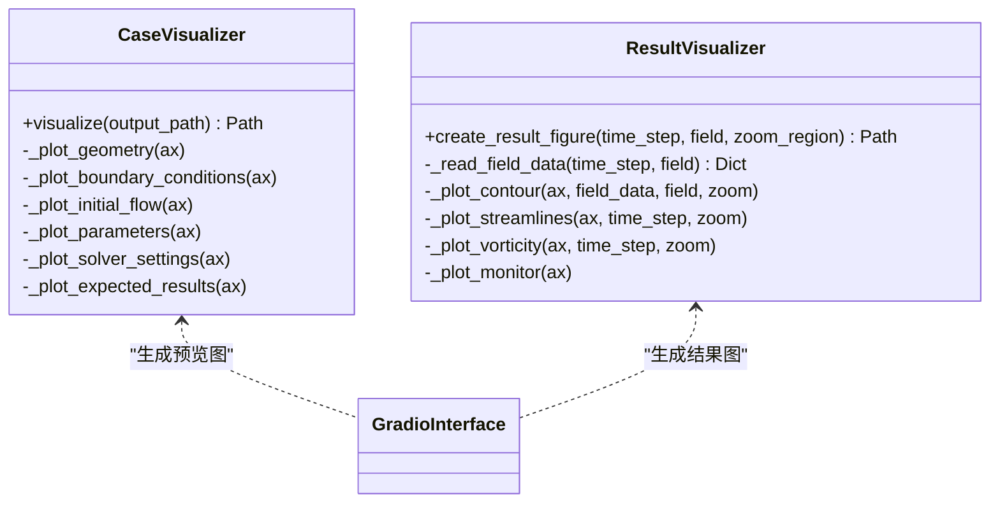
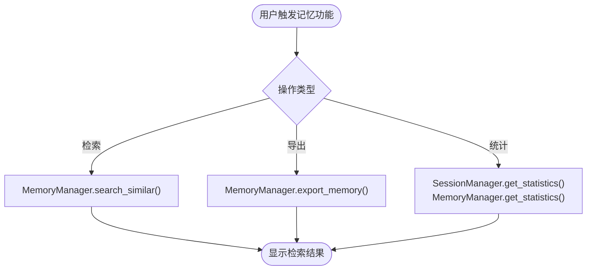
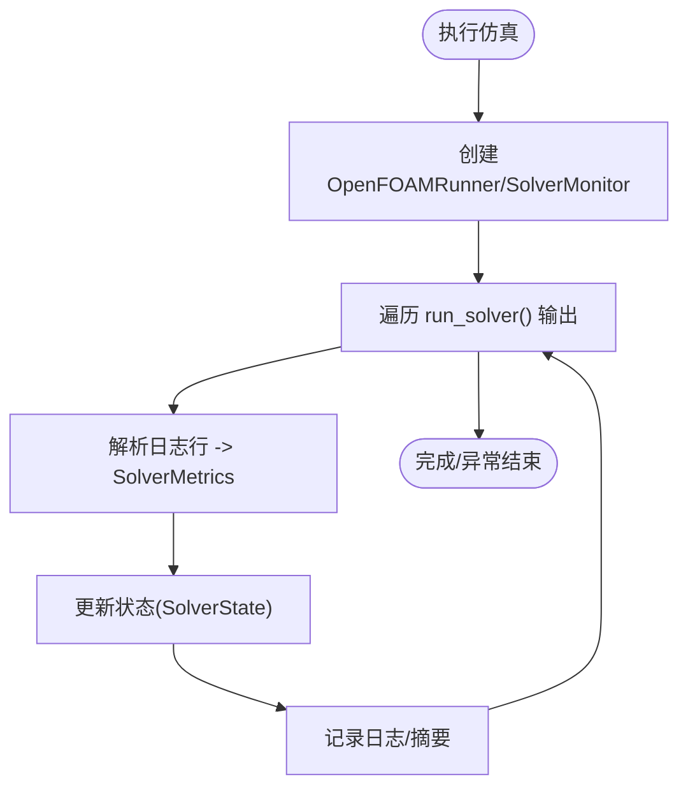
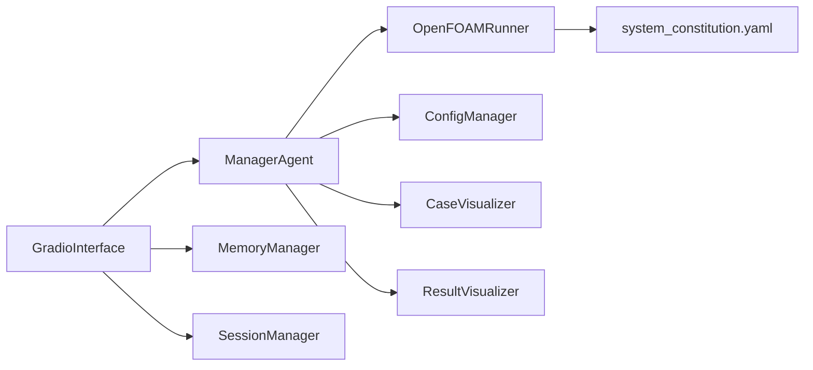

# Web界面

<cite>
**本文引用的文件**
- [openfoam_ai/ui/gradio_interface.py](file://openfoam_ai/ui/gradio_interface.py)
- [openfoam_ai/ui/cli_interface.py](file://openfoam_ai/ui/cli_interface.py)
- [openfoam_ai/main.py](file://openfoam_ai/main.py)
- [openfoam_ai/core/openfoam_runner.py](file://openfoam_ai/core/openfoam_runner.py)
- [openfoam_ai/utils/case_visualizer.py](file://openfoam_ai/utils/case_visualizer.py)
- [openfoam_ai/utils/result_visualizer.py](file://openfoam_ai/utils/result_visualizer.py)
- [openfoam_ai/memory/memory_manager.py](file://openfoam_ai/memory/memory_manager.py)
- [openfoam_ai/memory/session_manager.py](file://openfoam_ai/memory/session_manager.py)
- [openfoam_ai/agents/manager_agent.py](file://openfoam_ai/agents/manager_agent.py)
- [openfoam_ai/core/config_manager.py](file://openfoam_ai/core/config_manager.py)
- [openfoam_ai/config/system_constitution.yaml](file://openfoam_ai/config/system_constitution.yaml)
- [interactive_gui.py](file://interactive_gui.py)
- [openfoam_ai/README.md](file://openfoam_ai/README.md)
</cite>

## 目录
1. [简介](#简介)
2. [项目结构](#项目结构)
3. [核心组件](#核心组件)
4. [架构总览](#架构总览)
5. [详细组件分析](#详细组件分析)
6. [依赖关系分析](#依赖关系分析)
7. [性能考量](#性能考量)
8. [故障排查指南](#故障排查指南)
9. [结论](#结论)
10. [附录](#附录)

## 简介
本文件面向OpenFOAM AI的Web界面系统，聚焦基于Gradio的交互式Web界面，系统性阐述其实时仿真监控、结果可视化与用户体验优化设计。文档涵盖界面组件的视觉外观、交互行为与用户操作模式；记录界面元素的属性配置、事件处理与状态管理；解释与后端OpenFOAM求解器的实时通信机制；并提供界面定制选项、主题配置与响应式设计指南，以及跨浏览器兼容性与性能优化建议。同时，文档说明与OpenFOAM Runner的集成方式与数据流处理。

## 项目结构
Web界面位于openfoam_ai/ui目录下，核心文件为gradio_interface.py，提供完整的Gradio Blocks界面；配套的CLI界面cli_interface.py用于对比与命令行交互；主入口main.py提供传统交互模式；核心后端openfoam_runner.py负责与OpenFOAM的实时通信；utils目录下的case_visualizer与result_visualizer提供算例与结果可视化；memory与session模块提供记忆与会话管理；agents与core模块提供任务调度与配置管理；config目录提供系统宪法与配置。

**图表来源**
- [openfoam_ai/ui/gradio_interface.py:299-398](file://openfoam_ai/ui/gradio_interface.py#L299-L398)
- [openfoam_ai/ui/cli_interface.py:17-396](file://openfoam_ai/ui/cli_interface.py#L17-L396)
- [openfoam_ai/main.py:19-246](file://openfoam_ai/main.py#L19-L246)
- [openfoam_ai/agents/manager_agent.py:38-436](file://openfoam_ai/agents/manager_agent.py#L38-L436)
- [openfoam_ai/core/openfoam_runner.py:44-517](file://openfoam_ai/core/openfoam_runner.py#L44-L517)
- [openfoam_ai/core/config_manager.py:16-218](file://openfoam_ai/core/config_manager.py#L16-L218)
- [openfoam_ai/config/system_constitution.yaml:1-103](file://openfoam_ai/config/system_constitution.yaml#L1-L103)
- [openfoam_ai/utils/case_visualizer.py:16-82](file://openfoam_ai/utils/case_visualizer.py#L16-L82)
- [openfoam_ai/utils/result_visualizer.py:14-79](file://openfoam_ai/utils/result_visualizer.py#L14-L79)
- [openfoam_ai/memory/memory_manager.py:198-687](file://openfoam_ai/memory/memory_manager.py#L198-L687)
- [openfoam_ai/memory/session_manager.py:171-488](file://openfoam_ai/memory/session_manager.py#L171-L488)
- [interactive_gui.py:34-502](file://interactive_gui.py#L34-L502)

**章节来源**
- [openfoam_ai/ui/gradio_interface.py:299-398](file://openfoam_ai/ui/gradio_interface.py#L299-L398)
- [openfoam_ai/ui/cli_interface.py:17-396](file://openfoam_ai/ui/cli_interface.py#L17-L396)
- [openfoam_ai/main.py:19-246](file://openfoam_ai/main.py#L19-L246)
- [openfoam_ai/README.md:104-128](file://openfoam_ai/README.md#L104-L128)

## 核心组件
- Gradio界面：提供聊天机器人对话区、输入框、状态显示、配置JSON展示、记忆检索与导出、系统信息统计等区域，并绑定事件处理函数。
- ManagerAgent：负责意图识别、计划生成、执行协调与状态管理，连接LLM、配置优化、算例生成与OpenFOAM Runner。
- OpenFOAMRunner：封装OpenFOAM命令执行、日志捕获、指标解析与状态机，支持实时监控与错误处理。
- 可视化模块：CaseVisualizer生成算例预览图；ResultVisualizer生成仿真结果图与监控曲线。
- 记忆与会话：MemoryManager提供相似性检索与增量修改；SessionManager管理对话历史、上下文与待确认操作。
- 配置管理：ConfigManager加载system_constitution.yaml，提供统一配置访问与默认值合并。

**章节来源**
- [openfoam_ai/ui/gradio_interface.py:31-66](file://openfoam_ai/ui/gradio_interface.py#L31-L66)
- [openfoam_ai/agents/manager_agent.py:38-74](file://openfoam_ai/agents/manager_agent.py#L38-L74)
- [openfoam_ai/core/openfoam_runner.py:44-76](file://openfoam_ai/core/openfoam_runner.py#L44-L76)
- [openfoam_ai/utils/case_visualizer.py:16-31](file://openfoam_ai/utils/case_visualizer.py#L16-L31)
- [openfoam_ai/utils/result_visualizer.py:14-20](file://openfoam_ai/utils/result_visualizer.py#L14-L20)
- [openfoam_ai/memory/memory_manager.py:198-241](file://openfoam_ai/memory/memory_manager.py#L198-L241)
- [openfoam_ai/memory/session_manager.py:171-227](file://openfoam_ai/memory/session_manager.py#L171-L227)
- [openfoam_ai/core/config_manager.py:94-134](file://openfoam_ai/core/config_manager.py#L94-L134)

## 架构总览
Web界面通过Gradio Blocks构建，左侧为交互控制区，右侧为结果展示区。用户输入经Gradio事件绑定到GradioInterface的处理函数，后者委托ManagerAgent生成响应与计划，必要时创建待确认操作；ManagerAgent再协调OpenFOAMRunner执行命令并实时返回指标；可视化模块根据当前算例生成预览或结果图；记忆与会话模块贯穿整个流程，提供检索、统计与上下文持久化。

**图表来源**
- [openfoam_ai/ui/gradio_interface.py:99-244](file://openfoam_ai/ui/gradio_interface.py#L99-L244)
- [openfoam_ai/agents/manager_agent.py:176-338](file://openfoam_ai/agents/manager_agent.py#L176-L338)
- [openfoam_ai/core/openfoam_runner.py:99-198](file://openfoam_ai/core/openfoam_runner.py#L99-L198)
- [openfoam_ai/utils/result_visualizer.py:20-79](file://openfoam_ai/utils/result_visualizer.py#L20-L79)
- [openfoam_ai/memory/memory_manager.py:347-395](file://openfoam_ai/memory/memory_manager.py#L347-L395)
- [openfoam_ai/memory/session_manager.py:304-438](file://openfoam_ai/memory/session_manager.py#L304-L438)

## 详细组件分析

### Gradio界面组件与交互
- 布局与主题：使用Soft主题，左侧对话区与输入框，右侧状态与配置展示，记忆与系统信息折叠面板。
- 组件属性：
  - 对话历史：高度500，气泡宽度自适应。
  - 输入框：占位符提示，Scale=8。
  - 状态显示：只读文本框，初始值“就绪”。
  - 配置JSON：展示当前配置摘要。
  - 记忆检索：文本框+按钮，输出检索结果。
  - 系统信息：统计按钮+只读文本框。
- 事件绑定：
  - 发送按钮与回车提交均调用_handle_user_message，返回清空输入、更新历史、状态文本与配置显示。
  - 记忆检索与导出分别调用_handle_memory_search与_handle_export_memory。
  - 统计信息调用_handle_show_stats。
- 确认机制：若pending_operation存在，进入确认分支，支持Y/N确认或取消。

**图表来源**
- [openfoam_ai/ui/gradio_interface.py:99-193](file://openfoam_ai/ui/gradio_interface.py#L99-L193)
- [openfoam_ai/ui/gradio_interface.py:195-244](file://openfoam_ai/ui/gradio_interface.py#L195-L244)

**章节来源**
- [openfoam_ai/ui/gradio_interface.py:299-398](file://openfoam_ai/ui/gradio_interface.py#L299-L398)
- [openfoam_ai/ui/gradio_interface.py:364-391](file://openfoam_ai/ui/gradio_interface.py#L364-L391)

### 与后端OpenFOAM Runner的实时通信
- 求解器执行：ManagerAgent调用OpenFOAMRunner.run_solver，返回迭代指标（时间、库朗数、残差）。
- 实时监控：SolverMonitor遍历run_solver输出，维护指标历史，检测停滞、收敛与发散。
- 状态机：OpenFOAMRunner维护SolverState枚举，依据阈值判定状态。
- 配置与宪法：ConfigManager加载system_constitution.yaml，提供Courant、收敛阈值等标准，Runner据此判断状态。

**图表来源**
- [openfoam_ai/agents/manager_agent.py:268-338](file://openfoam_ai/agents/manager_agent.py#L268-L338)
- [openfoam_ai/core/openfoam_runner.py:99-198](file://openfoam_ai/core/openfoam_runner.py#L99-L198)
- [openfoam_ai/core/openfoam_runner.py:429-516](file://openfoam_ai/core/openfoam_runner.py#L429-L516)
- [openfoam_ai/core/config_manager.py:94-134](file://openfoam_ai/core/config_manager.py#L94-L134)
- [openfoam_ai/config/system_constitution.yaml:23-31](file://openfoam_ai/config/system_constitution.yaml#L23-L31)

**章节来源**
- [openfoam_ai/agents/manager_agent.py:268-338](file://openfoam_ai/agents/manager_agent.py#L268-L338)
- [openfoam_ai/core/openfoam_runner.py:99-198](file://openfoam_ai/core/openfoam_runner.py#L99-L198)
- [openfoam_ai/core/openfoam_runner.py:389-408](file://openfoam_ai/core/openfoam_runner.py#L389-L408)
- [openfoam_ai/core/config_manager.py:94-134](file://openfoam_ai/core/config_manager.py#L94-L134)

### 结果可视化与展示
- 算例预览：CaseVisualizer根据几何、边界条件与求解器设置生成预览图，包含几何网格示意、边界条件、初始流场、参数摘要、求解器设置与预期结果。
- 仿真结果：ResultVisualizer生成速度场/压力场云图、流线图、涡量图与收敛监控图，支持局部放大与字段切换。
- 与界面集成：Gradio界面在执行仿真后调用ResultVisualizer生成结果图，展示在右侧图像组件中。

**图表来源**
- [openfoam_ai/utils/case_visualizer.py:16-82](file://openfoam_ai/utils/case_visualizer.py#L16-L82)
- [openfoam_ai/utils/result_visualizer.py:14-79](file://openfoam_ai/utils/result_visualizer.py#L14-L79)
- [openfoam_ai/ui/gradio_interface.py:299-398](file://openfoam_ai/ui/gradio_interface.py#L299-L398)

**章节来源**
- [openfoam_ai/utils/case_visualizer.py:31-82](file://openfoam_ai/utils/case_visualizer.py#L31-L82)
- [openfoam_ai/utils/result_visualizer.py:20-79](file://openfoam_ai/utils/result_visualizer.py#L20-L79)

### 记忆与会话管理
- MemoryManager：提供相似性检索、增量更新（Diff）、导出/导入记忆，支持ChromaDB或模拟模式。
- SessionManager：管理对话历史、当前算例上下文、意图与待确认操作，支持自动保存与导出。
- Gradio界面：提供记忆检索与导出按钮，统计信息按钮展示会话与记忆统计。

**图表来源**
- [openfoam_ai/ui/gradio_interface.py:246-297](file://openfoam_ai/ui/gradio_interface.py#L246-L297)
- [openfoam_ai/memory/memory_manager.py:347-395](file://openfoam_ai/memory/memory_manager.py#L347-L395)
- [openfoam_ai/memory/session_manager.py:478-488](file://openfoam_ai/memory/session_manager.py#L478-L488)

**章节来源**
- [openfoam_ai/memory/memory_manager.py:198-687](file://openfoam_ai/memory/memory_manager.py#L198-L687)
- [openfoam_ai/memory/session_manager.py:171-488](file://openfoam_ai/memory/session_manager.py#L171-L488)
- [openfoam_ai/ui/gradio_interface.py:343-391](file://openfoam_ai/ui/gradio_interface.py#L343-L391)

### 与OpenFOAM Runner的集成与数据流
- 集成点：ManagerAgent在执行仿真时创建OpenFOAMRunner与SolverMonitor，遍历run_solver输出，收集指标并更新状态。
- 数据流：日志逐行写入logs文件，解析库朗数与残差，生成SolverMetrics，驱动状态机与UI反馈。
- 错误处理：命令执行失败、权限不足、进程异常等均有相应错误处理与状态标记。

**图表来源**
- [openfoam_ai/agents/manager_agent.py:268-338](file://openfoam_ai/agents/manager_agent.py#L268-L338)
- [openfoam_ai/core/openfoam_runner.py:99-198](file://openfoam_ai/core/openfoam_runner.py#L99-L198)
- [openfoam_ai/core/openfoam_runner.py:347-387](file://openfoam_ai/core/openfoam_runner.py#L347-L387)

**章节来源**
- [openfoam_ai/agents/manager_agent.py:268-338](file://openfoam_ai/agents/manager_agent.py#L268-L338)
- [openfoam_ai/core/openfoam_runner.py:99-198](file://openfoam_ai/core/openfoam_runner.py#L99-L198)

## 依赖关系分析
- GradioInterface依赖ManagerAgent、MemoryManager、SessionManager，负责事件绑定与界面更新。
- ManagerAgent依赖PromptEngine、CaseGenerator、CaseManager、OpenFOAMRunner、SolverMonitor、ConfigManager。
- OpenFOAMRunner依赖ConfigManager读取宪法阈值，依赖validators进行配置校验。
- 可视化模块独立于Gradio，通过文件路径返回给界面展示。
- MemoryManager与SessionManager提供持久化与检索能力，贯穿交互流程。

**图表来源**
- [openfoam_ai/ui/gradio_interface.py:26-55](file://openfoam_ai/ui/gradio_interface.py#L26-L55)
- [openfoam_ai/agents/manager_agent.py:62-64](file://openfoam_ai/agents/manager_agent.py#L62-L64)
- [openfoam_ai/core/openfoam_runner.py:55-76](file://openfoam_ai/core/openfoam_runner.py#L55-L76)
- [openfoam_ai/config/system_constitution.yaml:1-103](file://openfoam_ai/config/system_constitution.yaml#L1-L103)
- [openfoam_ai/utils/case_visualizer.py:16-21](file://openfoam_ai/utils/case_visualizer.py#L16-L21)
- [openfoam_ai/utils/result_visualizer.py:14-19](file://openfoam_ai/utils/result_visualizer.py#L14-L19)

**章节来源**
- [openfoam_ai/ui/gradio_interface.py:26-55](file://openfoam_ai/ui/gradio_interface.py#L26-L55)
- [openfoam_ai/agents/manager_agent.py:62-64](file://openfoam_ai/agents/manager_agent.py#L62-L64)
- [openfoam_ai/core/openfoam_runner.py:55-76](file://openfoam_ai/core/openfoam_runner.py#L55-L76)

## 性能考量
- Gradio Blocks渲染：合理设置组件高度与布局比例，避免大量DOM节点导致渲染卡顿。
- 实时监控：run_solver采用迭代器逐行解析，避免一次性读取大日志文件；建议在UI侧按需刷新，减少频繁重绘。
- 可视化：ResultVisualizer生成图片时使用非交互后端，避免阻塞主线程；建议在后台线程生成图片并缓存。
- 记忆检索：MemoryManager在模拟模式下使用余弦相似度计算，建议在生产环境启用ChromaDB并设置合适索引。
- 配置加载：ConfigManager使用锁保护与默认值合并，避免重复加载；建议在应用启动时预加载宪法文件。

[本节为通用指导，不直接分析具体文件]

## 故障排查指南
- Gradio不可用：若未安装gradio，GradioInterface初始化即抛出异常；需安装并重启服务。
- OpenFOAM未安装：OpenFOAMRunner启动求解器时捕获命令未找到/权限不足等异常；需正确安装并配置PATH。
- 日志解析异常：run_solver对日志行解码错误进行跳过与继续处理，避免中断；检查日志编码与文件权限。
- 记忆功能：若ChromaDB不可用，MemoryManager回退到模拟模式；可通过use_mock参数控制。
- 会话持久化：SessionStore保存失败时打印错误；检查存储路径权限与磁盘空间。

**章节来源**
- [openfoam_ai/ui/gradio_interface.py:18-24](file://openfoam_ai/ui/gradio_interface.py#L18-L24)
- [openfoam_ai/core/openfoam_runner.py:127-142](file://openfoam_ai/core/openfoam_runner.py#L127-L142)
- [openfoam_ai/core/openfoam_runner.py:169-177](file://openfoam_ai/core/openfoam_runner.py#L169-L177)
- [openfoam_ai/memory/memory_manager.py:22-29](file://openfoam_ai/memory/memory_manager.py#L22-L29)
- [openfoam_ai/memory/session_manager.py:134-135](file://openfoam_ai/memory/session_manager.py#L134-L135)

## 结论
OpenFOAM AI的Web界面以Gradio为核心，结合ManagerAgent的任务调度、OpenFOAM Runner的实时通信与可视化模块，实现了从自然语言到仿真结果的全链路体验。界面通过清晰的布局与事件绑定，提供直观的状态反馈与配置展示；通过记忆与会话管理增强交互连贯性；通过宪法与配置管理保障仿真质量与安全性。建议在生产环境中启用ChromaDB与合适的主题配置，优化实时监控与可视化性能，并完善跨浏览器兼容性测试。

[本节为总结性内容，不直接分析具体文件]

## 附录
- 主入口与交互模式：main.py提供交互模式、演示模式与快速创建模式，便于理解系统整体工作流。
- 交互式GUI演示：interactive_gui.py展示了更丰富的控制面板与动画生成功能，可作为Web界面扩展的参考。
- 界面定制与主题：GradioInterface使用Soft主题，可通过自定义CSS或主题类进一步定制；响应式布局通过scale参数实现。
- 跨浏览器兼容性：Gradio基于浏览器WebSocket通信，建议在主流浏览器中测试；注意字体与图标在不同系统上的显示差异。
- 性能优化建议：减少不必要的UI重绘、延迟加载图片、缓存可视化结果、使用异步任务处理长时间操作。

**章节来源**
- [openfoam_ai/main.py:202-246](file://openfoam_ai/main.py#L202-L246)
- [interactive_gui.py:370-502](file://interactive_gui.py#L370-L502)
- [openfoam_ai/ui/gradio_interface.py:299-301](file://openfoam_ai/ui/gradio_interface.py#L299-L301)