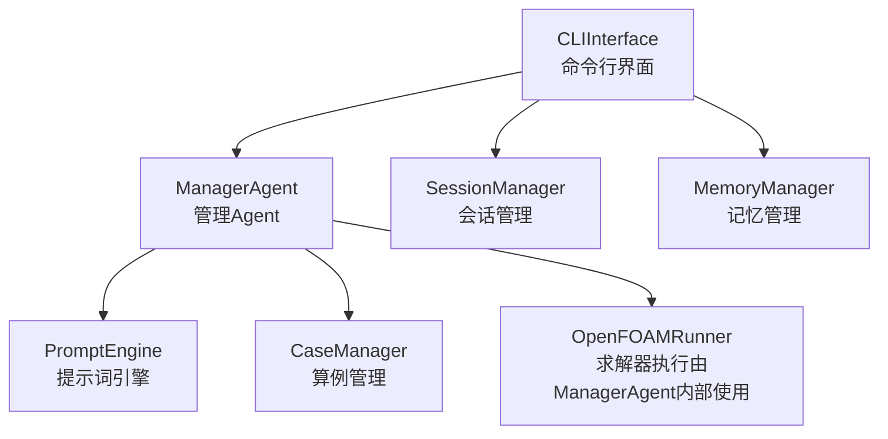
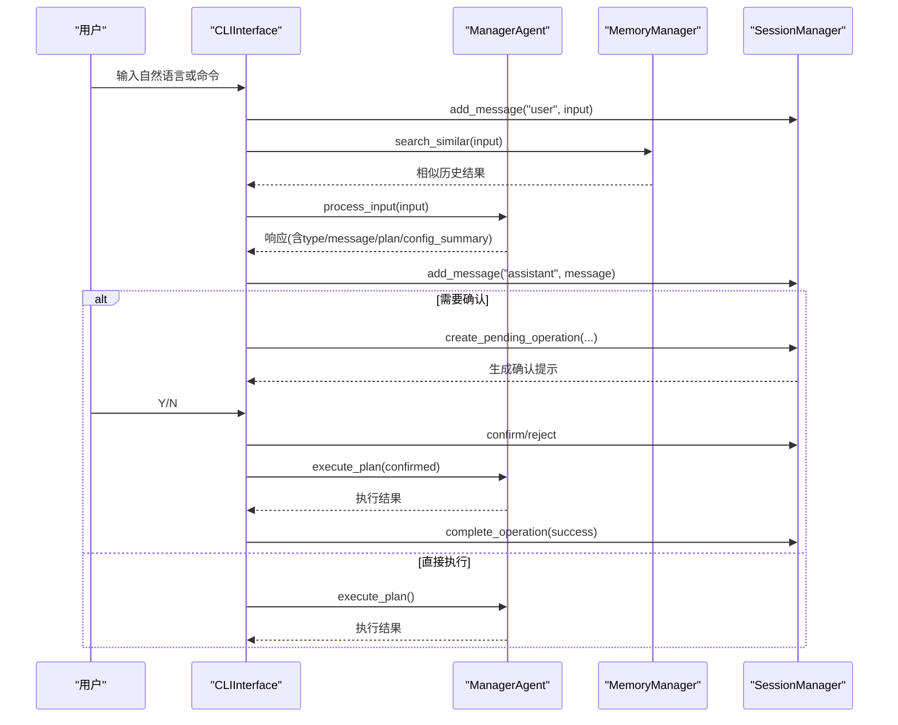
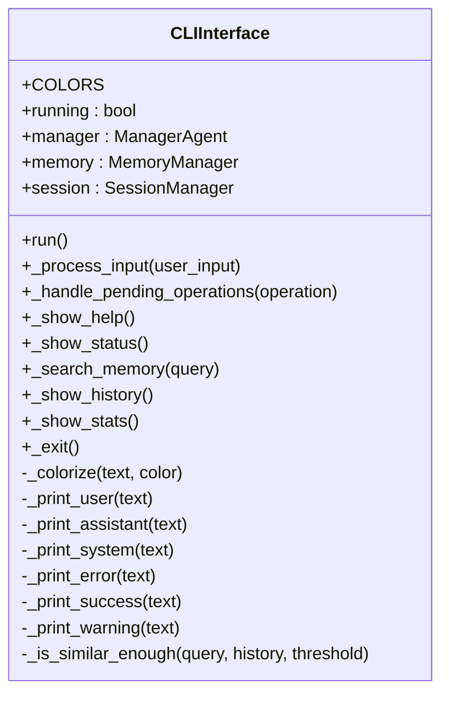
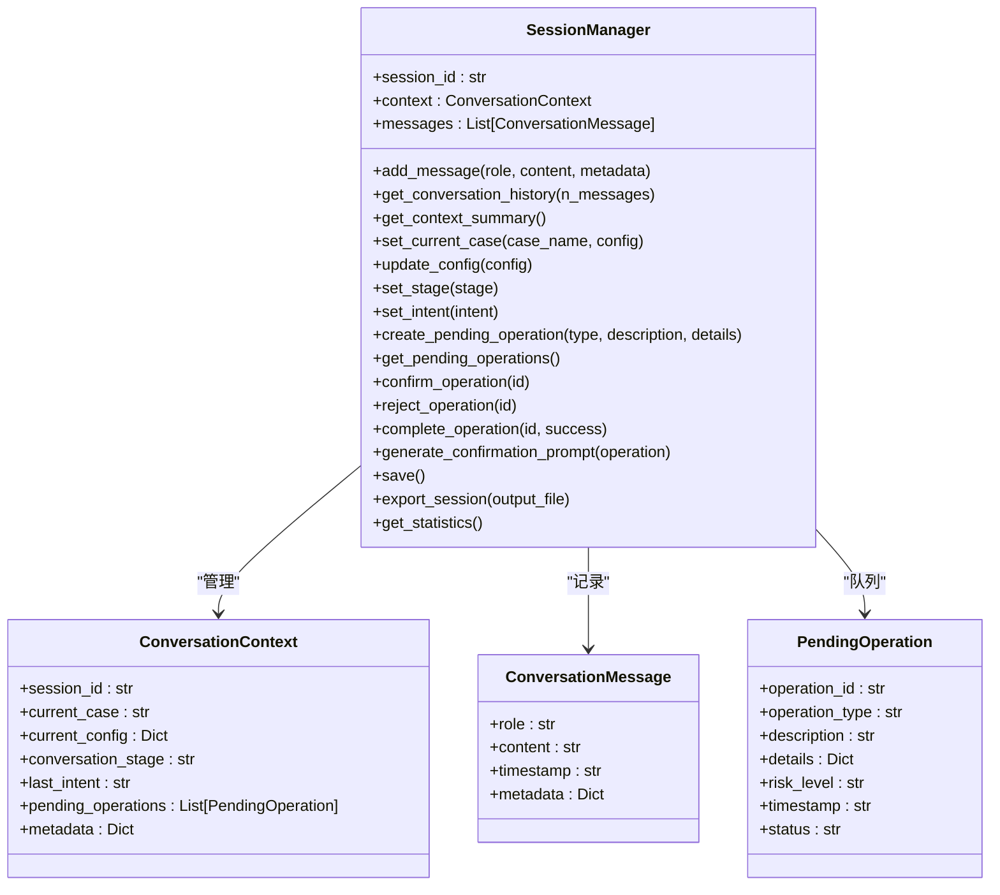
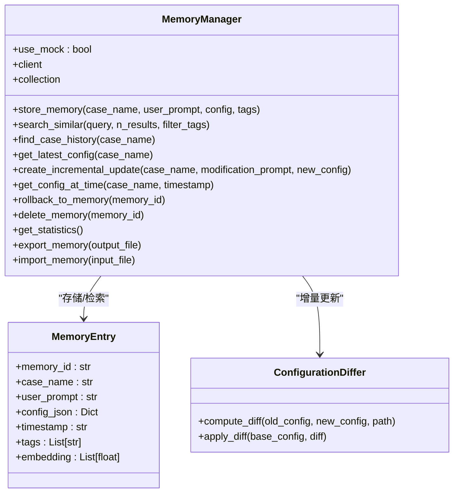
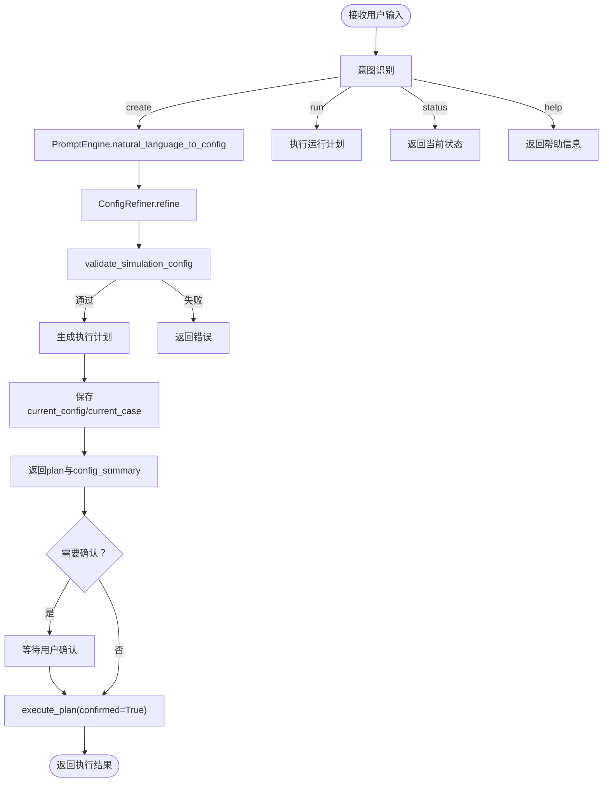
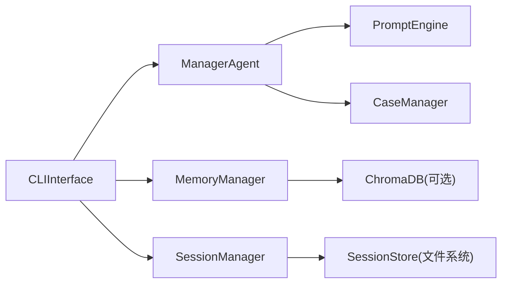

# 命令行界面

<cite>
**本文引用的文件**
- [openfoam_ai/ui/cli_interface.py](file://openfoam_ai/ui/cli_interface.py)
- [openfoam_ai/memory/session_manager.py](file://openfoam_ai/memory/session_manager.py)
- [openfoam_ai/memory/memory_manager.py](file://openfoam_ai/memory/memory_manager.py)
- [openfoam_ai/agents/manager_agent.py](file://openfoam_ai/agents/manager_agent.py)
- [openfoam_ai/main.py](file://openfoam_ai/main.py)
- [openfoam_ai/agents/prompt_engine.py](file://openfoam_ai/agents/prompt_engine.py)
- [openfoam_ai/core/case_manager.py](file://openfoam_ai/core/case_manager.py)
- [openfoam_ai/README.md](file://openfoam_ai/README.md)
</cite>

## 目录
1. [简介](#简介)
2. [项目结构](#项目结构)
3. [核心组件](#核心组件)
4. [架构总览](#架构总览)
5. [详细组件分析](#详细组件分析)
6. [依赖关系分析](#依赖关系分析)
7. [性能考量](#性能考量)
8. [故障排查指南](#故障排查指南)
9. [结论](#结论)
10. [附录](#附录)

## 简介
本文件面向OpenFOAM AI的命令行界面（CLI），系统性阐述CLIInterface类的设计与实现，覆盖多轮对话支持、记忆功能集成、操作确认机制、终端颜色系统、消息格式化与用户交互模式。同时，文档记录了可用命令（如create、run、status、history、search、stats等）的功能与使用方法，并解释会话管理、记忆检索与操作确认的工作流程。此外，还包含错误处理、键盘中断处理与异常恢复机制，以及与ManagerAgent、MemoryManager、SessionManager的集成关系，提供实际使用示例与最佳实践建议。

## 项目结构
OpenFOAM AI的命令行界面位于UI层，核心文件如下：
- CLI界面：openfoam_ai/ui/cli_interface.py
- 会话管理：openfoam_ai/memory/session_manager.py
- 记忆管理：openfoam_ai/memory/memory_manager.py
- 管理Agent：openfoam_ai/agents/manager_agent.py
- 主入口与交互模式：openfoam_ai/main.py
- 提示词引擎：openfoam_ai/agents/prompt_engine.py
- 算例管理：openfoam_ai/core/case_manager.py
- 项目说明：openfoam_ai/README.md

图表来源
- [openfoam_ai/ui/cli_interface.py:17-401](file://openfoam_ai/ui/cli_interface.py#L17-L401)
- [openfoam_ai/agents/manager_agent.py:38-458](file://openfoam_ai/agents/manager_agent.py#L38-L458)
- [openfoam_ai/memory/session_manager.py:171-565](file://openfoam_ai/memory/session_manager.py#L171-L565)
- [openfoam_ai/memory/memory_manager.py:198-804](file://openfoam_ai/memory/memory_manager.py#L198-L804)
- [openfoam_ai/agents/prompt_engine.py:20-200](file://openfoam_ai/agents/prompt_engine.py#L20-L200)
- [openfoam_ai/core/case_manager.py:27-200](file://openfoam_ai/core/case_manager.py#L27-L200)

章节来源
- [openfoam_ai/ui/cli_interface.py:1-401](file://openfoam_ai/ui/cli_interface.py#L1-L401)
- [openfoam_ai/memory/session_manager.py:1-565](file://openfoam_ai/memory/session_manager.py#L1-L565)
- [openfoam_ai/memory/memory_manager.py:1-804](file://openfoam_ai/memory/memory_manager.py#L1-L804)
- [openfoam_ai/agents/manager_agent.py:1-458](file://openfoam_ai/agents/manager_agent.py#L1-L458)
- [openfoam_ai/agents/prompt_engine.py:1-200](file://openfoam_ai/agents/prompt_engine.py#L1-L200)
- [openfoam_ai/core/case_manager.py:1-200](file://openfoam_ai/core/case_manager.py#L1-L200)
- [openfoam_ai/README.md:1-291](file://openfoam_ai/README.md#L1-L291)

## 核心组件
- CLIInterface：增强版命令行交互界面，支持多轮对话、记忆检索与操作确认；内置终端颜色系统与消息格式化。
- SessionManager：管理多轮对话上下文、当前算例、用户意图、待确认操作队列，并提供会话持久化与导出。
- MemoryManager：基于ChromaDB或模拟模式的向量数据库，支持相似性检索、增量更新与历史版本回滚。
- ManagerAgent：接收用户输入，理解意图，生成执行计划，协调各子模块，处理确认与执行。
- PromptEngine：将自然语言转换为结构化配置，支持Mock模式与真实LLM模式。
- CaseManager：管理OpenFOAM算例目录结构，创建、复制、清理、删除算例。

章节来源
- [openfoam_ai/ui/cli_interface.py:17-401](file://openfoam_ai/ui/cli_interface.py#L17-L401)
- [openfoam_ai/memory/session_manager.py:171-565](file://openfoam_ai/memory/session_manager.py#L171-L565)
- [openfoam_ai/memory/memory_manager.py:198-804](file://openfoam_ai/memory/memory_manager.py#L198-L804)
- [openfoam_ai/agents/manager_agent.py:38-458](file://openfoam_ai/agents/manager_agent.py#L38-L458)
- [openfoam_ai/agents/prompt_engine.py:20-200](file://openfoam_ai/agents/prompt_engine.py#L20-L200)
- [openfoam_ai/core/case_manager.py:27-200](file://openfoam_ai/core/case_manager.py#L27-L200)

## 架构总览
CLIInterface作为用户入口，统一调度ManagerAgent、MemoryManager与SessionManager，形成“用户输入—意图识别—计划生成—记忆检索—确认—执行”的闭环。SessionManager负责上下文与待确认操作的持久化；MemoryManager提供历史配置的相似检索与增量更新；ManagerAgent协调提示词引擎与算例管理，执行具体任务。

图表来源
- [openfoam_ai/ui/cli_interface.py:90-252](file://openfoam_ai/ui/cli_interface.py#L90-L252)
- [openfoam_ai/agents/manager_agent.py:75-206](file://openfoam_ai/agents/manager_agent.py#L75-L206)
- [openfoam_ai/memory/session_manager.py:304-439](file://openfoam_ai/memory/session_manager.py#L304-L439)
- [openfoam_ai/memory/memory_manager.py:347-420](file://openfoam_ai/memory/memory_manager.py#L347-L420)

## 详细组件分析

### CLIInterface 类设计与交互流程
- 终端颜色系统：通过COLORS字典与_colorize方法实现彩色输出，支持用户消息、助手消息、系统消息、错误、成功、警告等样式。
- 消息格式化：_print_user/_print_assistant/_print_system/_print_error/_print_success/_print_warning统一消息输出风格。
- 交互循环：run方法维护running状态，检查待确认操作，处理命令（create、run、status、history、search、stats、help、exit），并将用户输入与响应写入会话。
- 记忆检索：_process_input在处理输入前进行相似性检索，提示用户是否存在相似历史配置。
- 操作确认：当ManagerAgent返回plan时，CLI创建待确认操作，生成确认提示，等待用户Y/N确认后执行或取消。
- 统计与导出：退出时保存会话并导出记忆。

图表来源
- [openfoam_ai/ui/cli_interface.py:17-401](file://openfoam_ai/ui/cli_interface.py#L17-L401)

章节来源
- [openfoam_ai/ui/cli_interface.py:17-401](file://openfoam_ai/ui/cli_interface.py#L17-L401)

### SessionManager 会话管理
- 数据结构：ConversationContext（会话上下文）、ConversationMessage（消息）、PendingOperation（待确认操作）。
- 生命周期：初始化时尝试加载同ID会话，否则新建；自动保存策略；支持手动保存与导出。
- 上下文管理：设置当前算例、更新配置、设置对话阶段与意图；获取上下文摘要。
- 待确认操作：创建、确认、拒绝、完成；根据操作类型映射风险等级；生成确认提示文本。
- 统计信息：消息总数、用户/助手消息数、待确认操作数、当前算例、对话阶段。

图表来源
- [openfoam_ai/memory/session_manager.py:171-565](file://openfoam_ai/memory/session_manager.py#L171-L565)

章节来源
- [openfoam_ai/memory/session_manager.py:171-565](file://openfoam_ai/memory/session_manager.py#L171-L565)

### MemoryManager 记忆管理
- 存储模式：优先使用ChromaDB（duckdb+parquet），失败则回退到模拟模式（内存字典）。
- 记忆条目：MemoryEntry包含case_name、user_prompt、config_json、timestamp、tags、embedding。
- 相似性检索：生成文本向量（模拟哈希向量），在ChromaDB或模拟模式下计算余弦相似度，返回Top-N。
- 增量更新：ConfigurationDiffer计算新旧配置差异，支持Diff update与回滚到指定记忆版本。
- 导出与导入：支持导出JSON与批量导入，便于迁移与备份。

图表来源
- [openfoam_ai/memory/memory_manager.py:198-804](file://openfoam_ai/memory/memory_manager.py#L198-L804)

章节来源
- [openfoam_ai/memory/memory_manager.py:198-804](file://openfoam_ai/memory/memory_manager.py#L198-L804)

### ManagerAgent 任务调度与执行
- 意图识别：根据关键词识别create、modify、run、status、help等意图。
- 配置生成：通过PromptEngine将自然语言转为结构化配置，再经ConfigRefiner优化。
- 验证与计划：validate_simulation_config验证配置，_generate_plan生成步骤清单。
- 执行：execute_plan根据confirmed标志执行创建或运行，返回ExecutionResult。
- 状态管理：维护current_case、current_config、execution_history。

图表来源
- [openfoam_ai/agents/manager_agent.py:75-206](file://openfoam_ai/agents/manager_agent.py#L75-L206)
- [openfoam_ai/agents/prompt_engine.py:92-126](file://openfoam_ai/agents/prompt_engine.py#L92-L126)

章节来源
- [openfoam_ai/agents/manager_agent.py:38-458](file://openfoam_ai/agents/manager_agent.py#L38-L458)
- [openfoam_ai/agents/prompt_engine.py:20-200](file://openfoam_ai/agents/prompt_engine.py#L20-L200)

### 命令与使用方法
- create <描述>：创建新算例。示例：create 二维方腔驱动流。
- run：运行当前算例。
- status：查看当前状态。
- history：显示对话历史。
- search <关键词>：搜索历史配置。
- stats：显示统计信息。
- help：显示帮助。
- exit/quit/退出：退出程序。

章节来源
- [openfoam_ai/ui/cli_interface.py:253-271](file://openfoam_ai/ui/cli_interface.py#L253-L271)
- [openfoam_ai/ui/cli_interface.py:118-131](file://openfoam_ai/ui/cli_interface.py#L118-L131)

## 依赖关系分析
- CLIInterface依赖ManagerAgent、MemoryManager、SessionManager。
- ManagerAgent依赖PromptEngine、CaseManager、验证器与OpenFOAMRunner（内部使用）。
- MemoryManager依赖ChromaDB（可选）或模拟模式。
- SessionManager依赖持久化存储（SessionStore）。

图表来源
- [openfoam_ai/ui/cli_interface.py:12-14](file://openfoam_ai/ui/cli_interface.py#L12-L14)
- [openfoam_ai/agents/manager_agent.py:12-16](file://openfoam_ai/agents/manager_agent.py#L12-L16)
- [openfoam_ai/memory/memory_manager.py:22-28](file://openfoam_ai/memory/memory_manager.py#L22-L28)
- [openfoam_ai/memory/session_manager.py:108-169](file://openfoam_ai/memory/session_manager.py#L108-L169)

章节来源
- [openfoam_ai/ui/cli_interface.py:12-14](file://openfoam_ai/ui/cli_interface.py#L12-L14)
- [openfoam_ai/agents/manager_agent.py:12-16](file://openfoam_ai/agents/manager_agent.py#L12-L16)
- [openfoam_ai/memory/memory_manager.py:22-28](file://openfoam_ai/memory/memory_manager.py#L22-L28)
- [openfoam_ai/memory/session_manager.py:108-169](file://openfoam_ai/memory/session_manager.py#L108-L169)

## 性能考量
- 相似性检索：MemoryManager在模拟模式下使用余弦相似度计算，复杂度与向量维度、条目数相关；建议合理设置n_results与filter_tags以减少计算开销。
- 会话持久化：SessionManager自动保存策略避免频繁I/O，但需注意磁盘空间与写入频率。
- 颜色输出：Windows平台跳过颜色装饰，避免兼容性问题。
- 执行计划：CLI在返回plan后立即创建待确认操作，减少后续等待时间。

[本节为通用性能讨论，不直接分析具体文件]

## 故障排查指南
- 键盘中断：CLI捕获KeyboardInterrupt并优雅退出，保存会话并尝试导出记忆。
- 错误处理：run循环中捕获Exception并输出错误消息，不影响整体流程。
- OpenFOAM环境：主入口检测blockMesh命令可用性，若不可用给出警告。
- Unicode编码：README指出Windows控制台可能遇到编码问题，可通过环境变量解决。
- ChromaDB不可用：MemoryManager自动回退到模拟模式，不影响基本功能。

章节来源
- [openfoam_ai/ui/cli_interface.py:133-138](file://openfoam_ai/ui/cli_interface.py#L133-L138)
- [openfoam_ai/main.py:230-238](file://openfoam_ai/main.py#L230-L238)
- [openfoam_ai/README.md:228-230](file://openfoam_ai/README.md#L228-L230)
- [openfoam_ai/memory/memory_manager.py:233-241](file://openfoam_ai/memory/memory_manager.py#L233-L241)

## 结论
CLIInterface通过与ManagerAgent、MemoryManager、SessionManager的紧密协作，实现了“自然语言—结构化配置—执行确认—记忆检索—会话持久化”的完整工作流。其终端颜色系统与消息格式化提升了用户体验，操作确认机制保障了高风险动作的安全性。结合提示词引擎与算例管理，CLI为OpenFOAM仿真提供了直观、可控且具备记忆性的交互体验。

[本节为总结性内容，不直接分析具体文件]

## 附录

### 实际使用示例与最佳实践
- 快速创建算例：使用命令create后，CLI会提示确认，确认后由ManagerAgent执行创建并写入记忆。
- 查看状态：输入status，CLI调用SessionManager获取上下文摘要，显示当前算例、阶段、待确认操作数等。
- 搜索历史：输入search <关键词>，CLI调用MemoryManager进行相似性检索，展示匹配的历史配置。
- 历史与统计：history显示对话历史；stats显示会话与记忆库统计信息。
- 最佳实践：
  - 在执行高风险操作（如删除算例、修改边界条件）前，务必阅读确认提示中的风险等级与操作详情。
  - 使用search功能结合关键词，快速复用相似历史配置。
  - 定期导出会话与记忆，便于备份与迁移。

章节来源
- [openfoam_ai/ui/cli_interface.py:253-362](file://openfoam_ai/ui/cli_interface.py#L253-L362)
- [openfoam_ai/memory/memory_manager.py:347-420](file://openfoam_ai/memory/memory_manager.py#L347-L420)
- [openfoam_ai/memory/session_manager.py:270-279](file://openfoam_ai/memory/session_manager.py#L270-L279)